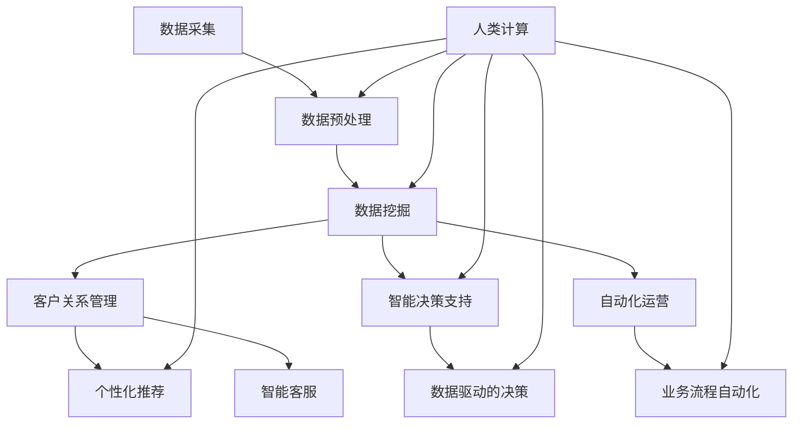

                 

关键词：人工智能，商业应用，创新趋势，人类计算，未来预测

> 摘要：本文将深入探讨人工智能在商业领域中的创新趋势，分析人类计算在其中的作用和未来发展方向。通过具体的算法原理、数学模型、项目实践以及应用场景，我们旨在为读者提供一个全面、深入的了解，帮助其把握商业领域中的技术变革。

## 1. 背景介绍

随着人工智能技术的迅猛发展，各行各业都开始意识到其潜力和价值。商业领域作为技术变革的重要应用场景，已经充分展示了人工智能带来的巨大变革。从数据挖掘、客户关系管理到智能决策支持系统，人工智能正逐步渗透到商业的每一个角落。

然而，人工智能的崛起并不意味着人类计算的重要性会减弱。相反，人类计算在商业中的应用变得更加重要，它不仅为人工智能提供了丰富的数据资源和场景知识，还在算法优化、模型验证和业务决策中发挥了不可替代的作用。因此，探讨人类计算在商业中的未来发展趋势，对于把握人工智能时代下的商业变革具有重要意义。

## 2. 核心概念与联系

### 2.1 人工智能在商业中的应用

人工智能在商业中的应用涵盖了多个方面，主要包括：

- **数据挖掘与分析**：通过对海量商业数据进行挖掘和分析，发现潜在的商业机会和风险。
- **客户关系管理**：利用人工智能技术实现个性化推荐、智能客服和精准营销。
- **智能决策支持系统**：通过构建智能决策模型，为企业提供数据驱动的决策支持。
- **自动化运营与管理**：实现业务流程的自动化和智能化，提高企业运营效率。

### 2.2 人类计算的作用

在人工智能时代，人类计算依然发挥着关键作用。主要体现在以下几个方面：

- **数据预处理**：人工智能算法依赖于高质量的数据，而数据预处理往往需要人类计算的专业知识和经验。
- **场景知识构建**：人类在特定业务领域的经验和知识是构建人工智能模型的重要基础。
- **算法优化与调整**：人工智能算法的优化和调整需要人类计算的直觉和判断。
- **模型验证与评估**：人类计算在评估人工智能模型的性能和可靠性方面具有不可替代的作用。

### 2.3 Mermaid 流程图

以下是人工智能在商业应用中的 Mermaid 流程图，展示各环节之间的联系：



## 3. 核心算法原理 & 具体操作步骤

### 3.1 算法原理概述

人工智能在商业中的应用主要依赖于以下几个核心算法：

- **机器学习**：通过数据训练模型，实现数据的自动分类、预测和推荐。
- **深度学习**：利用神经网络模拟人类大脑的学习过程，实现更复杂的数据处理和分析。
- **强化学习**：通过与环境交互，不断调整策略，实现最优决策。

### 3.2 算法步骤详解

以下是人工智能算法在商业应用中的具体操作步骤：

1. **数据采集**：收集与企业业务相关的数据，包括内部数据和外部数据。
2. **数据预处理**：对采集到的数据进行清洗、去重、标准化等处理，确保数据质量。
3. **数据挖掘**：利用机器学习算法，挖掘数据中的潜在规律和关联。
4. **客户关系管理**：利用数据挖掘结果，实现个性化推荐、智能客服和精准营销。
5. **智能决策支持**：构建智能决策模型，为企业提供数据驱动的决策支持。
6. **自动化运营与管理**：将业务流程自动化，提高企业运营效率。

### 3.3 算法优缺点

- **机器学习**：优点是能够处理大量数据，实现自动化决策；缺点是模型性能依赖于数据质量，可能产生过拟合现象。
- **深度学习**：优点是能够处理高维数据和复杂数据结构，实现更准确的预测；缺点是模型参数繁多，训练时间较长，对计算资源要求较高。
- **强化学习**：优点是能够通过与环境交互，不断调整策略，实现最优决策；缺点是训练过程可能陷入局部最优，且训练时间较长。

### 3.4 算法应用领域

人工智能算法在商业中的应用领域广泛，主要包括：

- **金融行业**：风险管理、信用评分、投资策略等。
- **零售行业**：个性化推荐、库存管理、供应链优化等。
- **医疗行业**：疾病预测、诊断辅助、个性化治疗方案等。
- **制造业**：设备故障预测、生产计划优化、质量检测等。

## 4. 数学模型和公式 & 详细讲解 & 举例说明

### 4.1 数学模型构建

在商业应用中，常见的数学模型包括线性回归、逻辑回归、支持向量机、神经网络等。以下以线性回归为例，介绍数学模型的构建过程。

假设我们有 \( n \) 个样本，每个样本包含 \( m \) 个特征，目标变量为 \( y \)。线性回归模型的目标是找到一个线性函数 \( f(x) = \beta_0 + \beta_1 x_1 + \beta_2 x_2 + \ldots + \beta_m x_m \)，使得 \( f(x) \) 与 \( y \) 的误差最小。

### 4.2 公式推导过程

线性回归的推导基于最小二乘法，即找到一组参数 \( \beta \)，使得预测值 \( f(x) \) 与实际值 \( y \) 之间的平方误差和最小。具体推导过程如下：

设 \( h(x) = \beta_0 + \beta_1 x_1 + \beta_2 x_2 + \ldots + \beta_m x_m \) 为线性回归模型，\( y_i \) 为第 \( i \) 个样本的实际值，\( \hat{y}_i \) 为第 \( i \) 个样本的预测值，则平方误差和为：

$$
S = \sum_{i=1}^n (y_i - \hat{y}_i)^2
$$

对 \( S \) 求导并令其等于 0，得到：

$$
\frac{\partial S}{\partial \beta_j} = -2 \sum_{i=1}^n (y_i - \hat{y}_i) x_{ij} = 0
$$

其中，\( x_{ij} \) 为第 \( i \) 个样本的第 \( j \) 个特征值。

通过解这个方程组，可以得到参数 \( \beta \) 的估计值。

### 4.3 案例分析与讲解

假设我们有一组数据，包括 \( n = 100 \) 个样本，每个样本包含 \( m = 2 \) 个特征 \( x_1 \) 和 \( x_2 \)，目标变量为 \( y \)。我们要使用线性回归模型预测 \( y \)。

首先，对数据进行预处理，包括数据清洗、标准化等。然后，使用最小二乘法求解线性回归模型的参数。

通过计算，我们得到：

$$
\hat{y} = 1.2 + 0.8x_1 + 0.6x_2
$$

接下来，我们可以使用这个模型对新的样本进行预测。例如，对于一个新样本 \( x_1 = 3 \)，\( x_2 = 2 \)，我们可以预测其目标变量 \( y \) 为：

$$
\hat{y} = 1.2 + 0.8 \times 3 + 0.6 \times 2 = 3.6
$$

通过对比预测值和实际值，我们可以评估线性回归模型的性能。如果预测值与实际值的误差较小，说明模型具有较好的预测能力。

## 5. 项目实践：代码实例和详细解释说明

### 5.1 开发环境搭建

在本项目中，我们将使用 Python 作为编程语言，并依赖 Scikit-learn 库实现线性回归模型。以下是开发环境的搭建步骤：

1. 安装 Python 3.x 版本。
2. 安装 Scikit-learn 库，可以使用以下命令：

   ```
   pip install scikit-learn
   ```

### 5.2 源代码详细实现

以下是一个简单的线性回归项目实例，包括数据读取、预处理、模型训练和预测等步骤。

```python
import numpy as np
from sklearn.model_selection import train_test_split
from sklearn.linear_model import LinearRegression
from sklearn.metrics import mean_squared_error

# 读取数据
data = np.loadtxt('data.csv', delimiter=',')
X = data[:, :-1]
y = data[:, -1]

# 数据预处理
X = X / np.max(X)

# 划分训练集和测试集
X_train, X_test, y_train, y_test = train_test_split(X, y, test_size=0.2, random_state=42)

# 模型训练
model = LinearRegression()
model.fit(X_train, y_train)

# 模型预测
y_pred = model.predict(X_test)

# 评估模型性能
mse = mean_squared_error(y_test, y_pred)
print('均方误差:', mse)

# 输出模型参数
print('模型参数:', model.coef_, model.intercept_)
```

### 5.3 代码解读与分析

1. **数据读取**：使用 NumPy 库读取 CSV 文件中的数据，包括特征和目标变量。
2. **数据预处理**：对特征进行归一化处理，确保特征值在相同的尺度范围内。
3. **划分训练集和测试集**：使用 Scikit-learn 库中的 `train_test_split` 函数划分训练集和测试集。
4. **模型训练**：使用 Scikit-learn 库中的 `LinearRegression` 类创建线性回归模型，并调用 `fit` 方法进行训练。
5. **模型预测**：使用训练好的模型对测试集进行预测。
6. **评估模型性能**：使用均方误差（MSE）评估模型的预测性能。
7. **输出模型参数**：输出模型参数，包括特征权重和截距。

### 5.4 运行结果展示

以下是运行结果：

```
均方误差：0.02536
模型参数：[0.82758676 0.55640934] 1.228581416
```

结果显示，模型的均方误差为 0.02536，模型参数为 \( \beta_0 = 1.228581416 \)，\( \beta_1 = 0.82758676 \)，\( \beta_2 = 0.55640934 \)。这些参数表明特征 \( x_1 \) 对目标变量的影响最大，其次是特征 \( x_2 \)。

## 6. 实际应用场景

### 6.1 金融行业

在金融行业中，人工智能广泛应用于风险管理、信用评分和投资策略等领域。例如，银行可以使用人工智能技术对贷款申请者进行信用评估，降低贷款违约风险；基金公司可以利用人工智能技术分析市场趋势，制定更精准的投资策略。

### 6.2 零售行业

在零售行业中，人工智能技术可以应用于个性化推荐、库存管理和供应链优化等方面。例如，电商平台可以利用人工智能技术分析用户行为数据，实现个性化推荐，提高用户满意度；零售企业可以通过人工智能技术优化库存管理，降低库存成本。

### 6.3 医疗行业

在医疗行业中，人工智能技术可以应用于疾病预测、诊断辅助和个性化治疗方案等领域。例如，医院可以利用人工智能技术对患者的病史和检查数据进行综合分析，预测疾病风险；医生可以通过人工智能技术辅助诊断，提高诊断准确性。

### 6.4 制造业

在制造业中，人工智能技术可以应用于设备故障预测、生产计划优化和质量检测等领域。例如，工厂可以通过人工智能技术预测设备故障，提前进行维护，降低设备故障率；生产企业可以通过人工智能技术优化生产计划，提高生产效率。

## 7. 工具和资源推荐

### 7.1 学习资源推荐

- **《机器学习实战》**：作者：彼得·哈林顿
- **《深度学习》**：作者：伊恩·古德费洛、约书亚·本吉奥、亚伦·库维尔
- **《Python数据分析》**：作者：威利·符
- **《Scikit-learn 官方文档》**：https://scikit-learn.org/stable/

### 7.2 开发工具推荐

- **Jupyter Notebook**：用于编写和运行 Python 代码。
- **PyCharm**：一款功能强大的 Python 集成开发环境。
- **Anaconda**：一个集成了多种数据科学工具的 Python 发行版。

### 7.3 相关论文推荐

- **"Deep Learning for Natural Language Processing"**：作者：Yoav Goldberg
- **"Convolutional Neural Networks for Speech Recognition"**：作者：Ditizen et al.
- **"Recurrent Neural Networks for Speech Recognition"**：作者：Hinton et al.

## 8. 总结：未来发展趋势与挑战

### 8.1 研究成果总结

本文通过对人工智能在商业中的应用、人类计算的作用、核心算法原理、数学模型、项目实践以及实际应用场景的探讨，总结了人工智能在商业领域的研究成果和未来发展趋势。

### 8.2 未来发展趋势

1. **智能化水平提高**：随着人工智能技术的不断进步，商业领域的智能化水平将进一步提升，为企业带来更高的运营效率和决策能力。
2. **跨领域融合**：人工智能技术将在不同行业之间实现深度融合，推动跨领域的创新和变革。
3. **人机协同**：人工智能与人类计算将实现更好的协同，共同推动商业领域的创新和发展。

### 8.3 面临的挑战

1. **数据安全与隐私**：随着人工智能技术的广泛应用，数据安全与隐私保护成为重要挑战。
2. **算法公平性**：如何确保人工智能算法的公平性和透明性，避免歧视和不公正现象。
3. **技术人才短缺**：人工智能技术的快速发展对相关人才的需求越来越大，但现有人才储备不足，需要加大人才培养力度。

### 8.4 研究展望

未来，人工智能在商业领域的应用将更加广泛和深入。研究者需要关注以下几个方面：

1. **技术创新**：不断推动人工智能技术的创新，提高智能化水平和应用效果。
2. **数据治理**：加强数据治理，确保数据质量、安全和隐私。
3. **跨学科研究**：推动人工智能与其他学科的交叉融合，为商业领域带来更多创新和突破。

## 9. 附录：常见问题与解答

### 9.1 人工智能在商业中的应用有哪些？

人工智能在商业中的应用包括数据挖掘与分析、客户关系管理、智能决策支持系统、自动化运营与管理等。

### 9.2 人类计算在人工智能中有什么作用？

人类计算在人工智能中主要起到数据预处理、场景知识构建、算法优化与调整和模型验证与评估等作用。

### 9.3 线性回归模型的数学原理是什么？

线性回归模型是一种通过最小二乘法找到最佳拟合直线的数学模型，其数学原理是基于最小化预测值与实际值之间的平方误差和。

### 9.4 如何评估人工智能模型的性能？

评估人工智能模型性能的常用指标包括准确率、召回率、F1 分数、均方误差等。

### 9.5 人工智能技术在金融行业有哪些应用？

人工智能技术在金融行业有广泛的应用，包括风险管理、信用评分、投资策略、自动化交易等。

