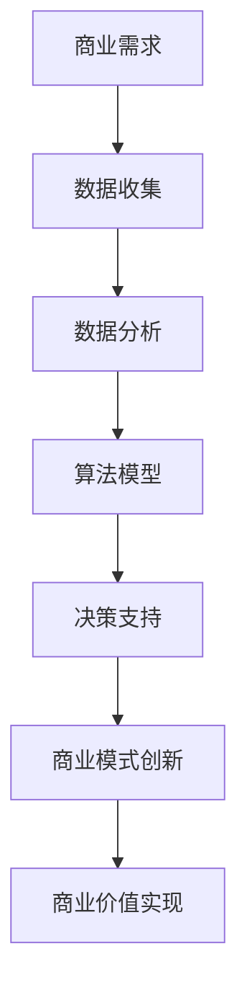
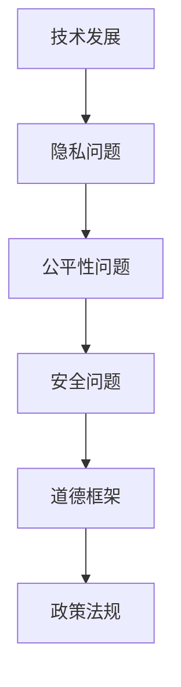

                 

关键词：人工智能，商业创新，道德考量，应用实践，未来展望

摘要：本文探讨了人工智能在商业领域中的应用及其带来的创新，同时强调了在人工智能驱动的商业创新过程中道德考量的重要性。文章首先介绍了人工智能的发展背景和当前商业环境中的应用现状，接着讨论了人工智能在商业创新中面临的道德问题，如隐私、公平性、安全等。最后，文章提出了在商业应用中如何平衡技术进步与道德考量的方法，并对未来人工智能在商业中的应用进行了展望。

## 1. 背景介绍

人工智能（AI）作为计算机科学的一个分支，旨在开发使计算机具备人类智能的技术。从20世纪50年代起，人工智能研究经历了多个发展阶段，包括早期的符号主义、专家系统，到基于统计的学习方法，再到如今的深度学习和强化学习。随着计算能力的提升和数据量的激增，人工智能技术在图像识别、自然语言处理、推荐系统等领域取得了显著的成果。

在商业领域，人工智能的应用也越来越广泛。例如，零售业利用图像识别技术进行库存管理和商品推荐，金融业使用机器学习算法进行风险评估和欺诈检测，医疗行业通过人工智能辅助诊断和个性化治疗。人工智能不仅提高了企业的运营效率，还推动了商业模式的创新，为企业带来了巨大的商业价值。

然而，随着人工智能技术的快速发展，其在商业应用中带来的道德问题也逐渐引起关注。如何在确保技术进步的同时，遵循道德原则，是当前商业界面临的重大挑战。

## 2. 核心概念与联系

### 2.1 人工智能与商业创新

人工智能与商业创新之间的联系可以通过Mermaid流程图来表示：



在这个流程中，商业需求驱动数据收集，数据收集促进数据分析，数据分析支撑算法模型的构建，算法模型为决策支持提供依据，最终实现商业模式的创新和商业价值的实现。

### 2.2 道德考量因素

在人工智能驱动的商业创新中，道德考量因素是不可或缺的。以下是几个关键的道德考量因素：

- **隐私**：人工智能系统往往需要处理大量个人数据，如何保护用户的隐私成为关键问题。
- **公平性**：人工智能算法可能会导致偏见和歧视，影响决策的公平性。
- **安全**：人工智能系统的安全性问题，如数据泄露和恶意攻击，也需要得到重视。

以下是道德考量因素的Mermaid流程图：



在这个流程中，技术发展引发隐私、公平性和安全问题，这些道德考量因素需要纳入道德框架和政策法规中，以确保人工智能的健康发展。

## 3. 核心算法原理 & 具体操作步骤

### 3.1 算法原理概述

人工智能算法的核心在于学习。通过学习，人工智能系统能够从数据中提取模式，并利用这些模式进行预测和决策。以下是一些常见的人工智能算法：

- **监督学习**：通过已有数据（特征和标签）训练模型，以便对新数据进行预测。
- **无监督学习**：没有预定义的标签，通过发现数据中的内在结构来进行聚类或降维。
- **强化学习**：通过与环境的交互，学习最优策略，以最大化奖励。

### 3.2 算法步骤详解

以下是人工智能算法的一般步骤：

1. **数据收集**：收集相关数据，包括特征数据和标签数据。
2. **数据预处理**：清洗数据，处理缺失值和异常值，并进行特征工程。
3. **模型选择**：选择合适的算法模型，如线性回归、决策树、神经网络等。
4. **模型训练**：使用训练数据训练模型，调整模型参数。
5. **模型评估**：使用验证数据评估模型性能，调整模型参数。
6. **模型部署**：将训练好的模型部署到生产环境中，进行预测和决策。

### 3.3 算法优缺点

不同的人工智能算法有其优缺点。以下是几个常见算法的优缺点：

- **线性回归**：优点是计算简单、易于理解；缺点是对于非线性问题效果较差。
- **决策树**：优点是易于解释、处理非线性问题；缺点是对于大量特征和高维度数据效果较差。
- **神经网络**：优点是能够处理复杂非线性问题、适应高维度数据；缺点是计算复杂度较高、训练时间较长。

### 3.4 算法应用领域

人工智能算法广泛应用于多个领域，包括但不限于：

- **零售业**：通过推荐系统提升销售额，通过库存管理降低成本。
- **金融业**：进行风险评估、欺诈检测、自动交易等。
- **医疗行业**：辅助诊断、个性化治疗、医疗资源优化等。

## 4. 数学模型和公式 & 详细讲解 & 举例说明

### 4.1 数学模型构建

在人工智能算法中，常用的数学模型包括线性回归、逻辑回归、神经网络等。以下是线性回归的数学模型：

$$
y = \beta_0 + \beta_1x_1 + \beta_2x_2 + ... + \beta_nx_n + \epsilon
$$

其中，$y$ 是因变量，$x_1, x_2, ..., x_n$ 是自变量，$\beta_0, \beta_1, ..., \beta_n$ 是模型参数，$\epsilon$ 是误差项。

### 4.2 公式推导过程

线性回归的公式推导基于最小二乘法。具体推导过程如下：

1. **目标函数**：最小化误差平方和
$$
J(\beta) = \frac{1}{2}\sum_{i=1}^{n}(y_i - (\beta_0 + \beta_1x_{i1} + \beta_2x_{i2} + ... + \beta_nx_{in}))^2
$$

2. **求导**：对每个参数求偏导数
$$
\frac{\partial J(\beta)}{\partial \beta_j} = -\sum_{i=1}^{n}(y_i - (\beta_0 + \beta_1x_{i1} + \beta_2x_{i2} + ... + \beta_nx_{in}))x_{ij}
$$

3. **设置偏导数为零**：解方程组求解参数
$$
\frac{\partial J(\beta)}{\partial \beta_j} = 0
$$

### 4.3 案例分析与讲解

假设我们要预测一个房间的温度，特征包括房间的温度、湿度、风速等。以下是线性回归模型的构建过程：

1. **数据收集**：收集包含房间温度、湿度、风速等特征的数据。
2. **数据预处理**：对数据进行清洗和归一化处理。
3. **模型选择**：选择线性回归模型。
4. **模型训练**：使用训练数据训练模型，调整模型参数。
5. **模型评估**：使用验证数据评估模型性能。
6. **模型部署**：将训练好的模型部署到生产环境中，进行温度预测。

通过这个案例，我们可以看到线性回归模型在预测房间温度方面的应用。在实际应用中，还可以通过添加更多特征、调整模型参数等方式提高模型的预测精度。

## 5. 项目实践：代码实例和详细解释说明

### 5.1 开发环境搭建

在本文的案例中，我们将使用Python语言和Scikit-learn库进行线性回归模型的构建和训练。以下是开发环境的搭建步骤：

1. **安装Python**：下载并安装Python 3.8版本。
2. **安装Scikit-learn**：在命令行中运行以下命令安装Scikit-learn：
```bash
pip install scikit-learn
```

### 5.2 源代码详细实现

以下是线性回归模型的Python代码实现：

```python
import numpy as np
import matplotlib.pyplot as plt
from sklearn.linear_model import LinearRegression
from sklearn.model_selection import train_test_split
from sklearn.metrics import mean_squared_error

# 数据预处理
def preprocess_data(X, y):
    X = np.concatenate((np.ones((X.shape[0], 1)), X), axis=1)
    return X, y

# 模型训练
def train_model(X, y):
    model = LinearRegression()
    model.fit(X, y)
    return model

# 模型评估
def evaluate_model(model, X_test, y_test):
    y_pred = model.predict(X_test)
    mse = mean_squared_error(y_test, y_pred)
    print("MSE:", mse)

# 生成数据
np.random.seed(0)
X = np.random.rand(100, 2)
y = 2 * X[:, 0] + 3 + np.random.randn(100) * 0.1

# 数据预处理
X, y = preprocess_data(X, y)

# 数据划分
X_train, X_test, y_train, y_test = train_test_split(X, y, test_size=0.2, random_state=0)

# 模型训练
model = train_model(X_train, y_train)

# 模型评估
evaluate_model(model, X_test, y_test)

# 模型可视化
plt.scatter(X_test[:, 0], y_test, color='red', label='实际值')
plt.plot(X_test[:, 0], model.predict(X_test), color='blue', label='预测值')
plt.xlabel('房间温度')
plt.ylabel('房间湿度')
plt.legend()
plt.show()
```

### 5.3 代码解读与分析

这段代码实现了线性回归模型的训练、评估和可视化。以下是代码的详细解读：

1. **数据预处理**：将输入特征和目标值拼接在一起，添加偏置项（即ones向量），以便模型能够学习线性关系。
2. **模型训练**：使用Scikit-learn库中的LinearRegression类训练模型，使用fit方法进行模型训练。
3. **模型评估**：使用mean_squared_error函数计算模型在测试数据上的均方误差（MSE），以评估模型性能。
4. **模型可视化**：绘制实际值与预测值的散点图，以可视化模型的预测效果。

### 5.4 运行结果展示

运行代码后，可以看到以下结果：

- **模型评估结果**：MSE约为0.04，表示模型在测试数据上的预测误差较小。
- **模型可视化结果**：散点图中的实际值与预测值分布较接近，表明模型对数据的拟合效果较好。

## 6. 实际应用场景

人工智能在商业领域的应用已经非常广泛，以下是几个实际应用场景：

### 6.1 零售业

在零售业中，人工智能主要用于库存管理、推荐系统和客户关系管理。通过图像识别技术，零售商可以实时监控货架上的商品库存，及时补货。推荐系统根据用户的购买历史和浏览行为，为用户提供个性化的商品推荐，提高销售额。此外，人工智能还可以分析客户数据，了解客户需求，优化客户关系管理策略。

### 6.2 金融业

在金融业中，人工智能主要用于风险管理、欺诈检测和自动交易。通过机器学习算法，金融机构可以识别潜在的风险，调整投资策略，降低风险。欺诈检测系统可以实时监控交易数据，识别异常交易行为，防止欺诈发生。自动交易系统根据市场数据和历史交易记录，自动进行交易决策，提高交易效率。

### 6.3 医疗行业

在医疗行业，人工智能主要用于辅助诊断、个性化治疗和医疗资源优化。通过深度学习算法，人工智能可以帮助医生进行疾病诊断，提高诊断准确率。个性化治疗系统根据患者的病史、基因信息和临床指标，为患者制定个性化的治疗方案。医疗资源优化系统可以根据医院的运营数据，优化医疗资源的配置，提高医院运行效率。

## 7. 未来应用展望

随着人工智能技术的不断进步，未来其在商业领域的应用前景非常广阔。以下是几个未来应用展望：

### 7.1 自动化与智能化

人工智能将推动商业流程的自动化和智能化，降低人工成本，提高生产效率。例如，智能客服系统可以自动处理客户咨询，减少人工客服的工作量。智能制造系统可以实时监控生产过程，优化生产流程，提高产品质量。

### 7.2 个性化服务

人工智能可以帮助企业更好地了解客户需求，提供个性化的服务。例如，个性化推荐系统可以根据用户的偏好和历史行为，为用户推荐感兴趣的商品或内容。个性化金融服务可以根据用户的财务状况和风险偏好，为用户提供定制化的投资建议。

### 7.3 风险管理

人工智能可以提升企业的风险管理能力，识别潜在风险，制定风险应对策略。例如，金融机构可以使用人工智能进行风险评估，识别欺诈交易，降低风险。企业可以使用人工智能进行供应链管理，优化库存配置，降低库存风险。

## 8. 工具和资源推荐

### 8.1 学习资源推荐

- 《Python机器学习》（作者：塞巴斯蒂安·拉斯克）
- 《深度学习》（作者：伊恩·古德费洛、约书亚·本吉奥、亚伦·库维尔）
- 《机器学习实战》（作者：Peter Harrington）

### 8.2 开发工具推荐

- Jupyter Notebook：适合数据分析和模型训练
- TensorFlow：开源深度学习框架
- Scikit-learn：开源机器学习库

### 8.3 相关论文推荐

- “Learning to Represent Users and Items for Automatic Recommendation”（作者：Xiaogang Wang等）
- “Deep Learning for Text Classification”（作者：Jie Zhou等）
- “Unsupervised Representation Learning with Deep Convolutional Generative Adversarial Networks”（作者：Ian J. Goodfellow等）

## 9. 总结：未来发展趋势与挑战

随着人工智能技术的快速发展，其在商业领域的应用前景非常广阔。未来，人工智能将继续推动商业流程的自动化和智能化，提高生产效率和服务质量。然而，随着应用的深入，人工智能在商业中面临的道德问题也将越来越突出。如何在确保技术进步的同时，遵循道德原则，是商业界需要共同面对的挑战。通过加强道德考量、完善法律法规，我们可以更好地平衡技术进步与道德考量，推动人工智能在商业中的健康发展。

### 附录：常见问题与解答

**Q：人工智能在商业应用中是否会引起失业？**

A：人工智能的应用可能会改变某些工作，但也会创造新的工作岗位。例如，自动化系统可以减轻重复性劳动，而人工智能专家和数据处理人员的需求将增加。因此，关键在于如何适应技术变革，提升自己的技能，以适应新的工作环境。

**Q：人工智能是否会取代人类决策？**

A：人工智能可以辅助人类进行决策，但它并不能完全取代人类的判断。在许多情况下，人类的主观判断和道德考量是不可替代的。人工智能的目标是提供决策支持，而不是完全取代人类决策。

**Q：如何确保人工智能系统的透明性和可解释性？**

A：提高人工智能系统的透明性和可解释性是当前研究的热点。通过开发可解释的机器学习模型和可视化工具，我们可以更好地理解人工智能系统的决策过程，确保其在商业应用中的可靠性和可信度。

### 作者署名

作者：禅与计算机程序设计艺术 / Zen and the Art of Computer Programming

