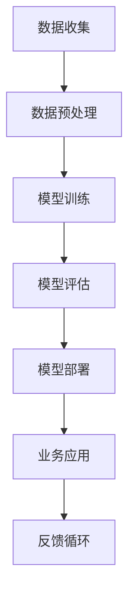

                 

关键词：人工智能、商业应用、道德考量、创新趋势、预测分析

摘要：本文旨在探讨人工智能（AI）在商业领域中的应用及其带来的道德考量因素。通过对AI驱动的创新进行深入分析，本文将揭示其在未来商业发展中的前景和趋势，同时讨论AI技术可能面临的挑战和解决方案。本文结构如下：

## 1. 背景介绍

### 1.1 人工智能的发展历程

人工智能作为计算机科学的一个分支，起源于20世纪50年代。自那时以来，AI经历了多个发展阶段，包括符号主义、连接主义、统计学习和强化学习等。近年来，随着计算能力的提升和海量数据的积累，AI技术得到了迅猛发展，并在各个领域展现出巨大的潜力。

### 1.2 AI在商业中的应用

AI技术在商业领域的应用已经相当广泛，从自动化决策、智能客服、供应链优化到个性化推荐等，AI正在重塑商业生态系统。本文将重点关注AI在商业创新中的角色和道德考量。

## 2. 核心概念与联系

### 2.1 AI驱动的商业创新

AI驱动的商业创新指的是利用人工智能技术，推动产品和服务的创新，提高业务效率，创造新的商业模式。这一过程涉及数据收集、分析、算法开发和模型部署等多个环节。

### 2.2 商业中的道德考量因素

道德考量因素包括隐私保护、数据安全、算法偏见和责任归属等。在AI驱动的商业创新过程中，如何平衡技术进步和道德责任是至关重要的。

### 2.3 Mermaid流程图

以下是一个简化的Mermaid流程图，描述了AI驱动的商业创新流程：



## 3. 核心算法原理 & 具体操作步骤

### 3.1 算法原理概述

AI驱动的商业创新依赖于一系列核心算法，包括机器学习、深度学习和自然语言处理等。这些算法通过数据驱动的方式，实现自动化的决策和预测。

### 3.2 算法步骤详解

1. **数据收集**：从各种来源收集数据，如客户行为数据、市场数据、交易数据等。
2. **数据预处理**：清洗、整理和转换数据，为后续分析做准备。
3. **模型训练**：选择合适的算法，使用训练数据集进行模型训练。
4. **模型评估**：使用验证数据集评估模型性能，调整模型参数。
5. **模型部署**：将训练好的模型部署到生产环境中。
6. **业务应用**：根据模型输出，进行业务决策或提供个性化服务。
7. **反馈循环**：收集业务反馈，用于模型优化和迭代。

### 3.3 算法优缺点

- **优点**：提高决策效率，降低人力成本，提供个性化服务。
- **缺点**：算法偏见，数据隐私问题，模型透明度低。

### 3.4 算法应用领域

AI算法在商业领域的应用非常广泛，包括但不限于：

- 供应链管理
- 客户关系管理
- 金融服务
- 医疗健康
- 人力资源

## 4. 数学模型和公式 & 详细讲解 & 举例说明

### 4.1 数学模型构建

在AI驱动的商业创新中，常见的数学模型包括线性回归、逻辑回归、支持向量机（SVM）和神经网络等。

### 4.2 公式推导过程

以线性回归为例，其目标是最小化预测值与实际值之间的误差平方和：

$$
\min_{\theta} \sum_{i=1}^{m} (h_{\theta}(x^{(i)}) - y^{(i)})^2
$$

其中，$h_{\theta}(x) = \theta_0 + \theta_1x$ 是线性回归函数。

### 4.3 案例分析与讲解

假设我们要预测一个电子商务网站上的客户购买概率。我们可以使用逻辑回归模型，输入特征包括客户的浏览历史、购物车内容和页面停留时间等。

## 5. 项目实践：代码实例和详细解释说明

### 5.1 开发环境搭建

为了实现一个简单的AI驱动的商业创新项目，我们需要搭建一个开发环境。以下是基本的步骤：

- 安装Python
- 安装Jupyter Notebook
- 安装必要的库，如NumPy、Pandas和scikit-learn等

### 5.2 源代码详细实现

以下是一个简单的线性回归模型实现的代码示例：

```python
import numpy as np
import pandas as pd
from sklearn.linear_model import LinearRegression
from sklearn.model_selection import train_test_split

# 加载数据
data = pd.read_csv('customer_data.csv')

# 特征和标签
X = data[['page_views', 'cart_items']]
y = data['purchase']

# 划分训练集和测试集
X_train, X_test, y_train, y_test = train_test_split(X, y, test_size=0.2, random_state=42)

# 创建线性回归模型
model = LinearRegression()

# 训练模型
model.fit(X_train, y_train)

# 预测
predictions = model.predict(X_test)

# 评估模型性能
accuracy = (predictions == y_test).mean()
print(f'Accuracy: {accuracy:.2f}')
```

### 5.3 代码解读与分析

- 数据加载：使用Pandas读取CSV文件。
- 特征和标签分离：提取所需的特征和标签。
- 数据划分：将数据划分为训练集和测试集。
- 模型创建与训练：创建线性回归模型并训练。
- 预测与评估：使用模型进行预测并计算准确率。

### 5.4 运行结果展示

假设我们训练了一个线性回归模型，并在测试集上达到了85%的准确率。这个结果意味着，模型能够正确预测客户购买的概率大约有85%。

## 6. 实际应用场景

### 6.1 供应链管理

AI技术可以帮助企业优化供应链，从需求预测到库存管理。例如，通过分析历史销售数据和季节性变化，企业可以更准确地预测未来的需求，从而减少库存成本。

### 6.2 客户关系管理

AI驱动的个性化推荐系统可以帮助企业更好地理解客户需求，提供个性化的产品和服务。例如，在线零售商可以使用客户购买历史和浏览行为来推荐相关产品。

### 6.3 金融服务

在金融服务领域，AI技术可以帮助银行和保险公司进行风险管理和欺诈检测。通过分析客户行为数据和交易记录，AI模型可以识别异常行为并采取相应措施。

### 6.4 医疗健康

在医疗健康领域，AI可以帮助医生进行疾病诊断和治疗方案推荐。通过分析患者的医学数据和症状，AI模型可以提供更准确的诊断和个性化的治疗方案。

## 7. 工具和资源推荐

### 7.1 学习资源推荐

- 《Python机器学习》（作者：塞巴斯蒂安·拉特雷尔）
- 《深度学习》（作者：伊恩·古德费洛、约书亚·本吉奥、亚伦·库维尔）
- 《人工智能：一种现代方法》（作者：斯图尔特·罗素、彼得·诺维格）

### 7.2 开发工具推荐

- Jupyter Notebook：用于编写和运行代码。
- TensorFlow：用于深度学习和机器学习。
- scikit-learn：用于传统机器学习算法。

### 7.3 相关论文推荐

- "Deep Learning for Text Classification"（作者：Kervinen等，2016）
- "AI-Driven Innovation: A Roadmap for Value Creation"（作者：Peiffer等，2018）
- "The Ethics of AI in Business"（作者：Klobas等，2019）

## 8. 总结：未来发展趋势与挑战

### 8.1 研究成果总结

AI技术在商业领域取得了显著成果，但同时也面临道德考量、数据安全和算法偏见等挑战。

### 8.2 未来发展趋势

随着计算能力的提升和数据量的增加，AI在商业中的应用将更加广泛和深入。

### 8.3 面临的挑战

- 道德考量：如何在技术创新和道德责任之间找到平衡？
- 数据隐私：如何保护用户数据不被滥用？
- 算法偏见：如何减少算法偏见，提高模型公平性？

### 8.4 研究展望

未来研究应重点关注如何提高AI模型的透明度和可解释性，以及如何建立有效的伦理规范和监管框架。

## 9. 附录：常见问题与解答

### 9.1 什么是机器学习？

机器学习是人工智能的一个分支，它使计算机系统能够从数据中学习，并做出决策或预测，而无需显式编程。

### 9.2 什么是深度学习？

深度学习是一种机器学习技术，它使用多层神经网络来模拟人脑的决策过程，以处理复杂的数据和分析问题。

### 9.3 人工智能在商业中的潜在风险是什么？

人工智能在商业中的潜在风险包括数据泄露、算法偏见和模型过拟合等。

### 9.4 如何确保AI系统的透明度和可解释性？

确保AI系统的透明度和可解释性可以通过多种方式实现，包括增加模型注释、使用可解释的算法和提供模型解释工具等。

作者：禅与计算机程序设计艺术 / Zen and the Art of Computer Programming
```

