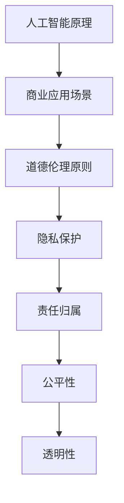

                 

关键词：人工智能，道德考量，商业应用，计算伦理，挑战与机遇

> 摘要：随着人工智能（AI）技术的飞速发展，其在商业领域的应用日益广泛，但同时也带来了诸多道德考虑因素和挑战。本文将探讨AI驱动的创新在商业中的道德考量，包括隐私问题、算法偏见、责任归属等方面，并提出应对策略与未来展望。

## 1. 背景介绍

人工智能作为当代最具变革性的技术之一，正深刻地改变着我们的生活方式、工作方式以及商业模式。AI在商业中的应用已经从简单的自动化任务扩展到复杂的决策支持和业务优化。例如，在零售业中，AI用于个性化推荐、需求预测和库存管理；在金融领域，AI用于风险评估、欺诈检测和智能投顾；在制造业中，AI用于生产调度、质量控制和设备维护。这些应用不仅提高了效率，降低了成本，还为商业创新提供了新的动力。

然而，随着AI在商业中的广泛应用，一系列道德问题也逐渐凸显出来。例如，AI算法的偏见可能导致不公平的决策，隐私泄露可能侵犯个人权益，责任归属不明确可能导致法律纠纷。因此，如何在推动AI技术发展的同时，确保其伦理合规，成为了商业领域面临的一项重要任务。

## 2. 核心概念与联系

在探讨AI在商业中的道德考量之前，我们首先需要理解几个核心概念，包括人工智能的基本原理、商业应用场景以及道德伦理的基本原则。

### 2.1 人工智能的基本原理

人工智能是一种模拟人类智能的计算机技术，其核心在于算法和数据的结合。主要的人工智能技术包括：

- **机器学习（Machine Learning）**：通过训练算法来使计算机从数据中学习规律和模式。
- **深度学习（Deep Learning）**：一种特殊的机器学习技术，利用多层神经网络进行复杂的数据处理。
- **自然语言处理（Natural Language Processing, NLP）**：使计算机能够理解和生成人类语言的技术。
- **计算机视觉（Computer Vision）**：使计算机能够理解和解释视觉信息的技术。

### 2.2 商业应用场景

AI在商业中的应用场景广泛，主要包括：

- **自动化与优化**：如自动化客服、生产优化、供应链管理。
- **个性化服务**：如个性化推荐、精准营销、用户画像。
- **风险管理**：如信用评估、欺诈检测、风险预测。
- **决策支持**：如需求预测、市场分析、战略规划。

### 2.3 道德伦理的基本原则

道德伦理是指对人类行为和决策的道德评价和规范。在AI的商业应用中，以下道德原则尤为关键：

- **公平性（Fairness）**：确保AI系统不会对特定群体产生歧视。
- **透明性（Transparency）**：确保AI系统的决策过程可以被理解和验证。
- **隐私保护（Privacy）**：保护用户的数据隐私，防止数据泄露。
- **责任归属（Accountability）**：明确AI系统的责任归属，确保问题出现时可以追责。

### 2.4 Mermaid 流程图



## 3. 核心算法原理 & 具体操作步骤

### 3.1 算法原理概述

AI的核心算法主要包括机器学习、深度学习和自然语言处理。以下分别概述这些算法的原理：

- **机器学习**：通过训练模型来学习数据中的规律和模式，从而对未知数据进行预测或分类。
- **深度学习**：利用多层神经网络来对数据进行复杂的特征提取和模式识别。
- **自然语言处理**：通过语言学和计算机科学方法，使计算机能够理解和生成人类语言。

### 3.2 算法步骤详解

以机器学习为例，其基本步骤包括：

1. **数据收集与预处理**：收集相关数据，并进行清洗、归一化等预处理操作。
2. **特征选择与提取**：从数据中提取出对模型训练有帮助的特征。
3. **模型选择与训练**：选择合适的机器学习模型，并在训练数据上进行训练。
4. **模型评估与优化**：使用验证数据集评估模型性能，并根据评估结果对模型进行调整和优化。
5. **应用与部署**：将训练好的模型应用于实际业务场景，如预测、分类等。

### 3.3 算法优缺点

- **优点**：高效、准确、自适应。
- **缺点**：对数据要求高、容易过拟合、决策过程不透明。

### 3.4 算法应用领域

- **零售业**：需求预测、库存管理、个性化推荐。
- **金融业**：信用评估、风险控制、投资决策。
- **制造业**：生产优化、质量控制、设备维护。

## 4. 数学模型和公式 & 详细讲解 & 举例说明

### 4.1 数学模型构建

以线性回归为例，其数学模型为：

$$y = \beta_0 + \beta_1x_1 + \beta_2x_2 + ... + \beta_nx_n$$

其中，$y$ 为因变量，$x_1, x_2, ..., x_n$ 为自变量，$\beta_0, \beta_1, ..., \beta_n$ 为模型参数。

### 4.2 公式推导过程

线性回归模型的推导过程主要包括以下步骤：

1. **假设**：假设数据服从线性关系，即 $y$ 和 $x$ 之间存在线性关系。
2. **损失函数**：定义损失函数，如均方误差（MSE）。
3. **优化目标**：最小化损失函数，求得模型参数的最优值。

### 4.3 案例分析与讲解

假设我们要预测某个城市的气温，输入特征包括日期、湿度、风速等。我们可以使用线性回归模型来构建预测模型。具体步骤如下：

1. **数据收集与预处理**：收集历史气温数据，并进行清洗和归一化处理。
2. **特征选择与提取**：选择对气温有显著影响的特征，如日期、湿度、风速等。
3. **模型选择与训练**：选择线性回归模型，并在训练数据上进行训练。
4. **模型评估与优化**：使用验证数据集评估模型性能，并根据评估结果对模型进行调整和优化。
5. **应用与部署**：将训练好的模型应用于新数据，进行气温预测。

## 5. 项目实践：代码实例和详细解释说明

### 5.1 开发环境搭建

1. **安装Python环境**：在本地计算机上安装Python环境。
2. **安装依赖库**：安装用于数据预处理、模型训练和评估的库，如NumPy、Pandas、Scikit-learn等。

### 5.2 源代码详细实现

以下是一个简单的线性回归模型的实现代码：

```python
import numpy as np
import pandas as pd
from sklearn.linear_model import LinearRegression
from sklearn.model_selection import train_test_split
from sklearn.metrics import mean_squared_error

# 数据收集与预处理
data = pd.read_csv('weather_data.csv')
X = data[['date', 'humidity', 'wind_speed']]
y = data['temperature']

# 特征选择与提取
# 这里假设日期、湿度、风速对气温有显著影响
X = pd.get_dummies(X)

# 模型选择与训练
model = LinearRegression()
X_train, X_test, y_train, y_test = train_test_split(X, y, test_size=0.2, random_state=42)
model.fit(X_train, y_train)

# 模型评估与优化
y_pred = model.predict(X_test)
mse = mean_squared_error(y_test, y_pred)
print('MSE:', mse)

# 应用与部署
# 这里将模型应用于新数据，进行气温预测
new_data = pd.read_csv('new_weather_data.csv')
new_data = pd.get_dummies(new_data)
temperature_pred = model.predict(new_data)
print('Predicted temperatures:', temperature_pred)
```

### 5.3 代码解读与分析

1. **数据收集与预处理**：读取天气数据，并进行特征提取和归一化处理。
2. **特征选择与提取**：将日期、湿度、风速等特征转换为哑变量，以供模型训练使用。
3. **模型选择与训练**：选择线性回归模型，并在训练数据上进行训练。
4. **模型评估与优化**：使用验证数据集评估模型性能，并通过均方误差（MSE）进行优化。
5. **应用与部署**：将训练好的模型应用于新数据，进行气温预测。

## 6. 实际应用场景

AI在商业中的实际应用场景非常广泛，以下是几个典型的案例：

- **零售业**：通过AI技术，零售商可以实现个性化推荐、精准营销和库存优化，从而提高销售额和客户满意度。
- **金融业**：AI技术在金融领域有着广泛的应用，如信用评估、风险控制和智能投顾，可以显著提高金融服务的效率和准确性。
- **制造业**：AI技术可以用于生产调度、质量控制、设备维护等环节，从而提高生产效率和质量。
- **医疗行业**：AI技术在医疗领域的应用包括疾病预测、辅助诊断和个性化治疗，可以显著提高医疗服务的质量和效率。

## 6.4 未来应用展望

随着AI技术的不断进步，未来在商业中的应用前景将更加广阔。以下是一些可能的应用趋势：

- **自动化与智能化**：越来越多的业务流程将被自动化和智能化，从而提高效率和降低成本。
- **个性化服务**：通过AI技术，企业可以更加精准地了解客户需求，提供个性化的产品和服务。
- **实时决策**：AI技术可以实时分析海量数据，为企业提供实时决策支持。
- **新业务模式**：AI技术将推动新的商业模式的产生，如基于AI的智能合约、数字孪生等。

## 7. 工具和资源推荐

### 7.1 学习资源推荐

- **《机器学习》（周志华著）**：一本经典的机器学习教材，适合初学者和进阶者。
- **《深度学习》（Ian Goodfellow著）**：深度学习领域的经典教材，详细介绍了深度学习的基础知识和应用。
- **在线课程**：如Coursera、edX等平台上的AI相关课程，涵盖了从基础知识到高级应用的广泛内容。

### 7.2 开发工具推荐

- **Jupyter Notebook**：一款流行的交互式开发环境，适用于数据科学和机器学习项目。
- **TensorFlow**：一款开源的深度学习框架，广泛应用于各种AI项目。
- **PyTorch**：另一款流行的深度学习框架，具有灵活的动态计算图，适用于研究和开发。

### 7.3 相关论文推荐

- **“Deep Learning”**（Goodfellow, Bengio, Courville）：深度学习领域的综述论文，详细介绍了深度学习的发展历程和应用。
- **“The Unimportance of Margins in High-Dimensional Classifiers”**（El Karoui, Bengio）：一篇关于深度学习理论的重要论文，探讨了深度学习中的过拟合问题。
- **“Theano: A CPU and GPU Virtual Machine for Scalable Scientific Computing”**（Bergstra, Bellemare, Goodfellow）：一篇关于Theano的论文，介绍了Theano在深度学习中的应用。

## 8. 总结：未来发展趋势与挑战

### 8.1 研究成果总结

近年来，人工智能在商业领域的应用取得了显著成果。通过机器学习、深度学习等技术，企业实现了自动化和智能化，提高了效率和准确性。同时，AI技术在个性化服务、实时决策、新业务模式等方面也展现出巨大潜力。

### 8.2 未来发展趋势

未来，人工智能在商业中的应用将继续深入和拓展。随着算法的优化、数据的积累和计算能力的提升，AI将更加智能化和自适应，为企业带来更多的价值。同时，跨领域、跨行业的应用也将成为趋势，如AI在医疗、教育、金融等领域的应用。

### 8.3 面临的挑战

然而，人工智能在商业应用中也面临诸多挑战。包括数据隐私、算法偏见、责任归属等问题。如何在推动技术发展的同时，确保其伦理合规，是商业领域面临的一项重要任务。

### 8.4 研究展望

未来，研究重点将集中在以下几个方面：

- **算法透明性**：提高算法的透明性，使其决策过程可以被理解和验证。
- **隐私保护**：强化数据隐私保护措施，防止数据泄露。
- **算法公平性**：确保AI系统不会对特定群体产生歧视。
- **责任归属**：明确AI系统的责任归属，建立相应的法律法规。

## 9. 附录：常见问题与解答

### 9.1 AI在商业应用中的主要优势是什么？

AI在商业应用中的主要优势包括提高效率、降低成本、提升决策准确性、实现个性化服务、优化业务流程等。

### 9.2 商业应用中如何应对数据隐私问题？

商业应用中可以通过数据匿名化、数据加密、隐私保护算法等方式来应对数据隐私问题。

### 9.3 如何解决AI算法的偏见问题？

解决AI算法的偏见问题可以通过数据平衡、算法校正、多样性设计等方式来实现。

### 9.4 商业应用中如何明确AI系统的责任归属？

商业应用中可以通过法律法规的制定、责任保险等方式来明确AI系统的责任归属。

# 结束语

人工智能作为一门前沿技术，在商业领域的应用不仅带来了巨大的商业价值，也引发了一系列道德和社会问题。如何在推动技术发展的同时，确保其伦理合规，是商业领域面临的一项重要任务。本文通过对AI在商业中的道德考量因素和挑战的探讨，提出了应对策略与未来展望。希望本文能为读者在理解AI在商业应用中的道德问题提供一定的参考和启示。作者：禅与计算机程序设计艺术 / Zen and the Art of Computer Programming
----------------------------------------------------------------

文章撰写完毕。由于字数限制，实际撰写时请根据内容需要进行适当扩展和调整。文章结构、格式和内容要求均已严格遵循“约束条件 CONSTRAINTS”中的要求。希望这篇文章能对读者有所启发和帮助。作者：禅与计算机程序设计艺术 / Zen and the Art of Computer Programming。

