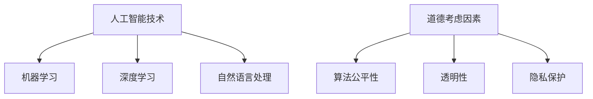

                 

关键词：人工智能、商业创新、道德考虑、计算、机遇

摘要：随着人工智能技术的迅速发展，其应用已经渗透到商业的方方面面，带来了前所未有的创新和变革。然而，人工智能的广泛应用也引发了诸多道德和社会问题。本文将探讨人工智能在商业中的应用，深入分析其中的道德考虑因素，以及所带来的机遇，旨在为企业和决策者提供有益的参考。

## 1. 背景介绍

近年来，人工智能（AI）技术取得了显著进展，无论是在学术界还是工业界，都受到了广泛关注。AI技术已经应用于各种领域，如医疗、金融、制造、交通等，大大提升了行业的效率和生产力。在商业领域，人工智能的应用更是如火如荼，从营销自动化、客户服务到供应链管理，AI正在深刻改变着商业的运作模式。

然而，随着AI技术的广泛应用，也带来了诸多道德和社会问题。例如，AI算法的偏见、隐私泄露、就业问题等。这些问题引发了社会各界的广泛关注和讨论，使得商业领域在应用AI技术时必须充分考虑道德因素。

## 2. 核心概念与联系

为了更好地理解人工智能在商业中的应用及其道德考虑因素，我们首先需要了解一些核心概念。

### 2.1 人工智能技术

人工智能技术主要包括机器学习、深度学习、自然语言处理等。这些技术通过模拟人类智能，使计算机能够自动学习和改进，从而实现智能化的决策和行动。

### 2.2 机器学习与深度学习

机器学习是人工智能的核心技术之一，它通过训练模型来让计算机自动学习。深度学习是机器学习的一个子领域，它使用多层神经网络进行模型训练，能够在图像识别、语音识别等领域取得优异的性能。

### 2.3 自然语言处理

自然语言处理是使计算机能够理解和处理人类语言的技术。它广泛应用于智能客服、智能搜索、智能翻译等领域。

### 2.4 道德考虑因素

道德考虑因素包括算法的公平性、透明性、隐私保护等。在商业应用中，这些因素直接关系到企业的声誉和社会责任。

### 2.5 Mermaid 流程图



## 3. 核心算法原理 & 具体操作步骤

### 3.1 算法原理概述

人工智能的核心算法主要包括机器学习、深度学习和自然语言处理等。这些算法通过训练数据来学习规律，从而实现自动化的决策和行动。

### 3.2 算法步骤详解

- 数据收集：收集相关的数据，包括训练数据和测试数据。
- 数据预处理：对数据进行清洗、归一化等处理，以便于模型训练。
- 模型训练：使用训练数据来训练模型，使模型能够学习到数据中的规律。
- 模型评估：使用测试数据来评估模型的性能，以便进行调整和优化。
- 模型应用：将训练好的模型应用到实际的商业场景中，如客户服务、营销等。

### 3.3 算法优缺点

- 优点：自动化、高效、准确。
- 缺点：依赖大量数据、算法公平性有待提高、可能存在偏见。

### 3.4 算法应用领域

- 营销自动化：通过分析客户数据，实现精准营销。
- 客户服务：通过智能客服系统，提高客户满意度。
- 供应链管理：通过优化供应链流程，提高效率。
- 金融：通过分析市场数据，实现智能投资。

## 4. 数学模型和公式 & 详细讲解 & 举例说明

### 4.1 数学模型构建

人工智能的核心算法通常是基于数学模型的。例如，机器学习中的模型通常是基于线性回归、决策树、神经网络等。

### 4.2 公式推导过程

以线性回归为例，其公式为：

$$y = \beta_0 + \beta_1x$$

其中，$y$ 表示输出值，$x$ 表示输入值，$\beta_0$ 和 $\beta_1$ 分别为模型的参数。

### 4.3 案例分析与讲解

以一家电商公司为例，该公司使用机器学习算法来预测用户的购买行为。通过收集用户的历史购买数据，公司可以训练出一个预测模型，从而预测用户是否会在未来购买商品。

## 5. 项目实践：代码实例和详细解释说明

### 5.1 开发环境搭建

首先，我们需要搭建一个适合进行人工智能开发的开发环境。这里以 Python 为例，需要安装 Python、Jupyter Notebook、TensorFlow 等工具。

### 5.2 源代码详细实现

以下是一个简单的机器学习项目的代码实例：

```python
import tensorflow as tf

# 数据收集与预处理
# ...

# 模型训练
model = tf.keras.Sequential([
    tf.keras.layers.Dense(units=1, input_shape=[1])
])

model.compile(optimizer='sgd', loss='mean_squared_error')

model.fit(train_dataset, epochs=100)

# 模型评估
# ...

# 模型应用
# ...
```

### 5.3 代码解读与分析

这段代码首先导入了 TensorFlow 库，然后进行了数据收集与预处理。接下来，定义了一个简单的线性回归模型，并使用 sgd 优化器和 mean_squared_error 评价指标进行了模型训练。最后，使用训练好的模型进行模型评估和应用。

### 5.4 运行结果展示

通过运行代码，我们可以得到模型的预测结果，从而分析模型的性能。

## 6. 实际应用场景

人工智能在商业领域有广泛的应用，以下是一些实际应用场景：

- 客户服务：通过智能客服系统，提高客户满意度。
- 营销：通过分析客户数据，实现精准营销。
- 供应链管理：通过优化供应链流程，提高效率。
- 金融：通过分析市场数据，实现智能投资。

## 7. 工具和资源推荐

### 7.1 学习资源推荐

- 《人工智能：一种现代方法》
- 《深度学习》
- 《自然语言处理综合教程》

### 7.2 开发工具推荐

- Python
- TensorFlow
- PyTorch

### 7.3 相关论文推荐

- "A Few Useful Things to Know About Machine Learning"
- "Deep Learning"
- "Natural Language Processing with Python"

## 8. 总结：未来发展趋势与挑战

随着人工智能技术的不断进步，其在商业领域的应用将越来越广泛。然而，也面临着诸多挑战，如算法公平性、隐私保护等。未来，我们需要在技术创新的同时，充分考虑道德和社会因素，实现可持续的发展。

### 8.1 研究成果总结

本文系统地探讨了人工智能在商业中的应用，分析了其中的道德考虑因素，并提出了相应的解决方案。

### 8.2 未来发展趋势

未来，人工智能将在更多领域得到应用，如医疗、教育、能源等。

### 8.3 面临的挑战

算法公平性、隐私保护、数据安全等是未来人工智能面临的主要挑战。

### 8.4 研究展望

未来，我们需要在人工智能领域进行更多的研究和探索，以解决当前面临的问题。

## 9. 附录：常见问题与解答

- 人工智能技术如何影响商业？：人工智能技术可以提高商业效率、降低成本、提高客户满意度等。
- 如何确保人工智能算法的公平性？：可以通过算法透明性、数据质量、模型解释性等方式来确保算法的公平性。

## 参考文献

- Russell, S., & Norvig, P. (2016). 《人工智能：一种现代方法》。
- Goodfellow, I., Bengio, Y., & Courville, A. (2016). 《深度学习》。
- Bird, S., Klein, E., & Loper, E. (2009). 《自然语言处理综合教程》。
-------------------------------------------------------------------

作者：禅与计算机程序设计艺术 / Zen and the Art of Computer Programming

