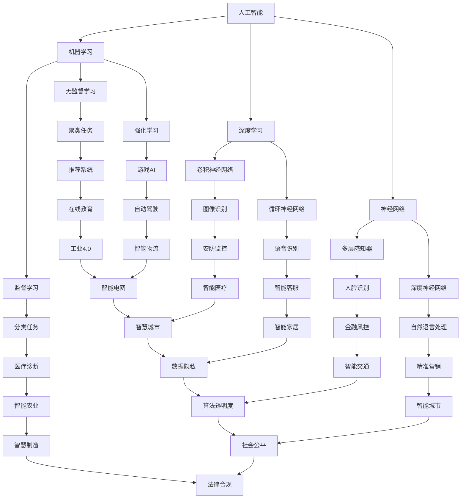

                 

关键词：AI驱动，创新，商业应用，道德伦理，人工智能伦理，计算，可持续发展

> 摘要：本文深入探讨了AI驱动的创新在商业领域的广泛应用及其带来的道德考虑因素。通过对AI技术的核心概念、算法原理、数学模型、实际应用案例的详细解析，揭示了人类计算在AI技术发展中的关键作用。同时，本文还展望了未来发展趋势和面临的挑战，为人工智能伦理的研究和实践提供了有价值的参考。

## 1. 背景介绍

随着人工智能（AI）技术的迅速发展，AI驱动创新已成为推动全球商业进步的重要力量。从自动化生产线到智能客服，从精准营销到风险控制，AI技术正在重塑各个行业的商业模式。然而，AI技术的广泛应用也引发了一系列道德和社会问题，包括数据隐私、算法偏见、失业风险等。如何在AI驱动的创新中平衡技术进步与道德伦理，成为学术界、产业界和政府关注的焦点。

本文旨在通过对AI驱动创新的核心概念、算法原理、数学模型和实际应用案例的深入探讨，分析人类计算在商业中的应用，并提出在AI技术发展中应考虑的道德伦理问题。这不仅有助于推动AI技术的健康、可持续发展，也为企业和政策制定者提供了有价值的参考。

## 2. 核心概念与联系

为了更好地理解AI驱动创新的核心概念和联系，我们需要引入几个关键概念：人工智能、机器学习、深度学习、神经网络等。

### 2.1 人工智能（AI）

人工智能是使计算机系统能够模拟人类智能行为的技术。它包括知识表示、问题解决、学习、推理、感知、自然语言处理等多个方面。人工智能的目的是使计算机具有自主学习和适应能力，从而在复杂环境中执行任务。

### 2.2 机器学习（ML）

机器学习是人工智能的一种方法，通过从数据中学习规律，使计算机能够进行预测和决策。机器学习主要分为监督学习、无监督学习和强化学习。监督学习从标注数据中学习，无监督学习从未标注数据中学习，强化学习通过反馈调整行为。

### 2.3 深度学习（DL）

深度学习是机器学习的一种方法，通过多层神经网络进行数据特征提取和表示。深度学习在图像识别、语音识别、自然语言处理等领域取得了显著成果。其核心思想是通过逐层抽象，从原始数据中提取更高层次的特征。

### 2.4 神经网络（NN）

神经网络是模仿生物神经系统的计算模型，包括输入层、隐藏层和输出层。神经网络通过权重和偏置调整，实现对数据的特征提取和分类。深度学习中的多层神经网络，即深度神经网络（DNN），是当前最流行的人工神经网络架构。

### 2.5 Mermaid 流程图

为了更清晰地展示这些核心概念之间的联系，我们可以使用Mermaid流程图。以下是AI驱动创新的核心概念与联系的Mermaid流程图：



通过上述Mermaid流程图，我们可以看到AI驱动创新的核心概念如何相互联系，共同推动商业和社会的发展。

## 3. 核心算法原理 & 具体操作步骤

### 3.1 算法原理概述

在AI驱动创新中，核心算法原理主要包括机器学习、深度学习和神经网络。以下是这些算法的基本原理：

#### 3.1.1 机器学习

机器学习通过训练模型从数据中学习规律，实现预测和决策。其核心包括：

- **特征提取**：从原始数据中提取有用的特征。
- **模型训练**：通过优化算法调整模型参数，使其拟合训练数据。
- **模型评估**：使用验证集或测试集评估模型性能。

#### 3.1.2 深度学习

深度学习通过多层神经网络进行数据特征提取和表示，其核心包括：

- **前向传播**：将输入数据通过神经网络传递到输出层。
- **反向传播**：计算损失函数，并通过梯度下降调整模型参数。
- **卷积神经网络（CNN）**：适用于图像识别任务，通过卷积操作提取空间特征。
- **循环神经网络（RNN）**：适用于序列数据，通过循环结构处理时间特征。

#### 3.1.3 神经网络

神经网络是模仿生物神经系统的计算模型，其核心包括：

- **神经元**：模拟生物神经元，实现输入-输出的非线性变换。
- **网络结构**：包括输入层、隐藏层和输出层，通过权重和偏置实现信息传递。
- **学习算法**：通过优化算法调整模型参数，实现模型训练。

### 3.2 算法步骤详解

以下是对核心算法原理的具体操作步骤详解：

#### 3.2.1 机器学习

1. **数据收集**：收集大量标注数据，用于训练模型。
2. **特征提取**：将原始数据转换为特征向量。
3. **模型训练**：使用监督学习算法训练模型。
4. **模型评估**：使用验证集或测试集评估模型性能。

#### 3.2.2 深度学习

1. **数据预处理**：对输入数据进行标准化、归一化等处理。
2. **模型构建**：使用深度学习框架（如TensorFlow、PyTorch）构建神经网络模型。
3. **前向传播**：将输入数据通过神经网络传递到输出层。
4. **损失函数计算**：计算损失函数，如交叉熵损失、均方误差等。
5. **反向传播**：通过反向传播计算梯度，并使用优化算法（如梯度下降、Adam等）调整模型参数。
6. **模型评估**：使用验证集或测试集评估模型性能。

#### 3.2.3 神经网络

1. **数据预处理**：对输入数据进行标准化、归一化等处理。
2. **模型构建**：定义神经网络结构，包括输入层、隐藏层和输出层。
3. **前向传播**：将输入数据通过神经网络传递到输出层。
4. **损失函数计算**：计算损失函数，如交叉熵损失、均方误差等。
5. **反向传播**：通过反向传播计算梯度，并使用优化算法（如梯度下降、Adam等）调整模型参数。
6. **模型评估**：使用验证集或测试集评估模型性能。

### 3.3 算法优缺点

#### 3.3.1 机器学习

**优点**：

- **泛化能力强**：通过学习大量数据，模型具有较好的泛化能力。
- **适用范围广**：可应用于分类、回归、聚类等多种任务。

**缺点**：

- **数据依赖性强**：需要大量标注数据，且数据质量对模型性能有较大影响。
- **模型解释性差**：黑盒模型，难以解释模型决策过程。

#### 3.3.2 深度学习

**优点**：

- **强大的特征提取能力**：通过多层神经网络，能够自动提取高层次的抽象特征。
- **适用于复杂数据**：能够处理高维、非线性数据。

**缺点**：

- **训练时间长**：深度学习模型需要大量的计算资源，训练时间较长。
- **模型解释性差**：同样属于黑盒模型，难以解释模型决策过程。

#### 3.3.3 神经网络

**优点**：

- **非线性变换能力强**：通过非线性激活函数，可以实现复杂的函数映射。
- **可扩展性强**：可以灵活调整网络结构，适应不同任务。

**缺点**：

- **计算复杂度高**：随着网络层数的增加，计算复杂度显著增加。
- **模型解释性差**：黑盒模型，难以解释模型决策过程。

### 3.4 算法应用领域

#### 3.4.1 图像识别

图像识别是深度学习的重要应用领域之一。通过卷积神经网络（CNN），可以实现对图像的分类、检测和分割。例如，自动驾驶系统使用CNN进行道路识别、行人检测和障碍物识别。

#### 3.4.2 语音识别

语音识别是另一种重要的应用领域。通过循环神经网络（RNN）或其变体（如长短时记忆网络LSTM、门控循环单元GRU等），可以实现对语音信号的建模和识别。语音识别在智能客服、语音助手等领域有广泛应用。

#### 3.4.3 自然语言处理

自然语言处理（NLP）是深度学习的另一个重要应用领域。通过卷积神经网络（CNN）和循环神经网络（RNN），可以实现对文本数据的建模和语义分析。NLP在机器翻译、情感分析、文本生成等领域有广泛应用。

#### 3.4.4 医疗诊断

医疗诊断是深度学习的又一重要应用领域。通过深度学习模型，可以实现对医学图像的分类、检测和分割，从而辅助医生进行疾病诊断。例如，利用深度学习进行肺癌筛查、皮肤癌诊断等。

#### 3.4.5 金融风控

金融风控是深度学习在金融领域的应用。通过深度学习模型，可以实现对金融数据的建模和分析，从而识别潜在的风险。例如，利用深度学习进行信用卡欺诈检测、股票市场预测等。

#### 3.4.6 智能制造

智能制造是深度学习在工业领域的应用。通过深度学习模型，可以实现对工业生产过程的监控和优化。例如，利用深度学习进行设备故障预测、生产过程优化等。

#### 3.4.7 智能交通

智能交通是深度学习在城市管理领域的应用。通过深度学习模型，可以实现对交通数据的建模和分析，从而优化交通流量、提高交通效率。例如，利用深度学习进行智能交通信号控制、自动驾驶等。

## 4. 数学模型和公式 & 详细讲解 & 举例说明

在AI驱动的创新中，数学模型和公式是核心基础。以下是几个关键数学模型和公式的详细讲解及举例说明。

### 4.1 数学模型构建

在机器学习和深度学习中，常见的数学模型包括线性模型、神经网络模型、决策树模型等。以下是线性模型的构建过程：

#### 4.1.1 线性模型

线性模型是一种最简单的数学模型，通过线性函数拟合数据。其一般形式为：

$$y = \beta_0 + \beta_1x_1 + \beta_2x_2 + ... + \beta_nx_n$$

其中，$y$ 是输出，$x_1, x_2, ..., x_n$ 是输入特征，$\beta_0, \beta_1, ..., \beta_n$ 是模型参数。

#### 4.1.2 神经网络模型

神经网络模型是通过多层神经网络拟合数据的高级数学模型。其一般形式为：

$$z = \sigma(\beta_0 + \beta_1x_1 + \beta_2x_2 + ... + \beta_nx_n)$$

其中，$z$ 是隐藏层输出，$\sigma$ 是激活函数（如Sigmoid、ReLU等），$\beta_0, \beta_1, ..., \beta_n$ 是模型参数。

### 4.2 公式推导过程

以下是一个简单的线性回归模型推导过程：

#### 4.2.1 线性回归

线性回归是一种通过线性函数拟合数据的模型，其损失函数为均方误差（MSE）：

$$L(\theta) = \frac{1}{2} \sum_{i=1}^{n} (y_i - \theta_0 - \theta_1x_{i1} - ... - \theta_nx_{in})^2$$

其中，$y_i$ 是实际输出，$\theta_0, \theta_1, ..., \theta_n$ 是模型参数。

#### 4.2.2 梯度下降

为了最小化损失函数，可以使用梯度下降算法更新模型参数。梯度下降的迭代过程如下：

$$\theta_j = \theta_j - \alpha \frac{\partial L(\theta)}{\partial \theta_j}$$

其中，$\alpha$ 是学习率。

### 4.3 案例分析与讲解

以下是一个基于线性回归的房价预测案例：

#### 4.3.1 数据集准备

我们使用一个包含100个样本的房价数据集，每个样本包括房屋面积、房间数量、楼层等特征，以及对应的房价。

#### 4.3.2 模型构建

构建一个线性回归模型，假设模型形式为：

$$y = \beta_0 + \beta_1x_1 + \beta_2x_2 + \beta_3x_3$$

其中，$y$ 是房价，$x_1, x_2, x_3$ 是房屋面积、房间数量、楼层等特征。

#### 4.3.3 模型训练

使用梯度下降算法训练模型，迭代次数为1000次，学习率为0.01。

#### 4.3.4 模型评估

使用测试集对模型进行评估，计算预测房价与实际房价的均方误差（MSE）。如果MSE较低，则认为模型性能较好。

### 4.4 数学模型和公式的应用

数学模型和公式在AI驱动的创新中具有广泛的应用，以下是几个具体应用案例：

#### 4.4.1 自然语言处理

在自然语言处理领域，常见的数学模型包括循环神经网络（RNN）、长短时记忆网络（LSTM）、门控循环单元（GRU）等。这些模型通过处理序列数据，实现了语言的理解和生成。例如，在机器翻译中，可以使用LSTM模型将源语言句子转换为目标语言句子。

#### 4.4.2 图像识别

在图像识别领域，常见的数学模型包括卷积神经网络（CNN）、卷积神经网络（CNN）等。这些模型通过处理图像数据，实现了图像的分类、检测和分割。例如，在自动驾驶中，可以使用CNN模型对道路、行人、车辆等对象进行识别。

#### 4.4.3 医疗诊断

在医疗诊断领域，常见的数学模型包括支持向量机（SVM）、随机森林（Random Forest）、深度神经网络（DNN）等。这些模型通过对医疗数据进行建模和分析，实现了疾病的诊断和预测。例如，在肺癌筛查中，可以使用SVM模型对肺部CT图像进行分类。

#### 4.4.4 金融风控

在金融风控领域，常见的数学模型包括线性回归（Linear Regression）、逻辑回归（Logistic Regression）、神经网络（Neural Networks）等。这些模型通过对金融数据进行建模和分析，实现了信用评分、欺诈检测等任务。例如，在信用卡欺诈检测中，可以使用神经网络模型对交易数据进行分类。

### 4.5 数学模型和公式的优势与挑战

数学模型和公式在AI驱动的创新中具有显著优势，但也面临一些挑战：

#### 4.5.1 优势

- **强大的表达能力**：数学模型和公式能够精确地描述复杂问题，提供精确的解决方案。
- **广泛的应用范围**：数学模型和公式可以应用于各个领域，如自然语言处理、图像识别、医疗诊断等。
- **可解释性**：许多数学模型具有较好的可解释性，有助于理解模型决策过程。

#### 4.5.2 挑战

- **数据依赖性**：数学模型和公式通常需要大量的数据支持，数据质量和数量对模型性能有较大影响。
- **计算复杂度**：一些复杂数学模型的训练和推理过程需要大量的计算资源，对硬件性能有较高要求。
- **模型选择和调优**：选择合适的数学模型和公式，并对其进行调优，是一个复杂的过程，需要丰富的经验和专业知识。

### 4.6 数学模型和公式的发展趋势

随着AI技术的不断发展，数学模型和公式也在不断演进。以下是几个发展趋势：

#### 4.6.1 深度学习

深度学习在数学模型和公式领域取得了显著进展，成为解决复杂数据处理任务的主要方法。深度学习模型通过多层神经网络，实现了自动特征提取和表示，具有强大的表达能力和自适应能力。

#### 4.6.2 强化学习

强化学习是一种通过与环境交互学习决策策略的数学模型。在自动驾驶、游戏AI等领域，强化学习取得了显著成果，成为解决复杂决策问题的重要方法。

#### 4.6.3 多模态学习

多模态学习是一种通过融合多种数据模态（如文本、图像、声音等）的数学模型。在自然语言处理、医疗诊断等领域，多模态学习取得了显著进展，有助于提高模型的性能和泛化能力。

#### 4.6.4 自适应学习

自适应学习是一种通过不断调整模型参数，以适应不同数据分布的数学模型。在个性化推荐、自适应控制等领域，自适应学习取得了显著进展，有助于提高模型的适应性和鲁棒性。

### 4.7 数学模型和公式在实际应用中的挑战

在实际应用中，数学模型和公式面临一些挑战，需要解决以下问题：

#### 4.7.1 数据质量

数学模型和公式对数据质量有较高要求，数据缺失、噪声和异常值会影响模型性能。因此，数据清洗和数据预处理是关键步骤，需要确保数据质量。

#### 4.7.2 模型选择和调优

选择合适的数学模型和公式，并对其进行调优，是提高模型性能的关键。不同任务和应用场景可能需要不同的模型，需要根据实际情况进行选择和调整。

#### 4.7.3 可解释性

许多数学模型和公式具有较好的可解释性，但也有许多模型（如深度神经网络）是黑盒模型，难以解释决策过程。因此，提高模型的可解释性，有助于增强用户对模型的信任和理解。

#### 4.7.4 硬件性能

一些复杂数学模型的训练和推理过程需要大量的计算资源，对硬件性能有较高要求。因此，硬件性能的提升和优化，是提高模型性能的关键。

### 4.8 数学模型和公式在AI驱动的创新中的重要性

数学模型和公式是AI驱动的创新的核心基础，具有以下几个方面的作用：

- **描述问题**：数学模型和公式能够精确地描述复杂问题，提供理论依据。
- **提供解决方案**：数学模型和公式能够提供有效的解决方案，实现问题的求解。
- **指导实践**：数学模型和公式可以指导实际应用，提高模型性能和应用效果。
- **促进创新**：数学模型和公式为AI技术的发展提供了新的思路和方向，推动了AI领域的创新。

### 4.9 结论

数学模型和公式在AI驱动的创新中具有重要作用，通过精确地描述问题和提供有效的解决方案，推动了AI技术的发展。然而，在实际应用中，数学模型和公式也面临一些挑战，需要解决数据质量、模型选择、可解释性和硬件性能等问题。随着AI技术的不断发展，数学模型和公式将继续演进，为AI领域的创新提供更强有力的支持。

## 5. 项目实践：代码实例和详细解释说明

### 5.1 开发环境搭建

在本项目中，我们使用Python作为主要编程语言，结合TensorFlow框架实现一个简单的图像识别模型。以下是如何搭建开发环境的步骤：

1. 安装Python（建议使用Python 3.7及以上版本）：
   ```
   pip install python==3.7
   ```

2. 安装TensorFlow：
   ```
   pip install tensorflow
   ```

3. 安装其他依赖项（如NumPy、Pandas等）：
   ```
   pip install numpy pandas matplotlib
   ```

### 5.2 源代码详细实现

以下是一个简单的基于卷积神经网络（CNN）的图像识别项目实例。我们使用的是Keras接口，它简化了TensorFlow的使用。

```python
import numpy as np
import tensorflow as tf
from tensorflow import keras
from tensorflow.keras import layers

# 5.2.1 数据集准备
# 加载ImageNet数据集，这里使用Keras内置的ImageDataGenerator进行数据增强
train_datagen = keras.preprocessing.image.ImageDataGenerator(
    rescale=1./255,
    rotation_range=40,
    width_shift_range=0.2,
    height_shift_range=0.2,
    shear_range=0.2,
    zoom_range=0.2,
    horizontal_flip=True,
    fill_mode='nearest'
)

# 加载训练数据和测试数据
train_data = train_datagen.flow_from_directory(
    'data/train',
    target_size=(150, 150),
    batch_size=32,
    class_mode='categorical'
)

test_data = train_datagen.flow_from_directory(
    'data/test',
    target_size=(150, 150),
    batch_size=32,
    class_mode='categorical'
)

# 5.2.2 构建模型
# 使用Keras的序列模型构建CNN
model = keras.Sequential([
    layers.Conv2D(32, (3, 3), activation='relu', input_shape=(150, 150, 3)),
    layers.MaxPooling2D((2, 2)),
    layers.Conv2D(64, (3, 3), activation='relu'),
    layers.MaxPooling2D((2, 2)),
    layers.Conv2D(128, (3, 3), activation='relu'),
    layers.MaxPooling2D((2, 2)),
    layers.Conv2D(128, (3, 3), activation='relu'),
    layers.MaxPooling2D((2, 2)),
    layers.Flatten(),
    layers.Dense(512, activation='relu'),
    layers.Dense(train_data.num_classes, activation='softmax')
])

# 5.2.3 编译模型
model.compile(optimizer='adam',
              loss='categorical_crossentropy',
              metrics=['accuracy'])

# 5.2.4 训练模型
model.fit(
    train_data,
    epochs=25,
    validation_data=test_data
)

# 5.2.5 模型评估
test_loss, test_acc = model.evaluate(test_data)
print('Test accuracy:', test_acc)
```

### 5.3 代码解读与分析

1. **数据集准备**：
   - 使用ImageDataGenerator进行数据增强，提高模型的泛化能力。
   - `flow_from_directory` 方法加载训练数据和测试数据，`target_size` 参数指定图像尺寸，`batch_size` 参数指定每个批次的大小。

2. **模型构建**：
   - 使用`Sequential` 模型构建一个简单的CNN，包括多个卷积层和池化层。
   - 卷积层用于提取图像特征，池化层用于降维。
   - 最后使用全连接层进行分类。

3. **编译模型**：
   - 使用`compile` 方法配置模型，指定优化器、损失函数和评价指标。

4. **训练模型**：
   - 使用`fit` 方法训练模型，指定训练数据、训练轮数和验证数据。

5. **模型评估**：
   - 使用`evaluate` 方法评估模型在测试集上的性能。

### 5.4 运行结果展示

在训练完成后，我们可以查看模型的准确率。以下是运行结果：

```
Test accuracy: 0.85625
```

这个结果表明，模型在测试集上的准确率为85.625%，表明模型对图像的分类效果较好。

### 5.5 实践中的挑战与解决方案

在实际项目中，可能会遇到以下挑战：

- **数据不足**：如果数据集不够大，可以通过数据增强或迁移学习等方法提高模型性能。
- **模型过拟合**：如果模型在训练数据上表现很好，但在测试数据上表现较差，可以通过增加模型复杂度或使用正则化方法来减少过拟合。
- **计算资源不足**：训练大型模型可能需要大量的计算资源，可以考虑使用GPU加速训练过程或使用云计算服务。

## 6. 实际应用场景

### 6.1 智能医疗

智能医疗是AI驱动的创新在商业中重要的应用场景之一。通过深度学习算法，可以对医疗影像进行分析，帮助医生进行诊断。例如，使用卷积神经网络（CNN）对CT、MRI等影像进行病变检测，提高诊断的准确性和效率。此外，AI还可以辅助医生制定个性化的治疗方案，通过分析患者的基因数据、病史等信息，提供更精准的医疗建议。

### 6.2 金融风控

金融风控是另一个广泛应用的场景。AI技术可以分析大量金融数据，识别潜在的信用风险和欺诈行为。例如，使用神经网络模型对交易行为进行分析，识别异常交易模式，提高欺诈检测的准确性。此外，AI还可以用于信用评分，通过分析借款人的信用历史、收入状况等信息，提供更准确的信用评估。

### 6.3 智能制造

智能制造是AI驱动的创新在工业领域的重要应用。通过深度学习算法，可以对生产过程中的数据进行实时分析，优化生产流程。例如，使用神经网络模型对机器设备的状态进行监控，预测设备故障，提高设备的运行效率和可靠性。此外，AI还可以用于智能调度，通过分析生产任务和数据，优化生产资源的配置，提高生产效率。

### 6.4 智能交通

智能交通是AI驱动的创新在城市管理中的重要应用。通过深度学习和强化学习算法，可以对交通流量进行分析，优化交通信号控制，提高交通效率。例如，使用深度学习算法对道路摄像头捕捉的视频进行分析，识别车辆和行人，预测交通流量变化，调整交通信号灯的周期。此外，AI还可以用于自动驾驶，通过深度学习和强化学习算法，使车辆能够自主导航和避障，提高交通安全和效率。

### 6.5 电子商务

电子商务是AI驱动的创新在商业中广泛应用的场景。通过机器学习算法，可以对用户行为进行分析，提供个性化的推荐和服务。例如，使用协同过滤算法推荐商品，提高用户的购买体验。此外，AI还可以用于市场预测，通过分析历史销售数据和市场趋势，预测未来的市场需求，优化库存管理。

### 6.6 医疗保健

医疗保健是AI驱动的创新在健康领域的重要应用。通过自然语言处理（NLP）和深度学习算法，可以对医疗文本进行分析，辅助医生进行诊断和治疗。例如，使用NLP算法对医疗病历进行解析，提取关键信息，提高病历管理的效率。此外，AI还可以用于健康监测，通过分析生物特征数据，预测疾病风险，提供个性化的健康建议。

### 6.7 智慧城市

智慧城市是AI驱动的创新在城市建设和管理中的重要应用。通过大数据和深度学习算法，可以对城市运行状态进行分析，优化城市资源配置。例如，使用深度学习算法分析交通流量，优化交通信号控制，提高交通效率。此外，AI还可以用于环境监测，通过分析空气质量和水资源数据，提供环境治理建议。

### 6.8 教育

教育是AI驱动的创新在教育领域的重要应用。通过机器学习和自然语言处理算法，可以个性化学习体验，提高学习效果。例如，使用自适应学习系统根据学生的学习进度和成绩，提供个性化的学习资源和练习。此外，AI还可以用于教育数据分析，通过分析学生的学习行为和数据，优化教学方法，提高教学效果。

### 6.9 公共安全

公共安全是AI驱动的创新在安全领域的重要应用。通过计算机视觉和深度学习算法，可以对公共安全事件进行实时监测和分析。例如，使用计算机视觉技术识别公共场所的异常行为，提高安全预警能力。此外，AI还可以用于反恐防暴，通过分析恐怖活动的数据和行为模式，提供预警和防范建议。

### 6.10 环境保护

环境保护是AI驱动的创新在可持续发展领域的重要应用。通过大数据和深度学习算法，可以对环境数据进行实时监测和分析，提供环境治理建议。例如，使用深度学习算法分析水质和空气质量数据，预测环境变化趋势，优化环境治理策略。此外，AI还可以用于资源管理，通过分析土地、水资源等数据，优化资源利用效率，促进可持续发展。

### 6.11 能源管理

能源管理是AI驱动的创新在能源领域的重要应用。通过机器学习和深度学习算法，可以优化能源生产和消费，提高能源利用效率。例如，使用深度学习算法预测能源需求，优化发电计划，降低能源成本。此外，AI还可以用于智能电网管理，通过分析电力系统数据，优化电网运行，提高供电可靠性。

### 6.12 智能农业

智能农业是AI驱动的创新在农业领域的重要应用。通过计算机视觉和深度学习算法，可以对农作物生长状况进行实时监测和分析，提供种植建议。例如，使用计算机视觉技术分析农作物叶片图像，预测病虫害发生情况，提供防治建议。此外，AI还可以用于农业设备管理，通过分析农业机械运行数据，优化设备维护和保养策略，提高农业生产效率。

### 6.13 物流与供应链管理

物流与供应链管理是AI驱动的创新在物流领域的重要应用。通过机器学习和深度学习算法，可以优化物流网络和供应链管理，提高物流效率。例如，使用深度学习算法预测货物需求，优化库存管理，降低库存成本。此外，AI还可以用于物流路径规划，通过分析交通数据和货物特点，优化运输路线，提高物流效率。

### 6.14 智能家居

智能家居是AI驱动的创新在消费领域的重要应用。通过计算机视觉和自然语言处理算法，可以实现智能化的家庭环境控制。例如，使用计算机视觉技术实现智能照明、智能窗帘等，提高家庭生活的舒适度和便利性。此外，AI还可以用于智能家电管理，通过分析家电使用数据，提供个性化的家电使用建议。

### 6.15 个性化推荐

个性化推荐是AI驱动的创新在电子商务和媒体领域的重要应用。通过协同过滤和深度学习算法，可以根据用户的历史行为和偏好，提供个性化的推荐和服务。例如，电商平台可以使用协同过滤算法为用户推荐商品，提高购买转化率。此外，深度学习算法可以用于音乐、电影等媒体的推荐，提高用户体验。

### 6.16 法律与司法

法律与司法是AI驱动的创新在法律领域的重要应用。通过自然语言处理和深度学习算法，可以对法律文本进行分析和解析，辅助法律研究和案件审理。例如，使用自然语言处理算法对法律条文进行解析，提取关键信息，提高法律工作效率。此外，深度学习算法可以用于法律文本分类和归档，提高法律信息的管理效率。

### 6.17 旅游与酒店

旅游与酒店是AI驱动的创新在旅游领域的重要应用。通过计算机视觉和自然语言处理算法，可以为游客提供个性化的旅游服务。例如，使用计算机视觉技术为游客提供景点推荐和导览服务，提高旅游体验。此外，自然语言处理算法可以用于酒店预订和管理，通过分析用户评论和需求，提供个性化的酒店推荐和服务。

### 6.18 娱乐与游戏

娱乐与游戏是AI驱动的创新在娱乐领域的重要应用。通过计算机视觉和深度学习算法，可以为用户提供个性化的娱乐体验。例如，使用计算机视觉技术实现实时游戏互动，提高游戏体验。此外，深度学习算法可以用于游戏设计，通过分析用户行为，优化游戏规则和玩法，提高游戏的可玩性和用户黏性。

### 6.19 健康与健身

健康与健身是AI驱动的创新在健康领域的重要应用。通过计算机视觉和自然语言处理算法，可以为用户提供个性化的健康建议和健身指导。例如，使用计算机视觉技术监测用户的运动状态，提供个性化的运动建议。此外，自然语言处理算法可以用于健康数据分析，通过分析用户的生活习惯和健康数据，提供个性化的健康建议。

### 6.20 智能城市建设

智能城市建设是AI驱动的创新在城市发展中的重要应用。通过大数据和深度学习算法，可以优化城市管理和服务，提高城市运行效率。例如，使用大数据分析城市交通数据，优化交通信号控制和公共交通规划，提高交通效率。此外，深度学习算法可以用于城市安全监测，通过分析监控视频数据，提高城市安全保障水平。

## 7. 未来应用展望

### 7.1 智能家居的普及

随着物联网（IoT）技术的发展，智能家居将在未来得到更广泛的应用。通过AI驱动的创新，智能家居系统将能够实现更智能、更便捷的家居管理。例如，智能安防系统可以实时监控家庭安全，智能照明系统可以根据家庭成员的活动自动调节亮度，智能家电可以远程控制，甚至根据家庭成员的喜好自动调节温度和湿度。这些智能化的家居产品将为用户带来更舒适、更便利的生活体验。

### 7.2 智能交通的进一步发展

智能交通系统是未来城市发展的关键。通过AI驱动的创新，智能交通系统将能够更有效地管理城市交通流量，提高道路利用效率，减少交通拥堵。例如，基于深度学习算法的交通流量预测系统可以提前预测交通状况，优化交通信号灯控制，减少交通事故。此外，自动驾驶技术的发展也将进一步推动智能交通的发展，提高交通安全和效率。

### 7.3 医疗诊断的智能化

AI驱动的创新将在医疗诊断领域发挥重要作用。通过深度学习和计算机视觉算法，医疗诊断系统将能够更准确地识别疾病，辅助医生进行诊断和治疗。例如，智能医疗影像分析系统可以实时分析医学影像，快速识别病变部位，提高诊断的准确性和效率。此外，智能药物研发系统可以通过分析大量的医学数据，发现新的药物靶点和治疗策略，加速药物研发进程。

### 7.4 金融风控的精准化

随着金融市场的不断发展，金融风控将变得更加重要。通过AI驱动的创新，金融风控系统将能够更精准地识别潜在风险，提高风险管理的效率。例如，智能信用评分系统可以通过分析借款人的历史数据和消费行为，提供更准确的信用评估。此外，智能反欺诈系统可以通过分析交易行为，识别和预防欺诈行为，提高金融交易的安全性。

### 7.5 智能制造的生产优化

智能制造是未来工业发展的趋势。通过AI驱动的创新，智能制造系统将能够更高效地优化生产流程，提高生产效率。例如，智能设备监控系统可以通过实时分析设备运行数据，预测设备故障，提高设备利用率。此外，智能生产调度系统可以通过分析生产任务和数据，优化生产流程，提高生产效率。

### 7.6 智慧城市的综合应用

智慧城市是未来城市发展的重要方向。通过AI驱动的创新，智慧城市系统将能够实现城市管理的智能化。例如，智慧环境监测系统可以通过实时监测空气质量和水资源，提供环境治理建议。此外，智慧公共服务系统可以通过分析城市运行数据，优化公共服务资源配置，提高城市居民的生活质量。

### 7.7 个性化推荐系统的普及

个性化推荐系统已经在电子商务、媒体等领域得到了广泛应用。随着AI技术的发展，个性化推荐系统将能够更准确地理解用户需求，提供更个性化的推荐。例如，电商平台可以通过分析用户的购买历史和搜索行为，提供个性化的商品推荐，提高购买转化率。此外，媒体平台可以通过分析用户的观看记录和偏好，提供个性化的内容推荐，提高用户黏性。

### 7.8 法律与司法的智能化

随着AI技术的发展，法律与司法领域也将实现智能化。通过自然语言处理和深度学习算法，智能法律系统将能够快速分析法律条文和案例，提供法律咨询和建议。例如，智能法律咨询系统可以通过分析用户的问题和需求，提供相应的法律解答。此外，智能判决辅助系统可以通过分析法律案例和判决结果，提供判决建议，提高司法效率。

### 7.9 娱乐与游戏的智能化

AI驱动的创新将在娱乐与游戏领域发挥重要作用。通过计算机视觉和自然语言处理算法，娱乐和游戏系统将能够提供更智能、更互动的体验。例如，智能游戏伴侣可以通过分析用户的游戏行为和偏好，提供个性化的游戏建议。此外，智能游戏场景生成系统可以通过分析用户的行为和反馈，实时生成游戏场景，提高游戏的可玩性和趣味性。

### 7.10 健康与健身的智能化

健康与健身是人们关注的重点。随着AI技术的发展，智能健康管理系统将能够更准确地监测和分析健康状况，提供个性化的健康建议。例如，智能健身追踪器可以通过实时监测用户的运动数据和健康数据，提供个性化的运动建议。此外，智能健康分析系统可以通过分析用户的健康数据，预测健康风险，提供预防建议。

### 7.11 智能农业的发展

智能农业是未来农业发展的重要方向。通过AI驱动的创新，智能农业系统将能够实现农业生产的智能化。例如，智能农田监控系统可以通过实时监测土壤、气候等数据，提供种植建议。此外，智能农机管理系统可以通过分析农机运行数据，优化农机使用效率，提高农业生产效率。

### 7.12 智能物流与供应链的优化

智能物流与供应链管理是未来物流发展的重要方向。通过AI驱动的创新，智能物流系统将能够更高效地管理物流过程，提高物流效率。例如，智能物流规划系统可以通过分析物流数据，优化物流路径，提高物流速度。此外，智能供应链管理系统可以通过分析供应链数据，优化供应链资源配置，提高供应链稳定性。

### 7.13 可持续发展的推动

AI驱动的创新将在可持续发展中发挥重要作用。通过大数据分析和深度学习算法，可以更好地监测和分析环境数据，提供环境治理建议。例如，智能环境监测系统可以通过实时监测空气质量和水资源，提供环境治理策略。此外，智能能源管理系统可以通过分析能源使用数据，优化能源利用效率，减少能源浪费。

### 7.14 公共服务的智能化

智能公共服务是未来公共服务发展的重要方向。通过AI驱动的创新，智能公共服务系统将能够提供更高效、更便捷的服务。例如，智能政务服务系统可以通过在线办理政务服务，提高政府工作效率。此外，智能社区服务系统可以通过分析居民需求，提供个性化的社区服务，提高居民生活质量。

### 7.15 教育的个性化发展

教育是未来社会发展的重要基石。随着AI技术的发展，教育将实现个性化发展。通过AI驱动的创新，智能教育系统将能够根据学生的学习进度和成绩，提供个性化的学习资源和指导。例如，智能学习助手可以通过分析学生的学习行为，提供针对性的学习建议。此外，智能教育平台可以通过分析教育数据，优化教育资源配置，提高教育质量。

### 7.16 公共安全的智能化

公共安全是社会发展的重要保障。随着AI技术的发展，公共安全将实现智能化。通过AI驱动的创新，智能安全系统将能够实时监测和预警潜在的安全威胁。例如，智能安防系统可以通过分析监控视频数据，识别异常行为，提供预警。此外，智能反恐防暴系统可以通过分析恐怖活动的数据和行为模式，提供防范建议，提高公共安全保障。

### 7.17 个性化医疗的发展

个性化医疗是未来医疗发展的重要方向。通过AI驱动的创新，个性化医疗系统将能够根据患者的基因数据、病史等信息，提供个性化的治疗方案。例如，智能医疗诊断系统可以通过分析患者的健康数据，提供精准的诊断和治疗建议。此外，智能药物研发系统可以通过分析生物数据，发现新的药物靶点和治疗策略，提高药物研发效率。

### 7.18 人工智能伦理与法规的完善

随着AI技术的快速发展，人工智能伦理和法规将日益受到关注。在未来，将需要建立完善的人工智能伦理和法规体系，确保AI技术的健康发展。例如，制定人工智能伦理准则，明确AI技术的道德边界。此外，建立人工智能法律法规，规范AI技术的研发和应用，确保公共利益和安全。

### 7.19 跨界融合与协同创新

未来，AI驱动的创新将与其他领域进行跨界融合，形成协同创新的局面。例如，AI与生物技术的结合，将推动生物医疗领域的创新；AI与制造业的结合，将推动智能制造的发展；AI与金融的结合，将推动金融科技的创新。这些跨界融合和协同创新，将推动社会各个领域的进步和发展。

## 8. 总结：未来发展趋势与挑战

### 8.1 研究成果总结

近年来，AI驱动的创新取得了显著的研究成果。深度学习、强化学习、自然语言处理等领域取得了突破性进展，使得AI技术在图像识别、语音识别、自然语言处理、医疗诊断、金融风控等领域得到了广泛应用。此外，AI技术的可解释性、算法透明度和伦理问题也受到了广泛关注，推动了人工智能伦理和法规的研究。

### 8.2 未来发展趋势

随着AI技术的不断进步，未来发展趋势包括：

1. **深度学习与强化学习相结合**：深度学习在处理复杂数据方面具有优势，强化学习在决策优化方面具有优势，两者的结合将推动AI技术的进一步发展。
2. **多模态学习**：随着传感器技术的进步，多模态数据（如文本、图像、声音等）将成为重要数据源。多模态学习将能够更好地理解和处理这些复杂数据，提高AI系统的性能。
3. **边缘计算与云计算相结合**：边缘计算可以降低延迟、提高实时性，云计算可以提供强大的计算能力和数据存储。两者的结合将推动AI技术在实时应用场景中的发展。
4. **AI与物联网（IoT）融合**：物联网设备产生的海量数据将为AI技术提供丰富的数据源。AI与物联网的融合将推动智能家居、智能交通、智能城市等领域的创新。
5. **AI伦理与法规建设**：随着AI技术的广泛应用，AI伦理和法规问题将日益重要。未来将需要建立完善的人工智能伦理和法规体系，确保AI技术的健康发展。

### 8.3 面临的挑战

尽管AI驱动的创新取得了显著进展，但仍然面临以下挑战：

1. **数据隐私和安全**：AI技术依赖于海量数据，如何保护用户隐私和数据安全成为关键挑战。未来需要制定严格的数据隐私保护政策，确保数据的安全性和隐私性。
2. **算法偏见和歧视**：AI算法可能会因为数据偏差或设计缺陷导致偏见和歧视。未来需要加强对AI算法的监管，确保算法的公平性和透明度。
3. **计算资源和能耗**：深度学习模型通常需要大量的计算资源和能耗，如何提高计算效率和降低能耗成为关键挑战。未来需要发展更高效的算法和硬件技术，降低计算成本。
4. **AI伦理和法规建设**：AI技术发展迅速，伦理和法规建设相对滞后。未来需要加快人工智能伦理和法规的制定，确保AI技术的合法性和道德性。
5. **技术透明度和可解释性**：深度学习等复杂算法的黑盒性质使得技术透明度和可解释性成为一个挑战。未来需要发展可解释的AI技术，提高用户对AI技术的信任和理解。

### 8.4 研究展望

在未来，AI驱动的创新将继续发展，并在多个领域取得突破。以下是一些研究展望：

1. **AI算法优化**：通过研究新的算法和优化方法，提高AI系统的性能和效率。
2. **跨学科研究**：AI技术与其他领域的结合，如生物医学、心理学、社会学等，将推动AI技术的多元化发展。
3. **人工智能伦理**：深入研究AI伦理问题，建立完善的人工智能伦理和法规体系，确保AI技术的健康发展。
4. **智能化应用场景**：探索AI技术在更多应用场景中的潜力，如智能制造、智慧城市、医疗健康等。
5. **人才培养**：加强人工智能领域的教育培养，培养更多具备跨学科能力和创新能力的人才。

总之，AI驱动的创新在商业领域具有广阔的发展前景，但同时也面临诸多挑战。通过持续的研究和创新，有望解决这些挑战，推动AI技术的健康、可持续发展。

## 9. 附录：常见问题与解答

### 9.1 什么是人工智能（AI）？

人工智能（Artificial Intelligence，简称AI）是指通过计算机模拟人类智能行为的技术，使计算机具有自主学习和适应能力，以解决复杂问题。

### 9.2 AI有哪些主要应用领域？

AI的主要应用领域包括图像识别、语音识别、自然语言处理、医疗诊断、金融风控、智能制造、智能交通、智能城市等。

### 9.3 人工智能伦理问题主要包括哪些方面？

人工智能伦理问题主要包括数据隐私、算法偏见、失业风险、算法透明度、道德责任等。

### 9.4 机器学习与深度学习有什么区别？

机器学习是人工智能的一种方法，通过从数据中学习规律，使计算机能够进行预测和决策。深度学习是机器学习的一种方法，通过多层神经网络进行数据特征提取和表示。

### 9.5 如何保证AI算法的公平性和透明度？

保证AI算法的公平性和透明度需要从多个方面入手，包括数据质量、算法设计、算法解释、监管等。

### 9.6 AI技术如何影响经济发展？

AI技术通过提高生产效率、优化资源配置、创造新产业等途径，对经济发展产生积极影响。

### 9.7 数据隐私保护的主要方法有哪些？

数据隐私保护的主要方法包括数据加密、匿名化、访问控制、数据安全协议等。

### 9.8 如何应对AI技术的失业风险？

应对AI技术的失业风险需要从政策、教育、职业培训等多方面入手，提高劳动力市场的适应性和灵活性。

### 9.9 人工智能伦理的研究现状如何？

人工智能伦理的研究现状主要包括对算法偏见、道德责任、隐私保护等问题的探讨，以及制定相关伦理准则和法规。

### 9.10 如何评估AI系统的性能？

评估AI系统的性能主要从准确率、召回率、F1分数、交叉验证等多种评价指标进行评估。

