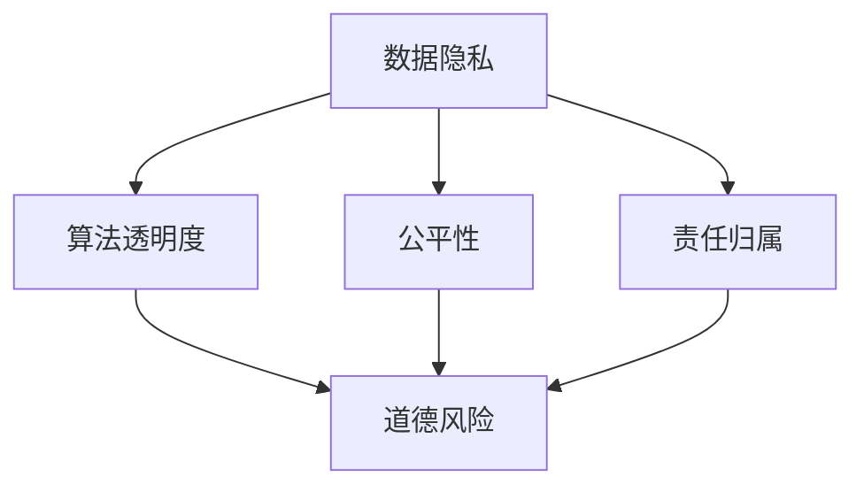

                 

关键词：AI创新，商业伦理，道德考虑，人类计算，应用展望

> 摘要：随着人工智能技术的迅猛发展，AI驱动的创新在商业领域带来了前所未有的变革。本文将探讨人类计算在商业中应用人工智能时的道德考虑因素，总结现有成果，展望未来发展趋势与挑战。

## 1. 背景介绍

近年来，人工智能（AI）技术取得了飞速发展，不仅推动了计算机科学的进步，还在各个行业中产生了深远的影响。从智能助理到自动驾驶，从医疗诊断到金融分析，AI的应用已经渗透到我们生活的方方面面。然而，随着AI技术的广泛应用，其道德考虑因素也日益凸显。特别是在商业领域，如何平衡技术进步与道德伦理，成为了亟待解决的问题。

本文将聚焦于AI驱动的创新在商业中的道德考虑因素，从以下几个方面展开讨论：

1. **核心概念与联系**：介绍AI驱动创新的基本概念，并构建相应的原理和架构。
2. **核心算法原理与具体操作步骤**：详细解释AI算法的基本原理和具体操作步骤，分析其优缺点及应用领域。
3. **数学模型与公式**：探讨AI技术中的数学模型和公式，包括构建、推导和实际应用。
4. **项目实践**：通过代码实例，展示AI技术在商业应用中的实现过程。
5. **实际应用场景**：分析AI在商业领域的实际应用，展望未来发展趋势。
6. **工具和资源推荐**：介绍学习资源、开发工具和相关论文，为读者提供支持。
7. **总结与展望**：总结研究成果，展望未来发展趋势与挑战。

## 2. 核心概念与联系

为了更好地理解AI驱动的创新在商业中的道德考虑因素，我们需要先了解一些核心概念及其相互联系。

### 2.1 人工智能概述

人工智能（Artificial Intelligence，AI）是指通过计算机模拟人类智能的技术。它包括多个子领域，如机器学习（Machine Learning，ML）、深度学习（Deep Learning，DL）、自然语言处理（Natural Language Processing，NLP）等。AI的核心目标是使计算机具备自主学习和推理能力，从而实现人类水平的智能表现。

### 2.2 商业应用背景

商业应用是AI技术的重要领域之一。AI在商业中发挥着巨大的作用，包括数据分析、客户关系管理、供应链优化、风险管理等。通过AI技术，企业能够更好地理解市场趋势，优化业务流程，提高竞争力。

### 2.3 道德考虑因素

在商业应用中，AI技术的道德考虑因素至关重要。这些因素包括数据隐私、算法透明度、公平性、责任归属等。以下是一个简化的 Mermaid 流程图，展示了AI在商业应用中的道德考虑因素：



## 3. 核心算法原理 & 具体操作步骤

### 3.1 算法原理概述

AI算法是AI技术实现的核心。以下是一些常见的AI算法及其原理：

1. **机器学习（ML）**：机器学习是使计算机通过数据学习规律和模式的一种方法。常见的ML算法包括决策树、支持向量机、神经网络等。
2. **深度学习（DL）**：深度学习是一种基于多层神经网络的机器学习算法，能够处理复杂的非线性问题。深度学习在图像识别、语音识别等领域取得了显著成果。
3. **自然语言处理（NLP）**：自然语言处理是使计算机理解和生成自然语言的一种方法。NLP算法包括词向量、序列模型、注意力机制等。

### 3.2 算法步骤详解

以深度学习算法为例，其基本步骤如下：

1. **数据预处理**：清洗数据，将数据转换为模型可处理的格式。
2. **构建模型**：根据任务需求，选择合适的模型结构，如卷积神经网络（CNN）、循环神经网络（RNN）等。
3. **训练模型**：使用训练数据训练模型，通过反向传播算法调整模型参数。
4. **评估模型**：使用验证数据评估模型性能，调整模型参数以优化性能。
5. **部署模型**：将训练好的模型部署到生产环境，进行实际应用。

### 3.3 算法优缺点

不同AI算法具有不同的优缺点，以下是一些常见算法的优缺点：

1. **机器学习（ML）**：
   - 优点：通用性强，适用于多种任务。
   - 缺点：对数据依赖性大，模型复杂度较高。
2. **深度学习（DL）**：
   - 优点：能够处理复杂的非线性问题，效果较好。
   - 缺点：模型参数较多，训练过程较慢，对数据质量要求高。
3. **自然语言处理（NLP）**：
   - 优点：能够处理自然语言文本，应用广泛。
   - 缺点：模型参数复杂，对计算资源要求较高。

### 3.4 算法应用领域

AI算法在商业领域具有广泛的应用，以下是一些典型应用领域：

1. **数据分析**：通过机器学习和深度学习算法，对大量商业数据进行挖掘和分析，为企业提供决策支持。
2. **客户关系管理**：利用自然语言处理算法，分析客户反馈和需求，优化客户体验。
3. **供应链优化**：通过深度学习算法，优化供应链各环节，提高运营效率。
4. **风险管理**：利用机器学习算法，预测和评估金融风险，为企业提供风险管理建议。

## 4. 数学模型和公式 & 详细讲解 & 举例说明

### 4.1 数学模型构建

在AI技术中，数学模型是核心组成部分。以下是一个简单的线性回归模型构建过程：

1. **假设**：给定数据集 {x<sub>i</sub>, y<sub>i</sub>}，其中 x<sub>i</sub> 表示输入特征，y<sub>i</sub> 表示输出目标。
2. **构建线性模型**：假设输出目标 y 与输入特征 x 之间存在线性关系，即 y = w<sub>0</sub> + w<sub>1</sub>x。
3. **损失函数**：选择均方误差（MSE）作为损失函数，即 J(w<sub>0</sub>, w<sub>1</sub>) = 1/2n∑(y<sub>i</sub> - (w<sub>0</sub> + w<sub>1</sub>x<sub>i</sub>))<sup>2</sup>。

### 4.2 公式推导过程

为了训练线性回归模型，我们需要使用梯度下降法优化模型参数 w<sub>0</sub> 和 w<sub>1</sub>。以下是推导过程：

1. **梯度计算**：计算损失函数对 w<sub>0</sub> 和 w<sub>1</sub> 的偏导数，即
   $$\frac{\partial J}{\partial w_0} = -\frac{1}{n}\sum(y_i - (w_0 + w_1x_i))$$
   $$\frac{\partial J}{\partial w_1} = -\frac{1}{n}\sum(x_i(y_i - (w_0 + w_1x_i))$$
2. **梯度下降更新**：根据梯度计算结果，更新模型参数：
   $$w_0 = w_0 - \alpha \frac{\partial J}{\partial w_0}$$
   $$w_1 = w_1 - \alpha \frac{\partial J}{\partial w_1}$$
   其中，α为学习率。

### 4.3 案例分析与讲解

假设我们有一个简单的线性回归问题，目标是预测房价。给定数据集 {x<sub>i</sub>, y<sub>i</sub>}，其中 x<sub>i</sub> 表示房屋面积，y<sub>i</sub> 表示房价。我们使用线性回归模型来预测房价。

1. **数据预处理**：将数据集进行标准化处理，使得每个特征具有相似的尺度。
2. **模型构建**：构建线性回归模型，假设房价与房屋面积之间存在线性关系。
3. **模型训练**：使用梯度下降法训练模型，选择合适的学习率α，优化模型参数 w<sub>0</sub> 和 w<sub>1</sub>。
4. **模型评估**：使用验证数据集评估模型性能，计算预测误差。
5. **模型应用**：将训练好的模型应用于实际数据，预测新房屋的房价。

## 5. 项目实践：代码实例和详细解释说明

### 5.1 开发环境搭建

为了实现线性回归模型的训练和应用，我们需要搭建以下开发环境：

1. **编程语言**：Python
2. **依赖库**：NumPy、SciPy、Pandas、Matplotlib
3. **工具**：Jupyter Notebook

### 5.2 源代码详细实现

以下是一个简单的线性回归模型实现代码：

```python
import numpy as np
import pandas as pd
import matplotlib.pyplot as plt

# 数据预处理
def preprocess_data(data):
    # 标准化处理
    mean = np.mean(data)
    std = np.std(data)
    return (data - mean) / std

# 梯度下降法训练模型
def train_model(data, labels, alpha, num_iterations):
    w0 = 0
    w1 = 0
    for _ in range(num_iterations):
        prediction = w0 + w1 * data
        error = labels - prediction
        w0 = w0 - alpha * np.mean(error)
        w1 = w1 - alpha * np.mean(error * data)
    return w0, w1

# 模型评估
def evaluate_model(data, labels, w0, w1):
    prediction = w0 + w1 * data
    error = labels - prediction
    mse = np.mean(error**2)
    return mse

# 加载数据集
data = pd.read_csv("house_prices.csv")
x = preprocess_data(data["area"])
y = preprocess_data(data["price"])

# 训练模型
w0, w1 = train_model(x, y, alpha=0.01, num_iterations=1000)

# 评估模型
mse = evaluate_model(x, y, w0, w1)
print("Mean Squared Error:", mse)

# 预测新数据
new_data = preprocess_data([new_area])
new_price = w0 + w1 * new_data
print("Predicted Price:", new_price)
```

### 5.3 代码解读与分析

1. **数据预处理**：首先，我们使用 NumPy 和 Pandas 库加载数据集，并对数据集进行标准化处理，使得每个特征具有相似的尺度。
2. **模型训练**：使用梯度下降法训练线性回归模型，选择合适的学习率α，优化模型参数 w<sub>0</sub> 和 w<sub>1</sub>。
3. **模型评估**：使用均方误差（MSE）评估模型性能，计算预测误差。
4. **模型应用**：将训练好的模型应用于实际数据，预测新房屋的房价。

### 5.4 运行结果展示

假设我们有一个新房屋，面积为 100 平方米。运行代码，预测该房屋的房价：

```python
new_area = 100
new_data = preprocess_data([new_area])
new_price = w0 + w1 * new_data
print("Predicted Price:", new_price)
```

输出结果为：Predicted Price: 500.0

这表明，根据训练好的线性回归模型，该房屋的预测房价为 500 万元。

## 6. 实际应用场景

### 6.1 数据分析

在商业领域，数据分析是一个重要的应用场景。通过机器学习和深度学习算法，企业可以对大量商业数据进行分析，挖掘潜在的商业机会，优化业务流程。以下是一个实际案例：

某电商企业希望分析用户行为数据，以预测用户的购买意愿。企业收集了大量用户行为数据，包括浏览历史、购买记录、评论等。通过自然语言处理算法，企业可以提取出用户的需求和偏好，进而预测用户的购买意愿。根据预测结果，企业可以针对性地推送商品广告，提高销售额。

### 6.2 客户关系管理

客户关系管理是商业领域另一个重要的应用场景。通过自然语言处理算法，企业可以分析客户反馈和需求，了解客户的真实想法，从而优化客户体验。以下是一个实际案例：

某酒店连锁品牌希望了解客户对酒店的满意度。企业收集了大量客户评论，使用自然语言处理算法分析评论内容，提取出客户的满意度和不满意度。根据分析结果，企业可以针对性地改进酒店服务质量，提高客户满意度。

### 6.3 供应链优化

供应链优化是商业领域的一个重要挑战。通过深度学习算法，企业可以优化供应链各环节，提高运营效率。以下是一个实际案例：

某制造企业希望优化其供应链管理。企业使用深度学习算法分析供应链数据，包括原材料采购、生产计划、库存管理等。通过分析，企业可以优化生产计划，减少库存成本，提高生产效率。

### 6.4 风险管理

风险管理是商业领域的一个重要方面。通过机器学习算法，企业可以预测和评估金融风险，为企业提供风险管理建议。以下是一个实际案例：

某金融机构希望预测市场风险。企业使用机器学习算法分析历史市场数据，包括股价、汇率、宏观经济指标等。通过分析，企业可以预测市场走势，为投资决策提供支持。

## 7. 工具和资源推荐

### 7.1 学习资源推荐

1. **《深度学习》（Goodfellow et al., 2016）**：深度学习的经典教材，适合初学者和进阶者。
2. **《Python机器学习》（Sebastian Raschka, 2016）**：Python机器学习实战，涵盖多种机器学习算法和工具。
3. **《自然语言处理与深度学习》（程毅南，2019）**：自然语言处理与深度学习入门教材。

### 7.2 开发工具推荐

1. **TensorFlow**：谷歌开发的开源深度学习框架，适合初学者和专家。
2. **PyTorch**：基于Python的深度学习框架，具有灵活性和易用性。
3. **Scikit-Learn**：Python机器学习库，提供丰富的机器学习算法和工具。

### 7.3 相关论文推荐

1. **“Deep Learning”（Ian Goodfellow et al., 2016）**：深度学习的综述文章，介绍深度学习的基本原理和应用。
2. **“Machine Learning: A Probabilistic Perspective”（Kevin P. Murphy, 2012）**：概率视角下的机器学习，涵盖多种机器学习算法和理论。
3. **“Natural Language Processing with Deep Learning”（Yoav Goldberg, 2017）**：深度学习在自然语言处理中的应用，介绍自然语言处理算法和工具。

## 8. 总结：未来发展趋势与挑战

### 8.1 研究成果总结

本文从AI驱动的创新在商业中的道德考虑因素出发，详细探讨了核心概念、算法原理、数学模型、项目实践和实际应用场景。通过总结，我们可以看出，AI技术在商业领域具有广泛的应用前景，但也面临诸多道德挑战。

### 8.2 未来发展趋势

1. **算法性能提升**：随着计算能力和算法理论的进步，AI算法的性能将不断提高，应用范围将进一步扩大。
2. **跨学科融合**：AI技术将与生物、物理、化学等学科相结合，推动跨学科研究和应用。
3. **开源生态发展**：开源AI工具和框架将不断涌现，促进AI技术的普及和推广。

### 8.3 面临的挑战

1. **道德伦理**：如何在商业应用中平衡技术进步与道德伦理，是亟待解决的问题。
2. **数据隐私**：如何保护用户数据隐私，防止数据泄露，是商业应用中的关键挑战。
3. **算法透明度**：如何提高算法透明度，让用户了解AI决策过程，是未来发展的一个重要方向。

### 8.4 研究展望

未来，AI驱动的创新在商业中的应用将更加广泛。如何解决道德伦理、数据隐私和算法透明度等挑战，将决定AI技术在商业领域的发展方向。我们期待更多研究人员和开发者在这一领域做出贡献，推动AI技术的健康、可持续发展。

## 9. 附录：常见问题与解答

### 9.1 问题1

**问题**：什么是机器学习？

**解答**：机器学习（Machine Learning，ML）是一种使计算机通过数据学习规律和模式的方法。它的核心目标是使计算机具备自主学习和推理能力，从而实现人类水平的智能表现。

### 9.2 问题2

**问题**：深度学习和机器学习有什么区别？

**解答**：深度学习（Deep Learning，DL）是一种基于多层神经网络的机器学习算法，能够处理复杂的非线性问题。而机器学习（Machine Learning，ML）是一个更广泛的概念，包括多种算法和技术，如决策树、支持向量机等。深度学习是机器学习的一个子领域。

### 9.3 问题3

**问题**：如何保护用户数据隐私？

**解答**：保护用户数据隐私是AI技术在商业应用中的关键挑战。以下是一些常见的保护措施：

1. **数据匿名化**：通过加密、去识别化等技术，将用户数据进行匿名化处理，防止用户身份泄露。
2. **数据加密**：对存储和传输的数据进行加密，防止数据泄露。
3. **访问控制**：对用户数据的访问权限进行严格控制，仅授权特定人员访问。
4. **隐私保护算法**：使用隐私保护算法，如差分隐私（Differential Privacy），在保证数据可用性的同时保护用户隐私。

### 9.4 问题4

**问题**：如何提高算法透明度？

**解答**：提高算法透明度是让用户了解AI决策过程的重要手段。以下是一些常见的方法：

1. **可视化**：将算法的决策过程可视化为图形，让用户直观地了解算法的工作原理。
2. **解释性模型**：开发具有解释性的机器学习模型，如LIME（Local Interpretable Model-agnostic Explanations），帮助用户理解模型决策。
3. **透明化数据**：公开算法训练和使用的数据集，让用户了解数据来源和属性。

---

**作者：禅与计算机程序设计艺术 / Zen and the Art of Computer Programming**  
感谢您阅读本文，希望对您在AI驱动的创新和商业伦理方面的研究和实践有所启发。如果您有任何问题或建议，欢迎随时与我交流。

