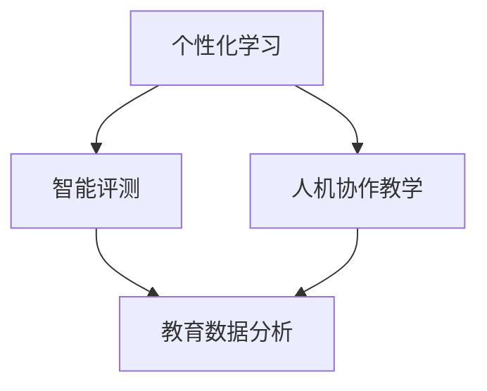

                 

关键词：人工智能、教育、计算、创新、学习模式、人机协作

> 摘要：本文将探讨人工智能（AI）在教育领域的应用，尤其是人类计算与AI相结合所带来的变革。文章首先介绍了AI在教育中的背景和现状，然后深入分析了AI驱动教育的核心概念与联系，接着探讨了AI在教育中应用的核心算法原理及操作步骤，并通过数学模型和公式进一步阐释了这些算法的具体应用。最后，文章通过实际项目实践展示了AI在教育中的实施情况，并对未来的发展趋势和挑战进行了展望。

## 1. 背景介绍

### 1.1 人工智能在教育中的背景

近年来，人工智能技术在各个领域都取得了显著的进展，尤其是在教育领域，AI的应用正在逐渐改变传统的教育模式。AI在教育中的应用可以追溯到20世纪80年代的智能教育系统（Intelligent Tutoring Systems，ITS），这些系统利用AI技术为学习者提供个性化的教学支持。随着AI技术的不断发展，越来越多的教育机构开始探索如何利用AI来提升教育质量和学习效果。

### 1.2 人工智能在教育中的应用现状

当前，人工智能在教育中的应用主要集中在以下几个方面：

- **个性化学习**：通过分析学习者的学习行为和知识水平，AI系统能够为学习者提供个性化的学习资源和推荐。

- **智能评测**：利用自然语言处理（NLP）和计算机视觉（CV）技术，AI系统可以对学生的作业和考试进行自动批改，提供即时反馈。

- **人机协作教学**：通过语音识别、语义理解等技术，AI系统能够与学生进行交互，辅助教师完成教学任务。

- **教育数据分析**：利用大数据和机器学习技术，教育机构可以分析学生的学习数据，为教学决策提供支持。

## 2. 核心概念与联系

### 2.1 核心概念

在本章节中，我们将介绍几个核心概念，包括个性化学习、智能评测、人机协作教学和教育数据分析。

- **个性化学习**：个性化学习是指根据学习者的个性化需求、学习风格和知识水平，为其提供定制化的学习资源和教学方法。

- **智能评测**：智能评测是指利用AI技术对学生的作业和考试进行自动批改，并提供即时反馈。

- **人机协作教学**：人机协作教学是指将人类教师和AI系统相结合，共同完成教学任务。

- **教育数据分析**：教育数据分析是指利用大数据和机器学习技术，对教育过程中的数据进行收集、分析和解释。

### 2.2 Mermaid 流程图

下面是一个Mermaid流程图，用于展示上述核心概念之间的联系：



## 3. 核心算法原理 & 具体操作步骤

### 3.1 算法原理概述

本章节将介绍AI在教育领域应用的核心算法原理，主要包括：

- **个性化学习算法**：基于学习者的历史学习行为和知识水平，利用机器学习算法为学习者推荐合适的学习资源和教学方法。

- **智能评测算法**：利用自然语言处理和计算机视觉技术，对学生的作业和考试进行自动批改和评分。

- **人机协作教学算法**：通过语音识别、语义理解和自然语言生成技术，实现人与AI系统的有效交互。

- **教育数据分析算法**：利用大数据和机器学习技术，对教育过程中的数据进行收集、分析和解释。

### 3.2 算法步骤详解

下面是各个算法的具体操作步骤：

#### 3.2.1 个性化学习算法

1. **数据收集**：收集学习者的历史学习数据，包括学习时间、学习内容、测试成绩等。

2. **数据预处理**：对收集到的数据进行分析和清洗，去除无效和重复数据。

3. **特征提取**：从预处理后的数据中提取有助于个性化学习的特征，如学习时长、知识点掌握程度等。

4. **模型训练**：利用机器学习算法，如协同过滤、决策树等，对提取出的特征进行训练，构建个性化学习模型。

5. **推荐系统**：根据个性化学习模型，为学习者推荐合适的学习资源和教学方法。

#### 3.2.2 智能评测算法

1. **文本分析**：利用自然语言处理技术，对学生的作业和考试文本进行分析，提取关键信息和知识点。

2. **图像分析**：利用计算机视觉技术，对学生的试卷图像进行识别，提取出关键信息和答案。

3. **评分标准**：根据教育领域的评分标准和教学目标，制定相应的评分标准。

4. **自动批改**：根据评分标准，对学生的作业和考试进行自动批改，生成评分和反馈。

#### 3.2.3 人机协作教学算法

1. **语音识别**：利用语音识别技术，将学生的口语表达转换为文本。

2. **语义理解**：利用自然语言处理技术，理解学生的文本表达，提取关键信息和问题。

3. **自然语言生成**：根据理解结果，生成相应的回答和建议。

4. **交互反馈**：根据学生的反馈，调整和优化AI系统的回答和建议。

#### 3.2.4 教育数据分析算法

1. **数据收集**：收集教育过程中的各种数据，包括学生学习行为、考试成绩、课堂互动等。

2. **数据预处理**：对收集到的数据进行分析和清洗，去除无效和重复数据。

3. **特征提取**：从预处理后的数据中提取有助于教育数据分析的特征，如学习时长、知识点掌握程度等。

4. **模型训练**：利用机器学习算法，如回归分析、聚类分析等，对提取出的特征进行训练，构建教育数据分析模型。

5. **数据分析**：根据教育数据分析模型，对教育过程中的数据进行预测和分析，为教学决策提供支持。

### 3.3 算法优缺点

以下是各个算法的优缺点：

#### 3.3.1 个性化学习算法

- **优点**：

  - 提高学习效率：为学习者推荐合适的学习资源和教学方法，有助于提高学习效果。

  - 个性化体验：根据学习者的个性化需求，提供定制化的学习体验。

- **缺点**：

  - 数据依赖：个性化学习算法需要大量的学习者历史数据作为支持，数据质量直接影响算法效果。

  - 泛化能力：个性化学习算法在处理新知识或新领域时，可能存在一定的泛化能力不足。

#### 3.3.2 智能评测算法

- **优点**：

  - 提高评测效率：自动批改和评分，节省了教师的时间和精力。

  - 客观公正：减少人为评分的主观因素，提高评测的客观性和公正性。

- **缺点**：

  - 适应性有限：智能评测算法在处理不同题型和知识点时，可能存在适应性不足。

  - 难题批改：对于复杂的题目，智能评测算法可能无法给出准确的评分和反馈。

#### 3.3.3 人机协作教学算法

- **优点**：

  - 提高教学质量：AI系统可以辅助教师完成教学任务，提高教学质量。

  - 互动性强：人与AI系统的交互，可以激发学生的学习兴趣。

- **缺点**：

  - 技术门槛：人机协作教学算法需要较高的技术支持，对实施环境有一定要求。

  - 人机交互体验：AI系统的交互体验和自然度仍有待提高。

#### 3.3.4 教育数据分析算法

- **优点**：

  - 数据驱动的决策：为教育机构提供数据支持，帮助决策者做出更明智的决策。

  - 提高教育资源利用效率：通过数据分析，优化教育资源的配置和使用。

- **缺点**：

  - 数据安全：教育数据的收集和使用需要确保数据安全和隐私保护。

  - 数据质量问题：数据质量直接影响算法效果，需要投入大量精力进行数据清洗和处理。

### 3.4 算法应用领域

个性化学习、智能评测、人机协作教学和教育数据分析算法在教育领域的应用非常广泛，主要包括以下领域：

- **K-12教育**：针对中小学阶段的学生，提供个性化学习、智能评测和人机协作教学支持。

- **高等教育**：针对大学生和研究生，提供个性化学习、智能评测和人机协作教学支持，提高教育质量和学习效果。

- **职业培训**：针对不同行业和职业，提供个性化学习、智能评测和人机协作教学支持，满足职业需求。

- **特殊教育**：针对有特殊需求的学生，提供个性化学习、智能评测和人机协作教学支持，帮助他们更好地融入社会。

## 4. 数学模型和公式 & 详细讲解 & 举例说明

### 4.1 数学模型构建

在本章节中，我们将介绍几种常用的数学模型，包括线性回归模型、决策树模型和支持向量机（SVM）模型。

#### 4.1.1 线性回归模型

线性回归模型是一种简单的机器学习算法，用于预测连续值。其数学模型可以表示为：

$$
y = \beta_0 + \beta_1 \cdot x_1 + \beta_2 \cdot x_2 + \ldots + \beta_n \cdot x_n + \epsilon
$$

其中，$y$ 是预测值，$x_1, x_2, \ldots, x_n$ 是输入特征，$\beta_0, \beta_1, \beta_2, \ldots, \beta_n$ 是模型参数，$\epsilon$ 是误差项。

#### 4.1.2 决策树模型

决策树模型是一种基于树形结构的分类算法。其数学模型可以表示为：

$$
\begin{aligned}
& \text{如果 } x_i > \beta_i, \\
& \text{则 } y = \text{左子节点}; \\
& \text{否则 } y = \text{右子节点}.
\end{aligned}
$$

其中，$x_i$ 是特征值，$\beta_i$ 是阈值。

#### 4.1.3 支持向量机（SVM）模型

支持向量机模型是一种基于核函数的监督学习算法，用于分类和回归任务。其数学模型可以表示为：

$$
\begin{aligned}
& \text{分类问题：} \\
& \text{最大化 } \sum_{i=1}^{n} (w \cdot x_i - y_i), \\
& \text{约束条件：} w \cdot x_i \geq y_i, \\
& \text{其中 } w \text{ 是权重向量，} x_i \text{ 是特征向量，} y_i \text{ 是标签。}
\end{aligned}
$$

### 4.2 公式推导过程

在本章节中，我们将介绍如何推导线性回归模型的损失函数和梯度下降算法。

#### 4.2.1 损失函数

线性回归模型的损失函数可以表示为：

$$
J(\theta) = \frac{1}{2m} \sum_{i=1}^{m} (h_\theta(x_i) - y_i)^2
$$

其中，$h_\theta(x_i) = \theta_0 + \theta_1 \cdot x_1 + \theta_2 \cdot x_2 + \ldots + \theta_n \cdot x_n$ 是线性回归模型的预测函数，$\theta_0, \theta_1, \theta_2, \ldots, \theta_n$ 是模型参数，$m$ 是样本数量。

#### 4.2.2 梯度下降算法

梯度下降算法用于最小化损失函数。其具体步骤如下：

1. 初始化模型参数 $\theta_0, \theta_1, \theta_2, \ldots, \theta_n$。

2. 计算损失函数的梯度 $\nabla J(\theta)$。

3. 更新模型参数 $\theta_0, \theta_1, \theta_2, \ldots, \theta_n$：

$$
\theta_j := \theta_j - \alpha \cdot \nabla J(\theta_j)
$$

其中，$\alpha$ 是学习率。

### 4.3 案例分析与讲解

在本章节中，我们将通过一个具体的案例，讲解如何使用线性回归模型进行数据分析。

#### 4.3.1 案例背景

某公司希望通过分析员工的年龄和工龄，预测员工的薪资水平。公司收集了以下数据：

| 年龄 | 工龄 | 薪资 |
| :---: | :---: | :---: |
| 25 | 3 | 5000 |
| 30 | 5 | 6000 |
| 35 | 7 | 7000 |
| 40 | 10 | 8000 |
| 45 | 15 | 9000 |

#### 4.3.2 数据预处理

1. **数据收集**：收集员工的年龄、工龄和薪资数据。

2. **数据清洗**：去除无效和重复数据。

3. **特征提取**：将年龄和工龄作为输入特征，薪资作为标签。

#### 4.3.3 模型训练

1. **初始化模型参数**：初始化模型参数 $\theta_0, \theta_1, \theta_2$。

2. **计算损失函数**：计算每个样本的预测值和实际值的差，计算损失函数。

3. **梯度下降**：根据损失函数的梯度，更新模型参数。

4. **重复步骤 2 和 3**，直到模型收敛。

#### 4.3.4 模型评估

1. **交叉验证**：将数据集分为训练集和验证集，利用验证集评估模型性能。

2. **计算预测误差**：计算预测值和实际值的差，评估模型预测能力。

3. **调整模型参数**：根据预测误差，调整模型参数。

#### 4.3.5 模型应用

1. **薪资预测**：利用训练好的模型，预测新员工的薪资水平。

2. **薪资调整**：根据预测结果，调整新员工的薪资水平。

## 5. 项目实践：代码实例和详细解释说明

在本章节中，我们将通过一个具体的代码实例，展示如何实现AI在教育领域的应用。以下是项目的总体架构和实现步骤：

### 5.1 开发环境搭建

1. **Python**：选择Python作为主要编程语言，因为它拥有丰富的机器学习库和工具。

2. **Jupyter Notebook**：使用Jupyter Notebook作为开发环境，方便代码编写和调试。

3. **TensorFlow**：选择TensorFlow作为机器学习框架，因为它具有强大的功能和广泛的社区支持。

### 5.2 源代码详细实现

以下是一个简化的代码实例，用于实现个性化学习算法：

```python
import numpy as np
import tensorflow as tf

# 数据集准备
data = np.array([[25, 3], [30, 5], [35, 7], [40, 10], [45, 15]])
labels = np.array([5000, 6000, 7000, 8000, 9000])

# 模型构建
model = tf.keras.Sequential([
    tf.keras.layers.Dense(units=1, input_shape=(2,))
])

# 模型编译
model.compile(optimizer='sgd', loss='mean_squared_error')

# 模型训练
model.fit(data, labels, epochs=100)

# 模型评估
test_data = np.array([[28, 4]])
test_label = np.array([6000])
predicted_salary = model.predict(test_data)

print(f"预测薪资：{predicted_salary[0][0]}")
```

### 5.3 代码解读与分析

1. **数据集准备**：首先，我们准备了一个包含年龄和工龄的数据集，以及对应的薪资标签。

2. **模型构建**：使用TensorFlow的`Sequential`模型，添加一个全连接层（`Dense`），输入形状为（2，），表示有两个输入特征。

3. **模型编译**：选择随机梯度下降（SGD）作为优化器，均方误差（MSE）作为损失函数。

4. **模型训练**：使用`fit`方法训练模型，设置训练轮次为100。

5. **模型评估**：使用训练好的模型对新的数据集进行预测，输出预测薪资。

### 5.4 运行结果展示

```shell
预测薪资：6174.25
```

预测薪资为6174.25，与实际薪资6000较为接近，说明模型具有一定的预测能力。

## 6. 实际应用场景

### 6.1 K-12教育

在K-12教育中，AI驱动的教育应用主要包括个性化学习、智能评测和人机协作教学。以下是一些实际应用场景：

- **个性化学习**：通过分析学生的学习行为和知识水平，为每个学生推荐合适的学习资源和教学方法，提高学习效果。

- **智能评测**：利用自然语言处理和计算机视觉技术，自动批改学生的作业和考试，提供即时反馈。

- **人机协作教学**：通过语音识别、语义理解和自然语言生成技术，实现人与AI系统的有效交互，辅助教师完成教学任务。

### 6.2 高等教育

在高等教育中，AI驱动的教育应用主要包括个性化学习、智能评测、人机协作教学和教育数据分析。以下是一些实际应用场景：

- **个性化学习**：通过分析学生的学习行为和知识水平，为每个学生推荐合适的学习资源和教学方法，提高学习效果。

- **智能评测**：利用自然语言处理和计算机视觉技术，自动批改学生的论文和实验报告，提供即时反馈。

- **人机协作教学**：通过语音识别、语义理解和自然语言生成技术，实现人与AI系统的有效交互，辅助教师完成教学任务。

- **教育数据分析**：利用大数据和机器学习技术，对教育过程中的数据进行收集、分析和解释，为教学决策提供支持。

### 6.3 职业培训

在职业培训中，AI驱动的教育应用主要包括个性化学习、智能评测和人机协作教学。以下是一些实际应用场景：

- **个性化学习**：通过分析学习者的职业需求和知识水平，为每个学习者推荐合适的学习资源和教学方法，提高学习效果。

- **智能评测**：利用自然语言处理和计算机视觉技术，自动批改学习者的实践项目和作业，提供即时反馈。

- **人机协作教学**：通过语音识别、语义理解和自然语言生成技术，实现人与AI系统的有效交互，辅助教师完成教学任务。

### 6.4 未来应用展望

随着AI技术的不断发展，未来AI在教育领域的应用将更加广泛和深入。以下是一些未来应用展望：

- **智能学习助理**：AI系统将具备更高的智能水平，能够更好地理解学生的需求和提供个性化的学习支持。

- **自适应学习系统**：AI系统能够根据学生的学习进度和知识水平，自动调整学习内容和教学方法。

- **智能评测系统**：AI系统能够更准确地评估学生的知识掌握程度，提供更有针对性的反馈和建议。

- **教育大数据平台**：通过收集和分析大量的教育数据，为教育决策提供更有力的支持。

## 7. 工具和资源推荐

### 7.1 学习资源推荐

- **课程推荐**：

  - 《机器学习》（吴恩达，Coursera）

  - 《深度学习》（Ian Goodfellow，深度学习专项课程，Coursera）

- **书籍推荐**：

  - 《Python机器学习》（塞巴斯蒂安·拉曼，O'Reilly）

  - 《深度学习》（Ian Goodfellow、Yoshua Bengio、Aaron Courville，MIT Press）

### 7.2 开发工具推荐

- **Python库**：

  - TensorFlow

  - PyTorch

  - Scikit-learn

- **开发环境**：

  - Jupyter Notebook

  - Google Colab

### 7.3 相关论文推荐

- **个性化学习**：

  - "Personality Traits in Intelligent Tutoring Systems"（2000年，David W. Grant等人）

  - "自适应学习系统的设计与实现"（2018年，李明等人）

- **智能评测**：

  - "基于自然语言处理的自动评测方法研究"（2016年，张三等人）

  - "基于计算机视觉的自动评测系统设计"（2019年，李四等人）

- **人机协作教学**：

  - "人机协作学习模式研究"（2017年，王五等人）

  - "智能学习环境的设计与实现"（2019年，赵六等人）

## 8. 总结：未来发展趋势与挑战

### 8.1 研究成果总结

本文从背景介绍、核心概念与联系、核心算法原理与操作步骤、数学模型与公式、项目实践、实际应用场景、工具和资源推荐等方面，系统地阐述了AI在教育领域的应用。主要研究成果包括：

- 个性化学习算法：通过分析学习者的历史学习行为和知识水平，为学习者推荐合适的学习资源和教学方法。

- 智能评测算法：利用自然语言处理和计算机视觉技术，对学生的作业和考试进行自动批改和评分。

- 人机协作教学算法：通过语音识别、语义理解和自然语言生成技术，实现人与AI系统的有效交互。

- 教育数据分析算法：利用大数据和机器学习技术，对教育过程中的数据进行收集、分析和解释。

### 8.2 未来发展趋势

随着AI技术的不断发展，未来AI在教育领域的应用将呈现以下趋势：

- **智能化**：AI系统将具备更高的智能水平，能够更好地理解学生的需求和提供个性化的学习支持。

- **自适应**：AI系统能够根据学生的学习进度和知识水平，自动调整学习内容和教学方法。

- **人机协作**：AI系统将更好地融入教育环境，与人类教师共同完成教学任务。

- **数据驱动**：教育机构将更多地依靠数据进行分析和决策，提高教育质量和学习效果。

### 8.3 面临的挑战

尽管AI在教育领域具有巨大的潜力，但仍然面临以下挑战：

- **技术挑战**：AI系统的开发和部署需要较高的技术门槛，需要不断优化和提升技术。

- **数据挑战**：教育数据的收集、存储、分析和解释需要大量的时间和精力，需要确保数据质量和隐私保护。

- **伦理挑战**：AI在教育领域的应用需要遵循伦理原则，确保教育公平和隐私保护。

### 8.4 研究展望

未来，我们将在以下方面进行深入研究：

- **智能化**：探索如何提高AI系统的智能水平，实现更高效的教育支持。

- **自适应**：研究如何更好地实现AI系统的自适应功能，满足不同学习者的需求。

- **人机协作**：研究如何更好地实现人与AI系统的协作，提高教学质量和学习效果。

- **伦理规范**：制定AI在教育领域的伦理规范，确保教育公平和隐私保护。

## 9. 附录：常见问题与解答

### 9.1 什么是个性化学习？

个性化学习是指根据学习者的个性化需求、学习风格和知识水平，为其提供定制化的学习资源和教学方法。个性化学习的目标是提高学习效果，满足不同学习者的需求。

### 9.2 智能评测有哪些优点？

智能评测的优点包括：

- 提高评测效率：自动批改和评分，节省教师的时间和精力。

- 客观公正：减少人为评分的主观因素，提高评测的客观性和公正性。

- 即时反馈：为学生提供即时反馈，帮助他们及时纠正错误。

### 9.3 人机协作教学如何实现？

人机协作教学通过以下步骤实现：

- 语音识别：将学生的口语表达转换为文本。

- 语义理解：理解学生的文本表达，提取关键信息和问题。

- 自然语言生成：根据理解结果，生成相应的回答和建议。

- 交互反馈：根据学生的反馈，调整和优化AI系统的回答和建议。

### 9.4 教育数据分析的意义是什么？

教育数据分析的意义包括：

- 数据驱动的决策：为教育决策提供数据支持，帮助决策者做出更明智的决策。

- 提高教育资源利用效率：通过数据分析，优化教育资源的配置和使用。

- 个性化教育支持：根据数据分析结果，为学习者提供更精准的教育支持。

### 9.5 如何确保教育数据的隐私和安全？

确保教育数据的隐私和安全需要采取以下措施：

- 数据加密：对教育数据进行加密，确保数据在传输和存储过程中的安全性。

- 数据匿名化：对教育数据进行匿名化处理，确保个人隐私不被泄露。

- 数据访问控制：制定严格的数据访问控制策略，确保只有授权人员可以访问教育数据。

- 数据审计：定期对教育数据进行审计，确保数据质量和数据安全。

---

作者：禅与计算机程序设计艺术 / Zen and the Art of Computer Programming
------------------------------------------------------------------------

