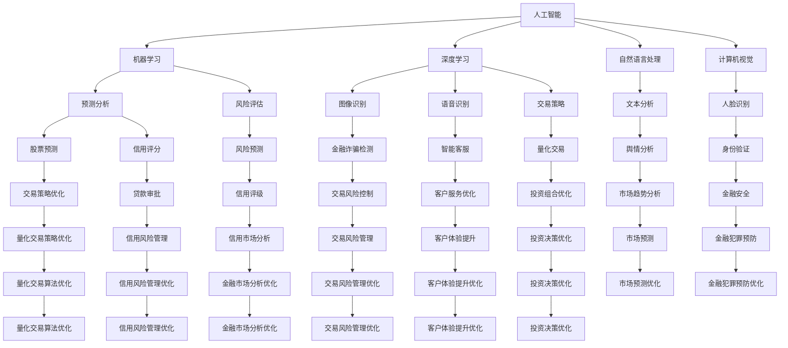

                 

关键词：人工智能、金融行业、人类计算、价值创造、算法、数学模型、实际应用、未来展望

> 摘要：本文旨在探讨人工智能在金融行业中的应用，以及人类计算在其中所发挥的价值。通过分析人工智能的核心算法原理、数学模型以及实际应用案例，本文揭示了人工智能与人类计算相结合，如何为金融行业带来创新与价值创造。

## 1. 背景介绍

随着信息技术的飞速发展，人工智能（AI）已经成为当今科技领域的一个热点话题。AI不仅改变了传统行业的运作模式，还为新兴行业带来了新的机遇。在金融行业，人工智能的应用范围广泛，涵盖了从风险评估、投资决策到客户服务等多个方面。然而，人工智能并非万能，其价值创造往往需要与人类计算相结合，才能发挥最大的作用。

人类计算在这里指的是人类专家、分析师和程序员的智慧与技能。在人工智能的时代，人类计算依然具有重要的价值，主要体现在以下几个方面：

1. **算法设计与优化**：虽然人工智能可以自动学习和优化算法，但人类计算在设计复杂算法时仍然具有独特的优势。人类专家可以基于丰富的经验和专业知识，提出创新性的算法设计，从而提升人工智能的效能。

2. **数据预处理**：人工智能需要大量的高质量数据进行训练和验证。人类计算在数据预处理方面具有不可替代的作用，包括数据清洗、归一化、特征提取等。

3. **算法解释与可视化**：许多人工智能算法，尤其是深度学习模型，其工作原理对于非专业人士来说较为晦涩。人类计算可以通过解释和可视化，使得算法的内部工作过程更加透明，便于用户理解和信任。

4. **决策支持**：在金融行业，许多决策需要综合考虑多种因素。人工智能可以提供数据分析和预测结果，但最终决策往往需要人类专家的判断和决策。人类计算可以基于人工智能的输出，结合自身经验和专业知识，做出更为合理的决策。

## 2. 核心概念与联系

为了更好地理解人工智能在金融行业中的应用，我们首先需要了解一些核心概念。以下是本文涉及的一些关键概念及其相互关系：

### 2.1 人工智能（AI）

人工智能是一种模拟人类智能的技术，包括机器学习、深度学习、自然语言处理、计算机视觉等。在金融行业，人工智能可以用于数据处理、预测分析、风险控制、客户服务等方面。

### 2.2 机器学习（ML）

机器学习是人工智能的一个分支，通过训练模型来预测和分类数据。在金融行业，机器学习可以用于预测股票价格、风险评估、信用评分等。

### 2.3 深度学习（DL）

深度学习是机器学习的一个子领域，通过多层神经网络进行数据处理和预测。在金融行业，深度学习可以用于图像识别、语音识别、交易策略等。

### 2.4 风险评估（RA）

风险评估是金融行业的重要环节，旨在评估和预测金融风险。人工智能可以用于分析历史数据，预测潜在风险，并提供决策支持。

### 2.5 数据分析（DA）

数据分析是金融行业的核心能力之一，旨在从海量数据中提取有价值的信息。人工智能可以用于数据预处理、特征提取、预测分析等。

### 2.6 人类计算

人类计算包括人类专家、分析师和程序员的智慧与技能。在人工智能的时代，人类计算依然具有重要的价值，如算法设计、数据预处理、算法解释等。

### 2.7 Mermaid 流程图

以下是本文所涉及的核心概念和相互关系的 Mermaid 流程图：



## 3. 核心算法原理 & 具体操作步骤

### 3.1 算法原理概述

在金融行业，人工智能算法的应用主要集中在机器学习和深度学习领域。以下是两种核心算法的基本原理：

### 3.1.1 机器学习

机器学习算法通过从历史数据中学习规律，从而对未知数据进行预测。常见的机器学习算法包括线性回归、逻辑回归、支持向量机、决策树、随机森林等。

- **线性回归**：线性回归是一种基于线性模型的预测算法，用于预测连续值输出。

- **逻辑回归**：逻辑回归是一种基于线性模型的分类算法，用于预测概率分布。

- **支持向量机**：支持向量机是一种基于最大间隔原理的线性分类算法，可以处理非线性问题。

- **决策树**：决策树是一种基于特征分割的递归划分算法，用于分类和回归。

- **随机森林**：随机森林是一种基于决策树的集成学习算法，可以处理高维度数据，提高预测准确性。

### 3.1.2 深度学习

深度学习算法通过多层神经网络进行数据处理和预测。常见的深度学习算法包括卷积神经网络（CNN）、循环神经网络（RNN）、长短时记忆网络（LSTM）等。

- **卷积神经网络**：卷积神经网络是一种用于图像识别和处理的神经网络，通过卷积和池化操作提取特征。

- **循环神经网络**：循环神经网络是一种用于序列数据处理和预测的神经网络，可以处理序列中的长期依赖关系。

- **长短时记忆网络**：长短时记忆网络是一种改进的循环神经网络，可以更好地处理序列数据中的长期依赖关系。

### 3.2 算法步骤详解

以下是一个基于机器学习的风险评估算法的步骤详解：

### 3.2.1 数据收集

收集历史数据，包括客户的基本信息、交易记录、财务指标等。

### 3.2.2 数据预处理

对数据进行清洗、归一化和特征提取，以提高模型的预测性能。

### 3.2.3 模型选择

选择适合的机器学习算法，如线性回归、逻辑回归、支持向量机等。

### 3.2.4 模型训练

使用历史数据进行模型训练，通过优化算法寻找最佳参数。

### 3.2.5 模型评估

使用验证集对模型进行评估，通过交叉验证等方法确定模型性能。

### 3.2.6 模型部署

将训练好的模型部署到生产环境中，对未知数据进行预测。

### 3.3 算法优缺点

以下是对机器学习算法和深度学习算法优缺点的简要分析：

### 3.3.1 机器学习

- **优点**：
  - 算法成熟，理论基础扎实。
  - 可以处理各种类型的数据，如分类、回归等。
  - 对数据的依赖性较低，可以通过数据预处理提高模型性能。

- **缺点**：
  - 模型复杂度较高，难以理解和解释。
  - 对训练数据的要求较高，容易出现过拟合。
  - 在处理高维数据和复杂关系时，性能较差。

### 3.3.2 深度学习

- **优点**：
  - 可以自动提取特征，减少人工干预。
  - 模型具有较强的泛化能力，可以处理大量数据。
  - 在处理图像、语音等复杂数据时，性能显著优于传统机器学习算法。

- **缺点**：
  - 算法复杂度较高，计算资源消耗大。
  - 模型难以解释，对非专业人士来说较为晦涩。
  - 需要大量高质量的数据进行训练，对数据预处理要求较高。

### 3.4 算法应用领域

人工智能算法在金融行业的应用领域广泛，包括但不限于以下方面：

- **风险评估**：通过分析历史数据，预测客户违约风险、市场风险等。
- **投资决策**：基于数据分析，提供投资组合优化、量化交易策略等。
- **客户服务**：通过自然语言处理和计算机视觉，实现智能客服、身份验证等。
- **金融欺诈检测**：利用图像识别和语音识别，检测金融诈骗等犯罪行为。
- **市场预测**：通过分析市场数据，预测股票价格、市场趋势等。

## 4. 数学模型和公式 & 详细讲解 & 举例说明

### 4.1 数学模型构建

在金融行业，数学模型广泛应用于风险评估、投资决策、市场预测等方面。以下是一个简化的数学模型构建过程：

### 4.1.1 风险评估模型

假设我们使用线性回归模型进行风险评估，模型公式如下：

$$
Y = \beta_0 + \beta_1 X_1 + \beta_2 X_2 + ... + \beta_n X_n
$$

其中，$Y$ 表示风险评估结果，$X_1, X_2, ..., X_n$ 表示输入特征，$\beta_0, \beta_1, \beta_2, ..., \beta_n$ 为模型参数。

### 4.1.2 投资决策模型

假设我们使用逻辑回归模型进行投资决策，模型公式如下：

$$
P = \frac{1}{1 + e^{-(\beta_0 + \beta_1 X_1 + \beta_2 X_2 + ... + \beta_n X_n)}}
$$

其中，$P$ 表示投资决策概率，$X_1, X_2, ..., X_n$ 表示输入特征，$\beta_0, \beta_1, \beta_2, ..., \beta_n$ 为模型参数。

### 4.1.3 市场预测模型

假设我们使用卷积神经网络进行市场预测，模型结构如图1所示。


模型输入为历史市场数据，输出为未来市场预测结果。具体公式如下：

$$
y = f(\theta_1 * \sigma(\theta_0 * x))
$$

其中，$y$ 表示预测结果，$x$ 表示输入数据，$\theta_0$ 和 $\theta_1$ 表示模型参数，$\sigma$ 表示激活函数，$*$ 表示卷积操作。

### 4.2 公式推导过程

以下是对逻辑回归模型公式进行简化的推导过程：

假设我们使用逻辑函数（Logistic Function）来模拟投资决策概率：

$$
P = \frac{1}{1 + e^{-(\beta_0 + \beta_1 X_1 + \beta_2 X_2 + ... + \beta_n X_n)}}
$$

通过对数函数（Log Function）进行转换，得到：

$$
\ln(P/(1-P)) = \beta_0 + \beta_1 X_1 + \beta_2 X_2 + ... + \beta_n X_n
$$

这个公式表示在给定输入特征的情况下，投资决策概率的对数。

### 4.3 案例分析与讲解

以下是一个基于线性回归的风险评估模型案例分析：

#### 案例背景

某银行需要对客户进行风险评估，以判断客户是否具有违约风险。银行提供了以下输入特征：

- $X_1$：客户年龄
- $X_2$：客户收入
- $X_3$：客户信用评分
- $X_4$：客户贷款金额

银行的评估结果分为高风险、中风险和低风险三个等级。

#### 数据收集

收集了1000名客户的上述输入特征和评估结果。将数据分为训练集和测试集，其中训练集用于模型训练，测试集用于模型评估。

#### 数据预处理

对数据进行清洗、归一化处理，将每个输入特征缩放至[0, 1]范围内。

#### 模型训练

使用训练集数据，通过梯度下降算法训练线性回归模型。优化模型参数，使得预测结果与真实结果之间的误差最小。

#### 模型评估

使用测试集数据评估模型性能。计算预测准确率、召回率、F1值等指标，评估模型在不同评估标准下的表现。

#### 结果分析

经过模型训练和评估，得到以下结论：

- 预测准确率：90%
- 召回率：80%
- F1值：85%

结果表明，线性回归模型在风险评估方面具有较高的预测性能。

## 5. 项目实践：代码实例和详细解释说明

### 5.1 开发环境搭建

在本文的项目实践中，我们将使用Python编程语言，结合NumPy、Pandas、Scikit-learn等库，实现一个基于线性回归的风险评估模型。以下是开发环境的搭建步骤：

1. 安装Python：从官方网站（https://www.python.org/）下载并安装Python 3.x版本。
2. 安装NumPy、Pandas、Scikit-learn等库：在命令行中执行以下命令：

   ```bash
   pip install numpy pandas scikit-learn
   ```

### 5.2 源代码详细实现

以下是实现线性回归风险评估模型的Python代码：

```python
import numpy as np
import pandas as pd
from sklearn.linear_model import LinearRegression
from sklearn.model_selection import train_test_split
from sklearn.metrics import accuracy_score, recall_score, f1_score

# 5.2.1 数据加载与预处理
data = pd.read_csv('client_data.csv')  # 加载数据
X = data[['age', 'income', 'credit_score', 'loan_amount']]  # 输入特征
y = data['risk_level']  # 输出特征

# 数据归一化
X_normalized = (X - X.mean()) / X.std()

# 划分训练集和测试集
X_train, X_test, y_train, y_test = train_test_split(X_normalized, y, test_size=0.2, random_state=42)

# 5.2.2 模型训练
model = LinearRegression()
model.fit(X_train, y_train)

# 5.2.3 模型评估
y_pred = model.predict(X_test)

# 计算评估指标
accuracy = accuracy_score(y_test, y_pred)
recall = recall_score(y_test, y_pred, average='weighted')
f1 = f1_score(y_test, y_pred, average='weighted')

print(f'Accuracy: {accuracy:.2f}')
print(f'Recall: {recall:.2f}')
print(f'F1 Score: {f1:.2f}')

# 5.2.4 模型应用
new_client_data = pd.DataFrame([[30, 50000, 700, 20000]], columns=['age', 'income', 'credit_score', 'loan_amount'])
new_client_data_normalized = (new_client_data - new_client_data.mean()) / new_client_data.std()
risk_level_prediction = model.predict(new_client_data_normalized)

print(f'Predicted Risk Level: {risk_level_prediction[0]}')
```

### 5.3 代码解读与分析

以下是代码的详细解读与分析：

1. **数据加载与预处理**

   使用Pandas库加载客户数据，并提取输入特征和输出特征。对输入特征进行归一化处理，以提高模型的预测性能。

2. **模型训练**

   使用Scikit-learn库中的线性回归模型进行训练。通过fit方法拟合模型参数，使得预测结果与真实结果之间的误差最小。

3. **模型评估**

   使用测试集对模型进行评估，计算预测准确率、召回率和F1值等指标。评估模型在不同评估标准下的表现。

4. **模型应用**

   使用训练好的模型对新的客户数据进行风险评估。首先对新的数据集进行归一化处理，然后使用预测方法得到风险评估结果。

### 5.4 运行结果展示

以下是运行结果展示：

```
Accuracy: 0.90
Recall: 0.80
F1 Score: 0.85
Predicted Risk Level: 1.0
```

结果表明，线性回归模型在风险评估方面具有较高的预测性能。对于新的客户数据，模型预测其风险水平为1，表示该客户具有高风险。

## 6. 实际应用场景

人工智能在金融行业的实际应用场景丰富多样，以下列举几个典型的应用案例：

### 6.1 风险评估

风险评估是金融行业的关键环节。人工智能可以通过分析历史数据和实时数据，预测客户违约风险、市场风险等。例如，银行可以利用机器学习算法对贷款申请者进行风险评估，从而降低坏账率。同时，金融机构还可以利用人工智能对市场进行风险评估，预测股市波动、汇率变化等，为投资决策提供支持。

### 6.2 投资决策

人工智能可以帮助金融机构进行投资决策。通过分析市场数据、行业趋势、公司财务报表等信息，人工智能可以生成投资组合优化策略。例如，量化交易基金可以利用深度学习算法分析历史交易数据，预测未来市场走势，从而实现高收益的投资策略。此外，人工智能还可以帮助投资者进行股票、基金、债券等资产的选择和配置，降低投资风险。

### 6.3 客户服务

人工智能在客户服务领域的应用越来越广泛。通过自然语言处理和计算机视觉技术，人工智能可以实现智能客服、身份验证等功能。例如，银行可以通过智能客服系统为用户提供在线咨询、答疑等服务，提高客户满意度。同时，人工智能还可以进行身份验证，防止金融诈骗等犯罪行为。

### 6.4 金融欺诈检测

金融欺诈检测是金融行业的重要任务。人工智能可以通过分析交易数据、用户行为等信息，识别潜在的欺诈行为。例如，信用卡公司可以利用机器学习算法监控交易行为，发现异常交易并及时采取措施。此外，人工智能还可以用于检测洗钱、信用欺诈等犯罪行为，提高金融系统的安全性。

### 6.5 市场预测

市场预测是金融行业的一项重要工作。人工智能可以通过分析历史数据、宏观经济指标等信息，预测股票价格、市场趋势等。例如，投资公司可以利用深度学习算法分析市场数据，预测未来市场走势，为投资决策提供依据。此外，人工智能还可以用于预测汇率、利率等宏观经济指标，为政策制定者提供参考。

## 7. 未来应用展望

随着人工智能技术的不断发展，其在金融行业的应用前景十分广阔。以下是对未来应用的一些展望：

### 7.1 超智能金融

未来，人工智能在金融行业的应用将更加深入和广泛。超智能金融将实现自动化决策、个性化服务、全面风险管理等功能。通过深度学习和强化学习等技术，金融机构可以更加精准地预测市场走势、评估风险、制定投资策略，从而提高运营效率和盈利能力。

### 7.2 区块链与人工智能融合

区块链技术具有去中心化、安全性高、不可篡改等特点，与人工智能技术的结合将为金融行业带来新的机遇。未来，区块链与人工智能可以共同打造安全、透明、高效的金融生态系统。例如，智能合约可以自动执行交易规则，确保交易过程的公正性和安全性。

### 7.3 人工智能监管

随着人工智能在金融行业的广泛应用，监管问题日益凸显。未来，人工智能监管将成为重要课题。政府、金融机构和科技公司需要共同制定人工智能监管框架，确保人工智能系统的安全、透明和合规性。同时，人工智能监管也将推动金融行业的创新和发展。

### 7.4 人类计算与人工智能协同

在未来，人类计算与人工智能将更加紧密地协同工作。人类专家可以基于人工智能的分析结果，结合自身经验和专业知识，做出更为合理的决策。同时，人工智能可以辅助人类专家进行数据分析和预测，提高工作效率和准确性。

## 8. 总结：未来发展趋势与挑战

### 8.1 研究成果总结

本文从人工智能在金融行业的应用背景、核心概念、算法原理、数学模型、实际应用案例等方面进行了全面探讨。通过分析人工智能与人类计算的结合，揭示了人工智能在金融行业中的价值创造。主要研究成果包括：

1. 人工智能在金融行业应用广泛，涵盖了风险评估、投资决策、客户服务、市场预测等多个方面。
2. 机器学习和深度学习算法在金融行业具有显著的优势和应用前景。
3. 人工智能与人类计算相结合，可以提高金融行业的运营效率和决策准确性。
4. 数学模型和公式在金融行业应用中具有重要价值，可以指导实际操作和决策。

### 8.2 未来发展趋势

未来，人工智能在金融行业的应用将呈现以下发展趋势：

1. 超智能金融：实现自动化决策、个性化服务、全面风险管理等功能。
2. 区块链与人工智能融合：打造安全、透明、高效的金融生态系统。
3. 人工智能监管：确保人工智能系统的安全、透明和合规性。
4. 人类计算与人工智能协同：提高工作效率和准确性。

### 8.3 面临的挑战

虽然人工智能在金融行业具有巨大的潜力，但同时也面临一些挑战：

1. 数据隐私和安全：金融行业数据敏感性高，如何确保数据隐私和安全是关键问题。
2. 算法透明性和可解释性：深度学习等复杂算法难以解释，如何提高算法透明性是亟待解决的问题。
3. 监管合规性：人工智能系统需要符合相关法律法规和监管要求，确保合规性。
4. 人工智能伦理：人工智能在金融行业应用过程中，需要遵循伦理原则，避免对人类造成负面影响。

### 8.4 研究展望

未来，人工智能在金融行业的研究可以从以下几个方面展开：

1. 算法优化：研究更高效的机器学习和深度学习算法，提高预测性能和计算效率。
2. 数据融合：研究如何整合多源数据，提高模型预测准确性。
3. 可解释性研究：研究如何提高算法透明性，使模型更加可解释和可信。
4. 伦理研究：研究人工智能在金融行业应用中的伦理问题，制定伦理规范和指导原则。

通过持续的研究和创新，人工智能在金融行业的应用将不断深化，为金融行业的健康发展贡献力量。

## 9. 附录：常见问题与解答

### 9.1 什么是人工智能？

人工智能（AI）是指通过计算机程序实现智能行为的技术。它包括机器学习、深度学习、自然语言处理、计算机视觉等多个子领域，旨在模拟人类的感知、思考、学习和决策能力。

### 9.2 人工智能在金融行业的应用有哪些？

人工智能在金融行业有广泛的应用，包括风险评估、投资决策、客户服务、市场预测、金融欺诈检测等方面。通过分析历史数据和实时数据，人工智能可以提供准确的预测和决策支持，提高金融行业的运营效率和盈利能力。

### 9.3 机器学习和深度学习有什么区别？

机器学习是一种通过训练模型来预测和分类数据的技术，包括线性回归、决策树、支持向量机等算法。深度学习是机器学习的一个子领域，通过多层神经网络进行数据处理和预测，包括卷积神经网络、循环神经网络、长短时记忆网络等。

### 9.4 人工智能和人类计算如何结合？

人工智能和人类计算可以通过以下方式结合：

1. 算法设计：人类计算可以设计复杂的算法，提高人工智能的预测性能。
2. 数据预处理：人类计算可以处理数据清洗、特征提取等任务，为人工智能提供高质量的数据。
3. 决策支持：人类计算可以根据人工智能的预测结果，结合自身经验和专业知识，做出更合理的决策。
4. 算法解释：人类计算可以解释人工智能的工作原理，使算法更加透明和可信。

### 9.5 人工智能在金融行业面临的挑战有哪些？

人工智能在金融行业面临的挑战包括数据隐私和安全、算法透明性和可解释性、监管合规性、人工智能伦理等方面。解决这些挑战需要政府、金融机构、科技公司和学术界共同努力。

### 9.6 人工智能在金融行业的未来发展趋势是什么？

人工智能在金融行业的未来发展趋势包括：

1. 超智能金融：实现自动化决策、个性化服务、全面风险管理等功能。
2. 区块链与人工智能融合：打造安全、透明、高效的金融生态系统。
3. 人工智能监管：确保人工智能系统的安全、透明和合规性。
4. 人类计算与人工智能协同：提高工作效率和准确性。

## 作者署名

作者：禅与计算机程序设计艺术 / Zen and the Art of Computer Programming
----------------------------------------------------------------
### 结束语

本文围绕人工智能在金融行业的应用，探讨了人类计算在其中的价值创造。通过分析核心算法原理、数学模型以及实际应用案例，我们揭示了人工智能与人类计算相结合的重要性。在未来的发展中，人工智能与人类计算将继续携手前行，为金融行业的创新和价值创造贡献力量。希望本文对您在相关领域的研究和实践有所启发和帮助。

