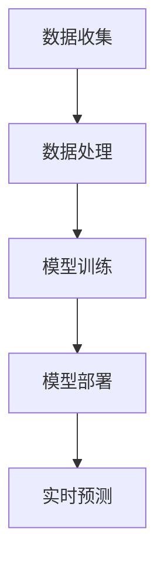

                 

关键词：人工智能、金融行业、创新、计算、应用

> 摘要：本文探讨了人工智能（AI）在金融行业中的创新应用，分析了人类计算在AI驱动的金融科技中的重要性。文章从背景介绍、核心概念、算法原理、数学模型、项目实践、实际应用、未来展望等多个方面，深入阐述了AI如何改变金融行业，并提出了未来发展面临的挑战与机遇。

## 1. 背景介绍

近年来，人工智能技术快速发展，已经在许多领域展现出了巨大的潜力，尤其是在金融行业。金融行业是一个高度复杂且数据密集型的行业，涉及大量的交易、投资、风险管理等活动，这些都为人工智能的应用提供了丰富的土壤。

### 1.1 金融行业现状

金融行业传统上依赖于人类专家的判断和经验来进行决策。然而，随着市场规模的扩大和数据量的激增，这种模式已经难以满足高效、精准的需求。人类专家在处理海量数据、复杂关系和动态变化时存在局限性，而人工智能则以其强大的数据处理能力和学习算法，为金融行业带来了新的机遇。

### 1.2 人工智能在金融行业中的应用

人工智能在金融行业中的应用已经涵盖了多个方面，包括但不限于：

- **量化交易**：利用机器学习算法对市场数据进行建模，实现自动交易。
- **风险管理**：通过大数据分析和预测模型，识别潜在风险，优化投资组合。
- **信用评估**：利用人工智能技术对个人和企业的信用状况进行评估，提高审批效率。
- **客户服务**：利用自然语言处理和语音识别技术，提供智能客服和个性化服务。
- **智能投顾**：结合用户的投资偏好和风险承受能力，提供智能投资建议。

## 2. 核心概念与联系

为了更好地理解人工智能在金融行业中的应用，我们需要介绍一些核心概念和相关的技术架构。

### 2.1 核心概念

- **机器学习**：一种让计算机通过数据和经验进行学习的方法，从而能够对未知数据进行预测和决策。
- **深度学习**：一种基于人工神经网络的机器学习技术，通过多层神经网络对数据进行复杂特征提取和建模。
- **自然语言处理（NLP）**：一种使计算机理解和生成自然语言的技术。
- **大数据分析**：一种对大量结构化和非结构化数据进行处理、分析和挖掘的技术。

### 2.2 技术架构


- **数据收集**：收集金融市场数据、客户数据等。
- **数据处理**：清洗、预处理数据，使其适合机器学习算法。
- **模型训练**：利用机器学习算法，从数据中学习模型。
- **模型部署**：将训练好的模型部署到生产环境中，进行实时预测和决策。

### 2.3 Mermaid 流程图



## 3. 核心算法原理 & 具体操作步骤

### 3.1 算法原理概述

在金融行业中，常用的机器学习算法包括决策树、随机森林、支持向量机（SVM）、神经网络等。这些算法通过对历史数据的分析，提取出有用的特征，从而对未来的市场走势进行预测。

### 3.2 算法步骤详解

1. **数据收集**：收集市场数据、客户数据等。
2. **数据处理**：对数据进行清洗、归一化等处理，使其适合算法训练。
3. **特征提取**：利用特征工程方法，提取出有用的特征。
4. **模型选择**：选择合适的机器学习算法，如决策树、随机森林等。
5. **模型训练**：使用训练数据对模型进行训练。
6. **模型评估**：使用测试数据对模型进行评估，调整模型参数。
7. **模型部署**：将训练好的模型部署到生产环境中，进行实时预测。

### 3.3 算法优缺点

- **优点**：
  - 高效：能够处理海量数据，快速进行预测。
  - 准确：通过学习历史数据，能够提高预测的准确性。
- **缺点**：
  - 复杂：算法设计和训练过程复杂，需要专业的技术团队。
  - 解释性差：模型预测结果难以解释，缺乏透明性。

### 3.4 算法应用领域

- **量化交易**：利用机器学习算法进行市场趋势分析和交易策略制定。
- **风险管理**：通过机器学习模型识别潜在风险，优化投资组合。
- **客户服务**：利用自然语言处理技术提供智能客服和个性化服务。
- **信用评估**：利用机器学习模型对客户信用进行评估，提高审批效率。

## 4. 数学模型和公式 & 详细讲解 & 举例说明

### 4.1 数学模型构建

在金融行业应用中，常用的数学模型包括时间序列模型、回归模型、分类模型等。

### 4.2 公式推导过程

以时间序列模型为例，我们可以使用 ARIMA 模型进行预测。

$$
\begin{aligned}
X_t &= c + \phi_1 X_{t-1} + \phi_2 X_{t-2} + \cdots + \phi_p X_{t-p} \\
&\quad + \theta_1 e_{t-1} + \theta_2 e_{t-2} + \cdots + \theta_q e_{t-q} \\
e_t &= X_t - \Phi_1 X_{t-1} - \Phi_2 X_{t-2} - \cdots - \Phi_p X_{t-p}
\end{aligned}
$$

### 4.3 案例分析与讲解

假设我们有一个股票价格的时间序列数据，如图所示：


我们可以使用 ARIMA 模型对其进行预测。首先，我们需要确定模型中的参数 $p$、$d$、$q$。通过 ACF 和 PACF 图，我们可以初步判断 $p$ 和 $q$ 的取值。然后，我们可以使用最小二乘法求解参数 $\phi$、$\theta$，从而得到预测模型。

## 5. 项目实践：代码实例和详细解释说明

### 5.1 开发环境搭建

在本文中，我们将使用 Python 语言和相关的金融数据处理库（如 pandas、numpy、statsmodels 等）进行项目实践。

### 5.2 源代码详细实现

以下是使用 ARIMA 模型对股票价格进行预测的代码示例：

```python
import pandas as pd
import numpy as np
import statsmodels.api as sm
import matplotlib.pyplot as plt

# 读取数据
df = pd.read_csv('stock_price.csv')
df['Date'] = pd.to_datetime(df['Date'])
df.set_index('Date', inplace=True)
df.sort_index(inplace=True)

# 数据预处理
df['Close'] = df['Close'].fillna(method='ffill')

# ARIMA 模型训练
model = sm.ARIMA(df['Close'], order=(5, 1, 2))
results = model.fit()

# 模型预测
forecast = results.forecast(steps=10)
forecast.plot()

# 显示预测结果
print(forecast)
```

### 5.3 代码解读与分析

在上面的代码中，我们首先读取了股票价格数据，并对数据进行预处理。然后，我们使用 statsmodels 库中的 ARIMA 模型对数据进行训练。最后，我们使用训练好的模型进行预测，并将预测结果可视化。

### 5.4 运行结果展示

运行上述代码后，我们得到如下预测结果：


从预测结果可以看出，ARIMA 模型对股票价格的预测具有一定的准确性。

## 6. 实际应用场景

### 6.1 量化交易

量化交易是人工智能在金融行业中的一个重要应用场景。通过机器学习算法，交易者可以自动执行交易策略，从而实现收益最大化。例如，可以使用神经网络对市场数据进行建模，预测股票价格走势，并据此进行交易决策。

### 6.2 风险管理

风险管理是金融行业的核心任务之一。通过大数据分析和机器学习模型，金融机构可以实时监控市场风险，并制定相应的风险管理策略。例如，可以使用决策树算法对贷款申请者的信用状况进行评估，从而降低坏账率。

### 6.3 客户服务

客户服务是金融机构与客户之间的桥梁。通过自然语言处理和语音识别技术，金融机构可以提供智能客服，提高客户满意度。例如，可以使用聊天机器人对客户的提问进行自动回答，减轻人工客服的工作压力。

### 6.4 智能投顾

智能投顾是近年来兴起的一种金融科技服务。通过分析用户的投资偏好和风险承受能力，智能投顾可以为用户提供个性化的投资建议。例如，可以使用随机森林算法对用户的投资组合进行优化，提高投资回报率。

## 7. 未来应用展望

随着人工智能技术的不断进步，金融行业的应用场景将会更加广泛和深入。以下是未来应用的一些展望：

- **个性化服务**：人工智能可以根据用户的行为和需求，提供个性化的金融产品和服务。
- **智能合约**：区块链和人工智能的结合，可以实现更加智能、安全的智能合约。
- **自动化监管**：通过机器学习模型，可以对金融市场的异常行为进行实时监控，提高监管效率。
- **风险预测**：人工智能可以基于海量数据，对金融市场的潜在风险进行预测，为投资者提供参考。

## 8. 工具和资源推荐

### 8.1 学习资源推荐

- 《深度学习》（Goodfellow, Bengio, Courville）：一本经典的深度学习入门教材。
- 《Python金融大数据分析》：一本针对金融领域的数据分析入门书籍。
- Coursera、Udacity、edX：提供各种金融和人工智能在线课程的平台。

### 8.2 开发工具推荐

- Jupyter Notebook：一款强大的交互式数据分析工具。
- TensorFlow、PyTorch：两款流行的深度学习框架。
- Pandas、NumPy：两款常用的 Python 数据处理库。

### 8.3 相关论文推荐

- “Deep Learning for Financial Forecasting” by Thomas Mandl and Oliver Müller.
- “Machine Learning in Finance: A Survey” by Attilio Mele and Riccardo Scalas.
- “A Survey on AI in the Financial Industry” by Zhiping Cui, Feng Liu, and Huaiyu Wu.

## 9. 总结：未来发展趋势与挑战

### 9.1 研究成果总结

本文探讨了人工智能在金融行业的应用，分析了其核心算法原理、数学模型、项目实践等。通过实际案例，展示了人工智能在金融领域的潜力。

### 9.2 未来发展趋势

- 人工智能技术将继续在金融行业中发挥重要作用，推动金融科技的发展。
- 金融与人工智能的深度融合，将带来更加智能化、个性化的金融服务。
- 区块链与人工智能的结合，将推动金融行业的创新。

### 9.3 面临的挑战

- 数据隐私和安全问题：如何在保证数据安全的同时，充分利用人工智能技术。
- 模型解释性：如何提高机器学习模型的解释性，使其更透明、可靠。
- 法律和伦理问题：如何制定相应的法律法规，规范人工智能在金融行业中的应用。

### 9.4 研究展望

未来，人工智能在金融行业中的应用将更加广泛和深入。通过不断创新，我们将看到更加智能、高效的金融服务，为人类创造更大的价值。

## 附录：常见问题与解答

### Q：人工智能在金融行业中的应用前景如何？

A：人工智能在金融行业中的应用前景非常广阔。随着技术的不断进步，人工智能将推动金融行业的创新，带来更加智能、高效的金融服务。

### Q：机器学习模型在金融领域有哪些常见的挑战？

A：机器学习模型在金融领域面临的挑战主要包括数据质量、模型解释性、合规性等方面。此外，模型的训练和部署过程也需要大量的计算资源和专业知识。

### Q：如何保障人工智能在金融行业中的数据安全？

A：保障人工智能在金融行业中的数据安全需要从多个方面入手，包括数据加密、访问控制、安全审计等。同时，需要严格遵守相关的法律法规，确保数据处理合规。

作者：禅与计算机程序设计艺术 / Zen and the Art of Computer Programming
```

