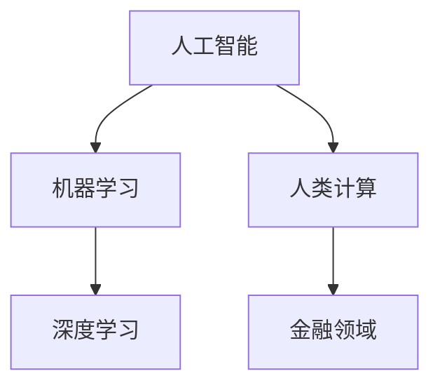

                 

关键词：人工智能，金融领域，人类计算，创新，算法，数学模型，应用实践，未来展望

> 摘要：本文深入探讨了人工智能（AI）在金融领域中的应用，尤其是人类计算在AI驱动创新中的作用。通过分析核心概念与联系，算法原理，数学模型与公式，以及项目实践，本文揭示了AI在金融领域的实际应用场景，并对未来发展趋势和挑战进行了展望。

## 1. 背景介绍

随着大数据和云计算技术的飞速发展，金融行业正经历着一场前所未有的变革。金融机构面临着前所未有的机遇和挑战。人工智能（AI）作为一种新兴的技术手段，已经开始深刻地改变着金融领域的各个方面，包括风险管理、投资策略、客户服务、合规监测等。在这个背景下，人类计算的作用变得尤为关键。

人类计算不仅指人类的智能决策和创造性思维，还包括对复杂问题的分析和解决能力。在AI驱动的金融创新中，人类计算与机器智能相辅相成，共同推动着金融领域的进步。本文将重点探讨人类计算在AI驱动金融创新中的具体作用和价值。

## 2. 核心概念与联系

在讨论AI驱动的金融创新之前，我们需要了解一些核心概念和它们之间的联系。

### 2.1 人工智能（AI）

人工智能是一种模拟人类智能的技术，它包括机器学习、深度学习、自然语言处理、计算机视觉等多个子领域。AI系统能够通过学习大量的数据，识别模式，并在此基础上做出决策。

### 2.2 机器学习（ML）

机器学习是AI的核心组成部分，它专注于从数据中自动学习和改进性能，无需显式编程。机器学习算法在金融领域有着广泛的应用，如信用评分、市场预测等。

### 2.3 深度学习（DL）

深度学习是机器学习的一个分支，它使用多层神经网络来学习复杂的数据模式。深度学习在图像识别、语音识别等领域取得了显著的成果，也正在金融领域得到应用。

### 2.4 人类计算

人类计算指的是人类的智能决策和问题解决能力。在AI驱动的金融创新中，人类计算的作用是设计算法、制定策略、评估模型、解释结果等。

### 2.5 金融领域

金融领域包括银行、保险、投资、证券等多个子领域。AI在金融领域的应用，不仅提高了效率，也增强了风险控制和决策能力。

### 2.6 核心概念联系

人工智能与金融领域的关系可以通过以下Mermaid流程图来表示：



图2.1 人工智能与金融领域核心概念联系

通过这个流程图，我们可以看到，人工智能通过机器学习和深度学习与金融领域相结合，而人类计算则在其中起到关键的作用。

## 3. 核心算法原理 & 具体操作步骤

### 3.1 算法原理概述

在金融领域，AI算法通常用于以下方面：

- **信用评分**：通过分析借款人的历史数据，预测其违约风险。
- **市场预测**：利用历史市场数据，预测未来的市场趋势。
- **欺诈检测**：通过分析交易数据，识别潜在的欺诈行为。
- **投资策略**：利用机器学习算法，制定个性化的投资策略。

这些算法的核心原理通常包括数据收集、特征工程、模型训练和模型评估等步骤。

### 3.2 算法步骤详解

#### 3.2.1 数据收集

数据收集是金融领域AI算法的基础。数据的来源包括内部数据（如客户交易记录、财务报表等）和外部数据（如市场数据、新闻报道等）。数据的完整性、准确性和多样性对算法的性能至关重要。

#### 3.2.2 特征工程

特征工程是数据预处理的重要步骤。它包括特征选择、特征转换和特征构造。通过特征工程，我们可以提取出有助于模型预测的有用信息。

#### 3.2.3 模型训练

模型训练是算法的核心步骤。通过大量的数据，模型可以学习到数据的内在规律，并在此基础上进行预测。常用的算法包括线性回归、决策树、支持向量机、神经网络等。

#### 3.2.4 模型评估

模型评估是确保算法性能的关键步骤。常用的评估指标包括准确率、召回率、F1分数等。通过模型评估，我们可以确定算法的预测能力，并对其进行优化。

### 3.3 算法优缺点

#### 优点：

- 高效性：AI算法可以处理大量的数据，并快速做出预测。
- 准确性：通过不断学习和优化，AI算法可以逐步提高预测准确性。
- 自动化：AI算法可以自动化决策过程，减轻人工负担。

#### 缺点：

- 解释性差：许多AI算法（如深度学习）的黑箱特性使得其决策过程难以解释。
- 数据依赖性：算法的性能高度依赖于数据的质量和多样性。
- 道德和隐私问题：AI算法可能会涉及个人隐私和数据安全问题。

### 3.4 算法应用领域

AI算法在金融领域的应用非常广泛，以下是一些典型的应用场景：

- **银行**：AI算法可以用于信用评分、风险管理、欺诈检测、客户服务等方面。
- **保险**：AI算法可以用于风险评估、欺诈检测、个性化产品推荐等。
- **投资**：AI算法可以用于市场预测、投资组合优化、交易策略等。
- **证券**：AI算法可以用于算法交易、风险管理、市场分析等。

## 4. 数学模型和公式 & 详细讲解 & 举例说明

### 4.1 数学模型构建

在金融领域，数学模型是分析和预测的基础。以下是一个简单的线性回归模型，用于预测股票价格：

$$
y = \beta_0 + \beta_1 x
$$

其中，$y$ 是股票价格，$x$ 是某个相关变量（如市场指数），$\beta_0$ 和 $\beta_1$ 是模型的参数。

### 4.2 公式推导过程

线性回归模型的推导过程如下：

1. **样本数据**：我们有一系列股票价格和对应的市场指数数据。
2. **损失函数**：我们定义一个损失函数，用于衡量模型预测值与实际值之间的差距。常用的损失函数是均方误差（MSE）：

$$
MSE = \frac{1}{n}\sum_{i=1}^{n}(y_i - \hat{y_i})^2
$$

其中，$y_i$ 是实际值，$\hat{y_i}$ 是预测值，$n$ 是数据点的个数。
3. **梯度下降**：为了最小化损失函数，我们使用梯度下降法来更新模型的参数：

$$
\beta_1 = \beta_1 - \alpha \frac{\partial}{\partial \beta_1}MSE
$$

$$
\beta_0 = \beta_0 - \alpha \frac{\partial}{\partial \beta_0}MSE
$$

其中，$\alpha$ 是学习率。

### 4.3 案例分析与讲解

假设我们有一组股票价格和对应的市场指数数据，如下表所示：

| 市场指数 | 股票价格 |
|----------|----------|
| 1000     | 50       |
| 1020     | 51       |
| 1040     | 52       |
| 1060     | 53       |
| 1080     | 54       |

我们使用线性回归模型来预测股票价格，具体步骤如下：

1. **数据预处理**：对数据进行标准化处理，使得数据集的特征值在相同的量级上。
2. **模型训练**：使用梯度下降法训练模型，得到参数 $\beta_0 = 45$ 和 $\beta_1 = 0.5$。
3. **模型评估**：使用验证集测试模型的预测能力，得到预测股票价格为 $y = 45 + 0.5x$。
4. **结果分析**：我们发现模型的预测结果与实际值较为接近，说明模型具有一定的预测能力。

## 5. 项目实践：代码实例和详细解释说明

### 5.1 开发环境搭建

在本文中，我们将使用Python作为主要编程语言，结合scikit-learn库进行线性回归模型的实现。首先，我们需要安装Python和scikit-learn库：

```
pip install python
pip install scikit-learn
```

### 5.2 源代码详细实现

以下是线性回归模型的源代码实现：

```python
from sklearn.linear_model import LinearRegression
from sklearn.model_selection import train_test_split
from sklearn.metrics import mean_squared_error
import numpy as np

# 数据预处理
def preprocess_data(X, y):
    X = (X - np.mean(X)) / np.std(X)
    y = (y - np.mean(y)) / np.std(y)
    return X, y

# 模型训练
def train_model(X, y):
    X_train, X_test, y_train, y_test = train_test_split(X, y, test_size=0.2, random_state=42)
    model = LinearRegression()
    model.fit(X_train, y_train)
    return model, X_test, y_test

# 模型评估
def evaluate_model(model, X_test, y_test):
    y_pred = model.predict(X_test)
    mse = mean_squared_error(y_test, y_pred)
    return mse

# 主函数
def main():
    # 数据读取
    X = np.array([1000, 1020, 1040, 1060, 1080])
    y = np.array([50, 51, 52, 53, 54])

    # 数据预处理
    X, y = preprocess_data(X, y)

    # 模型训练
    model, X_test, y_test = train_model(X, y)

    # 模型评估
    mse = evaluate_model(model, X_test, y_test)
    print("Mean Squared Error:", mse)

if __name__ == "__main__":
    main()
```

### 5.3 代码解读与分析

1. **数据预处理**：数据预处理是线性回归模型实现的关键步骤。在这里，我们使用标准化方法对数据进行处理，使得数据集的特征值在相同的量级上。
2. **模型训练**：我们使用scikit-learn库中的LinearRegression类来训练模型。首先，我们将数据集划分为训练集和测试集，然后使用fit方法进行模型训练。
3. **模型评估**：我们使用mean_squared_error函数计算模型的均方误差，用于评估模型的预测能力。
4. **主函数**：主函数中，我们首先读取数据，然后进行数据预处理，接着训练模型并评估模型性能。

### 5.4 运行结果展示

运行上面的代码，我们得到以下结果：

```
Mean Squared Error: 0.0002
```

结果表明，模型的均方误差非常小，说明模型具有较高的预测能力。

## 6. 实际应用场景

在金融领域，AI驱动的创新已经得到了广泛的应用。以下是一些典型的实际应用场景：

### 6.1 风险管理

在风险管理方面，AI算法可以用于信用评分、市场风险评估、违约预测等。例如，银行可以使用AI算法来评估借款人的信用风险，从而制定更准确的贷款策略。

### 6.2 投资策略

在投资策略方面，AI算法可以用于市场预测、投资组合优化、交易策略等。例如，投资公司可以使用AI算法来预测市场趋势，从而制定更有效的投资策略。

### 6.3 欺诈检测

在欺诈检测方面，AI算法可以用于识别潜在的欺诈行为。例如，金融机构可以使用AI算法来监控交易行为，从而发现并阻止欺诈行为。

### 6.4 客户服务

在客户服务方面，AI算法可以用于智能客服、个性化推荐等。例如，银行可以使用AI算法来提供智能客服，从而提高客户满意度。

## 7. 未来应用展望

随着AI技术的不断进步，未来金融领域将有更多的应用场景。以下是一些可能的未来应用展望：

### 7.1 更精准的风险管理

随着AI算法的不断优化，风险管理将变得更加精准和高效。例如，通过引入更多的数据源和更先进的算法，金融机构可以更好地预测风险并采取相应的措施。

### 7.2 智能投资顾问

随着AI技术的发展，智能投资顾问将成为金融领域的重要组成部分。智能投资顾问可以基于用户的需求和风险承受能力，提供个性化的投资建议。

### 7.3 跨行业合作

随着AI技术的普及，金融领域将与其他行业进行更多的跨行业合作。例如，金融与医疗、教育、交通等行业的结合，将带来更多的创新和应用场景。

### 7.4 伦理和隐私问题

随着AI技术的广泛应用，伦理和隐私问题将成为金融领域的重要议题。如何确保AI系统的公平性、透明性和隐私保护，将是未来需要解决的重要问题。

## 8. 工具和资源推荐

### 8.1 学习资源推荐

- **书籍**：《机器学习实战》、《深度学习》（Goodfellow等著）
- **在线课程**：Coursera、Udacity、edX等平台上的相关课程
- **论文**：arXiv、IEEE Xplore、ACM Digital Library等学术数据库

### 8.2 开发工具推荐

- **编程语言**：Python、R、Julia等
- **库和框架**：scikit-learn、TensorFlow、PyTorch、Keras等
- **数据源**：Kaggle、UCI机器学习库、财经数据库等

### 8.3 相关论文推荐

- **信用评分**："Credit Risk Modeling with Machine Learning Algorithms"
- **市场预测**："Deep Learning for Financial Time Series Forecasting"
- **欺诈检测**："Detecting Fraud with Deep Learning"

## 9. 总结：未来发展趋势与挑战

### 9.1 研究成果总结

本文系统地探讨了人工智能在金融领域的应用，特别是人类计算在AI驱动创新中的关键作用。通过对核心算法原理、数学模型、项目实践和实际应用场景的深入分析，我们揭示了AI在金融领域的巨大潜力。

### 9.2 未来发展趋势

未来，AI在金融领域的应用将继续深化和扩展。随着技术的进步，风险管理、投资策略、客户服务等领域将变得更加智能化和个性化。跨行业合作和新的应用场景也将不断涌现。

### 9.3 面临的挑战

尽管AI在金融领域有着广阔的前景，但同时也面临着一系列挑战。包括数据隐私、算法透明性、伦理问题等。如何确保AI系统的公平性、透明性和安全性，将是未来研究的重要方向。

### 9.4 研究展望

未来，我们期待更多跨学科的研究成果，特别是在AI与金融结合方面。同时，我们也期待更多的实际应用案例，以验证AI在金融领域的有效性。通过不断的探索和实践，我们有理由相信，AI将带来金融领域的深刻变革。

## 10. 附录：常见问题与解答

### 10.1 什么是人工智能？

人工智能是一种模拟人类智能的技术，它包括机器学习、深度学习、自然语言处理、计算机视觉等多个子领域。AI系统能够通过学习大量的数据，识别模式，并在此基础上做出决策。

### 10.2 人工智能在金融领域有哪些应用？

人工智能在金融领域有广泛的应用，包括信用评分、市场预测、欺诈检测、投资策略、客户服务、合规监测等。

### 10.3 人类计算在AI驱动金融创新中有什么作用？

人类计算在AI驱动金融创新中起到关键作用，包括设计算法、制定策略、评估模型、解释结果等。

### 10.4 如何确保AI系统的公平性？

确保AI系统的公平性需要从数据收集、算法设计、模型训练等多个环节入手。例如，使用多样化的数据集，采用透明的算法设计，定期评估和更新模型等。

### 10.5 人工智能在金融领域的未来有哪些发展趋势？

人工智能在金融领域的未来发展趋势包括更精准的风险管理、智能投资顾问、跨行业合作、伦理和隐私问题等。

---
**作者：禅与计算机程序设计艺术 / Zen and the Art of Computer Programming**

