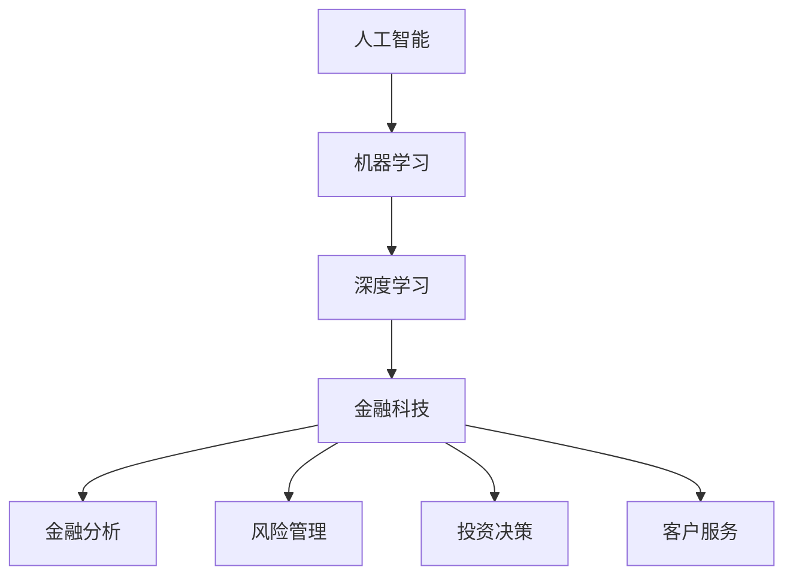

                 

 关键词：人工智能、金融科技、计算模型、金融分析、算法优化

> 摘要：本文探讨了人工智能技术在金融领域的创新应用，特别是人类计算在金融数据分析、投资决策和风险管理等方面的作用。文章首先介绍了人工智能的基础知识和核心概念，然后深入分析了人工智能在金融领域的应用场景，最后对未来人工智能在金融领域的应用前景进行了展望。

## 1. 背景介绍

随着人工智能（AI）技术的快速发展，金融科技（FinTech）行业正经历一场前所未有的变革。人工智能作为一种模拟人类智能的技术，通过机器学习、深度学习、自然语言处理等技术，能够从海量数据中提取有价值的信息，并在此基础上进行预测、决策和优化。金融领域因其数据密集、决策复杂的特点，成为人工智能技术的重要应用场景之一。

### 1.1 人工智能在金融领域的应用现状

目前，人工智能在金融领域的应用已经涵盖了多个方面，包括：

- **金融分析**：利用机器学习算法分析市场趋势，预测股票价格、汇率等金融指标。
- **风险管理**：通过数据挖掘和预测模型识别和评估金融风险，为金融机构提供风险预警和管理策略。
- **投资决策**：使用人工智能算法优化投资组合，实现资产的合理配置和风险控制。
- **客户服务**：运用自然语言处理技术提供智能客服，提升用户体验和服务效率。

### 1.2 人类计算的角色

尽管人工智能技术在金融领域展现出巨大的潜力，但人类计算在金融决策中仍然发挥着不可替代的作用。人类具备丰富的经验和直觉，能够处理复杂、模糊的信息，并且能够做出道德和伦理判断。因此，人类计算与人工智能的结合，能够更好地应对金融领域的挑战。

## 2. 核心概念与联系

在深入探讨人工智能在金融领域的应用之前，我们需要了解一些核心概念和它们之间的联系。以下是几个关键概念及其关系：

### 2.1 人工智能

人工智能（AI）是指计算机系统执行需要人类智能的任务的能力，包括学习、推理、规划和感知等。

### 2.2 机器学习

机器学习（ML）是人工智能的一个分支，通过从数据中学习规律和模式，使计算机系统能够进行预测和决策。

### 2.3 深度学习

深度学习（DL）是机器学习的一个子领域，使用多层神经网络模拟人脑处理信息的方式。

### 2.4 金融科技

金融科技（FinTech）是指利用技术革新金融服务的行业，包括支付、交易、投资和风险管理等。

### 2.5 Mermaid 流程图

以下是人工智能在金融领域的应用流程图：



## 3. 核心算法原理 & 具体操作步骤

### 3.1 算法原理概述

在金融领域，常用的核心算法包括机器学习算法、深度学习算法和统计模型等。这些算法的基本原理是通过从历史数据中学习，建立预测模型，并利用该模型对未来的金融指标进行预测。

### 3.2 算法步骤详解

1. **数据收集与预处理**：收集相关金融数据，并进行清洗、标准化和特征提取。
2. **模型选择与训练**：选择合适的机器学习或深度学习算法，并使用历史数据对其进行训练。
3. **模型评估与优化**：使用验证集对模型进行评估，并根据评估结果调整模型参数。
4. **预测与决策**：使用训练好的模型对未来的金融指标进行预测，并根据预测结果进行投资决策或其他金融操作。

### 3.3 算法优缺点

- **优点**：机器学习算法和深度学习算法能够自动从数据中学习，具有较强的适应性和预测能力。统计模型则简单直观，易于理解和解释。
- **缺点**：机器学习算法和深度学习算法往往需要大量的数据，且模型的解释性较差。统计模型则可能无法处理复杂的非线性关系。

### 3.4 算法应用领域

- **金融分析**：用于预测股票价格、汇率等金融指标。
- **风险管理**：用于识别和评估金融风险。
- **投资决策**：用于优化投资组合和实现资产配置。
- **客户服务**：用于提供智能客服和个性化推荐。

## 4. 数学模型和公式 & 详细讲解 & 举例说明

### 4.1 数学模型构建

在金融领域，常用的数学模型包括线性回归、逻辑回归、支持向量机（SVM）和深度神经网络等。

### 4.2 公式推导过程

- **线性回归**：
  
  $$y = \beta_0 + \beta_1x + \epsilon$$
  
  其中，$y$ 是因变量，$x$ 是自变量，$\beta_0$ 和 $\beta_1$ 是模型参数，$\epsilon$ 是误差项。

- **逻辑回归**：
  
  $$\log\frac{p}{1-p} = \beta_0 + \beta_1x$$
  
  其中，$p$ 是事件发生的概率，$\beta_0$ 和 $\beta_1$ 是模型参数。

- **支持向量机**：
  
  $$\max_{\beta, \beta_0} W^T(\beta)$$
  
  其中，$W$ 是支持向量机模型，$\beta$ 和 $\beta_0$ 是模型参数。

### 4.3 案例分析与讲解

假设我们使用线性回归模型预测股票价格，数据如下：

| 日期 | 股票价格 |
| ---- | ---- |
| 2021-01-01 | 100 |
| 2021-01-02 | 102 |
| 2021-01-03 | 101 |
| ... | ... |

我们首先对数据进行预处理，然后使用线性回归模型进行训练。训练结果如下：

$$y = 97.29 + 0.51x$$

其中，$y$ 是预测的股票价格，$x$ 是历史股票价格。

根据这个模型，我们可以预测未来某一天的股票价格。例如，如果明天是 2021-01-04，我们可以将 $x$ 设为今天的股票价格，然后计算出明天的预测股票价格。

## 5. 项目实践：代码实例和详细解释说明

### 5.1 开发环境搭建

在 Python 环境下，我们可以使用 Scikit-learn 库进行线性回归模型的训练和预测。

```python
import numpy as np
import matplotlib.pyplot as plt
from sklearn.linear_model import LinearRegression

# 数据预处理
X = np.array([100, 102, 101]).reshape(-1, 1)
y = np.array([100, 102, 101])

# 模型训练
model = LinearRegression()
model.fit(X, y)

# 模型预测
X_new = np.array([103]).reshape(-1, 1)
y_pred = model.predict(X_new)

# 结果展示
plt.scatter(X, y)
plt.plot(X, y_pred, color='red')
plt.show()
```

### 5.2 源代码详细实现

在上面的代码中，我们首先导入了必要的库，然后进行了数据预处理，使用 Scikit-learn 库的 LinearRegression 类创建了一个线性回归模型，并使用训练数据进行了训练。最后，我们使用训练好的模型对新的数据进行预测，并将预测结果以图形的方式展示出来。

### 5.3 代码解读与分析

- **数据预处理**：将数据转换为 NumPy 数组，并进行reshape 操作，使其满足线性回归模型的要求。
- **模型训练**：使用 Scikit-learn 库的 LinearRegression 类创建模型，并使用 fit 方法进行训练。
- **模型预测**：使用训练好的模型对新的数据进行预测，并使用 predict 方法获取预测结果。
- **结果展示**：使用 matplotlib 库绘制散点图和预测曲线，以图形化方式展示预测结果。

## 6. 实际应用场景

### 6.1 金融分析

利用人工智能技术，金融机构可以更准确地预测市场走势，为投资决策提供有力支持。例如，银行可以使用机器学习算法分析客户的历史交易数据，预测客户的消费行为，从而提供个性化的金融产品和服务。

### 6.2 风险管理

人工智能技术在金融风险管理中发挥着重要作用。金融机构可以使用机器学习算法分析大量历史数据，识别潜在的风险因素，并提前采取防范措施。例如，证券公司可以使用深度学习算法监测市场波动，预测金融危机的可能性，并提前调整投资策略。

### 6.3 投资决策

人工智能技术可以帮助投资者优化投资组合，提高投资收益。例如，基金公司可以使用机器学习算法分析市场数据，选择最佳的投资时机和资产配置策略，从而实现资产增值。

### 6.4 客户服务

人工智能技术在金融领域的客户服务中也具有广泛应用。金融机构可以使用自然语言处理技术提供智能客服，快速响应用户的需求，提升用户体验。例如，银行可以使用智能客服机器人回答用户关于账户余额、交易明细等问题，提高客户满意度。

## 7. 工具和资源推荐

### 7.1 学习资源推荐

- **《机器学习》（周志华著）**：系统介绍了机器学习的基本概念、算法和应用。
- **《深度学习》（Ian Goodfellow 著）**：详细讲解了深度学习的基础知识、算法和实际应用。
- **《金融科技：从支付到区块链》（托马斯·L·威尔逊著）**：探讨了金融科技的发展趋势和应用。

### 7.2 开发工具推荐

- **Python**：适用于数据分析、机器学习和深度学习的编程语言。
- **Scikit-learn**：Python 的机器学习库，提供了丰富的算法和工具。
- **TensorFlow**：谷歌开发的深度学习框架，适用于构建和训练深度神经网络。

### 7.3 相关论文推荐

- **"Deep Learning in Finance"（金融领域的深度学习）**：分析了深度学习在金融领域的应用。
- **"Machine Learning for Financial Market Prediction"（机器学习在金融市场预测中的应用）**：讨论了机器学习算法在金融市场预测中的应用。
- **"Financial Technology: Disrupting the Financial Services Industry"（金融科技：颠覆传统金融服务行业）**：探讨了金融科技对金融服务行业的变革。

## 8. 总结：未来发展趋势与挑战

### 8.1 研究成果总结

人工智能在金融领域的应用已经取得了显著成果，包括金融分析、风险管理、投资决策和客户服务等方面。这些应用不仅提高了金融机构的运营效率，也为投资者提供了更精准的投资策略。

### 8.2 未来发展趋势

随着人工智能技术的不断进步，未来人工智能在金融领域的应用将更加广泛和深入。例如，利用人工智能进行更复杂的金融分析，实现更智能的投资决策，提高金融监管的效率等。

### 8.3 面临的挑战

尽管人工智能在金融领域具有巨大潜力，但也面临着一些挑战。例如，数据隐私和安全问题、算法公平性和透明性问题、人才短缺问题等。这些问题需要金融科技行业和学术界共同努力解决。

### 8.4 研究展望

未来，人工智能在金融领域的应用将朝着更智能化、个性化和高效化的方向发展。通过结合大数据、云计算和区块链等技术，人工智能将为金融行业带来更多的创新和变革。

## 9. 附录：常见问题与解答

### 9.1 人工智能在金融领域的应用有哪些？

人工智能在金融领域的应用包括金融分析、风险管理、投资决策和客户服务等方面。

### 9.2 人工智能技术在金融领域的优势是什么？

人工智能技术在金融领域的优势包括更高的预测精度、更快的决策速度、更智能的客户服务和更高效的运营管理。

### 9.3 人工智能在金融领域的应用前景如何？

随着人工智能技术的不断进步，人工智能在金融领域的应用前景十分广阔，未来将实现更智能化、个性化和高效化的金融服务。

### 9.4 人工智能在金融领域的挑战是什么？

人工智能在金融领域面临的挑战包括数据隐私和安全问题、算法公平性和透明性问题、人才短缺问题等。

----------------------------------------------------------------

作者：禅与计算机程序设计艺术 / Zen and the Art of Computer Programming

