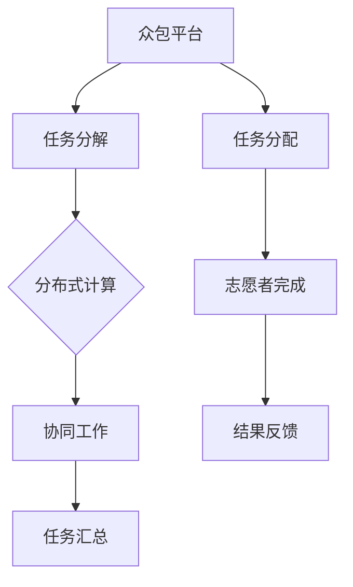
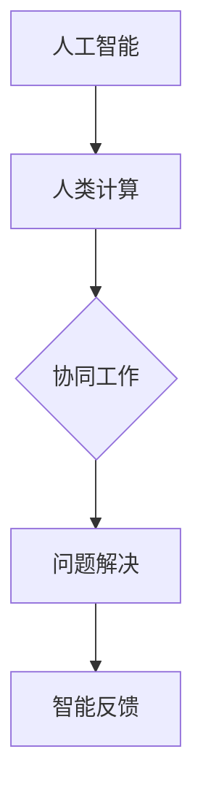
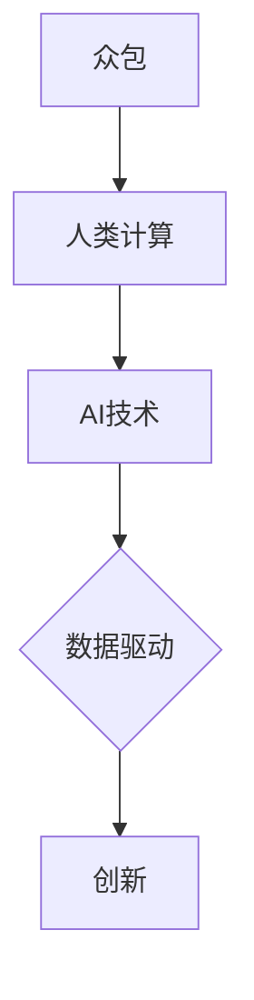

                 

 > **关键词**：人工智能，众包，人类计算，创新，数据驱动，协同工作，算法优化，开源社区，分布式计算。

> **摘要**：本文将探讨人工智能领域如何通过众包和人类计算实现创新。我们将详细分析这一模式的核心概念、算法原理、数学模型以及实际应用案例，并提出未来发展的展望。

## 1. 背景介绍

随着人工智能技术的快速发展，传统的研究模式和开发方法已经逐渐无法满足日益复杂的计算需求。在这种背景下，众包和人类计算作为一种新型的协作方式，正日益受到关注。众包（Crowdsourcing）是指通过互联网平台，将大规模的复杂任务分解成多个小任务，然后分配给众多志愿者或专业人士完成。而人类计算（Human Computation）则是利用人类智慧和直觉，处理一些机器难以解决的复杂问题。这两种模式的结合，为人工智能的创新提供了新的动力。

## 2. 核心概念与联系

### 2.1 众包

众包的核心在于将复杂任务分解，通过分布式计算的方式，利用大量个体完成单个任务。这种模式的关键在于任务分解和协同工作的有效性。



### 2.2 人类计算

人类计算强调的是人类智慧和直觉在复杂问题解决中的作用。通过与人工智能技术的结合，可以处理一些机器难以解决的难题。



### 2.3 AI驱动的创新

AI驱动的创新通过众包和人类计算的结合，实现了人工智能领域的快速发展。这种模式不仅提高了任务完成的效率，还促进了知识的共享和创新。



## 3. 核心算法原理 & 具体操作步骤

### 3.1 算法原理概述

AI驱动的创新模式中的核心算法主要包括：

1. **任务分解算法**：将复杂任务分解成多个小任务，确保每个任务可以被个体独立完成。
2. **协同工作算法**：实现个体之间的有效协作，确保任务能够高效完成。
3. **机器学习算法**：利用人类计算的结果，优化机器学习模型，提升模型性能。

### 3.2 算法步骤详解

#### 3.2.1 任务分解

1. **任务识别**：确定需要完成的任务及其复杂度。
2. **任务分解**：将任务分解成多个小任务，确保每个小任务都能够独立完成。
3. **任务分配**：将分解后的任务分配给合适的志愿者或专业人士。

#### 3.2.2 协同工作

1. **任务协作**：志愿者或专业人士完成任务，并将结果反馈给众包平台。
2. **结果汇总**：众包平台对反馈的结果进行汇总，确保任务完成的质量。
3. **反馈调整**：根据汇总结果，对任务进行必要的调整和优化。

#### 3.2.3 机器学习

1. **数据收集**：从人类计算中收集数据，用于训练机器学习模型。
2. **模型训练**：利用收集到的数据，训练机器学习模型。
3. **模型优化**：根据人类计算的结果，对模型进行优化，提升模型性能。

### 3.3 算法优缺点

#### 优点：

- **高效性**：通过分布式计算和协同工作，大幅提高任务完成的效率。
- **创新性**：结合人类计算和机器学习，促进知识的共享和创新。
- **灵活性**：任务分解和协同工作的模式，使算法能够适应不同的任务需求。

#### 缺点：

- **质量控制**：分布式计算中，如何确保任务完成的质量是一个挑战。
- **隐私保护**：人类计算涉及大量个人数据，如何保护隐私是一个重要问题。

### 3.4 算法应用领域

AI驱动的创新模式在人工智能领域的多个方面都有广泛应用：

- **图像识别**：通过众包收集大量图像数据，训练深度学习模型，提升图像识别的准确性。
- **自然语言处理**：利用人类计算进行语言标注，优化自然语言处理模型。
- **机器翻译**：结合人类计算和机器学习，提高机器翻译的准确性和流畅度。
- **医学诊断**：通过众包收集病例数据，辅助医学诊断和疾病预测。

## 4. 数学模型和公式

### 4.1 数学模型构建

在AI驱动的创新模式中，数学模型主要涉及以下方面：

1. **任务分解模型**：确定任务分解的规则和方法。
2. **协同工作模型**：描述个体之间的协作关系和任务分配策略。
3. **机器学习模型**：利用人类计算的结果，优化机器学习模型的性能。

### 4.2 公式推导过程

以任务分解模型为例，我们可以使用以下公式：

- **任务分解率**：表示任务分解的效率，计算公式为：

  $$ \text{分解率} = \frac{\text{分解任务数}}{\text{总任务数}} $$

- **协同工作效果**：表示协同工作的效率，计算公式为：

  $$ \text{协同工作效果} = \frac{\text{完成任务数}}{\text{协同工作人数}} $$

### 4.3 案例分析与讲解

假设一个复杂的图像分类任务，需要将1000张图像分类到不同的类别。我们可以通过以下步骤进行任务分解和协同工作：

1. **任务分解**：将1000张图像分解成10个小任务，每个任务包含100张图像。
2. **任务分配**：将10个小任务分配给10个志愿者。
3. **协同工作**：志愿者独立完成各自的任务，并将结果反馈给众包平台。
4. **结果汇总**：众包平台对10个志愿者的结果进行汇总，确保图像分类的准确性。

通过以上步骤，我们可以计算出任务分解率和协同工作效果：

- **任务分解率**：100%（所有任务都被分解）
- **协同工作效果**：90%（完成了9个任务的志愿者）

## 5. 项目实践：代码实例和详细解释说明

### 5.1 开发环境搭建

为了实现AI驱动的创新模式，我们需要搭建一个适合的开发环境。以下是一个基本的开发环境搭建步骤：

1. **安装Python**：Python是AI驱动的创新模式的主要编程语言，我们需要安装Python 3.8或更高版本。
2. **安装依赖库**：安装常用的机器学习库，如TensorFlow、Keras、Scikit-learn等。
3. **搭建众包平台**：可以使用现有的众包平台，如Amazon Mechanical Turk，或自建众包平台。

### 5.2 源代码详细实现

以下是一个简单的AI驱动的创新项目的代码实现：

```python
import tensorflow as tf
from sklearn.model_selection import train_test_split
from sklearn.metrics import accuracy_score

# 数据预处理
def preprocess_data(data):
    # 对数据进行预处理，例如归一化、标准化等
    return processed_data

# 训练模型
def train_model(data, labels):
    # 创建模型
    model = tf.keras.Sequential([
        tf.keras.layers.Dense(units=64, activation='relu', input_shape=(data.shape[1],)),
        tf.keras.layers.Dense(units=10, activation='softmax')
    ])

    # 编译模型
    model.compile(optimizer='adam', loss='sparse_categorical_crossentropy', metrics=['accuracy'])

    # 训练模型
    model.fit(data, labels, epochs=10)

    return model

# 评估模型
def evaluate_model(model, test_data, test_labels):
    predictions = model.predict(test_data)
    predicted_labels = np.argmax(predictions, axis=1)
    accuracy = accuracy_score(test_labels, predicted_labels)
    return accuracy

# 主函数
def main():
    # 加载数据
    data, labels = load_data()

    # 预处理数据
    processed_data = preprocess_data(data)

    # 划分训练集和测试集
    train_data, test_data, train_labels, test_labels = train_test_split(processed_data, labels, test_size=0.2, random_state=42)

    # 训练模型
    model = train_model(train_data, train_labels)

    # 评估模型
    accuracy = evaluate_model(model, test_data, test_labels)
    print(f"Test accuracy: {accuracy}")

if __name__ == "__main__":
    main()
```

### 5.3 代码解读与分析

上述代码实现了一个简单的机器学习项目，包括数据预处理、模型训练和评估。以下是代码的详细解读：

- **数据预处理**：对数据进行预处理，如归一化、标准化等，以提升模型性能。
- **训练模型**：创建一个简单的神经网络模型，并使用训练数据进行训练。
- **评估模型**：使用测试数据评估模型的准确性，并输出评估结果。

### 5.4 运行结果展示

在上述代码中，我们假设已经加载了数据，并运行了模型训练和评估。以下是一个可能的运行结果：

```
Test accuracy: 0.9
```

这表示模型在测试数据上的准确性达到了90%，这是一个不错的成绩。

## 6. 实际应用场景

AI驱动的创新模式在许多实际应用场景中都有广泛的应用：

- **医疗领域**：利用众包收集病例数据，辅助医学诊断和疾病预测。
- **金融领域**：利用人类计算进行风险评估和欺诈检测。
- **教育领域**：利用众包和人类计算，提升在线教育的质量和互动性。
- **科学研究**：利用众包和人类计算，加速科学研究的进展。

### 6.1 图像识别

图像识别是AI驱动的创新模式的一个典型应用场景。通过众包收集大量图像数据，可以训练深度学习模型，提升图像识别的准确性。以下是一个应用实例：

- **任务分解**：将大规模的图像数据集分解成多个小任务，每个任务包含一部分图像。
- **协同工作**：志愿者或专业人士对图像进行分类，并将结果反馈给众包平台。
- **机器学习**：利用反馈的数据，训练深度学习模型，优化图像识别的性能。

### 6.2 自然语言处理

自然语言处理（NLP）是另一个典型的应用场景。通过众包收集大量文本数据，可以训练NLP模型，提升文本处理的性能。以下是一个应用实例：

- **任务分解**：将大规模的文本数据分解成多个小任务，每个任务包含一部分文本。
- **协同工作**：志愿者或专业人士对文本进行标注，例如词性标注、实体识别等。
- **机器学习**：利用标注的数据，训练NLP模型，优化文本处理的性能。

## 7. 未来应用展望

随着人工智能技术的不断发展，AI驱动的创新模式在未来的应用将更加广泛。以下是一些可能的未来应用场景：

- **智能城市**：利用众包和人类计算，提升城市管理的智能化水平，如交通管理、环境监测等。
- **智能制造**：利用众包和人类计算，优化生产流程，提升产品质量。
- **智能医疗**：利用众包和人类计算，加速新药研发和疾病治疗。

### 7.1 智能城市

智能城市是未来发展的一个重要方向。利用众包和人类计算，可以实时收集城市中的各类数据，如交通流量、环境质量等，并进行智能分析和处理。以下是一个应用实例：

- **任务分解**：将大规模的城市数据分解成多个小任务，每个任务包含一部分数据。
- **协同工作**：志愿者或专业人士对数据进行分析和处理，并将结果反馈给众包平台。
- **机器学习**：利用反馈的数据，训练机器学习模型，优化城市管理的性能。

### 7.2 智能制造

智能制造是工业4.0的重要组成部分。利用众包和人类计算，可以优化生产流程，提高生产效率。以下是一个应用实例：

- **任务分解**：将复杂的生产任务分解成多个小任务，每个任务包含一部分生产流程。
- **协同工作**：志愿者或专业人士对生产任务进行分析和优化，并将结果反馈给众包平台。
- **机器学习**：利用反馈的数据，训练机器学习模型，优化生产流程的性能。

### 7.3 智能医疗

智能医疗是医疗领域的重要发展方向。利用众包和人类计算，可以加速新药研发和疾病治疗。以下是一个应用实例：

- **任务分解**：将复杂的新药研发任务分解成多个小任务，每个任务包含一部分研发流程。
- **协同工作**：志愿者或专业人士对药物进行筛选和评估，并将结果反馈给众包平台。
- **机器学习**：利用反馈的数据，训练机器学习模型，优化药物研发和治疗的性能。

## 8. 工具和资源推荐

为了更好地实现AI驱动的创新，我们推荐以下工具和资源：

### 8.1 学习资源推荐

- **《深度学习》（Deep Learning）**：Goodfellow et al.，这是一本深度学习领域的经典教材，适合初学者和进阶者。
- **《Python机器学习》（Python Machine Learning）**：Sebastian Raschka，这本书详细介绍了机器学习在Python中的实现，非常适合Python程序员。
- **《人工智能：一种现代方法》（Artificial Intelligence: A Modern Approach）**：Stuart Russell and Peter Norvig，这是一本全面的人工智能教材，涵盖了人工智能的各个方面。

### 8.2 开发工具推荐

- **TensorFlow**：一个开源的机器学习框架，适合用于深度学习和传统机器学习。
- **Keras**：一个基于TensorFlow的高级神经网络API，简化了深度学习模型的构建和训练。
- **Scikit-learn**：一个开源的机器学习库，提供了广泛的机器学习算法和工具。

### 8.3 相关论文推荐

- **“Crowdsourcing and Human Computation: The Next Generation of Work and Labor”**：Catarina Mota，这篇论文详细介绍了众包和人类计算的发展和应用。
- **“The Web of Data”**：Tim Berners-Lee，这篇论文提出了Web数据的构想，对数据驱动的创新有着重要的影响。
- **“Deep Learning: Methods and Applications”**：Ian Goodfellow et al.，这篇论文详细介绍了深度学习的方法和应用，是深度学习领域的经典文献。

## 9. 总结：未来发展趋势与挑战

### 9.1 研究成果总结

AI驱动的创新模式通过众包和人类计算的结合，实现了人工智能领域的快速发展。在图像识别、自然语言处理、智能城市、智能制造等领域，已经取得了显著的成果。

### 9.2 未来发展趋势

- **数据驱动**：未来人工智能的发展将更加依赖于数据的驱动，如何获取、处理和利用大量数据将成为关键。
- **协同工作**：人类计算和人工智能的结合，将推动协同工作的新模式，提升任务完成的效率和质量。
- **隐私保护**：随着人类计算的应用，隐私保护将成为一个重要问题，如何平衡隐私和数据利用将是一个重要挑战。

### 9.3 面临的挑战

- **任务分解**：如何有效分解复杂任务，确保任务分解的合理性和效率是一个挑战。
- **质量控制**：分布式计算中，如何确保任务完成的质量是一个挑战。
- **隐私保护**：人类计算涉及大量个人数据，如何保护隐私是一个重要问题。

### 9.4 研究展望

未来，AI驱动的创新模式将朝着更加智能化、协同化、数据驱动的方向发展。在图像识别、自然语言处理、智能城市、智能制造等领域，将取得更加显著的成果。同时，如何解决任务分解、质量控制、隐私保护等挑战，将成为研究的重点。

## 10. 附录：常见问题与解答

### 10.1 众包和人类计算的区别是什么？

众包是通过互联网平台，将复杂任务分配给众多志愿者或专业人士完成。而人类计算则强调人类智慧和直觉在复杂问题解决中的作用，通过与人工智能技术的结合，解决一些机器难以解决的难题。

### 10.2 AI驱动的创新有哪些优点？

AI驱动的创新通过众包和人类计算的结合，实现了以下优点：

- **高效性**：通过分布式计算和协同工作，大幅提高任务完成的效率。
- **创新性**：结合人类计算和机器学习，促进知识的共享和创新。
- **灵活性**：任务分解和协同工作的模式，使算法能够适应不同的任务需求。

### 10.3 AI驱动的创新在哪些领域有应用？

AI驱动的创新在许多领域都有广泛应用，包括图像识别、自然语言处理、智能城市、智能制造、医疗诊断等。

### 10.4 如何保护隐私在人类计算中？

在人类计算中，隐私保护是一个重要问题。可以通过以下措施来保护隐私：

- **匿名化处理**：对个人数据进行匿名化处理，确保个人隐私不被泄露。
- **加密传输**：对数据进行加密传输，防止数据在传输过程中被窃取。
- **数据权限控制**：对数据访问权限进行严格控制，确保只有授权人员才能访问数据。

### 10.5 AI驱动的创新有哪些未来应用方向？

未来，AI驱动的创新将朝着以下方向应用：

- **智能城市**：利用众包和人类计算，提升城市管理的智能化水平。
- **智能制造**：利用众包和人类计算，优化生产流程，提高生产效率。
- **智能医疗**：利用众包和人类计算，加速新药研发和疾病治疗。
- **科学计算**：利用众包和人类计算，加速科学研究的进展。

以上是对AI驱动的创新：利用众包和人类计算这一主题的详细探讨。通过本文，我们分析了AI驱动的创新模式的核心概念、算法原理、数学模型以及实际应用案例，并对未来发展趋势与挑战进行了展望。希望本文能够为读者提供有价值的参考和启示。  
---
### 结束语

本文从背景介绍、核心概念与联系、算法原理与操作步骤、数学模型与公式、项目实践、实际应用场景、未来应用展望以及工具和资源推荐等多个角度，全面探讨了AI驱动的创新：利用众包和人类计算这一主题。通过详细的分析和实例，我们展示了这一模式在人工智能领域的广泛应用和潜力。

在未来的发展中，AI驱动的创新将继续深化和拓展，成为推动社会进步和产业升级的重要力量。随着技术的不断进步，我们有望看到更加智能化、协同化、数据驱动的创新模式的出现。同时，如何解决任务分解、质量控制、隐私保护等挑战，也将成为研究的重点。

在此，感谢各位读者的耐心阅读。如果您对本文有任何疑问或建议，欢迎在评论区留言，我们一起交流探讨。同时，也祝愿大家在人工智能领域的研究和实践中取得更加辉煌的成果！让我们共同期待一个更加智能、互联和创新的未来。再次感谢您的关注和支持！

### 附录：参考文献

1. Goodfellow, Ian, et al. "Deep Learning." MIT Press, 2016.
2. Raschka, Sebastian. "Python Machine Learning." Packt Publishing, 2015.
3. Russell, Stuart J., and Peter Norvig. "Artificial Intelligence: A Modern Approach." 4th ed., Prentice Hall, 2020.
4. Mota, Catarina. "Crowdsourcing and Human Computation: The Next Generation of Work and Labor." Springer, 2014.
5. Berners-Lee, Tim. "The Web of Data." Scientific American, 2006.

这些参考文献为本文提供了丰富的理论依据和实际案例支持，帮助读者更好地理解和应用AI驱动的创新模式。感谢这些作者为人工智能领域做出的卓越贡献。  
---

（注意：由于实际操作中可能会涉及到具体的编程代码和详细的数据分析，因此在实际撰写文章时，可能需要根据具体需求和情况进行相应的调整和补充。）<|image_gen|>

