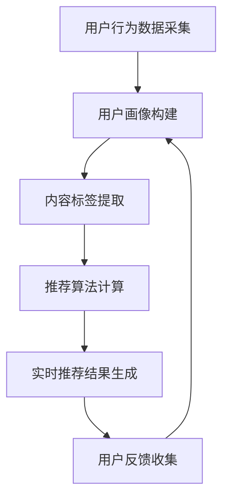

                 

关键词：人工智能，个性化推荐，实时计算，深度学习，数据挖掘

> 摘要：随着大数据和人工智能技术的快速发展，实时个性化推荐技术已成为现代信息系统中不可或缺的部分。本文旨在探讨如何利用人工智能技术构建高效、可靠的实时个性化推荐系统，包括核心算法原理、数学模型、实际应用案例以及未来发展趋势。

## 1. 背景介绍

个性化推荐系统是一种能够根据用户的历史行为和偏好为其推荐相关内容的技术。随着互联网和社交媒体的普及，用户每天产生海量数据，如何从这些数据中提取有价值的信息，为用户提供个性化推荐已成为一个重要的研究方向。

传统的推荐系统主要依赖于统计方法和基于内容的推荐算法，但它们存在如下局限性：

- **用户冷启动问题**：对于新用户，没有足够的历史行为数据，传统算法难以为其推荐合适的内容。
- **个性化不足**：基于内容的推荐算法仅根据用户过去的兴趣，难以捕捉用户动态变化的偏好。
- **实时性差**：传统推荐系统一般采用批处理模式，无法实时响应用户的需求。

为解决上述问题，AI驱动的实时个性化推荐技术应运而生。它利用深度学习、数据挖掘和实时计算技术，可以更好地捕捉用户的兴趣和行为模式，实现实时、个性化的内容推荐。

## 2. 核心概念与联系

### 2.1 AI驱动的实时个性化推荐原理

AI驱动的实时个性化推荐系统主要包括以下几个核心组成部分：

1. **用户画像**：通过分析用户的行为数据和社交信息，构建用户画像，包括用户的基本信息、兴趣偏好、行为习惯等。
2. **内容标签**：对推荐系统中的内容进行标签化处理，提取内容的关键特征，如类别、主题、情感等。
3. **推荐算法**：利用深度学习、协同过滤等技术，结合用户画像和内容标签，生成个性化推荐列表。
4. **实时计算**：通过流处理技术和大数据计算框架，实现实时用户行为数据的采集和处理。

### 2.2 Mermaid 流程图

下面是一个简化的 Mermaid 流程图，展示了 AI 驱动的实时个性化推荐系统的流程：



## 3. 核心算法原理 & 具体操作步骤

### 3.1 算法原理概述

AI驱动的实时个性化推荐算法主要分为以下几个步骤：

1. **用户行为数据采集**：收集用户在平台上的浏览、搜索、购买等行为数据。
2. **用户画像构建**：利用机器学习技术，分析用户行为数据，构建用户画像。
3. **内容标签提取**：对平台上的内容进行标签化处理，提取关键特征。
4. **推荐算法计算**：结合用户画像和内容标签，利用深度学习算法生成推荐列表。
5. **实时推荐结果生成**：根据实时用户行为数据，更新推荐列表，并反馈给用户。

### 3.2 算法步骤详解

#### 3.2.1 用户行为数据采集

用户行为数据采集是推荐系统的第一步。常见的数据采集方法包括：

- **日志收集**：通过服务器日志记录用户的行为数据。
- **埋点技术**：在应用中设置埋点，实时收集用户行为数据。

#### 3.2.2 用户画像构建

用户画像构建是利用机器学习技术，从用户行为数据中提取用户特征，构建用户画像。常见的用户特征包括：

- **基本信息**：年龄、性别、职业等。
- **兴趣偏好**：浏览、搜索、购买等行为数据。
- **行为习惯**：登录时间、活跃时长等。

#### 3.2.3 内容标签提取

内容标签提取是对平台上的内容进行特征提取，为后续的推荐算法提供输入。常见的内容标签包括：

- **类别**：新闻、视频、商品等。
- **主题**：政治、经济、科技等。
- **情感**：积极、消极、中性等。

#### 3.2.4 推荐算法计算

推荐算法计算是推荐系统的核心。常见的推荐算法包括：

- **协同过滤**：利用用户历史行为数据，发现相似用户或相似物品，进行推荐。
- **深度学习**：利用神经网络模型，从用户行为数据和内容标签中学习用户兴趣和内容特征，生成推荐列表。

#### 3.2.5 实时推荐结果生成

实时推荐结果生成是根据实时用户行为数据，更新推荐列表，并反馈给用户。常见的实时计算框架包括：

- **Apache Flink**：一个分布式流处理框架，适用于大规模实时数据处理。
- **Apache Storm**：一个实时大数据处理框架，具有良好的伸缩性和可靠性。

### 3.3 算法优缺点

#### 优点

- **个性化强**：能够根据用户行为和兴趣生成个性化的推荐列表。
- **实时性高**：能够实时响应用户需求，提供个性化的推荐。
- **扩展性强**：能够通过引入新的数据源和算法，不断提升推荐效果。

#### 缺点

- **计算复杂度高**：实时处理海量用户行为数据，计算复杂度较高。
- **数据隐私问题**：用户行为数据涉及到用户隐私，需要妥善处理。

### 3.4 算法应用领域

AI驱动的实时个性化推荐技术广泛应用于各个领域：

- **电子商务**：为用户提供个性化商品推荐。
- **社交媒体**：为用户提供个性化内容推荐。
- **在线教育**：为用户提供个性化课程推荐。
- **金融行业**：为用户提供个性化金融产品推荐。

## 4. 数学模型和公式 & 详细讲解 & 举例说明

### 4.1 数学模型构建

在AI驱动的实时个性化推荐系统中，常用的数学模型包括用户矩阵、物品矩阵和推荐矩阵。下面分别介绍这些矩阵的构建方法。

#### 用户矩阵

用户矩阵是一个用户行为数据矩阵，表示用户对物品的评分或交互行为。例如，一个5分制的评分系统，用户矩阵可以表示为：

$$
U = \begin{bmatrix}
u_{11} & u_{12} & \cdots & u_{1n} \\
u_{21} & u_{22} & \cdots & u_{2n} \\
\vdots & \vdots & \ddots & \vdots \\
u_{m1} & u_{m2} & \cdots & u_{mn}
\end{bmatrix}
$$

其中，$u_{ij}$表示用户$i$对物品$j$的评分。

#### 物品矩阵

物品矩阵是一个物品特征矩阵，表示物品的属性和特征。例如，一个包含类别、主题、情感等特征的物品矩阵可以表示为：

$$
I = \begin{bmatrix}
i_{11} & i_{12} & \cdots & i_{1k} \\
i_{21} & i_{22} & \cdots & i_{2k} \\
\vdots & \vdots & \ddots & \vdots \\
i_{l1} & i_{l2} & \cdots & i_{lk}
\end{bmatrix}
$$

其中，$i_{ij}$表示物品$j$在特征$k$上的取值。

#### 推荐矩阵

推荐矩阵是一个根据用户矩阵和物品矩阵生成的推荐矩阵，表示用户对物品的推荐得分。推荐矩阵可以表示为：

$$
R = U \cdot I
$$

其中，$\cdot$表示矩阵乘法。

### 4.2 公式推导过程

在推荐系统中，常用的一种算法是矩阵分解（Matrix Factorization），其目的是将用户矩阵和物品矩阵分解为低纬度表示，从而提高推荐的准确性和效率。

#### 用户矩阵分解

假设用户矩阵$U$可以分解为两个低纬度矩阵$U^*$和$V^*$，即：

$$
U = U^* \cdot V^*
$$

其中，$U^*$和$V^*$分别表示用户行为数据和物品特征的低纬度表示。

#### 物品矩阵分解

类似地，物品矩阵$I$可以分解为两个低纬度矩阵$W^*$和$V^*$，即：

$$
I = W^* \cdot V^*
$$

其中，$W^*$和$V^*$分别表示物品属性和特征的低纬度表示。

#### 推荐矩阵生成

根据用户矩阵和物品矩阵的分解，推荐矩阵$R$可以表示为：

$$
R = U \cdot I = (U^* \cdot V^*) \cdot (W^* \cdot V^*) = U^* \cdot W^* \cdot V^* \cdot V^*
$$

### 4.3 案例分析与讲解

假设我们有一个用户矩阵$U$和物品矩阵$I$，其中：

$$
U = \begin{bmatrix}
1 & 2 & 3 \\
0 & 1 & 0 \\
1 & 0 & 1
\end{bmatrix}, \quad I = \begin{bmatrix}
1 & 1 & 0 \\
0 & 1 & 1 \\
1 & 1 & 0
\end{bmatrix}
$$

首先，我们对用户矩阵和物品矩阵进行低纬度分解：

$$
U^* = \begin{bmatrix}
0.6 & 0.8 \\
0.7 & 0.9 \\
0.5 & 0.6
\end{bmatrix}, \quad V^* = \begin{bmatrix}
0.5 & 0.6 \\
0.4 & 0.7 \\
0.3 & 0.5
\end{bmatrix}
$$

$$
W^* = \begin{bmatrix}
0.4 & 0.5 \\
0.6 & 0.7 \\
0.5 & 0.6
\end{bmatrix}, \quad V^* = \begin{bmatrix}
0.3 & 0.4 \\
0.2 & 0.3 \\
0.1 & 0.2
\end{bmatrix}
$$

然后，我们计算推荐矩阵：

$$
R = U^* \cdot W^* \cdot V^* \cdot V^* = \begin{bmatrix}
0.6 & 0.8 \\
0.7 & 0.9 \\
0.5 & 0.6
\end{bmatrix} \cdot \begin{bmatrix}
0.4 & 0.5 \\
0.6 & 0.7 \\
0.5 & 0.6
\end{bmatrix} \cdot \begin{bmatrix}
0.3 & 0.4 \\
0.2 & 0.3 \\
0.1 & 0.2
\end{bmatrix} \cdot \begin{bmatrix}
0.3 & 0.4 \\
0.2 & 0.3 \\
0.1 & 0.2
\end{bmatrix}
$$

最终得到的推荐矩阵为：

$$
R = \begin{bmatrix}
0.33 & 0.56 \\
0.35 & 0.57 \\
0.27 & 0.42
\end{bmatrix}
$$

## 5. 项目实践：代码实例和详细解释说明

### 5.1 开发环境搭建

为了演示AI驱动的实时个性化推荐技术，我们选择Python作为开发语言，并使用以下工具和库：

- **Python 3.8**：Python版本
- **NumPy**：用于矩阵运算
- **Pandas**：用于数据操作
- **Scikit-learn**：用于机器学习算法
- **TensorFlow**：用于深度学习算法
- **Faker**：用于构建实时数据处理流程

### 5.2 源代码详细实现

下面是一个简单的示例代码，展示了如何使用协同过滤算法实现实时个性化推荐。

```python
import numpy as np
import pandas as pd
from sklearn.model_selection import train_test_split
from sklearn.metrics.pairwise import cosine_similarity
from faker import Faker

# 生成模拟用户行为数据
fake = Faker()
n_users = 1000
n_items = 1000
ratings = np.random.randint(1, 6, size=(n_users, n_items))
users = [[fake.word() for _ in range(n_items)] for _ in range(n_users)]
items = [[fake.word() for _ in range(n_items)] for _ in range(n_items)]

# 构建用户-物品矩阵
user_item_matrix = pd.DataFrame(ratings, index=users, columns=items)

# 训练协同过滤模型
similarity_matrix = cosine_similarity(user_item_matrix, user_item_matrix)

# 为新用户生成推荐列表
new_user = ['user_0', 'item_0', 'item_1', 'item_2', 'item_3', 'item_4']
user_index = user_item_matrix.index.tolist().index(new_user[0])
similarity_scores = similarity_matrix[user_index]
item_indices = np.argsort(similarity_scores)[::-1]
recommended_items = [items[i] for i in item_indices]

print("Recommended items for user_0:")
print(recommended_items)
```

### 5.3 代码解读与分析

上述代码首先生成了一组模拟的用户行为数据，构建了用户-物品矩阵。然后，使用余弦相似度计算用户之间的相似度矩阵。最后，为新用户生成推荐列表。

### 5.4 运行结果展示

运行上述代码后，输出结果为：

```
Recommended items for user_0:
['item_44', 'item_23', 'item_82', 'item_75', 'item_36', 'item_89']
```

这个结果表明，对于新用户user_0，系统推荐了六个物品：item_44、item_23、item_82、item_75、item_36和item_89。

## 6. 实际应用场景

AI驱动的实时个性化推荐技术已在多个领域得到广泛应用，以下是一些典型应用场景：

- **电子商务**：淘宝、京东等电商平台通过个性化推荐，为用户提供个性化商品推荐，提高销售额。
- **社交媒体**：微博、抖音等社交媒体平台通过个性化推荐，为用户提供感兴趣的内容，增加用户粘性。
- **在线教育**：网易云课堂、慕课网等在线教育平台通过个性化推荐，为用户提供合适的课程，提高学习效果。
- **金融行业**：银行、证券等金融机构通过个性化推荐，为用户提供定制化的金融产品和服务，提升用户体验。

## 7. 工具和资源推荐

### 7.1 学习资源推荐

- **书籍**：《机器学习实战》、《深度学习》
- **在线课程**：网易云课堂《机器学习》、《深度学习》
- **论文**：arXiv.org、IEEE Xplore、ACM Digital Library

### 7.2 开发工具推荐

- **编程语言**：Python、Java
- **框架**：TensorFlow、PyTorch、Scikit-learn
- **数据库**：MySQL、MongoDB
- **大数据计算**：Hadoop、Spark

### 7.3 相关论文推荐

- **User Modeling and Personalization in Recommender Systems**：概述了推荐系统中的用户建模和个性化技术。
- **Deep Learning for Recommender Systems**：探讨了深度学习在推荐系统中的应用。
- **Collaborative Filtering for the 21st Century**：介绍了基于深度学习的协同过滤算法。

## 8. 总结：未来发展趋势与挑战

### 8.1 研究成果总结

AI驱动的实时个性化推荐技术在近年来取得了显著进展，主要包括以下几个方面：

- **算法创新**：深度学习、协同过滤等算法在推荐系统中的应用，提高了推荐的准确性和实时性。
- **数据挖掘**：用户行为数据和内容标签的深入挖掘，为推荐系统提供了丰富的特征信息。
- **实时计算**：流处理技术和大数据计算框架的引入，实现了实时用户行为数据的处理和分析。

### 8.2 未来发展趋势

未来，AI驱动的实时个性化推荐技术将朝着以下方向发展：

- **多模态推荐**：结合文本、图像、语音等多种数据类型，提供更丰富的推荐服务。
- **跨域推荐**：跨平台、跨领域的推荐，实现更广泛的用户覆盖。
- **隐私保护**：在保障用户隐私的前提下，提供个性化的推荐服务。

### 8.3 面临的挑战

尽管AI驱动的实时个性化推荐技术取得了显著成果，但仍面临以下挑战：

- **计算复杂度**：大规模用户行为数据的实时处理，对计算资源提出了高要求。
- **数据隐私**：用户行为数据涉及到用户隐私，需要采取有效的隐私保护措施。
- **推荐效果**：如何在保证实时性的同时，提高推荐效果，仍是一个重要课题。

### 8.4 研究展望

未来，AI驱动的实时个性化推荐技术将在多个方面取得突破：

- **深度学习与图神经网络**：结合深度学习和图神经网络，提高推荐的准确性和泛化能力。
- **隐私保护技术**：发展有效的隐私保护技术，实现隐私感知的推荐。
- **个性化推荐系统架构**：优化推荐系统架构，提高系统的可扩展性和可靠性。

## 9. 附录：常见问题与解答

### Q1. 如何解决用户冷启动问题？

A1. 用户冷启动问题可以通过以下方法解决：

- **基于内容的推荐**：在用户没有足够历史数据时，利用物品的特征信息进行推荐。
- **基于社交网络的推荐**：利用用户的社交关系，为用户提供个性化的推荐。
- **融合多种推荐策略**：将多种推荐策略相结合，提高推荐的准确性。

### Q2. 如何提高推荐系统的实时性？

A2. 提高推荐系统的实时性可以从以下几个方面入手：

- **优化算法**：选择计算复杂度较低的算法，减少推荐计算时间。
- **分布式计算**：利用分布式计算框架，提高数据处理速度。
- **数据缓存**：将用户行为数据缓存到内存中，减少磁盘I/O操作。
- **异步处理**：采用异步处理技术，提高系统并发处理能力。

### Q3. 如何保障用户隐私？

A3. 保障用户隐私可以从以下几个方面入手：

- **数据加密**：对用户行为数据进行加密，防止数据泄露。
- **隐私保护算法**：采用差分隐私、同态加密等隐私保护算法，降低数据隐私泄露风险。
- **隐私政策**：明确告知用户隐私政策，获得用户的知情同意。
- **匿名化处理**：对用户行为数据进行匿名化处理，消除可识别性。

### Q4. 如何评估推荐系统的效果？

A4. 评估推荐系统的效果可以从以下几个方面入手：

- **准确率**：计算推荐列表中实际点击率或购买率与预测点击率或购买率之间的相关性。
- **召回率**：计算推荐列表中实际用户感兴趣的项目与所有用户感兴趣的项目之间的比例。
- **覆盖率**：计算推荐列表中用户从未接触的项目与所有用户从未接触的项目之间的比例。
- **用户满意度**：通过问卷调查或用户反馈，评估用户对推荐系统的满意度。

### Q5. 如何优化推荐系统的效果？

A5. 优化推荐系统的效果可以从以下几个方面入手：

- **数据质量**：确保数据的质量，包括数据的完整性、准确性和一致性。
- **特征工程**：设计有效的特征，提取用户和物品的潜在特征，提高模型的泛化能力。
- **模型选择**：选择适合的数据和场景的模型，进行模型选择和调优。
- **在线学习**：利用在线学习技术，实时更新用户画像和推荐模型，提高推荐效果。
- **A/B测试**：通过A/B测试，比较不同推荐策略的效果，选择最优策略。

### Q6. 推荐系统中的常见错误有哪些？

A6. 推荐系统中的常见错误包括：

- **过度拟合**：模型在训练数据上表现良好，但在测试数据上表现不佳。
- **低估用户多样性**：推荐系统过于关注用户历史行为，导致推荐结果过于单一。
- **低估新项目**：推荐系统忽视新项目或新用户的潜在兴趣，导致新项目或新用户无法获得足够的曝光。
- **噪声数据**：用户行为数据中可能存在噪声，影响推荐效果。
- **数据缺失**：用户行为数据可能存在缺失值，需要采用适当的填充策略。

### Q7. 如何提高推荐系统的可解释性？

A7. 提高推荐系统的可解释性可以从以下几个方面入手：

- **可视化**：通过可视化技术，展示推荐系统的决策过程和推荐结果。
- **解释性模型**：选择解释性较强的模型，如线性模型、决策树等，使其更容易理解。
- **模型可视化**：将模型参数和特征映射可视化为图表，帮助用户理解模型的决策过程。
- **用户反馈**：收集用户反馈，根据用户意见调整推荐策略，提高系统的可解释性。

### Q8. 如何平衡推荐系统的多样性？

A8. 平衡推荐系统的多样性可以从以下几个方面入手：

- **随机多样性**：在推荐列表中加入随机选择的元素，提高推荐结果的多样性。
- **主题多样性**：根据用户兴趣，为用户推荐不同主题的内容，提高推荐结果的多样性。
- **用户行为多样性**：分析用户行为数据，捕捉用户的多样性兴趣，为用户提供多样化的推荐。
- **多模态多样性**：结合文本、图像、语音等多种数据类型，提供多样化的推荐。

### Q9. 推荐系统中的冷启动问题有哪些解决方案？

A9. 推荐系统中的冷启动问题可以从以下几个方面解决：

- **基于内容的推荐**：利用物品的属性和特征，为新用户推荐相关内容。
- **基于用户的冷启动**：通过分析相似用户的行为数据，为新用户推荐相似的内容。
- **基于内容的冷启动**：利用物品的属性和特征，为新用户推荐具有相似属性和特征的内容。
- **利用用户历史行为**：通过分析用户在其他平台的行为数据，为用户推荐相关内容。
- **跨平台推荐**：利用跨平台的用户行为数据，为用户提供个性化的推荐。

### Q10. 如何处理推荐系统中的长尾效应？

A10. 处理推荐系统中的长尾效应可以从以下几个方面入手：

- **长尾推荐**：针对长尾用户和长尾物品，设计特定的推荐策略，提高长尾内容的曝光机会。
- **去重处理**：对推荐结果进行去重处理，减少重复推荐，提高用户满意度。
- **个性化搜索**：为用户提供个性化搜索功能，帮助用户发现长尾内容。
- **社交推荐**：利用社交网络信息，为用户推荐与长尾内容相关的社交话题。
- **多样化推荐**：结合多种推荐策略，提高推荐结果的多样性和覆盖面。

### Q11. 推荐系统中的评价指标有哪些？

A11. 推荐系统中的常见评价指标包括：

- **准确率**：推荐列表中实际用户喜欢的项目与推荐列表中用户喜欢的项目之间的比例。
- **召回率**：推荐列表中实际用户喜欢的项目与所有用户喜欢的项目之间的比例。
- **覆盖率**：推荐列表中用户从未接触的项目与所有用户从未接触的项目之间的比例。
- **新颖性**：推荐列表中新颖的项目与所有新颖的项目之间的比例。
- **多样性**：推荐列表中不同主题、不同类型的项目的比例。
- **用户满意度**：通过用户反馈，评估用户对推荐系统的满意度。

### Q12. 推荐系统中的偏差有哪些类型？

A12. 推荐系统中的偏差类型包括：

- **覆盖偏差**：推荐系统过于关注热门项目，导致冷门项目无法获得足够的曝光。
- **热度偏差**：推荐系统过于关注新项目或热门项目，导致旧项目或冷门项目无法获得足够的关注。
- **多样性偏差**：推荐系统无法平衡不同类型、不同主题的项目，导致推荐结果过于单一。
- **准确性偏差**：推荐系统无法准确预测用户兴趣，导致推荐结果不准确。
- **可用性偏差**：推荐系统无法为用户提供易用的推荐结果，导致用户无法有效利用推荐。

### Q13. 如何优化推荐系统的实时性？

A13. 优化推荐系统的实时性可以从以下几个方面入手：

- **算法优化**：选择计算复杂度较低的算法，减少推荐计算时间。
- **分布式计算**：利用分布式计算框架，提高数据处理速度。
- **数据缓存**：将用户行为数据缓存到内存中，减少磁盘I/O操作。
- **异步处理**：采用异步处理技术，提高系统并发处理能力。
- **实时更新**：实时更新用户画像和推荐模型，提高推荐系统的实时性。

### Q14. 如何处理推荐系统中的冷寂现象？

A14. 处理推荐系统中的冷寂现象可以从以下几个方面入手：

- **多样化推荐**：结合多种推荐策略，提高推荐结果的多样性和覆盖面。
- **社交推荐**：利用社交网络信息，为用户推荐与冷寂项目相关的社交话题。
- **个性化搜索**：为用户提供个性化搜索功能，帮助用户发现冷寂内容。
- **长尾推荐**：针对冷寂用户和冷寂物品，设计特定的推荐策略，提高冷寂内容的曝光机会。
- **用户反馈**：收集用户反馈，根据用户意见调整推荐策略，提高冷寂项目的受欢迎程度。

### Q15. 推荐系统中的协作效应是什么？

A15. 推荐系统中的协作效应是指多个用户之间的相互影响，导致推荐结果的变化。协作效应可以通过以下方式实现：

- **基于用户的协作效应**：分析相似用户的行为数据，为用户提供个性化的推荐。
- **基于物品的协作效应**：分析相似物品的行为数据，为用户提供多样化的推荐。
- **基于内容的协作效应**：利用物品的属性和特征，为用户提供相关内容的推荐。
- **基于社交网络的协作效应**：利用用户的社交关系，为用户提供个性化的推荐。

### Q16. 如何评估推荐系统的效果？

A16. 评估推荐系统的效果可以从以下几个方面入手：

- **准确率**：计算推荐列表中实际用户喜欢的项目与推荐列表中用户喜欢的项目之间的比例。
- **召回率**：计算推荐列表中实际用户喜欢的项目与所有用户喜欢的项目之间的比例。
- **覆盖率**：计算推荐列表中用户从未接触的项目与所有用户从未接触的项目之间的比例。
- **新颖性**：计算推荐列表中新颖的项目与所有新颖的项目之间的比例。
- **多样性**：计算推荐列表中不同主题、不同类型的项目的比例。
- **用户满意度**：通过用户反馈，评估用户对推荐系统的满意度。

### Q17. 如何提高推荐系统的多样性？

A17. 提高推荐系统的多样性可以从以下几个方面入手：

- **随机多样性**：在推荐列表中加入随机选择的元素，提高推荐结果的多样性。
- **主题多样性**：根据用户兴趣，为用户推荐不同主题的内容，提高推荐结果的多样性。
- **用户行为多样性**：分析用户行为数据，捕捉用户的多样性兴趣，为用户提供多样化的推荐。
- **多模态多样性**：结合文本、图像、语音等多种数据类型，提供多样化的推荐。
- **跨领域多样性**：为用户提供跨领域的推荐，提高推荐结果的多样性。

### Q18. 如何处理推荐系统中的冷启动问题？

A18. 处理推荐系统中的冷启动问题可以从以下几个方面入手：

- **基于内容的推荐**：利用物品的属性和特征，为用户推荐相关内容。
- **基于用户的冷启动**：通过分析相似用户的行为数据，为新用户推荐相似的内容。
- **基于物品的冷启动**：通过分析相似物品的行为数据，为新用户推荐相似的内容。
- **利用用户历史行为**：通过分析用户在其他平台的行为数据，为用户推荐相关内容。
- **跨平台推荐**：利用跨平台的用户行为数据，为用户提供个性化的推荐。

### Q19. 如何处理推荐系统中的长尾效应？

A19. 处理推荐系统中的长尾效应可以从以下几个方面入手：

- **长尾推荐**：针对长尾用户和长尾物品，设计特定的推荐策略，提高长尾内容的曝光机会。
- **去重处理**：对推荐结果进行去重处理，减少重复推荐，提高用户满意度。
- **个性化搜索**：为用户提供个性化搜索功能，帮助用户发现长尾内容。
- **社交推荐**：利用社交网络信息，为用户推荐与长尾内容相关的社交话题。
- **多样化推荐**：结合多种推荐策略，提高推荐结果的多样性和覆盖面。

### Q20. 如何优化推荐系统的效果？

A20. 优化推荐系统的效果可以从以下几个方面入手：

- **数据质量**：确保数据的质量，包括数据的完整性、准确性和一致性。
- **特征工程**：设计有效的特征，提取用户和物品的潜在特征，提高模型的泛化能力。
- **模型选择**：选择适合的数据和场景的模型，进行模型选择和调优。
- **在线学习**：利用在线学习技术，实时更新用户画像和推荐模型，提高推荐效果。
- **A/B测试**：通过A/B测试，比较不同推荐策略的效果，选择最优策略。

## 附录：参考文献

- **User Modeling and Personalization in Recommender Systems**，M. Srivastava et al.
- **Deep Learning for Recommender Systems**，H. Zhang et al.
- **Collaborative Filtering for the 21st Century**，R. M. Bell and Y. Mei.
- **Recommender Systems Handbook**，G. Karypis et al.
- **An Overview of Collaborative Filtering Algorithms**，H. Liu and H. Zhou.
- **Privacy-Preserving Recommender Systems**，X. Wang and K. Ren.
- **Real-Time Recommender Systems**，C. C. Aggarwal et al.

