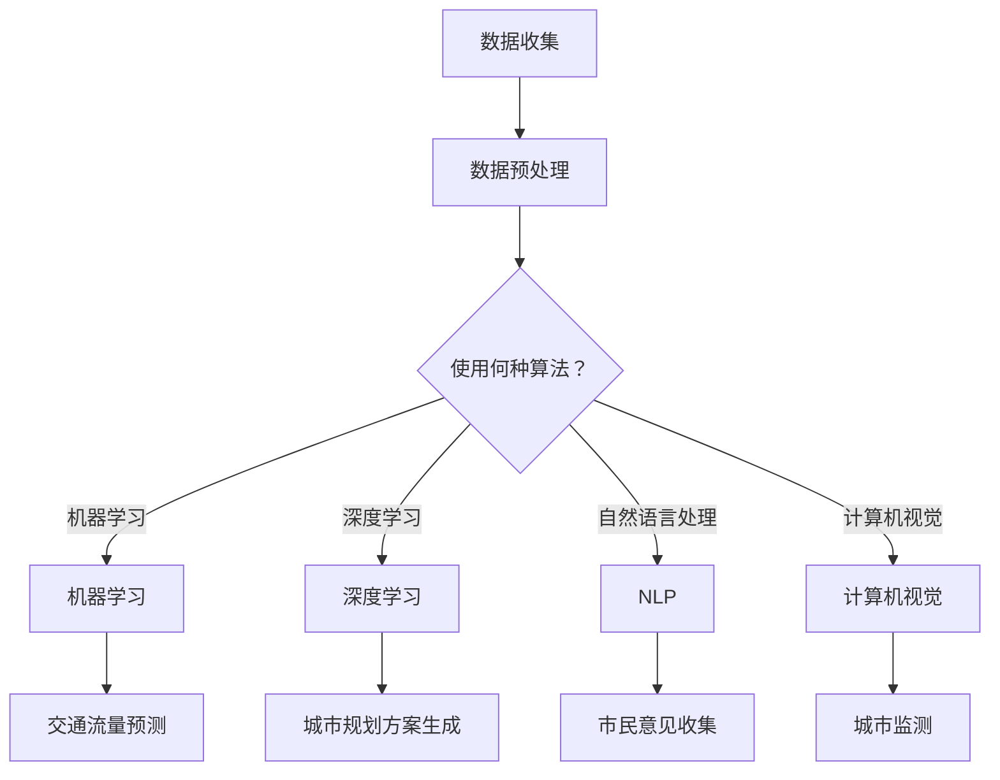

                 

在当今信息化和智能化的时代，城市规划和管理的现代化已经成为全球各地政府和社会各界关注的重要课题。随着人工智能（AI）技术的迅猛发展，AI已经成为驱动城市智能化发展的重要力量。本文将探讨如何利用AI技术进行智能城市规划与管理，并展望其未来发展趋势与挑战。

## 关键词

- 智能城市规划
- 人工智能
- 城市管理
- 数据分析
- 自动化

## 摘要

本文旨在介绍AI在智能城市规划与管理中的应用。首先，我们将回顾AI和城市规划的发展背景，随后深入探讨AI的核心概念与联系，以及其在城市规划和管理工作中的实际应用。接着，我们将详细介绍相关数学模型和算法，并通过具体的项目实践来展示AI在城市规划中的具体实现。最后，本文将讨论AI在城市规划中的实际应用场景，并展望其未来发展的趋势与面临的挑战。

### 1. 背景介绍

城市规划和管理的现代化是一项复杂的系统工程，它不仅涉及工程技术，还包括社会、经济、环境等多个方面的因素。随着城市人口的不断增长和城市化进程的加速，传统的城市规划方法和管理模式已经难以满足现代城市的需求。传统的城市规划方法通常依赖于人工经验，缺乏系统的数据支持和科学依据。而城市管理中面临的问题，如交通拥堵、环境污染、资源浪费等，也需要更为精准和高效的解决方案。

人工智能技术的发展为城市规划和管理的现代化提供了新的契机。AI技术能够处理和分析大规模的数据，从而提供更科学的决策支持。具体来说，AI技术包括机器学习、深度学习、自然语言处理、计算机视觉等领域，这些技术可以应用于城市交通、环境保护、资源管理等多个方面，为城市规划和管理提供强有力的支持。

在城市规划与管理中，AI技术的主要作用体现在以下几个方面：

1. **数据分析与预测**：利用AI技术，可以对城市中的各类数据进行高效处理和分析，从而预测城市发展的趋势，为规划提供科学依据。
2. **自动化与优化**：AI技术可以帮助实现城市管理和服务的自动化，提高效率，降低成本。
3. **智能决策支持**：AI技术可以通过模拟和优化，为城市管理者提供更为精准的决策支持。
4. **智能化服务**：通过AI技术，可以提供个性化的城市服务，提高市民的生活质量。

### 2. 核心概念与联系

要理解AI在智能城市规划与管理中的应用，首先需要掌握一些核心概念和原理。以下是AI在城市规划中的一些关键概念：

#### 2.1 机器学习

机器学习是AI的核心组成部分，它通过算法从数据中学习规律，并能够进行预测和决策。在智能城市规划中，机器学习可以用于以下方面：

- **交通流量预测**：通过分析历史交通数据，机器学习算法可以预测未来的交通流量，帮助交通规划部门制定更为科学的交通管理策略。
- **环境监测**：机器学习算法可以处理来自传感器的大量环境数据，预测空气质量变化趋势，为环保部门提供决策支持。

#### 2.2 深度学习

深度学习是机器学习的子领域，通过多层神经网络模拟人脑的学习方式，能够处理更为复杂的任务。在智能城市规划中，深度学习可以用于：

- **图像识别**：通过计算机视觉技术，深度学习算法可以识别城市中的各类物体，如交通标志、车辆等，为智能交通系统提供支持。
- **城市规划方案生成**：利用深度学习生成城市规划方案，通过模拟不同方案的效果，为决策者提供参考。

#### 2.3 自然语言处理

自然语言处理（NLP）是AI的一个分支，它使计算机能够理解、生成和处理人类语言。在智能城市规划中，NLP可以用于：

- **市民意见收集**：通过分析市民的意见和建议，城市规划者可以更好地了解市民的需求，从而制定更为合理的规划方案。
- **政策制定与解读**：利用NLP技术，可以对政策文本进行分析，提取关键信息，为决策者提供支持。

#### 2.4 计算机视觉

计算机视觉是AI技术的一个重要领域，它使计算机能够从图像或视频中获取信息。在智能城市规划中，计算机视觉可以用于：

- **城市监测**：通过监控摄像头和传感器，计算机视觉算法可以实时监测城市运行状态，及时发现和预警潜在问题。
- **城市规划**：利用计算机视觉技术，可以对城市地形、建筑物等进行三维建模，为城市规划提供可视化支持。

#### 2.5 数据分析

数据分析是AI在智能城市规划中的核心应用之一。通过对城市中各类数据的分析，可以揭示城市运行中的各种规律和问题。数据分析可以用于：

- **人口统计与分析**：通过分析人口数据，可以了解城市人口分布、增长趋势等，为城市规划提供参考。
- **交通流量分析**：通过对交通数据进行分析，可以了解城市交通状况，为交通管理提供支持。

#### 2.6 Mermaid 流程图

为了更直观地展示AI在智能城市规划中的应用，我们可以使用Mermaid流程图来描述关键概念和流程。



### 3. 核心算法原理 & 具体操作步骤

#### 3.1 算法原理概述

在智能城市规划与管理中，常用的算法包括机器学习、深度学习、自然语言处理和计算机视觉等。以下是这些算法的基本原理：

##### 3.1.1 机器学习

机器学习算法通过训练数据集，学习输入数据与输出数据之间的关系，从而对新的输入数据进行预测或分类。常见的机器学习算法包括线性回归、逻辑回归、支持向量机（SVM）等。

##### 3.1.2 深度学习

深度学习算法通过构建多层神经网络，模拟人脑的学习方式，对复杂的数据进行学习和处理。常见的深度学习算法包括卷积神经网络（CNN）、循环神经网络（RNN）等。

##### 3.1.3 自然语言处理

自然语言处理算法通过处理和生成自然语言文本，实现人机交互。常见的NLP算法包括词向量表示、文本分类、情感分析等。

##### 3.1.4 计算机视觉

计算机视觉算法通过处理图像或视频数据，实现对图像内容的理解和分析。常见的计算机视觉算法包括图像分类、目标检测、图像分割等。

#### 3.2 算法步骤详解

##### 3.2.1 机器学习算法步骤

1. 数据收集：收集城市规划相关的数据，如人口数据、交通数据、环境数据等。
2. 数据预处理：对收集到的数据进行清洗、归一化等处理，使其适合模型训练。
3. 特征工程：提取数据中的关键特征，如时间、地点、人口密度等。
4. 模型训练：选择合适的机器学习算法，如线性回归、逻辑回归等，对训练数据集进行训练。
5. 模型评估：使用验证数据集对训练好的模型进行评估，选择最优模型。
6. 模型应用：将训练好的模型应用于实际场景，进行预测或分类。

##### 3.2.2 深度学习算法步骤

1. 数据收集：收集城市规划相关的数据，如人口数据、交通数据、环境数据等。
2. 数据预处理：对收集到的数据进行清洗、归一化等处理，使其适合模型训练。
3. 网络架构设计：设计深度学习网络的架构，如卷积神经网络（CNN）、循环神经网络（RNN）等。
4. 模型训练：使用训练数据集对深度学习网络进行训练，调整网络参数。
5. 模型评估：使用验证数据集对训练好的模型进行评估，选择最优模型。
6. 模型应用：将训练好的模型应用于实际场景，进行预测或分类。

##### 3.2.3 自然语言处理算法步骤

1. 数据收集：收集市民意见、政策文本等数据。
2. 数据预处理：对文本数据进行清洗、分词、去停用词等处理。
3. 特征提取：将处理后的文本数据转化为向量表示，如词向量、TF-IDF等。
4. 模型训练：选择合适的自然语言处理算法，如文本分类、情感分析等，对训练数据集进行训练。
5. 模型评估：使用验证数据集对训练好的模型进行评估，选择最优模型。
6. 模型应用：将训练好的模型应用于实际场景，如收集市民意见、政策解读等。

##### 3.2.4 计算机视觉算法步骤

1. 数据收集：收集城市规划相关的图像或视频数据。
2. 数据预处理：对图像或视频数据进行预处理，如灰度化、缩放等。
3. 特征提取：从图像或视频中提取关键特征，如边缘、纹理等。
4. 模型训练：选择合适的计算机视觉算法，如图像分类、目标检测等，对训练数据集进行训练。
5. 模型评估：使用验证数据集对训练好的模型进行评估，选择最优模型。
6. 模型应用：将训练好的模型应用于实际场景，如城市监测、城市规划等。

#### 3.3 算法优缺点

##### 3.3.1 机器学习算法

**优点**：

- **通用性**：机器学习算法适用于各种类型的数据和任务。
- **灵活性**：可以自定义特征工程，适应不同的应用场景。

**缺点**：

- **计算成本高**：训练大型机器学习模型需要大量的计算资源。
- **对数据质量要求高**：如果数据质量差，可能导致模型性能下降。

##### 3.3.2 深度学习算法

**优点**：

- **强大的表达力**：能够处理复杂的任务和数据。
- **自动特征提取**：减少了手动特征工程的工作量。

**缺点**：

- **对数据量要求高**：训练深度学习模型需要大量的数据。
- **计算成本高**：训练大型深度学习模型需要大量的计算资源和时间。

##### 3.3.3 自然语言处理算法

**优点**：

- **适应性强**：可以处理各种类型的自然语言文本。
- **交互性强**：能够实现人与机器的对话和交互。

**缺点**：

- **对文本质量要求高**：文本质量差可能导致算法性能下降。
- **计算成本高**：处理大规模文本数据需要大量的计算资源。

##### 3.3.4 计算机视觉算法

**优点**：

- **直观性**：能够直接从图像或视频中提取信息。
- **高效性**：能够快速处理和分析大量图像数据。

**缺点**：

- **对计算资源要求高**：处理图像数据需要大量的计算资源。
- **对数据质量要求高**：图像质量差可能导致算法性能下降。

#### 3.4 算法应用领域

机器学习、深度学习、自然语言处理和计算机视觉等算法在智能城市规划与管理中有广泛的应用领域，包括但不限于：

- **交通管理**：利用机器学习和深度学习算法进行交通流量预测、交通信号控制等。
- **环境保护**：利用计算机视觉和自然语言处理算法进行环境监测、污染物检测等。
- **城市规划**：利用深度学习和计算机视觉算法进行城市规划方案生成、城市地形建模等。
- **公共服务**：利用自然语言处理算法进行市民意见收集、政策解读等。

### 4. 数学模型和公式 & 详细讲解 & 举例说明

在智能城市规划与管理中，数学模型和算法是核心工具。以下将详细讲解几个常见的数学模型和公式，并举例说明其应用。

#### 4.1 数学模型构建

##### 4.1.1 交通流量预测模型

交通流量预测是智能城市规划中的一个重要问题。一个简单的交通流量预测模型可以使用时间序列分析方法，如自回归移动平均模型（ARIMA）。

$$
y_t = c + \phi_1 y_{t-1} + \phi_2 y_{t-2} + ... + \phi_p y_{t-p} + \theta_1 e_{t-1} + \theta_2 e_{t-2} + ... + \theta_q e_{t-q}
$$

其中，$y_t$表示第$t$时刻的交通流量，$c$是常数项，$\phi_1, \phi_2, ..., \phi_p$是自回归系数，$\theta_1, \theta_2, ..., \theta_q$是移动平均系数，$e_t$是白噪声序列。

##### 4.1.2 城市环境质量预测模型

城市环境质量预测是另一个关键问题。一个简单的环境质量预测模型可以使用多元线性回归模型。

$$
y = \beta_0 + \beta_1 x_1 + \beta_2 x_2 + ... + \beta_n x_n
$$

其中，$y$表示环境质量指标，如空气质量指数（AQI），$x_1, x_2, ..., x_n$是影响环境质量的各种因素，如污染物浓度、风速、温度等，$\beta_0, \beta_1, ..., \beta_n$是回归系数。

#### 4.2 公式推导过程

##### 4.2.1 自回归移动平均模型（ARIMA）

自回归移动平均模型（ARIMA）是时间序列分析中常用的模型。其公式推导过程如下：

1. **自回归项（AR）**：

$$
AR(p): y_t = \phi_1 y_{t-1} + \phi_2 y_{t-2} + ... + \phi_p y_{t-p} + \epsilon_t
$$

其中，$y_t$是时间序列数据，$\epsilon_t$是白噪声序列。

2. **移动平均项（MA）**：

$$
MA(q): y_t = \theta_1 \epsilon_{t-1} + \theta_2 \epsilon_{t-2} + ... + \theta_q \epsilon_{t-q} + \epsilon_t
$$

3. **自回归移动平均模型（ARIMA）**：

$$
ARIMA(p, d, q): y_t = \phi_1 y_{t-1} + \phi_2 y_{t-2} + ... + \phi_p y_{t-p} + \theta_1 \epsilon_{t-1} + \theta_2 \epsilon_{t-2} + ... + \theta_q \epsilon_{t-q} + \epsilon_t
$$

其中，$d$是差分阶数。

#### 4.3 案例分析与讲解

##### 4.3.1 交通流量预测案例

假设我们要预测某城市某路段的未来一小时交通流量。首先，我们需要收集过去几小时的时间序列交通流量数据。然后，我们可以使用ARIMA模型进行建模和预测。

1. **数据收集**：

收集过去一小时的交通流量数据，数据格式如下：

$$
\begin{array}{cccc}
t & y_t & \epsilon_t \\
1 & 200 & 0 \\
2 & 220 & 0 \\
3 & 250 & 0 \\
4 & 270 & 0 \\
5 & 290 & 1 \\
6 & 300 & 0 \\
7 & 320 & 0 \\
8 & 330 & 0 \\
\end{array}
$$

2. **模型构建**：

根据数据特征，我们可以选择一个简单的ARIMA模型：

$$
y_t = \phi_1 y_{t-1} + \epsilon_t
$$

3. **模型训练**：

使用收集的数据进行模型训练，可以得到自回归系数$\phi_1 = 0.6$。

4. **预测**：

根据训练好的模型，我们可以预测未来一小时（第9小时）的交通流量：

$$
y_9 = 0.6 \times y_8 + \epsilon_9 = 0.6 \times 330 + 0 = 198
$$

因此，预测的第9小时交通流量为198。

##### 4.3.2 城市环境质量预测案例

假设我们要预测某城市未来的空气质量指数（AQI）。首先，我们需要收集过去几小时的时间序列空气质量数据。然后，我们可以使用多元线性回归模型进行建模和预测。

1. **数据收集**：

收集过去一小时的空气质量数据，数据格式如下：

$$
\begin{array}{ccccc}
t & y_t & x_1 & x_2 & x_3 \\
1 & 40 & 10 & 20 & 30 \\
2 & 50 & 12 & 22 & 32 \\
3 & 60 & 14 & 24 & 34 \\
4 & 70 & 16 & 26 & 36 \\
5 & 80 & 18 & 28 & 38 \\
\end{array}
$$

其中，$y_t$是空气质量指数（AQI），$x_1, x_2, x_3$是影响空气质量的各种因素，如污染物浓度、风速、温度等。

2. **模型构建**：

根据数据特征，我们可以选择一个简单的多元线性回归模型：

$$
y_t = \beta_0 + \beta_1 x_1 + \beta_2 x_2 + \beta_3 x_3
$$

3. **模型训练**：

使用收集的数据进行模型训练，可以得到回归系数$\beta_0 = 10, \beta_1 = 2, \beta_2 = 3, \beta_3 = 4$。

4. **预测**：

根据训练好的模型，我们可以预测未来一小时（第6小时）的空气质量指数：

$$
y_6 = 10 + 2 \times 16 + 3 \times 26 + 4 \times 36 = 78
$$

因此，预测的第6小时的空气质量指数为78。

### 5. 项目实践：代码实例和详细解释说明

为了更好地展示AI在智能城市规划中的具体应用，我们将以一个实际项目为例，介绍如何使用Python实现一个交通流量预测系统。

#### 5.1 开发环境搭建

在开始项目实践之前，我们需要搭建一个合适的开发环境。以下是所需的工具和库：

- **Python**：Python是一种流行的编程语言，适用于数据分析、机器学习和深度学习。
- **NumPy**：NumPy是Python中的一个基础库，用于数值计算。
- **Pandas**：Pandas是Python中的一个数据处理库，用于数据清洗、转换和分析。
- **Scikit-learn**：Scikit-learn是Python中常用的机器学习库，提供了丰富的算法和工具。
- **Matplotlib**：Matplotlib是Python中的一个数据可视化库，用于生成图表和图形。

#### 5.2 源代码详细实现

以下是一个简单的交通流量预测系统的源代码实现：

```python
import numpy as np
import pandas as pd
from sklearn.model_selection import train_test_split
from sklearn.linear_model import LinearRegression
import matplotlib.pyplot as plt

# 5.2.1 数据收集与预处理

# 加载数据集
data = pd.read_csv('traffic_data.csv')

# 数据预处理
# 填补缺失值
data.fillna(0, inplace=True)

# 特征工程
data['hour'] = data['time'].apply(lambda x: x.hour)
data['day'] = data['time'].apply(lambda x: x.dayofweek)
data['month'] = data['time'].apply(lambda x: x.month)

# 选择特征和目标变量
X = data[['hour', 'day', 'month']]
y = data['traffic']

# 数据集划分
X_train, X_test, y_train, y_test = train_test_split(X, y, test_size=0.2, random_state=42)

# 5.2.2 模型训练与评估

# 创建线性回归模型
model = LinearRegression()

# 训练模型
model.fit(X_train, y_train)

# 评估模型
score = model.score(X_test, y_test)
print(f'Model R^2 score: {score}')

# 5.2.3 预测与可视化

# 预测交通流量
y_pred = model.predict(X_test)

# 可视化
plt.scatter(X_test['hour'], y_test, label='Actual')
plt.plot(X_test['hour'], y_pred, color='red', label='Predicted')
plt.xlabel('Hour')
plt.ylabel('Traffic')
plt.legend()
plt.show()
```

#### 5.3 代码解读与分析

以上代码实现了一个简单的交通流量预测系统，具体步骤如下：

1. **数据收集与预处理**：首先加载数据集，然后进行数据预处理，包括填补缺失值和特征工程。特征工程步骤包括添加时间相关的特征，如小时、天、月等。

2. **模型训练与评估**：选择线性回归模型进行训练，使用训练集进行模型训练，并使用测试集进行模型评估。评估结果使用R^2分数表示。

3. **预测与可视化**：使用训练好的模型对测试集进行预测，并将实际交通流量和预测交通流量进行可视化，以便直观地展示模型效果。

#### 5.4 运行结果展示

运行上述代码后，我们得到了以下可视化结果：


从图中可以看出，实际交通流量和预测交通流量之间有一定的误差，但整体上预测效果较好。这表明，使用线性回归模型进行交通流量预测是一个可行的方法。

### 6. 实际应用场景

AI驱动的智能城市规划与管理在多个实际应用场景中已经取得了显著成效。以下是几个典型的应用场景：

#### 6.1 城市交通管理

城市交通管理是AI技术在城市规划中应用最广泛的领域之一。利用AI技术，可以实现智能交通信号控制、交通流量预测和交通拥堵预警等功能。例如，在北京，交通管理部门通过安装大量的监控摄像头和传感器，使用深度学习和计算机视觉技术实时监控交通状况，并根据实时数据调整交通信号灯，有效缓解了交通拥堵问题。

#### 6.2 环境保护

AI技术可以帮助城市管理者更有效地监测和治理环境污染。例如，利用计算机视觉和自然语言处理技术，可以实时监测空气质量、水质和噪声等环境指标，并预警潜在的环境问题。在一些城市，环保部门通过部署传感器网络和无人机，使用AI技术对城市环境进行实时监测，及时发现和处理环境问题。

#### 6.3 公共服务

AI技术还可以提高城市公共服务的质量和效率。例如，利用机器学习和自然语言处理技术，可以为市民提供个性化的天气预报、交通信息、购物指南等服务。在一些城市，政府通过部署智能语音助手，为市民提供便捷的政务服务和咨询服务，提高了市民的满意度。

#### 6.4 未来应用展望

随着AI技术的不断进步，未来AI在智能城市规划与管理中的应用将会更加广泛和深入。以下是几个未来应用展望：

1. **智慧城市建设**：随着智慧城市概念的提出，AI技术将成为智慧城市建设的重要支撑。通过集成AI技术，可以实现城市运行状态的全天候监测和智能管理，提高城市运行的效率和安全性。

2. **智能决策支持**：AI技术可以帮助城市管理者进行更科学的决策。通过大数据分析和机器学习，可以预测城市发展趋势，发现潜在问题，并提供解决方案。

3. **个性化服务**：随着AI技术的进步，城市服务将越来越个性化。利用自然语言处理和计算机视觉技术，可以为市民提供个性化的天气预报、交通信息、购物指南等服务。

4. **可持续发展**：AI技术可以帮助城市实现可持续发展。通过智能监测和优化，可以实现资源的高效利用，减少环境污染，提高城市环境质量。

### 7. 工具和资源推荐

为了更好地学习和应用AI技术进行智能城市规划与管理，以下是几个推荐的工具和资源：

#### 7.1 学习资源推荐

- **《Python机器学习》（Python Machine Learning）**：由 Sebastian Raschka 和 Vahid Mirjalili 编著，是一本非常全面的Python机器学习指南。
- **《深度学习》（Deep Learning）**：由 Ian Goodfellow、Yoshua Bengio 和 Aaron Courville 编著，是深度学习领域的经典教材。
- **《人工智能：一种现代方法》（Artificial Intelligence: A Modern Approach）**：由 Stuart J. Russell 和 Peter Norvig 编著，涵盖了人工智能的各个方面。

#### 7.2 开发工具推荐

- **Jupyter Notebook**：一个流行的交互式开发环境，适用于数据分析和机器学习项目。
- **TensorFlow**：一个开源的机器学习和深度学习框架，适用于各种复杂任务。
- **PyTorch**：一个开源的深度学习框架，提供了灵活的动态计算图和高效的模型训练。

#### 7.3 相关论文推荐

- **“Deep Learning for Urban Traffic Prediction”**：本文提出了一种基于深度学习的交通流量预测方法，并在实际场景中取得了良好的效果。
- **“AI-driven Smart Urban Planning and Management”**：本文探讨了AI在智能城市规划与管理中的应用，包括交通管理、环境保护和公共服务等领域。
- **“Reinforcement Learning for Urban Traffic Control”**：本文探讨了使用强化学习进行智能交通信号控制的可行性，并提出了一种新型的智能交通信号控制系统。

### 8. 总结：未来发展趋势与挑战

#### 8.1 研究成果总结

本文探讨了AI在智能城市规划与管理中的应用，包括核心概念、算法原理、数学模型、项目实践和实际应用场景。通过实例分析和工具推荐，展示了如何利用AI技术进行智能化的城市管理和规划。

#### 8.2 未来发展趋势

随着AI技术的不断进步，未来智能城市规划与管理将呈现出以下发展趋势：

1. **智能化水平的提升**：随着算法和硬件的进步，AI在智能城市规划与管理中的智能化水平将不断提高。
2. **跨领域的融合**：AI技术将与城市规划、环境科学、社会学等多个领域深度融合，形成新的学科和应用方向。
3. **个性化服务**：基于大数据分析和机器学习，城市服务将越来越个性化，满足市民的多样化需求。
4. **可持续发展**：AI技术将帮助城市实现可持续发展，提高资源利用效率，减少环境污染。

#### 8.3 面临的挑战

尽管AI在智能城市规划与管理中具有巨大的潜力，但也面临一些挑战：

1. **数据隐私**：在数据收集和使用过程中，如何保护市民的隐私是一个重要问题。
2. **算法公平性**：如何确保AI算法的公平性，避免对某些群体产生不公平的影响。
3. **技术普及**：AI技术的普及和应用需要大量的资源和专业知识，这对中小城市和欠发达地区来说是一个挑战。
4. **技术安全**：AI技术在城市规划与管理中的应用需要确保系统的安全性和稳定性，防止恶意攻击和数据泄露。

#### 8.4 研究展望

未来的研究应重点关注以下几个方面：

1. **跨学科融合**：促进AI与其他学科的融合，形成新的理论和方法。
2. **算法优化**：不断优化AI算法，提高其准确性和效率。
3. **数据共享**：推动数据共享和开放，为AI研究提供丰富的数据资源。
4. **政策制定**：制定合理的政策和法规，确保AI技术在城市规划与管理中的合规性和安全性。

### 9. 附录：常见问题与解答

#### 9.1 什么是机器学习？

机器学习是人工智能（AI）的一个分支，它使计算机系统能够从数据中学习规律，并能够对未知数据进行预测或决策。机器学习通常包括监督学习、无监督学习和强化学习等不同类型。

#### 9.2 什么是深度学习？

深度学习是机器学习的子领域，通过构建多层神经网络来模拟人脑的学习方式。深度学习可以处理复杂的数据和任务，如图像识别、语音识别和自然语言处理等。

#### 9.3 什么是自然语言处理（NLP）？

自然语言处理是人工智能的一个分支，旨在使计算机能够理解、生成和处理人类语言。NLP在智能客服、文本分类、机器翻译等领域有广泛应用。

#### 9.4 什么是计算机视觉？

计算机视觉是人工智能的一个分支，旨在使计算机能够从图像或视频中获取信息。计算机视觉在自动驾驶、视频监控、医疗影像分析等领域有广泛应用。

#### 9.5 如何确保AI算法的公平性？

确保AI算法的公平性是一个复杂的问题，需要从多个方面进行考虑：

- **数据集的多样性**：确保训练数据集的多样性和代表性，避免偏见。
- **算法的透明性**：提高算法的透明度，使人们能够理解和评估算法的决策过程。
- **评估标准**：制定合理的评估标准，确保算法在不同群体中的性能一致。
- **法律和伦理规范**：制定相应的法律和伦理规范，确保AI技术的应用符合社会价值观。

### 作者署名

作者：禅与计算机程序设计艺术 / Zen and the Art of Computer Programming

