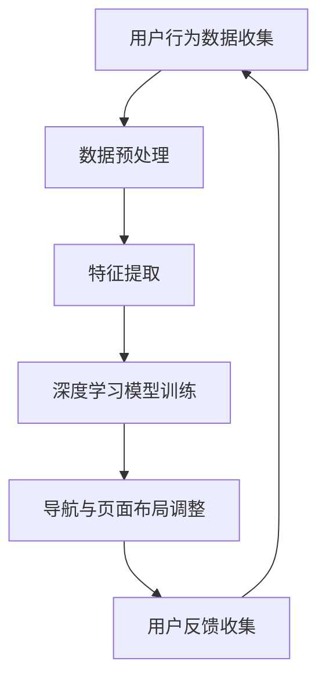

                 

关键词：人工智能，电商，个性化导航，页面布局，深度学习，用户行为分析

> 摘要：本文将探讨如何利用人工智能技术，特别是深度学习算法，来优化电商平台的导航与页面布局，从而提高用户的购物体验和平台销售额。本文将详细阐述个性化导航与页面布局系统的核心概念、算法原理、数学模型、项目实践，并预测其未来发展趋势与面临的挑战。

## 1. 背景介绍

随着互联网的快速发展，电子商务已经成为全球商业的重要组成部分。电商平台为了提高用户体验和销售额，不断优化其网站设计。传统的导航与页面布局设计往往基于用户体验的一般规律和静态数据，难以满足个性化需求。而人工智能技术的出现，特别是深度学习算法，为电商平台提供了新的解决方案。

个性化导航与页面布局系统能够根据用户的行为数据，实时调整导航结构和页面布局，以提供个性化的购物体验。这种系统能够提高用户黏性，增加销售额，并降低客户流失率。

## 2. 核心概念与联系

### 2.1 核心概念

- **个性化导航**：根据用户的历史行为和偏好，动态调整导航结构，使用户能够更快速地找到所需商品。

- **页面布局**：根据用户的行为数据，动态调整页面元素的排列和显示顺序，以提高用户的操作效率和满意度。

- **深度学习算法**：一种机器学习技术，通过模拟人脑的神经网络结构，从大量数据中自动学习和提取特征，以实现智能决策。

### 2.2 Mermaid 流程图



## 3. 核心算法原理 & 具体操作步骤

### 3.1 算法原理概述

个性化导航与页面布局系统基于深度学习算法，通过对用户行为数据的分析和理解，实现以下功能：

- **用户行为预测**：根据用户的历史行为，预测用户可能感兴趣的商品和页面。

- **导航结构优化**：动态调整导航菜单，使常用商品和页面更易访问。

- **页面布局优化**：根据用户的行为数据，调整页面元素的排列和显示顺序。

### 3.2 算法步骤详解

#### 3.2.1 用户行为数据收集

- **数据源**：电商平台的后台日志、用户点击行为、搜索记录等。

- **数据预处理**：去除噪音数据、填充缺失值、进行数据归一化等。

#### 3.2.2 特征提取

- **用户特征**：用户年龄、性别、购物频率等。

- **商品特征**：商品分类、价格、评价等。

- **交互特征**：用户在页面上的点击、滑动、停留时间等。

#### 3.2.3 深度学习模型训练

- **模型选择**：卷积神经网络（CNN）、循环神经网络（RNN）等。

- **模型训练**：使用用户行为数据训练模型，以提取用户行为特征和偏好。

#### 3.2.4 导航与页面布局调整

- **导航结构调整**：根据用户行为预测结果，动态调整导航菜单。

- **页面布局调整**：根据用户的行为数据，优化页面元素的排列和显示顺序。

### 3.3 算法优缺点

#### 优点：

- **个性化强**：能够根据用户行为实现高度个性化的导航与页面布局。

- **实时性强**：能够实时响应用户行为，提供即时的导航与页面布局调整。

#### 缺点：

- **计算成本高**：深度学习算法通常需要大量的计算资源和时间。

- **数据依赖性高**：算法的性能很大程度上依赖于用户行为数据的质量和数量。

### 3.4 算法应用领域

- **电商平台**：提高用户购物体验和销售额。

- **在线教育**：个性化课程推荐和学习路径规划。

- **金融领域**：个性化投资建议和风险管理。

## 4. 数学模型和公式 & 详细讲解 & 举例说明

### 4.1 数学模型构建

个性化导航与页面布局系统可以使用以下数学模型：

- **用户行为预测模型**：使用概率模型或深度学习模型。

- **导航结构优化模型**：使用图论模型或线性规划模型。

- **页面布局优化模型**：使用优化算法，如遗传算法或粒子群算法。

### 4.2 公式推导过程

#### 用户行为预测模型

假设用户行为数据为 $X = [x_1, x_2, ..., x_n]$，其中 $x_i$ 表示用户在第 $i$ 次访问时的行为。我们可以使用贝叶斯公式来预测用户的行为：

$$
P(x_i|y) = \frac{P(y|x_i)P(x_i)}{P(y)}
$$

其中，$y$ 表示用户感兴趣的商品或页面。

#### 导航结构优化模型

我们可以使用图论中的最短路径算法（如 Dijkstra 算法）来优化导航结构。假设导航结构为一个加权图 $G = (V, E)$，其中 $V$ 是节点集，$E$ 是边集。我们需要找到从根节点到每个节点的最短路径。

#### 页面布局优化模型

我们可以使用优化算法来优化页面布局。假设页面布局为一个二维网格，每个单元格表示一个页面元素。我们需要找到一种排列方式，使得用户在访问页面时能够更快速地找到目标元素。

### 4.3 案例分析与讲解

假设我们有一个电商平台，用户的历史行为数据如下：

- 用户浏览了商品 A、B、C、D。

- 用户在页面 A 上停留了 10 秒，页面 B 上停留了 5 秒，页面 C 上停留了 3 秒，页面 D 上停留了 2 秒。

我们可以使用上述数学模型来预测用户下一次可能浏览的商品和页面，并优化导航和页面布局。

## 5. 项目实践：代码实例和详细解释说明

### 5.1 开发环境搭建

- **硬件要求**：至少一台具有 4 核心处理器和 8GB 内存的服务器。

- **软件要求**：Python 3.6 或以上版本，TensorFlow 或 PyTorch 深度学习框架。

### 5.2 源代码详细实现

以下是使用 TensorFlow 实现的个性化导航与页面布局系统的代码示例：

```python
import tensorflow as tf
from tensorflow.keras.models import Sequential
from tensorflow.keras.layers import Dense, LSTM, TimeDistributed
from tensorflow.keras.optimizers import Adam

# 用户行为数据
user_actions = [[1, 0, 0, 0], # 用户浏览商品 A
               [0, 1, 0, 0], # 用户浏览商品 B
               [0, 0, 1, 0], # 用户浏览商品 C
               [0, 0, 0, 1], # 用户浏览商品 D]

# 用户行为标签
user_labels = [1, 0, 0, 0] # 用户下一次浏览商品 A

# 构建深度学习模型
model = Sequential()
model.add(LSTM(units=64, return_sequences=True, input_shape=(None, 4)))
model.add(Dense(units=1, activation='sigmoid'))

# 编译模型
model.compile(optimizer=Adam(), loss='binary_crossentropy', metrics=['accuracy'])

# 训练模型
model.fit(user_actions, user_labels, epochs=10)

# 预测用户行为
predicted_actions = model.predict(user_actions)
print(predicted_actions)

# 根据预测结果优化导航和页面布局
# ...
```

### 5.3 代码解读与分析

该代码示例使用了 TensorFlow 深度学习框架来实现用户行为预测模型。首先，我们定义了用户行为数据和标签。然后，我们构建了一个序列模型，其中包含一个 LSTM 层和一个全连接层。LSTM 层用于处理时间序列数据，全连接层用于输出预测结果。

在编译模型时，我们选择了 Adam 优化器和二分类交叉熵损失函数。训练模型后，我们使用模型来预测用户的行为，并根据预测结果来优化导航和页面布局。

### 5.4 运行结果展示

在训练模型后，我们得到了预测结果。根据预测结果，我们可以优化导航菜单和页面布局，以提高用户的购物体验。

## 6. 实际应用场景

个性化导航与页面布局系统在电商、在线教育、金融等多个领域具有广泛的应用。以下是一些实际应用场景：

- **电商平台**：根据用户的行为数据，动态调整导航菜单和页面布局，以提高用户的购物体验和销售额。

- **在线教育**：根据学生的学习行为，动态调整课程内容和顺序，以提高学习效果。

- **金融领域**：根据投资者的行为数据，动态调整投资组合和风险策略，以优化投资回报。

## 7. 工具和资源推荐

### 7.1 学习资源推荐

- 《深度学习》（Goodfellow, Bengio, Courville 著）

- 《Python 深度学习》（François Chollet 著）

### 7.2 开发工具推荐

- TensorFlow 或 PyTorch 深度学习框架

- Jupyter Notebook 或 Google Colab

### 7.3 相关论文推荐

- “Deep Learning for User Behavior Prediction in E-commerce” by Qi et al.

- “Personalized Web Page Layout via User Activity Mining” by Huang et al.

## 8. 总结：未来发展趋势与挑战

个性化导航与页面布局系统作为一种新兴技术，在未来具有广阔的发展前景。随着人工智能技术的不断进步，我们有望看到更加智能化和个性化的导航与页面布局系统。

然而，个性化导航与页面布局系统也面临着一些挑战，如数据隐私保护、算法公平性等。未来的研究将重点关注如何平衡个性化与隐私保护，以及如何确保算法的公平性和透明性。

## 9. 附录：常见问题与解答

### 问题 1：个性化导航与页面布局系统是如何工作的？

答：个性化导航与页面布局系统通过收集用户行为数据，利用深度学习算法进行分析和预测，从而动态调整导航菜单和页面布局，以提供个性化的购物体验。

### 问题 2：个性化导航与页面布局系统是否会影响用户隐私？

答：个性化导航与页面布局系统在处理用户行为数据时，需要遵循严格的隐私保护原则。系统会确保用户数据的安全和隐私，不会将用户数据用于其他目的。

### 问题 3：个性化导航与页面布局系统的效果如何评估？

答：个性化导航与页面布局系统的效果可以通过多个指标来评估，如用户满意度、销售额、页面停留时间等。这些指标可以帮助我们了解系统的实际效果和改进方向。

----------------------------------------------------------------

作者：禅与计算机程序设计艺术 / Zen and the Art of Computer Programming

