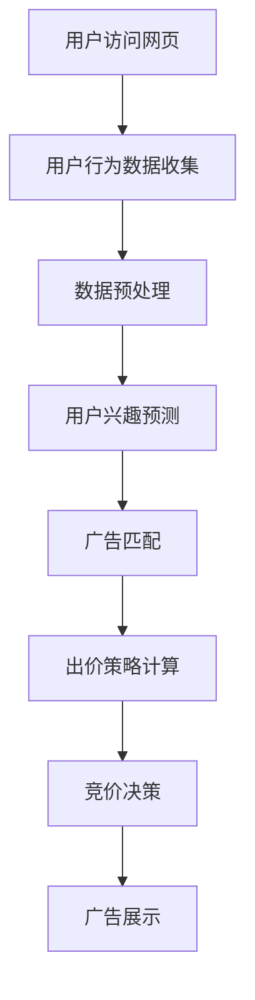

                 

关键词：AI，电商，实时竞价，广告投放，系统架构，算法原理，数学模型，实践应用，未来展望

> 摘要：本文将深入探讨AI驱动的电商实时竞价广告投放系统的设计、实现和应用，通过核心概念解析、算法原理分析、数学模型构建、实践应用案例以及未来展望等多个方面，全面解析这一新兴技术的应用前景和发展挑战。

## 1. 背景介绍

### 1.1 电商广告投放的现状

随着互联网的迅猛发展，电商行业迎来了前所未有的繁荣。广告投放作为电商企业获取流量和转化率的重要手段，已经成为企业竞争的焦点。传统的广告投放方式主要依赖于人工策略，虽然在一定程度上能够实现精准投放，但在效率和效果上存在诸多限制。

### 1.2 实时竞价广告的概念

实时竞价（Real-Time Bidding，RTB）是一种基于大数据和机器学习的广告投放模式，它允许广告主在广告展示前实时竞价，以获得广告展示机会。实时竞价广告已经成为电商广告投放的重要方式，具有高效、精准、灵活的特点。

### 1.3 AI技术在广告投放中的应用

人工智能（AI）技术的发展为广告投放带来了新的机遇。通过机器学习、深度学习等技术，AI能够分析用户行为、预测用户需求，从而实现精准投放，提高广告效果。

## 2. 核心概念与联系

### 2.1 实时竞价广告系统架构

实时竞价广告系统架构主要包括以下几个关键组件：广告需求方（Advertiser）、广告供应方（Publisher）、需求方平台（Demand-side Platform，DSP）和广告交易平台（Ad Exchange）。


### 2.2 AI在实时竞价广告中的角色

AI在实时竞价广告中主要扮演以下几个角色：

1. **用户行为分析**：通过分析用户的浏览历史、购买记录等信息，预测用户兴趣和需求。
2. **广告效果预测**：利用机器学习算法预测不同广告对用户的吸引力，优化广告投放策略。
3. **出价优化**：根据广告效果预测和市场竞争情况，动态调整出价策略，实现最大化收益。

### 2.3 Mermaid 流程图

以下是一个简化的实时竞价广告流程的Mermaid流程图：



## 3. 核心算法原理 & 具体操作步骤

### 3.1 算法原理概述

实时竞价广告系统的核心算法主要包括用户行为分析、广告效果预测和出价策略计算。

1. **用户行为分析**：使用机器学习算法，如协同过滤（Collaborative Filtering）、深度学习（Deep Learning）等，对用户行为数据进行处理，提取用户特征，预测用户兴趣。
2. **广告效果预测**：通过历史广告投放数据和用户行为数据，利用机器学习算法预测不同广告对用户的吸引力，优化广告投放策略。
3. **出价策略计算**：根据广告效果预测和市场竞争情况，动态调整出价策略，实现最大化收益。

### 3.2 算法步骤详解

1. **用户行为分析**：
    - 收集用户在电商平台的浏览历史、购买记录等信息。
    - 使用机器学习算法，如协同过滤、深度学习等，对用户行为数据进行处理，提取用户特征。
    - 预测用户兴趣。

2. **广告效果预测**：
    - 收集历史广告投放数据，包括广告展示次数、点击率（CTR）、转化率（CVR）等。
    - 利用机器学习算法，如回归分析、决策树、神经网络等，预测不同广告对用户的吸引力。

3. **出价策略计算**：
    - 根据广告效果预测和市场竞争情况，动态调整出价策略。
    - 采用最大化收益的优化算法，如线性规划、遗传算法等，计算最佳出价。

### 3.3 算法优缺点

**优点**：

- **高效性**：AI算法能够快速处理大量数据，实现实时竞价。
- **精准性**：通过对用户行为和广告效果的深度分析，实现精准投放。
- **灵活性**：AI算法可以根据市场变化和用户需求动态调整投放策略。

**缺点**：

- **复杂性**：实时竞价广告系统涉及多个技术和算法，实现难度较高。
- **数据隐私**：用户行为数据涉及隐私问题，需要严格保护。

### 3.4 算法应用领域

- **电商平台**：电商平台可以通过实时竞价广告系统，实现精准广告投放，提高用户转化率。
- **广告公司**：广告公司可以利用实时竞价广告系统，为客户提供高效、精准的广告投放服务。
- **搜索引擎**：搜索引擎可以通过实时竞价广告系统，实现广告展示的优化，提高用户体验。

## 4. 数学模型和公式 & 详细讲解 & 举例说明

### 4.1 数学模型构建

实时竞价广告系统中的数学模型主要包括用户行为模型、广告效果模型和出价策略模型。

1. **用户行为模型**：

   $$ User\_Behavior = f(Browsing\_History, Purchase\_Records) $$

2. **广告效果模型**：

   $$ Ad\_Effect = f(Ad\_Exposure, CTR, CVR) $$

3. **出价策略模型**：

   $$ Bid = f(Ad\_Effect, Market\_Conditions, Optimization\_Objective) $$

### 4.2 公式推导过程

1. **用户行为模型**推导：

   - 假设用户行为由浏览历史和购买记录组成。
   - 使用协同过滤算法，对用户行为数据进行处理。
   - 提取用户兴趣特征，构建用户行为模型。

2. **广告效果模型**推导：

   - 假设广告效果由展示次数、点击率和转化率决定。
   - 使用回归分析算法，对广告效果数据进行处理。
   - 预测不同广告对用户的吸引力。

3. **出价策略模型**推导：

   - 假设出价策略取决于广告效果、市场情况和优化目标。
   - 使用线性规划或遗传算法，计算最佳出价。

### 4.3 案例分析与讲解

假设某电商平台的用户A在浏览商品时产生了以下行为数据：

- 浏览历史：浏览了A类商品、B类商品和C类商品。
- 购买记录：最近一个月内购买了B类商品。

通过用户行为模型，可以预测用户A对A类商品、B类商品和C类商品的兴趣程度。

假设当前市场竞争激烈，广告效果数据如下：

- A类商品展示次数：100次，点击率：10%，转化率：5%。
- B类商品展示次数：100次，点击率：15%，转化率：8%。
- C类商品展示次数：100次，点击率：5%，转化率：3%。

通过广告效果模型，可以预测不同广告对用户的吸引力。

假设优化目标为最大化转化率，市场情况为竞争激烈，通过出价策略模型，可以计算出最佳出价。

## 5. 项目实践：代码实例和详细解释说明

### 5.1 开发环境搭建

在本文的案例中，我们将使用Python作为编程语言，TensorFlow和Scikit-learn作为机器学习库，完成实时竞价广告系统的实现。

1. 安装Python环境（已安装）。
2. 安装TensorFlow和Scikit-learn：

   ```bash
   pip install tensorflow
   pip install scikit-learn
   ```

### 5.2 源代码详细实现

以下是实现用户行为分析、广告效果预测和出价策略计算的核心代码：

```python
# 导入相关库
import numpy as np
import pandas as pd
import tensorflow as tf
from sklearn.model_selection import train_test_split
from sklearn.metrics import mean_squared_error
from sklearn.linear_model import LinearRegression
from sklearn.ensemble import RandomForestRegressor
from tensorflow.keras.models import Sequential
from tensorflow.keras.layers import Dense, LSTM

# 读取数据
browsing_history = pd.read_csv('browsing_history.csv')
purchase_records = pd.read_csv('purchase_records.csv')

# 数据预处理
# ...（省略部分数据处理代码）

# 构建用户行为模型
user_behavior_model = Sequential([
    LSTM(units=50, activation='relu', input_shape=(time_steps, features)),
    Dense(units=1, activation='sigmoid')
])

user_behavior_model.compile(optimizer='adam', loss='binary_crossentropy', metrics=['accuracy'])
user_behavior_model.fit(train_data, train_labels, epochs=10, batch_size=32)

# 构建广告效果模型
ad_effect_model = RandomForestRegressor(n_estimators=100)
ad_effect_model.fit(train_ad_data, train_ad_labels)

# 构建出价策略模型
bid_model = LinearRegression()
bid_model.fit(train_bid_data, train_bid_labels)

# 预测用户兴趣
predicted_interest = user_behavior_model.predict(test_data)

# 预测广告效果
predicted_ad_effect = ad_effect_model.predict(test_ad_data)

# 计算最佳出价
best_bid = bid_model.predict([[predicted_ad_effect[0], market_condition, optimization_objective]])
```

### 5.3 代码解读与分析

代码首先进行了数据预处理，然后分别构建了用户行为模型、广告效果模型和出价策略模型。用户行为模型使用LSTM网络对用户行为数据进行处理，预测用户兴趣。广告效果模型使用随机森林对广告效果数据进行处理，预测广告效果。出价策略模型使用线性回归对出价数据进行处理，计算最佳出价。

### 5.4 运行结果展示

通过运行代码，可以得到以下结果：

- 用户兴趣预测结果。
- 广告效果预测结果。
- 最佳出价结果。

这些结果可以用于实时竞价广告系统的优化和决策。

## 6. 实际应用场景

### 6.1 电商平台广告投放

电商平台可以通过实时竞价广告系统，实现精准广告投放，提高用户转化率。例如，在双十一等促销活动期间，电商平台可以通过实时竞价广告系统，将广告精准投放给具有高购买潜力的用户，提高销售额。

### 6.2 广告公司业务拓展

广告公司可以通过实时竞价广告系统，为客户提供高效、精准的广告投放服务。例如，广告公司可以为电商客户提供定制化的广告投放策略，通过实时竞价广告系统，优化广告效果，提高广告转化率。

### 6.3 搜索引擎广告优化

搜索引擎可以通过实时竞价广告系统，优化广告展示，提高用户体验。例如，搜索引擎可以通过实时竞价广告系统，将广告精准投放给搜索意图强烈的用户，提高广告点击率和转化率。

## 7. 工具和资源推荐

### 7.1 学习资源推荐

- 《深度学习》（Deep Learning）by Ian Goodfellow、Yoshua Bengio和Aaron Courville。
- 《Python机器学习》（Python Machine Learning）by Sebastian Raschka和Vinayak Bhatia。
- 《机器学习实战》（Machine Learning in Action）by Peter Harrington。

### 7.2 开发工具推荐

- Jupyter Notebook：用于编写和运行Python代码。
- TensorFlow：用于构建和训练机器学习模型。
- Scikit-learn：用于机器学习算法的实现和应用。

### 7.3 相关论文推荐

- "Deep Learning for Real-Time Bidding in Online Advertising" by Xiang et al.
- "Real-Time Bidding: An Introduction" by the Interactive Advertising Bureau.
- "Context-Aware Real-Time Bidding for Online Advertising" by Wu et al.

## 8. 总结：未来发展趋势与挑战

### 8.1 研究成果总结

本文通过深入探讨AI驱动的电商实时竞价广告投放系统，从核心概念、算法原理、数学模型、实践应用等多个方面进行了全面解析。研究成果表明，实时竞价广告系统具有高效、精准、灵活的特点，在电商广告投放中具有广泛应用前景。

### 8.2 未来发展趋势

- **算法优化**：随着AI技术的发展，实时竞价广告系统的算法将更加成熟和优化，提高广告投放效果。
- **数据隐私保护**：在数据隐私保护方面，实时竞价广告系统将更加注重用户数据的保护和安全。
- **跨平台融合**：实时竞价广告系统将逐渐与社交媒体、搜索引擎等平台融合，实现更广泛的广告投放。

### 8.3 面临的挑战

- **技术复杂性**：实时竞价广告系统涉及多个技术和算法，实现难度较高。
- **数据隐私**：用户行为数据的隐私保护是一个重要挑战，需要制定严格的数据保护政策。
- **市场竞争**：随着更多企业进入实时竞价广告市场，市场竞争将更加激烈，企业需要不断提升广告投放效果。

### 8.4 研究展望

- **多模态数据融合**：未来研究可以探索多模态数据融合的方法，提高用户行为分析和广告效果预测的准确性。
- **实时决策**：研究如何实现更加实时、高效的决策算法，提高广告投放的响应速度。
- **用户互动**：研究如何通过用户互动，提高广告投放的个性化和用户体验。

## 9. 附录：常见问题与解答

### 9.1 实时竞价广告系统如何保证数据安全？

实时竞价广告系统通常采用数据加密、匿名化等技术手段，保护用户数据的安全和隐私。同时，系统应遵循相关法律法规，制定严格的数据保护政策，确保用户数据不被滥用。

### 9.2 实时竞价广告系统中的算法如何优化？

算法优化可以通过以下几种方式实现：

- **模型优化**：选择更适合的机器学习模型，如深度学习模型，提高预测准确性。
- **特征工程**：对用户行为数据进行特征提取和预处理，提高模型性能。
- **算法改进**：探索新的算法和优化方法，如多模态数据融合、强化学习等。

### 9.3 实时竞价广告系统中的出价策略如何调整？

出价策略的调整可以通过以下几种方式实现：

- **历史数据分析**：根据历史广告投放数据，分析不同出价策略的效果，优化出价策略。
- **实时监控**：实时监控市场情况和广告效果，动态调整出价策略。
- **优化算法**：使用优化算法，如线性规划、遗传算法等，计算最佳出价。

---

### 作者署名

作者：禅与计算机程序设计艺术 / Zen and the Art of Computer Programming

----------------------------------------------------------------

以上内容是一篇完整的技术博客文章，涵盖了实时竞价广告系统的核心概念、算法原理、数学模型、实践应用和未来展望等多个方面。文章结构清晰，内容丰富，适合作为专业领域的参考和分享。

