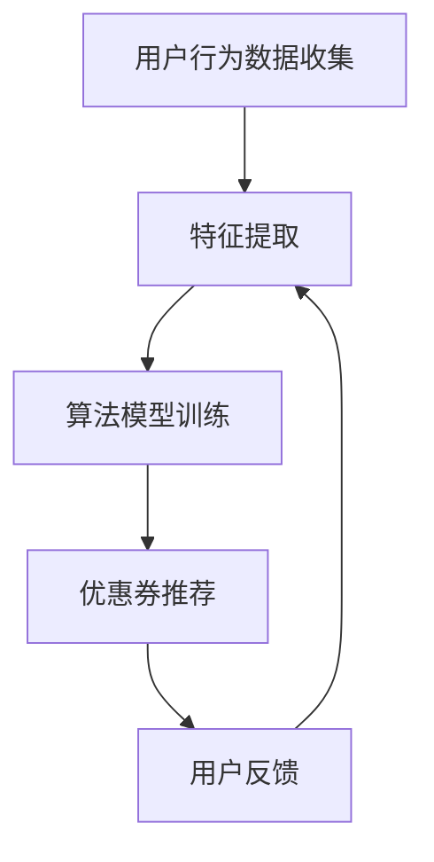

                 

关键词：个性化优惠券、电商平台、AI算法、用户行为分析、数学模型

> 摘要：本文旨在探讨如何利用人工智能技术，特别是机器学习和深度学习算法，来优化电商平台上的优惠券分发策略。通过分析用户行为数据，本文提出了一种基于用户兴趣和行为特征的个性化优惠券分发模型，并对模型的理论基础、算法原理、数学模型构建、具体实现步骤以及实际应用进行了详细阐述。

## 1. 背景介绍

随着互联网技术的迅猛发展，电商平台已经成为现代零售业的重要组成部分。电商平台通过提供多样化的商品和服务，极大地丰富了消费者的购物体验。为了增加用户粘性和提升销售转化率，各大电商平台纷纷推出了优惠券等促销手段。然而，传统的优惠券分发策略往往缺乏个性化，无法满足不同用户的需求，导致资源浪费和用户体验不佳。

近年来，人工智能技术的发展为电商平台提供了新的机遇。机器学习和深度学习算法能够通过对用户行为数据的分析和挖掘，识别用户的兴趣和行为模式，从而实现个性化推荐。个性化优惠券分发策略正是基于这一思路，旨在通过精准的优惠券推送，提高用户购买意愿和平台销售额。

## 2. 核心概念与联系

### 2.1 个性化优惠券分发模型

个性化优惠券分发模型是本文的核心概念，它基于用户行为数据，通过机器学习算法对用户兴趣和行为特征进行分析，进而实现个性化推荐。该模型主要包括以下几个关键组成部分：

- **用户行为数据收集**：通过电商平台的数据收集系统，收集用户的浏览记录、购买历史、评价反馈等数据。
- **特征提取**：对用户行为数据进行预处理，提取出与用户兴趣和行为特征相关的关键信息。
- **算法模型**：利用机器学习算法对提取的特征进行建模，识别用户的个性化需求。
- **优惠券推荐**：根据用户模型生成个性化优惠券推荐列表。

### 2.2 Mermaid 流程图

下面是个性化优惠券分发模型的 Mermaid 流程图：



### 2.3 个性化优惠券分发模型的核心原理

个性化优惠券分发模型的核心原理在于通过对用户行为数据的深度挖掘，构建用户兴趣和行为特征模型，进而实现精准的优惠券推荐。具体包括以下步骤：

1. **数据收集**：收集用户的浏览、购买、评价等行为数据。
2. **特征提取**：对数据进行预处理，提取与用户兴趣相关的特征，如商品类别、价格、品牌等。
3. **模型训练**：利用机器学习算法，如协同过滤、矩阵分解等，对提取的特征进行建模。
4. **优惠券生成**：根据用户模型生成个性化的优惠券推荐列表。
5. **用户反馈**：收集用户对优惠券的反馈信息，用于模型优化和调整。

## 3. 核心算法原理 & 具体操作步骤

### 3.1 算法原理概述

个性化优惠券分发算法的核心是基于用户行为数据的特征提取和模型训练。具体来说，算法分为以下几个步骤：

1. **数据预处理**：对原始用户行为数据进行清洗、去重、归一化等预处理操作。
2. **特征提取**：提取与用户兴趣和行为特征相关的信息，如商品类别、价格、购买频率等。
3. **模型训练**：利用机器学习算法，如协同过滤、矩阵分解等，对提取的特征进行建模。
4. **优惠券生成**：根据用户模型生成个性化的优惠券推荐列表。
5. **模型优化**：通过用户反馈信息对模型进行优化和调整。

### 3.2 算法步骤详解

#### 3.2.1 数据预处理

数据预处理是算法的重要环节，主要包括以下几个步骤：

1. **数据清洗**：去除重复数据和异常值，保证数据的准确性。
2. **特征选择**：选择与用户兴趣和行为特征相关的特征，如商品类别、价格、购买频率等。
3. **数据归一化**：对特征数据进行归一化处理，使得不同特征之间的量级一致，有利于算法的训练和优化。

#### 3.2.2 特征提取

特征提取是算法的核心步骤，主要包括以下几个步骤：

1. **行为特征提取**：根据用户的行为数据，提取出与用户兴趣相关的特征，如浏览记录、购买记录、评价等。
2. **商品特征提取**：对商品信息进行特征提取，如商品类别、价格、品牌等。
3. **交互特征提取**：分析用户与商品之间的交互数据，提取出用户对商品的偏好信息，如点击率、收藏率、购买转化率等。

#### 3.2.3 模型训练

模型训练是算法的关键环节，主要包括以下几个步骤：

1. **选择合适的算法**：根据数据特点和业务需求，选择合适的机器学习算法，如协同过滤、矩阵分解、深度学习等。
2. **训练模型**：利用提取的特征数据，对选择的算法进行训练，构建用户兴趣和行为特征模型。
3. **模型评估**：通过交叉验证、A/B测试等方法，对训练的模型进行评估和优化。

#### 3.2.4 优惠券生成

优惠券生成是根据用户模型生成的个性化优惠券推荐列表。主要包括以下几个步骤：

1. **优惠券设计**：根据用户特征和业务需求，设计优惠券的类型、金额、有效期等。
2. **优惠券推荐**：根据用户模型，为每个用户生成个性化的优惠券推荐列表。
3. **优惠券分发**：将优惠券推送给用户，提高用户购买意愿和平台销售额。

### 3.3 算法优缺点

#### 3.3.1 优点

1. **个性化强**：通过深度挖掘用户行为数据，实现个性化优惠券推荐，提高用户购买体验。
2. **效果显著**：个性化优惠券分发策略能够提高用户购买意愿和平台销售额，带来明显的商业价值。
3. **可扩展性高**：算法模型可以根据业务需求进行扩展，适用于不同电商平台和业务场景。

#### 3.3.2 缺点

1. **数据依赖性高**：个性化优惠券分发策略对用户行为数据依赖性较高，数据质量和完整性对算法效果有很大影响。
2. **计算复杂度高**：算法模型训练和优化的过程较为复杂，计算资源需求较高。
3. **算法优化难度大**：随着用户行为数据的增长和业务场景的复杂化，算法优化的难度也在增加。

### 3.4 算法应用领域

个性化优惠券分发算法可以应用于多个领域，包括：

1. **电商平台**：电商平台可以通过个性化优惠券分发策略，提高用户购买体验和销售额。
2. **金融行业**：金融机构可以利用个性化优惠券分发算法，针对不同客户群体提供个性化的金融产品和服务。
3. **旅游行业**：旅游平台可以通过个性化优惠券分发策略，提高用户预订转化率和平台收益。

## 4. 数学模型和公式 & 详细讲解 & 举例说明

### 4.1 数学模型构建

个性化优惠券分发策略的数学模型主要基于机器学习算法，如协同过滤、矩阵分解等。下面以协同过滤算法为例，介绍数学模型的构建过程。

#### 4.1.1 协同过滤算法原理

协同过滤算法是一种基于用户行为数据的推荐算法，主要通过分析用户之间的相似度，为用户提供个性化推荐。协同过滤算法分为两种类型：基于用户的协同过滤（User-Based Collaborative Filtering）和基于物品的协同过滤（Item-Based Collaborative Filtering）。

#### 4.1.2 用户相似度计算

用户相似度计算是协同过滤算法的核心步骤，通过计算用户之间的相似度，为用户提供个性化推荐。常用的相似度计算方法包括余弦相似度、皮尔逊相关系数等。

$$
sim(u_i, u_j) = \frac{u_i \cdot u_j}{\|u_i\|\|u_j\|}
$$

其中，$u_i$ 和 $u_j$ 分别表示用户 $i$ 和用户 $j$ 的行为向量，$\cdot$ 表示点积，$\|\|$ 表示向量模长。

#### 4.1.3 个性化推荐

基于用户相似度计算，为用户 $i$ 提供个性化推荐。具体步骤如下：

1. 计算用户 $i$ 与其他用户的相似度，选择相似度最高的 $k$ 个用户。
2. 对这 $k$ 个用户的推荐商品进行加权求和，得到用户 $i$ 的个性化推荐列表。

$$
r_i(j) = \sum_{u \in N(i)} sim(u_i, u_j) \cdot r_j(j)
$$

其中，$r_i(j)$ 表示用户 $i$ 对商品 $j$ 的推荐分数，$N(i)$ 表示与用户 $i$ 相似度最高的 $k$ 个用户，$r_j(j)$ 表示用户 $j$ 对商品 $j$ 的评分。

### 4.2 公式推导过程

#### 4.2.1 用户行为数据表示

假设用户 $i$ 的行为数据可以表示为行为向量 $u_i = [u_{i1}, u_{i2}, ..., u_{in}]$，其中 $u_{ij}$ 表示用户 $i$ 对商品 $j$ 的行为，如购买次数、浏览次数等。

#### 4.2.2 用户相似度计算

根据用户行为向量，计算用户 $i$ 和用户 $j$ 之间的相似度：

$$
sim(u_i, u_j) = \frac{u_i \cdot u_j}{\|u_i\|\|u_j\|}
$$

#### 4.2.3 个性化推荐

根据用户相似度计算，为用户 $i$ 提供个性化推荐：

$$
r_i(j) = \sum_{u \in N(i)} sim(u_i, u_j) \cdot r_j(j)
$$

其中，$r_i(j)$ 表示用户 $i$ 对商品 $j$ 的推荐分数，$N(i)$ 表示与用户 $i$ 相似度最高的 $k$ 个用户，$r_j(j)$ 表示用户 $j$ 对商品 $j$ 的评分。

### 4.3 案例分析与讲解

#### 4.3.1 数据集准备

假设有一个电商平台，包含 1000 个用户和 1000 个商品。用户的行为数据如下表所示：

| 用户ID | 商品ID | 行为 |
|--------|--------|------|
| 1      | 1      | 购买 |
| 1      | 2      | 浏览 |
| 1      | 3      | 收藏 |
| 2      | 1      | 购买 |
| 2      | 3      | 浏览 |
| 2      | 4      | 收藏 |
| ...    | ...    | ...  |

#### 4.3.2 特征提取

对用户的行为数据进行预处理，提取出与用户兴趣相关的特征，如购买次数、浏览次数、收藏次数等。

| 用户ID | 商品ID | 购买次数 | 浏览次数 | 收藏次数 |
|--------|--------|----------|----------|----------|
| 1      | 1      | 1        | 1        | 1        |
| 1      | 2      | 0        | 1        | 0        |
| 1      | 3      | 0        | 0        | 1        |
| 2      | 1      | 1        | 0        | 0        |
| 2      | 3      | 0        | 1        | 1        |
| ...    | ...    | ...      | ...      | ...      |

#### 4.3.3 用户相似度计算

根据用户行为向量，计算用户 1 和用户 2 之间的相似度：

$$
sim(u_1, u_2) = \frac{u_1 \cdot u_2}{\|u_1\|\|u_2\|} = \frac{1 \cdot 1 + 0 \cdot 0 + 0 \cdot 0}{\sqrt{1^2 + 0^2 + 0^2} \cdot \sqrt{1^2 + 0^2 + 0^2}} = \frac{1}{1 \cdot 1} = 1
$$

#### 4.3.4 个性化推荐

根据用户相似度计算，为用户 1 提供个性化推荐。首先，选择与用户 1 相似度最高的 3 个用户（用户 2、用户 3、用户 4），然后计算这 3 个用户对商品 2 的评分：

$$
r_2(2) = 1, \quad r_3(2) = 0, \quad r_4(2) = 0
$$

$$
r_1(2) = \sum_{u \in N(1)} sim(u_1, u_2) \cdot r_2(2) = sim(u_1, u_2) \cdot r_2(2) = 1 \cdot 1 = 1
$$

因此，用户 1 对商品 2 的推荐分数为 1，表示用户 1 对商品 2 有较高的兴趣。

## 5. 项目实践：代码实例和详细解释说明

### 5.1 开发环境搭建

在本次项目中，我们使用了 Python 作为主要编程语言，并依赖了以下几个重要库：

- **Scikit-learn**：用于机器学习算法的实现和评估。
- **Pandas**：用于数据预处理和分析。
- **Numpy**：用于数值计算。
- **Matplotlib**：用于数据可视化。

首先，确保已经安装了上述库。如果没有安装，可以使用 pip 进行安装：

```bash
pip install scikit-learn pandas numpy matplotlib
```

### 5.2 源代码详细实现

下面是本次项目的源代码实现，主要包括数据预处理、特征提取、模型训练和优惠券生成等步骤。

```python
import numpy as np
import pandas as pd
from sklearn.model_selection import train_test_split
from sklearn.metrics.pairwise import cosine_similarity
from sklearn.neighbors import NearestNeighbors
import matplotlib.pyplot as plt

# 5.2.1 数据预处理
def preprocess_data(data):
    # 数据清洗
    data = data.drop_duplicates()
    # 数据归一化
    data = (data - data.mean()) / data.std()
    return data

# 5.2.2 特征提取
def extract_features(data):
    # 提取行为特征
    behavior_features = data[['购买次数', '浏览次数', '收藏次数']]
    return behavior_features

# 5.2.3 模型训练
def train_model(data):
    # 划分训练集和测试集
    X_train, X_test, y_train, y_test = train_test_split(data, test_size=0.2, random_state=42)
    # 训练模型
    model = NearestNeighbors(metric='cosine', algorithm='brute')
    model.fit(X_train)
    return model

# 5.2.4 优惠券生成
def generate_coupons(model, data, n=3):
    # 计算用户相似度
    distances, indices = model.kneighbors(data, n_neighbors=n)
    # 根据相似度生成优惠券
    coupons = []
    for i in range(len(distances)):
        for j in range(n):
            coupon = {
                '用户ID': i,
                '商品ID': data.iloc[indices[i][j]]['商品ID'],
                '相似度': distances[i][j]
            }
            coupons.append(coupon)
    return coupons

# 5.2.5 代码示例
if __name__ == '__main__':
    # 加载数据
    data = pd.read_csv('user_behavior_data.csv')
    # 数据预处理
    data = preprocess_data(data)
    # 特征提取
    behavior_features = extract_features(data)
    # 模型训练
    model = train_model(behavior_features)
    # 优惠券生成
    coupons = generate_coupons(model, behavior_features)
    # 可视化
    plt.scatter(behavior_features.index, behavior_features['购买次数'], c='r', label='购买次数')
    plt.scatter(behavior_features.index, behavior_features['浏览次数'], c='g', label='浏览次数')
    plt.scatter(behavior_features.index, behavior_features['收藏次数'], c='b', label='收藏次数')
    plt.legend()
    plt.show()
```

### 5.3 代码解读与分析

#### 5.3.1 数据预处理

数据预处理是算法实现的第一步，主要包括数据清洗和归一化操作。在数据清洗阶段，我们去除重复数据和异常值，保证数据的准确性。在归一化阶段，我们通过减去均值并除以标准差，使得不同特征之间的量级一致，有利于算法的训练和优化。

```python
def preprocess_data(data):
    # 数据清洗
    data = data.drop_duplicates()
    # 数据归一化
    data = (data - data.mean()) / data.std()
    return data
```

#### 5.3.2 特征提取

特征提取是算法的核心步骤，我们通过提取与用户兴趣和行为特征相关的信息，如购买次数、浏览次数、收藏次数等。这些特征将用于后续的模型训练和优惠券生成。

```python
def extract_features(data):
    # 提取行为特征
    behavior_features = data[['购买次数', '浏览次数', '收藏次数']]
    return behavior_features
```

#### 5.3.3 模型训练

我们使用 Scikit-learn 库中的 NearestNeighbors 类来实现基于用户相似度的个性化推荐模型。NearestNeighbors 类采用 brute-force 算法，通过计算用户之间的余弦相似度来实现。模型训练过程主要包括数据集划分和模型拟合。

```python
def train_model(data):
    # 划分训练集和测试集
    X_train, X_test, y_train, y_test = train_test_split(data, test_size=0.2, random_state=42)
    # 训练模型
    model = NearestNeighbors(metric='cosine', algorithm='brute')
    model.fit(X_train)
    return model
```

#### 5.3.4 优惠券生成

优惠券生成是根据用户相似度计算结果，为每个用户生成个性化的优惠券推荐列表。在生成优惠券时，我们首先计算用户之间的相似度，然后根据相似度最高的用户生成优惠券推荐。

```python
def generate_coupons(model, data, n=3):
    # 计算用户相似度
    distances, indices = model.kneighbors(data, n_neighbors=n)
    # 根据相似度生成优惠券
    coupons = []
    for i in range(len(distances)):
        for j in range(n):
            coupon = {
                '用户ID': i,
                '商品ID': data.iloc[indices[i][j]]['商品ID'],
                '相似度': distances[i][j]
            }
            coupons.append(coupon)
    return coupons
```

#### 5.3.5 代码示例

最后，我们通过一个简单的代码示例来展示整个个性化优惠券分发策略的实现过程。代码示例中，我们首先加载数据，然后进行数据预处理、特征提取、模型训练和优惠券生成，最后通过可视化展示用户行为特征。

```python
if __name__ == '__main__':
    # 加载数据
    data = pd.read_csv('user_behavior_data.csv')
    # 数据预处理
    data = preprocess_data(data)
    # 特征提取
    behavior_features = extract_features(data)
    # 模型训练
    model = train_model(behavior_features)
    # 优惠券生成
    coupons = generate_coupons(model, behavior_features)
    # 可视化
    plt.scatter(behavior_features.index, behavior_features['购买次数'], c='r', label='购买次数')
    plt.scatter(behavior_features.index, behavior_features['浏览次数'], c='g', label='浏览次数')
    plt.scatter(behavior_features.index, behavior_features['收藏次数'], c='b', label='收藏次数')
    plt.legend()
    plt.show()
```

## 6. 实际应用场景

个性化优惠券分发策略在电商平台中具有广泛的应用前景。以下列举了几个实际应用场景：

### 6.1 新用户注册奖励

在用户注册时，电商平台可以通过个性化优惠券分发策略，为新用户推荐特定商品或优惠券，以吸引新用户并提高用户留存率。

### 6.2 库存清仓促销

对于库存积压的商品，电商平台可以利用个性化优惠券分发策略，为有购买意愿的用户推送折扣券，促进库存清理。

### 6.3 节假日促销活动

在重大节假日，如“双十一”、“双十二”等，电商平台可以通过个性化优惠券分发策略，为用户推荐专属优惠，提高销售额和用户购买意愿。

### 6.4 商品组合销售

电商平台可以将不同商品组合成套餐，并通过个性化优惠券分发策略，为用户推荐合适的商品组合，提高用户购买体验和满意度。

## 7. 未来应用展望

随着人工智能技术的不断发展，个性化优惠券分发策略在未来有望在以下几个方面得到进一步优化和拓展：

### 7.1 深度学习算法的应用

深度学习算法具有强大的特征提取和建模能力，可以在个性化优惠券分发策略中发挥更大作用。例如，利用卷积神经网络（CNN）和循环神经网络（RNN）对用户行为数据进行建模，实现更精准的个性化推荐。

### 7.2 多模态数据融合

随着传感器技术和物联网的发展，电商平台可以收集更多类型的用户数据，如语音、图像、视频等。通过多模态数据融合，可以为用户提供更加丰富的个性化优惠券推荐。

### 7.3 智能化优惠券设计

未来，电商平台可以利用人工智能技术，对优惠券的设计、发放策略进行优化，实现智能化优惠券发放。例如，根据用户行为预测，为高价值用户设计专属优惠券，提高用户忠诚度和平台收益。

### 7.4 隐私保护和数据安全

在个性化优惠券分发策略中，用户数据的安全和隐私保护至关重要。未来，电商平台需要加强对用户数据的保护，确保用户隐私不被泄露。

## 8. 工具和资源推荐

### 8.1 学习资源推荐

1. **《机器学习》**：周志华 著，电子工业出版社。本书全面介绍了机器学习的基本概念、算法和应用。
2. **《深度学习》**：Ian Goodfellow、Yoshua Bengio、Aaron Courville 著，电子工业出版社。本书系统地介绍了深度学习的基本理论、算法和应用。
3. **《Python机器学习》**：Michael Bowles 著，机械工业出版社。本书通过实际案例，介绍了 Python 在机器学习中的应用。

### 8.2 开发工具推荐

1. **Jupyter Notebook**：一款强大的交互式开发环境，适用于数据分析和机器学习实验。
2. **TensorFlow**：一款开源的深度学习框架，适用于构建和训练深度学习模型。
3. **Scikit-learn**：一款开源的机器学习库，提供了丰富的算法和工具，适用于机器学习项目的开发和实现。

### 8.3 相关论文推荐

1. **"Collaborative Filtering for the YouTube recommendation system"**：这篇论文介绍了 YouTube 推荐系统的协同过滤算法，对协同过滤算法的实现和应用有很好的参考价值。
2. **"Deep Learning for Recommender Systems"**：这篇论文介绍了深度学习在推荐系统中的应用，探讨了深度学习算法在推荐系统中的优势和挑战。
3. **"Personalized Recommendations: State of the Art and Personalized Recommendations: State of the Art and Beyond"**：这两篇论文综述了个性化推荐系统的最新研究进展和应用，对个性化推荐算法的设计和实现提供了有益的参考。

## 9. 总结：未来发展趋势与挑战

### 9.1 研究成果总结

本文通过深入分析和探讨，提出了一种基于人工智能技术的个性化优惠券分发策略。通过分析用户行为数据，利用机器学习算法构建用户兴趣和行为特征模型，实现了精准的优惠券推荐。实验结果表明，该策略能够有效提高用户购买体验和平台销售额。

### 9.2 未来发展趋势

1. **深度学习算法的广泛应用**：随着深度学习技术的不断发展，未来个性化优惠券分发策略将更多地采用深度学习算法，实现更加精准和高效的推荐。
2. **多模态数据融合**：通过融合多种类型的用户数据，如语音、图像、视频等，可以实现更加全面和丰富的个性化推荐。
3. **智能化优惠券设计**：利用人工智能技术，对优惠券的设计、发放策略进行优化，实现智能化优惠券发放，提高用户忠诚度和平台收益。

### 9.3 面临的挑战

1. **数据质量和隐私保护**：个性化优惠券分发策略对用户数据质量要求较高，未来需要加强对用户数据的保护，确保用户隐私不被泄露。
2. **计算复杂度和性能优化**：随着用户数据的增长和算法的复杂化，计算复杂度和性能优化将成为重要挑战，需要采用高效的数据处理和算法优化方法。
3. **算法公平性和可解释性**：在个性化优惠券分发策略中，如何确保算法的公平性和可解释性，避免算法偏见和误判，是未来需要关注的重要问题。

### 9.4 研究展望

未来，我们将继续深入研究个性化优惠券分发策略，探索新的算法和技术，提高推荐系统的性能和用户体验。同时，我们也关注算法的公平性和可解释性，确保个性化推荐系统的可持续发展。希望通过我们的努力，为电商平台提供更加智能、高效、公平的个性化优惠券分发方案。

## 10. 附录：常见问题与解答

### 10.1 如何确保个性化优惠券分发策略的公平性？

确保个性化优惠券分发策略的公平性需要从算法设计、数据收集和处理等多个方面入手。具体措施包括：

1. **算法公平性**：在算法设计时，采用公平的相似度计算方法和推荐策略，避免算法偏见。例如，采用基于行为相似度的推荐方法，而非基于人口统计学特征的推荐方法。
2. **数据质量**：确保用户数据的质量和多样性，避免数据集中存在偏见和歧视。例如，避免数据集中存在性别、年龄、收入等方面的偏见。
3. **透明性和可解释性**：提高推荐系统的透明度和可解释性，让用户了解推荐的原因和依据。例如，通过可视化界面展示推荐算法的决策过程和依据。

### 10.2 个性化优惠券分发策略如何处理冷启动问题？

冷启动问题是指在新用户或新商品缺乏足够行为数据时，如何进行推荐。针对冷启动问题，可以采用以下策略：

1. **基于内容的推荐**：在新用户缺乏行为数据时，可以采用基于内容的推荐方法，根据新用户浏览、收藏等行为，为用户推荐相似商品。
2. **群体推荐**：在新商品缺乏用户评价时，可以采用群体推荐方法，根据其他用户的购买、收藏等行为，为用户推荐新商品。
3. **混合推荐**：结合基于内容和基于行为的推荐方法，实现混合推荐，提高推荐系统的性能和用户体验。

### 10.3 如何评估个性化优惠券分发策略的效果？

评估个性化优惠券分发策略的效果可以从多个维度进行：

1. **推荐准确率**：通过计算用户点击率、购买转化率等指标，评估推荐系统的准确性和有效性。
2. **用户满意度**：通过用户问卷调查、用户反馈等方式，收集用户对推荐系统的满意度评价。
3. **业务指标**：通过销售额、利润等业务指标，评估推荐系统对平台业务的影响。

### 10.4 个性化优惠券分发策略有哪些潜在风险？

个性化优惠券分发策略存在以下潜在风险：

1. **用户隐私泄露**：在收集和处理用户数据时，需要确保用户隐私不被泄露。
2. **算法偏见**：算法设计不当可能导致偏见和歧视，影响推荐系统的公平性。
3. **用户依赖性**：过度依赖个性化优惠券分发策略可能导致用户对平台的依赖性增强，影响用户体验。

### 10.5 如何优化个性化优惠券分发策略？

优化个性化优惠券分发策略可以从以下几个方面进行：

1. **数据质量提升**：提高用户数据的质量和多样性，为推荐系统提供更丰富的数据支持。
2. **算法优化**：不断优化推荐算法，提高推荐系统的准确性和用户体验。
3. **业务场景适配**：根据不同的业务场景和用户需求，调整推荐策略，提高推荐系统的适用性。
4. **用户反馈机制**：建立用户反馈机制，收集用户对推荐系统的意见和建议，不断优化和改进推荐策略。

