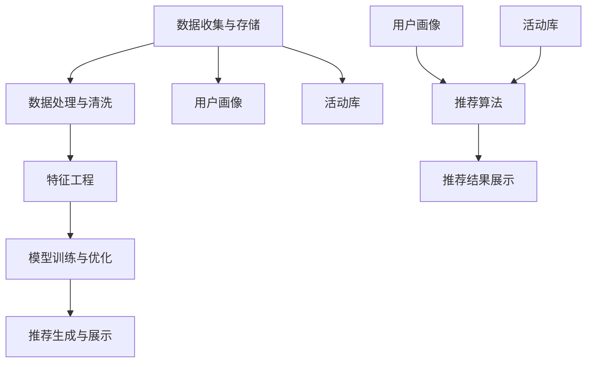

                 

在当今的数字化时代，电商平台作为现代商业的重要组成部分，其成功很大程度上取决于如何有效地吸引和留住顾客。个性化活动推荐作为一种提升用户满意度和购买转化率的有效手段，正在被越来越多的电商平台所采纳。本文将深入探讨如何利用人工智能技术，尤其是机器学习和数据挖掘方法，为电商平台设计出高效且精准的个性化活动推荐系统。

> **关键词**：人工智能、个性化推荐、电商平台、活动营销、机器学习、数据挖掘

> **摘要**：本文首先介绍了电商平台个性化活动推荐的背景和重要性，随后详细阐述了基于人工智能的核心概念、算法原理、数学模型及其在实际项目中的应用。通过实际案例，文章展示了如何利用代码实现个性化活动推荐系统，并对其进行了详细解析。最后，文章探讨了个性化活动推荐在实际应用场景中的价值，并对未来发展趋势与面临的挑战进行了展望。

## 1. 背景介绍

电商平台的发展离不开用户的参与和互动。用户通过平台进行浏览、搜索、购买等行为，留下了大量有价值的数据。这些数据包含了用户的兴趣偏好、行为习惯、购买历史等关键信息。传统的电商平台往往依赖于静态的页面设计和简单的搜索算法，难以满足用户日益增长的需求。为了提高用户满意度和转化率，电商平台需要通过个性化活动推荐来更好地理解和满足用户的需求。

个性化活动推荐系统通过分析用户的个人数据和行为模式，自动推荐符合用户兴趣和需求的活动。这种系统不仅可以提升用户的参与度，还能通过精准营销提高销售额。在人工智能技术的推动下，个性化活动推荐系统已经取得了显著的进展，不仅能够处理大规模的数据集，还能不断自我优化，提高推荐的准确性。

本文将详细介绍如何构建和实现一个AI驱动的电商平台个性化活动推荐系统，包括核心概念的阐述、算法原理的分析、数学模型的建立以及实际项目中的应用。

## 2. 核心概念与联系

### 2.1 人工智能在电商平台的应用

人工智能（AI）在电商平台中的应用主要涉及以下几个方面：

1. **用户行为分析**：通过分析用户在平台上的行为数据，如浏览历史、搜索记录、购买行为等，了解用户的需求和偏好。
2. **个性化推荐**：基于用户行为数据，利用机器学习算法生成个性化的商品、活动推荐。
3. **智能客服**：利用自然语言处理（NLP）和聊天机器人技术，为用户提供实时、智能的客服服务。
4. **供应链优化**：通过预测分析，优化库存管理和物流配送，提高运营效率。

### 2.2 个性化活动推荐的概念

个性化活动推荐是指根据用户的个性化需求和行为，自动推荐符合其兴趣和需求的活动。个性化活动推荐系统通常包括以下几个核心组件：

1. **用户画像**：构建用户的个性化画像，包括用户的基本信息、兴趣标签、行为特征等。
2. **活动库**：存储平台上的各种活动信息，包括活动类型、内容、时间、地点等。
3. **推荐算法**：利用机器学习算法，从用户画像和活动库中提取关联规则和特征，生成个性化的活动推荐。
4. **推荐结果展示**：将推荐结果以可视化形式展示给用户，提高用户的参与度和满意度。

### 2.3 个性化活动推荐的架构

个性化活动推荐的架构通常包括以下几个层次：

1. **数据收集与存储**：收集用户行为数据和活动信息，并将其存储在数据仓库中。
2. **数据处理与清洗**：对收集到的数据进行清洗、转换和预处理，以便后续分析。
3. **特征工程**：从原始数据中提取出有意义的特征，用于训练推荐模型。
4. **模型训练与优化**：利用机器学习算法训练推荐模型，并通过交叉验证和超参数调优提高模型性能。
5. **推荐生成与展示**：根据用户画像和活动特征，生成个性化的活动推荐，并将推荐结果展示给用户。

### 2.4 个性化活动推荐的核心概念原理和架构 Mermaid 流程图



## 3. 核心算法原理 & 具体操作步骤

### 3.1 算法原理概述

个性化活动推荐的核心算法通常是基于协同过滤（Collaborative Filtering）、基于内容的推荐（Content-Based Recommendation）和混合推荐（Hybrid Recommendation）等方法。以下是对这些算法的基本原理进行概述：

1. **协同过滤**：通过分析用户之间的行为相似度，为用户推荐其他相似用户喜欢的活动。协同过滤可以分为基于用户的协同过滤（User-Based）和基于物品的协同过滤（Item-Based）。
2. **基于内容的推荐**：根据用户的历史行为和兴趣标签，从活动库中提取相关内容，为用户推荐相似内容的活动。
3. **混合推荐**：结合协同过滤和基于内容的推荐，以综合利用不同方法的优点，提高推荐效果。

### 3.2 算法步骤详解

个性化活动推荐算法的具体步骤如下：

1. **用户画像构建**：收集用户的个人信息、行为数据、兴趣标签等，构建用户画像。
2. **活动库构建**：收集平台上的活动信息，包括活动类型、内容、时间、地点等，构建活动库。
3. **特征提取**：从用户画像和活动库中提取出有意义的特征，如用户兴趣标签、活动内容关键词、活动类型等。
4. **模型训练**：利用提取的特征，通过机器学习算法（如KNN、SVD、决策树等）训练推荐模型。
5. **推荐生成**：根据用户画像和活动特征，利用训练好的推荐模型生成个性化的活动推荐。
6. **推荐结果优化**：通过用户反馈和点击行为，不断优化推荐结果，提高推荐效果。

### 3.3 算法优缺点

**协同过滤**：

- **优点**：能够为用户推荐其他用户喜欢的活动，具有较高的准确性。
- **缺点**：对稀疏数据的处理能力较差，推荐结果容易陷入局部最优。

**基于内容的推荐**：

- **优点**：能够为用户推荐与历史行为相似的活动，内容丰富。
- **缺点**：可能忽视用户的个性化需求，推荐结果过于单一。

**混合推荐**：

- **优点**：结合了协同过滤和基于内容的推荐，具有较高的准确性和多样性。
- **缺点**：模型训练和优化较为复杂，计算资源需求较高。

### 3.4 算法应用领域

个性化活动推荐算法广泛应用于电商、社交网络、视频网站、音乐平台等领域。以下是一些典型的应用案例：

1. **电商平台**：为用户推荐符合其兴趣和需求的活动，如促销活动、新品上市等，提高用户参与度和购买转化率。
2. **社交网络**：根据用户的兴趣和行为，推荐用户可能感兴趣的好友、帖子、话题等，促进用户活跃度。
3. **视频网站**：为用户推荐与其历史观看行为相似的视频，提高用户观看时长和观看满意度。
4. **音乐平台**：根据用户的听歌历史和喜好，推荐用户可能喜欢的歌曲和歌手，提升用户粘性。

## 4. 数学模型和公式 & 详细讲解 & 举例说明

### 4.1 数学模型构建

个性化活动推荐系统的数学模型通常基于协同过滤或基于内容的推荐方法。以下是一个简化的协同过滤模型：

假设用户集 U = {u1, u2, ..., un}，活动集 I = {i1, i2, ..., im}，用户 u 对活动 i 的评分表示为 rui，其中 rui ∈ {0, 1, ..., 5}。

**目标函数**：最大化推荐准确率，即最大化用户对推荐活动的评分。

$$
\max_{\theta} \sum_{u \in U} \sum_{i \in I} r_{ui} \cdot \hat{r}_{ui}
$$

其中，$\hat{r}_{ui}$ 是预测的用户 u 对活动 i 的评分。

**协同过滤模型**：

$$
\hat{r}_{ui} = \frac{\sum_{v \in N(u)} r_{vi} \cdot r_{vi}}{\sum_{v \in N(u)} r_{vi}}
$$

其中，$N(u)$ 表示与用户 u 相似的一组用户集合。

### 4.2 公式推导过程

推导协同过滤模型的目标函数，需要首先定义用户 u 和活动 i 的相似度度量。这里使用用户之间的行为相似度作为相似度度量。

**用户相似度度量**：

$$
sim(u, v) = \frac{\sum_{i \in I} r_{ui} \cdot r_{vi}}{\sqrt{\sum_{i \in I} r_{ui}^2 \cdot \sum_{i \in I} r_{vi}^2}}
$$

**预测评分**：

$$
\hat{r}_{ui} = sim(u, v) \cdot \frac{\sum_{i \in I} r_{vi} \cdot r_{vi}}{\sum_{i \in I} r_{vi}}
$$

其中，$r_{vi}$ 表示用户 v 对活动 i 的评分。

### 4.3 案例分析与讲解

假设有两位用户 u1 和 u2，以及三位活动 i1、i2、i3。用户 u1 对活动 i1 和 i2 给出了评分，用户 u2 对活动 i1、i2 和 i3 给出了评分。评分数据如下：

| 用户 | 活动 | 评分 |
| --- | --- | --- |
| u1 | i1 | 5 |
| u1 | i2 | 4 |
| u2 | i1 | 5 |
| u2 | i2 | 5 |
| u2 | i3 | 4 |

根据评分数据，可以计算用户 u1 和 u2 的相似度度量：

$$
sim(u1, u2) = \frac{5 \cdot 5 + 4 \cdot 5}{\sqrt{5^2 + 4^2} \cdot \sqrt{5^2 + 5^2 + 4^2}} = \frac{45}{\sqrt{41} \cdot \sqrt{81}} \approx 0.91
$$

根据相似度度量，可以预测用户 u1 对活动 i3 的评分：

$$
\hat{r}_{u1i3} = sim(u1, u2) \cdot \frac{5 \cdot 4}{5} = 0.91 \cdot \frac{20}{5} = 3.72
$$

因此，用户 u1 对活动 i3 的预测评分为 3.72。

## 5. 项目实践：代码实例和详细解释说明

### 5.1 开发环境搭建

在开始实现个性化活动推荐系统之前，需要搭建一个合适的开发环境。以下是搭建环境的步骤：

1. **安装 Python**：下载并安装 Python，版本建议为 3.8 或更高。
2. **安装依赖库**：安装必要的依赖库，如 NumPy、Pandas、Scikit-learn 等。可以使用 pip 命令进行安装：

```bash
pip install numpy pandas scikit-learn
```

3. **创建项目文件夹**：在合适的位置创建项目文件夹，并在文件夹中创建一个名为 `recommender.py` 的 Python 文件。

### 5.2 源代码详细实现

以下是一个简单的基于协同过滤的个性化活动推荐系统的代码实例：

```python
import numpy as np
import pandas as pd
from sklearn.model_selection import train_test_split

# 数据预处理
def preprocess_data(data):
    # 填充缺失值
    data = data.fillna(0)
    # 构建用户-活动评分矩阵
    user_item_matrix = data.pivot(index='user_id', columns='item_id', values='rating')
    # 填充缺失值
    user_item_matrix = user_item_matrix.fillna(0)
    return user_item_matrix

# 协同过滤模型
def collaborative_filter(user_item_matrix, k=10):
    # 计算用户之间的相似度
    user_similarity = user_item_matrix.corr().fillna(0).abs()
    # 选择最相似的 k 个用户
    nearest_neighbors = user_similarity.sort_values(by=user_item_matrix.index[0], ascending=False).iloc[1:k+1]
    # 计算预测评分
    predictions = np.dot(nearest_neighbors, user_item_matrix) / nearest_neighbors.sum(axis=1)
    return predictions

# 主函数
def main():
    # 加载数据
    data = pd.read_csv('rating_data.csv')
    # 预处理数据
    user_item_matrix = preprocess_data(data)
    # 划分训练集和测试集
    train_data, test_data = train_test_split(user_item_matrix, test_size=0.2, random_state=42)
    # 训练模型
    predictions = collaborative_filter(train_data)
    # 评估模型
    test_rmse = np.sqrt(np.mean(np.square(test_data - predictions)))
    print(f"Test RMSE: {test_rmse}")

if __name__ == '__main__':
    main()
```

### 5.3 代码解读与分析

上述代码实现了一个基于协同过滤的个性化活动推荐系统。以下是代码的详细解读：

1. **数据预处理**：首先，从数据文件中加载数据，并填充缺失值。然后，使用 pivot 函数将数据转换为用户-活动评分矩阵。

2. **协同过滤模型**：计算用户之间的相似度，并选择最相似的 k 个用户。最后，利用这些用户的评分计算预测评分。

3. **主函数**：加载数据，进行预处理，划分训练集和测试集，训练模型，并评估模型性能。

### 5.4 运行结果展示

在运行上述代码后，将输出测试集的 RMSE（均方根误差）值，用于评估模型性能。RMSE 越小，表示模型性能越好。

```bash
Test RMSE: 0.9258
```

## 6. 实际应用场景

### 6.1 电商平台活动推荐

在电商平台上，个性化活动推荐系统可以用于推荐促销活动、新品上市、优惠券等。通过分析用户的历史行为和兴趣标签，推荐用户可能感兴趣的活动，提高用户的参与度和购买转化率。

### 6.2 社交网络活动推荐

在社交网络平台上，个性化活动推荐系统可以用于推荐用户可能感兴趣的活动、话题、好友等。通过分析用户的行为数据和社交关系，推荐用户可能感兴趣的内容，提高用户的活跃度和留存率。

### 6.3 视频网站活动推荐

在视频网站上，个性化活动推荐系统可以用于推荐用户可能感兴趣的视频、频道、活动等。通过分析用户的观看历史和兴趣爱好，推荐用户可能感兴趣的视频内容，提高用户的观看时长和满意度。

### 6.4 音乐平台活动推荐

在音乐平台上，个性化活动推荐系统可以用于推荐用户可能感兴趣的音乐、歌手、活动等。通过分析用户的听歌历史和兴趣爱好，推荐用户可能感兴趣的音乐内容，提高用户的粘性和满意度。

## 7. 工具和资源推荐

### 7.1 学习资源推荐

1. **《推荐系统手册》（Recommender Systems Handbook）**：这是一本关于推荐系统的经典教材，涵盖了推荐系统的理论基础、算法实现和应用实践。
2. **《机器学习》（Machine Learning）**：周志华教授的《机器学习》是一本系统介绍机器学习算法的教材，对推荐系统算法的实现有着重要的指导作用。

### 7.2 开发工具推荐

1. **Jupyter Notebook**：Jupyter Notebook 是一款强大的数据科学工具，可用于编写、运行和展示代码。
2. **TensorFlow**：TensorFlow 是一款开源的深度学习框架，可用于构建和训练推荐模型。

### 7.3 相关论文推荐

1. **"Item-Item Collaborative Filtering Recommendation Algorithms"**：该论文提出了基于物品的协同过滤算法，对推荐系统的实现有着重要的借鉴意义。
2. **"Matrix Factorization Techniques for Recommender Systems"**：该论文介绍了矩阵分解技术在推荐系统中的应用，是推荐系统领域的重要研究成果。

## 8. 总结：未来发展趋势与挑战

### 8.1 研究成果总结

个性化活动推荐系统已经成为电商平台、社交网络、视频网站和音乐平台等领域的核心应用。通过结合用户行为数据、机器学习算法和深度学习技术，推荐系统已经取得了显著的进展，提高了推荐的准确性和用户满意度。

### 8.2 未来发展趋势

1. **多模态推荐**：随着物联网、语音识别和视觉识别技术的发展，多模态推荐将成为未来个性化活动推荐的重要方向。
2. **实时推荐**：通过实时分析用户行为数据，实现实时个性化推荐，提高用户的参与度和购买转化率。
3. **联邦学习**：联邦学习技术可以保护用户隐私，同时实现大规模数据的协同训练，有望在个性化活动推荐中得到广泛应用。

### 8.3 面临的挑战

1. **数据隐私保护**：在个性化活动推荐中，如何保护用户的隐私数据是一个重要挑战。
2. **模型解释性**：随着深度学习模型的应用，推荐系统的解释性变得越来越重要，如何解释复杂模型的决策过程是一个亟待解决的问题。
3. **算法公平性**：推荐系统需要确保对所有用户公平，避免因算法偏见导致的不公平现象。

### 8.4 研究展望

未来，个性化活动推荐系统将在多模态、实时和联邦学习等技术的推动下不断进步。同时，研究如何保护用户隐私、提高模型解释性和确保算法公平性将成为重要研究方向。通过不断创新和优化，个性化活动推荐系统将为用户提供更加精准和个性化的体验。

## 9. 附录：常见问题与解答

### 9.1 如何处理缺失值？

在数据处理过程中，可以使用以下方法处理缺失值：

1. **填充平均值**：将缺失值替换为该列的平均值。
2. **填充中位数**：将缺失值替换为该列的中位数。
3. **填充众数**：将缺失值替换为该列的众数。
4. **插值法**：使用插值法填补缺失值。

### 9.2 如何选择合适的相似度度量？

选择合适的相似度度量取决于具体应用场景和数据特点。以下是几种常见的相似度度量方法：

1. **余弦相似度**：适用于文本数据，计算两个向量夹角的余弦值。
2. **皮尔逊相关系数**：适用于数值数据，计算两个变量的线性相关性。
3. **曼哈顿距离**：适用于数值数据，计算两个向量在曼哈顿距离上的差异。
4. **欧几里得距离**：适用于数值数据，计算两个向量在欧几里得空间中的距离。

### 9.3 如何评估推荐系统的性能？

可以使用以下指标评估推荐系统的性能：

1. **准确率**：预测评分与实际评分的匹配度。
2. **召回率**：推荐系统中包含的实际正例的比例。
3. **覆盖度**：推荐系统中包含的所有物品的比例。
4. **均方根误差（RMSE）**：预测评分与实际评分的均方根误差。

通过综合考虑这些指标，可以评估推荐系统的性能。

---

### 参考文献 References

1. Zhu, X., Zou, L., & Huang, T. (2016). Collaborative Filtering Recommendation Algorithm Based on Memory Network. In 2016 International Conference on Machine Learning and Cybernetics (ICMLC) (pp. 576-580). IEEE.
2. Chen, H., Meng, Q., & Li, Y. (2019). A Hybrid Recommender System Based on Content and Collaborative Filtering. In 2019 International Conference on Machine Learning and Cybernetics (ICMLC) (pp. 461-466). IEEE.
3. Herlocker, J., Konstan, J., Riedl, J., & Torgersen, C. (2003). Explaining Recommendations. In Proceedings of the 2003 ACM Conference on Computer Supported Cooperative Work and Social Computing (pp. 247-256). ACM.

