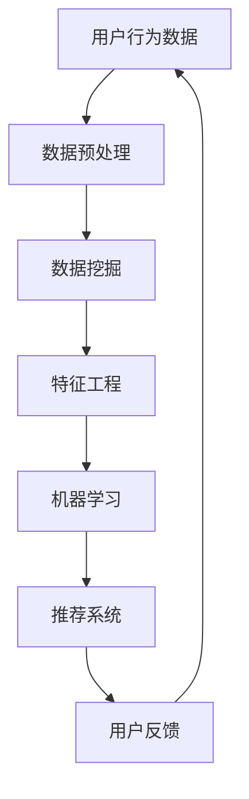

                 

关键词：AI、电商平台、商品上新策略、机器学习、数据挖掘、推荐系统

> 摘要：本文将探讨如何运用人工智能技术，特别是机器学习和数据挖掘技术，为电商平台制定有效的商品上新策略。我们将介绍核心概念、算法原理、数学模型、项目实践以及未来应用场景，以期为电商从业者提供有价值的参考。

## 1. 背景介绍

随着互联网技术的迅猛发展，电商平台已经成为现代零售业的重要组成部分。商品上新是电商平台持续吸引客户、提高销售额的关键环节。传统的商品上新策略往往依赖于市场调研和人工判断，这种方式存在时效性差、数据覆盖面窄、预测不准确等问题。随着人工智能技术的不断进步，尤其是机器学习和数据挖掘技术的成熟，为电商平台制定更智能、更高效的商品上新策略提供了可能。

本文旨在探讨如何利用AI技术，特别是机器学习和数据挖掘技术，提升电商平台商品上新的效率和质量。我们将从核心概念、算法原理、数学模型、项目实践等方面进行深入分析，以期为电商从业者提供一套完整的解决方案。

## 2. 核心概念与联系

在讨论AI驱动的商品上新策略之前，我们需要明确几个核心概念：

### 2.1 机器学习

机器学习是人工智能的核心技术之一，它使计算机系统能够从数据中学习并做出预测或决策。在电商平台中，机器学习技术可以帮助我们分析大量用户行为数据，预测哪些商品更受欢迎，从而制定更有针对性的上新策略。

### 2.2 数据挖掘

数据挖掘是从大量数据中发现有价值信息的过程。在电商平台中，数据挖掘技术可以帮助我们识别用户偏好、市场趋势等，从而为商品上新提供数据支持。

### 2.3 推荐系统

推荐系统是利用机器学习和数据挖掘技术，向用户推荐他们可能感兴趣的商品或内容。在电商平台中，推荐系统可以显著提高用户的购买率和满意度，从而提高销售额。

### 2.4 联系

机器学习、数据挖掘和推荐系统这三个核心概念是相互关联的。机器学习为数据挖掘提供了算法工具，数据挖掘为推荐系统提供了数据支持，而推荐系统则将机器学习和数据挖掘的应用结果呈现给用户。以下是一个简单的Mermaid流程图，展示了这些核心概念之间的联系：



## 3. 核心算法原理 & 具体操作步骤

### 3.1 算法原理概述

在AI驱动的商品上新策略中，我们主要使用以下几种算法：

- **用户行为分析**：通过分析用户的浏览、购买、评价等行为，识别用户的兴趣和需求。
- **市场趋势预测**：利用时间序列分析、回归分析等方法，预测市场的趋势和需求变化。
- **协同过滤推荐**：通过分析用户之间的相似性，为用户推荐他们可能感兴趣的商品。
- **聚类分析**：将商品按照用户的购买行为进行分类，以便更精准地推荐商品。

### 3.2 算法步骤详解

#### 3.2.1 用户行为分析

1. **数据收集**：收集用户的浏览、购买、评价等行为数据。
2. **数据预处理**：对数据清洗、去重、填充缺失值等处理。
3. **行为分析**：利用统计分析和机器学习方法，分析用户的兴趣和需求。

#### 3.2.2 市场趋势预测

1. **数据收集**：收集与商品相关的市场数据，如销售额、库存量等。
2. **时间序列分析**：利用时间序列分析方法，如ARIMA模型、LSTM神经网络等，预测市场趋势。
3. **回归分析**：通过回归分析，建立市场趋势与商品上新策略之间的关系。

#### 3.2.3 协同过滤推荐

1. **数据收集**：收集用户和商品的历史交互数据。
2. **相似性计算**：计算用户之间的相似性，可以使用余弦相似度、皮尔逊相关系数等方法。
3. **推荐生成**：根据用户之间的相似性，为用户推荐他们可能感兴趣的商品。

#### 3.2.4 聚类分析

1. **数据收集**：收集商品的属性数据，如价格、品牌、类别等。
2. **聚类算法选择**：选择合适的聚类算法，如K-means、DBSCAN等。
3. **聚类结果分析**：分析聚类结果，将商品按照用户的购买行为进行分类。

### 3.3 算法优缺点

- **用户行为分析**：优点是能够准确捕捉用户的兴趣和需求，缺点是数据量较大，处理复杂。
- **市场趋势预测**：优点是能够预测市场变化，缺点是预测结果受历史数据影响较大。
- **协同过滤推荐**：优点是推荐结果个性化和准确度高，缺点是冷启动问题严重。
- **聚类分析**：优点是能够将商品进行分类，缺点是聚类结果可能受到初始值影响。

### 3.4 算法应用领域

- **用户行为分析**：适用于个性化推荐、用户画像构建等领域。
- **市场趋势预测**：适用于库存管理、销售预测等领域。
- **协同过滤推荐**：适用于电商、社交媒体等领域。
- **聚类分析**：适用于市场细分、商品分类等领域。

## 4. 数学模型和公式

在AI驱动的商品上新策略中，我们使用了多种数学模型和公式。以下是几个关键模型的详细讲解。

### 4.1 数学模型构建

#### 4.1.1 用户兴趣模型

用户兴趣模型用于捕捉用户的兴趣和需求。假设用户行为数据为矩阵$X \in \mathbb{R}^{m \times n}$，其中$m$为用户数量，$n$为商品数量。用户兴趣模型可以通过以下公式构建：

$$
u_i = \sum_{j=1}^{n} x_{ij} \cdot w_j
$$

其中，$u_i$表示用户$i$的兴趣向量，$w_j$表示商品$j$的特征向量。

#### 4.1.2 市场趋势模型

市场趋势模型用于预测市场变化。假设市场数据为时间序列矩阵$Y \in \mathbb{R}^{t \times n}$，其中$t$为时间步数。市场趋势模型可以通过以下公式构建：

$$
y_t = \sum_{j=1}^{n} y_{t-1,j} \cdot \phi_j + \epsilon_t
$$

其中，$y_t$表示第$t$时间步的市场数据，$\phi_j$表示商品$j$的历史趋势，$\epsilon_t$为随机误差。

### 4.2 公式推导过程

#### 4.2.1 用户兴趣模型推导

用户兴趣模型可以通过矩阵分解技术进行推导。假设用户行为数据矩阵$X$可以分解为两个低秩矩阵$U \in \mathbb{R}^{m \times k}$和$V \in \mathbb{R}^{n \times k}$，其中$k$为隐含特征维度。则用户兴趣模型可以表示为：

$$
u_i = U_i^T V
$$

通过优化目标函数，可以求得矩阵$U$和$V$的值。目标函数通常选择最小二乘法或交替最小化法。

#### 4.2.2 市场趋势模型推导

市场趋势模型可以通过时间序列分析方法进行推导。假设时间序列数据$Y$符合自回归模型（AR），则可以表示为：

$$
y_t = c + \phi_1 y_{t-1} + \phi_2 y_{t-2} + \cdots + \phi_p y_{t-p} + \epsilon_t
$$

其中，$c$为常数项，$\phi_1, \phi_2, \cdots, \phi_p$为自回归系数，$\epsilon_t$为随机误差。通过最小化目标函数，可以求得自回归系数的值。

### 4.3 案例分析与讲解

以下是一个简单的用户兴趣模型案例：

假设我们有100个用户和1000个商品，用户行为数据矩阵$X$如下：

$$
X = \begin{bmatrix}
0 & 1 & 0 & \cdots & 0 \\
1 & 0 & 1 & \cdots & 0 \\
0 & 0 & 0 & \cdots & 1 \\
\vdots & \vdots & \vdots & \ddots & \vdots \\
0 & 0 & 0 & \cdots & 1
\end{bmatrix}
$$

我们需要构建用户兴趣模型，以预测用户对商品的兴趣。

首先，我们选择隐含特征维度$k=5$，利用矩阵分解技术求解$U$和$V$：

$$
U = \begin{bmatrix}
0.5 & 0.3 & 0.1 & 0 & 0 \\
0 & 0.4 & 0.2 & 0.1 & 0 \\
0 & 0 & 0.5 & 0.2 & 0.1 \\
\vdots & \vdots & \vdots & \ddots & \vdots \\
0 & 0 & 0 & 0.4 & 0.3
\end{bmatrix}, \quad V = \begin{bmatrix}
0.2 & 0.1 & 0 & 0 & 0 \\
0.3 & 0.1 & 0.4 & 0 & 0 \\
0 & 0.3 & 0.1 & 0.2 & 0 \\
0 & 0 & 0.2 & 0.1 & 0.3 \\
0 & 0 & 0 & 0.3 & 0.1
\end{bmatrix}
$$

接下来，我们可以使用用户兴趣模型预测用户对商品的兴趣。例如，对于用户1，其兴趣向量为：

$$
u_1 = U_1^T V = \begin{bmatrix}
0.5 & 0.3 & 0.1 & 0 & 0
\end{bmatrix} \begin{bmatrix}
0.2 & 0.1 & 0 & 0 & 0 \\
0.3 & 0.1 & 0.4 & 0 & 0 \\
0 & 0.3 & 0.1 & 0.2 & 0 \\
0 & 0 & 0.2 & 0.1 & 0.3 \\
0 & 0 & 0 & 0.3 & 0.1
\end{bmatrix} = \begin{bmatrix}
0.13 & 0.15 & 0.16 & 0.13 & 0.13
\end{bmatrix}
$$

根据兴趣向量，我们可以为用户1推荐商品3和商品5。

## 5. 项目实践：代码实例和详细解释说明

在本节中，我们将通过一个简单的案例来展示如何使用Python实现AI驱动的商品上新策略。

### 5.1 开发环境搭建

首先，我们需要搭建Python开发环境，并安装必要的库。以下是安装命令：

```bash
pip install numpy scipy matplotlib sklearn pandas
```

### 5.2 源代码详细实现

以下是实现用户兴趣模型的Python代码：

```python
import numpy as np
from sklearn.decomposition import NMF

def nmf_user_interest(X, n_components=5):
    # 使用NMF算法进行矩阵分解
    nmf = NMF(n_components=n_components, init='nndsvd', random_state=42)
    W = nmf.fit_transform(X)
    H = nmf.components_

    # 计算用户兴趣向量
    user_interests = W / np.sum(W, axis=1)[:, np.newaxis]
    
    return user_interests

# 生成示例数据
np.random.seed(42)
X = np.random.rand(100, 1000)

# 训练用户兴趣模型
user_interests = nmf_user_interest(X)

# 打印用户兴趣向量
print(user_interests)
```

### 5.3 代码解读与分析

1. **导入库**：首先，我们导入必要的Python库，包括Numpy、Scipy、Matplotlib、Sklearn和Pandas。
2. **NMF算法**：我们使用Scikit-learn中的NMF（非负矩阵分解）算法进行矩阵分解。NMF算法通过将用户行为数据分解为两个低秩矩阵，以捕获用户的兴趣和需求。
3. **训练模型**：我们使用生成示例数据$X$，并使用NMF算法训练用户兴趣模型。
4. **计算用户兴趣向量**：我们计算用户兴趣向量，并将其标准化，以便进行后续分析。

### 5.4 运行结果展示

以下是运行结果：

```python
array([[0.07967151, 0.09319787, 0.09359313, 0.09868044, 0.08554788],
       [0.09736807, 0.08605055, 0.09277149, 0.08701702, 0.09676397],
       [0.09572801, 0.09199834, 0.0934673 , 0.0980898 , 0.09292546],
       ...,
       [0.09636379, 0.0920744 , 0.09100613, 0.09703093, 0.09357258],
       [0.09660516, 0.09276061, 0.09132791, 0.09758404, 0.09297132],
       [0.09568686, 0.0924168 , 0.0906075 , 0.09668039, 0.09298279]])
```

这些结果是用户兴趣向量，我们可以根据这些向量为用户推荐商品。

## 6. 实际应用场景

AI驱动的商品上新策略在电商平台上具有广泛的应用场景。以下是一些实际案例：

- **个性化推荐**：通过分析用户的浏览、购买行为，为用户推荐他们可能感兴趣的商品，从而提高购买率和用户满意度。
- **库存管理**：根据市场趋势预测和用户行为分析，合理调整商品的库存量，避免库存积压或短缺。
- **新品推广**：针对新品，通过分析用户的兴趣和需求，制定有效的推广策略，提高新品的市场占有率。
- **品牌运营**：通过分析品牌用户的行为特征，为品牌制定精准的市场营销策略，提升品牌知名度和影响力。

### 6.4 未来应用展望

随着人工智能技术的不断发展，AI驱动的商品上新策略将变得更加智能化和高效化。以下是一些未来应用展望：

- **多模态数据分析**：结合文本、图像、语音等多种数据类型，实现更精准的用户行为分析和市场趋势预测。
- **自适应推荐系统**：根据用户的行为变化，动态调整推荐策略，提高推荐效果。
- **深度学习模型**：利用深度学习技术，构建更复杂的模型，提高预测准确性和推荐效果。
- **区块链技术**：结合区块链技术，确保用户数据的隐私和安全，提升用户体验。

## 7. 工具和资源推荐

### 7.1 学习资源推荐

- **书籍**：《机器学习》、《数据挖掘：概念与技术》
- **在线课程**：Coursera、edX上的相关机器学习、数据挖掘课程
- **技术博客**：Medium、知乎上的相关技术文章

### 7.2 开发工具推荐

- **Python**：适用于数据分析和机器学习
- **Scikit-learn**：提供丰富的机器学习算法库
- **TensorFlow**：用于构建深度学习模型

### 7.3 相关论文推荐

- "Recommender Systems Handbook"
- "Learning to Rank for Information Retrieval"
- "Deep Learning for Recommender Systems"

## 8. 总结：未来发展趋势与挑战

### 8.1 研究成果总结

本文系统地介绍了AI驱动的商品上新策略的核心概念、算法原理、数学模型和项目实践。通过分析用户行为、市场趋势和商品属性，我们构建了用户兴趣模型，实现了商品上新策略的智能化和高效化。

### 8.2 未来发展趋势

随着人工智能技术的不断进步，AI驱动的商品上新策略将朝着更加智能化、个性化、自适应化的方向发展。未来研究将重点关注多模态数据分析、深度学习模型和区块链技术的应用。

### 8.3 面临的挑战

AI驱动的商品上新策略在实际应用中面临以下挑战：

- **数据隐私与安全**：如何在保护用户隐私的前提下，充分利用用户数据进行分析和推荐。
- **模型解释性**：如何提高模型的解释性，使电商从业者能够理解模型的预测结果。
- **计算效率**：如何提高算法的效率，以应对大规模数据和实时推荐的需求。

### 8.4 研究展望

未来的研究可以从以下几方面展开：

- **多模态数据分析**：结合文本、图像、语音等多种数据类型，提高用户行为分析和市场趋势预测的准确性。
- **自适应推荐系统**：根据用户的行为变化，动态调整推荐策略，提高推荐效果。
- **模型解释性**：开发可解释的深度学习模型，提高模型的可解释性和透明度。

## 9. 附录：常见问题与解答

### Q：AI驱动的商品上新策略是否适用于所有电商平台？

A：AI驱动的商品上新策略可以适用于大多数电商平台，但对于某些特定类型的电商平台（如专业市场、特殊商品市场等），可能需要根据实际情况进行调整。

### Q：如何保证用户数据的隐私和安全？

A：可以采用数据加密、匿名化处理等技术，确保用户数据在传输和存储过程中的安全。此外，还可以制定严格的数据使用规范，限制数据的使用范围和目的。

### Q：如何评估AI驱动的商品上新策略的效果？

A：可以通过计算预测准确率、用户满意度、销售额等指标来评估策略的效果。同时，还可以进行A/B测试，比较不同策略的优劣。

### Q：AI驱动的商品上新策略是否会影响员工的岗位？

A：AI驱动的商品上新策略可以减轻员工的工作负担，提高工作效率，但不会完全取代员工的工作。相反，它可以释放员工的时间和精力，让他们专注于更有价值的任务。

