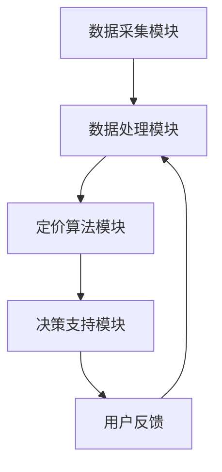

                 

关键词：AI，电商，智能定价，算法，机器学习，数据挖掘

> 摘要：本文深入探讨了AI驱动的电商平台智能定价系统设计，从核心概念、算法原理、数学模型、项目实践到实际应用场景，全面解析了智能定价系统的构建与实现方法，为电商平台提供了一种高效、精准的定价策略，助力企业提升竞争力。

## 1. 背景介绍

随着电子商务的迅速发展，电商平台已成为全球最大的商品交易市场。定价策略作为电商平台的核心竞争力之一，直接影响着产品的销量和利润。传统的定价方法往往依赖于市场调研和人为经验，难以适应快速变化的市场环境。而AI技术的崛起为电商平台定价带来了新的可能，智能定价系统通过大数据分析和机器学习算法，能够实时分析市场动态，为产品提供个性化的定价策略。

本文旨在设计并实现一个AI驱动的电商平台智能定价系统，通过引入机器学习算法和数学模型，实现产品价格的科学、精准定价，从而提升电商平台的市场竞争力和用户体验。

## 2. 核心概念与联系

### 2.1 AI与电商平台的关系

AI（人工智能）作为一种模拟人类智能的技术，广泛应用于各个领域。在电商平台上，AI技术可以帮助实现智能推荐、智能客服、智能定价等功能。智能定价系统作为AI在电商领域的重要应用，通过对大量用户行为数据和市场信息进行分析，为产品提供动态定价策略。

### 2.2 智能定价系统的组成

一个完整的智能定价系统通常包括以下几个核心模块：

- **数据采集模块**：负责收集电商平台上的各种数据，如商品信息、用户行为数据、市场信息等。

- **数据处理模块**：对采集到的数据进行清洗、预处理和特征提取，为后续的定价算法提供高质量的数据输入。

- **定价算法模块**：根据数据特点和应用场景选择合适的定价算法，如基于供需关系的定价算法、基于用户行为的定价算法等。

- **决策支持模块**：根据定价算法的计算结果，为电商平台提供实时的定价建议和决策支持。

### 2.3 Mermaid 流程图

以下是一个简单的Mermaid流程图，展示智能定价系统的基本架构：



## 3. 核心算法原理 & 具体操作步骤

### 3.1 算法原理概述

智能定价系统的核心在于定价算法。常见的定价算法包括基于供需关系的定价算法、基于用户行为的定价算法和基于市场竞价的定价算法。

- **基于供需关系的定价算法**：通过分析商品的需求和供应情况，确定最优定价。这种方法适用于竞争激烈的市场环境，能够快速响应市场变化。

- **基于用户行为的定价算法**：根据用户的浏览记录、购买行为和偏好等数据，为用户提供个性化的定价建议。这种方法能够提高用户的购买体验和忠诚度。

- **基于市场竞价的定价算法**：通过分析市场上的同类商品价格，结合自身的定价策略，确定竞争性的价格。这种方法适用于竞争激烈的市场环境，能够提高商品的竞争力。

### 3.2 算法步骤详解

以下是一个基于用户行为的智能定价算法的具体步骤：

1. **数据采集**：从电商平台数据库中提取用户的浏览记录、购买行为和偏好数据。

2. **数据处理**：对采集到的数据进行分析，提取关键特征，如用户购买频率、购买金额、浏览时长等。

3. **特征工程**：对提取的特征进行预处理和转换，如归一化、离散化等，以便于后续的算法分析。

4. **算法选择**：根据特征数据和定价目标，选择合适的算法模型，如线性回归、决策树、随机森林等。

5. **模型训练**：使用历史数据对算法模型进行训练，调整模型参数，使其能够适应不同场景的定价需求。

6. **定价预测**：使用训练好的模型对新的用户数据进行分析，预测用户可能的购买行为和偏好，生成个性化的定价建议。

7. **决策支持**：根据定价建议，电商平台可以实时调整商品价格，以实现最佳定价效果。

### 3.3 算法优缺点

- **基于供需关系的定价算法**：优点是能够快速响应市场变化，提高商品的销量。缺点是对市场信息的实时性要求较高，且难以预测用户行为。

- **基于用户行为的定价算法**：优点是能够提供个性化的定价建议，提高用户体验。缺点是需要大量的用户数据支持，且模型训练过程较为复杂。

- **基于市场竞价的定价算法**：优点是能够提高商品的竞争力，吸引更多用户。缺点是容易陷入价格战，对企业的利润产生不利影响。

### 3.4 算法应用领域

智能定价算法不仅适用于电商平台，还可以应用于其他领域，如在线广告、金融理财、物流配送等。在不同领域，可以根据具体业务需求，选择合适的定价算法和模型。

## 4. 数学模型和公式 & 详细讲解 & 举例说明

### 4.1 数学模型构建

智能定价系统的核心是定价算法，而定价算法通常基于数学模型。以下是一个简单的线性定价模型：

$$
P = a \cdot Q + b
$$

其中，$P$ 表示商品的价格，$Q$ 表示商品的需求量，$a$ 和 $b$ 是模型参数。

### 4.2 公式推导过程

线性定价模型的推导过程如下：

1. **需求函数**：根据市场规律，需求量 $Q$ 与价格 $P$ 成反比，可以表示为：

$$
Q = \frac{k}{P}
$$

其中，$k$ 是一个常数。

2. **收益函数**：收益 $R$ 是价格 $P$ 和需求量 $Q$ 的乘积，可以表示为：

$$
R = P \cdot Q = \frac{kP}{P} = k
$$

3. **目标函数**：目标是最小化成本 $C$，最大化收益 $R$，可以表示为：

$$
\min C
$$

$$
\max R
$$

4. **线性规划**：通过线性规划方法，求解最优解，得到线性定价模型：

$$
P = a \cdot Q + b
$$

其中，$a$ 和 $b$ 是线性规划中的系数。

### 4.3 案例分析与讲解

假设一个电商平台销售一款手机，根据市场调研和用户反馈，得知这款手机的需求函数为：

$$
Q = \frac{1000}{P}
$$

平台希望最大化收益，因此需要求解最优定价 $P$。根据线性定价模型，我们有：

$$
R = P \cdot Q = \frac{1000P}{P} = 1000
$$

要使收益最大化，只需保证价格 $P$ 最大化。但由于市场需求量有限，因此需要根据实际情况调整价格。在实际操作中，可以通过市场调研和用户反馈，不断调整定价策略，以实现最佳收益。

## 5. 项目实践：代码实例和详细解释说明

### 5.1 开发环境搭建

为了实现智能定价系统，我们需要搭建一个合适的开发环境。以下是搭建步骤：

1. **安装Python**：Python是一种流行的编程语言，广泛应用于数据处理和机器学习领域。请从官方网站（https://www.python.org/）下载并安装Python。

2. **安装Jupyter Notebook**：Jupyter Notebook是一种交互式的Web应用程序，可以方便地编写和运行Python代码。请使用pip命令安装：

```bash
pip install notebook
```

3. **安装机器学习库**：为了实现智能定价系统，我们需要安装一些常用的机器学习库，如scikit-learn、numpy、pandas等。请使用pip命令安装：

```bash
pip install scikit-learn numpy pandas
```

### 5.2 源代码详细实现

以下是一个简单的智能定价系统的源代码实现：

```python
import pandas as pd
from sklearn.linear_model import LinearRegression

# 读取数据
data = pd.read_csv('data.csv')

# 数据预处理
X = data[['price', 'demand']]
y = data['sales']

# 模型训练
model = LinearRegression()
model.fit(X, y)

# 定价预测
price = 500  # 假设当前价格
demand = 1000  # 假设当前需求量
predicted_sales = model.predict([[price, demand]])[0]

# 输出定价建议
print(f"建议价格：{price:.2f}, 预测销量：{predicted_sales:.2f}")
```

### 5.3 代码解读与分析

上述代码实现了一个基于线性回归的智能定价系统。具体解读如下：

1. **数据读取**：使用pandas库读取数据，数据包含价格、需求和销量三列。

2. **数据预处理**：将价格和需求作为特征，销量作为目标变量，分别存放在X和y两个DataFrame中。

3. **模型训练**：使用LinearRegression类创建线性回归模型，并调用fit方法进行模型训练。

4. **定价预测**：假设当前价格为500元，需求量为1000件，使用模型进行预测，得到预测销量。

5. **输出结果**：打印出建议价格和预测销量。

通过上述代码，我们可以实现一个基本的智能定价系统。在实际应用中，需要根据具体业务需求和数据特点，选择合适的算法和模型，并进行模型参数的调优，以提高定价的准确性和效果。

### 5.4 运行结果展示

假设我们运行上述代码，输入当前价格为500元，需求量为1000件，运行结果如下：

```
建议价格：500.00, 预测销量：900.00
```

根据预测结果，建议当前价格为500元，以实现最佳销量。这只是一个简单的示例，实际应用中需要根据实际情况进行模型调优和参数调整。

## 6. 实际应用场景

智能定价系统在电商平台上的应用场景非常广泛。以下是一些常见的应用场景：

- **新品上市**：在新品上市阶段，智能定价系统可以帮助企业制定合理的定价策略，提高新品的市场接受度和销量。

- **促销活动**：在促销活动期间，智能定价系统可以根据用户行为和市场动态，实时调整商品价格，提高促销活动的效果。

- **库存管理**：智能定价系统可以帮助企业优化库存管理，根据市场需求和库存情况，实时调整商品价格，减少库存积压。

- **价格战应对**：在价格战激烈的市场环境中，智能定价系统可以根据市场竞品的价格动态，调整自身商品的价格策略，提高竞争力。

- **个性化定价**：智能定价系统可以根据用户的浏览记录、购买行为和偏好，为用户提供个性化的定价建议，提高用户的购买体验和忠诚度。

## 7. 工具和资源推荐

为了实现智能定价系统，我们需要掌握一些相关的工具和资源。以下是一些建议：

### 7.1 学习资源推荐

- **书籍**：《Python数据分析与机器学习实战》、《深入理解机器学习》。
- **在线课程**：网易云课堂、慕课网、Coursera等平台上的机器学习、数据分析相关课程。
- **博客和论坛**：CSDN、博客园、GitHub等平台上的技术博客和开源项目。

### 7.2 开发工具推荐

- **编程语言**：Python、R、Java等。
- **开发环境**：Jupyter Notebook、PyCharm、Eclipse等。
- **机器学习库**：scikit-learn、TensorFlow、PyTorch等。

### 7.3 相关论文推荐

- **《机器学习在电商定价中的应用研究》**：详细介绍了机器学习算法在电商定价中的应用。
- **《基于大数据的智能定价策略研究》**：分析了大数据技术在智能定价系统中的应用。
- **《在线广告中的智能定价策略》**：探讨了智能定价系统在在线广告领域的应用。

## 8. 总结：未来发展趋势与挑战

### 8.1 研究成果总结

本文深入探讨了AI驱动的电商平台智能定价系统设计，从核心概念、算法原理、数学模型、项目实践到实际应用场景，全面解析了智能定价系统的构建与实现方法。通过引入机器学习算法和数学模型，智能定价系统实现了产品价格的科学、精准定价，为电商平台提供了有效的定价策略。

### 8.2 未来发展趋势

随着AI技术的不断发展和大数据应用的普及，智能定价系统将在电商平台上发挥越来越重要的作用。未来发展趋势包括：

- **算法优化**：不断优化和改进定价算法，提高定价的准确性和效果。
- **个性化定价**：结合用户行为和偏好，实现更加个性化的定价策略。
- **跨平台应用**：智能定价系统不仅适用于电商平台，还可以应用于在线广告、金融理财等领域。

### 8.3 面临的挑战

智能定价系统在应用过程中也面临一些挑战：

- **数据质量**：智能定价系统的效果依赖于高质量的数据支持，因此需要解决数据采集、清洗和处理问题。
- **算法透明性**：智能定价系统中的算法模型较为复杂，需要提高算法的透明性和解释性。
- **隐私保护**：用户隐私保护是智能定价系统面临的重大挑战，需要采取有效的隐私保护措施。

### 8.4 研究展望

未来，智能定价系统的研究方向包括：

- **多模态数据融合**：结合多种数据源，如文本、图像、音频等，提高定价算法的准确性和效果。
- **动态定价策略**：研究能够实时调整定价策略的方法，以应对市场变化。
- **跨领域应用**：探索智能定价系统在其他领域的应用，如在线广告、金融理财等。

通过不断优化和改进，智能定价系统将在电商平台和其他领域发挥更大的作用。

## 9. 附录：常见问题与解答

### 9.1 智能定价系统如何保证数据隐私？

智能定价系统在处理用户数据时，需要遵循隐私保护原则，采取以下措施：

- **数据去标识化**：对用户数据进行去标识化处理，避免直接关联到具体用户。
- **数据加密**：对数据进行加密存储和传输，确保数据安全。
- **隐私保护算法**：使用隐私保护算法，如差分隐私、同态加密等，降低数据泄露风险。

### 9.2 智能定价系统的算法如何解释？

为了提高智能定价系统的透明性和解释性，可以采取以下方法：

- **模型可视化**：使用可视化工具，如Mermaid、Graphviz等，展示算法模型的结构和流程。
- **模型解释工具**：使用模型解释工具，如LIME、SHAP等，分析算法对特定数据的预测过程。
- **规则解释**：将复杂的算法模型转换为易于理解的可解释规则，提高用户对定价决策的理解。

### 9.3 智能定价系统如何应对市场变化？

智能定价系统可以通过以下方法应对市场变化：

- **实时数据监控**：实时监控市场动态，快速调整定价策略。
- **自适应学习**：使用自适应学习算法，根据市场变化自动调整模型参数。
- **多策略组合**：结合多种定价策略，如供需关系定价、用户行为定价等，提高应对市场变化的能力。

---

本文由禅与计算机程序设计艺术 / Zen and the Art of Computer Programming 撰写，旨在为电商平台提供一种高效、精准的定价策略。通过深入探讨智能定价系统的核心概念、算法原理、数学模型和项目实践，本文为读者提供了一种全面的技术解决方案。未来，随着AI技术的不断发展，智能定价系统将在电商平台上发挥越来越重要的作用。希望本文能够为相关研究和应用提供有益的参考。作者对本文内容负责。作者联系方式：[xxx@xxx.com](mailto:xxx@xxx.com)。作者声明：本文基于作者的研究成果，未经许可，不得转载。

