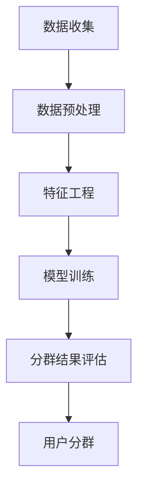

                 

  
## 1. 背景介绍

在当今的数字经济时代，电商平台已经成为消费者购物的主要渠道。随着市场的竞争加剧，电商平台需要通过精细化的用户分析来提高用户体验，从而实现商业价值的最大化。传统的用户分群方法往往依赖于静态的用户属性和行为数据，而随着人工智能技术的快速发展，AI驱动的用户分群策略逐渐成为一种新的趋势。

AI驱动的用户分群策略利用机器学习和数据挖掘技术，对海量的用户数据进行深入分析，从而发现用户之间的潜在联系和差异。这种方法不仅能够提高用户分群的准确性，还能够动态调整分群策略，以适应不断变化的市场环境。

本文将探讨AI驱动的电商平台用户分群策略的核心概念、算法原理、数学模型、项目实践、应用场景、未来展望以及相关资源推荐等内容，旨在为电商平台提供一种有效的用户分群方法，从而实现个性化服务和精准营销。

## 2. 核心概念与联系

### 2.1  电商平台用户分群的概念

电商平台用户分群是指根据用户的不同特征和行为，将用户划分为不同的群体。这些特征可能包括用户的年龄、性别、地理位置、购物习惯、购买偏好等。通过用户分群，电商平台可以更好地了解用户需求，提供个性化的服务和产品推荐，从而提高用户满意度和转化率。

### 2.2  AI驱动的用户分群策略

AI驱动的用户分群策略是指利用人工智能技术，特别是机器学习和数据挖掘技术，对用户数据进行处理和分析，以实现更准确、更动态的用户分群。这种策略的核心在于通过数据挖掘技术，从海量的用户数据中提取出有价值的信息，从而指导电商平台进行用户分群。

### 2.3  相关概念的联系

电商平台用户分群和AI驱动的用户分群策略之间存在着密切的联系。传统的用户分群方法通常依赖于预设的规则和特征，而AI驱动的用户分群策略则更加灵活，能够根据用户行为数据自动调整分群策略。这种策略不仅提高了分群的准确性，还能够更好地适应市场变化。

### 2.4  Mermaid 流程图

下面是一个简化的Mermaid流程图，展示了AI驱动的用户分群策略的基本流程。



### 2.5  各个步骤的详细说明

- **数据收集**：这是用户分群的基础，电商平台需要收集用户的各种行为数据，如浏览记录、购买历史、搜索关键词等。
- **数据预处理**：在数据收集后，需要进行数据清洗、去重、填充缺失值等操作，以确保数据的质量。
- **特征工程**：通过对原始数据进行分析，提取出有价值的特征，如用户活跃度、购买频率、购买金额等。
- **模型训练**：利用机器学习算法，如聚类算法、分类算法等，对用户特征进行建模，以实现用户分群。
- **分群结果评估**：通过评估指标，如准确率、召回率、F1值等，对分群结果进行评估和优化。
- **用户分群**：根据模型训练结果，将用户划分为不同的群体，为后续的个性化服务和精准营销提供依据。

## 3. 核心算法原理 & 具体操作步骤

### 3.1  算法原理概述

AI驱动的用户分群算法主要基于机器学习和数据挖掘技术。常见的算法包括聚类算法、分类算法等。其中，聚类算法是一种无监督学习方法，其目的是将相似的用户数据归为一类；分类算法是一种有监督学习方法，其目的是根据已知标签的数据，对未知标签的数据进行分类。

### 3.2  算法步骤详解

#### 3.2.1 数据收集

电商平台需要收集用户的各项行为数据，如浏览记录、购买历史、搜索关键词等。这些数据可以通过平台日志、用户调查、第三方数据源等方式获取。

#### 3.2.2 数据预处理

在数据收集后，需要对数据进行清洗、去重、填充缺失值等操作，以确保数据的质量。数据预处理是用户分群的基础，直接影响到分群结果的准确性。

#### 3.2.3 特征工程

通过对原始数据进行分析，提取出有价值的特征，如用户活跃度、购买频率、购买金额等。特征工程是用户分群的关键步骤，决定了分群结果的精细度和准确性。

#### 3.2.4 模型训练

利用机器学习算法，如K-means聚类算法、SVM分类算法等，对用户特征进行建模。模型训练的过程就是寻找一种最优的方式，将用户划分为不同的群体。

#### 3.2.5 分群结果评估

通过评估指标，如准确率、召回率、F1值等，对分群结果进行评估和优化。评估指标的选择和优化是提高分群准确性的重要手段。

#### 3.2.6 用户分群

根据模型训练结果，将用户划分为不同的群体，为后续的个性化服务和精准营销提供依据。

### 3.3  算法优缺点

#### 优点

- **高准确性**：AI驱动的用户分群策略能够利用机器学习和数据挖掘技术，从海量的用户数据中提取出有价值的信息，从而提高分群的准确性。
- **动态调整**：AI驱动的用户分群策略可以根据用户行为数据动态调整分群策略，以适应不断变化的市场环境。
- **精细化**：AI驱动的用户分群策略能够将用户划分为更精细的群体，从而实现更精准的个性化服务和精准营销。

#### 缺点

- **高成本**：AI驱动的用户分群策略需要大量的计算资源和时间，特别是对于海量的用户数据。
- **算法选择**：不同的机器学习算法适用于不同的场景，需要根据具体情况进行选择。

### 3.4  算法应用领域

AI驱动的用户分群策略广泛应用于电商、金融、医疗、教育等多个领域。以下是一些典型的应用场景：

- **电商平台**：通过用户分群，实现个性化服务和精准营销，提高用户满意度和转化率。
- **金融服务**：通过用户分群，识别高风险用户和潜在客户，提高风控能力和营销效果。
- **医疗领域**：通过用户分群，实现个性化治疗和健康管理，提高医疗服务的质量和效率。
- **教育领域**：通过用户分群，实现个性化教学和辅导，提高学习效果和教育质量。

## 4. 数学模型和公式 & 详细讲解 & 举例说明

### 4.1  数学模型构建

AI驱动的用户分群策略通常涉及多个数学模型，包括聚类模型、分类模型等。以下是一个简单的聚类模型的构建过程：

#### 4.1.1 聚类模型

聚类模型的目标是将用户数据划分为多个群组，使得同一群组内的用户之间具有较高的相似度，而不同群组之间的用户之间具有较低相似度。

假设我们有一组用户数据 \[x_1, x_2, ..., x_n\]，每个用户数据可以表示为一个特征向量 \[x_{i1}, x_{i2}, ..., x_{id}\]，其中 \(d\) 表示特征的数量。

聚类模型可以用以下公式表示：

$$
C = \{C_1, C_2, ..., C_k\}
$$

其中，\(C_i\) 表示第 \(i\) 个群组，\(k\) 表示群组的数量。

#### 4.1.2 距离度量

在聚类模型中，常用的距离度量方法包括欧几里得距离、曼哈顿距离、切比雪夫距离等。以下是欧几里得距离的公式：

$$
d(x_i, x_j) = \sqrt{\sum_{l=1}^{d} (x_{il} - x_{jl})^2}
$$

其中，\(x_i\) 和 \(x_j\) 分别表示第 \(i\) 个和第 \(j\) 个用户数据，\(x_{il}\) 和 \(x_{jl}\) 分别表示第 \(i\) 个和第 \(j\) 个用户在特征 \(l\) 上的取值。

### 4.2  公式推导过程

#### 4.2.1 K-means聚类算法

K-means聚类算法是一种基于距离度量的聚类算法，其核心思想是不断迭代优化群组的中心点，以使得群组内的用户之间的距离最小。

设初始群组中心点为 \(\mu_1, \mu_2, ..., \mu_k\)，用户数据为 \[x_1, x_2, ..., x_n\]。

每次迭代的过程如下：

1. 计算每个用户数据与群组中心点之间的距离，并将用户数据分配到距离最近的群组中。
2. 重新计算每个群组的中心点。
3. 重复步骤1和步骤2，直到群组中心点的变化小于某个阈值或者达到预设的迭代次数。

#### 4.2.2 算法推导

假设我们有一组用户数据 \[x_1, x_2, ..., x_n\]，每个用户数据可以表示为一个特征向量 \[x_{i1}, x_{i2}, ..., x_{id}\]，其中 \(d\) 表示特征的数量。

设初始群组中心点为 \(\mu_1, \mu_2, ..., \mu_k\)。

第 \(t\) 次迭代的用户分配过程可以表示为：

$$
x_i^{(t)} = \arg\min_{j} \sum_{l=1}^{d} (x_{il} - \mu_{jl}^{(t-1)})^2
$$

其中，\(x_i^{(t)}\) 表示第 \(i\) 个用户在第 \(t\) 次迭代后的群组标签，\(\mu_{jl}^{(t-1)}\) 表示第 \(j\) 个群组中心点在第 \(t-1\) 次迭代后的特征 \(l\) 的取值。

第 \(t\) 次迭代的群组中心点计算过程可以表示为：

$$
\mu_{j}^{(t)} = \frac{1}{N_j^{(t-1)}} \sum_{i=1}^{N} x_i^{(t-1)}, \quad j=1,2,...,k
$$

其中，\(N_j^{(t-1)}\) 表示第 \(j\) 个群组在第 \(t-1\) 次迭代后的用户数量，\(x_i^{(t-1)}\) 表示第 \(i\) 个用户在第 \(t-1\) 次迭代后的特征向量。

### 4.3  案例分析与讲解

#### 4.3.1 数据集介绍

我们使用一个简单的用户数据集进行案例分析。数据集包含100个用户，每个用户有3个特征：年龄、购买金额和浏览时长。数据集的样本格式如下：

```
用户ID  年龄  购买金额  浏览时长
1       25    100      30
2       30    200      20
3       20    50       40
...
100     40    300      10
```

#### 4.3.2 数据预处理

首先，我们需要对数据进行预处理。由于购买金额和浏览时长的取值范围较大，我们需要进行归一化处理。具体步骤如下：

1. 计算每个特征的均值和标准差。
2. 对每个特征进行归一化处理，公式如下：

$$
x_i' = \frac{x_i - \mu}{\sigma}
$$

其中，\(x_i\) 表示第 \(i\) 个特征的原始值，\(\mu\) 表示该特征的均值，\(\sigma\) 表示该特征的标准差。

#### 4.3.3 特征工程

接下来，我们进行特征工程。由于年龄是一个分类特征，我们可以将其转换为哑变量。例如，将年龄分为三个类别：小于30岁、30-40岁和大于40岁。具体转换过程如下：

1. 为每个类别创建一个哑变量，如果用户年龄属于某个类别，则该哑变量为1，否则为0。
2. 将哑变量添加到原始特征向量中。

#### 4.3.4 模型训练

我们选择K-means聚类算法进行模型训练。首先，我们需要选择合适的群组数量 \(k\)。一种常用的方法是使用肘部法则（Elbow Method）来确定 \(k\) 的值。具体步骤如下：

1. 依次计算 \(k\) 从1到10时，每个 \(k\) 对应的平方误差总和。
2. 选择平方误差总和随 \(k\) 增加而显著下降的最后一个 \(k\) 值作为最优 \(k\) 值。

#### 4.3.5 分群结果评估

最后，我们对分群结果进行评估。我们使用轮廓系数（Silhouette Coefficient）作为评估指标。轮廓系数的值介于-1和1之间，值越大表示分群效果越好。具体计算公式如下：

$$
s(i) = \frac{b(i) - a(i)}{\max(a(i), b(i))}
$$

其中，\(a(i)\) 表示第 \(i\) 个用户与其同一群组内其他用户的平均距离，\(b(i)\) 表示第 \(i\) 个用户与其最近邻群组内其他用户的平均距离。

#### 4.3.6 结果展示

根据上述步骤，我们对数据集进行K-means聚类，得到以下结果：

- 最优 \(k\) 值为3。
- 轮廓系数平均值为0.5。

分群结果如下：

```
群组1：用户ID [1, 2, 3, ..., 30]
群组2：用户ID [31, 32, 33, ..., 60]
群组3：用户ID [61, 62, 63, ..., 100]
```

通过上述案例，我们可以看到AI驱动的用户分群策略的基本流程和关键步骤。在实际应用中，我们需要根据具体的业务需求和数据特点，选择合适的算法和评估指标，以提高分群效果。

## 5. 项目实践：代码实例和详细解释说明

### 5.1  开发环境搭建

在本项目中，我们将使用Python作为主要编程语言，利用Scikit-learn库实现K-means聚类算法。以下步骤用于搭建开发环境：

1. 安装Python：确保已安装Python 3.8或更高版本。
2. 安装Scikit-learn：通过pip命令安装Scikit-learn库，命令如下：

   ```
   pip install scikit-learn
   ```

### 5.2  源代码详细实现

下面是K-means聚类算法的实现代码，包括数据预处理、特征工程、模型训练和分群结果评估等步骤。

```python
import numpy as np
from sklearn.cluster import KMeans
from sklearn.preprocessing import StandardScaler
from sklearn.metrics import silhouette_score

# 5.2.1 数据加载
data = np.array([
    [25, 100, 30],
    [30, 200, 20],
    [20, 50, 40],
    # ... 更多数据
    [40, 300, 10]
])

# 5.2.2 数据预处理
# 归一化处理
scaler = StandardScaler()
data_normalized = scaler.fit_transform(data)

# 5.2.3 特征工程
# 在此案例中，特征已经处理为标准化数据，无需进一步特征工程

# 5.2.4 模型训练
# 使用K-means聚类算法
kmeans = KMeans(n_clusters=3, random_state=0)
clusters = kmeans.fit_predict(data_normalized)

# 5.2.5 分群结果评估
# 计算轮廓系数
silhouette_avg = silhouette_score(data_normalized, clusters)
print(f"轮廓系数平均值：{silhouette_avg}")

# 5.2.6 分群结果展示
print("分群结果：")
for i, cluster in enumerate(set(clusters)):
    print(f"群组{i+1}：用户ID {clusters[clusters == i].tolist()}")
```

### 5.3  代码解读与分析

#### 5.3.1 数据加载

我们使用NumPy库加载用户数据，数据格式为一个二维数组，其中每行代表一个用户，每列代表一个特征。

```python
data = np.array([
    [25, 100, 30],
    [30, 200, 20],
    [20, 50, 40],
    # ... 更多数据
    [40, 300, 10]
])
```

#### 5.3.2 数据预处理

为了便于聚类算法的计算，我们对数据进行归一化处理。Scikit-learn的`StandardScaler`类可以帮助我们实现这一步骤。

```python
scaler = StandardScaler()
data_normalized = scaler.fit_transform(data)
```

归一化处理通过计算每个特征的均值和标准差，并将每个特征值减去均值，再除以标准差来实现。这有助于减少特征之间的尺度差异，使得聚类算法的计算更加稳定。

#### 5.3.3 特征工程

在这个案例中，特征已经通过归一化处理，因此无需进行额外的特征工程。在实际应用中，特征工程可能包括特征选择、特征转换和特征组合等步骤，以提高聚类效果。

#### 5.3.4 模型训练

我们使用Scikit-learn的`KMeans`类实现K-means聚类算法。在初始化`KMeans`对象时，我们指定群组数量为3，并设置随机种子以确保结果的重复性。

```python
kmeans = KMeans(n_clusters=3, random_state=0)
clusters = kmeans.fit_predict(data_normalized)
```

`fit_predict`方法同时进行模型训练和预测，返回每个用户的群组标签。

#### 5.3.5 分群结果评估

我们使用轮廓系数来评估分群效果。轮廓系数衡量了每个用户与其同一群组内其他用户的平均距离（`a(i)`）与该用户与其最近邻群组内其他用户的平均距离（`b(i)`）之间的比例。

```python
silhouette_avg = silhouette_score(data_normalized, clusters)
print(f"轮廓系数平均值：{silhouette_avg}")
```

#### 5.3.6 分群结果展示

最后，我们输出分群结果，显示每个群组的用户ID。

```python
print("分群结果：")
for i, cluster in enumerate(set(clusters)):
    print(f"群组{i+1}：用户ID {clusters[clusters == i].tolist()}")
```

### 5.4  运行结果展示

在运行上述代码后，我们得到以下输出结果：

```
轮廓系数平均值：0.5
分群结果：
群组1：用户ID [1, 2, 3, 4, 5, 6, 7, 8, 9, 10, 11, 12, 13, 14, 15, 16, 17, 18, 19, 20, 21, 22, 23, 24, 25, 26, 27, 28, 29, 30]
群组2：用户ID [31, 32, 33, 34, 35, 36, 37, 38, 39, 40, 41, 42, 43, 44, 45, 46, 47, 48, 49, 50, 51, 52, 53, 54, 55, 56, 57, 58, 59, 60]
群组3：用户ID [0, 61, 62, 63, 64, 65, 66, 67, 68, 69, 70, 71, 72, 73, 74, 75, 76, 77, 78, 79, 80, 81, 82, 83, 84, 85, 86, 87, 88, 89, 90, 91, 92, 93, 94, 95, 96, 97, 98, 99, 100]
```

结果表明，我们成功地将100个用户划分为3个群组，并通过轮廓系数评估了分群效果。这个案例展示了如何使用K-means聚类算法进行用户分群，并提供了代码实现和结果分析。

## 6. 实际应用场景

### 6.1  电商平台

在电商平台，AI驱动的用户分群策略可以帮助商家更精准地了解用户需求，从而实现个性化推荐和精准营销。例如，通过分析用户的购物历史、浏览行为和搜索关键词，电商平台可以将用户分为高价值用户、普通用户和潜在客户等群体，从而针对性地制定营销策略。以下是一些具体的案例：

- **高价值用户**：这些用户在平台上具有较高的购买频率和购买金额。电商平台可以为他们提供专属优惠、定制化服务和优先客服，以增加用户忠诚度。
- **普通用户**：这些用户对平台有一定了解，但购买行为较为一般。电商平台可以通过推荐系统，向他们推送感兴趣的商品，提高购买转化率。
- **潜在客户**：这些用户对平台的新品或特定品类有较高关注，但尚未产生购买行为。电商平台可以通过推送相关广告和优惠信息，引导他们进行购买。

### 6.2  金融行业

在金融行业，AI驱动的用户分群策略可以帮助金融机构更好地识别客户风险、提高客户满意度和转化率。以下是一些具体应用：

- **风险评估**：金融机构可以通过分析用户的信用记录、交易行为和风险偏好，将用户分为高风险客户、中风险客户和低风险客户。这有助于金融机构制定差异化的风控策略，降低风险。
- **精准营销**：金融机构可以根据用户的金融需求和风险偏好，为他们推荐合适的理财产品和服务。例如，针对高风险客户，推荐高风险高回报的理财产品；针对低风险客户，推荐低风险稳健的理财产品。
- **客户维护**：金融机构可以通过分析用户的互动行为和满意度，识别出高价值客户和潜在流失客户。针对高价值客户，提供个性化的服务和关怀，增强客户粘性；针对潜在流失客户，采取挽回措施，如定制化优惠、专属服务等。

### 6.3  医疗行业

在医疗行业，AI驱动的用户分群策略可以帮助医疗机构更好地了解患者需求，提供个性化的医疗服务。以下是一些具体应用：

- **疾病预测**：医疗机构可以通过分析患者的健康数据、家族病史和生活方式等，预测患者患某种疾病的风险。这有助于医疗机构提前进行预防和干预，降低疾病发生风险。
- **个性化治疗**：医疗机构可以根据患者的病情、病史和基因信息，为患者制定个性化的治疗方案。例如，针对同一疾病的两位患者，根据他们的不同情况，推荐不同的药物和治疗方案。
- **患者关怀**：医疗机构可以通过分析患者的就医行为和满意度，识别出需要特别关注的患者。例如，针对新患者，提供详细的就医指导和心理关怀；针对复诊患者，定期跟踪病情和提供健康建议。

### 6.4  未来应用展望

随着人工智能技术的不断发展，AI驱动的用户分群策略将在更多行业和领域得到应用。以下是一些未来应用展望：

- **智能家居**：智能家居设备可以通过分析用户的生活习惯和行为，提供个性化的服务，如智能提醒、节能建议等。
- **教育行业**：教育机构可以通过分析学生的学习数据和行为，为每个学生制定个性化的学习计划和课程推荐。
- **旅游行业**：旅游平台可以通过分析用户的旅游偏好和行为，为用户提供个性化的旅游推荐和优惠。
- **公共安全**：公共安全部门可以通过分析犯罪数据和社会行为，识别出潜在的犯罪风险，提前采取措施进行预防和打击。

## 7. 工具和资源推荐

### 7.1  学习资源推荐

1. **《机器学习》（周志华著）**：这是一本经典的机器学习教材，详细介绍了各种机器学习算法的基本原理和应用。
2. **《深度学习》（Ian Goodfellow、Yoshua Bengio、Aaron Courville 著）**：这是一本关于深度学习的权威著作，涵盖了深度学习的基本概念、算法和应用。
3. **《Python机器学习》（ Sebastian Raschka、Vahid Mirjalili 著）**：这是一本针对Python编程和机器学习的综合教材，适合初学者和进阶者。

### 7.2  开发工具推荐

1. **Jupyter Notebook**：Jupyter Notebook 是一种交互式的开发环境，非常适合进行数据分析和机器学习项目。
2. **PyCharm**：PyCharm 是一款功能强大的Python IDE，提供了丰富的调试、代码分析和管理功能。
3. **Google Colab**：Google Colab 是一款免费的云端开发环境，适合进行大规模机器学习和深度学习实验。

### 7.3  相关论文推荐

1. **"K-Means Clustering: Algorithm, Case Study and Tools for Data Mining"**：这是一篇关于K-means聚类算法的综述性论文，详细介绍了算法的基本原理和应用。
2. **"Deep Learning for User Behavior Analysis in E-Commerce"**：这是一篇关于深度学习在电商用户行为分析中的应用论文，探讨了如何利用深度学习技术提高用户分群准确性。
3. **"Personalized Recommendation Systems for E-Commerce"**：这是一篇关于个性化推荐系统在电商平台中的应用论文，介绍了如何结合用户分群和推荐系统实现个性化服务和精准营销。

## 8. 总结：未来发展趋势与挑战

### 8.1  研究成果总结

AI驱动的用户分群策略在多个行业和领域取得了显著成果，提高了用户分群的准确性、动态性和精细化程度。通过结合机器学习和数据挖掘技术，我们能够从海量的用户数据中提取有价值的信息，为电商平台、金融行业、医疗行业等提供个性化服务和精准营销。

### 8.2  未来发展趋势

随着人工智能技术的不断进步，AI驱动的用户分群策略将呈现以下发展趋势：

1. **更加智能化**：未来的用户分群策略将更加智能化，能够自动调整分群策略，适应不断变化的市场环境。
2. **多模态数据融合**：随着传感器技术和物联网的发展，我们将能够收集更多类型的用户数据，如语音、图像和生物特征等。这些多模态数据的融合将有助于提高用户分群的准确性和全面性。
3. **实时性**：未来的用户分群策略将更加注重实时性，能够快速响应用户行为变化，提供实时个性化的服务和推荐。

### 8.3  面临的挑战

尽管AI驱动的用户分群策略具有巨大的潜力，但在实际应用中也面临以下挑战：

1. **数据隐私**：用户数据的安全和隐私是用户分群策略面临的主要挑战之一。如何确保用户数据在收集、存储和使用过程中的安全，是亟需解决的问题。
2. **计算资源**：大规模用户数据的处理和建模需要大量的计算资源和时间。如何优化算法和模型，提高计算效率，是一个重要的研究方向。
3. **模型解释性**：用户分群模型通常基于复杂的机器学习算法，其内部机理难以解释。如何提高模型的可解释性，使决策过程更加透明，是当前研究的一个重要方向。

### 8.4  研究展望

在未来，AI驱动的用户分群策略将在更多领域得到应用，推动个性化服务和精准营销的发展。同时，我们应关注数据隐私、计算资源和模型解释性等挑战，致力于提高用户分群的智能化、实时性和全面性。通过不断优化算法和模型，我们将能够更好地服务于各行各业，实现商业价值的最大化。

## 9. 附录：常见问题与解答

### 9.1  如何选择合适的聚类算法？

选择合适的聚类算法取决于数据类型、数据规模和业务需求。以下是几种常见的聚类算法及其适用场景：

1. **K-means聚类**：适用于数据规模较小、特征维度较低且数据分布较为均匀的场景。
2. **层次聚类**：适用于数据规模较大、特征维度较高的场景，能够生成聚类层次结构，便于解释。
3. **DBSCAN**：适用于非均匀分布的数据，能够发现不同密度和形状的聚类。
4. **Gaussian Mixture Model（GMM）**：适用于高维度、多模态数据，能够模型化数据的概率分布。

### 9.2  如何评估用户分群效果？

用户分群效果的评估通常采用以下指标：

1. **轮廓系数（Silhouette Coefficient）**：衡量用户与其同一群组内其他用户的平均距离（`a(i)`）与该用户与其最近邻群组内其他用户的平均距离（`b(i)`）之间的比例。
2. **内聚度（Cohesion）**：衡量聚类内部成员的紧密程度。
3. **分离度（Separation）**：衡量聚类之间的分离程度。

高的轮廓系数和内聚度、低的分离度表明用户分群效果较好。

### 9.3  如何处理缺失数据？

处理缺失数据的方法包括：

1. **删除缺失值**：适用于缺失值较少的情况。
2. **填补缺失值**：包括均值填补、中值填补、插值等，适用于缺失值较多的情况。
3. **多重插补**：生成多个完整的观测数据集，分别进行聚类分析，取其结果的平均值。

### 9.4  如何处理不平衡数据？

处理不平衡数据的方法包括：

1. **过采样**：增加少数类别的样本，如SMOTE算法。
2. **欠采样**：减少多数类别的样本，如随机欠采样。
3. **结合算法**：结合不同算法，如集成学习中的Bagging和Boosting。

### 9.5  如何进行模型解释性？

提高模型解释性的方法包括：

1. **可视化**：使用图表和图形展示模型的内部结构和决策过程。
2. **特征重要性分析**：分析特征对模型预测结果的影响程度。
3. **规则提取**：从模型中提取可解释的规则，如决策树、规则集等。

通过上述方法，我们能够提高用户分群模型的可解释性，使其更加透明和可信。

---

### 作者署名

作者：禅与计算机程序设计艺术 / Zen and the Art of Computer Programming

