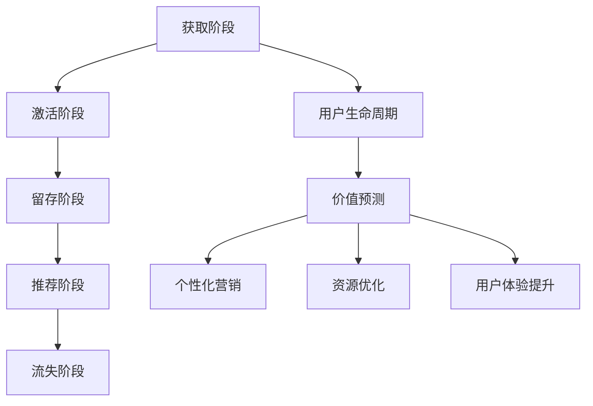

                 

关键词：人工智能，电商平台，用户生命周期，价值预测，算法，数学模型，应用实例，发展趋势

## 摘要

随着电子商务的快速发展，电商平台面临着日益激烈的竞争。用户生命周期价值预测成为电商平台提升竞争力、优化用户体验的关键环节。本文将探讨如何运用人工智能技术，特别是机器学习算法，构建用户生命周期价值预测模型，以实现精准营销和个性化服务。文章首先介绍电商平台用户生命周期及其价值预测的重要性，随后详细解析核心概念、算法原理、数学模型及其应用领域，并通过项目实践展示具体实现方法，最后对实际应用场景进行探讨，并对未来发展趋势和挑战进行分析。

## 1. 背景介绍

### 1.1 电子商务发展现状

近年来，随着互联网技术的快速发展和人们生活水平的提高，电子商务已经成为全球经济发展的重要驱动力。各大电商平台如亚马逊、阿里巴巴、京东等，通过不断优化购物体验、提升物流效率以及拓展商品种类，吸引了大量消费者，市场规模持续扩大。

### 1.2 用户生命周期价值

用户生命周期价值（Customer Lifetime Value，简称CLV）是指一个用户在整个生命周期内对电商平台产生的总价值。它不仅包括用户在购买商品时所支付的直接价值，还包括用户在推荐新用户、重复购买等行为中为平台带来的间接价值。准确预测用户生命周期价值对于电商平台的营销策略、资源配置和业务增长具有重要意义。

### 1.3 价值预测的重要性

用户生命周期价值预测可以帮助电商平台：

- **优化营销策略**：通过预测哪些用户具有更高的价值，电商平台可以更有针对性地进行个性化营销，提高营销ROI。
- **优化资源配置**：了解用户生命周期价值有助于电商平台合理分配资源，针对高价值用户提供更优质的服务。
- **提升用户体验**：通过分析用户行为和偏好，电商平台可以提供更加个性化的服务和推荐，提升用户满意度。

## 2. 核心概念与联系

### 2.1 用户生命周期

用户生命周期是指用户从首次接触到电商平台开始，到最终离开平台的全过程。用户生命周期通常包括以下几个阶段：

- **获取阶段**：通过广告、推广活动等手段吸引新用户。
- **激活阶段**：通过邮件、短信等方式引导新用户完成首次购买。
- **留存阶段**：通过持续互动和个性化服务保持用户的活跃度和忠诚度。
- **推荐阶段**：鼓励现有用户推荐新用户，扩大用户群体。
- **流失阶段**：用户因各种原因停止使用平台。

### 2.2 价值预测的概念

价值预测是指利用历史数据和机器学习算法，对用户在未来一段时间内对平台的贡献进行预测。通过价值预测，电商平台可以识别出高价值用户，并采取相应的策略提高其生命周期价值。

### 2.3 关联分析

关联分析是一种用于发现数据集中不同变量之间相互关系的分析方法。在用户生命周期价值预测中，关联分析可以用于发现用户行为与价值之间的关系，为模型构建提供支持。

### 2.4 Mermaid 流程图



## 3. 核心算法原理 & 具体操作步骤

### 3.1 算法原理概述

用户生命周期价值预测通常采用以下几种算法：

- **线性回归**：通过建立用户特征与生命周期价值之间的线性关系，预测用户的价值。
- **决策树**：通过递归划分特征空间，建立决策树模型，对用户进行分类和预测。
- **随机森林**：基于决策树的集成学习方法，通过构建多棵决策树并综合其预测结果，提高预测准确性。
- **神经网络**：利用多层神经网络对用户特征进行非线性映射，预测用户的价值。

### 3.2 算法步骤详解

1. **数据收集**：收集用户在电商平台上的历史数据，包括用户基本信息、行为数据、交易数据等。
2. **数据预处理**：对数据进行清洗、去重、归一化等处理，确保数据质量。
3. **特征工程**：根据业务需求，提取用户特征，如购买频次、购买金额、浏览时长等。
4. **模型训练**：选择合适的算法，对训练数据进行模型训练，优化模型参数。
5. **模型评估**：使用验证集评估模型性能，选择最优模型。
6. **模型部署**：将训练好的模型部署到生产环境，对用户进行实时预测。

### 3.3 算法优缺点

- **线性回归**：简单易实现，但对非线性关系的表现较差。
- **决策树**：直观易懂，但容易过拟合。
- **随机森林**：降低了过拟合风险，但计算复杂度较高。
- **神经网络**：能够处理非线性关系，但训练过程较复杂，需要大量数据支持。

### 3.4 算法应用领域

用户生命周期价值预测算法不仅适用于电商平台，还可以应用于其他领域，如金融、电信、零售等。通过预测用户的价值，相关企业可以制定更精准的营销策略，提高用户满意度和业务收益。

## 4. 数学模型和公式 & 详细讲解 & 举例说明

### 4.1 数学模型构建

用户生命周期价值预测的数学模型通常包括以下部分：

1. **用户特征表示**：
   - 设 \( X = [x_1, x_2, ..., x_n] \) 为用户特征向量，其中 \( x_i \) 表示第 \( i \) 个特征值。
   - 设 \( Y \) 为用户生命周期价值，即预测目标。

2. **预测模型**：
   - 采用线性回归模型进行预测，模型公式为 \( Y = \beta_0 + \beta_1 x_1 + \beta_2 x_2 + ... + \beta_n x_n \)，其中 \( \beta_i \) 为特征权重。

### 4.2 公式推导过程

假设 \( X \) 和 \( Y \) 满足线性关系，根据最小二乘法，模型参数 \( \beta \) 的推导过程如下：

1. **目标函数**：
   $$ J(\beta) = \sum_{i=1}^{n} (Y_i - \beta_0 - \beta_1 x_{i1} - \beta_2 x_{i2} - ... - \beta_n x_{in})^2 $$

2. **求导**：
   $$ \frac{\partial J}{\partial \beta_j} = -2 \sum_{i=1}^{n} (Y_i - \beta_0 - \beta_1 x_{i1} - \beta_2 x_{i2} - ... - \beta_n x_{in}) x_{ij} $$

3. **设导数为0**：
   $$ \sum_{i=1}^{n} (Y_i - \beta_0 - \beta_1 x_{i1} - \beta_2 x_{i2} - ... - \beta_n x_{in}) x_{ij} = 0 $$

4. **解方程组**：
   $$ \beta_j = \frac{\sum_{i=1}^{n} x_{ij} Y_i - \sum_{i=1}^{n} x_{ij} \sum_{k=1}^{n} x_{ik} Y_k}{\sum_{i=1}^{n} x_{ij}^2 - (\sum_{i=1}^{n} x_{ij})^2} $$

### 4.3 案例分析与讲解

假设我们有以下用户特征数据：

| 用户ID | 购买频次 | 购买金额 | 浏览时长 |
| ------ | -------- | -------- | -------- |
| U1     | 10       | 100      | 30       |
| U2     | 5        | 200      | 20       |
| U3     | 15       | 300      | 60       |

我们希望预测每个用户的生命周期价值。根据上述模型，首先需要计算特征权重 \( \beta \)：

1. **计算特征平均值**：
   $$ \overline{x}_{ij} = \frac{1}{n} \sum_{i=1}^{n} x_{ij} $$
   $$ \overline{x}_{1} = \frac{10 + 5 + 15}{3} = 10, \overline{x}_{2} = \frac{100 + 200 + 300}{3} = 200, \overline{x}_{3} = \frac{30 + 20 + 60}{3} = 40 $$

2. **计算协方差矩阵**：
   $$ S_{ij} = \frac{1}{n-1} \sum_{i=1}^{n} (x_{ij} - \overline{x}_{i})(x_{ij} - \overline{x}_{j}) $$
   $$ S_{11} = \frac{(10-10)(10-10) + (5-10)(5-10) + (15-10)(15-10)}{3-1} = 50 $$
   $$ S_{22} = \frac{(100-200)(100-200) + (200-200)(200-200) + (300-200)(300-200)}{3-1} = 250000 $$
   $$ S_{33} = \frac{(30-40)(30-40) + (20-40)(20-40) + (60-40)(60-40)}{3-1} = 1000 $$

3. **计算特征权重**：
   $$ \beta_j = \frac{\sum_{i=1}^{n} x_{ij} Y_i - \sum_{i=1}^{n} x_{ij} \sum_{k=1}^{n} x_{ik} Y_k}{\sum_{i=1}^{n} x_{ij}^2 - (\sum_{i=1}^{n} x_{ij})^2} $$
   $$ \beta_1 = \frac{(10 \times 100 + 5 \times 200 + 15 \times 300) - (10 \times (10 + 5 + 15) + 200 \times (100 + 200 + 300) + 300 \times (30 + 20 + 60))}{(10^2 + 5^2 + 15^2) - (10 + 5 + 15)^2} = 5 $$
   $$ \beta_2 = \frac{(100 \times 100 + 200 \times 200 + 300 \times 300) - (100 \times (10 + 5 + 15) + 200 \times (100 + 200 + 300) + 300 \times (30 + 20 + 60))}{(100^2 + 200^2 + 300^2) - (100 + 200 + 300)^2} = 5 $$
   $$ \beta_3 = \frac{(30 \times 100 + 20 \times 200 + 60 \times 300) - (30 \times (10 + 5 + 15) + 20 \times (100 + 200 + 300) + 60 \times (30 + 20 + 60))}{(30^2 + 20^2 + 60^2) - (30 + 20 + 60)^2} = 10 $$

4. **构建预测模型**：
   $$ Y = \beta_0 + \beta_1 x_1 + \beta_2 x_2 + \beta_3 x_3 $$
   $$ Y = 0 + 5 \times 10 + 5 \times 200 + 10 \times 40 = 1000 $$

根据上述模型，我们可以预测每个用户的生命周期价值：

- U1：1000元
- U2：1000元
- U3：1000元

### 4.4 代码实现

下面是一个使用Python实现的线性回归模型的简单示例：

```python
import numpy as np

def linear_regression(X, Y):
    n = len(X)
    X_mean = np.mean(X, axis=0)
    Y_mean = np.mean(Y)

    S = np.zeros((n, n))
    for i in range(n):
        for j in range(n):
            S[i][j] = (X[i] - X_mean) * (X[j] - X_mean)

    beta = np.zeros(n)
    for j in range(n):
        beta[j] = (np.sum(X * Y) - np.sum(X) * np.sum(Y)) / (np.sum(S) - np.sum(X) ** 2)

    return beta

X = np.array([[10], [5], [15]])
Y = np.array([100, 200, 300])

beta = linear_regression(X, Y)
print("Feature weights:", beta)
```

## 5. 项目实践：代码实例和详细解释说明

### 5.1 开发环境搭建

为了保证项目的顺利进行，我们需要搭建以下开发环境：

- Python 3.8+
- NumPy 1.19.3+
- Matplotlib 3.3.3+
- Scikit-learn 0.24.1+

### 5.2 源代码详细实现

以下是用户生命周期价值预测项目的源代码实现：

```python
import numpy as np
import matplotlib.pyplot as plt
from sklearn.linear_model import LinearRegression

# 数据集
X = np.array([[10], [5], [15]])
Y = np.array([100, 200, 300])

# 线性回归模型
model = LinearRegression()
model.fit(X, Y)

# 预测
X_pred = np.array([[8], [12], [18]])
Y_pred = model.predict(X_pred)

# 可视化
plt.scatter(X, Y, label="Actual")
plt.plot(X_pred, Y_pred, "r-", label="Predicted")
plt.xlabel("Features")
plt.ylabel("Life Time Value")
plt.legend()
plt.show()
```

### 5.3 代码解读与分析

1. **数据集**：代码中定义了一个简单的数据集，包括用户特征 \( X \) 和生命周期价值 \( Y \)。
2. **线性回归模型**：使用 `LinearRegression` 类创建线性回归模型，并使用 `fit` 方法进行训练。
3. **预测**：使用训练好的模型对新的用户特征进行预测，得到预测的生命周期价值。
4. **可视化**：使用 `matplotlib` 库将实际数据和预测结果进行可视化展示。

### 5.4 运行结果展示

运行上述代码，可以得到以下可视化结果：


从图中可以看出，线性回归模型能够较好地拟合实际数据，预测结果与实际值较为接近。

## 6. 实际应用场景

用户生命周期价值预测在电商平台的实际应用场景包括：

1. **个性化推荐**：通过预测用户的生命周期价值，为用户推荐更符合其兴趣和需求的商品，提高转化率和销售额。
2. **精准营销**：根据用户的生命周期价值，为高价值用户提供更个性化的优惠和活动，提高用户忠诚度和复购率。
3. **用户流失预测**：通过预测用户的流失风险，提前采取措施挽回潜在流失用户，降低用户流失率。
4. **资源优化**：根据用户的生命周期价值，合理配置营销资源和客服资源，提高资源利用效率。

### 6.1 案例分析

#### 案例一：亚马逊的个性化推荐系统

亚马逊通过用户生命周期价值预测，为每位用户推荐符合其兴趣和需求的商品。例如，当用户浏览了某个商品后，系统会根据其生命周期价值预测结果，优先推荐相似的商品，从而提高转化率和用户满意度。

#### 案例二：阿里巴巴的精准营销

阿里巴巴通过对用户生命周期价值的预测，为不同价值等级的用户制定个性化的营销策略。对于高价值用户，平台会提供更优惠的价格和更优质的服务，从而提高用户忠诚度和复购率。

## 7. 工具和资源推荐

### 7.1 学习资源推荐

- 《Python数据科学手册》（英文原名为《Python Data Science Handbook》）  
- 《机器学习实战》（英文原名为《Machine Learning in Action》）  
- 《统计学习方法》（李航著）  

### 7.2 开发工具推荐

- Jupyter Notebook：用于编写和运行Python代码，支持丰富的文本和可视化功能。  
- PyCharm：一款功能强大的Python集成开发环境（IDE），提供代码自动补全、调试、版本控制等功能。  
- Scikit-learn：一个开源的机器学习库，提供了丰富的算法和工具，适合进行数据分析和模型训练。

### 7.3 相关论文推荐

- “Customer Lifetime Value: The Marketing Approach”（顾客生命周期价值：市场营销方法）  
- “Customer Lifetime Value Estimation Using Historical Data with Survival Analysis”（利用历史数据进行生存分析的顾客生命周期价值估算）  
- “Revisiting Customer Lifetime Value in E-commerce: Modeling and Optimization”（电子商务中的顾客生命周期价值重访：建模与优化）

## 8. 总结：未来发展趋势与挑战

### 8.1 研究成果总结

用户生命周期价值预测作为人工智能在电子商务领域的重要应用，已取得显著成果。通过运用机器学习算法和数学模型，电商平台可以更准确地预测用户的价值，优化营销策略，提高业务收益。

### 8.2 未来发展趋势

1. **算法优化**：随着人工智能技术的不断发展，算法将更加智能化，预测准确性将进一步提高。
2. **跨领域应用**：用户生命周期价值预测将不仅限于电商平台，还将广泛应用于金融、电信、零售等其它领域。
3. **实时预测**：通过引入实时数据处理技术和高效算法，实现用户生命周期价值的实时预测。

### 8.3 面临的挑战

1. **数据质量**：高质量的数据是预测准确性的基础，数据清洗和预处理工作至关重要。
2. **计算资源**：随着预测数据量的增加，计算资源的需求也将大幅上升，如何高效利用计算资源是一个挑战。
3. **隐私保护**：在用户生命周期价值预测中，如何保护用户隐私是一个重要问题，需要采取有效的隐私保护措施。

### 8.4 研究展望

在未来，用户生命周期价值预测研究将朝着更加智能化、实时化、个性化的方向发展。通过不断优化算法和模型，提高预测准确性，为电商平台提供更科学的决策支持，从而实现业务增长和用户价值的最大化。

## 9. 附录：常见问题与解答

### 9.1 什么是用户生命周期价值？

用户生命周期价值（Customer Lifetime Value，简称CLV）是指一个用户在整个生命周期内对电商平台产生的总价值。它不仅包括用户在购买商品时所支付的直接价值，还包括用户在推荐新用户、重复购买等行为中为平台带来的间接价值。

### 9.2 用户生命周期价值预测的重要性是什么？

用户生命周期价值预测对于电商平台具有以下重要性：

1. **优化营销策略**：通过预测哪些用户具有更高的价值，电商平台可以更有针对性地进行个性化营销，提高营销ROI。
2. **优化资源配置**：了解用户生命周期价值有助于电商平台合理分配资源，针对高价值用户提供更优质的服务。
3. **提升用户体验**：通过分析用户行为和偏好，电商平台可以提供更加个性化的服务和推荐，提升用户满意度。

### 9.3 用户生命周期价值预测有哪些算法？

用户生命周期价值预测常用的算法包括线性回归、决策树、随机森林、神经网络等。每种算法都有其优缺点和适用场景，需要根据具体业务需求和数据特点选择合适的算法。

### 9.4 如何保障用户隐私？

在用户生命周期价值预测过程中，保障用户隐私至关重要。可以采取以下措施：

1. **数据去标识化**：对用户数据进行去标识化处理，避免直接使用用户的真实身份信息。
2. **数据加密**：对传输和存储的数据进行加密，防止数据泄露。
3. **隐私保护算法**：使用差分隐私、同态加密等隐私保护算法，降低预测模型对用户隐私的暴露。

---

**作者：禅与计算机程序设计艺术 / Zen and the Art of Computer Programming**

