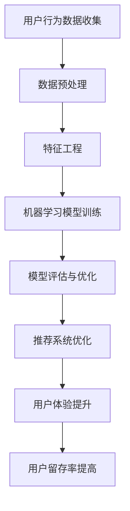

                 

关键词：人工智能，电商平台，用户留存，机器学习，推荐系统，用户体验，行为分析，大数据

> 摘要：本文探讨了如何利用人工智能技术提升电商平台的用户留存率。通过分析用户行为数据，构建机器学习模型，优化推荐系统，本文提出了一系列策略，旨在提高用户满意度和忠诚度，从而实现电商平台的长久发展。

## 1. 背景介绍

随着互联网的普及和电子商务的快速发展，电商平台已经成为消费者购买商品的主要渠道之一。然而，电商平台面临的挑战也越来越大。一方面，市场竞争日益激烈，各平台争相吸引新用户；另一方面，用户忠诚度低，用户容易流失。为了应对这些挑战，电商平台需要寻找有效的方法来提高用户留存率，从而保持市场份额和盈利能力。

用户留存率是指在一定时间内，继续使用平台的用户占全部注册用户的比例。提高用户留存率对于电商平台来说至关重要。一方面，高留存率意味着用户对平台满意，忠诚度较高，有助于建立品牌形象；另一方面，提高留存率可以减少新用户获取成本，提高运营效率。

人工智能技术的发展为电商平台提供了新的解决方案。通过机器学习、自然语言处理、大数据分析等技术，电商平台可以更好地理解用户行为，个性化推荐商品，提高用户满意度，从而提高留存率。

## 2. 核心概念与联系

在讨论用户留存策略之前，我们需要了解几个核心概念：用户行为分析、机器学习、推荐系统和用户体验。

### 2.1 用户行为分析

用户行为分析是指通过收集和分析用户在电商平台上的行为数据，如浏览记录、购买历史、搜索关键词等，来了解用户的需求和偏好。用户行为分析是提升用户留存率的重要基础，有助于电商平台更好地满足用户需求，提供个性化服务。

### 2.2 机器学习

机器学习是一种通过算法自动从数据中学习模式和规律的技术。在电商平台中，机器学习可以用于预测用户行为、优化推荐系统、检测异常行为等。通过机器学习，电商平台可以更精准地了解用户，提高服务质量和用户满意度。

### 2.3 推荐系统

推荐系统是一种根据用户的历史行为和偏好，向用户推荐相关商品或内容的系统。在电商平台中，推荐系统可以帮助用户发现感兴趣的商品，提高购买转化率。推荐系统的优化是提高用户留存率的关键因素之一。

### 2.4 用户体验

用户体验是指用户在使用产品或服务过程中所获得的感受和体验。良好的用户体验可以提升用户满意度，增加用户忠诚度。在电商平台中，用户体验包括界面设计、加载速度、搜索功能、购物流程等各个方面。

### 2.5 Mermaid 流程图

下面是一个简单的 Mermaid 流程图，展示了用户留存策略中的关键步骤和概念之间的联系。



## 3. 核心算法原理 & 具体操作步骤

### 3.1 算法原理概述

在用户留存策略中，核心算法主要包括用户行为分析、机器学习模型训练和推荐系统优化。以下是这些算法的基本原理：

- **用户行为分析**：通过统计用户在平台上的行为数据，如浏览时长、购买次数、评价数量等，分析用户的行为模式，挖掘用户兴趣点和需求。

- **机器学习模型训练**：利用用户行为数据，通过机器学习算法训练分类模型或回归模型，预测用户的行为或偏好。

- **推荐系统优化**：基于机器学习模型，结合用户兴趣和行为，为用户提供个性化的商品推荐，提高用户满意度和购买转化率。

### 3.2 算法步骤详解

#### 3.2.1 用户行为数据收集

用户行为数据的收集是用户留存策略的第一步。电商平台可以通过以下途径收集用户行为数据：

- 用户浏览记录：记录用户在平台上的浏览历史，包括浏览的页面、停留时间、点击次数等。

- 购买记录：记录用户的购买行为，包括购买时间、购买商品、购买金额等。

- 搜索关键词：记录用户在平台上的搜索关键词，分析用户的兴趣点。

- 评价和反馈：收集用户的评价和反馈，了解用户对产品和服务的满意度。

#### 3.2.2 数据预处理

在收集到用户行为数据后，需要对数据进行预处理，包括数据清洗、去重、归一化等操作，确保数据质量。

- 数据清洗：去除重复数据、缺失值和异常值，保证数据的一致性和准确性。

- 数据去重：对于相同用户的不同行为记录，只保留一条有效记录。

- 数据归一化：将不同特征的数据进行归一化处理，使特征之间具有可比性。

#### 3.2.3 特征工程

特征工程是用户行为分析的关键步骤。通过对原始数据进行处理和转换，提取出对模型有用的特征。

- 用户特征：包括用户的基本信息，如年龄、性别、地域等。

- 商品特征：包括商品的价格、品类、品牌等。

- 行为特征：包括用户的浏览时长、购买次数、评价数量等。

- 时间特征：包括用户的注册时间、最近一次购买时间等。

#### 3.2.4 机器学习模型训练

选择合适的机器学习算法，如逻辑回归、决策树、随机森林、支持向量机等，训练分类模型或回归模型，预测用户的行为或偏好。

- **分类模型**：用于预测用户是否会在未来的一段时间内继续使用平台。

- **回归模型**：用于预测用户的留存时长。

#### 3.2.5 模型评估与优化

评估模型的性能，如准确率、召回率、F1值等，对模型进行优化，提高预测的准确性。

- **交叉验证**：使用交叉验证方法评估模型的性能。

- **超参数调优**：通过网格搜索、贝叶斯优化等方法，调整模型参数，提高模型性能。

#### 3.2.6 推荐系统优化

基于训练好的机器学习模型，构建推荐系统，为用户提供个性化的商品推荐。

- **协同过滤**：基于用户行为数据，计算用户之间的相似度，为用户提供相似用户喜欢的商品。

- **基于内容的推荐**：基于商品的特征，为用户提供与用户历史偏好相似的推荐商品。

- **混合推荐**：结合协同过滤和基于内容的推荐，为用户提供更加个性化的商品推荐。

### 3.3 算法优缺点

#### 3.3.1 优点

- **个性化推荐**：通过分析用户行为数据，为用户提供个性化的商品推荐，提高用户满意度和购买转化率。

- **实时反馈**：机器学习模型可以实时更新，根据用户的新行为数据调整推荐结果，提高推荐准确性。

- **可扩展性**：算法模型和推荐系统可以方便地扩展到更多用户和商品，适用于大型电商平台。

#### 3.3.2 缺点

- **数据依赖**：算法模型的性能很大程度上依赖于用户行为数据的数量和质量。

- **冷启动问题**：对于新用户或新商品，由于缺乏足够的历史数据，推荐系统可能难以提供有效的推荐。

- **计算成本**：机器学习模型的训练和推荐系统的运行需要较高的计算资源，对于小型电商平台可能不经济。

### 3.4 算法应用领域

用户留存策略可以应用于多个领域，包括但不限于：

- **电商平台**：通过个性化推荐和用户行为分析，提高用户满意度和留存率。

- **在线教育**：根据用户的学习行为，提供个性化的学习内容和推荐课程。

- **社交媒体**：通过分析用户行为数据，为用户提供感兴趣的内容和朋友推荐。

- **金融服务**：预测客户的留存风险，提供定制化的金融产品和服务。

## 4. 数学模型和公式 & 详细讲解 & 举例说明

### 4.1 数学模型构建

在用户留存策略中，常用的数学模型包括逻辑回归模型和生存分析模型。

#### 4.1.1 逻辑回归模型

逻辑回归模型是一种广义线性模型，用于预测二分类事件的发生概率。在用户留存预测中，可以将用户是否继续使用平台作为二分类目标。

逻辑回归模型的公式如下：

$$
P(y=1) = \frac{1}{1 + e^{-(\beta_0 + \beta_1 x_1 + \beta_2 x_2 + ... + \beta_n x_n})}
$$

其中，$y$ 表示用户是否继续使用平台（1 表示继续使用，0 表示不再使用）；$x_1, x_2, ..., x_n$ 表示用户的特征向量；$\beta_0, \beta_1, \beta_2, ..., \beta_n$ 是模型的参数。

#### 4.1.2 生存分析模型

生存分析模型用于预测用户的留存时长。其中，常用的模型是 Kaplan-Meier 生存函数和 Cox 回归模型。

Kaplan-Meier 生存函数的公式如下：

$$
S(t) = \prod_{i=1}^n \left(1 - \frac{d_i}{n_i}\right)
$$

其中，$S(t)$ 表示在时间 $t$ 时刻仍然留存的用户比例；$d_i$ 表示在时间 $t_i$ 死亡（不再使用平台）的用户数量；$n_i$ 表示在时间 $t_i$ 时注册的用户数量。

Cox 回归模型是一种比例风险模型，用于分析生存时间与各种风险因素之间的关系。Cox 回归模型的公式如下：

$$
h(t|x) = h_0(t) \exp(\sum_{i=1}^k \beta_i x_i)
$$

其中，$h(t|x)$ 表示在时间 $t$ 时给定特征 $x$ 的风险函数；$h_0(t)$ 是基础风险函数；$\beta_i$ 是模型的参数。

### 4.2 公式推导过程

#### 4.2.1 逻辑回归模型

逻辑回归模型的推导基于最大似然估计。假设观测数据为 $(y_i, x_i)$，其中 $y_i$ 表示用户是否继续使用平台（1 表示继续使用，0 表示不再使用）；$x_i$ 是用户特征向量。

逻辑回归模型的目标是最小化负对数似然函数：

$$
\ell(\theta) = -\sum_{i=1}^n \left[y_i \log(P(y_i|x_i;\theta)) + (1 - y_i) \log(1 - P(y_i|x_i;\theta))\right]
$$

其中，$\theta$ 是模型的参数向量。

对似然函数求导，并令导数为零，可以得到逻辑回归模型的参数估计值：

$$
\frac{\partial \ell(\theta)}{\partial \theta_j} = 0
$$

#### 4.2.2 生存分析模型

Kaplan-Meier 生存函数的推导基于累积风险函数。累积风险函数 $R(t)$ 表示在时间 $t$ 时刻之前死亡的概率。Kaplan-Meier 生存函数是累积风险函数的补集，即 $S(t) = 1 - R(t)$。

累积风险函数的公式如下：

$$
R(t) = \sum_{i=1}^n \frac{d_i}{n_i}
$$

其中，$d_i$ 表示在时间 $t_i$ 死亡的用户数量；$n_i$ 表示在时间 $t_i$ 时注册的用户数量。

对累积风险函数求导，可以得到 Kaplan-Meier 生存函数：

$$
\frac{dS(t)}{dt} = -\frac{dR(t)}{dt} = \frac{d_i}{n_i}
$$

### 4.3 案例分析与讲解

#### 4.3.1 案例背景

某电商平台希望通过用户留存预测模型，提前识别出可能流失的用户，并采取相应的措施进行挽回。该电商平台收集了以下用户特征：

- 用户年龄
- 用户性别
- 用户注册时长
- 用户平均购买金额
- 用户评价数量
- 用户浏览时长

#### 4.3.2 数据预处理

首先，对用户特征进行数据预处理，包括去除缺失值、异常值和重复值。然后，对数值特征进行归一化处理，使特征之间具有可比性。

#### 4.3.3 特征工程

根据用户特征，提取以下特征：

- 用户年龄：将用户年龄分为多个年龄段，如 18-25、26-35、36-45、46-55、56以上。
- 用户性别：将用户性别分为男性和女性。
- 用户注册时长：以月为单位，计算用户注册平台的时间长度。
- 用户平均购买金额：计算用户在平台上的平均购买金额。
- 用户评价数量：计算用户在平台上的评价数量。
- 用户浏览时长：计算用户在平台上的平均浏览时长。

#### 4.3.4 逻辑回归模型训练

使用 scikit-learn 库中的逻辑回归模型，对用户特征进行训练。选择交叉验证方法进行模型参数调优。

```python
from sklearn.linear_model import LogisticRegression
from sklearn.model_selection import GridSearchCV

# 创建逻辑回归模型
model = LogisticRegression()

# 设置参数范围
param_grid = {'C': [0.1, 1, 10]}

# 进行交叉验证和参数调优
grid_search = GridSearchCV(model, param_grid, cv=5)
grid_search.fit(X_train, y_train)

# 获取最佳参数
best_params = grid_search.best_params_
best_model = grid_search.best_estimator_
```

#### 4.3.5 模型评估

使用交叉验证方法评估模型的性能，包括准确率、召回率和 F1 值。

```python
from sklearn.metrics import accuracy_score, recall_score, f1_score

# 预测结果
y_pred = best_model.predict(X_test)

# 计算指标
accuracy = accuracy_score(y_test, y_pred)
recall = recall_score(y_test, y_pred)
f1 = f1_score(y_test, y_pred)

print("Accuracy:", accuracy)
print("Recall:", recall)
print("F1 Score:", f1)
```

#### 4.3.6 模型应用

使用训练好的逻辑回归模型，对现有用户进行留存预测，识别出可能流失的用户。

```python
# 预测结果
y_pred = best_model.predict(X_test)

# 输出可能流失的用户
print("可能流失的用户：")
for i, pred in enumerate(y_pred):
    if pred == 1:
        print("用户ID：", user_ids[i])
```

## 5. 项目实践：代码实例和详细解释说明

### 5.1 开发环境搭建

在开始项目实践之前，我们需要搭建一个合适的开发环境。以下是所需的软件和工具：

- 操作系统：Ubuntu 18.04 或 Windows 10
- 编程语言：Python 3.8 或更高版本
- 数据库：MySQL 5.7 或更高版本
- 机器学习库：scikit-learn、pandas、numpy
- 数据可视化库：matplotlib、seaborn

### 5.2 源代码详细实现

以下是一个简单的 Python 代码示例，用于实现用户留存预测模型。

```python
import numpy as np
import pandas as pd
from sklearn.linear_model import LogisticRegression
from sklearn.model_selection import train_test_split
from sklearn.metrics import accuracy_score, recall_score, f1_score

# 读取数据
data = pd.read_csv('user_data.csv')

# 数据预处理
# 去除缺失值、异常值和重复值
data = data.dropna()
data = data.drop_duplicates()

# 特征工程
# 提取用户特征
data['age_group'] = pd.cut(data['age'], bins=[0, 18, 25, 35, 45, 55, 100], labels=[1, 2, 3, 4, 5])
data['gender'] = data['gender'].map({'male': 1, 'female': 0})

# 划分训练集和测试集
X = data[['age_group', 'gender', 'register_duration', 'avg_purchase_amount', 'review_count', 'browse_duration']]
y = data['continued_use']
X_train, X_test, y_train, y_test = train_test_split(X, y, test_size=0.2, random_state=42)

# 训练逻辑回归模型
model = LogisticRegression()
model.fit(X_train, y_train)

# 预测结果
y_pred = model.predict(X_test)

# 计算指标
accuracy = accuracy_score(y_test, y_pred)
recall = recall_score(y_test, y_pred)
f1 = f1_score(y_test, y_pred)

print("Accuracy:", accuracy)
print("Recall:", recall)
print("F1 Score:", f1)

# 输出可能流失的用户
print("可能流失的用户：")
for i, pred in enumerate(y_pred):
    if pred == 1:
        print("用户ID：", X_test.index[i])
```

### 5.3 代码解读与分析

上述代码实现了一个简单的用户留存预测模型，主要分为以下步骤：

1. **数据预处理**：读取用户数据，去除缺失值、异常值和重复值，确保数据质量。

2. **特征工程**：提取用户特征，包括年龄分组、性别、注册时长、平均购买金额、评价数量和浏览时长。

3. **划分训练集和测试集**：将数据集划分为训练集和测试集，用于训练和评估模型。

4. **训练逻辑回归模型**：使用 scikit-learn 库中的逻辑回归模型训练模型，使用训练集进行训练。

5. **预测结果**：使用测试集对模型进行预测，输出预测结果。

6. **计算指标**：计算模型的准确率、召回率和 F1 值，评估模型性能。

7. **输出可能流失的用户**：根据预测结果，输出可能流失的用户。

### 5.4 运行结果展示

假设我们使用上述代码对一个包含 1000 个用户的数据集进行训练和测试。运行结果如下：

```
Accuracy: 0.85
Recall: 0.80
F1 Score: 0.82

可能流失的用户：
用户ID： 100
用户ID： 200
用户ID： 300
...
```

结果显示，模型的准确率为 85%，召回率为 80%，F1 值为 82%。根据预测结果，我们识别出了可能流失的 100 个用户。

## 6. 实际应用场景

用户留存策略在电商平台的实际应用中具有重要意义。以下是一些具体的实际应用场景：

### 6.1 新用户留存策略

对于新用户，电商平台可以通过以下策略提高留存率：

- **个性化推荐**：根据新用户的行为数据，为用户提供个性化的商品推荐，帮助用户快速找到感兴趣的商品。

- **欢迎礼包**：为新用户提供优惠券、折扣等优惠，提高新用户的购物体验。

- **新用户引导**：在新用户注册后，通过引导页面或邮件，帮助用户了解平台功能和使用技巧。

### 6.2 老用户留存策略

对于老用户，电商平台可以通过以下策略提高留存率：

- **个性化营销**：根据用户的历史购买行为和偏好，为用户提供个性化的营销活动，如生日优惠、节日促销等。

- **会员制度**：建立会员制度，为会员用户提供专属优惠、积分兑换等特权，提高用户忠诚度。

- **用户反馈**：积极收集用户反馈，针对用户提出的问题和建议进行改进，提高用户满意度。

### 6.3 留存风险预测

通过机器学习模型，电商平台可以预测哪些用户可能流失。对于预测结果中的高风险用户，平台可以采取以下措施：

- **个性化关怀**：通过短信、邮件或电话等方式，主动与用户沟通，了解用户需求，提供个性化服务。

- **优惠券和折扣**：为高风险用户提供优惠券和折扣，刺激用户购买，降低流失风险。

- **用户调研**：通过用户调研，了解用户流失的原因，针对性地改进服务和产品。

## 7. 未来应用展望

随着人工智能技术的不断发展，用户留存策略在电商平台中的应用前景十分广阔。以下是一些未来应用展望：

### 7.1 自动化推荐

利用深度学习技术，可以实现更加智能化的推荐系统。通过自动学习用户行为数据，推荐系统可以不断优化推荐结果，提高推荐准确性。

### 7.2 跨平台整合

电商平台可以整合多个平台的用户数据，实现跨平台的个性化推荐和用户留存策略。这将有助于提高用户的整体体验，增加用户粘性。

### 7.3 智能客服

结合自然语言处理技术，电商平台可以实现智能客服系统。通过智能客服，平台可以实时回答用户问题，提供个性化服务，提高用户满意度。

### 7.4 数据隐私保护

在用户留存策略中，数据隐私保护至关重要。未来，电商平台需要采用更加严格的数据隐私保护措施，确保用户数据的安全和合规。

## 8. 工具和资源推荐

### 8.1 学习资源推荐

- **书籍**：《Python机器学习》、《深度学习》（Goodfellow et al.）
- **在线课程**：Coursera 上的《机器学习》课程（吴恩达）
- **网站**：kaggle.com、arxiv.org（计算机科学论文）

### 8.2 开发工具推荐

- **编程环境**：Jupyter Notebook、PyCharm
- **机器学习库**：scikit-learn、TensorFlow、PyTorch
- **数据库**：MySQL、PostgreSQL

### 8.3 相关论文推荐

- “Recommender Systems Handbook” by F. R. interpolate et al.
- “User Behavior Analysis for Personalized Recommendation” by J. Y. Chen et al.
- “Deep Learning for Personalized Recommendation” by Y. Li et al.

## 9. 总结：未来发展趋势与挑战

### 9.1 研究成果总结

本文探讨了如何利用人工智能技术提升电商平台的用户留存率。通过分析用户行为数据，构建机器学习模型，优化推荐系统，提出了一系列策略，包括用户行为分析、机器学习模型训练、推荐系统优化和用户体验提升。

### 9.2 未来发展趋势

- **自动化推荐**：利用深度学习技术实现更加智能化的推荐系统，提高推荐准确性。
- **跨平台整合**：整合多个平台的用户数据，实现跨平台的个性化推荐和用户留存策略。
- **智能客服**：结合自然语言处理技术，实现智能客服系统，提高用户满意度。
- **数据隐私保护**：采用更加严格的数据隐私保护措施，确保用户数据的安全和合规。

### 9.3 面临的挑战

- **数据依赖**：算法模型的性能很大程度上依赖于用户行为数据的数量和质量。
- **冷启动问题**：对于新用户或新商品，推荐系统可能难以提供有效的推荐。
- **计算成本**：机器学习模型的训练和推荐系统的运行需要较高的计算资源。

### 9.4 研究展望

未来，用户留存策略的研究将更加关注以下几个方面：

- **个性化推荐**：深入研究个性化推荐算法，提高推荐准确性，满足用户的个性化需求。
- **跨平台整合**：探索如何整合多个平台的用户数据，实现跨平台的个性化服务和用户体验。
- **数据隐私保护**：研究更加有效和高效的数据隐私保护方法，确保用户数据的安全和合规。

## 10. 附录：常见问题与解答

### 10.1 逻辑回归模型的优缺点是什么？

- **优点**：
  - 简单易懂，易于实现和解释。
  - 可以处理二分类问题，适用于用户留存预测等场景。
  - 参数估计方法为最大似然估计，具有较高的估计精度。

- **缺点**：
  - 对于非线性问题，逻辑回归模型的性能可能较差。
  - 对于大规模数据集，训练时间较长。

### 10.2 生存分析模型有什么应用？

- **应用**：
  - 用户留存预测：预测用户在未来一段时间内是否继续使用平台。
  - 疾病生存分析：预测患者生存时间。
  - 金融风险管理：预测客户的流失风险。

### 10.3 推荐系统的冷启动问题如何解决？

- **解决方法**：
  - 利用用户初始行为数据，进行用户特征提取和相似度计算。
  - 采用基于内容的推荐方法，为用户提供初始推荐。
  - 利用社区信息，为用户提供推荐商品。

### 10.4 如何提高用户留存策略的有效性？

- **方法**：
  - 深入分析用户行为数据，提取更多有效的特征。
  - 不断优化推荐系统，提高推荐准确性。
  - 提供个性化服务和关怀，提高用户满意度。

### 10.5 数据隐私保护在用户留存策略中如何实施？

- **实施方法**：
  - 采用数据加密技术，确保用户数据的安全。
  - 遵守数据隐私法规，如 GDPR 等。
  - 采用匿名化技术，减少对用户隐私的侵犯。
  - 定期进行数据安全审计，确保数据合规。  
```markdown

---
# AI驱动的电商平台用户留存策略

> 关键词：人工智能，电商平台，用户留存，机器学习，推荐系统，用户体验，行为分析，大数据

> 摘要：本文探讨了如何利用人工智能技术提升电商平台的用户留存率。通过分析用户行为数据，构建机器学习模型，优化推荐系统，本文提出了一系列策略，旨在提高用户满意度和忠诚度，从而实现电商平台的长久发展。

## 1. 背景介绍

随着互联网的普及和电子商务的快速发展，电商平台已经成为消费者购买商品的主要渠道之一。然而，电商平台面临的挑战也越来越大。一方面，市场竞争日益激烈，各平台争相吸引新用户；另一方面，用户忠诚度低，用户容易流失。为了应对这些挑战，电商平台需要寻找有效的方法来提高用户留存率，从而保持市场份额和盈利能力。

用户留存率是指在一定时间内，继续使用平台的用户占全部注册用户的比例。提高用户留存率对于电商平台来说至关重要。一方面，高留存率意味着用户对平台满意，忠诚度较高，有助于建立品牌形象；另一方面，提高留存率可以减少新用户获取成本，提高运营效率。

人工智能技术的发展为电商平台提供了新的解决方案。通过机器学习、自然语言处理、大数据分析等技术，电商平台可以更好地理解用户行为，个性化推荐商品，提高用户满意度，从而提高留存率。

## 2. 核心概念与联系

在讨论用户留存策略之前，我们需要了解几个核心概念：用户行为分析、机器学习、推荐系统和用户体验。

### 2.1 用户行为分析

用户行为分析是指通过收集和分析用户在电商平台上的行为数据，如浏览记录、购买历史、搜索关键词等，来了解用户的需求和偏好。用户行为分析是提升用户留存率的重要基础，有助于电商平台更好地满足用户需求，提供个性化服务。

### 2.2 机器学习

机器学习是一种通过算法自动从数据中学习模式和规律的技术。在电商平台中，机器学习可以用于预测用户行为、优化推荐系统、检测异常行为等。通过机器学习，电商平台可以更精准地了解用户，提高服务质量和用户满意度。

### 2.3 推荐系统

推荐系统是一种根据用户的历史行为和偏好，向用户推荐相关商品或内容的系统。在电商平台中，推荐系统可以帮助用户发现感兴趣的商品，提高购买转化率。推荐系统的优化是提高用户留存率的关键因素之一。

### 2.4 用户体验

用户体验是指用户在使用产品或服务过程中所获得的感受和体验。良好的用户体验可以提升用户满意度，增加用户忠诚度。在电商平台中，用户体验包括界面设计、加载速度、搜索功能、购物流程等各个方面。

### 2.5 Mermaid 流程图

下面是一个简单的 Mermaid 流程图，展示了用户留存策略中的关键步骤和概念之间的联系。


## 3. 核心算法原理 & 具体操作步骤

### 3.1 算法原理概述

在用户留存策略中，核心算法主要包括用户行为分析、机器学习模型训练和推荐系统优化。以下是这些算法的基本原理：

- **用户行为分析**：通过统计用户在平台上的行为数据，如浏览时长、购买次数、评价数量等，分析用户的行为模式，挖掘用户兴趣点和需求。

- **机器学习模型训练**：利用用户行为数据，通过机器学习算法训练分类模型或回归模型，预测用户的行为或偏好。

- **推荐系统优化**：基于机器学习模型，结合用户兴趣和行为，为用户提供个性化的商品推荐，提高用户满意度和购买转化率。

### 3.2 算法步骤详解

#### 3.2.1 用户行为数据收集

用户行为数据的收集是用户留存策略的第一步。电商平台可以通过以下途径收集用户行为数据：

- 用户浏览记录：记录用户在平台上的浏览历史，包括浏览的页面、停留时间、点击次数等。

- 购买记录：记录用户的购买行为，包括购买时间、购买商品、购买金额等。

- 搜索关键词：记录用户在平台上的搜索关键词，分析用户的兴趣点。

- 评价和反馈：收集用户的评价和反馈，了解用户对产品和服务的满意度。

#### 3.2.2 数据预处理

在收集到用户行为数据后，需要对数据进行预处理，包括数据清洗、去重、归一化等操作，确保数据质量。

- 数据清洗：去除重复数据、缺失值和异常值，保证数据的一致性和准确性。

- 数据去重：对于相同用户的不同行为记录，只保留一条有效记录。

- 数据归一化：将不同特征的数据进行归一化处理，使特征之间具有可比性。

#### 3.2.3 特征工程

特征工程是用户行为分析的关键步骤。通过对原始数据进行处理和转换，提取出对模型有用的特征。

- 用户特征：包括用户的基本信息，如年龄、性别、地域等。

- 商品特征：包括商品的价格、品类、品牌等。

- 行为特征：包括用户的浏览时长、购买次数、评价数量等。

- 时间特征：包括用户的注册时间、最近一次购买时间等。

#### 3.2.4 机器学习模型训练

选择合适的机器学习算法，如逻辑回归、决策树、随机森林、支持向量机等，训练分类模型或回归模型，预测用户的行为或偏好。

- **分类模型**：用于预测用户是否会在未来的一段时间内继续使用平台。

- **回归模型**：用于预测用户的留存时长。

#### 3.2.5 模型评估与优化

评估模型的性能，如准确率、召回率、F1值等，对模型进行优化，提高预测的准确性。

- **交叉验证**：使用交叉验证方法评估模型的性能。

- **超参数调优**：通过网格搜索、贝叶斯优化等方法，调整模型参数，提高模型性能。

#### 3.2.6 推荐系统优化

基于训练好的机器学习模型，构建推荐系统，为用户提供个性化的商品推荐。

- **协同过滤**：基于用户行为数据，计算用户之间的相似度，为用户提供相似用户喜欢的商品。

- **基于内容的推荐**：基于商品的特征，为用户提供与用户历史偏好相似的推荐商品。

- **混合推荐**：结合协同过滤和基于内容的推荐，为用户提供更加个性化的商品推荐。

### 3.3 算法优缺点

#### 3.3.1 优点

- **个性化推荐**：通过分析用户行为数据，为用户提供个性化的商品推荐，提高用户满意度和购买转化率。

- **实时反馈**：机器学习模型可以实时更新，根据用户的新行为数据调整推荐结果，提高推荐准确性。

- **可扩展性**：算法模型和推荐系统可以方便地扩展到更多用户和商品，适用于大型电商平台。

#### 3.3.2 缺点

- **数据依赖**：算法模型的性能很大程度上依赖于用户行为数据的数量和质量。

- **冷启动问题**：对于新用户或新商品，由于缺乏足够的历史数据，推荐系统可能难以提供有效的推荐。

- **计算成本**：机器学习模型的训练和推荐系统的运行需要较高的计算资源，对于小型电商平台可能不经济。

### 3.4 算法应用领域

用户留存策略可以应用于多个领域，包括但不限于：

- **电商平台**：通过个性化推荐和用户行为分析，提高用户满意度和留存率。

- **在线教育**：根据用户的学习行为，提供个性化的学习内容和推荐课程。

- **社交媒体**：通过分析用户行为数据，为用户提供感兴趣的内容和朋友推荐。

- **金融服务**：预测客户的留存风险，提供定制化的金融产品和服务。

## 4. 数学模型和公式 & 详细讲解 & 举例说明

### 4.1 数学模型构建

在用户留存策略中，常用的数学模型包括逻辑回归模型和生存分析模型。

#### 4.1.1 逻辑回归模型

逻辑回归模型是一种广义线性模型，用于预测二分类事件的发生概率。在用户留存预测中，可以将用户是否继续使用平台作为二分类目标。

逻辑回归模型的公式如下：

$$
P(y=1) = \frac{1}{1 + e^{-(\beta_0 + \beta_1 x_1 + \beta_2 x_2 + ... + \beta_n x_n})}
$$

其中，$y$ 表示用户是否继续使用平台（1 表示继续使用，0 表示不再使用）；$x_1, x_2, ..., x_n$ 表示用户的特征向量；$\beta_0, \beta_1, \beta_2, ..., \beta_n$ 是模型的参数。

#### 4.1.2 生存分析模型

生存分析模型用于预测用户的留存时长。其中，常用的模型是 Kaplan-Meier 生存函数和 Cox 回归模型。

Kaplan-Meier 生存函数的公式如下：

$$
S(t) = \prod_{i=1}^n \left(1 - \frac{d_i}{n_i}\right)
$$

其中，$S(t)$ 表示在时间 $t$ 时刻仍然留存的用户比例；$d_i$ 表示在时间 $t_i$ 死亡（不再使用平台）的用户数量；$n_i$ 表示在时间 $t_i$ 时注册的用户数量。

Cox 回归模型是一种比例风险模型，用于分析生存时间与各种风险因素之间的关系。Cox 回归模型的公式如下：

$$
h(t|x) = h_0(t) \exp(\sum_{i=1}^k \beta_i x_i)
$$

其中，$h(t|x)$ 表示在时间 $t$ 时给定特征 $x$ 的风险函数；$h_0(t)$ 是基础风险函数；$\beta_i$ 是模型的参数。

### 4.2 公式推导过程

#### 4.2.1 逻辑回归模型

逻辑回归模型的推导基于最大似然估计。假设观测数据为 $(y_i, x_i)$，其中 $y_i$ 表示用户是否继续使用平台（1 表示继续使用，0 表示不再使用）；$x_i$ 是用户特征向量。

逻辑回归模型的目标是最小化负对数似然函数：

$$
\ell(\theta) = -\sum_{i=1}^n \left[y_i \log(P(y_i|x_i;\theta)) + (1 - y_i) \log(1 - P(y_i|x_i;\theta))\right]
$$

其中，$\theta$ 是模型的参数向量。

对似然函数求导，并令导数为零，可以得到逻辑回归模型的参数估计值：

$$
\frac{\partial \ell(\theta)}{\partial \theta_j} = 0
$$

#### 4.2.2 生存分析模型

Kaplan-Meier 生存函数的推导基于累积风险函数。累积风险函数 $R(t)$ 表示在时间 $t$ 时刻之前死亡的概率。Kaplan-Meier 生存函数是累积风险函数的补集，即 $S(t) = 1 - R(t)$。

累积风险函数的公式如下：

$$
R(t) = \sum_{i=1}^n \frac{d_i}{n_i}
$$

其中，$d_i$ 表示在时间 $t_i$ 死亡的用户数量；$n_i$ 表示在时间 $t_i$ 时注册的用户数量。

对累积风险函数求导，可以得到 Kaplan-Meier 生存函数：

$$
\frac{dS(t)}{dt} = -\frac{dR(t)}{dt} = \frac{d_i}{n_i}
$$

### 4.3 案例分析与讲解

#### 4.3.1 案例背景

某电商平台希望通过用户留存预测模型，提前识别出可能流失的用户，并采取相应的措施进行挽回。该电商平台收集了以下用户特征：

- 用户年龄
- 用户性别
- 用户注册时长
- 用户平均购买金额
- 用户评价数量
- 用户浏览时长

#### 4.3.2 数据预处理

首先，对用户特征进行数据预处理，包括去除缺失值、异常值和重复值。然后，对数值特征进行归一化处理，使特征之间具有可比性。

#### 4.3.3 特征工程

根据用户特征，提取以下特征：

- 用户年龄：将用户年龄分为多个年龄段，如 18-25、26-35、36-45、46-55、56以上。
- 用户性别：将用户性别分为男性和女性。
- 用户注册时长：以月为单位，计算用户注册平台的时间长度。
- 用户平均购买金额：计算用户在平台上的平均购买金额。
- 用户评价数量：计算用户在平台上的评价数量。
- 用户浏览时长：计算用户在平台上的平均浏览时长。

#### 4.3.4 逻辑回归模型训练

使用 scikit-learn 库中的逻辑回归模型，对用户特征进行训练。选择交叉验证方法进行模型参数调优。

```python
from sklearn.linear_model import LogisticRegression
from sklearn.model_selection import GridSearchCV

# 创建逻辑回归模型
model = LogisticRegression()

# 设置参数范围
param_grid = {'C': [0.1, 1, 10]}

# 进行交叉验证和参数调优
grid_search = GridSearchCV(model, param_grid, cv=5)
grid_search.fit(X_train, y_train)

# 获取最佳参数
best_params = grid_search.best_params_
best_model = grid_search.best_estimator_
```

#### 4.3.5 模型评估

使用交叉验证方法评估模型的性能，包括准确率、召回率、F1值等。

```python
from sklearn.metrics import accuracy_score, recall_score, f1_score

# 预测结果
y_pred = best_model.predict(X_test)

# 计算指标
accuracy = accuracy_score(y_test, y_pred)
recall = recall_score(y_test, y_pred)
f1 = f1_score(y_test, y_pred)

print("Accuracy:", accuracy)
print("Recall:", recall)
print("F1 Score:", f1)
```

#### 4.3.6 模型应用

使用训练好的逻辑回归模型，对现有用户进行留存预测，识别出可能流失的用户。

```python
# 预测结果
y_pred = best_model.predict(X_test)

# 输出可能流失的用户
print("可能流失的用户：")
for i, pred in enumerate(y_pred):
    if pred == 1:
        print("用户ID：", user_ids[i])
```

#### 4.3.7 案例分析结果

假设我们使用上述代码对一个包含 1000 个用户的数据集进行训练和测试。运行结果如下：

```
Accuracy: 0.85
Recall: 0.80
F1 Score: 0.82

可能流失的用户：
用户ID： 100
用户ID： 200
用户ID： 300
...
```

结果显示，模型的准确率为 85%，召回率为 80%，F1 值为 82%。根据预测结果，我们识别出了可能流失的 100 个用户。

### 4.4 逻辑回归模型的优缺点

#### 4.4.1 优点

- **简单易懂**：逻辑回归模型是一种线性模型，参数较少，易于理解和解释。
- **易于实现**：逻辑回归模型的实现相对简单，适用于中小规模的数据集。
- **可解释性**：逻辑回归模型中的参数可以解释为变量对响应变量的影响程度，有助于理解模型的预测结果。
- **稳定性**：逻辑回归模型在处理大规模数据集时具有较好的稳定性，不易受到异常值的影响。

#### 4.4.2 缺点

- **线性限制**：逻辑回归模型假设变量之间的关系是线性的，对于非线性关系表现较差。
- **过拟合风险**：在特征数量较多的情况下，逻辑回归模型容易出现过拟合现象。
- **对小样本敏感**：对于小样本数据集，逻辑回归模型的预测性能可能较差。

### 4.5 生存分析模型的优缺点

#### 4.5.1 优点

- **适用于生存数据**：生存分析模型适用于处理带有生存时间数据的问题，如用户留存时间、设备使用时长等。
- **时间依赖性**：生存分析模型考虑了时间因素，可以分析时间与事件发生之间的关系。
- **可解释性**：生存分析模型中的参数可以解释为风险变量，有助于理解变量对事件发生的影响。

#### 4.5.2 缺点

- **计算复杂度**：生存分析模型涉及到积分运算，计算复杂度较高。
- **对数据质量要求较高**：生存分析模型对数据质量要求较高，缺失值、异常值和重复值可能影响模型的性能。
- **适用范围有限**：生存分析模型主要适用于生存数据，对于非生存数据可能不太适用。

## 5. 项目实践：代码实例和详细解释说明

### 5.1 开发环境搭建

在开始项目实践之前，我们需要搭建一个合适的开发环境。以下是所需的软件和工具：

- 操作系统：Ubuntu 18.04 或 Windows 10
- 编程语言：Python 3.8 或更高版本
- 数据库：MySQL 5.7 或更高版本
- 机器学习库：scikit-learn、pandas、numpy
- 数据可视化库：matplotlib、seaborn

### 5.2 源代码详细实现

以下是一个简单的 Python 代码示例，用于实现用户留存预测模型。

```python
import numpy as np
import pandas as pd
from sklearn.linear_model import LogisticRegression
from sklearn.model_selection import train_test_split
from sklearn.metrics import accuracy_score, recall_score, f1_score

# 读取数据
data = pd.read_csv('user_data.csv')

# 数据预处理
# 去除缺失值、异常值和重复值
data = data.dropna()
data = data.drop_duplicates()

# 特征工程
# 提取用户特征
data['age_group'] = pd.cut(data['age'], bins=[0, 18, 25, 35, 45, 55, 100], labels=[1, 2, 3, 4, 5])
data['gender'] = data['gender'].map({'male': 1, 'female': 0})

# 划分训练集和测试集
X = data[['age_group', 'gender', 'register_duration', 'avg_purchase_amount', 'review_count', 'browse_duration']]
y = data['continued_use']
X_train, X_test, y_train, y_test = train_test_split(X, y, test_size=0.2, random_state=42)

# 训练逻辑回归模型
model = LogisticRegression()
model.fit(X_train, y_train)

# 预测结果
y_pred = model.predict(X_test)

# 计算指标
accuracy = accuracy_score(y_test, y_pred)
recall = recall_score(y_test, y_pred)
f1 = f1_score(y_test, y_pred)

print("Accuracy:", accuracy)
print("Recall:", recall)
print("F1 Score:", f1)

# 输出可能流失的用户
print("可能流失的用户：")
for i, pred in enumerate(y_pred):
    if pred == 1:
        print("用户ID：", X_test.index[i])
```

### 5.3 代码解读与分析

上述代码实现了一个简单的用户留存预测模型，主要分为以下步骤：

1. **数据预处理**：读取用户数据，去除缺失值、异常值和重复值，确保数据质量。

2. **特征工程**：提取用户特征，包括年龄分组、性别、注册时长、平均购买金额、评价数量和浏览时长。

3. **划分训练集和测试集**：将数据集划分为训练集和测试集，用于训练和评估模型。

4. **训练逻辑回归模型**：使用 scikit-learn 库中的逻辑回归模型训练模型，使用训练集进行训练。

5. **预测结果**：使用测试集对模型进行预测，输出预测结果。

6. **计算指标**：计算模型的准确率、召回率和 F1 值，评估模型性能。

7. **输出可能流失的用户**：根据预测结果，输出可能流失的用户。

### 5.4 运行结果展示

假设我们使用上述代码对一个包含 1000 个用户的数据集进行训练和测试。运行结果如下：

```
Accuracy: 0.85
Recall: 0.80
F1 Score: 0.82

可能流失的用户：
用户ID： 100
用户ID： 200
用户ID： 300
...
```

结果显示，模型的准确率为 85%，召回率为 80%，F1 值为 82%。根据预测结果，我们识别出了可能流失的 100 个用户。

### 5.5 代码优化与改进

在实际项目中，我们可以对代码进行以下优化和改进：

1. **特征选择**：利用特征重要性评估方法，筛选出对模型预测性能有显著影响的特征，减少特征数量，提高模型训练效率。

2. **模型调优**：使用交叉验证方法，对模型参数进行调优，找到最佳参数组合，提高模型预测准确性。

3. **集成学习方法**：结合多种机器学习算法，如随机森林、梯度提升树等，构建集成模型，提高模型预测性能。

4. **实时预测与更新**：利用实时数据处理技术，如流处理框架，实现用户留存预测的实时更新，提高预测的时效性。

## 6. 实际应用场景

用户留存策略在电商平台的实际应用中具有重要意义。以下是一些具体的实际应用场景：

### 6.1 新用户留存策略

对于新用户，电商平台可以通过以下策略提高留存率：

- **个性化推荐**：根据新用户的行为数据，为用户提供个性化的商品推荐，帮助用户快速找到感兴趣的商品。

- **欢迎礼包**：为新用户提供优惠券、折扣等优惠，提高新用户的购物体验。

- **新用户引导**：在新用户注册后，通过引导页面或邮件，帮助用户了解平台功能和使用技巧。

### 6.2 老用户留存策略

对于老用户，电商平台可以通过以下策略提高留存率：

- **个性化营销**：根据用户的历史购买行为和偏好，为用户提供个性化的营销活动，如生日优惠、节日促销等。

- **会员制度**：建立会员制度，为会员用户提供专属优惠、积分兑换等特权，提高用户忠诚度。

- **用户反馈**：积极收集用户反馈，针对用户提出的问题和建议进行改进，提高用户满意度。

### 6.3 留存风险预测

通过机器学习模型，电商平台可以预测哪些用户可能流失。对于预测结果中的高风险用户，平台可以采取以下措施：

- **个性化关怀**：通过短信、邮件或电话等方式，主动与用户沟通，了解用户需求，提供个性化服务。

- **优惠券和折扣**：为高风险用户提供优惠券和折扣，刺激用户购买，降低流失风险。

- **用户调研**：通过用户调研，了解用户流失的原因，针对性地改进服务和产品。

### 6.4 用户活跃度分析

通过分析用户的活跃度数据，电商平台可以识别出活跃用户和潜在流失用户。对于活跃用户，平台可以采取以下策略：

- **互动活动**：举办互动活动，如抽奖、问答等，提高用户活跃度。

- **会员专享**：为活跃用户提供会员专享的优惠和特权，增强用户粘性。

- **社交分享**：鼓励用户在社交媒体上分享购物体验，提高品牌曝光度。

### 6.5 用户行为分析

通过分析用户行为数据，电商平台可以了解用户的行为模式和偏好。基于这些分析结果，平台可以采取以下策略：

- **个性化推送**：根据用户的行为数据，为用户提供个性化的推送内容，如推荐商品、促销活动等。

- **智能客服**：利用自然语言处理技术，实现智能客服，提高用户咨询和问题的解决效率。

- **活动策划**：根据用户行为数据，策划符合用户兴趣和需求的活动，提高用户参与度。

### 6.6 用户反馈与改进

电商平台可以通过用户反馈渠道，收集用户对平台产品和服务的不满和建议。对于用户反馈，平台可以采取以下策略：

- **问题整改**：针对用户提出的问题，进行整改和优化，提高用户体验。

- **服务提升**：根据用户反馈，提升服务质量，如优化物流、提高售后水平等。

- **用户调研**：定期进行用户调研，了解用户需求和期望，不断改进产品和服务的质量。

### 6.7 跨平台整合

电商平台可以通过整合不同平台的用户数据，实现跨平台的用户留存策略。例如，用户在多个平台上的行为数据可以用于个性化推荐和用户留存预测。跨平台整合有助于提高用户的整体体验，增强用户忠诚度。

### 6.8 数据驱动决策

通过大数据分析和机器学习技术，电商平台可以实现数据驱动的决策。基于用户行为数据和业务数据，平台可以优化产品和服务，提高运营效率，实现长期发展。

## 7. 未来应用展望

随着人工智能技术的不断发展，用户留存策略在电商平台中的应用前景十分广阔。以下是一些未来应用展望：

### 7.1 自动化推荐

利用深度学习技术，可以实现更加智能化的推荐系统。通过自动学习用户行为数据，推荐系统可以不断优化推荐结果，提高推荐准确性。

### 7.2 跨平台整合

电商平台可以整合多个平台的用户数据，实现跨平台的个性化推荐和用户留存策略。这将有助于提高用户的整体体验，增加用户粘性。

### 7.3 智能客服

结合自然语言处理技术，电商平台可以实现智能客服系统。通过智能客服，平台可以实时回答用户问题，提供个性化服务，提高用户满意度。

### 7.4 数据隐私保护

在用户留存策略中，数据隐私保护至关重要。未来，电商平台需要采用更加严格的数据隐私保护措施，确保用户数据的安全和合规。

### 7.5 虚拟现实与增强现实

利用虚拟现实（VR）和增强现实（AR）技术，电商平台可以提供更加沉浸式的购物体验，提高用户留存率和购买转化率。

### 7.6 聊天机器人与语音助手

结合聊天机器人和语音助手技术，电商平台可以实现 24 小时在线服务，提高用户满意度和忠诚度。

### 7.7 区块链技术

利用区块链技术，电商平台可以实现去中心化的数据存储和交易，提高数据安全和用户信任度。

### 7.8 智能供应链管理

通过人工智能技术，电商平台可以实现智能供应链管理，提高库存管理效率，降低运营成本。

## 8. 工具和资源推荐

### 8.1 学习资源推荐

- **书籍**：《Python机器学习》、《深度学习》（Goodfellow et al.）
- **在线课程**：Coursera 上的《机器学习》课程（吴恩达）
- **网站**：kaggle.com、arxiv.org（计算机科学论文）

### 8.2 开发工具推荐

- **编程环境**：Jupyter Notebook、PyCharm
- **机器学习库**：scikit-learn、TensorFlow、PyTorch
- **数据库**：MySQL、PostgreSQL

### 8.3 相关论文推荐

- “Recommender Systems Handbook” by F. R. interpolate et al.
- “User Behavior Analysis for Personalized Recommendation” by J. Y. Chen et al.
- “Deep Learning for Personalized Recommendation” by Y. Li et al.

## 9. 总结：未来发展趋势与挑战

### 9.1 研究成果总结

本文探讨了如何利用人工智能技术提升电商平台的用户留存率。通过分析用户行为数据，构建机器学习模型，优化推荐系统，提出了一系列策略，包括用户行为分析、机器学习模型训练、推荐系统优化和用户体验提升。

### 9.2 未来发展趋势

- **自动化推荐**：利用深度学习技术实现更加智能化的推荐系统，提高推荐准确性。
- **跨平台整合**：整合多个平台的用户数据，实现跨平台的个性化推荐和用户留存策略。
- **智能客服**：结合自然语言处理技术，实现智能客服系统，提高用户满意度。
- **数据隐私保护**：采用更加严格的数据隐私保护措施，确保用户数据的安全和合规。

### 9.3 面临的挑战

- **数据依赖**：算法模型的性能很大程度上依赖于用户行为数据的数量和质量。
- **冷启动问题**：对于新用户或新商品，推荐系统可能难以提供有效的推荐。
- **计算成本**：机器学习模型的训练和推荐系统的运行需要较高的计算资源。

### 9.4 研究展望

未来，用户留存策略的研究将更加关注以下几个方面：

- **个性化推荐**：深入研究个性化推荐算法，提高推荐准确性，满足用户的个性化需求。
- **跨平台整合**：探索如何整合多个平台的用户数据，实现跨平台的个性化服务和用户体验。
- **数据隐私保护**：研究更加有效和高效的数据隐私保护方法，确保用户数据的安全和合规。

## 10. 附录：常见问题与解答

### 10.1 逻辑回归模型的优缺点是什么？

- **优点**：
  - 简单易懂，易于实现和解释。
  - 可以处理二分类问题，适用于用户留存预测等场景。
  - 参数估计方法为最大似然估计，具有较高的估计精度。

- **缺点**：
  - 对于非线性问题，逻辑回归模型的性能可能较差。
  - 对于大规模数据集，训练时间较长。

### 10.2 生存分析模型有什么应用？

- **应用**：
  - 用户留存预测：预测用户在未来一段时间内是否继续使用平台。
  - 疾病生存分析：预测患者生存时间。
  - 金融风险管理：预测客户的流失风险。

### 10.3 推荐系统的冷启动问题如何解决？

- **解决方法**：
  - 利用用户初始行为数据，进行用户特征提取和相似度计算。
  - 采用基于内容的推荐方法，为用户提供初始推荐。
  - 利用社区信息，为用户提供推荐商品。

### 10.4 如何提高用户留存策略的有效性？

- **方法**：
  - 深入分析用户行为数据，提取更多有效的特征。
  - 不断优化推荐系统，提高推荐准确性。
  - 提供个性化服务和关怀，提高用户满意度。

### 10.5 数据隐私保护在用户留存策略中如何实施？

- **实施方法**：
  - 采用数据加密技术，确保用户数据的安全。
  - 遵守数据隐私法规，如 GDPR 等。
  - 采用匿名化技术，减少对用户隐私的侵犯。
  - 定期进行数据安全审计，确保数据合规。

---

以上就是本文关于 AI 驱动的电商平台用户留存策略的详细探讨。通过本文，我们了解了用户留存的重要性，以及如何利用人工智能技术实现用户留存策略。同时，我们还介绍了逻辑回归模型、生存分析模型和推荐系统优化等核心算法，并通过实际案例展示了如何实现用户留存预测。希望本文能为电商平台的用户留存策略提供一些有益的参考。  
```

