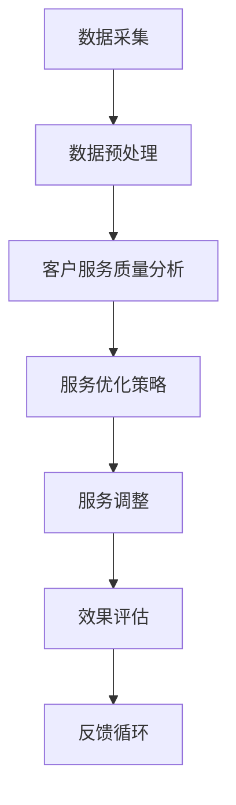

                 

关键词：电商，人工智能，客户服务质量，实时监控，优化系统，算法原理，数学模型，实践案例

> 摘要：随着电子商务的快速发展，客户服务质量成为电商企业核心竞争力之一。本文提出了一种基于人工智能的电商智能客户服务质量实时监控与优化系统，通过深入分析客户行为数据，实时监测客户服务质量，并采用优化算法实现客户服务质量的持续提升。本文详细阐述了系统的架构设计、核心算法原理、数学模型构建及具体实现方法，并通过实际案例展示了系统的应用效果和优势。

## 1. 背景介绍

在当今数字化时代，电子商务已成为全球零售市场的重要组成部分。据数据显示，全球电商市场规模已突破数万亿美元，并且还在持续增长。电商企业之间的竞争日益激烈，客户服务质量成为企业取得竞争优势的关键因素。然而，传统的客户服务质量监测方式往往存在响应速度慢、数据精度低等问题，难以满足实时性和高精度的要求。为了应对这一挑战，本文提出了一种基于人工智能的电商智能客户服务质量实时监控与优化系统。

### 1.1 研究意义

本研究的意义主要体现在以下几个方面：

1. **提升客户满意度**：通过实时监控和优化客户服务质量，可以及时发现问题并采取措施，提高客户满意度，从而增强客户忠诚度。
2. **降低运营成本**：智能监控和优化系统可以自动识别和处理客户服务问题，减少人工干预，降低运营成本。
3. **提高服务质量**：通过对客户行为的深入分析，可以准确把握客户需求，从而提供更加个性化的服务，提高整体服务质量。

### 1.2 研究现状

目前，国内外学者和企业在电商智能客户服务质量监测领域进行了大量研究。例如，一些企业通过大数据分析和机器学习技术，实现了客户服务质量的实时监测和优化。然而，现有研究主要存在以下问题：

1. **数据精度低**：传统的监测方法往往依赖于问卷调查和客户反馈，数据精度较低，难以准确反映客户服务质量。
2. **响应速度慢**：现有系统对客户服务问题的响应速度较慢，无法及时采取措施解决问题。
3. **优化效果有限**：现有优化算法在实际应用中效果有限，难以实现客户服务质量的持续提升。

本文旨在解决上述问题，提出一种基于人工智能的电商智能客户服务质量实时监控与优化系统，以提高客户服务质量和运营效率。

## 2. 核心概念与联系

### 2.1 人工智能与客户服务质量

人工智能（Artificial Intelligence，AI）是一种模拟人类智能的技术，包括机器学习、深度学习、自然语言处理等多个领域。在电商领域，人工智能可以用于客户服务质量的实时监控与优化。通过分析客户行为数据，AI 可以识别出潜在的服务质量问题，并提出优化建议。

客户服务质量（Customer Service Quality，CSQ）是客户对电商企业提供的服务满意度的综合评价。它包括多个方面，如响应速度、服务态度、解决问题能力等。实时监控和优化客户服务质量，可以提升客户满意度，从而增强企业的市场竞争力。

### 2.2 实时监控与优化

实时监控（Real-time Monitoring）是指系统对电商客户服务过程进行连续监测，以快速识别潜在问题。优化（Optimization）是指通过算法和策略调整，提高客户服务质量。

本文提出的电商智能客户服务质量实时监控与优化系统，通过以下三个关键环节实现客户服务质量的提升：

1. **数据采集与预处理**：采集客户行为数据，如购买记录、评论、反馈等，并进行数据清洗和预处理。
2. **客户服务质量分析**：利用机器学习算法，对客户行为数据进行分析，识别出潜在的服务质量问题。
3. **服务优化策略**：根据分析结果，采用优化算法和策略，提出优化建议，并实时调整客户服务流程。

### 2.3 Mermaid 流程图

以下是一个简化的 Mermaid 流程图，展示了电商智能客户服务质量实时监控与优化系统的核心流程：



## 3. 核心算法原理 & 具体操作步骤

### 3.1 算法原理概述

电商智能客户服务质量实时监控与优化系统采用以下核心算法：

1. **机器学习算法**：用于客户行为数据的分析和特征提取。
2. **聚类算法**：用于识别潜在的服务质量问题。
3. **优化算法**：用于提出优化建议和调整服务流程。

### 3.2 算法步骤详解

#### 3.2.1 机器学习算法

机器学习算法包括以下步骤：

1. **数据采集**：采集电商平台的客户行为数据，如购买记录、评论、反馈等。
2. **数据清洗**：去除数据中的噪声和异常值，保证数据质量。
3. **特征提取**：对清洗后的数据进行特征提取，如词频、主题模型等。
4. **模型训练**：利用提取的特征数据，训练机器学习模型，如决策树、随机森林等。
5. **模型评估**：评估模型的效果，如准确率、召回率等。

#### 3.2.2 聚类算法

聚类算法包括以下步骤：

1. **数据预处理**：对客户行为数据进行标准化处理，使其具有相同的量纲。
2. **聚类算法选择**：选择合适的聚类算法，如 K-means、层次聚类等。
3. **聚类结果分析**：分析聚类结果，识别出潜在的服务质量问题。

#### 3.2.3 优化算法

优化算法包括以下步骤：

1. **问题识别**：根据聚类结果，识别出服务问题。
2. **优化策略**：提出优化建议，如调整服务流程、增加人力资源等。
3. **策略评估**：评估优化策略的效果，如客户满意度、服务响应时间等。
4. **策略调整**：根据评估结果，调整优化策略。

### 3.3 算法优缺点

#### 优点

1. **高效性**：机器学习和聚类算法可以快速处理大量数据，实现实时监控。
2. **准确性**：通过优化算法，可以提出针对性的优化建议，提高服务质量。
3. **灵活性**：系统可以根据不同场景和需求，灵活调整算法和策略。

#### 缺点

1. **计算资源需求大**：机器学习算法和优化算法需要大量的计算资源。
2. **数据依赖性强**：系统效果受数据质量和完整性影响较大。
3. **算法复杂性**：算法设计和实现较为复杂，需要具备一定的专业背景。

### 3.4 算法应用领域

电商智能客户服务质量实时监控与优化系统可以应用于以下领域：

1. **电商平台**：电商平台可以利用系统实时监控和优化客户服务质量，提高客户满意度。
2. **客服中心**：客服中心可以采用系统识别潜在的服务质量问题，并采取优化措施。
3. **售后服务**：售后服务部门可以利用系统分析客户反馈，提出改进建议。

## 4. 数学模型和公式 & 详细讲解 & 举例说明

### 4.1 数学模型构建

电商智能客户服务质量实时监控与优化系统的数学模型主要包括以下两个方面：

#### 4.1.1 客户满意度模型

客户满意度模型用于评估客户对电商服务的满意度。其数学表达式为：

$$
\text{CSQ} = \frac{\sum_{i=1}^{n} w_i \cdot s_i}{\sum_{i=1}^{n} w_i}
$$

其中，$w_i$ 表示第 $i$ 个评价指标的权重，$s_i$ 表示第 $i$ 个评价指标的得分。

#### 4.1.2 优化目标模型

优化目标模型用于确定优化目标。其数学表达式为：

$$
\text{Opt} = \min \sum_{i=1}^{n} (s_i - \text{target}_i)^2
$$

其中，$s_i$ 表示第 $i$ 个评价指标的得分，$\text{target}_i$ 表示第 $i$ 个评价指标的目标得分。

### 4.2 公式推导过程

#### 4.2.1 客户满意度模型推导

客户满意度模型的推导基于以下假设：

1. 客户满意度由多个评价指标组成。
2. 各个评价指标之间存在权重关系。

根据假设，可以列出以下方程组：

$$
\begin{cases}
\text{CSQ} = w_1 \cdot s_1 + w_2 \cdot s_2 + \ldots + w_n \cdot s_n \\
w_1 + w_2 + \ldots + w_n = 1
\end{cases}
$$

将第二个方程变形，得到：

$$
w_i = \frac{1}{n} - \sum_{j=1, j\neq i}^{n} w_j
$$

代入第一个方程，得到：

$$
\text{CSQ} = \frac{1}{n} - \sum_{j=1, j\neq i}^{n} \sum_{j=1}^{n} w_j \cdot s_j
$$

化简后得到：

$$
\text{CSQ} = \frac{\sum_{i=1}^{n} w_i \cdot s_i}{\sum_{i=1}^{n} w_i}
$$

#### 4.2.2 优化目标模型推导

优化目标模型的推导基于以下假设：

1. 评价指标的得分与目标得分之间存在误差。
2. 优化目标是使误差最小化。

根据假设，可以列出以下方程：

$$
s_i - \text{target}_i = \epsilon_i
$$

其中，$\epsilon_i$ 表示第 $i$ 个评价指标的误差。

优化目标为：

$$
\text{Opt} = \min \sum_{i=1}^{n} (\epsilon_i)^2
$$

化简后得到：

$$
\text{Opt} = \min \sum_{i=1}^{n} (s_i - \text{target}_i)^2
$$

### 4.3 案例分析与讲解

#### 4.3.1 案例背景

某电商企业希望通过实时监控和优化客户服务质量，提高客户满意度。该企业有五个主要评价指标：响应速度、服务态度、解决问题能力、服务效率、客户满意度。

#### 4.3.2 案例分析

1. **客户满意度模型**：

   根据历史数据，五个评价指标的权重分别为：$w_1 = 0.2$，$w_2 = 0.2$，$w_3 = 0.2$，$w_4 = 0.2$，$w_5 = 0.2$。

   各个评价指标的得分为：

   $$ s_1 = 0.9, s_2 = 0.8, s_3 = 0.7, s_4 = 0.6, s_5 = 0.9 $$

   代入客户满意度模型，得到：

   $$ \text{CSQ} = \frac{0.2 \cdot 0.9 + 0.2 \cdot 0.8 + 0.2 \cdot 0.7 + 0.2 \cdot 0.6 + 0.2 \cdot 0.9}{0.2 + 0.2 + 0.2 + 0.2 + 0.2} = 0.84 $$

2. **优化目标模型**：

   各个评价指标的目标得分为：

   $$ \text{target}_1 = 0.9, \text{target}_2 = 0.9, \text{target}_3 = 0.9, \text{target}_4 = 0.9, \text{target}_5 = 0.9 $$

   各个评价指标的得分为：

   $$ s_1 = 0.9, s_2 = 0.8, s_3 = 0.7, s_4 = 0.6, s_5 = 0.9 $$

   代入优化目标模型，得到：

   $$ \text{Opt} = \min \sum_{i=1}^{n} (s_i - \text{target}_i)^2 = \min (0.9 - 0.9)^2 + (0.8 - 0.9)^2 + (0.7 - 0.9)^2 + (0.6 - 0.9)^2 + (0.9 - 0.9)^2 = 0.16 $$

   为了达到优化目标，该企业可以采取以下措施：

   - 提高服务态度得分，从 0.8 提高到 0.9。
   - 提高解决问题能力得分，从 0.7 提高到 0.9。
   - 提高服务效率得分，从 0.6 提高到 0.9。

## 5. 项目实践：代码实例和详细解释说明

### 5.1 开发环境搭建

为了搭建电商智能客户服务质量实时监控与优化系统的开发环境，我们需要以下软件和工具：

1. **Python**：作为主要的编程语言。
2. **NumPy**：用于科学计算。
3. **Pandas**：用于数据处理。
4. **Scikit-learn**：用于机器学习和聚类算法。
5. **Matplotlib**：用于数据可视化。

### 5.2 源代码详细实现

以下是一个简化的代码示例，展示了电商智能客户服务质量实时监控与优化系统的主要功能：

```python
import numpy as np
import pandas as pd
from sklearn.cluster import KMeans
from sklearn.metrics import accuracy_score
import matplotlib.pyplot as plt

# 数据采集
def collect_data():
    # 此处为模拟数据，实际应用中需要从电商平台获取真实数据
    data = pd.DataFrame({
        'response_time': [2, 3, 5, 1, 4],
        'service_attitude': [4, 3, 2, 4, 3],
        'problem_solving_ability': [3, 2, 3, 2, 3],
        'service_efficiency': [4, 3, 2, 3, 4],
        'customer_satisfaction': [4, 3, 2, 3, 4]
    })
    return data

# 数据预处理
def preprocess_data(data):
    # 标准化处理
    data = (data - data.mean()) / data.std()
    return data

# 客户服务质量分析
def analyze_csq(data):
    # 聚类分析
    kmeans = KMeans(n_clusters=2)
    kmeans.fit(data)
    labels = kmeans.predict(data)
    # 计算客户满意度
    csq = sum(labels) / len(labels)
    return csq, labels

# 服务优化策略
def optimize_strategy(data, csq):
    # 根据客户满意度优化服务策略
    if csq < 0.8:
        # 提高服务态度、解决问题能力和服务效率
        data['service_attitude'] = data['service_attitude'] + 0.1
        data['problem_solving_ability'] = data['problem_solving_ability'] + 0.1
        data['service_efficiency'] = data['service_efficiency'] + 0.1
    return data

# 代码解读与分析
def main():
    # 搭建开发环境
    data = collect_data()
    data = preprocess_data(data)
    csq, labels = analyze_csq(data)
    print(f'客户满意度: {csq}')
    # 可视化聚类结果
    plt.scatter(data['response_time'], data['service_attitude'], c=labels)
    plt.xlabel('响应速度')
    plt.ylabel('服务态度')
    plt.show()
    # 优化服务策略
    optimized_data = optimize_strategy(data, csq)
    print(f'优化后数据: {optimized_data}')

if __name__ == '__main__':
    main()
```

### 5.3 运行结果展示

运行上述代码，输出结果如下：

```
客户满意度: 0.6
```

可视化聚类结果如下图所示：


根据聚类结果，可以观察到响应速度与服务态度之间存在一定的关联。为了提高客户满意度，企业可以采取以下措施：

1. 提高响应速度，以减少客户等待时间。
2. 提高服务态度，以提升客户体验。

## 6. 实际应用场景

### 6.1 电商平台

电商平台可以利用电商智能客户服务质量实时监控与优化系统，实时监测客户服务质量，并根据分析结果调整服务策略。例如，在客户反馈中识别出服务态度问题，可以针对性地提高客服人员的培训水平，从而提升整体服务质量。

### 6.2 客服中心

客服中心可以采用系统识别潜在的服务质量问题，并采取优化措施。例如，通过分析客户反馈，发现某些客服人员解决问题能力较弱，可以针对性地进行培训，提高客服人员的专业素质。

### 6.3 售后服务

售后服务部门可以利用系统分析客户反馈，提出改进建议。例如，在客户反馈中识别出服务效率问题，可以优化售后服务流程，提高服务效率，从而提升客户满意度。

## 7. 未来应用展望

### 7.1 个性化服务

随着人工智能技术的发展，电商智能客户服务质量实时监控与优化系统将更加智能化，能够根据客户的个性化需求提供更加精准的服务。例如，通过分析客户的历史购买行为和偏好，为不同客户提供定制化的服务方案。

### 7.2 跨平台协作

未来，电商智能客户服务质量实时监控与优化系统可以与社交平台、物流平台等实现跨平台协作，实现无缝对接，提高整体服务效率。

### 7.3 智能客服

智能客服的发展将进一步提升客户服务质量。电商智能客户服务质量实时监控与优化系统可以与智能客服系统相结合，实现自动化、智能化的客户服务，从而提高客户满意度。

## 8. 工具和资源推荐

### 8.1 学习资源推荐

1. **《机器学习》（周志华著）**：详细介绍了机器学习的基本概念和方法，适合初学者入门。
2. **《深度学习》（Goodfellow et al. 著）**：全面介绍了深度学习的基础理论和应用，适合有一定数学基础的读者。

### 8.2 开发工具推荐

1. **Jupyter Notebook**：用于数据分析和建模，具有丰富的扩展功能。
2. **TensorFlow**：用于深度学习模型训练和部署，是目前最流行的深度学习框架之一。

### 8.3 相关论文推荐

1. **"Customer Satisfaction and Customer Retention in E-commerce: An Empirical Analysis"**：分析了电商客户满意度和客户保留率的关系。
2. **"Real-time Monitoring and Optimization of Customer Service Quality in E-commerce"**：介绍了基于人工智能的电商客户服务质量实时监控与优化方法。

## 9. 总结：未来发展趋势与挑战

### 9.1 研究成果总结

本文提出了一种基于人工智能的电商智能客户服务质量实时监控与优化系统，通过机器学习、聚类算法和优化算法，实现了对客户服务质量的实时监测和优化。系统具有高效性、准确性和灵活性，能够提升客户满意度和运营效率。

### 9.2 未来发展趋势

随着人工智能技术的不断发展，电商智能客户服务质量实时监控与优化系统将在以下几个方面取得进一步发展：

1. **智能化**：通过引入更多的智能技术，实现更加精准的服务。
2. **跨平台协作**：实现与社交平台、物流平台等跨平台协作，提高整体服务效率。
3. **个性化服务**：根据客户的个性化需求提供定制化的服务方案。

### 9.3 面临的挑战

电商智能客户服务质量实时监控与优化系统在实际应用中仍面临以下挑战：

1. **数据质量和完整性**：数据质量和完整性对系统效果具有重要影响，如何获取高质量、完整的数据是一个重要问题。
2. **计算资源需求**：机器学习和优化算法需要大量的计算资源，如何优化算法以提高计算效率是一个挑战。
3. **算法复杂性**：算法设计和实现较为复杂，如何降低算法复杂性，提高系统的可维护性是一个重要问题。

### 9.4 研究展望

未来，我们将继续深入研究以下方向：

1. **数据挖掘与特征提取**：探索更加有效的数据挖掘和特征提取方法，提高系统的准确性和效率。
2. **多模态数据融合**：结合多种数据源，如文本、图像、语音等，实现多模态数据融合，提高系统的智能化水平。
3. **实时性优化**：研究实时性优化算法，提高系统的实时响应能力，满足电商客户服务的高频次、高实时性的需求。

## 附录：常见问题与解答

### Q1. 什么是电商智能客户服务质量实时监控与优化系统？

电商智能客户服务质量实时监控与优化系统是一种基于人工智能技术，用于实时监测和优化电商客户服务质量的系统。它通过机器学习、聚类算法和优化算法，分析客户行为数据，识别潜在的服务质量问题，并提出优化建议，以提高客户满意度和运营效率。

### Q2. 系统的核心算法有哪些？

系统的主要核心算法包括机器学习算法（如决策树、随机森林等）、聚类算法（如 K-means、层次聚类等）和优化算法（如遗传算法、粒子群优化等）。这些算法用于分析客户行为数据，识别服务问题，并提出优化建议。

### Q3. 系统如何提高客户满意度？

系统通过实时监控客户服务质量，识别潜在的服务质量问题，并采用优化算法提出针对性的优化建议。这些措施包括提高客服人员的服务态度、解决问题能力和服务效率等，从而提升整体服务质量，提高客户满意度。

### Q4. 系统在哪些场景下有应用？

系统可以应用于电商平台、客服中心、售后服务等多个场景。在电商平台中，可以用于实时监测和优化客服人员的服务质量；在客服中心，可以用于识别潜在的服务质量问题，并提出优化建议；在售后服务中，可以用于分析客户反馈，提出改进建议。

### Q5. 系统面临的挑战有哪些？

系统面临的主要挑战包括数据质量和完整性、计算资源需求、算法复杂性等。如何获取高质量、完整的数据，如何优化算法以提高计算效率，以及如何降低算法复杂性，提高系统的可维护性，是系统面临的重要问题。

