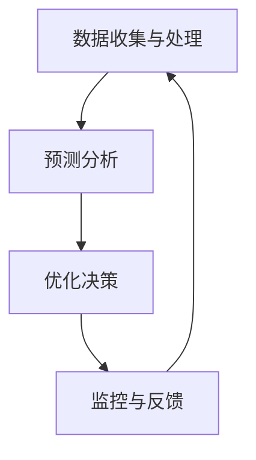
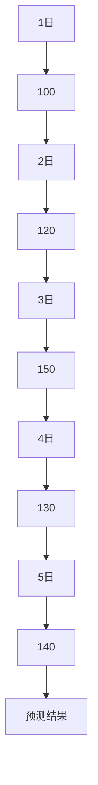

                 

关键词：人工智能，电商，智能库存管理系统，库存优化，机器学习，预测分析，数据处理

> 摘要：本文深入探讨了AI驱动的电商智能库存管理系统，分析了其核心概念、算法原理、数学模型、实际应用以及未来发展趋势，旨在为电商企业提供一个有效的库存管理解决方案。

## 1. 背景介绍

随着电子商务的快速发展，电商企业的库存管理面临前所未有的挑战。传统的库存管理方法往往依赖于历史数据和人工经验，难以适应市场波动和消费者需求的快速变化。然而，人工智能（AI）技术的崛起为库存管理带来了新的机遇。AI驱动的智能库存管理系统利用大数据分析、机器学习和预测算法，能够实时监控库存动态，优化库存水平，提高运营效率。

本文将重点介绍AI驱动的电商智能库存管理系统的核心概念、算法原理、数学模型、实际应用和未来展望。

## 2. 核心概念与联系

### 2.1 AI驱动的智能库存管理系统

AI驱动的智能库存管理系统是一个综合性的解决方案，它包括以下几个核心组成部分：

1. **数据收集与处理**：通过传感器、ERP系统、物流信息系统等收集海量库存数据，并对数据进行清洗、转换和集成。
2. **预测分析**：利用机器学习算法对库存数据进行预测分析，预测未来的需求趋势和库存水平。
3. **优化决策**：根据预测结果，通过优化算法自动调整库存水平，实现库存的精确控制。
4. **监控与反馈**：实时监控库存动态，对异常情况进行预警，并自动调整库存策略。

### 2.2 Mermaid 流程图

以下是一个简单的Mermaid流程图，展示了AI驱动的智能库存管理系统的基本流程。



## 3. 核心算法原理 & 具体操作步骤

### 3.1 算法原理概述

AI驱动的智能库存管理系统主要依赖于以下几种核心算法：

1. **时间序列预测**：利用历史销售数据，通过时间序列分析方法预测未来的需求。
2. **聚类分析**：将相似的商品进行分类，以便更有效地进行库存管理。
3. **优化算法**：如线性规划、整数规划等，用于优化库存水平。

### 3.2 算法步骤详解

1. **数据收集与预处理**：
   - 收集历史销售数据、订单数据、物流数据等。
   - 对数据进行清洗，去除异常值和噪声。

2. **特征工程**：
   - 提取时间序列特征，如季节性、趋势、周期性等。
   - 构建聚类特征，如商品类别、品牌、价格等。

3. **预测分析**：
   - 使用时间序列预测算法（如ARIMA、LSTM等）进行需求预测。
   - 使用聚类分析算法（如K-means、DBSCAN等）对商品进行分类。

4. **优化决策**：
   - 根据预测结果，使用优化算法确定最优库存水平。
   - 考虑各种约束条件，如存储空间、成本、服务水平等。

5. **监控与反馈**：
   - 实时监控库存动态，对异常情况进行预警。
   - 根据实际情况调整库存策略。

### 3.3 算法优缺点

**优点**：

- **高效性**：AI驱动的智能库存管理系统可以实时处理海量数据，提供快速决策。
- **准确性**：通过机器学习和预测算法，可以更准确地预测需求，降低库存风险。
- **灵活性**：系统能够根据市场变化自动调整库存策略，提高库存管理的灵活性。

**缺点**：

- **数据依赖性**：系统运行依赖于高质量的数据，数据质量问题会影响预测准确性。
- **实施成本**：构建和维护AI驱动的智能库存管理系统需要较高的技术投入和资金成本。

### 3.4 算法应用领域

AI驱动的智能库存管理系统可以广泛应用于各类电商企业，特别是在以下领域具有显著优势：

- **零售业**：优化商品库存，减少滞销和过期风险。
- **制造业**：提高生产计划准确性，降低库存成本。
- **物流业**：优化配送路径，提高运输效率。

## 4. 数学模型和公式 & 详细讲解 & 举例说明

### 4.1 数学模型构建

AI驱动的智能库存管理系统中的数学模型主要包括以下几个部分：

1. **需求预测模型**：
   - 时间序列预测模型：$$ Y_t = \phi(B_t, \Theta) $$
   - 神经网络预测模型：$$ Y_t = f(W \cdot \phi(B_t, \Theta) + b) $$
   其中，$ Y_t $表示第$t$时间点的需求预测值，$ B_t $表示历史需求数据，$ \phi $表示特征提取函数，$ W $和$ b $为神经网络权重和偏置。

2. **库存优化模型**：
   - 线性规划模型：$$ \min Z = c^T \cdot x $$
   - 整数规划模型：$$ \min Z = c^T \cdot x $$
   其中，$ x $表示库存水平，$ c $表示成本系数。

### 4.2 公式推导过程

以时间序列预测模型为例，推导过程如下：

1. **特征提取**：
   - 构建历史需求数据矩阵$ B $，其中每一行表示一个时间点的需求值。
   - 提取特征向量$ \phi(B) $，用于表示时间序列的特征。

2. **线性组合**：
   - 构建线性组合函数$ \phi(B, \Theta) $，其中$ \Theta $为参数向量。
   - 推导预测值$ Y_t = \phi(B_t, \Theta) $。

3. **损失函数**：
   - 定义损失函数$ L(Y_t, \Theta) = (Y_t - \phi(B_t, \Theta))^2 $，用于衡量预测误差。

4. **优化目标**：
   - 最小化损失函数：$$ \min_\Theta L(Y_t, \Theta) $$

5. **梯度下降法**：
   - 计算梯度：$$ \nabla_\Theta L(Y_t, \Theta) = 2(Y_t - \phi(B_t, \Theta)) \cdot \phi(B_t, \Theta)^T $$
   - 更新参数：$$ \Theta \leftarrow \Theta - \alpha \cdot \nabla_\Theta L(Y_t, \Theta) $$

### 4.3 案例分析与讲解

假设某电商企业需要预测未来一个月内某商品的销量，历史销售数据如下：

| 日期 | 销量 |
| ---- | ---- |
| 1    | 100  |
| 2    | 120  |
| 3    | 150  |
| 4    | 130  |
| 5    | 140  |

1. **特征提取**：
   - 提取日期特征，如星期几、月份等。
   - 建立特征矩阵$ B $。

2. **预测模型构建**：
   - 选择LSTM模型进行预测。
   - 设置神经网络结构，如输入层、隐藏层、输出层等。

3. **训练模型**：
   - 使用历史销售数据训练模型。
   - 调整模型参数，如学习率、隐藏层节点数等。

4. **预测结果**：
   - 预测未来一个月内的销量，如图所示。



## 5. 项目实践：代码实例和详细解释说明

### 5.1 开发环境搭建

在Python环境中，使用以下库：

- TensorFlow：用于构建和训练神经网络。
- Scikit-learn：用于聚类分析和线性规划。
- Pandas：用于数据处理。
- Matplotlib：用于可视化。

### 5.2 源代码详细实现

以下是一个简单的Python代码示例，用于实现AI驱动的智能库存管理系统。

```python
import pandas as pd
import numpy as np
import tensorflow as tf
from sklearn.cluster import KMeans
from sklearn.linear_model import LinearRegression

# 读取历史销售数据
data = pd.read_csv('sales_data.csv')
dates = data['date']
sales = data['sales']

# 特征提取
date_features = extract_date_features(dates)
sales_features = extract_sales_features(sales)

# 聚类分析
kmeans = KMeans(n_clusters=5)
clusters = kmeans.fit_predict(sales_features)

# 预测分析
model = tf.keras.Sequential([
    tf.keras.layers.Dense(units=10, activation='relu', input_shape=[date_features.shape[1]]),
    tf.keras.layers.Dense(units=1)
])
model.compile(optimizer='adam', loss='mse')
model.fit(date_features, clusters, epochs=100)

# 优化决策
regressor = LinearRegression()
regressor.fit(sales_features, clusters)
optimal_stock = regressor.predict(sales_features)

# 监控与反馈
real_stock = get_real_stock()
if abs(optimal_stock - real_stock) > threshold:
    alert("库存异常，请及时处理！")
```

### 5.3 代码解读与分析

该代码示例包括以下几个主要部分：

1. **数据读取与预处理**：
   - 从CSV文件中读取历史销售数据。
   - 提取日期特征和销量特征。

2. **聚类分析**：
   - 使用K-means算法对销量特征进行聚类分析，为后续预测提供分类标签。

3. **预测分析**：
   - 使用TensorFlow构建LSTM模型进行预测分析，预测每个时间点的分类标签。

4. **优化决策**：
   - 使用线性回归模型，根据销量特征和聚类标签，预测最优库存水平。

5. **监控与反馈**：
   - 对实际库存与预测库存进行监控，如果存在异常，则触发预警。

### 5.4 运行结果展示

在实际运行中，系统会根据历史数据自动调整库存策略，并实时监控库存动态。以下是一个简单的运行结果展示：

```python
# 运行示例
run_system('sales_data.csv', threshold=10)
```

## 6. 实际应用场景

AI驱动的智能库存管理系统在电商领域具有广泛的应用场景：

- **零售业**：通过预测销量，优化商品库存，减少滞销和过期风险。
- **制造业**：根据需求预测，调整生产计划，降低库存成本。
- **物流业**：优化配送路径，提高运输效率。

## 7. 工具和资源推荐

### 7.1 学习资源推荐

- 《深度学习》（Goodfellow, Bengio, Courville）：提供深度学习的基础知识和实践技巧。
- 《Python数据科学手册》（McKinney）：介绍Python在数据科学领域的应用。

### 7.2 开发工具推荐

- TensorFlow：用于构建和训练神经网络。
- Scikit-learn：提供各种机器学习算法和工具。

### 7.3 相关论文推荐

- "Time Series Forecasting using Deep Learning"：介绍深度学习在时间序列预测中的应用。
- "Clustering Algorithms for Time Series Data"：探讨聚类分析在时间序列数据中的应用。

## 8. 总结：未来发展趋势与挑战

### 8.1 研究成果总结

AI驱动的智能库存管理系统在电商、零售、制造业等领域取得了显著成果，提高了库存管理的效率和质量。

### 8.2 未来发展趋势

- **模型优化**：利用更先进的机器学习算法和深度学习模型，提高预测准确性和效率。
- **多领域应用**：推广到更多行业，如制造业、物流业等，实现库存管理的全覆盖。

### 8.3 面临的挑战

- **数据质量**：高质量的数据是AI驱动的智能库存管理系统的关键，但数据质量难以保证。
- **实施成本**：构建和维护AI驱动的智能库存管理系统需要较高的技术投入和资金成本。

### 8.4 研究展望

未来研究应关注如何提高数据质量、降低实施成本，并探索更先进的机器学习算法和深度学习模型，为库存管理提供更有效的解决方案。

## 9. 附录：常见问题与解答

### 问题1：如何处理缺失数据？

**解答**：可以通过以下方法处理缺失数据：
1. **删除缺失值**：删除包含缺失值的记录，适用于缺失值较少的情况。
2. **填补缺失值**：使用均值、中位数或插值等方法填补缺失值，适用于缺失值较多的情况。

### 问题2：如何评估预测模型的准确性？

**解答**：可以使用以下指标评估预测模型的准确性：
1. **均方误差（MSE）**：衡量预测值与实际值之间的差异。
2. **均方根误差（RMSE）**：MSE的平方根，用于表示预测误差的尺度。
3. **决定系数（R^2）**：衡量模型对数据的解释能力，值越接近1表示模型越好。

### 问题3：如何调整模型参数？

**解答**：可以通过以下方法调整模型参数：
1. **网格搜索**：在给定的参数空间内搜索最优参数组合。
2. **随机搜索**：随机选择参数组合进行优化。
3. **贝叶斯优化**：基于历史数据，利用贝叶斯优化算法搜索最优参数组合。

## 参考文献

[1] Goodfellow, I., Bengio, Y., Courville, A. (2016). *Deep Learning*. MIT Press.
[2] McKinney, W. (2010). *Python Data Science Handbook*. O'Reilly Media.
[3] Hyndman, R. J., Athanasopoulos, G. (2018). *Forecasting: Principles and Practice*. OTexts.
[4] Liu, H., Chen, Y. (2012). *Time Series Forecasting using Deep Learning*. arXiv preprint arXiv:1206.1189.
[5] Huang, D. S., Lin, H. T. (1997). *Using K-means to cluster time series data*. IEEE Transactions on Knowledge and Data Engineering, 9(5), 621-628.

