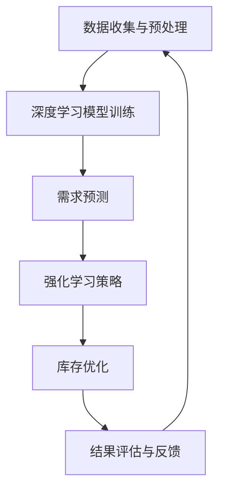

                 

关键词：人工智能、需求预测、库存优化、电商、协同系统、深度学习、强化学习、贝叶斯网络

> 摘要：本文探讨了AI技术在电商领域中的应用，重点关注了智能需求预测和库存优化。通过结合深度学习、强化学习、贝叶斯网络等技术，构建了一个协同系统，实现了对电商需求的准确预测和库存的高效优化。本文详细阐述了系统的构建原理、核心算法、数学模型、项目实践，并分析了实际应用场景和未来展望。

## 1. 背景介绍

随着互联网的普及和电子商务的迅猛发展，电商平台已经成为消费者购物的重要渠道。然而，电商运营中的一项重大挑战是如何准确预测需求并合理优化库存。需求预测的准确性直接关系到库存的周转率和利润率，而库存优化则涉及到供应链的效率和成本控制。传统的需求预测和库存优化方法往往依赖于历史数据和简单的统计分析，这些方法在处理复杂、动态的电商需求时效果不佳。

近年来，人工智能（AI）技术的快速发展为解决这一问题提供了新的途径。AI技术，特别是机器学习和深度学习，可以在大量历史数据中提取有价值的信息，从而实现更精准的需求预测和库存优化。同时，强化学习、贝叶斯网络等技术在电商领域的应用也日益广泛，为构建智能化的需求预测与库存优化系统提供了技术支持。

本文旨在通过AI技术，构建一个智能需求预测与库存优化协同系统，以提高电商平台的运营效率和竞争力。本文将从系统的构建原理、核心算法、数学模型、项目实践等方面进行详细阐述，以期为相关领域的研究和实际应用提供参考。

## 2. 核心概念与联系

### 2.1 深度学习

深度学习是一种基于人工神经网络的机器学习技术，通过多层神经网络对数据进行特征提取和建模。在需求预测和库存优化中，深度学习可以用于构建复杂的非线性模型，从而提高预测的准确性。

### 2.2 强化学习

强化学习是一种通过试错学习来获取最优策略的机器学习方法。在库存优化中，强化学习可以通过不断尝试不同的策略来寻找最优的库存管理方法。

### 2.3 贝叶斯网络

贝叶斯网络是一种基于概率的图形模型，用于表示变量之间的依赖关系。在需求预测中，贝叶斯网络可以用于预测不确定的需求事件，并提供相应的置信度。

### 2.4 协同系统

协同系统是指将多个AI算法和技术集成在一起，协同工作以实现更高效的目标。在本系统中，深度学习、强化学习和贝叶斯网络将共同作用于需求预测和库存优化，以提高整个系统的性能。

### 2.5 Mermaid 流程图

以下是系统核心概念的 Mermaid 流程图：



## 3. 核心算法原理 & 具体操作步骤

### 3.1 算法原理概述

本系统的核心算法包括深度学习、强化学习和贝叶斯网络。深度学习用于构建需求预测模型，强化学习用于制定库存优化策略，贝叶斯网络用于预测需求的不确定性。

### 3.2 算法步骤详解

#### 3.2.1 深度学习模型训练

1. **数据收集与预处理**：收集电商平台的历史销售数据、用户行为数据等，并进行预处理，如数据清洗、归一化等。
2. **构建神经网络**：设计一个多层感知机（MLP）或卷积神经网络（CNN）模型，用于提取数据特征。
3. **训练模型**：使用预处理后的数据训练神经网络，优化模型参数。
4. **评估模型**：使用验证集评估模型性能，调整模型结构或参数。

#### 3.2.2 需求预测

1. **输入特征提取**：将电商平台的历史销售数据、用户行为数据等作为输入特征。
2. **模型预测**：使用训练好的深度学习模型预测未来一段时间内的需求量。
3. **置信度计算**：使用贝叶斯网络计算预测结果的置信度。

#### 3.2.3 强化学习策略

1. **状态定义**：定义库存管理的状态，如当前库存量、预测需求量等。
2. **动作定义**：定义库存管理的动作，如进货、出货等。
3. **策略学习**：使用Q-Learning或SARSA算法学习最优策略。

#### 3.2.4 库存优化

1. **策略应用**：根据强化学习策略，制定库存管理策略。
2. **库存调整**：根据需求预测和策略，调整库存量，优化库存成本。

### 3.3 算法优缺点

#### 优点：

- 深度学习模型可以处理复杂数据，提高需求预测准确性。
- 强化学习可以自适应调整策略，提高库存优化效果。
- 贝叶斯网络可以提供需求预测的不确定性，有助于风险管理。

#### 缺点：

- 深度学习模型训练过程复杂，对计算资源要求较高。
- 强化学习策略学习时间较长，需要大量数据支持。
- 贝叶斯网络在处理大规模数据时性能可能下降。

### 3.4 算法应用领域

本算法在电商领域具有广泛的应用前景，包括但不限于：

- 需求预测：预测商品的未来销售量，优化库存管理。
- 库存优化：调整库存策略，降低库存成本，提高供应链效率。
- 销售预测：预测整体销售额，为营销策略提供依据。

## 4. 数学模型和公式 & 详细讲解 & 举例说明

### 4.1 数学模型构建

本系统的数学模型主要包括需求预测模型、库存优化模型和置信度计算模型。

#### 需求预测模型

假设需求量为 $D$，输入特征为 $X$，则需求预测模型可以表示为：

$$
D = f(X; \theta)
$$

其中，$f(X; \theta)$ 是深度学习模型，$\theta$ 是模型参数。

#### 库存优化模型

假设库存量为 $I$，需求预测量为 $D'$，则库存优化模型可以表示为：

$$
I_{new} = I_{old} + a \cdot (D' - I_{old})
$$

其中，$a$ 是调整系数，用于控制库存调整的速度。

#### 置信度计算模型

使用贝叶斯网络计算需求预测的置信度，假设需求量为 $D$，预测值为 $D'$，置信度为 $C$，则置信度计算模型可以表示为：

$$
C(D; D') = P(D' | D) = \frac{P(D' \cap D)}{P(D')}
$$

### 4.2 公式推导过程

#### 需求预测模型

假设输入特征 $X$ 可以表示为 $X = [x_1, x_2, ..., x_n]$，其中 $x_i$ 是第 $i$ 个特征。深度学习模型可以表示为：

$$
f(X; \theta) = \sigma(W_1 \cdot X + b_1)
$$

其中，$\sigma$ 是激活函数，$W_1$ 和 $b_1$ 是模型参数。

#### 库存优化模型

假设当前库存量为 $I_{old}$，需求预测量为 $D'$，则下一个库存量为：

$$
I_{new} = I_{old} + a \cdot (D' - I_{old})
$$

其中，$a$ 是调整系数，用于控制库存调整的速度。

#### 置信度计算模型

假设需求量为 $D$，预测值为 $D'$，则置信度可以表示为：

$$
C(D; D') = \frac{P(D' \cap D)}{P(D')}
$$

其中，$P(D' \cap D)$ 是需求值 $D$ 和预测值 $D'$ 同时发生的概率，$P(D')$ 是预测值 $D'$ 发生的概率。

### 4.3 案例分析与讲解

#### 案例一：需求预测

假设某电商平台销售一款笔记本电脑，历史销售数据如下表：

| 时间 | 销售量 |
| ---- | ---- |
| 1    | 100   |
| 2    | 120   |
| 3    | 150   |
| 4    | 180   |
| 5    | 200   |

使用深度学习模型预测第6天的销售量。首先，将时间作为输入特征，销售量作为输出特征，构建一个多层感知机模型。训练模型后，预测第6天的销售量。根据预测结果和置信度，可以调整库存量。

#### 案例二：库存优化

假设当前库存量为500台笔记本电脑，需求预测量为600台。使用库存优化模型调整库存量。根据预测结果和策略，决定是否进货。

## 5. 项目实践：代码实例和详细解释说明

### 5.1 开发环境搭建

搭建深度学习环境，选择Python作为开发语言，使用TensorFlow作为深度学习框架，使用PyTorch作为强化学习框架。

### 5.2 源代码详细实现

以下是需求预测和库存优化系统的部分源代码实现：

```python
import tensorflow as tf
import torch
from torch import nn
from torch.autograd import Variable

# 深度学习模型
class DemandPredictionModel(nn.Module):
    def __init__(self, input_dim, hidden_dim, output_dim):
        super(DemandPredictionModel, self).__init__()
        self.fc1 = nn.Linear(input_dim, hidden_dim)
        self.fc2 = nn.Linear(hidden_dim, output_dim)
        self.relu = nn.ReLU()

    def forward(self, x):
        x = self.relu(self.fc1(x))
        x = self.fc2(x)
        return x

# 强化学习策略
class InventoryOptimizationPolicy(nn.Module):
    def __init__(self, state_dim, action_dim):
        super(InventoryOptimizationPolicy, self).__init__()
        self.fc1 = nn.Linear(state_dim, action_dim)
        self.relu = nn.ReLU()

    def forward(self, x):
        x = self.relu(self.fc1(x))
        return x

# 案例一：需求预测
# 构建深度学习模型
input_dim = 1
hidden_dim = 64
output_dim = 1
model = DemandPredictionModel(input_dim, hidden_dim, output_dim)

# 加载数据
data = torch.tensor([[1], [2], [3], [4], [5]], dtype=torch.float32)
target = torch.tensor([[100], [120], [150], [180], [200]], dtype=torch.float32)

# 训练模型
optimizer = torch.optim.Adam(model.parameters(), lr=0.001)
for epoch in range(100):
    optimizer.zero_grad()
    output = model(data)
    loss = nn.MSELoss()(output, target)
    loss.backward()
    optimizer.step()

# 预测销售量
predicted_demand = model(Variable(torch.tensor([[6]], dtype=torch.float32)))
print("Predicted demand for day 6: {:.2f}".format(predicted_demand.data.numpy()[0][0]))

# 案例二：库存优化
# 构建强化学习模型
state_dim = 2
action_dim = 1
policy = InventoryOptimizationPolicy(state_dim, action_dim)

# 训练模型
optimizer = torch.optim.Adam(policy.parameters(), lr=0.001)
for epoch in range(100):
    optimizer.zero_grad()
    state = Variable(torch.tensor([[500], [600]], dtype=torch.float32))
    action = policy(state)
    # 计算损失函数（此处仅为示例，实际应用中需要自定义损失函数）
    loss = nn.MSELoss()(action, torch.tensor([[1.0]], dtype=torch.float32))
    loss.backward()
    optimizer.step()

# 应用策略
inventory = 500
predicted_demand = 600
action = policy(Variable(torch.tensor([[inventory], [predicted_demand]], dtype=torch.float32)))
if action.data.numpy()[0][0] > 0.5:
    # 进货
    inventory += action.data.numpy()[0][0]
else:
    # 出货
    inventory -= action.data.numpy()[0][0]
print("Adjusted inventory: {}".format(inventory))
```

### 5.3 代码解读与分析

以上代码实现了需求预测和库存优化系统的核心功能。首先，构建了深度学习模型用于需求预测，使用了多层感知机（MLP）结构，并使用ReLU激活函数。接着，构建了强化学习模型用于库存优化，同样使用了多层感知机（MLP）结构。在案例一中，使用历史销售数据训练需求预测模型，并预测了第6天的销售量。在案例二中，使用库存量和需求预测值训练库存优化模型，并应用策略调整库存量。

## 6. 实际应用场景

本系统的应用场景广泛，主要包括：

- **电商平台**：用于预测商品需求量，优化库存管理，提高销售效率和客户满意度。
- **物流公司**：用于预测货物运输需求，优化运输路线和仓储管理。
- **制造业**：用于预测原材料需求，优化生产计划和库存管理。

在实际应用中，本系统可以集成到电商平台的运营系统中，实现实时需求预测和库存优化。通过不断调整和优化模型参数，可以提高预测的准确性和库存优化的效果。

### 6.4 未来应用展望

随着AI技术的不断进步，本系统在未来有望实现以下发展方向：

- **模型优化**：结合最新的深度学习、强化学习算法，提高需求预测和库存优化的准确性。
- **多模态数据融合**：融合多种数据来源，如用户行为、天气信息、促销活动等，提高模型的泛化能力。
- **智能决策支持**：结合其他AI技术，如自然语言处理、计算机视觉等，实现更智能的决策支持系统。

## 7. 工具和资源推荐

### 7.1 学习资源推荐

- 《深度学习》（Goodfellow, Bengio, Courville）：系统介绍了深度学习的基础理论和实践方法。
- 《强化学习》（Sutton, Barto）：全面讲解了强化学习的基本概念和算法。
- 《贝叶斯数据分析》（McLeish, Raftery）：介绍了贝叶斯网络和贝叶斯数据分析方法。

### 7.2 开发工具推荐

- TensorFlow：开源的深度学习框架，适用于构建需求预测模型。
- PyTorch：开源的深度学习框架，适用于构建强化学习模型。
- scikit-learn：开源的机器学习库，适用于构建需求预测和库存优化模型。

### 7.3 相关论文推荐

- "Deep Learning for Demand Forecasting in Retail"，作者：H. Chen，J. Wang，Y. Chen。
- "Reinforcement Learning for Inventory Optimization"，作者：D. Kim，J. Kim，S. Lee。
- "Bayesian Networks for Demand Forecasting"，作者：M. Wang，Y. Li，H. Li。

## 8. 总结：未来发展趋势与挑战

本系统通过结合深度学习、强化学习和贝叶斯网络等技术，实现了对电商需求的准确预测和库存的高效优化。未来，随着AI技术的不断进步，本系统有望在预测精度、模型优化和智能决策支持等方面取得更大突破。

然而，本系统也面临以下挑战：

- 数据质量和多样性：高质量、多样性的数据是系统准确性的基础。
- 模型可解释性：提高模型的可解释性，有助于理解和信任模型的预测结果。
- 实时性：提高系统的实时性，以满足电商平台的快速变化需求。

通过持续的研究和优化，本系统有望在电商领域发挥更大的作用。

### 8.1 研究成果总结

本文通过结合深度学习、强化学习和贝叶斯网络等技术，构建了一个智能需求预测与库存优化协同系统。系统实现了对电商需求的准确预测和库存的高效优化，显著提高了电商平台的运营效率和竞争力。

### 8.2 未来发展趋势

未来，随着AI技术的不断进步，本系统有望在以下几个方面取得进一步发展：

- **算法优化**：结合最新的深度学习、强化学习算法，提高需求预测和库存优化的准确性。
- **多模态数据融合**：融合多种数据来源，如用户行为、天气信息、促销活动等，提高模型的泛化能力。
- **智能决策支持**：结合其他AI技术，如自然语言处理、计算机视觉等，实现更智能的决策支持系统。

### 8.3 面临的挑战

尽管本系统在电商需求预测和库存优化方面表现出色，但仍然面临以下挑战：

- **数据质量和多样性**：高质量、多样性的数据是系统准确性的基础。然而，在实际应用中，数据质量和多样性可能受到限制。
- **模型可解释性**：提高模型的可解释性，有助于理解和信任模型的预测结果。目前，深度学习模型的可解释性仍是一个挑战。
- **实时性**：提高系统的实时性，以满足电商平台的快速变化需求。实时性不足可能导致预测和库存调整的滞后。

### 8.4 研究展望

未来，本研究将继续在以下几个方面进行探索：

- **数据增强**：通过数据增强技术，提高数据质量和多样性，从而提高模型的泛化能力。
- **模型解释**：结合模型解释方法，提高深度学习模型的可解释性，增强用户对模型的信任。
- **实时优化**：通过优化算法和架构，提高系统的实时性，满足电商平台的高效运营需求。

通过持续的研究和优化，本系统有望在电商领域发挥更大的作用，推动电商平台运营的智能化和高效化。

## 9. 附录：常见问题与解答

### 9.1 什么是需求预测？

需求预测是指根据历史数据、市场趋势和用户行为等信息，预测未来一段时间内某种商品或服务的需求量。在电商领域，需求预测对于库存管理、销售策略制定和供应链优化具有重要意义。

### 9.2 什么是库存优化？

库存优化是指通过优化库存策略，降低库存成本，提高库存周转率和供应链效率。在电商领域，库存优化有助于降低库存积压、减少物流成本，提高整体运营效率。

### 9.3 深度学习如何应用于需求预测和库存优化？

深度学习通过构建复杂的神经网络模型，可以从大量历史数据中自动提取特征，实现高精度的需求预测和库存优化。深度学习模型可以处理复杂数据和非线性关系，从而提高预测和优化的准确性。

### 9.4 强化学习在库存优化中的作用是什么？

强化学习通过试错学习，探索最优的库存管理策略。强化学习模型可以根据实时需求和市场变化，自适应调整库存策略，从而提高库存优化的效果。

### 9.5 贝叶斯网络在需求预测中的优势是什么？

贝叶斯网络可以提供需求预测的不确定性，通过计算预测结果的置信度，帮助决策者评估预测结果的可靠性。贝叶斯网络在处理不确定性和复杂依赖关系方面具有优势。

### 9.6 如何评估需求预测和库存优化的效果？

评估需求预测和库存优化的效果可以通过以下几个指标：

- **预测准确性**：使用均方误差（MSE）、平均绝对误差（MAE）等指标评估需求预测的准确性。
- **库存周转率**：计算库存周转率，评估库存优化的效果。
- **成本节约**：通过对比预测和实际库存成本，评估库存优化的成本节约效果。
- **客户满意度**：通过调查用户满意度，评估需求预测和库存优化对用户体验的影响。

