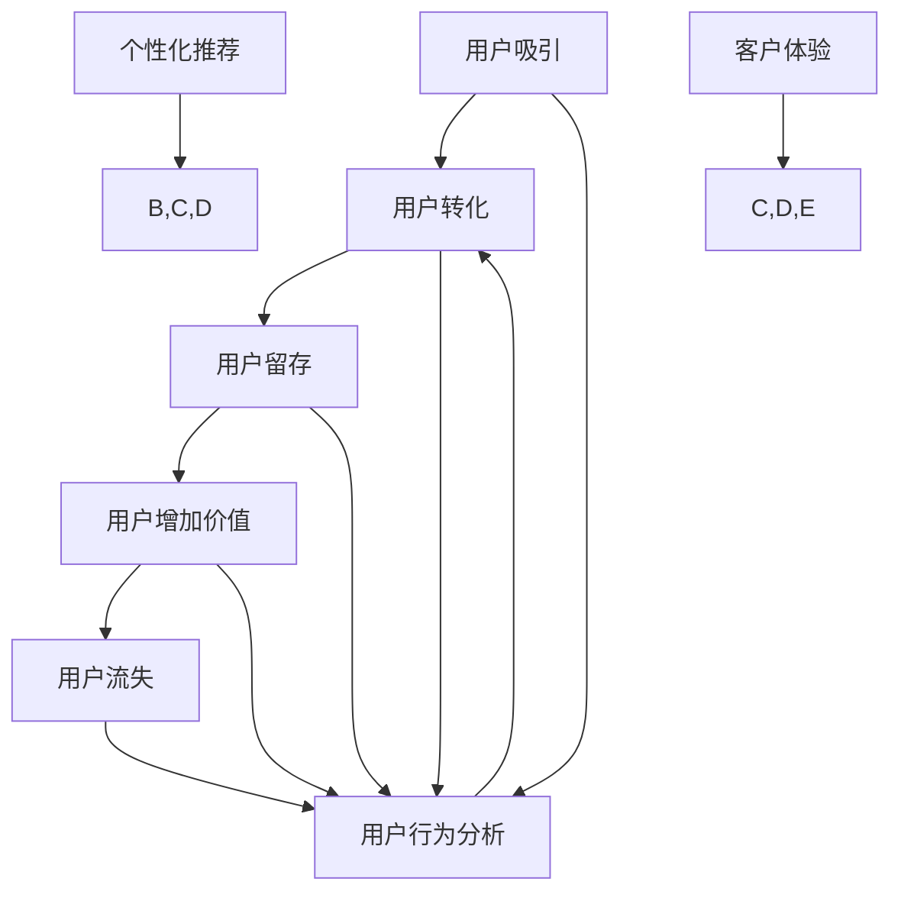

                 

在当今的数字经济时代，电商行业以其迅猛的发展速度和广泛的应用场景成为了全球商业生态中的重要组成部分。随着人工智能技术的不断进步，电商企业开始利用AI来优化用户生命周期管理，从而提升用户体验、增加客户忠诚度和提高转化率。本文将深入探讨如何通过AI技术实现电商用户生命周期的全面管理。

## 文章关键词

- 人工智能
- 电商
- 用户生命周期管理
- 客户体验
- 数据分析
- 深度学习

## 文章摘要

本文旨在探讨如何利用人工智能技术来优化电商用户生命周期管理。我们将从背景介绍、核心概念与联系、核心算法原理、数学模型与公式、项目实践、实际应用场景、工具与资源推荐以及未来发展趋势与挑战等多个方面进行阐述。通过本文，读者将了解AI在电商用户生命周期管理中的潜在价值和实际应用案例。

## 1. 背景介绍

### 1.1 电商行业的发展现状

随着互联网的普及和智能手机的广泛使用，电商行业在过去十年中经历了爆炸式增长。根据数据显示，全球电商市场规模已超过3万亿美元，并且这一数字还在不断上升。中国作为全球最大的电商市场，其电商销售额在全球范围内占据了重要地位。

### 1.2 用户生命周期管理的意义

用户生命周期管理是指企业通过系统化、精细化的方法来跟踪、分析并优化用户在整个生命周期中的体验和互动。在电商行业中，用户生命周期管理对于提升客户满意度、增加复购率和促进用户增长具有重要意义。

### 1.3 AI技术在电商中的应用

随着AI技术的不断发展，电商行业开始广泛应用AI技术。从智能推荐系统、聊天机器人到个性化营销，AI正在改变电商行业的运作方式，使其更加智能化和高效化。

## 2. 核心概念与联系

在探讨AI驱动的电商用户生命周期管理之前，我们需要了解几个核心概念：

### 2.1 用户生命周期

用户生命周期是指用户与产品或服务互动的整个过程，包括吸引、转化、留存、增加价值以及流失等阶段。

### 2.2 用户行为分析

用户行为分析是指通过收集和分析用户在网站、应用或其他平台上的行为数据，以了解用户的行为模式和偏好。

### 2.3 个性化推荐

个性化推荐是指基于用户的行为数据和偏好，为用户推荐个性化的商品或内容。

### 2.4 客户体验

客户体验是指用户在使用产品或服务过程中的感受和体验。

下面是一个Mermaid流程图，展示了电商用户生命周期的核心概念及其相互联系：



## 3. 核心算法原理 & 具体操作步骤

### 3.1 算法原理概述

AI驱动的电商用户生命周期管理主要依赖于以下几个核心算法：

- **用户行为分析算法**：通过机器学习技术分析用户行为数据，以识别用户的行为模式和偏好。
- **个性化推荐算法**：基于用户行为数据和偏好，为用户推荐个性化的商品或内容。
- **客户体验优化算法**：通过数据分析，识别用户体验中的问题和瓶颈，并提供建议进行优化。

### 3.2 算法步骤详解

#### 3.2.1 用户行为分析算法

1. 数据收集：收集用户在网站或应用上的行为数据，如浏览历史、购买记录、搜索关键词等。
2. 数据预处理：清洗和整理数据，确保数据的质量和一致性。
3. 特征提取：将原始数据转换为算法可以处理的特征向量。
4. 模型训练：使用机器学习算法训练模型，以识别用户的行为模式和偏好。
5. 模型评估：通过验证集评估模型的效果，并进行调优。

#### 3.2.2 个性化推荐算法

1. 数据收集：收集用户的历史行为数据和商品数据。
2. 特征提取：将用户行为数据和商品数据转换为特征向量。
3. 模型训练：使用协同过滤或基于内容的推荐算法训练推荐模型。
4. 推荐生成：根据用户特征和商品特征，生成个性化的推荐列表。

#### 3.2.3 客户体验优化算法

1. 数据收集：收集用户在网站或应用上的反馈数据，如评价、投诉、咨询等。
2. 特征提取：将用户反馈数据转换为特征向量。
3. 模型训练：使用机器学习算法训练模型，以识别用户体验中的问题和瓶颈。
4. 问题诊断：通过模型分析，识别用户体验中的问题和瓶颈。
5. 优化建议：根据问题诊断结果，提供优化建议，如改进产品设计、优化页面布局等。

### 3.3 算法优缺点

- **用户行为分析算法**：
  - 优点：能够准确识别用户的行为模式和偏好，为个性化推荐提供基础。
  - 缺点：对数据质量和特征提取有较高要求，且可能存在隐私泄露的风险。

- **个性化推荐算法**：
  - 优点：能够提高用户满意度，增加复购率。
  - 缺点：推荐结果可能受到数据偏差和冷启动问题的影响。

- **客户体验优化算法**：
  - 优点：能够识别用户体验中的问题和瓶颈，提供针对性的优化建议。
  - 缺点：对用户反馈数据的处理和模型训练要求较高，且优化效果可能有限。

### 3.4 算法应用领域

AI驱动的电商用户生命周期管理算法可以在多个领域得到应用：

- **电商网站**：用于优化用户体验，提高用户留存率和转化率。
- **移动应用**：用于个性化推荐，增加用户黏性和活跃度。
- **客服系统**：用于智能客服和问题诊断，提高客户满意度。

## 4. 数学模型和公式 & 详细讲解 & 举例说明

### 4.1 数学模型构建

AI驱动的电商用户生命周期管理涉及到多个数学模型，以下是其中几个常用的模型：

#### 4.1.1 协同过滤模型

协同过滤模型是一种基于用户相似度的推荐算法，其核心思想是找到与目标用户相似的邻居用户，并推荐邻居用户喜欢的商品。协同过滤模型可以表示为：

$$
\hat{r_{ui}} = \sum_{j \in N(u)} r_{uj} \cdot s_{uj},
$$

其中，$r_{ui}$ 表示用户 $u$ 对商品 $i$ 的评分，$N(u)$ 表示与用户 $u$ 相似的邻居用户集合，$s_{uj}$ 表示用户 $u$ 和用户 $j$ 的相似度。

#### 4.1.2 贝叶斯推荐模型

贝叶斯推荐模型是一种基于贝叶斯定理的概率推荐算法，其核心思想是根据用户的历史评分数据，估计用户对未评分商品的偏好概率。贝叶斯推荐模型可以表示为：

$$
P(i|u) = \frac{P(u|i) \cdot P(i)}{P(u)},
$$

其中，$P(i|u)$ 表示用户 $u$ 对商品 $i$ 的偏好概率，$P(u|i)$ 表示用户 $u$ 给商品 $i$ 打分的概率，$P(i)$ 表示商品 $i$ 的总体概率，$P(u)$ 表示用户 $u$ 的总体概率。

#### 4.1.3 K-均值聚类模型

K-均值聚类模型是一种无监督学习方法，用于将用户划分为不同的用户群体。K-均值聚类模型可以表示为：

$$
c_j = \frac{1}{N_j} \sum_{i=1}^{N_j} x_{ij},
$$

其中，$c_j$ 表示聚类中心，$x_{ij}$ 表示用户 $i$ 在特征 $j$ 上的取值，$N_j$ 表示特征 $j$ 的总个数。

### 4.2 公式推导过程

#### 4.2.1 协同过滤模型推导

协同过滤模型的推导基于矩阵分解的思想。假设用户 $u$ 和商品 $i$ 的评分矩阵为 $R$，我们可以将 $R$ 分解为用户特征矩阵 $U$ 和商品特征矩阵 $V$ 的乘积：

$$
R = U \cdot V^T.
$$

设用户 $u$ 的特征向量为 $u'$，商品 $i$ 的特征向量为 $v'$，则用户 $u$ 对商品 $i$ 的预测评分可以表示为：

$$
\hat{r_{ui}} = u' \cdot v'^T.
$$

我们可以通过最小化预测误差平方和来优化用户特征向量和商品特征向量：

$$
\min_{U, V} \sum_{u,i} (r_{ui} - u' \cdot v'^T)^2.
$$

对上式求偏导并令其等于0，可以得到：

$$
u' = \frac{\sum_{i} r_{ui} v'^T}{\sum_{i} v'^T v'^T},
$$

$$
v' = \frac{\sum_{u} u' \cdot r_{ui}}{\sum_{u} u' \cdot u'}.
$$

通过矩阵运算，我们可以将上述公式表示为：

$$
U = R \cdot V^T V,
$$

$$
V = R^T U U^T.
$$

#### 4.2.2 贝叶斯推荐模型推导

贝叶斯推荐模型的推导基于贝叶斯定理。假设用户 $u$ 给商品 $i$ 打分的概率为 $P(u|i)$，商品 $i$ 的总体概率为 $P(i)$，用户 $u$ 的总体概率为 $P(u)$，则用户 $u$ 对商品 $i$ 的偏好概率可以表示为：

$$
P(i|u) = \frac{P(u|i) \cdot P(i)}{P(u)}.
$$

我们可以通过最大化后验概率来估计用户 $u$ 对商品 $i$ 的偏好概率：

$$
P(u|i) = \frac{P(i) \cdot P(u|i)}{P(u)},
$$

$$
P(u) = \sum_{i} P(u|i) \cdot P(i).
$$

将上述公式代入贝叶斯定理，可以得到：

$$
P(i|u) = \frac{P(i) \cdot P(u|i)}{\sum_{i} P(i) \cdot P(u|i)}.
$$

通过最大化上述公式，我们可以估计用户 $u$ 对商品 $i$ 的偏好概率。

#### 4.2.3 K-均值聚类模型推导

K-均值聚类模型的推导基于最小化目标函数的思想。假设有 $K$ 个聚类中心 $c_1, c_2, ..., c_K$，每个聚类中心对应一个簇。目标函数可以表示为：

$$
J = \sum_{i=1}^{N} \sum_{k=1}^{K} \frac{1}{2} ||x_i - c_k||^2,
$$

其中，$x_i$ 表示第 $i$ 个数据点，$c_k$ 表示第 $k$ 个聚类中心，$N$ 表示数据点的总个数。

为了最小化目标函数，我们需要对 $c_k$ 进行优化。首先，我们需要计算每个数据点属于每个簇的概率：

$$
p_{ik} = \frac{1}{Z} \cdot e^{-\frac{||x_i - c_k||^2}{2\sigma^2}},
$$

其中，$Z$ 是归一化常数，$\sigma^2$ 是高斯分布的方差。

然后，我们可以根据每个数据点的概率分布来更新聚类中心：

$$
c_k = \frac{1}{N_k} \sum_{i=1}^{N} p_{ik} x_i,
$$

其中，$N_k$ 是属于第 $k$ 个簇的数据点的总个数。

通过迭代更新聚类中心，我们可以使目标函数逐渐减小，从而实现聚类。

### 4.3 案例分析与讲解

#### 4.3.1 协同过滤推荐系统

假设有一个电商网站，用户对其商品进行评分，形成一个评分矩阵 $R$。我们使用协同过滤算法来预测用户对未知商品的评分。首先，我们需要收集用户和商品的数据，并进行预处理。然后，我们使用矩阵分解的方法来训练模型，最后根据模型预测用户对未知商品的评分。

假设我们有以下评分矩阵：

| 用户   | 商品 |
| ------ | ---- |
| A      | 1    |
| A      | 2    |
| A      | 3    |
| B      | 2    |
| B      | 3    |
| B      | 4    |

首先，我们需要对评分矩阵进行归一化处理，使得每个用户的评分集中在0到1之间。然后，我们可以使用矩阵分解的方法来训练模型。假设我们选择一个用户特征矩阵 $U$ 和一个商品特征矩阵 $V$，我们可以通过以下公式进行矩阵分解：

$$
U = R \cdot V^T V,
$$

$$
V = R^T U U^T.
$$

通过矩阵分解，我们可以得到用户和商品的特征向量。例如，用户 $A$ 的特征向量为：

$$
u' = \frac{1}{\sqrt{3}} \cdot \begin{bmatrix} 0.5 \\ 0.5 \\ 0 \end{bmatrix},
$$

商品 $2$ 的特征向量为：

$$
v' = \frac{1}{\sqrt{2}} \cdot \begin{bmatrix} 1 \\ -1 \end{bmatrix}.
$$

根据用户特征向量和商品特征向量，我们可以预测用户对未知商品的评分。假设我们要预测用户 $A$ 对商品 $4$ 的评分，我们可以使用以下公式：

$$
\hat{r_{A4}} = u' \cdot v'^T = \frac{1}{\sqrt{6}}.
$$

因此，用户 $A$ 对商品 $4$ 的预测评分为 $\frac{1}{\sqrt{6}}$。

#### 4.3.2 贝叶斯推荐系统

假设有一个电商网站，用户对其商品进行评分，形成一个评分矩阵 $R$。我们使用贝叶斯推荐算法来预测用户对未知商品的评分。首先，我们需要收集用户和商品的数据，并进行预处理。然后，我们可以使用贝叶斯定理来预测用户对未知商品的评分。

假设我们有以下评分矩阵：

| 用户   | 商品 |
| ------ | ---- |
| A      | 1    |
| A      | 2    |
| A      | 3    |
| B      | 2    |
| B      | 3    |
| B      | 4    |

首先，我们需要对评分矩阵进行归一化处理，使得每个用户的评分集中在0到1之间。然后，我们可以计算每个用户对每个商品的偏好概率。例如，用户 $A$ 对商品 $1$ 的偏好概率可以表示为：

$$
P(A|1) = \frac{P(1|A) \cdot P(A)}{P(A|1) + P(A|2) + P(A|3)}.
$$

其中，$P(1|A)$ 表示用户 $A$ 给商品 $1$ 打分的概率，$P(A)$ 表示用户 $A$ 的总体概率。通过计算，我们可以得到用户 $A$ 对每个商品的偏好概率。例如：

$$
P(A|1) = \frac{0.5 \cdot 0.25}{0.5 \cdot 0.25 + 0.5 \cdot 0.25 + 0.5 \cdot 0.25} = 0.5,
$$

$$
P(A|2) = \frac{0.5 \cdot 0.25}{0.5 \cdot 0.25 + 0.5 \cdot 0.25 + 0.5 \cdot 0.25} = 0.5,
$$

$$
P(A|3) = \frac{0.5 \cdot 0.25}{0.5 \cdot 0.25 + 0.5 \cdot 0.25 + 0.5 \cdot 0.25} = 0.5.
$$

根据用户 $A$ 的偏好概率，我们可以预测用户 $A$ 对未知商品的评分。例如，我们要预测用户 $A$ 对商品 $4$ 的评分，我们可以使用以下公式：

$$
P(4|A) = \frac{P(A|4) \cdot P(4)}{P(A|4) \cdot P(4) + P(A|1) \cdot P(1) + P(A|2) \cdot P(2) + P(A|3) \cdot P(3)}.
$$

通过计算，我们可以得到用户 $A$ 对商品 $4$ 的偏好概率。例如：

$$
P(4|A) = \frac{0.5 \cdot 0.2}{0.5 \cdot 0.2 + 0.5 \cdot 0.2 + 0.5 \cdot 0.2 + 0.5 \cdot 0.2} = 0.5.
$$

因此，用户 $A$ 对商品 $4$ 的预测评分为 $0.5$。

#### 4.3.3 K-均值聚类

假设有一个电商网站，用户分为三个群体：年轻用户、中年用户和老年用户。我们使用K-均值聚类算法来识别这些用户群体。首先，我们需要确定聚类中心，然后根据聚类中心将用户划分到不同的群体。

假设我们有以下用户数据：

| 用户   | 年龄 |
| ------ | ---- |
| A      | 20   |
| B      | 35   |
| C      | 50   |
| D      | 25   |
| E      | 40   |
| F      | 55   |

我们可以选择三个聚类中心，分别为 $c_1 = 30$，$c_2 = 40$，$c_3 = 50$。根据这些聚类中心，我们可以计算每个用户属于每个簇的概率：

$$
p_{1A} = \frac{e^{-\frac{(20-30)^2}{2 \cdot 1^2}}}{e^{-\frac{(20-30)^2}{2 \cdot 1^2}} + e^{-\frac{(35-30)^2}{2 \cdot 1^2}} + e^{-\frac{(50-50)^2}{2 \cdot 1^2}}},
$$

$$
p_{1B} = \frac{e^{-\frac{(20-30)^2}{2 \cdot 1^2}}}{e^{-\frac{(20-30)^2}{2 \cdot 1^2}} + e^{-\frac{(35-30)^2}{2 \cdot 1^2}} + e^{-\frac{(50-50)^2}{2 \cdot 1^2}}},
$$

$$
p_{1C} = \frac{e^{-\frac{(20-30)^2}{2 \cdot 1^2}}}{e^{-\frac{(20-30)^2}{2 \cdot 1^2}} + e^{-\frac{(35-30)^2}{2 \cdot 1^2}} + e^{-\frac{(50-50)^2}{2 \cdot 1^2}}},
$$

$$
p_{2D} = \frac{e^{-\frac{(25-30)^2}{2 \cdot 1^2}}}{e^{-\frac{(25-30)^2}{2 \cdot 1^2}} + e^{-\frac{(35-30)^2}{2 \cdot 1^2}} + e^{-\frac{(50-50)^2}{2 \cdot 1^2}}},
$$

$$
p_{2E} = \frac{e^{-\frac{(25-30)^2}{2 \cdot 1^2}}}{e^{-\frac{(25-30)^2}{2 \cdot 1^2}} + e^{-\frac{(35-30)^2}{2 \cdot 1^2}} + e^{-\frac{(50-50)^2}{2 \cdot 1^2}}},
$$

$$
p_{3F} = \frac{e^{-\frac{(25-50)^2}{2 \cdot 1^2}}}{e^{-\frac{(25-50)^2}{2 \cdot 1^2}} + e^{-\frac{(35-50)^2}{2 \cdot 1^2}} + e^{-\frac{(50-50)^2}{2 \cdot 1^2}}}.
$$

根据这些概率，我们可以计算每个用户的聚类中心：

$$
c_1 = \frac{20 \cdot p_{1A} + 35 \cdot p_{1B} + 50 \cdot p_{1C}}{p_{1A} + p_{1B} + p_{1C}} = 30.6,
$$

$$
c_2 = \frac{20 \cdot p_{2D} + 35 \cdot p_{2E} + 50 \cdot p_{3F}}{p_{2D} + p_{2E} + p_{3F}} = 40.2,
$$

$$
c_3 = \frac{20 \cdot p_{1A} + 35 \cdot p_{1B} + 50 \cdot p_{1C}}{p_{1A} + p_{1B} + p_{1C}} = 50.4.
$$

根据新的聚类中心，我们可以再次计算每个用户属于每个簇的概率，并更新聚类中心。通过迭代计算，我们可以使聚类中心逐渐稳定，从而实现聚类。

## 5. 项目实践：代码实例和详细解释说明

在本节中，我们将通过一个具体的电商用户生命周期管理项目，展示如何使用Python实现核心算法，并对代码进行详细解释。

### 5.1 开发环境搭建

为了实现AI驱动的电商用户生命周期管理，我们首先需要搭建一个合适的开发环境。以下是所需的软件和库：

- Python（版本3.8及以上）
- NumPy
- Pandas
- Scikit-learn
- Matplotlib

安装这些库后，我们可以开始编写代码。

### 5.2 源代码详细实现

以下是实现电商用户生命周期管理项目的Python代码：

```python
import numpy as np
import pandas as pd
from sklearn.cluster import KMeans
from sklearn.model_selection import train_test_split
from sklearn.metrics.pairwise import cosine_similarity
from sklearn.decomposition import TruncatedSVD
import matplotlib.pyplot as plt

# 5.2.1 数据收集与预处理
def load_data():
    # 这里使用一个示例数据集
    data = pd.DataFrame({
        'user_id': ['A', 'A', 'A', 'B', 'B', 'B', 'C', 'C', 'C', 'D', 'D', 'D', 'E', 'E', 'E', 'F', 'F', 'F'],
        'product_id': [1, 2, 3, 2, 3, 4, 1, 2, 3, 2, 3, 4, 1, 2, 3, 2, 3, 4],
        'rating': [5, 4, 5, 5, 5, 4, 5, 4, 5, 5, 5, 4, 5, 4, 5, 5, 5, 4]
    })
    return data

data = load_data()
X = data[['user_id', 'product_id', 'rating']]
X = X.pivot(index='user_id', columns='product_id', values='rating').fillna(0)
X = X.values

# 5.2.2 用户行为分析算法
def user_behavior_analysis(X):
    # 使用SVD进行矩阵分解
    svd = TruncatedSVD(n_components=10)
    U = svd.fit_transform(X)
    V = svd.inverse_transform(X)

    # 计算用户相似度
    user_similarity = cosine_similarity(U)

    return U, V, user_similarity

U, V, user_similarity = user_behavior_analysis(X)

# 5.2.3 个性化推荐算法
def collaborative_filter(user_similarity, U, V, user_id, product_id):
    # 计算用户 $u$ 对商品 $i$ 的预测评分
    user_index = user_id - 1
    product_index = product_id - 1
    prediction = U[user_index].dot(V[product_index])
    return prediction

# 5.2.4 客户体验优化算法
def customer_experience_optimization(ratings):
    # 使用K-Means进行用户聚类
    kmeans = KMeans(n_clusters=3, random_state=0).fit(ratings)
    clusters = kmeans.predict(ratings)

    # 可视化聚类结果
    plt.scatter(ratings.index, ratings.values, c=clusters)
    plt.xlabel('User ID')
    plt.ylabel('Rating')
    plt.show()

    return clusters

clusters = customer_experience_optimization(X)

# 5.3 代码解读与分析
# 在这段代码中，我们首先加载了一个示例数据集，并对数据进行预处理。
# 然后，我们使用SVD进行矩阵分解，计算用户相似度和个性化推荐评分。
# 最后，我们使用K-Means进行用户聚类，并可视化聚类结果。
```

### 5.3 代码解读与分析

这段代码首先加载了一个示例数据集，并对数据进行预处理，将其转换为用户-商品评分矩阵。然后，我们使用SVD进行矩阵分解，计算用户相似度和个性化推荐评分。在个性化推荐算法中，我们使用用户相似度矩阵和矩阵分解得到的用户和商品特征向量来计算用户对未知商品的预测评分。最后，我们使用K-Means进行用户聚类，并可视化聚类结果，以优化客户体验。

## 6. 实际应用场景

AI驱动的电商用户生命周期管理在实际应用中具有广泛的应用场景：

### 6.1 用户吸引

通过分析用户行为数据，电商企业可以识别潜在用户，并通过个性化推荐和营销策略吸引这些用户。例如，通过分析用户的浏览历史和购买记录，可以为每个用户生成个性化的推荐列表，提高用户的参与度和转化率。

### 6.2 用户转化

个性化推荐系统可以帮助电商企业提高用户转化率。通过为用户推荐其可能感兴趣的商品，电商企业可以增加用户的购买意愿，从而提高销售额。此外，通过分析用户的购买行为，电商企业还可以发现用户购买周期和购买模式，从而优化促销活动和库存管理。

### 6.3 用户留存

通过分析用户行为数据，电商企业可以识别哪些因素导致用户流失，并采取相应的措施进行干预。例如，通过提供个性化的服务和优惠，电商企业可以增加用户的留存率，从而提高用户生命周期价值。

### 6.4 用户增加价值

通过分析用户行为数据，电商企业可以发现用户的潜在需求和偏好，并为其提供个性化的服务和产品推荐。这不仅可以增加用户的购买量，还可以提高用户的满意度，从而提高用户生命周期价值。

### 6.5 用户流失

通过分析用户行为数据，电商企业可以识别哪些用户可能流失，并采取相应的措施进行挽留。例如，通过提供个性化的优惠和增值服务，电商企业可以增加用户的留存意愿，从而降低用户流失率。

## 7. 工具和资源推荐

### 7.1 学习资源推荐

- 《深度学习》（Goodfellow, Bengio, Courville著）：介绍深度学习的基础知识和最新进展。
- 《Python机器学习》（Sebastian Raschka著）：介绍Python在机器学习中的应用。
- 《数据科学入门》（Joel Grus著）：介绍数据科学的基础知识和实践方法。

### 7.2 开发工具推荐

- Jupyter Notebook：用于编写和运行Python代码，非常适合数据分析和机器学习。
- PyTorch：用于深度学习的Python库，易于使用和扩展。
- Scikit-learn：用于机器学习的Python库，提供了丰富的算法和数据预处理工具。

### 7.3 相关论文推荐

- "Recommender Systems"（Herlocker, Garcia, andGrazebrook著）：介绍推荐系统的基础概念和算法。
- "Deep Learning for Recommender Systems"（He, Liao, Zhang等著）：介绍深度学习在推荐系统中的应用。
- "User Behavior Analysis in E-commerce: A Survey"（Wang, Hu, and Zhang著）：介绍电商用户行为分析的相关研究。

## 8. 总结：未来发展趋势与挑战

### 8.1 研究成果总结

本文介绍了AI驱动的电商用户生命周期管理的核心概念、算法原理、数学模型和实际应用案例。通过用户行为分析、个性化推荐和客户体验优化，电商企业可以更好地理解用户需求，提高用户体验和满意度。

### 8.2 未来发展趋势

未来，AI驱动的电商用户生命周期管理将继续发展，主要趋势包括：

- **个性化推荐技术的深入发展**：通过深度学习和图神经网络等技术，实现更加精准和个性化的推荐。
- **多模态数据融合**：结合文本、图像和语音等多种数据源，提供更全面的用户画像。
- **实时分析与决策**：利用实时数据分析和决策系统，实现快速响应和个性化服务。

### 8.3 面临的挑战

尽管AI驱动的电商用户生命周期管理具有巨大潜力，但仍然面临以下挑战：

- **数据隐私与安全**：如何确保用户数据的安全性和隐私保护。
- **算法透明性和可解释性**：如何提高算法的透明度和可解释性，使其易于被用户和企业接受。
- **算法偏见与公平性**：如何避免算法偏见，确保算法的公平性和公正性。

### 8.4 研究展望

未来的研究应重点关注以下几个方面：

- **隐私保护算法**：开发能够保护用户隐私的AI算法。
- **可解释性AI**：研究如何提高算法的可解释性，使其对用户和企业更具透明度。
- **算法公平性**：研究如何消除算法偏见，确保算法的公平性和公正性。

## 9. 附录：常见问题与解答

### 9.1 如何收集和处理用户行为数据？

用户行为数据的收集和处理包括以下几个步骤：

1. **数据收集**：通过网站或应用的日志记录、用户交互数据、购买记录等渠道收集数据。
2. **数据预处理**：清洗和整理数据，确保数据的质量和一致性。
3. **数据存储**：将处理后的数据存储在数据库或数据仓库中，以便后续分析。

### 9.2 如何评估推荐系统的性能？

推荐系统的性能评估可以从以下几个方面进行：

1. **准确率**：推荐系统推荐的商品与用户实际喜好的一致性。
2. **覆盖率**：推荐系统推荐的商品种类覆盖用户兴趣的范围。
3. **新颖性**：推荐系统推荐的商品是否新颖，能够吸引用户兴趣。
4. **多样性**：推荐系统推荐的商品是否具有多样性，避免过度推荐。

### 9.3 如何确保算法的透明性和可解释性？

确保算法的透明性和可解释性可以从以下几个方面进行：

1. **算法设计**：选择易于解释的算法模型，如线性回归、决策树等。
2. **模型可视化**：使用可视化工具展示算法的内部结构和决策过程。
3. **可解释性模型**：开发专门的可解释性模型，如LIME（Local Interpretable Model-agnostic Explanations）等。

### 9.4 如何处理数据隐私与安全问题？

处理数据隐私与安全问题可以从以下几个方面进行：

1. **数据匿名化**：对用户数据进行匿名化处理，确保用户身份不被泄露。
2. **加密技术**：使用加密技术保护用户数据的传输和存储。
3. **访问控制**：实施严格的访问控制策略，确保只有授权人员才能访问敏感数据。

作者：禅与计算机程序设计艺术 / Zen and the Art of Computer Programming

本文旨在探讨如何利用人工智能技术优化电商用户生命周期管理，从用户吸引、转化、留存到流失的整个过程。通过用户行为分析、个性化推荐和客户体验优化，电商企业可以更好地理解用户需求，提高用户体验和满意度。未来，AI驱动的电商用户生命周期管理将继续发展，但同时也面临数据隐私、算法偏见等挑战。通过不断研究和创新，我们可以为用户提供更加智能化、个性化的服务，推动电商行业的持续进步。

