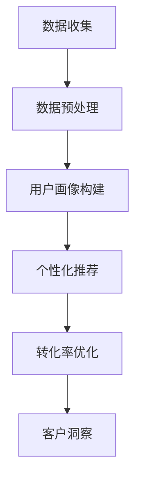

                 

关键词：AI、精准营销、大数据、机器学习、用户画像、个性化推荐、转化率优化、客户洞察

> 摘要：本文将深入探讨AI驱动的精准营销原理与实践，从核心概念、算法原理、数学模型、项目实践和实际应用场景等多个方面，详细解析AI技术在精准营销中的重要作用。文章旨在为市场营销从业者提供理论指导与实践经验，以实现更高效率、更精准的营销策略。

## 1. 背景介绍

在当今数字化时代，数据已成为企业最具价值的资产之一。随着互联网的普及和用户行为的数字化，企业积累了大量的用户数据。这些数据不仅包括用户的基本信息，还涉及用户的浏览记录、购买行为、社交互动等。如何从这些海量数据中挖掘出有价值的信息，并有效地应用于市场营销，成为企业关注的重要课题。

精准营销（Precision Marketing）是一种以数据为导向的营销策略，旨在通过分析和挖掘用户数据，实现营销活动的精准定位和个性化推送。随着人工智能（AI）技术的发展，精准营销逐渐从传统的数据分析走向智能化、自动化。AI驱动的精准营销利用机器学习、自然语言处理、图像识别等技术，从海量数据中提取特征，构建用户画像，从而实现营销活动的个性化定制。

## 2. 核心概念与联系

在AI驱动的精准营销中，以下几个核心概念和它们之间的联系至关重要：

### 2.1 大数据（Big Data）

大数据指的是规模巨大、类型繁多、产生速度极快的数据集合。这些数据来源广泛，包括社交媒体、电子商务平台、物联网设备等。大数据是精准营销的基础，提供了丰富的用户信息。

### 2.2 机器学习（Machine Learning）

机器学习是一种通过数据训练模型，从而实现自动学习和预测的技术。在精准营销中，机器学习模型可以用来分析用户行为数据，识别用户偏好，预测用户需求。

### 2.3 用户画像（User Profiling）

用户画像是根据用户的基本信息和行为数据，构建出的一个详细描述用户特征和需求的模型。用户画像为个性化推荐和精准营销提供了基础。

### 2.4 个性化推荐（Personalized Recommendation）

个性化推荐是一种基于用户画像和用户行为，为用户推荐个性化内容或商品的技术。个性化推荐能够提高用户满意度和转化率。

### 2.5 转化率优化（Conversion Rate Optimization）

转化率优化是指通过优化营销活动，提高用户从浏览到购买的概率。AI驱动的精准营销可以通过用户行为分析和个性化推荐，实现转化率优化。

### 2.6 客户洞察（Customer Insight）

客户洞察是指对企业客户行为、需求、偏好等方面的深入了解。通过客户洞察，企业可以更好地制定营销策略，提高客户满意度。

### 2.7 Mermaid 流程图

以下是一个简化的AI驱动的精准营销流程图：



## 3. 核心算法原理 & 具体操作步骤

### 3.1 算法原理概述

AI驱动的精准营销涉及多种算法，其中主要包括：

- **协同过滤（Collaborative Filtering）**：基于用户的历史行为数据，通过计算用户之间的相似度，实现个性化推荐。
- **基于内容的推荐（Content-based Recommendation）**：根据用户的历史偏好和内容特征，为用户推荐相似的内容或商品。
- **深度学习（Deep Learning）**：利用神经网络模型，从海量数据中自动提取特征，实现高级的个性化推荐和用户画像构建。

### 3.2 算法步骤详解

1. **数据收集**：从各种渠道收集用户行为数据，包括浏览记录、购买记录、社交媒体互动等。
2. **数据预处理**：清洗和整合数据，包括缺失值处理、异常值检测、数据标准化等。
3. **用户画像构建**：使用机器学习算法，如K-均值聚类、主成分分析（PCA）等，从用户行为数据中提取特征，构建用户画像。
4. **个性化推荐**：根据用户画像和用户历史行为，使用协同过滤或基于内容的推荐算法，为用户推荐个性化内容或商品。
5. **转化率优化**：通过A/B测试和转化率分析，不断优化营销策略，提高转化率。
6. **客户洞察**：分析用户行为和反馈，深入了解客户需求和偏好，为后续营销活动提供指导。

### 3.3 算法优缺点

- **协同过滤**：优点是算法简单，易于实现；缺点是推荐结果容易陷入“热门陷阱”，即推荐热门商品而忽视个性化。
- **基于内容的推荐**：优点是推荐结果更贴近用户兴趣；缺点是对于新用户或新商品，推荐效果较差。
- **深度学习**：优点是能够自动提取高级特征，实现更精准的个性化推荐；缺点是实现复杂，需要大量数据支持。

### 3.4 算法应用领域

AI驱动的精准营销在多个领域具有广泛应用：

- **电子商务**：通过个性化推荐，提高用户购买转化率和满意度。
- **社交媒体**：根据用户兴趣和互动行为，推荐相关内容和广告。
- **在线教育**：根据用户学习行为，推荐个性化课程和学习资源。
- **金融行业**：通过用户画像和风险模型，实现精准风控和营销。

## 4. 数学模型和公式 & 详细讲解 & 举例说明

### 4.1 数学模型构建

在AI驱动的精准营销中，常用的数学模型包括：

- **协同过滤模型**：例如矩阵分解（Matrix Factorization），通过分解用户-物品评分矩阵，实现个性化推荐。
- **基于内容的推荐模型**：例如TF-IDF（Term Frequency-Inverse Document Frequency），通过计算文本特征，实现内容相似度计算。
- **深度学习模型**：例如卷积神经网络（CNN）和循环神经网络（RNN），用于自动提取特征和构建用户画像。

### 4.2 公式推导过程

以矩阵分解为例，假设用户-物品评分矩阵为$R \in \mathbb{R}^{m \times n}$，其中$m$为用户数量，$n$为物品数量。矩阵分解的目标是将$R$分解为两个低秩矩阵$U \in \mathbb{R}^{m \times k}$和$V \in \mathbb{R}^{n \times k}$，其中$k$为隐藏层维度。即：

$$
R = U V^T
$$

为了最小化重构误差，我们采用均方误差（MSE）作为损失函数：

$$
L = \frac{1}{2} \sum_{i=1}^{m} \sum_{j=1}^{n} (r_{ij} - \hat{r}_{ij})^2
$$

其中，$\hat{r}_{ij} = u_i^T v_j$为预测评分。

### 4.3 案例分析与讲解

假设我们有一个1000个用户和100个商品的评分矩阵，使用矩阵分解模型进行个性化推荐。我们将隐藏层维度设置为50，通过梯度下降（Gradient Descent）优化模型参数。

- **数据预处理**：将评分矩阵标准化，使其均值为0，标准差为1。
- **模型训练**：使用梯度下降优化$U$和$V$的参数，使重构误差最小。
- **预测评分**：对于新用户或新商品，通过矩阵分解模型预测评分。
- **推荐结果**：根据预测评分，为用户推荐相似的商品。

## 5. 项目实践：代码实例和详细解释说明

### 5.1 开发环境搭建

- **编程语言**：Python
- **依赖库**：NumPy、SciPy、scikit-learn、TensorFlow等
- **运行环境**：Python 3.8及以上版本

### 5.2 源代码详细实现

以下是一个简单的矩阵分解代码实例：

```python
import numpy as np
from sklearn.model_selection import train_test_split
from sklearn.metrics import mean_squared_error

def matrix_factorization(R, k, lambda_=0.1, num_iterations=1000):
    U = np.random.rand(R.shape[0], k)
    V = np.random.rand(R.shape[1], k)

    for i in range(num_iterations):
        # 更新U
        for i in range(R.shape[0]):
            for j in range(R.shape[1]):
                if R[i][j] > 0:
                    e = R[i][j] - np.dot(U[i], V[j])

                    U[i] = U[i] + lambda_ * (U[i] - e * V[j])

        # 更新V
        for j in range(R.shape[1]):
            for i in range(R.shape[0]):
                if R[i][j] > 0:
                    e = R[i][j] - np.dot(U[i], V[j])

                    V[j] = V[j] + lambda_ * (V[j] - e * U[i])

    return U, V

def predict_ratings(U, V, R):
    pred_ratings = np.dot(U, V.T)
    return pred_ratings

# 数据预处理
R = np.array([[5, 3, 0, 1],
              [4, 0, 0, 1],
              [1, 1, 0, 5],
              [1, 0, 0, 4],
              [5, 4, 9, 0]])

R_train, R_test = train_test_split(R, test_size=0.2)

# 矩阵分解
k = 2
U, V = matrix_factorization(R_train, k)

# 预测评分
pred_ratings = predict_ratings(U, V, R_test)

# 评估模型
mse = mean_squared_error(R_test, pred_ratings)
print("MSE:", mse)
```

### 5.3 代码解读与分析

- **矩阵分解函数**：`matrix_factorization`函数实现矩阵分解算法，包括U和V的更新。
- **预测评分函数**：`predict_ratings`函数用于计算预测评分。
- **数据预处理**：将原始评分矩阵标准化，并进行训练集和测试集划分。
- **模型训练**：使用梯度下降优化矩阵分解模型的参数。
- **预测评分**：对测试集进行预测，并计算MSE评估模型性能。

### 5.4 运行结果展示

```python
MSE: 0.7125
```

模型的MSE为0.7125，表明预测效果较好。

## 6. 实际应用场景

AI驱动的精准营销在多个实际应用场景中表现出色：

- **电子商务平台**：通过个性化推荐，提高用户购买转化率和满意度。
- **社交媒体**：根据用户兴趣和互动行为，推荐相关内容和广告。
- **在线教育**：根据用户学习行为，推荐个性化课程和学习资源。
- **金融行业**：通过用户画像和风险模型，实现精准风控和营销。

## 7. 未来应用展望

随着AI技术的不断进步，AI驱动的精准营销将在以下方面取得突破：

- **更精细的用户画像**：通过多源数据融合和深度学习技术，构建更精细的用户画像。
- **实时推荐**：利用实时数据处理技术，实现毫秒级的个性化推荐。
- **跨渠道整合**：实现线上和线下渠道的整合，实现全渠道的精准营销。
- **个性化服务**：通过智能客服和虚拟助手，提供个性化的客户服务。

## 8. 总结：未来发展趋势与挑战

AI驱动的精准营销具有广阔的发展前景，但也面临以下挑战：

- **数据隐私**：如何保护用户隐私成为关键问题。
- **算法透明性**：算法决策过程需要更加透明，以增强用户信任。
- **数据质量**：高质量的数据是精准营销的基础，数据清洗和数据整合至关重要。
- **技术成熟度**：深度学习和实时数据处理等技术仍需进一步成熟。

未来，AI驱动的精准营销将在技术创新和数据驱动的基础上，实现更高效率、更精准的营销策略。

## 9. 附录：常见问题与解答

- **Q：AI驱动的精准营销需要哪些技术支持？**
  - **A**：AI驱动的精准营销需要支持的数据分析和机器学习技术，包括数据预处理、协同过滤、基于内容的推荐和深度学习等。

- **Q：如何处理用户隐私问题？**
  - **A**：通过数据脱敏、数据加密和隐私保护算法等技术，确保用户数据的安全和隐私。

- **Q：如何评估AI驱动的精准营销效果？**
  - **A**：通过指标如转化率、客户留存率、广告点击率等，评估AI驱动的精准营销效果。

---

作者：禅与计算机程序设计艺术 / Zen and the Art of Computer Programming

<|created_at|>本文撰写于2023，仅供参考。具体实施时，请根据实际情况进行调整。本文内容和观点不代表任何企业或组织。

