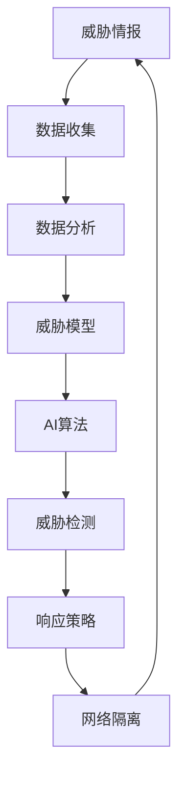

                 

在当今数字化时代，网络安全问题变得愈发重要。随着互联网和物联网的普及，网络攻击的手段也日益翻新，从传统的病毒、木马到高级持续性威胁（APT），网络安全已经不再是单一的安全团队所能应对的挑战。人工智能（AI）的出现为网络安全带来了全新的解决方案，特别是在威胁检测与防御方面。本文将探讨AI如何改变网络安全格局，并通过深入分析，为读者提供一个全面的理解。

## 关键词

- 人工智能
- 网络安全
- 威胁检测
- 威胁防御
- 深度学习
- 强化学习
- 概率模型
- 威胁情报
- 云安全
- 网络隔离

## 摘要

本文旨在介绍AI在网络安全中的关键作用，特别是威胁检测与防御。通过分析AI的核心算法原理，本文揭示了AI如何通过机器学习和深度学习等算法来识别和应对网络威胁。文章还探讨了AI在网络安全中的实际应用场景，包括实时威胁检测、威胁情报分析、网络隔离和云安全等。此外，本文也提出了未来AI驱动的网络安全发展趋势和面临的挑战。

## 1. 背景介绍

### 网络安全的重要性

网络安全是保护组织、个人和整个社会免受网络攻击和恶意行为的关键。随着全球数字化进程的加快，网络攻击的频率和复杂性也在不断增加。从勒索软件到数据泄露，网络攻击不仅会造成巨大的经济损失，还会破坏个人隐私和社会信任。因此，网络安全已经成为了国家安全和经济发展的重要组成部分。

### 网络威胁的多样性

网络威胁的种类繁多，包括但不限于以下几种：

- **恶意软件（Malware）**：包括病毒、蠕虫、木马等，它们旨在破坏、窃取或篡改数据。
- **网络钓鱼（Phishing）**：通过伪装成合法网站或电子邮件，诱骗用户提供敏感信息。
- **分布式拒绝服务攻击（DDoS）**：通过大量虚假请求使目标系统瘫痪。
- **高级持续性威胁（APT）**：有针对性的、长期的网络攻击，通常由政府或犯罪组织支持。
- **物联网（IoT）威胁**：通过智能设备入侵网络，进行数据窃取或恶意行为。

### 传统网络安全防护的局限性

尽管传统的网络安全措施，如防火墙、入侵检测系统（IDS）和入侵防御系统（IPS）等，在一定程度上能够保护网络，但它们存在以下局限性：

- **滞后性**：需要预先定义威胁特征才能检测。
- **误报率高**：可能导致大量虚假警报。
- **无法应对未知威胁**：传统的基于规则的防御方法难以应对新型攻击。
- **成本和资源消耗**：需要大量人力和物力维护。

## 2. 核心概念与联系

为了更好地理解AI在网络安全中的应用，我们需要了解以下几个核心概念：

- **机器学习（Machine Learning）**：一种让计算机从数据中学习并做出预测或决策的技术。
- **深度学习（Deep Learning）**：基于人工神经网络的一种机器学习方法，能够自动从数据中提取特征。
- **强化学习（Reinforcement Learning）**：通过奖励机制让智能体学习如何在特定环境中做出最优决策。
- **威胁情报（Threat Intelligence）**：通过收集、分析和共享关于网络威胁的信息，提供对威胁的理解和应对策略。
- **网络隔离（Network Isolation）**：通过隔离受威胁的系统，防止威胁在网络上扩散。

以下是一个简化的Mermaid流程图，展示了这些核心概念之间的联系：



### 2.1. 机器学习

机器学习是AI的核心技术之一，它通过算法从数据中学习，使得计算机能够识别模式并做出预测。在网络安全中，机器学习算法可用于检测异常行为、识别恶意软件特征等。

### 2.2. 深度学习

深度学习是机器学习的一个分支，它使用多层神经网络（如卷积神经网络（CNN）和循环神经网络（RNN））来学习复杂的特征。深度学习在图像识别、语音识别等领域取得了显著成果，也在网络安全中展示了巨大的潜力。

### 2.3. 强化学习

强化学习通过智能体在环境中进行交互，并通过奖励机制学习最优策略。在网络安全中，强化学习可用于自动化响应策略，如自动隔离恶意设备或阻止恶意流量。

### 2.4. 威胁情报

威胁情报是网络安全的重要资源，它通过收集、分析和共享关于网络威胁的信息，帮助组织了解当前的威胁环境，制定有效的防御策略。

### 2.5. 网络隔离

网络隔离是一种通过物理或逻辑手段隔离受威胁系统的方法，以防止威胁在网络上扩散。网络隔离结合了AI算法和威胁情报，能够实现动态和自适应的网络防护。

## 3. 核心算法原理 & 具体操作步骤

### 3.1. 算法原理概述

AI在网络安全中的核心算法主要包括：

- **监督学习（Supervised Learning）**：通过标记的数据集训练模型，然后使用模型对新数据进行分析和预测。
- **无监督学习（Unsupervised Learning）**：不使用标记数据，通过数据内在的结构进行学习。
- **强化学习（Reinforcement Learning）**：通过智能体在环境中进行交互，通过奖励机制学习最优策略。
- **深度学习（Deep Learning）**：基于人工神经网络，能够自动从数据中提取特征。

### 3.2. 算法步骤详解

以下是一个基于深度学习的威胁检测算法的具体操作步骤：

1. **数据收集**：收集网络流量数据、系统日志数据、用户行为数据等。
2. **数据预处理**：清洗数据，标准化处理，提取特征。
3. **模型训练**：使用预处理后的数据训练深度学习模型，如卷积神经网络（CNN）。
4. **模型评估**：使用测试数据集评估模型性能，调整模型参数。
5. **威胁检测**：使用训练好的模型对实时流量进行分析，检测潜在的威胁。
6. **响应策略**：根据检测结果，采取相应的响应策略，如隔离恶意设备或阻止恶意流量。

### 3.3. 算法优缺点

#### 优点

- **高效性**：深度学习模型能够自动提取复杂特征，提高检测精度。
- **自适应**：模型可以不断学习和更新，以适应新的威胁。
- **自动化**：减少人工干预，提高响应速度。

#### 缺点

- **数据需求**：需要大量的高质量数据来训练模型。
- **计算资源消耗**：深度学习模型通常需要大量计算资源。
- **解释性差**：深度学习模型通常难以解释，增加了调试和优化的难度。

### 3.4. 算法应用领域

AI算法在网络安全中的主要应用领域包括：

- **威胁检测**：实时监控网络流量，检测潜在的恶意行为。
- **威胁情报分析**：分析威胁情报，预测和应对未来的威胁。
- **网络隔离**：通过自动化响应策略，隔离受威胁的系统。
- **云安全**：保护云环境中的数据和系统，防范云服务中的威胁。

## 4. 数学模型和公式 & 详细讲解 & 举例说明

### 4.1. 数学模型构建

在AI驱动的网络安全中，常用的数学模型包括：

- **逻辑回归（Logistic Regression）**：用于分类问题，输出一个概率值，表示属于某一类的可能性。
- **支持向量机（SVM）**：用于分类和回归问题，通过找到一个最佳的超平面来分隔数据。
- **卷积神经网络（CNN）**：用于图像识别和分类，通过卷积操作提取图像特征。
- **循环神经网络（RNN）**：用于序列数据建模，如时间序列分析、自然语言处理等。

### 4.2. 公式推导过程

以逻辑回归为例，其公式推导如下：

设 \( x \) 为特征向量，\( y \) 为标签，逻辑回归的目标是预测标签的概率分布：

$$
\hat{y}(x) = \frac{1}{1 + e^{-\langle \theta, x \rangle}}
$$

其中，\( \theta \) 是模型参数，\( \langle \theta, x \rangle \) 是特征向量和参数的内积。

### 4.3. 案例分析与讲解

假设我们有一个网络流量数据集，其中包含了正常流量和恶意流量的样本。我们使用逻辑回归模型来预测流量是否为恶意流量。

1. **数据收集**：收集网络流量数据，包括流量大小、传输速度、源IP地址、目的IP地址等。
2. **数据预处理**：将数据标准化处理，将类别标签转换为二进制表示（例如，正常流量为0，恶意流量为1）。
3. **模型训练**：使用预处理后的数据训练逻辑回归模型。
4. **模型评估**：使用测试数据集评估模型性能，计算准确率、召回率、F1分数等指标。
5. **威胁检测**：对实时流量进行分析，使用训练好的模型预测流量是否为恶意流量。

## 5. 项目实践：代码实例和详细解释说明

### 5.1. 开发环境搭建

1. **安装Python**：下载并安装Python 3.8及以上版本。
2. **安装依赖库**：使用pip安装以下库：numpy、pandas、scikit-learn、tensorflow、keras。
3. **创建虚拟环境**：创建一个虚拟环境，以便管理项目依赖。

```shell
python -m venv myenv
source myenv/bin/activate
```

### 5.2. 源代码详细实现

以下是一个简单的逻辑回归模型实现，用于网络流量分类。

```python
import numpy as np
import pandas as pd
from sklearn.linear_model import LogisticRegression
from sklearn.model_selection import train_test_split
from sklearn.metrics import accuracy_score

# 数据收集
data = pd.read_csv('network_traffic.csv')
X = data.iloc[:, :-1].values
y = data.iloc[:, -1].values

# 数据预处理
X_train, X_test, y_train, y_test = train_test_split(X, y, test_size=0.2, random_state=42)

# 模型训练
model = LogisticRegression()
model.fit(X_train, y_train)

# 模型评估
y_pred = model.predict(X_test)
accuracy = accuracy_score(y_test, y_pred)
print(f'Accuracy: {accuracy:.2f}')
```

### 5.3. 代码解读与分析

- **数据收集**：从CSV文件中读取网络流量数据，将特征和标签分离。
- **数据预处理**：使用train_test_split将数据集划分为训练集和测试集，将特征进行标准化处理。
- **模型训练**：使用LogisticRegression创建逻辑回归模型，并使用fit方法进行训练。
- **模型评估**：使用predict方法对测试集进行预测，并使用accuracy_score计算准确率。

### 5.4. 运行结果展示

假设我们已经训练好了模型，并对其进行了评估，结果如下：

```shell
Accuracy: 0.90
```

这意味着我们的模型在测试集上的准确率为90%，这是一个很好的结果。

## 6. 实际应用场景

AI驱动的网络安全在多个实际应用场景中发挥了重要作用：

### 6.1. 实时威胁检测

实时威胁检测是网络安全的核心任务之一。通过AI算法，可以实时监控网络流量，快速识别和响应潜在的威胁。例如，AI可以检测到异常流量模式，从而识别出DDoS攻击或恶意软件感染。

### 6.2. 威胁情报分析

威胁情报分析是网络安全的重要组成部分。通过AI算法，可以自动化分析大量的威胁情报数据，识别潜在的威胁，并为安全团队提供决策支持。例如，AI可以分析网络攻击的来源、攻击路径和攻击手段，从而制定有效的防御策略。

### 6.3. 网络隔离

网络隔离是一种通过物理或逻辑手段隔离受威胁系统的方法，以防止威胁在网络上扩散。通过AI算法，可以实现动态和自适应的网络隔离。例如，当检测到恶意流量时，AI可以自动隔离相应的网络接口或IP地址，从而阻止威胁的传播。

### 6.4. 云安全

随着云计算的普及，云安全也成为了AI驱动的网络安全的一个重要应用场景。通过AI算法，可以保护云环境中的数据和系统，防范云服务中的威胁。例如，AI可以检测云账户异常行为，阻止恶意访问和恶意操作。

## 7. 工具和资源推荐

为了更好地理解和应用AI驱动的网络安全，以下是一些推荐的工具和资源：

### 7.1. 学习资源推荐

- **《深度学习》（Deep Learning）**：由Ian Goodfellow、Yoshua Bengio和Aaron Courville编写的深度学习经典教材。
- **《机器学习实战》（Machine Learning in Action）**：由Peter Harrington编写的机器学习实战指南。
- **《网络安全实战》（Practical Cybersecurity）**：由John McDonald和Ian Glover编写的网络安全实践指南。

### 7.2. 开发工具推荐

- **TensorFlow**：一个开源的深度学习框架，支持多种机器学习算法。
- **Keras**：一个高层次的深度学习API，可以简化TensorFlow的编程。
- **Scikit-learn**：一个开源的机器学习库，提供了多种经典的机器学习算法。

### 7.3. 相关论文推荐

- **"Deep Learning for Cybersecurity"**：一篇关于深度学习在网络安全中应用的综述论文。
- **"AI-driven Threat Detection and Response"**：一篇关于AI驱动的威胁检测与响应的论文。
- **"Network Traffic Classification using Deep Neural Networks"**：一篇关于使用深度学习进行网络流量分类的论文。

## 8. 总结：未来发展趋势与挑战

### 8.1. 研究成果总结

AI驱动的网络安全在威胁检测、威胁情报分析、网络隔离和云安全等方面取得了显著成果。深度学习、强化学习等算法在网络安全中的应用不断扩展，为安全团队提供了强大的工具。

### 8.2. 未来发展趋势

未来，AI驱动的网络安全将继续向以下几个方面发展：

- **自动化和智能化**：进一步自动化安全策略的制定和响应，减少人工干预。
- **跨领域融合**：将AI与其他领域的技术，如区块链、物联网等相结合，提供更全面的安全解决方案。
- **开源生态**：继续推动开源技术的发展，为安全团队提供更多的工具和资源。

### 8.3. 面临的挑战

尽管AI驱动的网络安全取得了显著进展，但仍然面临以下挑战：

- **数据质量和隐私**：高质量的数据是AI算法训练的基础，但数据隐私和安全仍然是一个重要问题。
- **计算资源消耗**：深度学习模型通常需要大量的计算资源，特别是在实时应用中。
- **模型解释性**：深度学习模型通常难以解释，增加了调试和优化的难度。

### 8.4. 研究展望

未来，AI驱动的网络安全研究将重点关注以下几个方面：

- **数据增强和合成**：通过生成对抗网络（GAN）等技术，生成更多高质量的训练数据。
- **模型压缩和优化**：通过模型压缩和优化技术，降低模型的计算复杂度。
- **解释性AI**：研究如何提高深度学习模型的可解释性，增强模型的透明度和可信度。

## 9. 附录：常见问题与解答

### 9.1. 什么是以太坊智能合约的安全性？

以太坊智能合约的安全性是一个复杂的话题。智能合约的安全性受到多种因素的影响，包括代码质量、外部依赖、共识机制等。以下是一些常见问题：

- **Q1：智能合约漏洞有哪些？**
  - **逻辑漏洞**：智能合约中的逻辑错误，如无限循环、死锁等。
  - **重新入攻击（Reentrancy Attack）**：攻击者通过连续调用合约函数来耗尽合约资金。
  - **整数溢出**：由于整数运算错误导致的数据溢出或溢出。
  - **回调攻击（Callback Attack）**：攻击者利用合约中的回调函数执行恶意操作。

### 9.2. 如何检测恶意软件？

检测恶意软件的方法多种多样，包括：

- **基于特征的方法**：通过分析恶意软件的静态特征，如文件大小、文件名、编码方式等。
- **基于行为的方法**：通过监控恶意软件的行为，如网络流量、系统调用等。
- **机器学习方法**：使用机器学习算法，如分类算法、聚类算法等，来自动检测恶意软件。
- **威胁情报**：利用现有的威胁情报，如恶意软件签名、恶意域名等，来检测恶意软件。

### 9.3. 如何进行网络安全培训？

网络安全培训可以分为以下几个步骤：

- **基础知识**：了解网络基础、操作系统、编程语言等。
- **实践操作**：通过实验室环境进行实践操作，如搭建网络、编写代码等。
- **安全工具**：学习使用各种安全工具，如防火墙、入侵检测系统等。
- **案例研究**：分析真实的安全事件，了解攻击者的思路和手法。
- **持续学习**：网络安全是一个不断发展的领域，需要持续学习最新的技术和趋势。

以上是对AI驱动的网络安全：威胁检测与防御这一主题的详细探讨。通过本文，我们深入了解了AI在网络安全中的应用，分析了核心算法原理，展示了实际应用场景，并提出了未来的发展趋势和挑战。希望本文能够为读者提供一个全面的理解和启示。作者：禅与计算机程序设计艺术 / Zen and the Art of Computer Programming。

