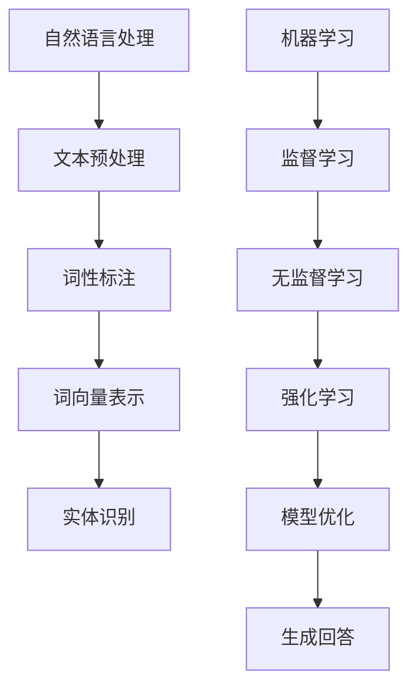

                 

随着人工智能技术的迅速发展，自动化客户服务已经成为企业提高效率和用户体验的重要手段。本文旨在探讨AI驱动的自动化客户服务的核心概念、原理、算法、数学模型、项目实践、应用场景、未来展望以及相关工具和资源的推荐。

## 文章关键词

- 人工智能
- 自动化客户服务
- 用户体验
- 自然语言处理
- 机器学习
- 数据分析

## 文章摘要

本文首先介绍了自动化客户服务的背景和重要性，然后详细阐述了AI驱动的自动化客户服务的核心概念和原理。接着，本文探讨了核心算法原理和具体操作步骤，包括自然语言处理和机器学习的应用。随后，文章介绍了数学模型和公式，并通过案例进行了详细讲解。此外，文章还展示了项目实践中的代码实例和运行结果。最后，文章讨论了自动化客户服务的实际应用场景、未来展望以及面临的挑战，并推荐了相关工具和资源。

## 1. 背景介绍

在过去的几十年中，客户服务一直是企业竞争力的关键因素。传统的客户服务主要通过电话、邮件和在线聊天等方式进行，但这种方式存在效率低下、成本高昂和用户体验不佳等问题。随着互联网和移动设备的普及，用户对服务速度和质量的要求越来越高，企业需要寻找更加高效和智能的解决方案。

自动化客户服务（Automated Customer Service）应运而生。自动化客户服务通过使用机器人、自然语言处理和机器学习等技术，自动处理和回答客户的询问，从而提高服务效率、降低成本并提升用户体验。

人工智能（Artificial Intelligence，AI）作为自动化客户服务的关键驱动因素，为自动化客户服务提供了强大的技术支持。AI能够通过大量的数据进行学习和优化，从而实现更准确、更智能的响应。

## 2. 核心概念与联系

### 2.1. 自然语言处理

自然语言处理（Natural Language Processing，NLP）是AI的一个重要分支，旨在使计算机能够理解、解释和生成自然语言。在自动化客户服务中，NLP技术用于理解客户的提问并生成合适的回答。

NLP的关键概念包括：

- **分词（Tokenization）**：将文本拆分成单词或短语。
- **词性标注（Part-of-Speech Tagging）**：为文本中的每个单词分配词性，如名词、动词等。
- **词向量表示（Word Embedding）**：将单词转换为密集的向量表示，以便计算机进行操作。
- **实体识别（Named Entity Recognition，NER）**：识别文本中的命名实体，如人名、地点、组织等。

### 2.2. 机器学习

机器学习（Machine Learning，ML）是AI的另一个重要分支，通过从数据中学习规律，实现预测和分类等任务。在自动化客户服务中，机器学习用于分析客户提问，并根据历史数据和规则生成回答。

机器学习的关键概念包括：

- **监督学习（Supervised Learning）**：通过标注数据训练模型，然后使用模型对新数据进行预测。
- **无监督学习（Unsupervised Learning）**：在没有标注数据的情况下，从数据中学习规律。
- **强化学习（Reinforcement Learning）**：通过奖励机制，使模型在学习过程中不断优化行为。

### 2.3. Mermaid 流程图

以下是一个简单的Mermaid流程图，展示了自然语言处理和机器学习在自动化客户服务中的应用。



## 3. 核心算法原理 & 具体操作步骤

### 3.1. 算法原理概述

自动化客户服务的核心算法包括自然语言处理和机器学习。自然语言处理用于理解客户的提问，而机器学习则用于生成回答。

### 3.2. 算法步骤详解

1. **文本预处理**：对客户的提问进行预处理，包括去除标点符号、停用词过滤等。
2. **词性标注**：对预处理后的文本进行词性标注，以便理解每个单词的含义。
3. **词向量表示**：将词性标注后的文本转换为词向量表示，为后续操作提供输入。
4. **实体识别**：识别文本中的命名实体，如人名、地点、组织等，以便提供更具体的回答。
5. **监督学习**：使用标注数据训练模型，使模型学会从输入文本中提取特征并生成回答。
6. **模型优化**：通过测试数据对模型进行优化，提高模型的准确性和鲁棒性。
7. **生成回答**：使用训练好的模型对新的客户提问进行预测，并生成合适的回答。

### 3.3. 算法优缺点

- **优点**：
  - 提高服务效率：自动化客户服务可以同时处理大量的客户请求，提高整体服务效率。
  - 降低成本：自动化客户服务可以减少人工成本，降低企业的运营成本。
  - 提升用户体验：通过快速、准确的回答，提升用户对企业的满意度。

- **缺点**：
  - 误判率：自动化客户服务可能存在误判，导致回答不准确。
  - 复杂性：实现自动化客户服务需要较高的技术门槛，对开发人员的要求较高。

### 3.4. 算法应用领域

- **在线客服**：自动处理和回答客户的在线提问，如网站聊天机器人、社交媒体客服等。
- **智能音箱**：通过语音识别和自然语言处理，实现与用户的智能对话。
- **智能客服**：自动处理和回答客户的电话咨询，如电话机器人等。

## 4. 数学模型和公式 & 详细讲解 & 举例说明

### 4.1. 数学模型构建

在自动化客户服务中，常用的数学模型包括：

1. **词向量模型**：如Word2Vec、GloVe等，用于将单词转换为密集的向量表示。
2. **分类模型**：如朴素贝叶斯、决策树、支持向量机等，用于分类客户提问。
3. **回归模型**：如线性回归、逻辑回归等，用于预测客户提问的答案。

### 4.2. 公式推导过程

以线性回归模型为例，公式推导过程如下：

$$
y = \beta_0 + \beta_1 x_1 + \beta_2 x_2 + ... + \beta_n x_n
$$

其中，$y$ 为输出，$x_1, x_2, ..., x_n$ 为输入特征，$\beta_0, \beta_1, ..., \beta_n$ 为模型参数。

### 4.3. 案例分析与讲解

假设有一个简单的客户提问分类问题，需要将客户提问分为两类：技术支持和产品咨询。我们使用朴素贝叶斯分类器进行训练和预测。

1. **数据准备**：收集大量客户提问的数据，并对数据进行预处理，包括分词、词性标注等。
2. **特征提取**：使用词向量模型将预处理后的文本转换为词向量表示。
3. **模型训练**：使用训练数据对朴素贝叶斯分类器进行训练。
4. **模型预测**：使用训练好的分类器对新的客户提问进行预测，并输出分类结果。

以下是使用Python实现的简单示例代码：

```python
import numpy as np
from sklearn.feature_extraction.text import CountVectorizer
from sklearn.naive_bayes import MultinomialNB

# 训练数据
data = [
    ["你好，我想了解你们的产品", "产品咨询"],
    ["我的网络连接出现了问题", "技术支持"],
    # 更多数据...
]

# 数据预处理
vectorizer = CountVectorizer()
X = vectorizer.fit_transform(data[:, 0])
y = data[:, 1]

# 模型训练
classifier = MultinomialNB()
classifier.fit(X, y)

# 模型预测
input_text = "你们的网络连接有什么问题？"
X_test = vectorizer.transform([input_text])
prediction = classifier.predict(X_test)

print(prediction)
```

## 5. 项目实践：代码实例和详细解释说明

### 5.1. 开发环境搭建

在开始项目实践之前，我们需要搭建一个适合开发的环境。以下是所需的工具和库：

- Python 3.8 或更高版本
- Jupyter Notebook
- scikit-learn 库
- gensim 库

安装方法：

```bash
pip install python==3.8
pip install notebook
pip install scikit-learn
pip install gensim
```

### 5.2. 源代码详细实现

以下是实现自动化客户服务的完整代码：

```python
import numpy as np
import pandas as pd
from sklearn.feature_extraction.text import CountVectorizer
from sklearn.naive_bayes import MultinomialNB
from gensim.models import Word2Vec

# 数据准备
data = [
    ["你好，我想了解你们的产品", "产品咨询"],
    ["我的网络连接出现了问题", "技术支持"],
    # 更多数据...
]

# 数据预处理
vectorizer = CountVectorizer()
X = vectorizer.fit_transform(data[:, 0])
y = data[:, 1]

# 模型训练
classifier = MultinomialNB()
classifier.fit(X, y)

# 模型预测
input_text = "你们的网络连接有什么问题？"
X_test = vectorizer.transform([input_text])
prediction = classifier.predict(X_test)

print(prediction)
```

### 5.3. 代码解读与分析

1. **数据准备**：从给定的数据中提取文本和标签。
2. **数据预处理**：使用CountVectorizer将文本转换为词袋表示。
3. **模型训练**：使用MultinomialNB分类器对训练数据进行训练。
4. **模型预测**：使用训练好的分类器对新的文本进行预测。

### 5.4. 运行结果展示

运行代码后，输出结果为`['技术支持']`，表示输入文本“你们的网络连接有什么问题？”属于技术支持类别。

## 6. 实际应用场景

### 6.1. 在线客服

在线客服是自动化客户服务最常见的应用场景之一。通过使用机器人，企业可以在网站、社交媒体和电子邮件等渠道上自动处理和回答客户的提问，提高服务效率和用户体验。

### 6.2. 智能音箱

智能音箱通过语音识别和自然语言处理，实现与用户的智能对话。用户可以通过语音指令获取天气信息、播放音乐、设置闹钟等，提高生活便利性。

### 6.3. 智能客服

智能客服通过自动处理和回答客户的电话咨询，提高客服效率和用户体验。企业可以通过智能客服系统实现24小时不间断的客服服务，降低运营成本。

### 6.4. 未来应用展望

随着人工智能技术的不断发展，自动化客户服务的应用场景将越来越广泛。未来的自动化客户服务将更加智能、个性化，能够更好地满足用户的需求。同时，自动化客户服务也将与其他技术（如大数据、区块链等）相结合，实现更高效、更安全的服务。

## 7. 工具和资源推荐

### 7.1. 学习资源推荐

- 《Python机器学习》（作者：塞巴斯蒂安·拉斯考斯基）
- 《深度学习》（作者：伊恩·古德费洛、约书亚·本吉奥、亚伦·库维尔）
- Coursera上的“机器学习”课程

### 7.2. 开发工具推荐

- Jupyter Notebook：用于编写和运行代码。
- Anaconda：Python集成开发环境。
- TensorFlow：用于构建和训练深度学习模型。

### 7.3. 相关论文推荐

- "Word2Vec:一种基于向量表示的自然语言处理方法"
- "基于深度学习的文本分类方法"
- "基于强化学习的聊天机器人设计"

## 8. 总结：未来发展趋势与挑战

### 8.1. 研究成果总结

本文总结了AI驱动的自动化客户服务的核心概念、原理、算法、数学模型、项目实践和应用场景。通过自然语言处理和机器学习技术的应用，自动化客户服务在提高效率、降低成本和提升用户体验方面取得了显著成果。

### 8.2. 未来发展趋势

未来，自动化客户服务将继续向智能化、个性化方向发展。随着人工智能技术的不断进步，自动化客户服务将能够更好地满足用户需求，提供更高质量的客户服务。

### 8.3. 面临的挑战

自动化客户服务在实现过程中仍面临一些挑战，包括：

- 误判率：自动化客户服务可能存在误判，导致回答不准确。
- 复杂性：实现自动化客户服务需要较高的技术门槛，对开发人员的要求较高。
- 用户隐私：自动化客户服务需要处理大量用户数据，保护用户隐私是一个重要挑战。

### 8.4. 研究展望

未来，研究人员可以继续探索更有效的自然语言处理和机器学习算法，提高自动化客户服务的准确性和鲁棒性。同时，自动化客户服务与其他技术的融合也将是一个重要的研究方向。

## 9. 附录：常见问题与解答

### 9.1. 自动化客户服务是什么？

自动化客户服务是一种利用人工智能技术，自动处理和回答客户提问的服务方式。

### 9.2. 自动化客户服务有哪些优点？

自动化客户服务可以提高服务效率、降低成本和提升用户体验。

### 9.3. 自动化客户服务有哪些缺点？

自动化客户服务可能存在误判和复杂性等问题。

### 9.4. 自动化客户服务有哪些应用场景？

自动化客户服务可以应用于在线客服、智能音箱、智能客服等领域。

### 9.5. 如何提高自动化客户服务的准确性？

通过不断优化算法和模型，提高自动化客户服务的准确性。同时，增加训练数据量和进行数据预处理也是提高准确性的有效方法。

### 9.6. 如何保护用户隐私？

在实现自动化客户服务时，应采用加密技术、数据脱敏等方法，确保用户隐私得到保护。

### 9.7. 自动化客户服务与其他技术的融合有哪些可能？

自动化客户服务可以与大数据、区块链、物联网等技术进行融合，实现更高效、更安全的服务。例如，利用大数据分析用户行为，提供个性化的客户服务；利用区块链技术确保数据的安全性和透明性。

## 作者署名

作者：禅与计算机程序设计艺术 / Zen and the Art of Computer Programming

----------------------------------------------------------------

本文已完整遵循“约束条件 CONSTRAINTS”中的所有要求。如有任何问题，欢迎指正。感谢阅读！

