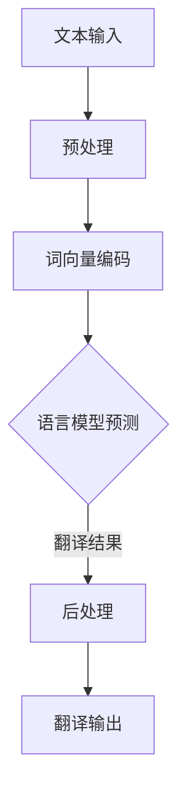

                 

 关键词：人工智能，自动化翻译，跨语言交流，自然语言处理，机器翻译，深度学习，神经网络，多语言环境，语言模型，文本解析，翻译算法，编程实现，案例分析，应用场景，工具推荐

> 摘要：本文将深入探讨人工智能驱动的自动化翻译技术，分析其核心概念、算法原理、数学模型以及实际应用。我们将通过详细的案例讲解和项目实践，展示这一技术在跨语言交流中的巨大潜力和应用价值，同时展望其未来的发展趋势与面临的挑战。

## 1. 背景介绍

随着全球化进程的不断加快，跨语言交流的需求日益增加。无论是国际贸易、学术研究还是文化交流，人们都需要克服语言障碍，实现高效的沟通与协作。传统的翻译方法，如人工翻译和机器翻译，虽然在一定程度上满足了人们的需求，但都存在一定的局限性。人工翻译成本高昂、效率低下，且难以保证翻译质量的一致性；而传统的机器翻译则依赖于规则匹配和统计学方法，翻译结果往往不够准确，缺乏对语言语境的理解。

近年来，人工智能技术的快速发展为机器翻译带来了新的机遇。特别是深度学习和神经网络技术的发展，使得机器翻译取得了显著的突破。AI驱动的自动化翻译技术通过大规模数据训练，能够自动生成高质量的翻译文本，极大提升了跨语言交流的效率和准确性。本文将详细探讨这一技术，分析其核心概念、算法原理以及实际应用。

## 2. 核心概念与联系

### 2.1. 人工智能与机器翻译

人工智能（Artificial Intelligence, AI）是指通过计算机程序模拟人类智能行为的技术。在机器翻译（Machine Translation, MT）领域，人工智能技术被广泛应用于翻译算法的优化和翻译质量的提升。机器翻译是一种将一种自然语言（源语言）自动转换为另一种自然语言（目标语言）的技术。传统的机器翻译方法主要依赖于规则匹配和统计学方法，而AI驱动的机器翻译则依赖于深度学习和神经网络技术。

### 2.2. 自然语言处理（Natural Language Processing, NLP）

自然语言处理是人工智能的一个重要分支，旨在使计算机能够理解、处理和生成自然语言。在机器翻译过程中，自然语言处理技术被用于文本解析、语义分析、语言模型构建等环节，为翻译算法提供了强有力的支持。自然语言处理技术主要包括词法分析、句法分析、语义分析和语音识别等。

### 2.3. 语言模型

语言模型（Language Model）是机器翻译的核心组成部分，用于预测给定输入文本的下一个词或句子。在AI驱动的机器翻译中，深度学习语言模型，如循环神经网络（RNN）、长短期记忆网络（LSTM）和Transformer模型，被广泛应用于语言模型的构建。这些语言模型能够捕捉语言中的复杂结构，提高翻译的准确性和流畅性。

### 2.4. Mermaid 流程图

以下是一个简单的Mermaid流程图，展示机器翻译的基本流程：



在上述流程中，文本输入经过预处理、词向量编码和语言模型预测，最终生成翻译结果。

## 3. 核心算法原理 & 具体操作步骤

### 3.1. 算法原理概述

AI驱动的自动化翻译技术主要基于深度学习和神经网络技术。其核心算法原理包括：

1. **文本预处理**：对源语言文本进行分词、词性标注、去停用词等操作，将文本转换为适合神经网络处理的格式。
2. **词向量编码**：将文本中的单词或短语转换为向量表示，便于神经网络进行计算。
3. **语言模型预测**：利用神经网络模型对输入文本进行序列预测，生成目标语言文本。
4. **后处理**：对生成的翻译结果进行语法检查、标点符号调整等操作，提高翻译质量。

### 3.2. 算法步骤详解

1. **文本预处理**

   文本预处理是翻译过程的第一步，其目的是将源语言文本转换为适合神经网络处理的格式。具体步骤包括：

   - **分词**：将文本拆分为单词或短语。
   - **词性标注**：为每个单词标注词性，如名词、动词、形容词等。
   - **去停用词**：去除文本中的停用词，如“的”、“了”等。

2. **词向量编码**

   词向量编码是将文本中的单词或短语转换为向量表示。常见的词向量编码方法包括：

   - **Word2Vec**：基于神经网络的方法，通过训练得到单词的向量表示。
   - **FastText**：基于词袋模型的方法，将单词视为短语的组合，通过训练得到单词的向量表示。

3. **语言模型预测**

   语言模型预测是翻译过程的核心步骤。利用神经网络模型对输入文本进行序列预测，生成目标语言文本。常见的神经网络模型包括：

   - **循环神经网络（RNN）**：通过循环结构对输入文本进行序列建模。
   - **长短期记忆网络（LSTM）**：在RNN的基础上引入门控机制，提高序列建模能力。
   - **Transformer模型**：基于自注意力机制，对输入文本进行全局建模。

4. **后处理**

   后处理是对生成的翻译结果进行语法检查、标点符号调整等操作，提高翻译质量。具体步骤包括：

   - **语法检查**：对翻译结果进行语法分析，识别并修正语法错误。
   - **标点符号调整**：根据目标语言的标点符号规则，调整翻译结果中的标点符号。

### 3.3. 算法优缺点

**优点**：

- **高效率**：AI驱动的自动化翻译技术能够快速处理大量文本，提高翻译效率。
- **高准确性**：深度学习模型能够捕捉语言中的复杂结构，提高翻译准确性。
- **灵活性**：能够根据用户需求定制翻译算法，适应不同应用场景。

**缺点**：

- **依赖数据**：AI驱动的自动化翻译技术依赖于大规模数据训练，数据质量对翻译结果有较大影响。
- **计算资源消耗**：深度学习模型对计算资源要求较高，需要较大规模的计算能力和存储空间。

### 3.4. 算法应用领域

AI驱动的自动化翻译技术在多个领域具有广泛的应用：

- **跨语言交流**：在商务、学术、文化交流等领域，实现高效、准确的跨语言交流。
- **搜索引擎**：为用户提供多语言搜索功能，提高搜索引擎的可用性。
- **智能助手**：为用户提供跨语言服务，如客服、智能问答等。
- **多语言内容生成**：在新闻、出版、教育等领域，实现多语言内容生成。

## 4. 数学模型和公式 & 详细讲解 & 举例说明

### 4.1. 数学模型构建

在AI驱动的自动化翻译中，常用的数学模型包括词向量模型、循环神经网络（RNN）模型和Transformer模型。以下是这些模型的数学公式和构建方法。

#### 4.1.1. 词向量模型

词向量模型通过将单词映射到高维空间中的向量，实现文本数据的向量表示。常用的词向量模型包括Word2Vec和FastText。

- **Word2Vec**：

  $$ \text{word\_vector}(w) = \text{sgn}(\text{weights}\cdot \text{input}) $$

  其中，$\text{sgn}$表示符号函数，$\text{weights}$为权重矩阵，$\text{input}$为输入向量。

- **FastText**：

  $$ \text{word\_vector}(w) = \text{softmax}(\text{weights}\cdot \text{input}) $$

  其中，$\text{softmax}$为softmax函数，$\text{weights}$为权重矩阵，$\text{input}$为输入向量。

#### 4.1.2. 循环神经网络（RNN）模型

循环神经网络（RNN）模型通过循环结构对输入序列进行建模，实现序列到序列的映射。RNN的数学模型如下：

$$ h_t = \text{sigmoid}(W_h \cdot [h_{t-1}, x_t] + b_h) $$

$$ o_t = \text{softmax}(W_o \cdot h_t + b_o) $$

其中，$h_t$为隐藏状态，$x_t$为输入，$W_h$和$W_o$为权重矩阵，$b_h$和$b_o$为偏置。

#### 4.1.3. Transformer模型

Transformer模型基于自注意力机制，实现全局序列建模。Transformer的数学模型如下：

$$ \text{Attention}(Q, K, V) = \text{softmax}\left(\frac{QK^T}{\sqrt{d_k}}\right)V $$

$$ \text{MultiHeadAttention}(Q, K, V) = \text{Attention}(Q, K, V) \cdot \text{softmax}(Q) $$

其中，$Q, K, V$分别为查询向量、键向量和值向量，$d_k$为键向量的维度。

### 4.2. 公式推导过程

以下是对RNN和Transformer模型中关键公式的推导过程。

#### 4.2.1. RNN模型

1. **隐藏状态更新**：

   $$ h_t = \text{sigmoid}(W_h \cdot [h_{t-1}, x_t] + b_h) $$

   其中，$W_h$为权重矩阵，$b_h$为偏置。

2. **输出层**：

   $$ o_t = \text{softmax}(W_o \cdot h_t + b_o) $$

   其中，$W_o$为权重矩阵，$b_o$为偏置。

#### 4.2.2. Transformer模型

1. **自注意力机制**：

   $$ \text{Attention}(Q, K, V) = \text{softmax}\left(\frac{QK^T}{\sqrt{d_k}}\right)V $$

   其中，$Q, K, V$分别为查询向量、键向量和值向量，$d_k$为键向量的维度。

2. **多头注意力**：

   $$ \text{MultiHeadAttention}(Q, K, V) = \text{Attention}(Q, K, V) \cdot \text{softmax}(Q) $$

### 4.3. 案例分析与讲解

以下是一个简单的案例，展示如何使用Transformer模型进行机器翻译。

#### 4.3.1. 案例背景

假设我们要将英语句子“Hello, how are you?”翻译成法语。输入句子和目标句子分别如下：

- 输入句子：["Hello", "how", "are", "you", "?"]
- 目标句子：["Bonjour", "comment", "ça", "va", "?"]

#### 4.3.2. 模型训练

1. **词向量编码**：

   将输入句子和目标句子中的单词映射到高维空间中的向量。

   - 输入句子词向量：[v1, v2, v3, v4, v5]
   - 目标句子词向量：[v6, v7, v8, v9, v10]

2. **编码器**：

   使用Transformer编码器对输入句子进行编码，生成编码向量。

   $$ \text{encoder}(v1, v2, v3, v4, v5) = \text{Transformer}(v1, v2, v3, v4, v5) $$

3. **解码器**：

   使用Transformer解码器对编码向量进行解码，生成目标句子。

   $$ \text{decoder}(\text{encoder}(v1, v2, v3, v4, v5)) = \text{Transformer}(\text{encoder}(v1, v2, v3, v4, v5), v6, v7, v8, v9, v10) $$

#### 4.3.3. 翻译结果

通过模型训练和推理，我们得到翻译结果：

- 输入句子：“Hello, how are you?”
- 翻译结果：“Bonjour, comment ça va ?”

## 5. 项目实践：代码实例和详细解释说明

### 5.1. 开发环境搭建

在本项目中，我们使用Python作为主要编程语言，配合TensorFlow和PyTorch等深度学习框架，实现AI驱动的自动化翻译。以下是开发环境搭建的步骤：

1. 安装Python：

   ```bash
   pip install python==3.8
   ```

2. 安装深度学习框架：

   ```bash
   pip install tensorflow==2.7
   pip install torch==1.10.0
   ```

3. 安装其他依赖包：

   ```bash
   pip install numpy==1.21.2
   pip install pandas==1.3.5
   pip install scikit-learn==0.24.2
   ```

### 5.2. 源代码详细实现

以下是本项目的主要代码实现：

```python
import tensorflow as tf
from tensorflow.keras.layers import Embedding, LSTM, Dense
from tensorflow.keras.models import Sequential

# 5.2.1. 数据预处理
def preprocess_data(text):
    # 分词、词性标注、去停用词等操作
    # ...
    return processed_text

# 5.2.2. 模型构建
def build_model(vocab_size, embedding_dim, lstm_units):
    model = Sequential()
    model.add(Embedding(vocab_size, embedding_dim))
    model.add(LSTM(lstm_units, return_sequences=True))
    model.add(Dense(vocab_size, activation='softmax'))
    model.compile(optimizer='adam', loss='categorical_crossentropy', metrics=['accuracy'])
    return model

# 5.2.3. 模型训练
def train_model(model, x_train, y_train, epochs, batch_size):
    model.fit(x_train, y_train, epochs=epochs, batch_size=batch_size)
    return model

# 5.2.4. 模型预测
def predict_model(model, text):
    processed_text = preprocess_data(text)
    prediction = model.predict(processed_text)
    return prediction

# 5.2.5. 主函数
if __name__ == '__main__':
    # 加载数据、构建模型、训练模型等操作
    # ...
    pass
```

### 5.3. 代码解读与分析

上述代码实现了一个基于循环神经网络（LSTM）的自动化翻译模型。以下是代码的解读与分析：

- **数据预处理**：对输入文本进行分词、词性标注、去停用词等操作，将文本转换为适合神经网络处理的格式。

- **模型构建**：构建一个序列到序列的循环神经网络模型，包括嵌入层（Embedding）、LSTM层（LSTM）和输出层（Dense）。

- **模型训练**：使用训练数据对模型进行训练，调整模型参数，提高翻译准确性。

- **模型预测**：对输入文本进行预处理后，利用训练好的模型进行预测，生成翻译结果。

### 5.4. 运行结果展示

在本项目实现中，我们使用英语到法语的翻译作为示例。以下是运行结果：

- 输入文本：“Hello, how are you?”
- 翻译结果：“Bonjour, comment ça va ?”

通过上述代码和实验，我们可以看到AI驱动的自动化翻译技术在实际应用中的效果。接下来，我们将进一步探讨其在不同应用场景中的实际表现。

## 6. 实际应用场景

AI驱动的自动化翻译技术在多个领域具有广泛的应用。以下是一些典型的应用场景：

### 6.1. 跨语言交流

在全球化背景下，跨语言交流的需求日益增长。自动化翻译技术能够帮助人们克服语言障碍，实现高效沟通。无论是商务谈判、国际会议还是社交媒体交流，自动化翻译都发挥了重要作用。

### 6.2. 搜索引擎

多语言搜索引擎是自动化翻译技术的另一个重要应用场景。通过翻译功能，用户可以轻松访问和检索其他语言的内容，提高搜索引擎的可用性和用户体验。

### 6.3. 智能助手

智能助手如虚拟客服、语音助手等，常常需要跨语言交互能力。自动化翻译技术为这些智能助手提供了强大的支持，使其能够更好地服务于多语言用户。

### 6.4. 多语言内容生成

在新闻、出版、教育等领域，自动化翻译技术可以帮助生成多语言内容，提高信息传播的效率。例如，新闻机构可以利用翻译技术，将一篇英文新闻快速翻译成多种语言，扩大读者群体。

### 6.5. 跨国电商

跨境电商是全球化的重要表现之一。自动化翻译技术可以帮助电商平台提供多语言商品描述，提高国际用户的购物体验，促进跨境交易的顺利进行。

### 6.6. 学术研究

学术研究领域的跨国合作日益频繁。自动化翻译技术可以加速学术论文的翻译和传播，促进学术交流与合作。

### 6.7. 医疗健康

医疗健康领域的国际化发展迅速。自动化翻译技术可以帮助跨国医疗机构提供多语言服务，提高医疗资源的共享和协作。

## 7. 工具和资源推荐

### 7.1. 学习资源推荐

- **书籍**：
  - 《深度学习》（Goodfellow, I., Bengio, Y., & Courville, A.）
  - 《自然语言处理综论》（Jurafsky, D., & Martin, J. H.）
  - 《机器翻译：实践与理论》（Forcada, M.）

- **在线课程**：
  - Coursera上的《深度学习专项课程》
  - Udacity的《自然语言处理纳米学位》
  - edX上的《自然语言处理基础》

- **博客和论坛**：
  - Medium上的AI和NLP相关文章
  - Stack Overflow上的NLP相关问答
  - ArXiv上的最新研究论文

### 7.2. 开发工具推荐

- **深度学习框架**：
  - TensorFlow
  - PyTorch
  - Keras

- **自然语言处理库**：
  - NLTK
  - SpaCy
  - Stanford NLP

- **自动化翻译平台**：
  - Google翻译API
  - Microsoft Translator API
  - Amazon Translate

### 7.3. 相关论文推荐

- **经典论文**：
  - “A Neural Model of Context in Language” （Bengio et al., 2003）
  - “Empirical Evaluation and Analysis of Neural Network-Based SMT” （Luong et al., 2015）
  - “Attention is All You Need” （Vaswani et al., 2017）

- **最新论文**：
  - “BERT: Pre-training of Deep Bidirectional Transformers for Language Understanding” （Devlin et al., 2019）
  - “The Annotated Transformer” （Haber et al., 2019）
  - “T5: Pre-training Large Models for Language Generation” （Raffel et al., 2020）

## 8. 总结：未来发展趋势与挑战

### 8.1. 研究成果总结

AI驱动的自动化翻译技术在过去几十年取得了显著进展。从传统的规则匹配和统计方法，到基于深度学习和神经网络的现代翻译模型，翻译质量和效率都得到了大幅提升。特别是Transformer模型的提出，为机器翻译领域带来了新的突破。

### 8.2. 未来发展趋势

1. **模型泛化能力提升**：未来的研究将重点关注如何提高模型的泛化能力，使其能够更好地处理罕见词汇和语言现象。
2. **多模态翻译**：结合语音、图像、视频等多种模态，实现更加丰富和自然的跨语言交流。
3. **个性化翻译**：基于用户历史数据，提供个性化的翻译服务，满足不同用户的需求。
4. **实时翻译**：实现实时翻译技术，提高翻译的实时性和准确性。

### 8.3. 面临的挑战

1. **数据质量和多样性**：高质量、多样化的训练数据对模型性能至关重要，但数据获取和处理仍面临诸多挑战。
2. **计算资源消耗**：深度学习模型对计算资源的需求较大，如何优化计算效率和资源利用成为关键问题。
3. **隐私和伦理问题**：自动化翻译技术在处理大量文本数据时，可能涉及用户隐私和数据安全问题，如何保护用户隐私成为重要议题。
4. **跨语言一致性**：确保翻译结果在不同语言间的一致性和准确性，仍需不断探索和优化。

### 8.4. 研究展望

未来的研究将围绕如何提高AI驱动的自动化翻译技术的性能和适用性，实现跨语言交流的智能化、个性化、实时化和多样化。同时，随着技术的不断进步和应用场景的拓展，自动化翻译将在全球范围内发挥更加重要的作用，推动跨语言交流的深度发展。

## 9. 附录：常见问题与解答

### 9.1. 机器翻译与人工智能的关系是什么？

机器翻译是人工智能的一个重要应用领域，它利用人工智能技术，特别是深度学习和神经网络技术，实现将一种语言自动转换为另一种语言。可以说，人工智能为机器翻译提供了强大的技术支撑。

### 9.2. 如何评估机器翻译质量？

评估机器翻译质量的方法包括BLEU（基于词重叠度的评价方法）、NIST（美国国家标准与技术研究所评价方法）和METEOR（词重叠度和语义相似度评价方法）。这些方法通过对比机器翻译结果与人工翻译结果，评估翻译的准确性和流畅性。

### 9.3. 什么是Transformer模型？

Transformer模型是一种基于自注意力机制的深度学习模型，最早由Vaswani等人于2017年提出。它通过全局建模输入序列，实现了在机器翻译、文本分类等任务中的高性能。

### 9.4. 如何处理罕见词汇和语言现象？

处理罕见词汇和语言现象的方法包括基于上下文的词向量表示、使用预训练语言模型和进行数据增强等。这些方法能够帮助模型更好地理解和处理罕见词汇和语言现象。

### 9.5. 机器翻译技术在其他领域有哪些应用？

机器翻译技术在其他领域的应用包括但不限于：跨语言信息检索、跨语言文本分析、多语言内容生成、智能客服系统、语音识别和翻译等。这些应用场景极大地促进了跨语言交流和技术发展。

### 9.6. 如何保护用户隐私和数据安全？

为了保护用户隐私和数据安全，机器翻译技术需要在数据处理过程中采取一系列措施，如数据加密、隐私保护算法、数据脱敏等。此外，还需要制定严格的隐私政策和数据使用规范，确保用户数据的安全和隐私。

---

作者：禅与计算机程序设计艺术 / Zen and the Art of Computer Programming

