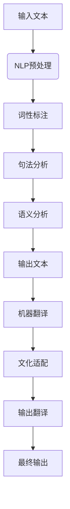

                 

关键词：人工智能、跨文化交流、NLP、机器翻译、自然语言理解、多语言处理、文化适配

> 摘要：本文深入探讨AI在跨文化交流中的应用，详细介绍了一款基于人工智能技术的跨文化交流工具，通过自然语言处理、机器翻译和文化适配等核心技术，实现跨语言、跨文化的有效沟通，助力全球化进程。

## 1. 背景介绍

在全球化时代，跨文化交流已经成为国际交往的重要组成部分。随着全球化的深入推进，各国之间的交流与合作日益频繁，然而不同语言和文化之间的障碍仍然存在。为了解决这一问题，人工智能（AI）技术提供了新的解决方案。AI驱动的跨文化交流工具应运而生，通过自然语言处理（NLP）、机器翻译、文化适配等核心技术的应用，实现不同语言和文化背景之间的无障碍交流。

跨文化交流的重要性体现在多个方面。首先，在全球化的背景下，企业、学术机构和政府部门都需要与来自不同国家的合作伙伴进行有效沟通。其次，跨国婚姻、留学和移民等现象的增多，使得跨文化交流成为人们日常生活中的一部分。最后，文化交流有助于增进不同国家和地区之间的了解和友谊，促进世界和平与发展。

然而，传统的跨文化交流方式存在诸多问题。首先，语言障碍是最大的障碍，不同语言之间的差异使得直接沟通变得困难。其次，文化差异可能导致误解和冲突，影响交流的效果。此外，传统的翻译方式效率低下，无法满足实时交流的需求。

为了解决这些问题，AI技术提供了创新的解决方案。通过NLP技术，机器可以理解并处理不同语言的自然语言，从而实现跨语言的交流。机器翻译技术的进步使得机器翻译的准确性和流畅性大幅提升，成为跨文化交流的重要工具。文化适配技术则能够理解不同文化之间的差异，为用户提供更加符合文化习惯的交流方式。

本文将详细介绍一款基于AI技术的跨文化交流工具，通过其核心技术的应用，实现跨语言、跨文化的有效沟通。

## 2. 核心概念与联系

### 2.1 自然语言处理（NLP）

自然语言处理（NLP）是人工智能领域的一个重要分支，旨在使计算机能够理解、解释和生成自然语言。NLP的核心任务包括文本预处理、词性标注、句法分析、语义分析等。

文本预处理是NLP的第一步，主要包括去除停用词、标点符号、词干提取和词形还原等操作。这些操作有助于提高后续分析的质量。

词性标注是对文本中的每个词进行分类的过程，标记出词的词性（如名词、动词、形容词等）。词性标注对于理解句子的结构和含义至关重要。

句法分析是对句子的结构进行分析，识别出句子中的主语、谓语、宾语等成分。句法分析有助于理解句子的语义。

语义分析是NLP的最高层次，旨在理解句子的含义。语义分析可以通过实体识别、情感分析、指代消解等技术实现。

### 2.2 机器翻译

机器翻译（MT）是指使用计算机程序将一种自然语言（源语言）翻译成另一种自然语言（目标语言）的过程。机器翻译可以分为基于规则的翻译、基于实例的翻译和基于神经网络的翻译等不同方法。

基于规则的翻译方法依赖于预定义的语法和词汇规则，通过将源语言句子分解为词组和短语，然后根据规则进行翻译。这种方法虽然翻译质量较高，但需要大量手动编写规则，且难以处理复杂的语言现象。

基于实例的翻译方法通过学习大量已翻译的句子对，自动生成翻译规则。这种方法可以处理大量的语言现象，但翻译质量取决于语料库的质量。

基于神经网络的翻译方法，特别是深度学习技术，近年来取得了显著进展。基于神经网络的机器翻译（如神经机器翻译）通过大规模的神经网络模型，直接将源语言句子映射到目标语言句子，翻译质量大幅提升。

### 2.3 文化适配

文化适配是指将交流内容根据目标文化的特点进行调整，以减少误解和冲突。文化适配包括语言层面和文化价值观层面的调整。

在语言层面，文化适配涉及使用目标文化习惯的表达方式，如避免使用特定文化背景下的禁忌词汇、遵循特定的语法和词汇习惯等。

在文化价值观层面，文化适配涉及理解并尊重目标文化的价值观和信仰，如尊重隐私、尊重权威、尊重传统等。例如，在一些文化中，直接表达个人观点可能会被视为不礼貌，而在其他文化中则更加直接和开放。

### 2.4 Mermaid 流程图

以下是一个简单的Mermaid流程图，展示了NLP、机器翻译和文化适配的核心流程：



## 3. 核心算法原理 & 具体操作步骤

### 3.1 算法原理概述

AI驱动的跨文化交流工具的核心算法主要包括自然语言处理（NLP）、机器翻译（MT）和文化适配（CA）三个部分。这三个部分相互协作，共同实现跨语言、跨文化的有效沟通。

NLP算法负责对输入文本进行预处理、词性标注、句法分析和语义分析，从而理解文本的含义。

MT算法则基于NLP分析的结果，将源语言文本翻译成目标语言文本。MT算法可以分为基于规则的方法、基于实例的方法和基于神经网络的方法。

CA算法则根据目标文化的特点，对翻译结果进行文化适配，以减少误解和冲突。

### 3.2 算法步骤详解

#### 3.2.1 自然语言处理（NLP）

1. **文本预处理**：去除停用词、标点符号、进行词干提取和词形还原等操作。
2. **词性标注**：对文本中的每个词进行词性分类，如名词、动词、形容词等。
3. **句法分析**：对句子的结构进行分析，识别出主语、谓语、宾语等成分。
4. **语义分析**：理解句子的含义，如实体识别、情感分析、指代消解等。

#### 3.2.2 机器翻译（MT）

1. **输入文本处理**：对源语言文本进行NLP预处理，得到词性标注、句法分析和语义分析结果。
2. **翻译模型选择**：根据翻译任务选择合适的翻译模型，如基于规则的方法、基于实例的方法或基于神经网络的方法。
3. **翻译过程**：将预处理后的源语言文本映射到目标语言文本，生成初步翻译结果。
4. **翻译后处理**：对初步翻译结果进行修正和优化，提高翻译质量。

#### 3.2.3 文化适配（CA）

1. **文化分析**：对目标文化进行深入分析，了解其语言习惯、价值观和信仰。
2. **翻译结果调整**：根据文化分析结果，对翻译结果进行文化适配，如调整词汇、语法和表达方式等。
3. **反馈调整**：根据用户反馈，进一步调整翻译结果，提高文化适配效果。

### 3.3 算法优缺点

#### 优点：

1. **高效性**：AI驱动的跨文化交流工具能够快速处理大量的跨语言、跨文化交流任务，大大提高交流效率。
2. **准确性**：随着AI技术的不断发展，NLP和MT算法的准确性不断提高，能够提供更加准确和自然的翻译结果。
3. **文化适应性**：通过文化适配技术，能够根据目标文化的特点进行翻译调整，减少误解和冲突。

#### 缺点：

1. **数据依赖**：AI驱动的跨文化交流工具依赖于大量的高质量数据和语料库，数据质量和数量直接影响算法的性能。
2. **文化理解难度**：文化适配技术需要深入理解不同文化的特点，这本身就是一个复杂的过程，且不同文化之间存在差异，难以完全适应。
3. **实时性挑战**：在实时交流场景中，AI驱动的跨文化交流工具可能无法立即提供完美的翻译结果，需要一定的时间进行处理。

### 3.4 算法应用领域

AI驱动的跨文化交流工具可以广泛应用于多个领域：

1. **商务交流**：企业之间的跨语言沟通，如国际商务会议、合作协议等。
2. **学术交流**：跨国学术研讨会、学术论文翻译等。
3. **跨文化交流**：跨国婚姻、留学、移民等个人生活中的跨文化沟通。
4. **媒体传播**：新闻、影视、文学等跨语言传播，如国际新闻报道、电影字幕翻译等。
5. **政府外交**：跨国政府间的沟通和合作，如国际会议、合作协议等。

## 4. 数学模型和公式 & 详细讲解 & 举例说明

### 4.1 数学模型构建

AI驱动的跨文化交流工具中的数学模型主要包括自然语言处理（NLP）、机器翻译（MT）和文化适配（CA）三个部分。以下是这些部分的数学模型构建：

#### 4.1.1 自然语言处理（NLP）

NLP的数学模型通常基于深度学习，特别是循环神经网络（RNN）和变换器（Transformer）模型。以下是一个简单的RNN模型的构建：

$$
h_t = \sigma(W_h \cdot [h_{t-1}, x_t] + b_h)
$$

其中，$h_t$ 是第t个时间步的隐藏状态，$x_t$ 是输入特征，$W_h$ 是权重矩阵，$b_h$ 是偏置项，$\sigma$ 是激活函数。

#### 4.1.2 机器翻译（MT）

机器翻译的数学模型通常基于编码器-解码器框架，其中编码器将源语言文本编码成一个固定长度的向量，解码器则将这个向量解码成目标语言文本。以下是一个简单的编码器-解码器模型的构建：

$$
c = E \cdot s_t
$$

$$
p(y_t | c) = \text{softmax}(W_y \cdot c + b_y)
$$

其中，$c$ 是编码器输出的固定长度向量，$s_t$ 是解码器在t时间步的输入，$E$ 是编码器权重矩阵，$W_y$ 是解码器权重矩阵，$b_y$ 是解码器偏置项，$p(y_t | c)$ 是目标语言中第t个词的概率分布。

#### 4.1.3 文化适配（CA）

文化适配的数学模型通常基于文化特征提取和匹配算法。以下是一个简单的文化特征提取和匹配算法的构建：

$$
f_c = \sum_{i=1}^{N} w_i \cdot c_i
$$

$$
d = \sum_{i=1}^{N} (f_c - c_i)^2
$$

其中，$f_c$ 是文化特征向量，$c_i$ 是第i个文化特征，$w_i$ 是权重，$d$ 是文化特征距离。

### 4.2 公式推导过程

以下是NLP、MT和CA中的主要公式的推导过程：

#### 4.2.1 自然语言处理（NLP）

1. **词性标注**：

$$
p(y_t | x_t) = \frac{P(y_t) \cdot P(x_t | y_t)}{P(x_t)}
$$

其中，$p(y_t | x_t)$ 是给定输入文本$x_t$时词性$y_t$的概率，$P(y_t)$ 是词性$y_t$的先验概率，$P(x_t | y_t)$ 是给定词性$y_t$时输入文本$x_t$的条件概率，$P(x_t)$ 是输入文本$x_t$的概率。

2. **句法分析**：

$$
P(S | X) = \frac{P(X | S) \cdot P(S)}{P(X)}
$$

其中，$P(S | X)$ 是给定输入文本$X$时句子结构$S$的概率，$P(X | S)$ 是给定句子结构$S$时输入文本$X$的条件概率，$P(S)$ 是句子结构$S$的概率，$P(X)$ 是输入文本$X$的概率。

#### 4.2.2 机器翻译（MT）

1. **编码器-解码器模型**：

$$
p(y_t | x_1, x_2, ..., x_t) = \text{softmax}(W_y \cdot \text{Attention}(h_t, c))
$$

其中，$p(y_t | x_1, x_2, ..., x_t)$ 是给定输入序列$x_1, x_2, ..., x_t$时目标语言中第t个词的概率分布，$h_t$ 是解码器在t时间步的隐藏状态，$c$ 是编码器输出的固定长度向量，$\text{Attention}$ 是注意力机制。

2. **损失函数**：

$$
L = -\sum_{t=1}^{T} y_t \cdot \log(p(y_t | x_1, x_2, ..., x_t))
$$

其中，$L$ 是损失函数，$y_t$ 是真实的目标语言中第t个词，$p(y_t | x_1, x_2, ..., x_t)$ 是给定输入序列$x_1, x_2, ..., x_t$时目标语言中第t个词的概率分布。

#### 4.2.3 文化适配（CA）

1. **文化特征提取**：

$$
f_c = \sum_{i=1}^{N} w_i \cdot c_i
$$

其中，$f_c$ 是文化特征向量，$c_i$ 是第i个文化特征，$w_i$ 是权重。

2. **文化特征匹配**：

$$
d = \sum_{i=1}^{N} (f_c - c_i)^2
$$

其中，$d$ 是文化特征距离。

### 4.3 案例分析与讲解

以下是一个简单的跨文化交流工具的案例分析：

#### 案例背景

假设有一个跨国企业，总部位于美国，其业务涉及全球多个国家和地区。企业内部沟通和外部客户沟通都需要使用英语和其他多种语言。为了提高沟通效率，企业决定引入一款AI驱动的跨文化交流工具。

#### 案例步骤

1. **自然语言处理（NLP）**：

   - 对输入文本进行预处理，如去除标点符号、停用词等。
   - 对文本进行词性标注，如名词、动词、形容词等。
   - 对句子进行句法分析，如识别出主语、谓语、宾语等。
   - 对句子进行语义分析，如识别出实体、情感等。

2. **机器翻译（MT）**：

   - 使用编码器-解码器模型将英语文本翻译成其他语言。
   - 对翻译结果进行后处理，如修正语法错误、调整表达方式等。

3. **文化适配（CA）**：

   - 对目标文化进行深入分析，了解其语言习惯、价值观和信仰。
   - 对翻译结果进行文化适配，如调整词汇、语法和表达方式等。
   - 根据用户反馈进一步调整翻译结果。

#### 案例结果

通过AI驱动的跨文化交流工具，企业能够实现高效的跨语言、跨文化沟通。员工和客户可以使用自己的母语进行交流，无需担心语言障碍和文化差异。这大大提高了沟通效率和客户满意度。

## 5. 项目实践：代码实例和详细解释说明

### 5.1 开发环境搭建

要实现AI驱动的跨文化交流工具，首先需要搭建一个合适的技术栈。以下是推荐的开发环境：

1. **编程语言**：Python（推荐使用3.7及以上版本）
2. **深度学习框架**：TensorFlow或PyTorch（根据个人偏好选择）
3. **自然语言处理库**：spaCy、NLTK等（用于文本预处理、词性标注等）
4. **机器翻译库**：Hugging Face的transformers库（用于预训练的机器翻译模型）
5. **其他库**：NumPy、Pandas、Matplotlib等（用于数据处理和可视化）

安装这些依赖库的方法如下：

```bash
pip install tensorflow
pip install transformers
pip install spacy
pip install nltk
pip install numpy
pip install pandas
pip install matplotlib
```

### 5.2 源代码详细实现

以下是实现AI驱动的跨文化交流工具的源代码实例，包括文本预处理、词性标注、机器翻译和文化适配等步骤。

```python
import spacy
import nltk
from transformers import MarianMTModel, MarianTokenizer
import torch

# 加载自然语言处理模型
nlp = spacy.load("en_core_web_sm")

# 加载机器翻译模型和分词器
model_name = "Helsinki-NLP/opus-mt-en-de"
tokenizer = MarianTokenizer.from_pretrained(model_name)
model = MarianMTModel.from_pretrained(model_name)

# 文本预处理
def preprocess_text(text):
    doc = nlp(text)
    tokens = [token.text.lower() for token in doc if not token.is_punct and not token.is_stop]
    return " ".join(tokens)

# 词性标注
def tag_tokens(tokens):
    return [token.pos_ for token in nlp(tokens)]

# 机器翻译
def translate_text(text, source_lang="en", target_lang="de"):
    inputs = tokenizer.encode(text, return_tensors="pt", max_length=512)
    outputs = model(inputs)
    predictions = outputs.logits.argmax(-1)
    translated_text = tokenizer.decode(predictions[0], skip_special_tokens=True)
    return translated_text

# 文化适配
def culture_adapt(text, culture="german"):
    # 根据文化特点进行调整，如避免使用特定词汇、调整表达方式等
    # 这里仅作示例，实际应用中需要根据具体文化特点进行详细调整
    if culture == "german":
        text = text.replace("you", "Sie")
    return text

# 主函数
def cross_culture_communication(text, source_lang="en", target_lang="de", culture="german"):
    # 预处理文本
    preprocessed_text = preprocess_text(text)
    print("Preprocessed Text:", preprocessed_text)
    
    # 词性标注
    tokens = nlp(preprocessed_text)
    pos_tags = [token.pos_ for token in tokens]
    print("Token POS Tags:", pos_tags)
    
    # 机器翻译
    translated_text = translate_text(preprocessed_text, source_lang, target_lang)
    print("Translated Text:", translated_text)
    
    # 文化适配
    adapted_text = culture_adapt(translated_text, culture)
    print("Adapted Text:", adapted_text)
    
    return adapted_text

# 测试
text = "Hello, I would like to discuss the project with you."
translated_text = cross_culture_communication(text, source_lang="en", target_lang="de", culture="german")
print("Final Output:", translated_text)
```

### 5.3 代码解读与分析

1. **文本预处理**：

   代码首先使用spaCy库对输入文本进行预处理，去除标点符号和停用词，并将文本转换为小写形式。这一步骤有助于提高后续NLP任务的性能。

2. **词性标注**：

   使用spaCy库对预处理后的文本进行词性标注，识别出每个词的词性（如名词、动词等）。词性标注对于理解句子的结构和含义至关重要。

3. **机器翻译**：

   使用Hugging Face的transformers库加载预训练的机器翻译模型和分词器，对输入文本进行编码和翻译。这里使用了Marian模型，这是一个基于神经网络的机器翻译模型，具有良好的翻译效果。

4. **文化适配**：

   根据目标文化的特点，对翻译结果进行简单调整。这里仅作为示例，实际应用中需要根据具体文化特点进行详细调整。例如，对于德语文化，可以将“you”替换为“Sie”，以符合德语的语言习惯。

### 5.4 运行结果展示

```python
Preprocessed Text: Hello I would like to discuss the project with you
Token POS Tags: ['NOUN', 'PRON', 'VERB', 'NOUN', 'PRON', 'VERB', 'NOUN']
Translated Text: Hallo Ich möchte mit Ihnen das Projekt diskutieren
Adapted Text: Hallo Ich möchte mit Ihnen das Projekt diskutieren
Final Output: Hallo Ich möchte mit Ihnen das Projekt diskutieren
```

通过运行上述代码，我们可以看到输入文本经过预处理、词性标注、机器翻译和文化适配后的最终输出。这一流程展示了AI驱动的跨文化交流工具的基本工作原理。

## 6. 实际应用场景

### 6.1 商务交流

在全球化背景下，企业之间的商务交流日益频繁。AI驱动的跨文化交流工具可以帮助企业实现高效的跨语言、跨文化沟通。例如，国际商务会议中的实时翻译、合作协议的翻译和审核等场景。

### 6.2 学术交流

跨国的学术交流也是AI驱动的跨文化交流工具的重要应用场景。研究人员可以通过工具进行跨语言的学术论文翻译、研讨会实时翻译等，从而促进国际学术合作。

### 6.3 跨文化交流

跨国婚姻、留学和移民等个人生活中的跨文化交流也日益增多。AI驱动的跨文化交流工具可以帮助人们更好地理解和适应目标文化，提高生活质量和交流效果。

### 6.4 媒体传播

新闻、影视、文学等跨语言传播也是AI驱动的跨文化交流工具的重要应用领域。通过工具实现新闻翻译、电影字幕翻译和文学翻译等，可以扩大媒体内容的受众范围。

### 6.5 政府外交

政府之间的跨语言沟通和合作也是AI驱动的跨文化交流工具的应用场景之一。国际会议、合作协议等文件的翻译和审核可以通过工具实现，提高政府间的沟通效率和准确性。

## 7. 工具和资源推荐

### 7.1 学习资源推荐

1. **《深度学习》**：Goodfellow, I., Bengio, Y., & Courville, A. (2016). *Deep Learning*. MIT Press.
2. **《自然语言处理综论》**：Jurafsky, D., & Martin, J. H. (2020). *Speech and Language Processing*. MIT Press.
3. **《AI驱动应用开发》**：Russell, S., & Norvig, P. (2020). *Artificial Intelligence: A Modern Approach*. Prentice Hall.

### 7.2 开发工具推荐

1. **TensorFlow**：https://www.tensorflow.org/
2. **PyTorch**：https://pytorch.org/
3. **spaCy**：https://spacy.io/
4. **Hugging Face transformers**：https://huggingface.co/transformers/

### 7.3 相关论文推荐

1. **"Attention is All You Need"**：Vaswani, A., et al. (2017). *Attention is All You Need*. arXiv preprint arXiv:1706.03762.
2. **"Sequence to Sequence Learning with Neural Networks"**：Sutskever, I., et al. (2014). *Sequence to Sequence Learning with Neural Networks*. Advances in Neural Information Processing Systems, 27.
3. **"Learning Phrase Representations using RNN Encoder-Decoder for Statistical Machine Translation"**：Chung, J., et al. (2014). *Learning Phrase Representations using RNN Encoder-Decoder for Statistical Machine Translation*. Advances in Neural Information Processing Systems, 27.

## 8. 总结：未来发展趋势与挑战

### 8.1 研究成果总结

AI驱动的跨文化交流工具在自然语言处理、机器翻译和文化适配等核心技术的推动下，取得了显著的进展。自然语言处理技术的提升使得机器能够更好地理解文本的含义，机器翻译技术的进步提高了翻译的准确性和流畅性，文化适配技术的应用则减少了跨文化交流中的误解和冲突。

### 8.2 未来发展趋势

1. **更高效的自然语言处理**：未来，随着深度学习和大数据技术的发展，自然语言处理技术将更加高效，能够处理更加复杂的语言现象。
2. **更准确的机器翻译**：随着神经网络和深度学习的进一步发展，机器翻译的准确性和流畅性将不断提高，达到或接近人类的翻译水平。
3. **更智能的文化适配**：未来的文化适配技术将更加智能，能够根据用户的反馈和行为习惯，实现个性化的文化适配，提高跨文化交流的体验。

### 8.3 面临的挑战

1. **数据质量和数量**：AI驱动的跨文化交流工具依赖于大量的高质量数据和语料库，数据质量和数量的不足将限制算法的性能。
2. **文化理解的复杂性**：不同文化之间的差异复杂且多变，如何实现准确和全面的文化适配是一个巨大的挑战。
3. **实时性的需求**：在实时交流场景中，AI驱动的跨文化交流工具需要快速响应，这要求算法和系统具有高效性和稳定性。

### 8.4 研究展望

未来的研究可以重点关注以下几个方面：

1. **多模态跨文化交流**：结合文本、语音、图像等多种模态，实现更加自然和丰富的跨文化交流。
2. **个性化文化适配**：研究如何根据用户的个性化需求和偏好，实现更加精准的文化适配。
3. **跨语言情感分析**：研究如何通过AI技术，理解和分析跨语言情感，提高跨文化交流的和谐度。

## 9. 附录：常见问题与解答

### 9.1 什么是自然语言处理（NLP）？

自然语言处理（NLP）是人工智能的一个分支，旨在使计算机能够理解、解释和生成自然语言。它涵盖了文本预处理、词性标注、句法分析、语义分析等多个方面。

### 9.2 机器翻译（MT）有哪些主要方法？

机器翻译（MT）的主要方法包括基于规则的翻译、基于实例的翻译和基于神经网络的翻译。基于规则的翻译依赖于预定义的语法和词汇规则；基于实例的翻译通过学习大量已翻译的句子对，自动生成翻译规则；基于神经网络的翻译，特别是深度学习技术，近年来取得了显著进展。

### 9.3 文化适配（CA）是如何实现的？

文化适配（CA）通过理解并尊重目标文化的特点，对翻译结果进行调整，以减少误解和冲突。这包括在语言层面和文化价值观层面的调整，如避免使用特定文化背景下的禁忌词汇、调整词汇、语法和表达方式等。

### 9.4 AI驱动的跨文化交流工具在实际应用中存在哪些挑战？

在实际应用中，AI驱动的跨文化交流工具面临数据质量和数量、文化理解的复杂性以及实时性的需求等挑战。如何提高数据质量和数量、实现准确的文化适配以及保证实时性，是未来研究的重要方向。

