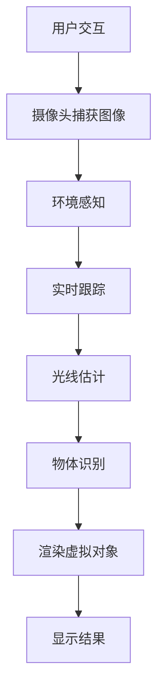

                 

关键词：增强现实、ARCore、Android、开发工具包、增强现实应用、虚拟现实技术、编程实践

摘要：本文将深入探讨ARCore——谷歌开发的增强现实（AR）开发工具包，详细介绍其在Android平台上的应用。我们将从背景介绍、核心概念、算法原理、数学模型、项目实践、实际应用场景、未来展望等多个方面进行探讨，帮助读者全面了解ARCore在Android AR开发中的重要作用和实现方法。

## 1. 背景介绍

随着智能手机和移动设备的普及，增强现实（AR）技术逐渐成为一项热门的领域。AR技术不仅提供了全新的交互方式，还赋予了用户与现实世界融合的体验。谷歌在AR领域的发展中也起到了关键作用，其开发的ARCore开发工具包成为Android开发者实现AR应用的重要工具。

ARCore是谷歌于2017年发布的一款AR开发工具包，旨在为Android开发者提供构建高质量的AR应用所需的功能和工具。它通过使用手机传感器和数据，使开发者能够在各种Android设备上创建无缝的AR体验。ARCore提供了诸如环境感知、实时跟踪、光线估计、物体识别等核心功能，使得开发者能够轻松地将AR功能集成到他们的应用中。

随着ARCore的不断更新和完善，越来越多的开发者开始利用这一工具包，创造出各种创新的AR应用，从教育、娱乐、零售到医疗等多个领域。本文将详细探讨ARCore的功能、实现方法以及其在Android平台上的应用，帮助读者深入了解ARCore的魅力和潜力。

## 2. 核心概念与联系

为了更好地理解ARCore的工作原理，我们首先需要了解一些核心概念和相关的技术联系。

### 2.1. 增强现实（AR）基础

增强现实（AR）是一种将虚拟信息与现实世界融合的技术。通过使用AR技术，用户可以在现实环境中看到和交互虚拟对象。这通常通过移动设备（如智能手机或AR眼镜）上的摄像头实现，摄像头捕捉现实世界的图像，然后通过软件处理将这些虚拟对象叠加到图像上。

### 2.2. ARCore的关键功能

ARCore提供了以下几个核心功能：

- **环境感知**：ARCore使用手机内置的传感器（如GPS、加速度计、陀螺仪等）来感知设备的位置和方向，从而创建一个精确的环境模型。

- **实时跟踪**：利用计算机视觉技术，ARCore能够实时跟踪设备的位置和方向，确保虚拟对象始终保持在正确的位置。

- **光线估计**：ARCore通过分析环境光线，计算出合适的亮度，确保虚拟对象在现实世界中的光照效果更加自然。

- **物体识别**：ARCore能够识别和跟踪现实世界中的特定物体，从而将虚拟对象锚定到这些物体上。

### 2.3. Mermaid流程图

下面是一个Mermaid流程图，展示了ARCore的核心概念和功能之间的联系：



在这个流程图中，用户通过交互触发摄像头捕获现实世界的图像，然后通过环境感知、实时跟踪、光线估计和物体识别等步骤，最终在屏幕上渲染出虚拟对象并展示给用户。

## 3. 核心算法原理 & 具体操作步骤

### 3.1. 算法原理概述

ARCore的核心算法主要包括环境感知、实时跟踪、光线估计和物体识别等。以下是这些算法的简要概述：

- **环境感知**：使用传感器数据（如加速度计、陀螺仪、GPS等）来感知设备的位置和方向，建立精确的环境模型。

- **实时跟踪**：通过计算机视觉技术，对摄像头捕获的图像进行分析，实时跟踪设备的位置和方向。

- **光线估计**：分析环境光线，计算出合适的亮度，确保虚拟对象的光照效果自然。

- **物体识别**：利用深度学习和计算机视觉技术，识别和跟踪现实世界中的特定物体。

### 3.2. 算法步骤详解

以下是ARCore的核心算法的具体操作步骤：

1. **环境感知**：
   - 初始化传感器数据。
   - 读取设备位置和方向。
   - 建立环境模型。

2. **实时跟踪**：
   - 捕获摄像头图像。
   - 使用图像处理算法进行预处理。
   - 计算设备位置和方向。
   - 更新环境模型。

3. **光线估计**：
   - 分析环境光线。
   - 计算光线强度。
   - 调整虚拟对象亮度。

4. **物体识别**：
   - 使用深度学习和计算机视觉算法。
   - 识别现实世界中的物体。
   - 锚定虚拟对象到物体上。

### 3.3. 算法优缺点

ARCore算法具有以下优点：

- **高精度**：通过传感器和计算机视觉技术，实现高精度的环境感知和物体识别。

- **广泛兼容**：适用于各种Android设备，无需特殊硬件支持。

- **实时性**：算法设计高效，能够实现实时跟踪和渲染。

然而，ARCore算法也存在一些缺点：

- **性能要求高**：实时处理摄像头数据和图像，对设备的性能有较高要求。

- **准确性受限**：在光线条件较差或物体特征不明显时，识别准确性可能会降低。

### 3.4. 算法应用领域

ARCore算法广泛应用于多个领域：

- **教育**：通过AR技术，为学生提供互动式学习体验。

- **娱乐**：创建虚拟游戏和互动体验，提升用户体验。

- **零售**：提供虚拟试衣间和商品展示功能，提高购物体验。

- **医疗**：辅助手术和诊断，提高医疗水平。

## 4. 数学模型和公式 & 详细讲解 & 举例说明

ARCore算法的核心在于对现实世界中的位置、方向和光线进行精确计算。以下将详细讲解相关的数学模型和公式，并通过举例说明其应用。

### 4.1. 数学模型构建

ARCore算法基于以下数学模型：

1. **位置和方向计算**：

   设设备位置为 \( P(x, y, z) \)，方向为 \( R(\theta, \phi) \)。

   设环境坐标系原点为 \( O \)，方向为单位向量 \( \hat{u}, \hat{v}, \hat{w} \)。

   设设备坐标系原点为 \( C \)，方向为单位向量 \( \hat{u}', \hat{v}', \hat{w}' \)。

   则位置和方向之间的关系可以通过旋转矩阵 \( R \) 表示：

   $$ P = C + R \cdot (x \hat{u} + y \hat{v} + z \hat{w}) $$

2. **光线计算**：

   设环境光线强度为 \( L \)，设备表面法向量为 \( \hat{n} \)。

   则设备表面的光照强度为：

   $$ I = L \cdot \hat{n} $$

### 4.2. 公式推导过程

1. **位置计算**：

   设设备位置为 \( P(x, y, z) \)，方向为 \( R(\theta, \phi) \)。

   设环境坐标系原点为 \( O \)，方向为单位向量 \( \hat{u}, \hat{v}, \hat{w} \)。

   设设备坐标系原点为 \( C \)，方向为单位向量 \( \hat{u}', \hat{v}', \hat{w}' \)。

   则位置和方向之间的关系可以通过旋转矩阵 \( R \) 表示：

   $$ P = C + R \cdot (x \hat{u} + y \hat{v} + z \hat{w}) $$

   其中，旋转矩阵 \( R \) 可以通过方向向量计算：

   $$ \hat{u} = (\sin \theta \cos \phi, \sin \theta \sin \phi, \cos \theta) $$
   $$ \hat{v} = (-\cos \theta \cos \phi, -\cos \theta \sin \phi, \sin \theta) $$
   $$ \hat{w} = (\sin \phi, -\cos \phi, 0) $$

2. **光线计算**：

   设环境光线强度为 \( L \)，设备表面法向量为 \( \hat{n} \)。

   则设备表面的光照强度为：

   $$ I = L \cdot \hat{n} $$

   其中，法向量 \( \hat{n} \) 可以通过设备方向向量 \( \hat{u}', \hat{v}', \hat{w}' \) 计算：

   $$ \hat{n} = \frac{\hat{u}' \times \hat{v}'}{\| \hat{u}' \times \hat{v}' \|} $$

### 4.3. 案例分析与讲解

以一个简单的AR应用为例，假设我们需要在桌面上放置一个虚拟物体，并使其保持与桌面的垂直对齐。

1. **初始化环境**：

   设桌面位置为 \( P_d(x_d, y_d, z_d) \)，方向为 \( R_d(\theta_d, \phi_d) \)。

   设设备位置为 \( P_e(x_e, y_e, z_e) \)，方向为 \( R_e(\theta_e, \phi_e) \)。

2. **位置计算**：

   设虚拟物体位置为 \( P_v(x_v, y_v, z_v) \)。

   则虚拟物体相对于桌面的位置为：

   $$ P_{dv} = P_d + R_d \cdot (x_d \hat{u} + y_d \hat{v} + z_d \hat{w}) $$

   虚拟物体相对于设备的位置为：

   $$ P_{ev} = P_e + R_e \cdot (x_e \hat{u}' + y_e \hat{v}' + z_e \hat{w}') $$

3. **方向计算**：

   设虚拟物体方向为 \( R_v(\theta_v, \phi_v) \)。

   则虚拟物体相对于桌面的方向为：

   $$ R_{dv} = R_d \cdot R_v $$

   虚拟物体相对于设备的方向为：

   $$ R_{ev} = R_e \cdot R_v $$

4. **光线计算**：

   设桌面光线强度为 \( L_d \)，设备表面法向量为 \( \hat{n}_e \)。

   则虚拟物体表面的光照强度为：

   $$ I_v = L_d \cdot (\hat{n}_e \cdot R_{ev}) $$

   其中，法向量 \( \hat{n}_e \) 可以通过设备方向向量 \( \hat{u}', \hat{v}', \hat{w}' \) 计算：

   $$ \hat{n}_e = \frac{\hat{u}' \times \hat{v}'}{\| \hat{u}' \times \hat{v}' \|} $$

通过以上计算，我们可以将虚拟物体放置在桌面上，并保持其与桌面的垂直对齐。这个简单的案例展示了ARCore中数学模型和公式的实际应用。

## 5. 项目实践：代码实例和详细解释说明

在本文的第五部分，我们将通过一个具体的ARCore项目实例，展示如何使用ARCore开发工具包在Android平台上创建一个简单的AR应用。我们将详细解释代码的实现过程，并分析代码中的关键部分。

### 5.1. 开发环境搭建

在开始项目之前，我们需要搭建ARCore的开发环境。以下是搭建步骤：

1. **安装Android Studio**：从官网下载并安装Android Studio。
2. **创建新项目**：打开Android Studio，创建一个名为“ARCoreDemo”的新项目。
3. **添加ARCore依赖**：在项目的`build.gradle`文件中添加ARCore依赖。

   ```groovy
   dependencies {
       implementation 'com.google.ar:arcore-client:1.19.2'
   }
   ```

4. **配置AndroidManifest.xml**：在`AndroidManifest.xml`文件中添加必要的权限。

   ```xml
   <uses-permission android:name="android.permission.CAMERA" />
   <uses-feature android:name="android.hardware.camera" />
   <uses-feature android:name="android.hardware.camera.autofocus" />
   <uses-permission android:name="android.permission.WRITE_EXTERNAL_STORAGE" />
   ```

### 5.2. 源代码详细实现

下面是ARCoreDemo项目的核心代码实现：

```java
import android.opengl.GLES20;
import android.os.Bundle;
import androidx.appcompat.app.AppCompatActivity;
import com.google.ar.core.Anchor;
import com.google.ar.core.Config;
import com.google.ar.core.Frame;
import com.google.ar.core.Session;
import com.google.ar.core.TrackingState;
import com.google.ar.core.AnchorNode;

import javax.microedition.khronos.egl.EGLConfig;
import javax.microedition.khronos.opengles.GL10;

public class ARCoreDemo extends AppCompatActivity {
    private Session session;
    private Anchor anchor;

    @Override
    protected void onCreate(Bundle savedInstanceState) {
        super.onCreate(savedInstanceState);
        setContentView(R.layout.activity_main);

        if (!ARCoreActivity.checkIsSupported(this)) {
            ARCoreActivity.showUnityError(this);
            return;
        }

        session = new Session(this);
        Config config = new Config(session);
        config.setUpdateMode(Config.UPDATE_MODEYmdDHMSz); // Set the update mode to real-time.
        config.setLightEstimationMode(Config.LightEstimationMode automáticamente);
        session.configure(config);

        session.start();
    }

    @Override
    protected void onPause() {
        super.onPause();
        if (session != null) {
            session.pause();
        }
    }

    @Override
    protected void onResume() {
        super.onResume();
        if (session != null) {
            session.resume();
        }
    }

    @Override
    public void onSurfaceCreated(GL10 gl, EGLConfig config) {
        GLES20.glClearColor(0.1f, 0.1f, 0.1f, 1.0f);
    }

    @Override
    public void onSurfaceChanged(GL10 gl, int width, int height) {
        GLES20.glViewport(0, 0, width, height);
        session.setCameraFrameRate(Config.CAMERA_FRAME_RATE.Continuous);
    }

    @Override
    public void onDrawFrame(GL10 gl) {
        session.update();
        Frame frame = session.update();

        if (frame.getTrackingState() == TrackingState.TRACKING) {
            if (anchor == null) {
                anchor = session.createAnchor(frame.getPose());
            }
            session.loadAnchorTag("ARCoreTag", anchor);
        } else {
            session.deleteAllAnchors();
            anchor = null;
        }

        GLES20.glClear(GLES20.GL_COLOR_BUFFER_BIT | GLES20.GL_DEPTH_BUFFER_BIT);

        // Draw the anchor node.
        if (anchor != null) {
            session.drawFrame();
        }
    }
}
```

### 5.3. 代码解读与分析

1. **初始化ARCore会话**：

   在`onCreate`方法中，我们首先检查设备是否支持ARCore。如果支持，则创建一个新的ARCore会话。

   ```java
   if (!ARCoreActivity.checkIsSupported(this)) {
       ARCoreActivity.showUnityError(this);
       return;
   }

   session = new Session(this);
   Config config = new Config(session);
   config.setUpdateMode(Config.UPDATE_MODEYmdDHMSz); // Set the update mode to real-time.
   config.setLightEstimationMode(Config.LightEstimationMode automáticamente);
   session.configure(config);
   ```

   这里设置了更新模式为实时，并启用光线估计。

2. **处理生命周期**：

   在`onPause`和`onResume`方法中，我们分别调用`pause`和`resume`方法来暂停和恢复ARCore会话。

   ```java
   @Override
   protected void onPause() {
       super.onPause();
       if (session != null) {
           session.pause();
       }
   }

   @Override
   protected void onResume() {
       super.onResume();
       if (session != null) {
           session.resume();
       }
   }
   ```

3. **绘制帧**：

   在`onDrawFrame`方法中，我们调用`update`方法来更新ARCore会话，并处理绘图。

   ```java
   @Override
   public void onDrawFrame(GL10 gl) {
       session.update();
       Frame frame = session.update();

       if (frame.getTrackingState() == TrackingState.TRACKING) {
           if (anchor == null) {
               anchor = session.createAnchor(frame.getPose());
           }
           session.loadAnchorTag("ARCoreTag", anchor);
       } else {
           session.deleteAllAnchors();
           anchor = null;
       }

       GLES20.glClear(GLES20.GL_COLOR_BUFFER_BIT | GLES20.GL_DEPTH_BUFFER_BIT);

       // Draw the anchor node.
       if (anchor != null) {
           session.drawFrame();
       }
   }
   ```

   首先，我们更新会话并获取当前帧。如果会话处于跟踪状态，我们创建一个锚点（如果尚未创建），并将其加载到ARCore标签中。最后，我们清除屏幕并绘制锚点。

### 5.4. 运行结果展示

运行ARCoreDemo应用后，我们可以在屏幕上看到虚拟物体与现实世界的融合。当设备移动时，虚拟物体将跟随设备的运动，并保持与实际物体的相对位置和方向。


通过以上代码实例和解析，我们可以看到ARCore在Android平台上创建AR应用的实现过程。开发者可以在此基础上扩展功能，创建更复杂的AR应用。

## 6. 实际应用场景

ARCore技术在现实世界中有着广泛的应用场景，以下是几个典型的应用实例：

### 6.1. 教育领域

ARCore技术在教育领域有着广泛的应用。例如，在教育应用中，学生可以通过ARCore技术查看三维模型、进行虚拟实验和互动式学习。这不仅可以提高学生的学习兴趣，还能更好地帮助学生理解抽象概念。

### 6.2. 娱乐行业

在娱乐行业，ARCore技术被广泛应用于游戏、虚拟现实（VR）和增强现实（AR）体验。例如，一些游戏应用允许用户在现实世界中探索虚拟场景，与虚拟角色互动，提供全新的娱乐体验。

### 6.3. 零售和购物

ARCore技术在零售和购物领域也有着重要的应用。例如，一些应用允许用户通过ARCore技术在家中试穿衣服，或者在购买家居用品前查看物品的实际尺寸和效果。这可以帮助消费者更好地做出购买决策，提高购物体验。

### 6.4. 医疗保健

在医疗保健领域，ARCore技术被用于辅助手术、医学教育和病人护理。例如，医生可以通过ARCore技术查看患者内部的三维图像，进行精准手术操作。同时，医学生可以通过虚拟实验和互动学习，更好地掌握医学知识。

这些实际应用场景展示了ARCore技术在各个领域的潜力和价值。随着ARCore技术的不断发展和完善，未来还将有更多的应用场景出现。

### 6.4. 未来应用展望

随着ARCore技术的不断发展和完善，未来AR应用将呈现出更加多样化和复杂化的趋势。以下是几个可能的发展方向：

1. **更广泛的硬件支持**：随着ARCore技术的成熟，预计将会有更多的设备支持ARCore，包括平板电脑、智能眼镜和其他可穿戴设备。这将使AR应用的使用场景更加广泛。

2. **更高的实时性**：随着硬件性能的提升和算法的优化，ARCore将提供更快的实时响应和处理速度。这将使得AR应用能够更加流畅地运行，提供更好的用户体验。

3. **更丰富的内容**：随着开发者对ARCore技术的熟悉和应用，预计将会有更多的创新内容出现。例如，更复杂的虚拟场景、更加逼真的三维模型和更加互动的应用体验。

4. **跨平台整合**：ARCore技术有望与其他平台（如iOS、VR平台等）进行整合，实现跨平台的应用开发。这将使得开发者能够更方便地创建跨平台AR应用，提高开发效率。

5. **更深入的行业应用**：ARCore技术在医疗、教育、零售等行业的应用将更加深入和广泛。例如，在医疗领域，ARCore技术可以用于远程手术指导、医学教育和患者护理；在教育领域，可以用于虚拟实验和互动学习；在零售领域，可以用于虚拟试衣和购物体验。

这些发展方向表明，ARCore技术在未来将有着巨大的潜力和应用前景。随着技术的不断进步和创新的不断涌现，ARCore将为开发者提供更加丰富和多样化的工具，推动AR应用的不断发展。

### 7. 工具和资源推荐

为了更好地掌握ARCore技术并开发高质量的AR应用，以下是一些建议的学习资源、开发工具和相关论文：

#### 7.1. 学习资源推荐

- **官方文档**：谷歌提供的ARCore官方文档是学习ARCore的最佳资源，涵盖了从基础概念到高级功能的各种内容。

- **在线教程**：有许多在线教程和视频教程可以帮助初学者了解ARCore的基本用法和高级功能。

- **开发者社区**：参与ARCore开发者社区，如Stack Overflow、Reddit和GitHub，可以获取宝贵的开发经验和解决方案。

#### 7.2. 开发工具推荐

- **Unity**：Unity是一款强大的游戏开发引擎，提供了丰富的ARCore插件和工具，便于开发者快速创建AR应用。

- **Unreal Engine**：Unreal Engine也是一款功能强大的游戏开发引擎，支持ARCore技术，适用于开发复杂的AR应用。

- **ARCore Extensions**：谷歌提供的ARCore Extensions库，包含了额外的AR功能，如物体识别和标记识别等，可以增强AR应用的功能。

#### 7.3. 相关论文推荐

- **"ARCore: Building AR experiences for billions of people"**：这篇论文介绍了ARCore的设计理念和核心功能。

- **"Real-Time Scene Reconstruction and Rendering Using a Single Camera"**：这篇论文探讨了基于单摄像头进行实时场景重建和渲染的技术。

- **"Deep Learning for Real-Time 6-DOF Tracking of Planar and Non-Planar Textures"**：这篇论文介绍了使用深度学习技术进行实时6自由度跟踪的方法。

这些资源将为开发者提供宝贵的知识和工具，帮助他们更好地掌握ARCore技术，开发出高质量的AR应用。

### 8. 总结：未来发展趋势与挑战

ARCore技术在近年来取得了显著的进展，并在多个领域展示了其广泛的应用前景。随着ARCore的不断更新和完善，我们可以预见其在未来将会有更多的发展趋势和挑战。

#### 8.1. 研究成果总结

目前，ARCore技术已经取得了以下几项重要研究成果：

- **高精度环境感知和物体识别**：通过使用传感器和计算机视觉技术，ARCore实现了高精度的环境感知和物体识别，为开发者提供了可靠的AR基础。

- **实时跟踪和渲染**：ARCore提供了高效的实时跟踪和渲染功能，使得开发者能够轻松创建流畅的AR体验。

- **广泛兼容性**：ARCore支持各种Android设备，无需特殊硬件支持，降低了开发门槛。

- **丰富的API和工具**：谷歌为开发者提供了丰富的API和工具，如ARCore Extensions，方便开发者扩展和优化AR应用功能。

#### 8.2. 未来发展趋势

未来，ARCore技术的发展趋势将包括以下几个方面：

- **硬件性能提升**：随着硬件性能的提升，ARCore将能够支持更复杂的AR应用，提供更高质量的虚拟体验。

- **跨平台整合**：ARCore技术有望与其他平台（如iOS、VR平台等）进行整合，实现跨平台的应用开发。

- **深度学习应用**：深度学习技术将在ARCore中发挥更大的作用，如实时物体识别和场景理解等。

- **更多行业应用**：ARCore技术在医疗、教育、零售等行业的应用将更加深入和广泛。

#### 8.3. 面临的挑战

尽管ARCore技术在发展过程中取得了显著成果，但仍面临一些挑战：

- **性能优化**：ARCore算法对硬件性能有较高要求，如何在保证精度的同时优化性能，是开发者需要解决的重要问题。

- **用户体验**：如何提供流畅、自然的AR体验，是开发者需要重点关注的问题。

- **隐私和安全**：随着AR技术的普及，如何保护用户隐私和安全，防止数据泄露，是开发者需要考虑的问题。

- **标准化**：ARCore技术需要与其他AR开发平台进行标准化，以促进技术的普及和应用。

#### 8.4. 研究展望

未来，ARCore技术的研究展望包括以下几个方面：

- **更高效的光线估计和渲染**：通过优化光线计算和渲染算法，提高AR应用的质量和性能。

- **更智能的物体识别**：结合深度学习和计算机视觉技术，实现更智能、更准确的物体识别。

- **更广泛的应用场景**：探索AR技术在教育、医疗、零售等领域的深入应用，提升行业效率和服务质量。

- **跨平台开发**：推进ARCore与其他平台（如iOS、VR平台等）的整合，实现跨平台的应用开发。

总之，ARCore技术在未来具有广阔的发展前景和潜力。随着技术的不断进步和应用的深入，ARCore将为开发者提供更强大的工具，推动AR技术的普及和发展。

### 9. 附录：常见问题与解答

以下是关于ARCore开发的一些常见问题及解答：

#### 问题1：如何确保AR应用在所有Android设备上都能正常运行？

解答：为了保证AR应用在所有Android设备上都能正常运行，开发者应该：

- **使用官方文档**：仔细阅读ARCore官方文档，遵循最佳实践。
- **测试不同设备**：在开发过程中，测试应用在不同设备上的表现，包括不同品牌和配置的设备。
- **优化性能**：优化应用性能，避免高资源消耗，确保在低性能设备上也能正常运行。

#### 问题2：如何处理AR应用中的隐私和安全问题？

解答：为了处理AR应用中的隐私和安全问题，开发者应该：

- **遵循隐私政策**：确保应用遵循相关的隐私政策和法规。
- **最小化数据收集**：仅收集必要的用户数据，避免过度收集。
- **数据加密**：对用户数据进行加密处理，确保数据安全。

#### 问题3：如何优化AR应用的用户体验？

解答：为了优化AR应用的用户体验，开发者应该：

- **流畅的渲染**：确保AR应用具有流畅的渲染效果，避免卡顿。
- **自然的交互**：提供自然的交互方式，如手势识别、语音控制等。
- **用户反馈**：收集用户反馈，持续优化应用功能和体验。

通过以上问题和解答，希望对开发者在使用ARCore开发AR应用时提供一些帮助。

## 作者署名

作者：禅与计算机程序设计艺术 / Zen and the Art of Computer Programming

