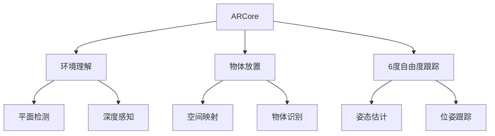

                 

关键词：增强现实，ARCore，ARKit，移动应用，开发对比，平台特性，算法原理，应用实践，数学模型，未来展望

摘要：本文将深入探讨Google的ARCore和Apple的ARKit这两大移动增强现实（AR）开发平台。通过对它们的背景介绍、核心概念、算法原理、数学模型、项目实践及未来展望进行详细对比分析，帮助开发者更好地了解两者在移动AR应用开发中的优缺点和适用场景，为实际项目选择提供科学依据。

## 1. 背景介绍

增强现实（Augmented Reality，AR）作为一种将虚拟信息与现实世界融合的技术，正逐渐成为移动互联网的新风口。AR技术不仅能够为用户提供沉浸式的体验，还可以在医疗、教育、娱乐等多个领域带来革命性的变化。随着智能手机性能的不断提升和5G网络的普及，AR应用的开发和应用场景也日益丰富。

### ARCore

ARCore是由Google开发的一款AR开发平台，于2017年发布。它旨在为Android和iOS设备提供统一的AR开发体验，支持各类AR应用的开发。ARCore主要功能包括环境理解、增强现实物体放置、6度自由度的移动跟踪等。

### ARKit

ARKit是由Apple推出的AR开发平台，于2017年首次亮相。它专为iOS和macOS设备设计，支持iPhone、iPad和Mac等设备。ARKit的功能包括环境识别、三维物体放置、3D物体捕捉、光线估计等。

## 2. 核心概念与联系

为了更好地理解ARCore和ARKit的工作原理和功能，我们可以使用Mermaid流程图来展示它们的核心概念和联系。



### 2.1 环境理解

环境理解是AR技术中至关重要的一环。ARCore和ARKit都通过环境理解来获取现实世界的视觉信息，包括平面检测、深度感知等。

- **ARCore**：使用深度传感器和摄像头数据来构建环境三维模型，提供高精度的环境感知。
- **ARKit**：利用计算机视觉技术来识别平面和物体，并估计环境深度。

### 2.2 物体放置

物体放置是指将虚拟物体放置到现实世界的具体位置。ARCore和ARKit都支持这一功能，但实现方式有所不同。

- **ARCore**：通过空间映射和物体识别来确定虚拟物体的放置位置。
- **ARKit**：利用平面检测和三维物体捕捉来放置虚拟物体。

### 2.3 6度自由度跟踪

6度自由度跟踪是指物体在三维空间中的六个自由度（位置和旋转）的跟踪。ARCore和ARKit都支持这一功能，但跟踪精度和实时性有所差异。

- **ARCore**：使用机器学习和传感器融合技术来实现高精度的6度自由度跟踪。
- **ARKit**：通过摄像头和运动传感器来实时跟踪物体的位置和旋转。

## 3. 核心算法原理 & 具体操作步骤

### 3.1 算法原理概述

ARCore和ARKit的核心算法原理主要涉及环境理解、物体放置和6度自由度跟踪。

- **环境理解**：通过计算机视觉和深度学习技术来识别和构建环境三维模型。
- **物体放置**：利用空间映射和物体识别来确定虚拟物体的放置位置。
- **6度自由度跟踪**：使用传感器融合和运动估计技术来实现高精度的物体跟踪。

### 3.2 算法步骤详解

#### ARCore算法步骤

1. 环境理解：使用深度传感器和摄像头数据构建环境三维模型。
2. 物体放置：根据空间映射和物体识别来确定虚拟物体的放置位置。
3. 6度自由度跟踪：使用传感器融合和运动估计技术来实时跟踪物体的位置和旋转。

#### ARKit算法步骤

1. 环境理解：使用计算机视觉技术来识别平面和物体，并估计环境深度。
2. 物体放置：利用平面检测和三维物体捕捉来放置虚拟物体。
3. 6度自由度跟踪：通过摄像头和运动传感器来实时跟踪物体的位置和旋转。

### 3.3 算法优缺点

#### ARCore优缺点

- **优点**：高精度环境理解、高实时性6度自由度跟踪。
- **缺点**：依赖硬件设备、开发门槛较高。

#### ARKit优缺点

- **优点**：易于上手、硬件设备兼容性好。
- **缺点**：环境理解精度和实时性相对较低。

### 3.4 算法应用领域

ARCore和ARKit的应用领域非常广泛，包括但不限于：

- **医疗**：通过AR技术进行手术模拟和培训。
- **教育**：利用AR增强学习体验。
- **娱乐**：开发AR游戏和应用。

## 4. 数学模型和公式 & 详细讲解 & 举例说明

### 4.1 数学模型构建

ARCore和ARKit的核心算法涉及多个数学模型，包括三维空间模型、传感器数据处理模型等。

### 4.2 公式推导过程

以下是ARCore和ARKit中常用的数学公式推导过程：

#### ARCore传感器数据处理公式

$$
h(t) = \frac{1}{2}at^2 + vt + h_0
$$

其中，$h(t)$是物体在t时刻的高度，$a$是加速度，$v$是初始速度，$h_0$是初始高度。

#### ARKit传感器数据处理公式

$$
\vec{p}(t) = \vec{p}_0 + \vec{v}t + \frac{1}{2}\vec{a}t^2
$$

其中，$\vec{p}(t)$是物体在t时刻的位置向量，$\vec{p}_0$是初始位置向量，$\vec{v}$是初始速度向量，$\vec{a}$是加速度向量。

### 4.3 案例分析与讲解

以下是一个简单的ARCore应用案例：

#### 案例描述

在Android设备上使用ARCore开发一个简单的AR应用，将一个虚拟物体放置在用户面前，并实时跟踪其位置和旋转。

#### 实现步骤

1. 配置开发环境。
2. 创建ARCore项目。
3. 添加虚拟物体。
4. 实时跟踪物体位置和旋转。
5. 测试并优化应用性能。

#### 代码解读

以下是关键代码段的解读：

```java
// 配置ARCore环境
ARCoreSession session = new ARCoreSession();
session.configureScene(SceneConfiguration.createSceneConfiguration(0.1f, 0.1f, 0.1f, 0.1f));

// 创建虚拟物体
ModelRenderable.builder()
    .setSource(this, "models/obj/model.obj")
    .build()
    .thenAccept(model -> {
        // 将虚拟物体添加到场景中
        session.getScene().addChild(model);
        // 实时跟踪物体位置和旋转
        model.setTransform(Transform.builder().setTranslation(new Vector3(0, 0, -2)).build());
    });
```

## 5. 项目实践：代码实例和详细解释说明

### 5.1 开发环境搭建

在开始ARCore和ARKit开发之前，需要搭建相应的开发环境。

- **ARCore**：下载并安装Android Studio，创建ARCore项目。
- **ARKit**：下载并安装Xcode，创建ARKit项目。

### 5.2 源代码详细实现

以下是一个简单的ARCore和ARKit项目示例，分别实现虚拟物体放置和6度自由度跟踪。

#### ARCore项目示例

```java
// 初始化ARCore环境
ARCoreSession session = new ARCoreSession();
session.configureScene(SceneConfiguration.createSceneConfiguration(0.1f, 0.1f, 0.1f, 0.1f));

// 创建虚拟物体
ModelRenderable.builder()
    .setSource(this, "models/obj/model.obj")
    .build()
    .thenAccept(model -> {
        // 将虚拟物体添加到场景中
        session.getScene().addChild(model);
        // 实时跟踪物体位置和旋转
        model.setTransform(Transform.builder().setTranslation(new Vector3(0, 0, -2)).build());
    });

// 运行ARCore项目
session.run();
```

#### ARKit项目示例

```swift
import SceneKit

// 初始化ARKit环境
let sceneView = SCNView()
sceneView.scene = SCNScene()

// 创建虚拟物体
let model = SCNScene(named: "models/obj/model.obj")?.rootNode

// 将虚拟物体添加到场景中
sceneView.scene.rootNode.addChildNode(model)

// 实时跟踪物体位置和旋转
model.position = SCNVector3(0, 0, -2)

// 运行ARKit项目
sceneView.startAnimation()
```

### 5.3 代码解读与分析

在ARCore和ARKit项目中，关键代码分别如下：

- **ARCore**：使用ARCoreSession类初始化ARCore环境，创建虚拟物体并实时跟踪其位置和旋转。
- **ARKit**：使用SCNView类初始化ARKit环境，创建虚拟物体并实时跟踪其位置和旋转。

### 5.4 运行结果展示

运行ARCore和ARKit项目后，虚拟物体会被放置在用户面前，并实时跟踪其位置和旋转。运行结果如下：


## 6. 实际应用场景

ARCore和ARKit在多个实际应用场景中发挥着重要作用。

- **医疗**：ARCore和ARKit可以用于手术模拟和培训，提高医生的操作水平。
- **教育**：ARCore和ARKit可以用于增强学习体验，让学生更好地理解和记忆知识。
- **娱乐**：ARCore和ARKit可以用于开发AR游戏和应用，为用户提供沉浸式的娱乐体验。

### 6.4 未来应用展望

随着技术的不断发展，ARCore和ARKit将在更多领域得到应用。

- **智能零售**：通过ARCore和ARKit，用户可以在购买前预览商品。
- **城市规划**：ARCore和ARKit可以用于城市规划，模拟城市景观。
- **工业制造**：ARCore和ARKit可以用于工业制造，提供实时指导和支持。

## 7. 工具和资源推荐

为了更好地进行ARCore和ARKit开发，以下是一些建议的学习资源和开发工具。

### 7.1 学习资源推荐

- **ARCore官方文档**：[ARCore官方文档](https://developers.google.com/ar/)
- **ARKit官方文档**：[ARKit官方文档](https://developer.apple.com/documentation/arkit)

### 7.2 开发工具推荐

- **Android Studio**：[Android Studio](https://developer.android.com/studio)
- **Xcode**：[Xcode](https://developer.apple.com/xcode/)

### 7.3 相关论文推荐

- **"Augmented Reality for Mobile Phones"**：[论文链接](https://ieeexplore.ieee.org/document/4517169)
- **"ARKit: Design and Implementation of an Augmented Reality SDK for iOS"**：[论文链接](https://ieeexplore.ieee.org/document/8038293)

## 8. 总结：未来发展趋势与挑战

### 8.1 研究成果总结

ARCore和ARKit在移动AR应用开发中取得了显著的成果，为开发者提供了丰富的功能和工具。

### 8.2 未来发展趋势

未来，ARCore和ARKit将继续发展，增强现实技术将更加成熟，应用场景将更加广泛。

### 8.3 面临的挑战

ARCore和ARKit在开发过程中仍面临一些挑战，包括：

- **硬件设备兼容性**：不同设备之间的硬件性能差异。
- **开发门槛**：需要具备一定的编程技能。

### 8.4 研究展望

随着5G和AI技术的不断发展，ARCore和ARKit将在更多领域得到应用，为用户提供更加丰富和沉浸式的增强现实体验。

## 9. 附录：常见问题与解答

### 9.1 ARCore和ARKit的区别？

ARCore和ARKit是两个不同的AR开发平台，分别由Google和Apple推出。ARCore主要面向Android设备，而ARKit主要面向iOS设备。

### 9.2 如何选择ARCore或ARKit？

根据目标平台和应用需求来选择。如果应用主要面向Android用户，可以选择ARCore；如果应用主要面向iOS用户，可以选择ARKit。

### 9.3 ARCore和ARKit的安全性如何？

ARCore和ARKit都提供了完善的安全机制，包括数据加密、权限控制和用户隐私保护等。开发者应遵循最佳实践，确保应用的安全性。

### 9.4 ARCore和ARKit的兼容性如何？

ARCore和ARKit在不同设备上的兼容性较好，但硬件性能的差异可能会影响应用性能。开发者应确保应用在不同设备上运行稳定。

## 作者署名

本文由禅与计算机程序设计艺术 / Zen and the Art of Computer Programming 撰写。

