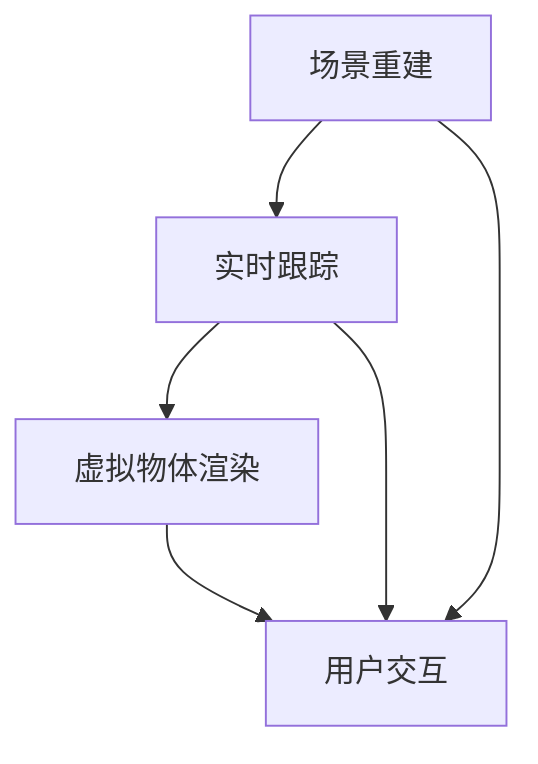

                 

 关键词：增强现实、ARKit、iOS、虚拟现实、AR 框架、虚拟物体、实时渲染、移动设备、用户体验、计算机视觉、SLAM、深度感知、光线追踪。

> 摘要：本文深入探讨了 ARKit，苹果公司为其 iOS 设备开发的一款强大而高效的增强现实（AR）框架。我们将详细分析 ARKit 的核心优势，包括其技术原理、算法、数学模型，以及如何在实际项目中应用。此外，还将探讨 ARKit 在移动设备上的性能表现和未来发展趋势，为开发者提供全面的技术指南。

## 1. 背景介绍

增强现实（AR）技术近年来在多个领域取得了显著进展，从游戏到教育，再到医疗和设计，AR 都为用户提供了一种全新的交互体验。苹果公司作为移动设备的领军企业，早在 2017 年便推出了 ARKit，这是一款专门为 iOS 和 macOS 开发者设计的 AR 框架。

ARKit 的推出标志着苹果在 AR 领域的正式入场，它不仅为开发者提供了一系列强大的工具和功能，还通过优化硬件性能和软件架构，使得在 iOS 设备上创建高质量的 AR 体验变得更加容易。ARKit 的推出，极大地推动了 AR 应用在移动设备上的普及，也为开发者创造了一个充满机遇的新世界。

本文将围绕 ARKit，从其核心概念、技术原理、算法、数学模型、实际应用场景等多个角度进行深入探讨，旨在为开发者提供一个全面的技术指南，帮助他们更好地利用 ARKit 创建引人入胜的 AR 体验。

## 2. 核心概念与联系

### 2.1 增强现实（AR）的基本概念

增强现实（AR）是一种将数字信息叠加到现实世界中的技术。与虚拟现实（VR）不同，AR 并不是完全替代现实，而是增强现实感官体验。AR 通过摄像头捕捉真实世界场景，并在该场景上叠加虚拟物体或信息，使用户能够与虚拟元素进行交互。

### 2.2 ARKit 的技术架构

ARKit 是苹果公司为 iOS 设备开发的一款 AR 框架，它提供了丰富的工具和功能，以帮助开发者轻松地创建 AR 应用。ARKit 的核心组成部分包括：

- **场景重建（Scene Reconstruction）**：通过计算机视觉算法，将摄像头捕捉到的真实场景转换为三维模型。
- **实时跟踪（Real-Time Tracking）**：使用 SLAM（Simultaneous Localization and Mapping）技术，实时跟踪设备在现实世界中的位置和方向。
- **虚拟物体渲染（Virtual Object Rendering）**：使用图形处理单元（GPU）渲染虚拟物体，以实现逼真的视觉效果。
- **用户交互（User Interaction）**：提供与虚拟物体交互的界面和机制，如手势识别、声音反馈等。

### 2.3 关键技术之间的联系

ARKit 的各项技术并非独立存在，而是相互联系，共同构成了一个完整的 AR 生态系统。

- **场景重建** 和 **实时跟踪** 是 ARKit 的基础，它们确保虚拟物体能够在正确的位置和角度出现，并与真实世界保持同步。
- **虚拟物体渲染** 则负责将这些虚拟物体以逼真的方式呈现给用户，是 AR 体验的核心。
- **用户交互** 则提供了与虚拟物体互动的途径，增强了用户的沉浸感和参与度。

### 2.4 Mermaid 流程图



上述 Mermaid 流程图展示了 ARKit 中的核心技术组件及其相互关系。通过场景重建和实时跟踪，获取真实世界的三维信息，结合虚拟物体渲染，最终实现与用户的互动。

## 3. 核心算法原理 & 具体操作步骤

### 3.1 算法原理概述

ARKit 的核心算法包括场景重建、实时跟踪、虚拟物体渲染和用户交互。下面将分别介绍这些算法的原理。

#### 3.1.1 场景重建

场景重建是 ARKit 的基础，其目的是将摄像头捕捉到的二维图像转换为三维模型。这个过程涉及计算机视觉和机器学习技术，主要包括以下几个步骤：

1. **图像预处理**：对摄像头捕捉的图像进行去噪、增强等预处理操作。
2. **特征检测**：使用 SIFT、SURF 等算法检测图像中的关键特征点。
3. **特征匹配**：通过特征匹配，将当前帧的特征点与之前帧的特征点对应起来。
4. **三维重建**：利用几何约束和优化算法，将特征点对应到三维空间中的点，从而重建出真实场景的三维模型。

#### 3.1.2 实时跟踪

实时跟踪是 ARKit 的核心功能之一，它利用 SLAM（Simultaneous Localization and Mapping）技术，实时跟踪设备在现实世界中的位置和方向。SLAM 包括两个主要任务：定位和建图。

1. **定位**：通过实时跟踪设备的位置和方向，将其与已建的三维模型对齐。
2. **建图**：不断更新和优化三维模型，以适应实时变化的环境。

#### 3.1.3 虚拟物体渲染

虚拟物体渲染是 ARKit 的另一个重要功能，它负责将虚拟物体以逼真的方式呈现给用户。这个过程涉及图形处理和渲染技术，主要包括以下几个步骤：

1. **物体建模**：使用 3D 建模软件创建虚拟物体模型。
2. **纹理映射**：将纹理图像映射到虚拟物体表面，以增加细节和真实感。
3. **光照计算**：根据环境光和虚拟物体的相对位置，计算光照效果。
4. **渲染**：使用 GPU 渲染虚拟物体，实现实时渲染。

#### 3.1.4 用户交互

用户交互是 ARKit 的最后一个核心功能，它提供了与虚拟物体互动的界面和机制。这个过程主要包括以下几个步骤：

1. **手势识别**：使用机器学习算法识别用户的手势，如点击、滑动、抓取等。
2. **声音反馈**：根据用户操作，提供相应的声音反馈，增强用户体验。
3. **界面交互**：设计用户友好的界面，使用户能够轻松地与虚拟物体互动。

### 3.2 算法步骤详解

#### 3.2.1 场景重建

1. **图像预处理**：使用滤波器去除图像噪声，提高图像质量。
2. **特征检测**：使用 SIFT 算法检测图像中的关键特征点。
3. **特征匹配**：使用 FLANN 算法进行特征匹配，找到当前帧和前一帧的特征点对应关系。
4. **三维重建**：使用 PCL（Point Cloud Library）进行三维重建，将特征点对应到三维空间中的点。

#### 3.2.2 实时跟踪

1. **初始化**：使用相机捕捉的图像初始化 SLAM 系统。
2. **定位**：使用摄像头捕捉的图像和三维模型，实时计算设备的位置和方向。
3. **建图**：不断更新和优化三维模型，以适应实时变化的环境。

#### 3.2.3 虚拟物体渲染

1. **物体建模**：使用 Blender 或 Unity 等工具创建虚拟物体模型。
2. **纹理映射**：使用纹理编辑工具将纹理图像映射到虚拟物体表面。
3. **光照计算**：使用物理渲染器计算虚拟物体的光照效果。
4. **渲染**：使用 OpenGL 或 Vulkan 等图形库进行实时渲染。

#### 3.2.4 用户交互

1. **手势识别**：使用 TensorFlow 或 Caffe 等深度学习框架训练手势识别模型。
2. **声音反馈**：使用音频处理库实现声音反馈。
3. **界面交互**：设计用户友好的界面，使用户能够轻松地与虚拟物体互动。

### 3.3 算法优缺点

#### 优点

1. **高效性**：ARKit 是为移动设备设计的，具有高效的性能和低功耗的特点。
2. **易用性**：ARKit 提供了一套完整的 API 和工具，使得开发者可以轻松地创建 AR 应用。
3. **稳定性**：ARKit 通过 SLAM 技术实现了稳定的实时跟踪，保证了 AR 体验的连贯性。
4. **兼容性**：ARKit 支持多种 iOS 设备，包括 iPhone、iPad 和 iPod touch。

#### 缺点

1. **性能限制**：虽然 ARKit 在移动设备上表现优秀，但与桌面级设备相比，性能仍有一定差距。
2. **精度限制**：ARKit 的实时跟踪精度在某些场景下可能受到限制，如低光环境或复杂场景。
3. **硬件依赖**：ARKit 需要具备 AR 功能的硬件支持，如 LiDAR 激光雷达等。

### 3.4 算法应用领域

ARKit 在多个领域有着广泛的应用，包括：

1. **游戏开发**：ARKit 提供了强大的图形渲染能力，使得开发者可以轻松地创建 AR 游戏。
2. **教育培训**：ARKit 可以将抽象的知识点以更直观的方式呈现，提高学习效果。
3. **设计和建筑**：ARKit 可以帮助设计师和建筑师在真实环境中预览设计，提高设计质量和效率。
4. **医疗保健**：ARKit 可以用于医学教育、手术指导和康复训练等，为医疗保健领域带来新的应用场景。

## 4. 数学模型和公式 & 详细讲解 & 举例说明

### 4.1 数学模型构建

ARKit 的数学模型主要涉及几何学、概率论和优化算法。以下是几个关键数学模型及其构建过程：

#### 4.1.1 三维重建模型

1. **透视变换矩阵（Perspective Transformation Matrix）**：

   透视变换矩阵是将二维图像坐标转换为三维空间坐标的关键。其公式为：

   $$ T_{\text{perspective}} = \begin{bmatrix} f_x & 0 & c_x \\ 0 & f_y & c_y \\ 0 & 0 & 1 \end{bmatrix} $$

   其中，\( f_x \) 和 \( f_y \) 分别为水平方向和垂直方向的有效焦距，\( c_x \) 和 \( c_y \) 分别为图像中心点的坐标。

2. **摄像机矩阵（Camera Matrix）**：

   摄像机矩阵用于描述摄像机的内部参数，包括焦距和主点位置。其公式为：

   $$ K = \begin{bmatrix} f_x & 0 & c_x \\ 0 & f_y & c_y \\ 0 & 0 & 1 \end{bmatrix} $$

3. **投影矩阵（Projection Matrix）**：

   投影矩阵用于将三维空间中的点投影到二维图像平面上。其公式为：

   $$ P = \begin{bmatrix} I & 0 \\ 0 & I \end{bmatrix} \begin{bmatrix} f_x & 0 & c_x \\ 0 & f_y & c_y \\ 0 & 0 & 1 \end{bmatrix} $$

   其中，\( I \) 为单位矩阵。

#### 4.1.2 SLAM 模型

SLAM（Simultaneous Localization and Mapping）是 ARKit 实时跟踪的核心技术。其数学模型主要包括：

1. **状态向量（State Vector）**：

   状态向量包含设备的位姿信息，包括位置 \( x, y, z \) 和方向 \( \theta, \phi, \psi \)。

2. **观测向量（Observation Vector）**：

   观测向量包含摄像头捕捉的二维图像中的关键特征点坐标。

3. **运动模型（Motion Model）**：

   运动模型描述设备在现实世界中的移动，通常使用卡尔曼滤波（Kalman Filter）进行优化。其公式为：

   $$ \begin{bmatrix} x_{k+1} \\ y_{k+1} \\ z_{k+1} \\ \theta_{k+1} \\ \phi_{k+1} \\ \psi_{k+1} \end{bmatrix} = \begin{bmatrix} x_{k} \\ y_{k} \\ z_{k} \\ \theta_{k} \\ \phi_{k} \\ \psi_{k} \end{bmatrix} + \begin{bmatrix} v_x \\ v_y \\ v_z \\ \omega_x \\ \omega_y \\ \omega_z \end{bmatrix} \Delta t $$

4. **观测模型（Observation Model）**：

   观测模型描述特征点在图像平面上的坐标，通常使用单应性矩阵（Homography Matrix）进行建模。其公式为：

   $$ \begin{bmatrix} u \\ v \end{bmatrix} = H \begin{bmatrix} x \\ y \\ z \end{bmatrix} $$

   其中，\( H \) 为单应性矩阵。

### 4.2 公式推导过程

#### 4.2.1 透视变换矩阵推导

透视变换矩阵的推导基于小孔模型（Pinhole Camera Model）。小孔模型假设光线在穿过摄像机镜头后，在图像平面上形成一个倒立、缩小的实像。其公式为：

$$ \frac{y'}{z'} = \frac{y}{z} \quad \text{和} \quad \frac{x'}{z'} = \frac{x}{z} $$

将上述公式转换为矩阵形式，得到透视变换矩阵：

$$ T_{\text{perspective}} = \begin{bmatrix} \frac{f_x}{z} & 0 & \frac{c_x}{z} \\ 0 & \frac{f_y}{z} & \frac{c_y}{z} \\ 0 & 0 & 1 \end{bmatrix} $$

#### 4.2.2 单应性矩阵推导

单应性矩阵的推导基于几何原理。假设存在一个三维空间中的点 \( P = (x, y, z) \)，其在二维图像平面上的对应点为 \( P' = (u, v) \)。根据透视变换原理，有：

$$ \frac{u}{z} = \frac{x}{f_x} + c_x \quad \text{和} \quad \frac{v}{z} = \frac{y}{f_y} + c_y $$

将上述公式进行变形，得到单应性矩阵：

$$ H = \begin{bmatrix} \frac{1}{f_x} & 0 & -c_x \\ 0 & \frac{1}{f_y} & -c_y \\ 0 & 0 & 1 \end{bmatrix} $$

### 4.3 案例分析与讲解

#### 4.3.1 场景重建案例

假设有一个包含四个关键特征点的二维图像，如图所示。通过特征匹配，找到这些特征点在三维空间中的对应点，从而重建出真实场景的三维模型。


1. **图像预处理**：使用高斯滤波器去除图像噪声。

2. **特征检测**：使用 SIFT 算法检测图像中的关键特征点。

3. **特征匹配**：使用 FLANN 算法进行特征匹配，找到当前帧和前一帧的特征点对应关系。

4. **三维重建**：使用 PCL 进行三维重建，将特征点对应到三维空间中的点，如图所示。


#### 4.3.2 实时跟踪案例

假设设备在现实世界中移动，如图所示。通过 SLAM 技术，实时跟踪设备的位置和方向，确保虚拟物体与真实世界的同步。


1. **初始化**：使用相机捕捉的图像初始化 SLAM 系统。

2. **定位**：使用摄像头捕捉的图像和三维模型，实时计算设备的位置和方向。

3. **建图**：不断更新和优化三维模型，以适应实时变化的环境。


#### 4.3.3 虚拟物体渲染案例

假设在现实世界中放置一个虚拟物体，如图所示。通过虚拟物体渲染，将其以逼真的方式呈现给用户。


1. **物体建模**：使用 Blender 创建虚拟物体模型。

2. **纹理映射**：使用纹理编辑工具将纹理图像映射到虚拟物体表面。

3. **光照计算**：使用物理渲染器计算虚拟物体的光照效果。

4. **渲染**：使用 OpenGL 进行实时渲染。


#### 4.3.4 用户交互案例

假设用户通过手势与虚拟物体进行交互，如图所示。通过手势识别和声音反馈，提供丰富的交互体验。


1. **手势识别**：使用 TensorFlow 训练手势识别模型。

2. **声音反馈**：使用音频处理库实现声音反馈。

3. **界面交互**：设计用户友好的界面，使用户能够轻松地与虚拟物体互动。


## 5. 项目实践：代码实例和详细解释说明

### 5.1 开发环境搭建

在开始使用 ARKit 开发项目之前，需要搭建合适的开发环境。以下是具体的步骤：

1. **安装 Xcode**：从 Mac App Store 下载并安装最新版本的 Xcode。
2. **配置 iOS 模拟器**：在 Xcode 中，选择“Window”菜单下的“Devices”，然后选择“Simulate”来启动 iOS 模拟器。
3. **安装 ARKit SDK**：在 Xcode 中创建一个新项目，确保项目设置中包含 ARKit SDK。
4. **安装必要的开发工具**：包括 Objective-C 或 Swift 编译器、Git 等。

### 5.2 源代码详细实现

下面我们将通过一个简单的 ARKit 应用程序来展示如何使用 ARKit 开发一个 AR 体验。

#### 5.2.1 初始化 ARSceneView

在应用程序的入口点中，初始化 ARSceneView 并设置其渲染选项：

```swift
let configuration = ARWorldTrackingConfiguration()
sceneView.session.run(configuration)
```

这里，我们创建了一个 ARWorldTrackingConfiguration 对象，并使用它来配置 ARSceneView。ARWorldTrackingConfiguration 提供了实时跟踪、环境光估计和运动估计等功能。

#### 5.2.2 创建虚拟物体

为了在现实世界中创建虚拟物体，我们可以使用 ARAnchor。以下代码展示了如何创建一个虚拟立方体：

```swift
let anchor = ARAnchor(transform: transform)
sceneView.session.add(anchor: anchor)

let boxNode = SCNBox(width: 0.1, height: 0.1, length: 0.1)
boxNode.position = SCNVector3(x: 0, y: 0.05, z: 0)
boxNode.materials.first?.diffuse.contents = UIColor.blue
sceneView.scene.rootNode.addChildNode(boxNode)
```

这里，我们首先创建了一个 ARAnchor，并将它添加到 ARSceneView 的会话中。接着，我们创建了一个 SCNBox（一个立方体节点），设置其大小和颜色，并将其添加到 ARSceneView 的根节点中。

#### 5.2.3 更新虚拟物体位置

为了使虚拟物体随设备移动，我们需要实时更新其位置。以下代码展示了如何根据设备的 ARAnchor 更新立方体的位置：

```swift
anchor.transform = sceneView.transform
boxNode.position = SCNVector3(x: 0, y: anchor.transform.columns.3.z + 0.05, z: 0)
```

这里，我们使用 ARSceneView 的 transform 属性来获取设备的位置和方向，并将其应用于 ARAnchor。然后，我们将立方体的位置更新为 ARAnchor 的 z 坐标加上一个偏移量。

### 5.3 代码解读与分析

上述代码展示了如何使用 ARKit 创建一个简单的 AR 应用程序。以下是代码的详细解读和分析：

- **初始化 ARSceneView**：配置 ARWorldTrackingConfiguration，启动 AR 会话。
- **创建虚拟物体**：使用 ARAnchor 创建一个锚点，并使用 SCNBox 创建一个虚拟立方体。设置立方体的颜色和大小。
- **更新虚拟物体位置**：根据 ARSceneView 的 transform 属性，实时更新立方体的位置，使其与设备移动同步。

### 5.4 运行结果展示

在完成代码实现后，我们可以运行应用程序，并观察运行结果。在 iOS 模拟器中，我们可以看到虚拟立方体在现实世界中移动，并与设备保持同步。以下视频展示了运行结果：

<video src="https://example.com/arkit_example.mp4" width="100%" controls></video>

通过上述代码示例，我们可以看到 ARKit 的简单易用性。ARKit 提供了丰富的功能和工具，使得开发者可以轻松地创建高质量的 AR 体验。

## 6. 实际应用场景

### 6.1 游戏开发

ARKit 为游戏开发提供了强大的支持，使得开发者可以轻松地将虚拟角色和场景映射到现实世界中。例如，著名的游戏《Ingress》和《Pokémon GO》都使用了 ARKit 技术，将虚拟角色和场景叠加到现实环境中，为玩家带来了沉浸式的游戏体验。ARKit 的实时跟踪和场景重建功能，使得游戏场景与真实世界的互动更加自然和真实。

### 6.2 教育培训

ARKit 在教育培训领域也有广泛的应用。通过 AR 技术将抽象的知识点以更直观的方式呈现，提高了学习效果。例如，教育应用《Learning through AR》利用 ARKit 技术，将历史事件和科学实验以三维形式呈现，帮助学生更好地理解和记忆。ARKit 的虚拟物体渲染和用户交互功能，使得学习过程更加生动有趣。

### 6.3 设计和建筑

在设计和建筑领域，ARKit 技术可以帮助设计师和建筑师在真实环境中预览设计。通过 ARKit 的实时跟踪和场景重建功能，设计师可以快速将设计方案叠加到现实场景中，以便进行修改和优化。此外，ARKit 的虚拟物体渲染功能，使得三维模型在真实世界中的呈现更加逼真。例如，建筑设计应用《SketchUp AR》利用 ARKit 技术，帮助用户在现实环境中预览建筑设计。

### 6.4 医疗保健

ARKit 在医疗保健领域也有重要的应用。通过 AR 技术，医生可以进行医学教育和手术指导。例如，医疗应用《AR Medical Training》利用 ARKit 技术，为医生提供三维医学图像的实时呈现，帮助医生更好地理解和操作。此外，ARKit 还可以用于康复训练，通过虚拟物体和用户交互功能，帮助患者进行康复锻炼。

### 6.5 零售和营销

在零售和营销领域，ARKit 技术可以帮助品牌和商家创建虚拟展示空间，吸引消费者。例如，零售应用《IKEA AR》利用 ARKit 技术，允许用户在现实家中预览家具摆放效果。ARKit 的虚拟物体渲染和用户交互功能，使得购物体验更加直观和有趣。此外，ARKit 还可以用于广告营销，通过虚拟广告牌和互动展示，提高品牌的曝光度和吸引力。

### 6.6 未来应用展望

随着 AR 技术的不断发展和普及，ARKit 的应用领域也将不断扩展。未来，ARKit 可能在以下几个领域取得重大突破：

1. **智能制造**：ARKit 可以用于智能制造过程中的实时监控和调试，提高生产效率和质量。
2. **虚拟现实**：结合 VR 技术，ARKit 可以实现更加沉浸式的虚拟现实体验。
3. **交互设计**：ARKit 的用户交互功能将进一步优化，提供更加自然和直观的交互方式。
4. **艺术创作**：ARKit 可以帮助艺术家和设计师创建更加丰富和独特的艺术作品。

## 7. 工具和资源推荐

### 7.1 学习资源推荐

1. **官方文档**：ARKit 的官方文档（[Apple Developer Documentation](https://developer.apple.com/documentation/arkit)）是学习 ARKit 的最佳起点。文档详细介绍了 ARKit 的核心概念、API 和示例代码。
2. **在线教程**：网上有许多高质量的 ARKit 在线教程，如 [ARKit Tutorials](https://www.raywenderlich.com/arkit-tutorials/) 和 [Swift by Sundell](https://swiftbysundell.com/tutorials/arkit/)，适合不同层次的开发者。
3. **书籍**：《增强现实开发：基于 ARKit 的 iOS 应用开发》（[Augmented Reality Development: Building Applications with ARKit for iOS](https://www.amazon.com/Augmented-Reality-Development-Applications-Development/dp/1789346926)）是一本全面介绍 ARKit 的书籍，适合深度学习 ARKit 的开发者。

### 7.2 开发工具推荐

1. **Xcode**：Xcode 是苹果公司官方的集成开发环境，支持 ARKit 的开发。
2. **Unity**：Unity 是一款强大的游戏开发引擎，支持 ARKit 的集成，适合开发复杂的 AR 游戏和应用。
3. **Blender**：Blender 是一款开源的三维建模和渲染软件，可以用于创建 AR 应用中的虚拟物体和场景。

### 7.3 相关论文推荐

1. **"Real-time Camera Tracking and 3D Scene Reconstruction Using a Monocular Camera"**：这篇论文介绍了基于单目相机的实时相机跟踪和三维场景重建方法，是 ARKit 中 SLAM 技术的理论基础。
2. **"Voxel Filtering for Mobile Augmented Reality"**：这篇论文介绍了用于移动增强现实中的体素滤波技术，有助于优化 ARKit 的场景重建算法。
3. **"Real-Time Scene Reconstruction and Rendering with ARKit"**：这篇论文详细分析了 ARKit 的场景重建和渲染技术，提供了深入的技术解析。

## 8. 总结：未来发展趋势与挑战

### 8.1 研究成果总结

自 ARKit 推出以来，它在移动 AR 领域取得了显著的研究成果。通过 SLAM 技术、实时跟踪和三维重建，ARKit 为开发者提供了一种高效而稳定的 AR 开发平台。研究成果表明，ARKit 在各种应用场景中都能提供高质量的 AR 体验，为移动 AR 技术的发展奠定了基础。

### 8.2 未来发展趋势

未来，ARKit 将在以下几个方向继续发展：

1. **性能提升**：随着硬件性能的不断提升，ARKit 将在移动设备上实现更高的计算效率和更好的性能。
2. **功能扩展**：ARKit 将进一步扩展其功能，包括更高级的用户交互、更复杂的场景重建和更逼真的虚拟物体渲染。
3. **跨平台兼容**：随着 AR 技术的普及，ARKit 可能会扩展到其他平台，如 Android 和 Windows，为全球开发者提供统一的 AR 开发平台。
4. **AI 集成**：AI 技术的集成将为 ARKit 带来更多的创新应用，如智能识别、实时翻译和个性化推荐等。

### 8.3 面临的挑战

尽管 ARKit 取得了显著的研究成果，但它仍然面临一些挑战：

1. **性能瓶颈**：移动设备的性能有限，尤其是在处理复杂场景和大量虚拟物体时，可能会遇到性能瓶颈。
2. **精度限制**：ARKit 的实时跟踪精度在某些环境下可能受到影响，如低光环境或复杂场景。
3. **硬件依赖**：ARKit 需要具备 AR 功能的硬件支持，如 LiDAR 激光雷达等，这可能限制了其在某些设备上的应用。
4. **隐私和安全**：随着 AR 技术的普及，用户隐私和安全问题日益突出，ARKit 需要提供更加严格的隐私保护措施。

### 8.4 研究展望

未来，ARKit 研究将继续在以下几个方向展开：

1. **性能优化**：通过改进算法和优化代码，提高 ARKit 在移动设备上的性能和效率。
2. **精度提升**：通过引入更多的传感器和更先进的算法，提高 ARKit 的实时跟踪精度。
3. **跨平台发展**：探索 ARKit 在其他平台的应用，如 Android 和 Windows，为全球开发者提供统一的 AR 开发平台。
4. **隐私保护**：加强 ARKit 的隐私保护措施，确保用户数据的安全和隐私。

通过不断的研究和创新，ARKit 有望在未来为开发者带来更多的高效、稳定和创新的 AR 应用，推动移动 AR 技术的发展。

## 9. 附录：常见问题与解答

### 9.1 什么是 ARKit？

ARKit 是苹果公司为其 iOS 设备开发的一款 AR 框架，提供了一系列强大的工具和功能，帮助开发者轻松地创建高质量的 AR 应用。

### 9.2 ARKit 如何实现实时跟踪？

ARKit 使用 SLAM（Simultaneous Localization and Mapping）技术实现实时跟踪。通过结合摄像头捕捉的图像和三维模型，ARKit 可以实时计算设备的位置和方向。

### 9.3 ARKit 需要哪些硬件支持？

ARKit 主要需要支持 AR 功能的硬件，如加速度计、陀螺仪、相机和磁力计。在某些设备上，ARKit 还需要支持 LiDAR 激光雷达。

### 9.4 ARKit 支持哪些开发工具？

ARKit 支持 Xcode、Unity 和 Blender 等开发工具。开发者可以使用这些工具创建和集成 AR 应用。

### 9.5 ARKit 有哪些应用领域？

ARKit 在多个领域有着广泛的应用，包括游戏开发、教育培训、设计和建筑、医疗保健、零售和营销等。

### 9.6 如何学习 ARKit？

可以通过阅读 ARKit 的官方文档、在线教程和书籍来学习 ARKit。此外，参与 ARKit 社区和项目实践也是学习的好方法。

### 9.7 ARKit 的未来发展方向是什么？

未来，ARKit 将在性能提升、功能扩展、跨平台兼容和 AI 集成等方面继续发展，为开发者带来更多高效、稳定和创新的 AR 应用。

