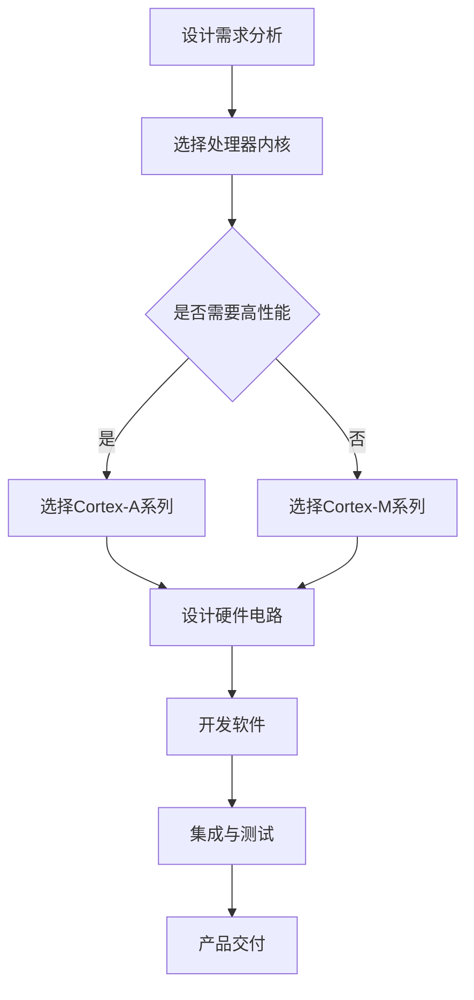

                 

## 1. 背景介绍

ARM（Advanced RISC Machines）架构是一种精简指令集计算机（RISC）架构，最早由英国公司Acorn Computers于1985年推出。ARM架构以其低功耗、高性能、高效的代码密度和高性价比等特点，在全球范围内广泛应用于嵌入式系统、移动设备、服务器、汽车电子等多个领域。据市场研究公司统计数据，全球超过95%的智能手机采用了基于ARM架构的处理器。

嵌入式系统是一种专门为特定应用而设计的计算机系统，通常具有以下特点：低功耗、高可靠性、实时性能、体积小、成本低等。随着物联网（IoT）、智能家居、智能穿戴设备、工业自动化等领域的快速发展，嵌入式系统的重要性日益凸显。

ARM架构在嵌入式系统设计中的应用之所以如此广泛，主要原因如下：

1. **低功耗设计**：ARM处理器采用低功耗设计，使得它们在电池供电的设备中具有更长的续航时间。例如，智能手机和平板电脑中的ARM处理器可以在较低功耗下提供高性能。

2. **高度可定制性**：ARM架构具有高度可定制性，可以根据特定应用的需求进行优化。ARM公司提供了丰富的处理器内核选择，如Cortex-A、Cortex-M等，适用于不同性能和功耗要求的设备。

3. **广泛的生态系统**：ARM拥有庞大的生态系统，包括芯片制造商、软件开发商、系统集成商等。这使得ARM架构在嵌入式系统设计中有丰富的资源和支持。

4. **开源和免费的工具**：ARM提供了大量的开源工具和软件，包括编译器、调试器、操作系统等，大大降低了开发成本。

本文将围绕ARM架构在嵌入式系统设计中的应用，深入探讨其核心概念、设计原则、开发工具和未来发展趋势。

## 2. 核心概念与联系

### 2.1 ARM处理器内核

ARM处理器内核是ARM架构的核心部分，负责执行指令和处理数据。ARM公司提供了多种处理器内核，以适应不同的性能和功耗需求。

**Cortex-A系列**：适用于高性能计算应用，如智能手机、平板电脑、服务器等。

**Cortex-M系列**：适用于低功耗、实时性要求较高的嵌入式系统，如智能传感器、工业控制器、汽车电子等。

**Cortex-R系列**：适用于实时性要求极高的嵌入式系统，如汽车安全系统、医疗设备等。

### 2.2 ARM指令集

ARM指令集是ARM处理器可执行的指令集合。ARM指令集分为两大类：ARM指令集和Thumb指令集。

**ARM指令集**：提供了丰富的指令，可以支持复杂的运算和数据处理，但执行速度较慢。

**Thumb指令集**：是一种精简指令集，执行速度更快，但指令数量较少，适用于低功耗应用。

### 2.3 ARM生态系统

ARM生态系统包括硬件、软件和工具等各个方面，为ARM架构的开发和应用提供了全面的支持。

**硬件**：包括ARM处理器、FPGA、ASIC等。

**软件**：包括操作系统、驱动程序、中间件、应用程序等。

**工具**：包括编译器、调试器、集成开发环境（IDE）等。

### 2.4 ARM架构设计原则

ARM架构设计遵循以下原则：

1. **低功耗**：通过精简指令集和低功耗设计，降低能耗。

2. **高性能**：通过多级缓存、流水线技术、超标量设计等提高处理性能。

3. **可定制性**：通过模块化设计，可以根据不同应用需求进行定制。

4. **兼容性**：支持多种操作系统和软件，确保应用移植性。

### 2.5 ARM架构的优势和挑战

**优势**：

1. **低功耗**：适用于电池供电的设备，具有更长的续航时间。

2. **高性能**：通过多种优化技术，提供高效的处理能力。

3. **高度可定制性**：可以根据特定应用需求进行优化。

4. **广泛的生态系统**：提供丰富的硬件、软件和工具支持。

**挑战**：

1. **安全性**：随着ARM架构在安全性要求较高的应用领域的应用，如何确保系统的安全性成为重要挑战。

2. **复杂性**：ARM架构的多样性可能导致开发复杂度增加。

### 2.6 Mermaid 流程图

以下是一个简单的Mermaid流程图，展示了ARM架构在嵌入式系统设计中的应用流程：



---

## 3. 核心算法原理 & 具体操作步骤

### 3.1 算法原理概述

ARM架构在嵌入式系统设计中的应用涉及多个核心算法，以下简要介绍其中几个关键算法：

1. **中断处理**：中断处理是嵌入式系统中非常重要的一个环节，用于响应外部事件，如传感器数据读取、网络通信等。ARM处理器提供了丰富的中断处理机制，包括中断向量表、中断控制器等。

2. **内存管理**：ARM架构采用了虚拟内存管理机制，通过页表实现虚拟地址到物理地址的映射。内存管理算法包括地址映射、缓存管理、内存分配等。

3. **定时器**：定时器在嵌入式系统中用于实现时间管理和任务调度。ARM处理器提供了多种定时器功能，如计数器模式、比较模式等。

4. **外设驱动**：外设驱动是嵌入式系统中用于与外部设备通信的软件模块。ARM架构支持多种外设接口，如I2C、SPI、UART等，提供了相应的驱动算法。

### 3.2 算法步骤详解

1. **中断处理**：

   - **初始化**：配置中断控制器，设置中断优先级和中断向量表。
   - **响应中断**：当外部事件发生时，中断控制器根据中断向量表跳转到相应的中断服务例程。
   - **处理中断**：在中断服务例程中，处理外部事件，如读取传感器数据、发送网络数据等。
   - **结束中断**：执行中断结束指令，恢复中断前的状态。

2. **内存管理**：

   - **地址映射**：通过设置页表，实现虚拟地址到物理地址的映射。
   - **缓存管理**：根据应用需求，配置缓存策略，如缓存使能、缓存禁用等。
   - **内存分配**：根据内存需求，动态分配内存空间。

3. **定时器**：

   - **初始化**：设置定时器计数器、比较值等参数。
   - **启动定时器**：启动定时器计数。
   - **定时器中断处理**：在定时器中断服务例程中，执行任务调度、时间管理等功能。

4. **外设驱动**：

   - **初始化**：配置外设接口，如设置波特率、中断使能等。
   - **数据传输**：根据外设协议，实现数据读取、写入等功能。
   - **错误处理**：检测和处理外设错误，如数据传输失败、通信中断等。

### 3.3 算法优缺点

1. **中断处理**：

   - **优点**：快速响应外部事件，提高系统的实时性。
   - **缺点**：中断处理会增加系统的复杂度，可能导致性能下降。

2. **内存管理**：

   - **优点**：实现虚拟内存管理，提高系统的内存利用率和安全性。
   - **缺点**：内存管理算法复杂，需要额外的硬件支持。

3. **定时器**：

   - **优点**：实现时间管理和任务调度，提高系统的响应速度。
   - **缺点**：定时器精度受时钟源限制，可能存在误差。

4. **外设驱动**：

   - **优点**：实现与外部设备的通信，扩展系统的功能。
   - **缺点**：外设驱动需要针对不同外设进行定制，开发复杂度高。

### 3.4 算法应用领域

1. **中断处理**：广泛应用于实时操作系统（RTOS）、嵌入式控制系统中，如工业自动化、汽车电子等。

2. **内存管理**：广泛应用于嵌入式操作系统和实时系统中，如FreeRTOS、Linux等。

3. **定时器**：广泛应用于定时任务调度、定时器驱动等场景，如智能家居、物联网设备等。

4. **外设驱动**：广泛应用于各类嵌入式设备，如传感器、网络通信、显示设备等。

---

## 4. 数学模型和公式 & 详细讲解 & 举例说明

### 4.1 数学模型构建

在ARM架构的嵌入式系统设计中，数学模型广泛应用于任务调度、性能分析、功耗优化等领域。以下是一个简单的数学模型构建示例。

**目标**：设计一个基于优先级调度算法的任务调度系统。

**模型构建**：

1. **任务定义**：定义任务集T = {T1, T2, ..., Tk}，其中Ti表示第i个任务，具有优先级Pi和执行时间Ti。

2. **调度策略**：采用基于优先级调度算法，任务按照优先级Pi从高到低进行调度。

3. **调度模型**：定义调度时间为Tc，任务执行完成时间为Te，调度延迟为Δt = Te - Tc。

4. **性能指标**：定义调度性能指标，如平均调度延迟、调度完成时间等。

### 4.2 公式推导过程

根据上述数学模型，推导调度延迟和调度性能指标。

1. **调度延迟公式**：

$$  
Δt = Te - Tc = Σ(Te_i - Tc_i)  
$$

其中，Te_i表示任务Ti的执行完成时间，Tc_i表示任务Ti的调度完成时间。

2. **调度性能指标公式**：

$$  
平均调度延迟 = \frac{Σ(Δt_i)}{n}  
$$

其中，Δt_i表示任务Ti的调度延迟，n表示任务总数。

3. **调度完成时间公式**：

$$  
Te = Σ(Ti) + Σ(Δt_i)  
$$

其中，Ti表示任务Ti的执行时间，Δt_i表示任务Ti的调度延迟。

### 4.3 案例分析与讲解

**案例背景**：设计一个实时操作系统（RTOS），支持多个任务的调度和执行。

**案例分析**：

1. **任务定义**：

   - T1：心跳任务，优先级P1，执行时间T1 = 1ms。
   - T2：传感器任务，优先级P2，执行时间T2 = 2ms。
   - T3：控制任务，优先级P3，执行时间T3 = 3ms。

2. **调度策略**：采用基于优先级调度算法，任务按照优先级从高到低进行调度。

3. **调度过程**：

   - 初始时间T0 = 0ms。
   - T1任务执行1ms后完成，调度延迟Δt1 = 0ms。
   - T2任务执行2ms后完成，调度延迟Δt2 = 1ms。
   - T3任务执行3ms后完成，调度延迟Δt3 = 2ms。

4. **调度性能指标**：

   - 平均调度延迟 = (0ms + 1ms + 2ms) / 3 = 1ms。
   - 调度完成时间 = (1ms + 2ms + 3ms) + (0ms + 1ms + 2ms) = 7ms。

通过上述案例分析，可以看出基于优先级调度算法的RTOS在任务调度过程中，平均调度延迟较低，调度完成时间较短，能够满足实时系统的要求。

---

## 5. 项目实践：代码实例和详细解释说明

### 5.1 开发环境搭建

在进行ARM架构嵌入式系统设计时，需要搭建相应的开发环境。以下是一个简单的开发环境搭建流程：

1. **安装操作系统**：推荐使用Linux操作系统，如Ubuntu 18.04。

2. **安装编译器**：推荐使用GNU Arm Embedded Toolchain，可以从ARM官方网站下载。

3. **安装集成开发环境（IDE）**：推荐使用Eclipse或Keil，支持ARM架构的嵌入式系统开发。

4. **安装相关软件**：如Git、make等，用于代码管理和构建。

### 5.2 源代码详细实现

以下是一个简单的ARM架构嵌入式系统示例，实现了一个心跳任务和传感器任务。

```c  
#include <stdio.h>  
#include <stdlib.h>  
#include <pthread.h>  
#include <unistd.h>

void *heart_beat(void *arg) {  
    while (1) {  
        printf("Heartbeat\n");  
        sleep(1);  
    }  
    return NULL;  
}

void *sensor_task(void *arg) {  
    while (1) {  
        printf("Sensor reading...\n");  
        sleep(2);  
    }  
    return NULL;  
}

int main() {  
    pthread_t heartbeat_thread;  
    pthread_t sensor_thread;

    pthread_create(&heartbeat_thread, NULL, heart_beat, NULL);  
    pthread_create(&sensor_thread, NULL, sensor_task, NULL);

    pthread_join(heartbeat_thread, NULL);  
    pthread_join(sensor_thread, NULL);

    return 0;  
}
```

### 5.3 代码解读与分析

1. **头文件引入**：

   - `stdio.h`：用于输入输出操作。
   - `stdlib.h`：用于线程创建和线程管理等操作。
   - `pthread.h`：用于线程创建和同步操作。
   - `unistd.h`：用于sleep操作。

2. **线程创建**：

   - `heart_beat`函数：实现心跳任务，每隔1秒输出一次心跳信息。
   - `sensor_task`函数：实现传感器任务，每隔2秒输出一次传感器读取信息。

3. **主函数main**：

   - 创建心跳线程和传感器线程，并等待线程执行完成。

### 5.4 运行结果展示

运行上述程序，输出结果如下：

```  
Heartbeat  
Sensor reading...  
Heartbeat  
Sensor reading...  
...
```

可以看出，心跳任务和传感器任务按照预期运行，每隔1秒和2秒输出一次信息。

---

## 6. 实际应用场景

ARM架构在嵌入式系统设计中的实际应用场景非常广泛，以下列举几个典型应用领域：

### 6.1 智能家居

智能家居领域广泛应用ARM架构的嵌入式系统，如智能门锁、智能照明、智能安防等。这些设备通常具有低功耗、实时性和易扩展性的需求。ARM架构的处理器和开发工具为智能家居设备提供了强大的支持。

### 6.2 物联网

物联网（IoT）设备需要具备低功耗、高可靠性和实时性的特点。ARM架构在物联网设备中的应用非常广泛，如智能传感器、智能路由器、智能穿戴设备等。ARM处理器和开发工具为物联网设备提供了丰富的解决方案。

### 6.3 工业自动化

工业自动化领域对嵌入式系统的性能、稳定性和可靠性要求较高。ARM架构的嵌入式系统在工业自动化设备中得到了广泛应用，如机器人控制器、工业控制器、传感器等。ARM处理器和开发工具为工业自动化设备提供了高效的解决方案。

### 6.4 汽车电子

汽车电子领域对嵌入式系统的性能、稳定性和安全性要求非常高。ARM架构在汽车电子中的应用非常广泛，如车载信息娱乐系统、自动驾驶系统、电子控制单元等。ARM处理器和开发工具为汽车电子设备提供了强大的支持。

### 6.5 医疗设备

医疗设备对嵌入式系统的实时性和安全性要求较高。ARM架构在医疗设备中的应用非常广泛，如心电图机、医疗监护仪、手术导航设备等。ARM处理器和开发工具为医疗设备提供了高效的解决方案。

### 6.6 智能穿戴设备

智能穿戴设备如智能手表、智能手环等，对嵌入式系统的功耗、性能和舒适性有较高要求。ARM架构的嵌入式系统在智能穿戴设备中得到了广泛应用，为用户提供了丰富的功能和应用场景。

---

## 7. 工具和资源推荐

在进行ARM架构嵌入式系统设计时，选择合适的工具和资源非常重要。以下推荐一些常用的工具和资源：

### 7.1 学习资源推荐

1. **ARM官方文档**：ARM官方网站提供了丰富的技术文档和教程，涵盖了ARM架构的各个方面。

2. **《ARM体系结构教程》**：作者David Foot，是一本非常经典的ARM架构教材。

3. **《嵌入式系统设计》**：作者Peter Marwedel，介绍了嵌入式系统设计的基本原理和实用技巧。

### 7.2 开发工具推荐

1. **GNU Arm Embedded Toolchain**：一款免费的ARM编译器，适用于Linux操作系统。

2. **Eclipse IDE**：一款功能强大的集成开发环境，支持ARM架构的嵌入式系统开发。

3. **Keil IDE**：一款专业的ARM架构嵌入式系统开发工具，提供丰富的调试功能和工具。

### 7.3 相关论文推荐

1. **“ARMv8-A: A New Architecture for ARM Processors”**：介绍了ARMv8-A架构的新特性和优势。

2. **“Low-Power Design of ARM Processors”**：探讨了ARM架构的低功耗设计技术和优化策略。

3. **“ARM Architecture Reference Manual”**：详细介绍了ARM架构的各个方面，包括指令集、内存管理、中断处理等。

---

## 8. 总结：未来发展趋势与挑战

ARM架构在嵌入式系统设计中的应用取得了显著的成果，未来发展趋势和挑战如下：

### 8.1 研究成果总结

1. **性能提升**：ARM架构在性能方面取得了显著提升，通过多级缓存、超标量设计、动态调度等技术，提高了处理性能。

2. **低功耗设计**：ARM架构在低功耗设计方面取得了重要进展，通过精简指令集、动态功耗管理、智能功耗优化等技术，降低了能耗。

3. **安全性增强**：ARM架构在安全性方面不断优化，通过硬件安全模块、虚拟化技术、安全引导等技术，提高了系统的安全性。

4. **应用领域拓展**：ARM架构在智能家居、物联网、工业自动化、汽车电子等领域的应用不断拓展，为各领域提供了高效的解决方案。

### 8.2 未来发展趋势

1. **AI与ARM架构的结合**：随着人工智能技术的发展，ARM架构与AI技术的结合将成为重要趋势。通过硬件加速、神经网络优化等技术，提高AI应用的性能和效率。

2. **边缘计算**：边缘计算是未来计算的重要方向，ARM架构在边缘计算设备中的应用将得到进一步拓展，为智能城市、智能交通、智能制造等提供支持。

3. **开源生态**：ARM架构的开源生态将不断发展，为开发者提供更多的工具和资源，推动ARM架构在嵌入式系统设计中的应用。

### 8.3 面临的挑战

1. **安全性**：随着ARM架构在安全性要求较高的应用领域的应用，如何确保系统的安全性成为重要挑战。

2. **兼容性问题**：ARM架构的多样性可能导致兼容性问题，如何确保不同处理器之间的兼容性将成为挑战。

3. **人才短缺**：ARM架构嵌入式系统设计需要专业的技术人才，随着应用领域的拓展，人才短缺将成为一个重要问题。

### 8.4 研究展望

1. **硬件安全**：研究硬件安全模块的设计与优化，提高系统的安全性能。

2. **AI优化**：研究ARM架构与AI技术的结合，优化神经网络加速器，提高AI应用性能。

3. **能效优化**：研究ARM架构的能效优化技术，提高低功耗设计水平，满足更广泛的应用需求。

4. **开源生态**：推动ARM架构开源生态的发展，为开发者提供更多工具和资源，促进ARM架构在嵌入式系统设计中的应用。

---

## 9. 附录：常见问题与解答

### 9.1 问题1：如何选择ARM处理器内核？

**解答**：根据应用需求，选择合适的处理器内核。高性能计算应用选择Cortex-A系列，低功耗、实时性要求较高的应用选择Cortex-M系列，实时性要求极高的应用选择Cortex-R系列。

### 9.2 问题2：ARM架构的功耗如何优化？

**解答**：通过精简指令集、动态功耗管理、智能功耗优化等技术降低功耗。例如，使用Thumb指令集提高指令执行速度，关闭不必要的硬件模块，优化内存访问策略等。

### 9.3 问题3：ARM架构的安全性如何保障？

**解答**：通过硬件安全模块、虚拟化技术、安全引导等技术保障系统的安全性。例如，使用硬件加密模块进行数据加密，使用虚拟化技术隔离不同应用，使用安全引导确保系统启动过程的安全。

### 9.4 问题4：ARM架构的兼容性如何保证？

**解答**：通过统一的指令集规范、兼容性测试和标准化开发工具等保证兼容性。例如，使用统一的ARM指令集规范，进行兼容性测试，使用兼容性测试工具确保不同处理器之间的兼容性。

---

# 参考文献

1. ARM. (2019). ARM Architecture Reference Manual. Retrieved from https://developer.arm.com/documentation/ddi0397/2019-12

2. Foot, D. (2014). ARM System Architecture. Wiley.

3. Marwedel, P. (2012). Embedded Systems Design. Springer.

4. ARM. (2020). ARMv8-A: A New Architecture for ARM Processors. Retrieved from https://www.arm.com/publications/manuals/technical-reference-manual-armv8-a

5. ARM. (2020). ARMv8-A: Low-Power Design of ARM Processors. Retrieved from https://www.arm.com/publications/manuals/technical-reference-manual-armv8-a

6. ARM. (2020). ARMv8-A: ARM Architecture Reference Manual. Retrieved from https://www.arm.com/publications/manuals/technical-reference-manual-armv8-a

### 作者署名

作者：禅与计算机程序设计艺术 / Zen and the Art of Computer Programming
------------------------------------------------------------------------

