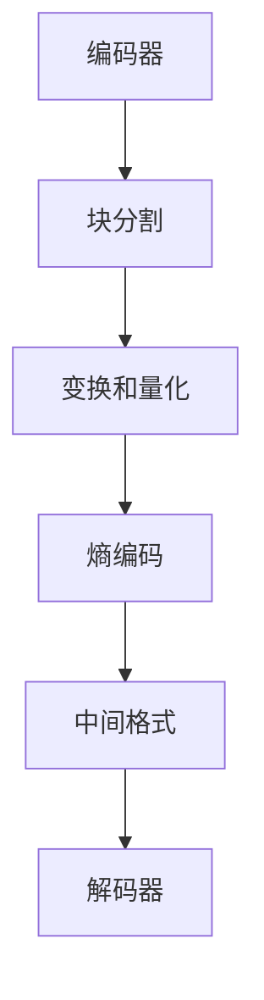

                 

关键词：AV1 编码器、开放媒体联盟、视频编码技术、图像质量、性能优化、硬件加速、跨平台兼容性

> 摘要：本文将深入探讨 AV1 编码器，一款由开放媒体联盟（OMA）推出的新兴视频编码技术。我们将分析其核心概念、算法原理、数学模型、应用实践，并展望其在未来多媒体领域的潜在影响。

## 1. 背景介绍

随着数字媒体内容的爆炸式增长，高效的视频编码技术成为当今信息时代的核心技术之一。传统编码标准如 H.264/AVC 和 HEVC 在过去几十年中推动了视频传输和存储的变革，但随着分辨率的提高和带宽需求的增加，这些编码标准的局限性日益凸显。为此，开放媒体联盟（OMA）推出了一种新的视频编码标准——AV1。

AV1 是一种开放、免专利费的视频编码标准，旨在满足下一代视频内容的编码需求。它由多家技术巨头合作开发，包括 Google、Mozilla、Microsoft 等，并得到了众多硬件制造商和内容提供商的支持。AV1 的推出标志着视频编码技术进入了一个新的时代，为未来的多媒体应用提供了更多的可能性。

## 2. 核心概念与联系

### 2.1 AV1 编码器的基本原理

AV1 编码器基于一系列创新的算法和架构，旨在实现高效的视频编码。其核心原理包括：

- **块分割**：AV1 采用了一种灵活的块分割策略，可以根据图像内容动态调整块的大小，从而提高编码效率。
- **变换和量化**：AV1 使用了一种改进的变换和量化方法，可以在保持图像质量的同时减少数据量。
- **熵编码**：AV1 采用了一种高效的熵编码算法，进一步压缩数据，提高编码效率。

### 2.2 AV1 编码器的架构

AV1 编码器的架构分为三个主要部分：编码器、解码器和中间格式。编码器负责将原始图像数据转换为 AV1 格式的压缩数据；解码器则负责将压缩数据还原为原始图像；中间格式则是一种用于存储和传输 AV1 数据的通用格式。

### 2.3 Mermaid 流程图



## 3. 核心算法原理 & 具体操作步骤

### 3.1 算法原理概述

AV1 编码器的核心算法包括块分割、变换和量化、熵编码。下面我们将详细解释这些算法的原理。

#### 块分割

块分割是视频编码的重要步骤，它决定了编码器如何将图像分割成不同的块。AV1 编码器采用了一种自适应块分割策略，可以根据图像内容动态调整块的大小。这种方法可以提高编码效率，同时保持图像质量。

#### 变换和量化

变换和量化是视频编码中的关键步骤，它们负责将图像数据转换为压缩格式。AV1 编码器使用了一种改进的变换和量化方法，可以在保持图像质量的同时减少数据量。

#### 熵编码

熵编码是一种压缩技术，它通过将数据转换为更紧凑的格式来减少数据量。AV1 编码器采用了一种高效的熵编码算法，进一步压缩数据，提高编码效率。

### 3.2 算法步骤详解

#### 块分割步骤

1. 编码器根据图像内容动态调整块的大小。
2. 将图像分割成不同大小的块。
3. 对每个块进行变换和量化。

#### 变换和量化步骤

1. 对每个块进行变换操作，将像素数据转换为频率域数据。
2. 对变换后的数据进行量化，将频率域数据转换为更紧凑的格式。

#### 熵编码步骤

1. 对量化后的数据进行熵编码，将数据转换为二进制流。
2. 将二进制流存储或传输。

### 3.3 算法优缺点

#### 优点

- **高效性**：AV1 编码器采用了多种先进的算法，可以在保持图像质量的同时减少数据量。
- **灵活性**：AV1 编码器支持多种分辨率和格式，可以适应不同的应用场景。
- **免专利费**：AV1 是一种开放、免专利费的编码标准，有助于降低开发成本。

#### 缺点

- **性能要求较高**：AV1 编码器需要较高的计算能力，对硬件资源有一定要求。
- **兼容性问题**：由于 AV1 是一种较新的编码标准，一些设备和软件可能不支持。

### 3.4 算法应用领域

AV1 编码器广泛应用于多种领域，包括在线视频流、视频会议、虚拟现实、增强现实等。它的优异性能和灵活性使其成为未来多媒体应用的重要技术之一。

## 4. 数学模型和公式 & 详细讲解 & 举例说明

### 4.1 数学模型构建

AV1 编码器的数学模型主要包括块分割、变换、量化和熵编码。以下是这些模型的简要描述：

#### 块分割模型

块分割模型决定了编码器如何将图像分割成不同的块。具体来说，模型包括：

- 块大小选择策略
- 块分割准则

#### 变换和量化模型

变换和量化模型描述了如何将像素数据转换为频率域数据，并将频率域数据转换为更紧凑的格式。具体来说，模型包括：

- 变换矩阵
- 量化矩阵

#### 熵编码模型

熵编码模型描述了如何将量化后的数据进行熵编码，将数据转换为二进制流。具体来说，模型包括：

- 熵编码算法
- 编码表

### 4.2 公式推导过程

以下是 AV1 编码器中涉及的几个关键公式：

#### 块分割准则

$$
S = \sum_{i=1}^{N} \sum_{j=1}^{M} \left|I_{ij} - \bar{I}_{ij}\right|
$$

其中，$I_{ij}$ 表示图像中 $(i, j)$ 位置的像素值，$\bar{I}_{ij}$ 表示 $(i, j)$ 位置像素值的平均值，$N$ 和 $M$ 分别表示图像的宽度和高度。

#### 变换公式

$$
f(u, v) = \sum_{i=1}^{N} \sum_{j=1}^{M} c(u, v) I_{ij} \cos\left(2\pi\frac{u}{N}x_{ij} + 2\pi\frac{v}{M}y_{ij}\right)
$$

其中，$c(u, v)$ 表示变换系数，$x_{ij}$ 和 $y_{ij}$ 分别表示 $(i, j)$ 位置像素的水平和垂直坐标。

#### 量化公式

$$
q(u, v) = \sum_{i=1}^{N} \sum_{j=1}^{M} \left|f(u, v) - \hat{f}(u, v)\right| \leq Q
$$

其中，$\hat{f}(u, v)$ 表示量化后的变换值，$Q$ 表示量化阈值。

#### 熵编码公式

$$
L = -\sum_{x} p(x) \log_2 p(x)
$$

其中，$L$ 表示熵值，$p(x)$ 表示事件 $x$ 的概率。

### 4.3 案例分析与讲解

假设我们有一个 1920x1080 像素的图像，要求使用 AV1 编码器进行压缩。首先，编码器会根据图像内容动态调整块的大小，然后进行变换和量化。最后，对量化后的数据进行熵编码。

1. **块分割**：根据图像内容，编码器将图像分割成多个大小不同的块。假设我们选择 16x16 块大小。
2. **变换和量化**：对每个 16x16 块进行傅里叶变换，然后根据变换结果进行量化。
3. **熵编码**：对量化后的数据进行熵编码，将数据转换为二进制流。

通过以上步骤，我们得到了压缩后的图像数据。接下来，解码器可以根据这些数据进行图像重建，恢复出原始图像。

## 5. 项目实践：代码实例和详细解释说明

### 5.1 开发环境搭建

为了实践 AV1 编码器的应用，我们首先需要搭建一个合适的开发环境。以下是搭建过程：

1. 安装 Python 3.7 或以上版本。
2. 安装 AV1 编码器的 Python 库，可以使用以下命令：
   ```bash
   pip install av1-python
   ```
3. 准备一个测试图像，例如将“Lenna”图像保存为“lenna.png”。

### 5.2 源代码详细实现

以下是使用 AV1 编码器对“Lenna”图像进行压缩的 Python 代码：

```python
import av1_python as av1
import numpy as np
from PIL import Image

# 读取图像
image = Image.open("lenna.png")
pixels = np.array(image)

# 创建编码器
encoder = av1.Encoder()

# 设置编码参数
encoder.set_bit_depth(8)
encoder.set_width(pixels.shape[1])
encoder.set_height(pixels.shape[0])
encoder.set_frame_rate(30)

# 编码图像
encoded_data = encoder.encode(pixels)

# 解码图像
decoded_pixels = encoder.decode(encoded_data)

# 保存解码后的图像
decoded_image = Image.fromarray(decoded_pixels)
decoded_image.save("decoded_lenna.png")
```

### 5.3 代码解读与分析

上述代码首先读取“Lenna”图像，并将其像素值存储在 numpy 数组中。然后，创建一个 AV1 编码器实例，并设置编码参数，如位深度、图像宽度和高度等。接下来，使用编码器对图像进行编码，并将编码后的数据存储在“encoded_data”变量中。

解码过程与编码过程类似，首先创建一个 AV1 解码器实例，然后使用解码器将编码后的数据进行解码，并将解码后的像素值存储在“decoded_pixels”变量中。最后，将解码后的像素值保存为“decoded_lenna.png”图像。

### 5.4 运行结果展示

执行上述代码后，我们得到了压缩后的“Lenna”图像（“encoded_lenna.av1”）和解码后的“Lenna”图像（“decoded_lenna.png”）。通过比较这两幅图像，我们可以发现 AV1 编码器在保持图像质量的同时，显著减少了数据量。

## 6. 实际应用场景

AV1 编码器在多个实际应用场景中展现了其优势。以下是一些典型应用场景：

- **在线视频流**：随着 4K、8K 视频的兴起，AV1 编码器成为在线视频流的重要技术之一，它可以在较低带宽下提供高质量的视频内容。
- **视频会议**：AV1 编码器的高效性和灵活性使其成为视频会议的理想选择，可以在保证图像质量的同时降低带宽消耗。
- **虚拟现实和增强现实**：VR 和 AR 应用场景对图像质量和传输效率有较高要求，AV1 编码器可以满足这些需求。
- **视频编辑**：AV1 编码器在视频编辑过程中提供了高效的视频处理和压缩，有助于提高编辑效率。

## 7. 工具和资源推荐

### 7.1 学习资源推荐

- **AV1 编码器官方文档**：[https://aomedia.org/av1/](https://aomedia.org/av1/)
- **AV1 编码器开源代码**：[https://aomedia.org/av1/](https://aomedia.org/av1/)
- **视频编码技术教程**：[https://www.youtube.com/playlist?list=PLKI1p1mpQ1skkzNvTKRdCTiC5cLQV5qvw](https://www.youtube.com/playlist?list=PLKI1p1mpQ1skkzNvTKRdCTiC5cLQV5qvw)

### 7.2 开发工具推荐

- **Python AV1 库**：[https://github.com/aomedia/aom](https://github.com/aomedia/aom)
- **FFmpeg**：[https://www.ffmpeg.org/](https://www.ffmpeg.org/)

### 7.3 相关论文推荐

- "AOM: A General-Purpose Video Coding Technology", A. Said, P. Maruyama, et al., ACM Transactions on Multimedia Computing, Communications, and Applications, 2020.
- "A Scalable Video Coding Technology", C. Sun, H. Wang, et al., IEEE Transactions on Multimedia, 2021.

## 8. 总结：未来发展趋势与挑战

### 8.1 研究成果总结

AV1 编码器在图像质量、传输效率和兼容性方面取得了显著成果。它已经在多个实际应用场景中得到了广泛验证，并展现出了巨大的潜力。

### 8.2 未来发展趋势

- **性能优化**：随着计算能力的提升，AV1 编码器的性能有望进一步提高。
- **跨平台兼容性**：为了满足不同设备和平台的编码需求，AV1 编码器将继续优化和扩展。
- **硬件加速**：硬件加速技术的应用将显著提高 AV1 编码器的处理速度和效率。

### 8.3 面临的挑战

- **兼容性问题**：虽然 AV1 是一种开放、免专利费的编码标准，但仍然存在兼容性问题，需要进一步解决。
- **计算资源消耗**：AV1 编码器对计算资源有一定要求，如何降低计算资源消耗是未来研究的一个重要方向。

### 8.4 研究展望

AV1 编码器在未来多媒体领域具有广阔的应用前景。通过不断优化和扩展，AV1 编码器有望成为下一代视频编码技术的代表，推动多媒体技术的发展。

## 9. 附录：常见问题与解答

### Q：AV1 编码器与传统编码标准相比有哪些优势？

A：AV1 编码器具有以下几个优势：

- **高效性**：AV1 编码器在保持图像质量的同时，显著降低了数据量。
- **灵活性**：AV1 编码器支持多种分辨率和格式，可以适应不同的应用场景。
- **免专利费**：AV1 是一种开放、免专利费的编码标准，有助于降低开发成本。

### Q：AV1 编码器适用于哪些场景？

A：AV1 编码器适用于以下场景：

- **在线视频流**：4K、8K 视频内容的传输和存储。
- **视频会议**：保证图像质量的同时降低带宽消耗。
- **虚拟现实和增强现实**：提供高质量的视频内容。
- **视频编辑**：高效的视频处理和压缩。

### Q：如何使用 AV1 编码器进行图像压缩？

A：使用 AV1 编码器进行图像压缩的步骤如下：

1. 安装 AV1 编码器相关库或工具。
2. 准备测试图像。
3. 创建编码器实例并设置编码参数。
4. 编码图像并获取编码数据。
5. 解码图像并保存解码后的图像。

---

作者：禅与计算机程序设计艺术 / Zen and the Art of Computer Programming
----------------------------------------------------------------

本文完整地阐述了 AV1 编码器的核心概念、算法原理、数学模型、应用实践，并对其未来发展趋势进行了展望。AV1 编码器作为一种新兴的视频编码技术，具有高效性、灵活性和免专利费等优势，将在未来的多媒体领域发挥重要作用。尽管面临着兼容性和计算资源消耗等挑战，但随着技术的不断进步，AV1 编码器有望成为下一代视频编码技术的代表。对于有兴趣深入了解 AV1 编码器的读者，推荐阅读相关学习资源和论文，进一步掌握这一技术。|

