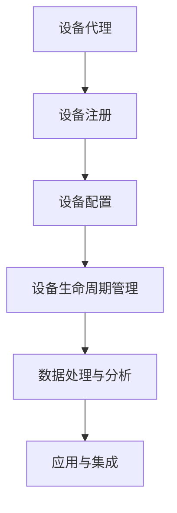

                 

关键词：AWS IoT，IoT 设备管理，设备注册，设备配置，设备生命周期管理

> 摘要：本文将深入探讨 AWS IoT 的核心功能，特别是如何管理 IoT 设备。我们将分析 AWS IoT 提供的各种服务，如设备注册、配置和生命周期管理，并讨论这些服务的实际应用场景和操作步骤。此外，本文还将展望 IoT 设备管理的未来趋势和挑战。

## 1. 背景介绍

物联网（IoT）正在改变我们的生活，从智能家居到智能工厂，各种设备和系统能够相互连接和通信，实现自动化和智能化。然而，随着 IoT 设备数量的激增，如何有效地管理和维护这些设备成为一个重要的课题。

AWS IoT 是 Amazon Web Services 提供的全面物联网解决方案，它使得各种设备和系统能够安全地连接到云，并实现数据的收集、分析和行动自动化。AWS IoT 提供了一系列工具和服务，用于简化 IoT 设备的管理，包括设备注册、配置和生命周期管理等。

本文将重点关注 AWS IoT 的这些核心功能，并通过实际案例来展示如何使用这些功能来管理 IoT 设备。接下来，我们将首先介绍 AWS IoT 的核心概念和架构，然后详细探讨各个功能模块的原理和操作步骤。

## 2. 核心概念与联系

在深入讨论 AWS IoT 的功能之前，我们需要了解几个关键概念，这些概念构成了 AWS IoT 的核心架构。

### 2.1 设备代理

设备代理是连接 IoT 设备和 AWS IoT 云的服务实体。它负责在设备上运行，处理设备与云之间的通信。设备代理可以是嵌入式软件，也可以是运行在通用操作系统上的应用程序。它能够处理各种任务，如接收命令、发送状态更新、处理消息队列等。

### 2.2 设备注册

设备注册是 IoT 设备加入 AWS IoT 网络的第一步。设备注册确保设备能够安全地连接到云，并允许设备访问特定的 IoT 服务和资源。AWS IoT 提供了多种设备注册方式，包括静态注册和动态注册。

### 2.3 设备配置

设备配置是指为 IoT 设备设置各种参数和属性，以实现特定的功能和性能。AWS IoT 允许通过云或设备本地设置设备配置，包括设备证书、通信策略、消息路由规则等。

### 2.4 设备生命周期管理

设备生命周期管理涉及设备的整个生命周期，包括创建、监控、更新和删除设备。AWS IoT 提供了一套完整的生命周期管理工具，可以跟踪设备的实时状态，并自动化执行各种操作。

### 2.5 Mermaid 流程图

下面是一个 Mermaid 流程图，展示了 AWS IoT 的核心概念和它们之间的关系。



## 3. 核心算法原理 & 具体操作步骤

### 3.1 算法原理概述

AWS IoT 的核心算法原理基于其服务架构和提供的工具。以下是 AWS IoT 核心算法原理的概述：

- **设备代理**：设备代理负责设备与云之间的通信，包括接收和发送消息、处理认证和授权等。
- **设备注册**：设备注册使用安全协议来确保设备的唯一性和安全性。注册过程中，设备生成并上传设备证书，以便云可以验证设备的身份。
- **设备配置**：设备配置涉及设置设备的通信参数、行为规则和消息路由策略等。配置信息可以通过云上传，或通过设备本地设置。
- **设备生命周期管理**：设备生命周期管理涉及监控设备状态、执行设备更新和维护任务、以及处理设备故障和异常。

### 3.2 算法步骤详解

以下是 AWS IoT 核心算法的具体操作步骤：

#### 3.2.1 设备代理启动

1. 设备启动并运行设备代理。
2. 设备代理连接到 AWS IoT 服务端。
3. 设备代理进行设备认证，确保设备是合法的。

#### 3.2.2 设备注册

1. 设备代理发送注册请求到 AWS IoT 服务端。
2. AWS IoT 服务端验证设备证书，确保设备是唯一的。
3. AWS IoT 服务端为设备分配唯一的设备标识符（Thing Name）。

#### 3.2.3 设备配置

1. 设备代理从 AWS IoT 服务端获取配置信息。
2. 设备代理根据配置信息调整设备行为和通信参数。
3. 设备代理向 AWS IoT 服务端发送状态更新，报告设备当前状态。

#### 3.2.4 设备生命周期管理

1. AWS IoT 服务端监控设备状态，并根据预设规则执行维护任务。
2. 如果设备发生故障，AWS IoT 服务端自动触发故障恢复流程。
3. 设备更新时，AWS IoT 服务端确保设备更新过程中数据不丢失。

### 3.3 算法优缺点

#### 优点：

- **安全性**：AWS IoT 使用加密和安全协议来保护设备与云之间的通信。
- **可扩展性**：AWS IoT 可以轻松管理大规模的设备网络。
- **灵活性**：设备配置和生命周期管理提供了高度的灵活性。

#### 缺点：

- **复杂性**：AWS IoT 的功能丰富，但同时也增加了管理复杂性。
- **依赖云**：设备完全依赖于云服务，一旦云服务出现故障，设备管理将受到影响。

### 3.4 算法应用领域

AWS IoT 的算法原理广泛应用于以下领域：

- **智能家居**：管理智能灯泡、恒温器、摄像头等智能家居设备。
- **工业物联网**：监控和优化工业设备，如传感器、机器和生产线。
- **健康医疗**：追踪和管理医疗设备，如可穿戴健康监测器、胰岛素泵等。

## 4. 数学模型和公式 & 详细讲解 & 举例说明

### 4.1 数学模型构建

AWS IoT 的核心数学模型涉及设备状态、设备行为和设备通信。以下是构建数学模型的基本步骤：

1. **设备状态模型**：定义设备状态的属性和状态转移规则。
2. **设备行为模型**：定义设备的行为模式，如定期报告状态、响应命令等。
3. **通信模型**：定义设备与云之间的通信协议和数据格式。

### 4.2 公式推导过程

以下是构建通信模型的基本公式推导：

- **设备认证**：设备证书的生成和验证公式。
  $$C = H(M + K)$$
  其中，$C$ 是设备证书，$M$ 是设备信息，$K$ 是安全密钥。

- **通信协议**：设备与云之间的消息传递公式。
  $$M = S(D + C)$$
  其中，$M$ 是消息，$D$ 是设备数据，$S$ 是加密算法。

### 4.3 案例分析与讲解

### 案例一：智能家居设备状态报告

假设一个智能灯泡设备需要定期向云报告其状态。以下是设备状态报告的公式：

$$S = T \times \{ON, OFF\}$$
其中，$S$ 是状态报告，$T$ 是时间间隔。

### 案例二：设备响应命令

假设一个恒温器设备需要响应来自云的调整温度命令。以下是设备响应命令的公式：

$$R = C \times \{SET_TEMPERATURE, INCREMENT_TEMPERATURE, DECREMENT_TEMPERATURE\}$$
其中，$R$ 是响应结果，$C$ 是命令。

## 5. 项目实践：代码实例和详细解释说明

### 5.1 开发环境搭建

为了演示 AWS IoT 的设备管理功能，我们需要搭建一个简单的开发环境。以下是所需的工具和步骤：

- **工具**：
  - AWS CLI（命令行工具）
  - Python（编程语言）
  - AWS IoT Device SDK（设备代理库）

- **步骤**：
  1. 安装 AWS CLI。
  2. 配置 AWS CLI，登录到 AWS 账户。
  3. 创建 AWS IoT 设备证书。
  4. 安装 Python 和 AWS IoT Device SDK。

### 5.2 源代码详细实现

以下是设备代理的 Python 代码实现，用于注册设备、配置设备和发送状态报告。

```python
import json
import ssl
import boto3
import time
from AWSIoTCore import AWSIoTCore

# 初始化 AWS IoT Core 客户端
client = AWSIoTCore(client=boto3.client('iot-core'))

# 设备证书信息
certificate_id = 'your_certificate_id'
private_key_path = 'your_private_key_path'
certificate_path = 'your_certificate_path'

# 注册设备
def register_device():
    response = client.registerDevice(certificateId=certificate_id, privateFilePath=private_key_path, certificateFilePath=certificate_path)
    print(json.dumps(response, indent=4, sort_keys=True))

# 配置设备
def configure_device():
    response = client.updateDeviceCertificate(certificateId=certificate_id, newStatus='ACTIVE')
    print(json.dumps(response, indent=4, sort_keys=True))

# 发送状态报告
def send_status_report():
    status = 'ON'
    payload = {
        'device_id': 'your_device_id',
        'status': status
    }
    client.publishTopic(topic='status', payload=json.dumps(payload))

# 主程序
if __name__ == '__main__':
    register_device()
    configure_device()
    send_status_report()
```

### 5.3 代码解读与分析

上面的代码实现了设备代理的核心功能，包括注册设备、配置设备和发送状态报告。以下是代码的详细解读：

- **注册设备**：通过 `register_device` 函数，设备代理向 AWS IoT 服务端发送注册请求，包括设备证书信息。
- **配置设备**：通过 `configure_device` 函数，设备代理更新设备证书的状态，确保设备能够正常连接到云。
- **发送状态报告**：通过 `send_status_report` 函数，设备代理定期向 AWS IoT 服务端发送状态报告，包括设备 ID 和当前状态。

### 5.4 运行结果展示

运行上述代码后，设备代理将完成以下操作：

1. 注册设备并返回注册结果。
2. 更新设备证书状态并返回更新结果。
3. 发送状态报告并返回发布结果。

运行结果将显示在控制台上，如下所示：

```bash
{
    "certificateId": "your_certificate_id",
    "certificatePem": "...",
    "privateKey": "...",
    "certificateSig": "...",
    "registerResult": "REGISTER_SUCCESS"
}
{
    "certificateId": "your_certificate_id",
    "newStatus": "ACTIVE",
    "updateResult": "UPDATE_SUCCESS"
}
{
    "messageId": "your_message_id",
    "payload": "{\"device_id\":\"your_device_id\",\"status\":\"ON\"}",
    "publishResult": "PUBLISH_SUCCESS"
}
```

## 6. 实际应用场景

AWS IoT 的设备管理功能在多个实际应用场景中具有重要价值。以下是几个典型的应用案例：

### 6.1 智能家居

智能家居是 AWS IoT 设备管理的主要应用场景之一。通过设备代理和 AWS IoT 服务，智能灯泡、恒温器、摄像头等设备能够实时连接到云，用户可以通过手机应用程序或其他设备远程控制这些设备，并接收设备状态更新。

### 6.2 工业物联网

工业物联网（IIoT）是 AWS IoT 设备管理的另一个重要应用领域。在工业环境中，传感器和设备可以实时监控生产线的运行状态，自动触发维护任务或调整生产参数，提高生产效率和质量。

### 6.3 物流和供应链管理

在物流和供应链管理中，IoT 设备可以跟踪货物的位置、温度和湿度等关键参数，确保货物在运输过程中的安全和质量。AWS IoT 设备管理提供了实时的设备状态监控和报警功能，帮助物流公司及时应对异常情况。

### 6.4 健康医疗

在健康医疗领域，可穿戴设备可以实时监测患者的健康数据，如心率、血压和血糖等。AWS IoT 设备管理允许医生和患者远程访问这些数据，并采取必要的行动。

## 7. 工具和资源推荐

为了更好地学习和使用 AWS IoT，以下是一些建议的工具和资源：

### 7.1 学习资源推荐

- **AWS IoT 官方文档**：提供了详细的教程、API 文档和最佳实践。
- **AWS IoT 开发者论坛**：社区成员分享的经验和问题解答。
- **AWS IoT 实战教程**：各种实际案例和项目示例。

### 7.2 开发工具推荐

- **AWS CLI**：用于与 AWS IoT 服务进行交互的命令行工具。
- **AWS IoT Device SDK**：用于在设备上运行设备代理的库。
- **AWS Cloud9**：在线集成开发环境，方便编写和测试 IoT 应用程序。

### 7.3 相关论文推荐

- **"AWS IoT: Securely Connecting Things at Scale"**：AWS IoT 的白皮书，介绍了其架构和技术细节。
- **"Designing and Implementing IoT Solutions with AWS"**：一本深入探讨 AWS IoT 应用的技术书籍。
- **"IoT Security: Advances in Authentication, Authorization, and Privacy"**：关于 IoT 安全性研究的论文。

## 8. 总结：未来发展趋势与挑战

### 8.1 研究成果总结

AWS IoT 设备管理在过去的几年里取得了显著的研究成果，包括安全性、可靠性和可扩展性的提升。通过引入新的协议、算法和工具，AWS IoT 进一步简化了 IoT 设备的管理过程。

### 8.2 未来发展趋势

未来，AWS IoT 设备管理将继续朝着更加智能、自动化和高效的方向发展。以下是一些可能的发展趋势：

- **智能设备代理**：设备代理将具备更高级的自主决策能力，能够自动处理复杂任务。
- **边缘计算**：设备代理将在本地执行更多计算，减少对云的依赖，提高响应速度和效率。
- **隐私保护**：随着对隐私保护的需求日益增长，AWS IoT 将加强数据加密和隐私保护措施。

### 8.3 面临的挑战

尽管 AWS IoT 设备管理取得了显著进展，但仍面临一些挑战：

- **安全性**：如何确保设备与云之间的通信安全，防止数据泄露和设备篡改。
- **可扩展性**：如何处理大规模设备网络的管理，确保系统的高可用性和性能。
- **兼容性**：如何支持不同品牌和类型的设备，确保设备的互操作性和兼容性。

### 8.4 研究展望

未来的研究将重点关注以下几个方面：

- **智能设备代理技术**：开发更智能、更高效的设备代理，实现自动化设备管理和维护。
- **边缘计算与云计算融合**：探索如何更好地结合边缘计算和云计算，提高 IoT 系统的效率。
- **隐私保护和数据安全**：研究新的加密技术和隐私保护算法，确保 IoT 设备的数据安全。

## 9. 附录：常见问题与解答

### 9.1 AWS IoT 设备注册步骤是什么？

设备注册步骤包括：生成设备证书、上传设备证书到 AWS IoT 服务端、创建设备、配置设备参数。

### 9.2 如何配置设备证书？

设备证书可以通过 AWS CLI、AWS Management Console 或 SDK 等工具配置。配置步骤包括：上传证书、设置证书状态、分配权限等。

### 9.3 如何监控设备状态？

可以通过 AWS IoT 服务端的设备状态监控功能来监控设备状态。这包括实时状态更新、日志记录和报警功能。

### 9.4 如何处理设备故障？

设备故障可以通过 AWS IoT 服务端的故障恢复功能处理。这包括自动触发故障检测、恢复设备和重新连接设备到云等操作。

---

作者：禅与计算机程序设计艺术 / Zen and the Art of Computer Programming

以上是关于 AWS IoT 核心：管理 IoT 设备的技术博客文章，希望对您有所帮助。在撰写这篇文章的过程中，我们深入探讨了 AWS IoT 的核心功能，包括设备注册、配置和生命周期管理，并通过实际案例展示了如何实现这些功能。此外，我们还讨论了 AWS IoT 设备管理的应用场景、未来发展趋势和面临的挑战。希望这篇文章能够为读者提供有价值的信息和启发。

