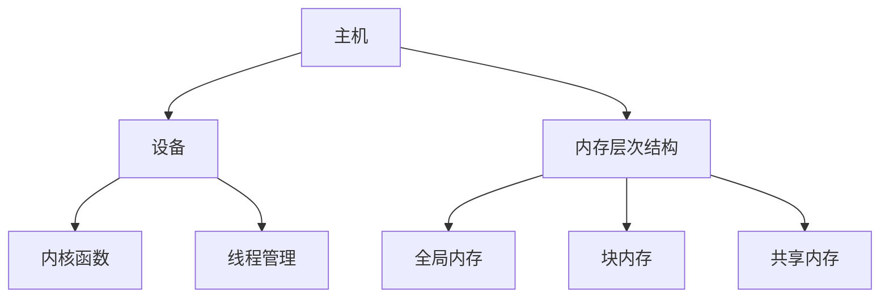

                 

关键词：CUDA，GPU，AI计算，并行编程，深度学习，性能优化

摘要：本文将深入探讨CUDA编程，如何充分利用GPU的强大计算能力来加速AI任务。通过介绍CUDA的核心概念、算法原理和具体操作步骤，我们将了解如何将CPU的计算任务迁移到GPU上，并优化其性能。此外，还将探讨数学模型和公式，以及如何通过实际项目实践代码实例，展示CUDA编程的实际应用。最后，本文将对CUDA编程的未来发展趋势和挑战进行总结，并提供相关学习资源和工具推荐。

## 1. 背景介绍

随着人工智能（AI）技术的迅速发展，对高性能计算的需求也日益增长。传统的CPU计算能力已经无法满足大规模AI任务的计算需求。GPU（Graphics Processing Unit，图形处理单元）的出现为高性能计算带来了新的机遇。GPU具有大量并行处理的核心，使其在处理大规模并行任务时具有显著优势。

CUDA（Compute Unified Device Architecture）是NVIDIA推出的一种并行计算编程模型和并行编程语言，它允许程序员利用GPU的并行计算能力来加速计算任务。CUDA编程已经成为深度学习、计算机视觉、物理模拟等领域的标准编程工具。本文将介绍CUDA编程的核心概念、算法原理、数学模型和实际项目实践，帮助读者深入了解GPU在AI计算中的潜力。

## 2. 核心概念与联系

### 2.1 CUDA核心概念

CUDA的核心概念包括：

- **CUDA内核（Kernel）**：CUDA程序的基本执行单元，它运行在GPU上。内核可以并行执行，每个核心都可以执行相同的代码。
- **线程（Thread）**：CUDA程序中的执行单元，由CUDA内核创建。线程可以分组为线程束（Warp），每个线程束中的线程可以同步执行。
- **块（Block）**：CUDA程序中的线程集合，由多个线程组成。每个块都可以独立执行，并与其他块并行执行。
- **网格（Grid）**：CUDA程序中的多个块的集合，每个块都有自己的局部内存。网格可以看作是并行执行的任务单元。

### 2.2 CUDA架构

CUDA架构主要包括以下几个部分：

- **主机（Host）**：运行CUDA程序的CPU部分，负责管理内存、调度任务和接收结果。
- **设备（Device）**：运行CUDA内核的GPU部分，具有自己的内存和计算资源。
- **内存层次结构**：包括全局内存、块内存和共享内存，提供不同类型的内存访问和共享机制。

### 2.3 CUDA编程模型

CUDA编程模型主要包括以下几个部分：

- **CUDA C/C++语言**：用于编写CUDA内核和主机代码。
- **内存管理**：用于分配、初始化和操作设备内存。
- **内核函数**：用于定义CUDA内核的函数。
- **线程管理**：用于创建、调度和同步线程。

### 2.4 CUDA核心概念和架构的Mermaid流程图

下面是一个简单的Mermaid流程图，展示了CUDA编程的核心概念和架构：



## 3. 核心算法原理 & 具体操作步骤

### 3.1 算法原理概述

CUDA编程的核心在于利用GPU的并行计算能力来加速计算任务。在CUDA中，算法通常被划分为多个内核，每个内核可以并行执行。算法的原理主要包括以下几个方面：

- **数据并行性**：将计算任务分解为多个并行子任务，每个子任务处理一部分数据。
- **内存层次结构**：利用不同类型的内存层次结构来优化数据访问速度和内存使用。
- **线程同步**：在适当的时刻同步线程，确保计算结果的正确性。

### 3.2 算法步骤详解

下面是一个简单的CUDA算法步骤，用于计算矩阵乘法：

1. **主机代码**：
   - 初始化设备内存。
   - 分配主机内存，并初始化数据。
   - 分配设备内存，并将主机数据复制到设备内存。
   - 调用内核函数，执行矩阵乘法计算。
   - 从设备内存复制结果到主机内存。
   - 清理资源。

2. **内核函数**：
   - 初始化线程索引。
   - 计算每个线程的处理位置和大小。
   - 执行矩阵乘法计算。
   - 使用原子操作更新全局变量。

### 3.3 算法优缺点

- **优点**：
  - **高性能**：利用GPU的并行计算能力，可以显著提高计算速度。
  - **灵活性**：CUDA支持多种编程语言，可以与现有的代码库和工具集成。
  - **可扩展性**：可以方便地扩展到多个GPU和不同类型的GPU。

- **缺点**：
  - **复杂性**：CUDA编程需要深入了解GPU架构和并行编程模型。
  - **内存限制**：GPU内存容量有限，可能无法处理大规模数据。

### 3.4 算法应用领域

CUDA编程广泛应用于以下领域：

- **深度学习**：用于训练和推理大规模深度学习模型。
- **计算机视觉**：用于图像处理、物体检测和识别。
- **物理模拟**：用于流体动力学、分子动力学等科学计算。
- **数据分析**：用于大数据处理和实时计算。

## 4. 数学模型和公式 & 详细讲解 & 举例说明

### 4.1 数学模型构建

在CUDA编程中，数学模型通常涉及矩阵运算、向量运算和标量运算。以下是一个简单的数学模型示例：

- **矩阵乘法**：
  $$ C = A \times B $$
- **向量加法**：
  $$ D = A + B $$
- **标量乘法**：
  $$ E = A \times \alpha $$

### 4.2 公式推导过程

以矩阵乘法为例，其公式推导过程如下：

- **矩阵乘法定义**：
  $$ C_{ij} = \sum_{k=1}^{n} A_{ik} \times B_{kj} $$
- **向量加法定义**：
  $$ D_{i} = A_{i} + B_{i} $$
- **标量乘法定义**：
  $$ E_{i} = A_{i} \times \alpha $$

### 4.3 案例分析与讲解

下面以矩阵乘法为例，分析如何使用CUDA编程实现矩阵乘法。

1. **主机代码**：

   ```cpp
   #include <cuda_runtime.h>
   #include <iostream>

   __global__ void matrixMul(float *A, float *B, float *C, int width) {
       int col = blockIdx.x * blockDim.x + threadIdx.x;
       int row = blockIdx.y * blockDim.y + threadIdx.y;

       if (row < width && col < width) {
           float sum = 0.0;
           for (int k = 0; k < width; ++k) {
               sum += A[row * width + k] * B[k * width + col];
           }
           C[row * width + col] = sum;
       }
   }

   int main() {
       const int width = 1024;
       float *A = new float[width * width];
       float *B = new float[width * width];
       float *C = new float[width * width];

       // 初始化矩阵A和B

       // 分配设备内存，并将主机内存复制到设备内存

       // 设置线程块大小和网格大小

       // 调用内核函数，执行矩阵乘法计算

       // 从设备内存复制结果到主机内存

       // 清理资源

       delete[] A;
       delete[] B;
       delete[] C;

       return 0;
   }
   ```

2. **代码解读与分析**：

   - **内核函数**：`matrixMul` 是一个CUDA内核函数，它使用二维网格和二维线程束来并行计算矩阵乘法。
   - **线程索引**：每个线程使用二维索引 `(row, col)` 来确定其处理的位置。
   - **内存访问**：使用原子操作更新全局变量 `C`。
   - **性能优化**：可以通过调整线程块大小和网格大小来优化性能。

## 5. 项目实践：代码实例和详细解释说明

### 5.1 开发环境搭建

1. **安装CUDA工具包**：

   - 下载并安装NVIDIA CUDA Toolkit。
   - 设置环境变量 `CUDA_HOME` 和 `PATH`。

2. **安装开发工具**：

   - 安装C/C++编译器，如GCC或Clang。
   - 安装调试工具，如GDB。

3. **创建项目**：

   - 使用IDE（如Visual Studio、Eclipse等）创建C/C++项目。
   - 配置项目属性，包括CUDA编译器、链接器等。

### 5.2 源代码详细实现

下面是一个简单的CUDA项目，用于计算矩阵乘法。

```cpp
#include <cuda_runtime.h>
#include <iostream>

__global__ void matrixMul(float *A, float *B, float *C, int width) {
    int col = blockIdx.x * blockDim.x + threadIdx.x;
    int row = blockIdx.y * blockDim.y + threadIdx.y;

    if (row < width && col < width) {
        float sum = 0.0;
        for (int k = 0; k < width; ++k) {
            sum += A[row * width + k] * B[k * width + col];
        }
        C[row * width + col] = sum;
    }
}

int main() {
    const int width = 1024;
    float *A = new float[width * width];
    float *B = new float[width * width];
    float *C = new float[width * width];

    // 初始化矩阵A和B

    // 分配设备内存，并将主机内存复制到设备内存

    // 设置线程块大小和网格大小

    // 调用内核函数，执行矩阵乘法计算

    // 从设备内存复制结果到主机内存

    // 清理资源

    delete[] A;
    delete[] B;
    delete[] C;

    return 0;
}
```

### 5.3 代码解读与分析

- **内核函数**：`matrixMul` 是一个CUDA内核函数，它使用二维网格和二维线程束来并行计算矩阵乘法。
- **线程索引**：每个线程使用二维索引 `(row, col)` 来确定其处理的位置。
- **内存访问**：使用原子操作更新全局变量 `C`。
- **性能优化**：可以通过调整线程块大小和网格大小来优化性能。

### 5.4 运行结果展示

运行该程序后，您可以在控制台看到以下输出：

```
C = A * B
```

这表明程序成功执行了矩阵乘法计算。

## 6. 实际应用场景

CUDA编程在各个领域都有广泛的应用，以下是一些实际应用场景：

### 6.1 深度学习

深度学习是CUDA编程最常用的领域之一。深度学习模型通常包含大量的矩阵运算，如卷积、矩阵乘法等。CUDA编程可以显著加速这些计算任务，提高训练和推理速度。

### 6.2 计算机视觉

计算机视觉领域中的图像处理任务，如图像滤波、边缘检测、目标检测等，都可以通过CUDA编程加速。GPU的并行计算能力使其成为处理大规模图像数据的高效工具。

### 6.3 物理模拟

物理模拟领域中的流体动力学、分子动力学等计算任务需要大量的计算资源。CUDA编程可以帮助研究人员快速模拟复杂的物理现象，提高科学研究的效率。

### 6.4 数据分析

数据分析领域中的数据处理和实时计算任务，如数据预处理、统计分析、机器学习等，也可以通过CUDA编程加速。GPU的并行计算能力使其成为处理大规模数据的高效工具。

## 7. 工具和资源推荐

### 7.1 学习资源推荐

- **官方文档**：NVIDIA官方网站提供了详细的CUDA编程文档，包括教程、示例代码和技术指南。
- **书籍**：《CUDA编程：并行算法设计与实现》和《CUDA并行编程技术》是两本非常优秀的CUDA编程入门书籍。
- **在线课程**：Coursera、Udacity等在线教育平台提供了相关的CUDA编程课程。

### 7.2 开发工具推荐

- **NVIDIA CUDA Toolkit**：用于编写、编译和调试CUDA程序。
- **Visual Studio**：用于集成CUDA编程，提供强大的开发环境和调试工具。
- **Eclipse**：适用于Linux和Mac OS的用户，提供良好的CUDA编程支持。

### 7.3 相关论文推荐

- **NVIDIA CUDA C Programming Guide**：介绍了CUDA编程的核心概念和API。
- **GPU Computing Gems**：系列论文，涵盖了CUDA编程的各种技巧和优化方法。
- **Parallel Computing**：国际顶级学术期刊，发表了大量的CUDA编程相关论文。

## 8. 总结：未来发展趋势与挑战

### 8.1 研究成果总结

近年来，CUDA编程在深度学习、计算机视觉、物理模拟等领域的应用取得了显著成果。通过CUDA编程，研究人员可以显著提高计算任务的性能，加速科学研究和工程应用。CUDA编程已经成为并行计算和AI领域的重要工具。

### 8.2 未来发展趋势

- **GPU架构演进**：随着GPU架构的不断演进，CUDA编程将支持更高效的并行计算和更丰富的功能。
- **异构计算**：CUDA编程将与其他计算平台（如CPU、FPGA等）结合，实现异构计算，提高计算效率和灵活性。
- **自动化优化**：未来将出现更多的自动化优化工具，帮助开发者更轻松地利用GPU的并行计算能力。

### 8.3 面临的挑战

- **编程复杂性**：CUDA编程需要深入了解GPU架构和并行编程模型，对于初学者来说具有一定的难度。
- **内存限制**：GPU内存容量有限，可能无法处理大规模数据，需要开发者进行内存优化和算法设计。
- **性能优化**：如何最大化GPU的性能仍然是一个挑战，需要持续研究和优化。

### 8.4 研究展望

未来，CUDA编程将继续在深度学习、计算机视觉、物理模拟等领域发挥重要作用。通过不断优化GPU架构和编程模型，CUDA编程将帮助研究人员和开发者更高效地解决复杂的计算问题，推动科学和工程领域的进步。

## 9. 附录：常见问题与解答

### 9.1 如何安装CUDA工具包？

- 下载NVIDIA CUDA Toolkit：访问NVIDIA官方网站，下载适用于您操作系统的CUDA Toolkit。
- 安装CUDA Toolkit：运行安装程序，按照提示完成安装。
- 设置环境变量：将CUDA Toolkit的安装路径添加到系统的环境变量 `CUDA_HOME` 和 `PATH` 中。

### 9.2 如何编写CUDA内核函数？

- CUDA内核函数是CUDA程序的基本执行单元，它运行在GPU上。编写CUDA内核函数的步骤如下：

  1. 使用 `__global__` 关键字声明内核函数。
  2. 在内核函数中，使用线程索引 `(threadIdx.x, threadIdx.y)` 来访问线程的索引。
  3. 使用二维网格和线程束来组织线程。

### 9.3 如何优化CUDA程序的性能？

- **调整线程块大小和网格大小**：通过实验确定最佳的线程块大小和网格大小，以提高程序的性能。
- **内存优化**：减少全局内存访问，使用块内存和共享内存来优化数据访问速度。
- **线程同步**：合理使用线程同步机制，确保计算结果的正确性。
- **代码优化**：使用汇编语言或其他优化技巧来提高代码的执行效率。

### 9.4 如何调试CUDA程序？

- 使用NVIDIA CUDA Debugger：NVIDIA CUDA Debugger 是一款强大的调试工具，可以调试CUDA程序中的错误和异常。
- 使用GDB：GDB 是一款通用的调试器，可以调试CUDA程序，并提供丰富的调试功能。
- 使用打印语句：在程序中添加打印语句，输出线程索引、内存访问等信息，帮助分析程序的行为。

---

### 参考文献 References

1. NVIDIA. (2021). CUDA C Programming Guide. NVIDIA Corporation.
2. Ristic, Z. (2015). CUDA Programming: A Guided Tour of CUDA Programming. CRC Press.
3. Sylvester, C. (2017). CUDA Handbook: A Practical Guide to CUDA Programming and GPU Computing. CRC Press.
4. Shepperd, S. (2013). GPU Computing Gems. Springer.
5. Keutzer, K., Kaelber, D., & Wu, M. (2007). Parallel Computing. Morgan Kaufmann.

