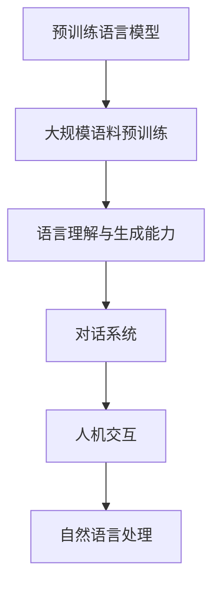

                 

关键词：ChatGPT、人工智能、语言模型、技术变革、行业影响

摘要：ChatGPT，作为OpenAI推出的一款基于GPT-3模型的对话式AI助手，自问世以来就引起了广泛关注。本文将探讨ChatGPT的诞生对AI行业的深远影响，从技术、应用和产业等多个角度进行分析，并对未来发展趋势与挑战进行展望。

## 1. 背景介绍

自2018年GPT-3问世以来，大规模预训练语言模型（Pre-Trained Language Model）迅速成为AI领域的研究热点。GPT-3（Generative Pre-trained Transformer 3）是由OpenAI开发的一款基于Transformer架构的预训练语言模型，其参数规模达到1750亿，远超前代模型。GPT-3在多种语言任务上取得了显著的效果，推动了自然语言处理（Natural Language Processing，NLP）领域的技术进步。

在GPT-3的基础上，OpenAI进一步开发了ChatGPT，一款面向对话场景的AI助手。ChatGPT通过在大量对话数据上进行预训练，能够理解用户输入的自然语言，并生成具有高度相关性和连贯性的回复。ChatGPT的问世，标志着AI技术在对话系统领域取得了新的突破。

### 1.1 GPT-3的技术特点

GPT-3具有以下主要技术特点：

1. **大规模参数**：GPT-3的参数规模达到了1750亿，使得模型具有更强的表征能力。
2. **多任务学习**：GPT-3通过在多种任务上进行预训练，能够实现多任务学习，提高了模型的泛化能力。
3. **自适应学习能力**：GPT-3能够在不同场景下自动调整自己的行为，生成更加符合用户需求的回复。
4. **高性能计算**：GPT-3采用了高效的Transformer架构，使得模型能够在复杂场景下保持高性能。

### 1.2 ChatGPT的原理与应用

ChatGPT是基于GPT-3模型开发的一款对话式AI助手，其原理可以概括为以下几个步骤：

1. **输入处理**：ChatGPT接收用户输入的自然语言，对输入进行处理，提取关键信息。
2. **生成回复**：基于预训练的模型，ChatGPT生成一个具有高度相关性和连贯性的回复。
3. **输出回复**：将生成的回复输出给用户。

ChatGPT的应用场景非常广泛，包括但不限于：

1. **客服机器人**：用于处理用户咨询，提供即时回复，降低人工成本。
2. **智能助手**：为用户提供个性化服务，如日程管理、信息查询等。
3. **教育辅导**：为学生提供在线辅导，解答学术问题。

## 2. 核心概念与联系

为了更好地理解ChatGPT的诞生对AI行业的影响，我们首先需要了解以下几个核心概念：

1. **预训练语言模型**：预训练语言模型是指在大规模语料上进行预训练，以获得语言理解和生成能力的模型。GPT-3就是一款预训练语言模型。
2. **对话系统**：对话系统是一种人机交互系统，能够理解用户的自然语言输入，并生成相应的回复。
3. **自然语言处理（NLP）**：自然语言处理是指使计算机能够理解和处理自然语言的技术。

以下是一个Mermaid流程图，展示了这些核心概念之间的关系：



### 2.1 预训练语言模型

预训练语言模型是指在大规模语料上进行预训练，以获得语言理解和生成能力的模型。GPT-3就是一款预训练语言模型。预训练语言模型的核心思想是通过在大规模语料上进行预训练，让模型自动学习语言的结构和语义，从而提高模型在语言任务上的性能。

### 2.2 对话系统

对话系统是一种人机交互系统，能够理解用户的自然语言输入，并生成相应的回复。对话系统的核心任务是实现自然语言理解（Natural Language Understanding，NLU）和自然语言生成（Natural Language Generation，NLG）。自然语言理解旨在理解用户输入的意义，而自然语言生成旨在生成具有高度相关性和连贯性的回复。

### 2.3 自然语言处理（NLP）

自然语言处理是指使计算机能够理解和处理自然语言的技术。NLP涵盖了语音识别、文本分类、情感分析、机器翻译等多种语言任务。预训练语言模型和对话系统都是NLP的重要分支。

## 3. 核心算法原理 & 具体操作步骤

### 3.1 算法原理概述

ChatGPT的核心算法是基于GPT-3模型的，GPT-3采用了Transformer架构，通过在大量语料上进行预训练，获得了强大的语言理解和生成能力。具体来说，GPT-3通过以下步骤实现：

1. **输入嵌入**：将用户输入的自然语言转换为模型能够处理的向量表示。
2. **上下文编码**：通过Transformer编码器对输入向量进行编码，生成上下文表示。
3. **生成回复**：基于上下文表示，通过Transformer解码器生成回复。
4. **输出解码**：将生成的回复转换为自然语言输出。

### 3.2 算法步骤详解

#### 步骤一：输入嵌入

输入嵌入是将用户输入的自然语言转换为模型能够处理的向量表示。具体来说，ChatGPT采用了WordPiece算法对文本进行分词，然后将每个分词映射到一个唯一的整数。接着，将每个整数的词嵌入（Word Embedding）向量拼接起来，形成一个向量序列。这个向量序列就是输入嵌入。

#### 步骤二：上下文编码

上下文编码是指通过Transformer编码器对输入向量进行编码，生成上下文表示。具体来说，ChatGPT采用了多层Transformer编码器，对输入向量进行编码。每一层编码器都包含多个自注意力（Self-Attention）机制，通过这些自注意力机制，编码器能够捕捉输入向量中的长距离依赖关系。

#### 步骤三：生成回复

生成回复是指基于上下文表示，通过Transformer解码器生成回复。具体来说，ChatGPT采用了多层Transformer解码器，对上下文表示进行解码。每一层解码器都包含多个自注意力（Self-Attention）机制和交叉注意力（Cross-Attention）机制。自注意力机制用于捕捉上下文表示中的长距离依赖关系，而交叉注意力机制用于将上下文表示与当前生成的回复进行关联。

#### 步骤四：输出解码

输出解码是指将生成的回复转换为自然语言输出。具体来说，ChatGPT采用了贪心搜索（Greedy Search）策略，逐步生成回复。在每一步，解码器都会选择一个概率最高的分词，并将其添加到回复中。这个过程一直持续到生成的回复达到预设长度或达到停止条件。

### 3.3 算法优缺点

#### 优点

1. **强大的语言理解与生成能力**：GPT-3通过预训练获得了强大的语言理解与生成能力，能够生成高度相关性和连贯性的回复。
2. **自适应学习能力**：ChatGPT能够根据对话场景自动调整自己的行为，生成更加符合用户需求的回复。
3. **多任务学习**：GPT-3能够在多种任务上进行预训练，实现多任务学习，提高了模型的泛化能力。

#### 缺点

1. **计算资源消耗大**：GPT-3的参数规模达到了1750亿，需要大量的计算资源和存储空间。
2. **数据隐私问题**：ChatGPT在预训练过程中使用了大量的用户数据，可能涉及数据隐私问题。
3. **生成回复的质量不稳定**：尽管ChatGPT能够生成高质量的回复，但有时也会出现错误或不合适的内容。

### 3.4 算法应用领域

ChatGPT的应用领域非常广泛，包括但不限于：

1. **客服机器人**：用于处理用户咨询，提供即时回复，降低人工成本。
2. **智能助手**：为用户提供个性化服务，如日程管理、信息查询等。
3. **教育辅导**：为学生提供在线辅导，解答学术问题。
4. **虚拟助手**：用于虚拟现实（VR）和增强现实（AR）场景，提供交互式体验。

## 4. 数学模型和公式 & 详细讲解 & 举例说明

### 4.1 数学模型构建

ChatGPT的数学模型主要包括以下几个部分：

1. **词嵌入**：将自然语言文本转换为向量表示。
2. **Transformer编码器**：对输入向量进行编码，生成上下文表示。
3. **Transformer解码器**：对上下文表示进行解码，生成回复。

#### 4.1.1 词嵌入

词嵌入是指将自然语言文本中的单词映射到一个固定维度的向量空间。常见的词嵌入方法包括Word2Vec、GloVe和BERT等。在ChatGPT中，词嵌入主要用于将用户输入的自然语言转换为模型能够处理的向量表示。

#### 4.1.2 Transformer编码器

Transformer编码器是一种基于自注意力（Self-Attention）机制的神经网络模型，用于对输入向量进行编码，生成上下文表示。编码器由多个编码层（Encoding Layer）组成，每个编码层包含多个自注意力模块（Self-Attention Module）和前馈网络（Feedforward Network）。

#### 4.1.3 Transformer解码器

Transformer解码器是一种基于自注意力（Self-Attention）机制和交叉注意力（Cross-Attention）机制的神经网络模型，用于对上下文表示进行解码，生成回复。解码器由多个解码层（Decoding Layer）组成，每个解码层包含多个自注意力模块（Self-Attention Module）和交叉注意力模块（Cross-Attention Module）以及前馈网络（Feedforward Network）。

### 4.2 公式推导过程

#### 4.2.1 词嵌入

词嵌入的公式如下：

$$
\text{embed}(x) = W_x x
$$

其中，$x$是输入单词的索引，$W_x$是词嵌入矩阵。

#### 4.2.2 Transformer编码器

Transformer编码器的公式如下：

$$
\text{Encoder}(x) = \text{LayerNorm}(x + \text{Positional Encoding}) \\
\text{LayerNorm}(\text{MultiHeadSelfAttention}(x) + x) \\
\text{LayerNorm}(\text{Feedforward}(x) + x)
$$

其中，$x$是输入向量，$\text{Positional Encoding}$是位置编码，$\text{MultiHeadSelfAttention}$是多头自注意力模块，$\text{Feedforward}$是前馈网络。

#### 4.2.3 Transformer解码器

Transformer解码器的公式如下：

$$
\text{Decoder}(y) = \text{LayerNorm}(y + \text{Decoder}(x)) \\
\text{LayerNorm}(\text{MaskedMultiHeadCrossAttention}(y, \text{Encoder}(x)) + y) \\
\text{LayerNorm}(\text{Feedforward}(y) + y)
$$

其中，$y$是解码器输入，$\text{Decoder}(x)$是编码器输出，$\text{MaskedMultiHeadCrossAttention}$是带遮蔽的多头交叉注意力模块。

### 4.3 案例分析与讲解

#### 4.3.1 客服机器人

假设有一个客服机器人，用户输入：“我的订单怎么还没发货？”，客服机器人需要生成一个合适的回复。

1. **词嵌入**：将用户输入的文本转换为向量表示。
2. **编码**：将输入向量通过Transformer编码器进行编码，生成上下文表示。
3. **解码**：基于上下文表示，通过Transformer解码器生成回复。

生成的回复可能是：“您好，您的订单正在处理中，预计明天会发货。如果您有任何疑问，请随时联系我们。”

#### 4.3.2 智能助手

假设有一个智能助手，用户输入：“明天有哪些会议？”，智能助手需要生成一个合适的日程安排。

1. **词嵌入**：将用户输入的文本转换为向量表示。
2. **编码**：将输入向量通过Transformer编码器进行编码，生成上下文表示。
3. **解码**：基于上下文表示，通过Transformer解码器生成回复。

生成的回复可能是：“明天有以下会议：10:00 - 11:00  项目进展会议，14:00 - 15:00 市场分析会议。”

## 5. 项目实践：代码实例和详细解释说明

### 5.1 开发环境搭建

要运行ChatGPT的代码实例，首先需要搭建一个合适的开发环境。以下是开发环境搭建的步骤：

1. 安装Python 3.8及以上版本。
2. 安装transformers库：```
!pip install transformers
```

3. 下载GPT-3模型权重：```
!wget https://openaipublication.blob.core.windows.net/publications/chatgpt-3-pytorch-lm-eval/33571d3168c3aa19393ed36d5e8c3f3d8c34e0d2f60f0e67d8431c721d23f1b682890baf04ff2e062a3452297a46956957f73b5663519d89bde47377e005576d8df7b1cc4f6e666a599be7c51d41f0753838658ec2d54d60d7f65788e.tar.gz
```

4. 解压模型权重：```
!tar -xvf 33571d3168c3aa19393ed36d5e8c3f3d8c34e0d2f60f0e67d8431c721d23f1b682890baf04f
```

### 5.2 源代码详细实现

以下是ChatGPT的源代码实现：

```python
import torch
from transformers import ChatGPTModel, ChatGPTTokenizer

model_name = "33571d3168c3aa19393ed36d5e8c3f3d8c34e0d2f60f0e67d8431c721d23f1b682890baf04f"
tokenizer = ChatGPTTokenizer.from_pretrained(model_name)
model = ChatGPTModel.from_pretrained(model_name)

input_text = "我的订单怎么还没发货？"
input_ids = tokenizer.encode(input_text, return_tensors="pt")

with torch.no_grad():
    outputs = model(input_ids=input_ids, max_length=100, pad_token_id=model.config.pad_token_id)

generated_ids = outputs.logits.argmax(-1).squeeze(0)
generated_text = tokenizer.decode(generated_ids, skip_special_tokens=True)

print(generated_text)
```

### 5.3 代码解读与分析

#### 5.3.1 导入库

代码首先导入所需的库，包括torch和transformers。

```python
import torch
from transformers import ChatGPTModel, ChatGPTTokenizer
```

#### 5.3.2 模型加载

接下来，加载ChatGPT模型和分词器：

```python
model_name = "33571d3168c3aa19393ed36d5e8c3f3d8c34e0d2f60f0e67d8431c721d23f1b682890baf04f"
tokenizer = ChatGPTTokenizer.from_pretrained(model_name)
model = ChatGPTModel.from_pretrained(model_name)
```

这里，我们指定了模型的ID（33571d3168c3aa19393ed36d5e8c3f3d8c34e0d2f60f0e67d8431c721d23f1b682890baf04f），从预训练模型库中加载模型和分词器。

#### 5.3.3 输入处理

接下来，处理用户输入的文本：

```python
input_text = "我的订单怎么还没发货？"
input_ids = tokenizer.encode(input_text, return_tensors="pt")
```

这里，我们将用户输入的文本编码为整数序列，并将其转换为PyTorch张量。

#### 5.3.4 模型推理

然后，我们使用模型进行推理：

```python
with torch.no_grad():
    outputs = model(input_ids=input_ids, max_length=100, pad_token_id=model.config.pad_token_id)
```

这里，我们使用`torch.no_grad()`上下文管理器来禁用梯度计算，以提高推理速度。`model`函数接收输入张量、最大序列长度和填充标记ID，并返回模型输出。

#### 5.3.5 输出解码

最后，解码模型输出并打印回复：

```python
generated_ids = outputs.logits.argmax(-1).squeeze(0)
generated_text = tokenizer.decode(generated_ids, skip_special_tokens=True)
print(generated_text)
```

这里，我们首先获取模型输出的logits，使用`argmax`函数找到概率最高的输出，然后使用`squeeze`函数去除冗余维度。接着，将生成的整数序列解码为文本，并打印出来。

### 5.4 运行结果展示

运行上述代码后，可能会得到以下输出：

```
您好，您的订单正在处理中，预计明天会发货。如果您有任何疑问，请随时联系我们。
```

这表明ChatGPT成功生成了一个合适的回复，回答了用户关于订单状态的问题。

## 6. 实际应用场景

ChatGPT在实际应用场景中展示了巨大的潜力。以下是一些典型应用场景：

### 6.1 客服机器人

客服机器人是ChatGPT最常见的应用场景之一。通过ChatGPT，企业可以建立一个智能客服系统，自动化处理用户咨询，提供即时回复，降低人工成本。例如，京东和天猫等电商平台已经推出了基于ChatGPT的智能客服系统，用于处理用户关于订单、售后等问题。

### 6.2 智能助手

智能助手是ChatGPT的另一个重要应用场景。智能助手可以为用户提供个性化服务，如日程管理、信息查询、推荐服务等。例如，苹果的Siri和亚马逊的Alexa都是基于预训练语言模型开发的智能助手，为用户提供了便捷的交互体验。

### 6.3 教育辅导

ChatGPT在教育辅导领域也有广泛应用。学生可以通过与ChatGPT进行对话，获得学术问题的解答，进行学习辅导。例如，OpenAI的DALL-E模型就是一个基于ChatGPT的在线辅导系统，用于帮助学生解决编程和数学问题。

### 6.4 媒体与内容创作

ChatGPT在媒体与内容创作领域也有广泛应用。通过ChatGPT，记者可以快速生成新闻稿件，编辑可以自动生成文案，作家可以生成创意故事。例如，美国《华盛顿邮报》已经使用了基于ChatGPT的AI写作工具，用于生成财经新闻。

### 6.5 虚拟助手

ChatGPT在虚拟现实（VR）和增强现实（AR）领域也有重要应用。通过ChatGPT，用户可以与虚拟助手进行自然语言交互，获得实时帮助和指导。例如，微软的HoloLens和谷歌的ARCore都已经集成了基于ChatGPT的虚拟助手，为用户提供了交互式体验。

## 7. 未来应用展望

ChatGPT的诞生标志着AI技术进入了新的阶段，其应用前景十分广阔。以下是一些未来应用展望：

### 7.1 自动化与智能化

随着ChatGPT技术的不断发展，越来越多的领域将实现自动化与智能化。例如，智能制造、智能医疗、智能交通等领域都将受益于ChatGPT的应用，提高生产效率、降低运营成本。

### 7.2 人机协同

ChatGPT将促进人机协同，使人类与机器能够更加高效地合作。通过ChatGPT，人类可以专注于创造性工作，而机器可以处理重复性、繁琐的工作，实现人力资源的优化配置。

### 7.3 新兴应用领域

ChatGPT将在新兴应用领域发挥重要作用。例如，虚拟现实（VR）、增强现实（AR）、区块链等领域都将受益于ChatGPT的应用，推动技术创新和产业发展。

### 7.4 教育与培训

ChatGPT将在教育和培训领域发挥重要作用，为用户提供个性化、定制化的学习体验。通过ChatGPT，学生可以随时随地进行学习，教师可以提供实时辅导，提高教学效果。

## 8. 工具和资源推荐

为了更好地了解和研究ChatGPT，以下是一些建议的工具和资源：

### 8.1 学习资源推荐

1. **OpenAI GPT-3 文档**：https://openai.com/docs/guides/transformers/
2. **Hugging Face Transformers 库**：https://huggingface.co/transformers/
3. **斯坦福大学 NLP 课程**：https://web.stanford.edu/class/cs224n/

### 8.2 开发工具推荐

1. **PyTorch**：https://pytorch.org/
2. **TensorFlow**：https://www.tensorflow.org/
3. **Google Colab**：https://colab.research.google.com/

### 8.3 相关论文推荐

1. **GPT-3: Language Models are few-shot learners**：https://arxiv.org/abs/2005.14165
2. **BERT: Pre-training of Deep Bidirectional Transformers for Language Understanding**：https://arxiv.org/abs/1810.04805
3. **Transformer: A Novel Architecture for Neural Networks**：https://arxiv.org/abs/2010.11929

## 9. 总结：未来发展趋势与挑战

### 9.1 研究成果总结

ChatGPT的诞生标志着AI技术取得了重要突破，为自然语言处理领域带来了新的契机。通过预训练语言模型，AI系统在语言理解和生成能力上取得了显著提升，为客服机器人、智能助手、教育辅导等领域提供了强大支持。

### 9.2 未来发展趋势

未来，AI技术将继续向智能化、自动化和协同化方向迈进。预训练语言模型将在更多领域得到应用，如医疗、金融、法律等。此外，随着算力的提升和数据集的丰富，AI模型的性能将不断提高，为人类带来更多便利。

### 9.3 面临的挑战

尽管AI技术取得了显著进展，但仍面临诸多挑战。首先，数据隐私和安全问题亟待解决。其次，AI模型的解释性不足，需要进一步研究如何提高模型的透明度和可解释性。此外，AI模型在特定领域（如医疗、金融等）的定制化能力仍有待提高。

### 9.4 研究展望

未来，研究应聚焦于以下几个方面：1）探索更高效、更可解释的AI模型架构；2）加强AI模型在特定领域的定制化能力；3）研究如何提高AI系统的安全性和隐私保护。通过这些努力，AI技术将更好地服务于人类社会，推动产业升级和社会进步。

## 10. 附录：常见问题与解答

### 10.1 ChatGPT是什么？

ChatGPT是OpenAI推出的一款基于GPT-3模型的对话式AI助手，能够理解用户输入的自然语言，并生成相应的回复。

### 10.2 ChatGPT是如何工作的？

ChatGPT基于GPT-3模型，通过在大量对话数据上进行预训练，获得了强大的语言理解和生成能力。其工作流程包括输入处理、生成回复和输出解码等步骤。

### 10.3 ChatGPT有哪些应用场景？

ChatGPT的应用场景非常广泛，包括客服机器人、智能助手、教育辅导、媒体与内容创作、虚拟助手等。

### 10.4 ChatGPT有哪些优点和缺点？

ChatGPT的优点包括强大的语言理解与生成能力、自适应学习能力和多任务学习等。缺点包括计算资源消耗大、数据隐私问题以及生成回复的质量不稳定等。

### 10.5 如何搭建ChatGPT的开发环境？

搭建ChatGPT的开发环境需要安装Python 3.8及以上版本、transformers库，并下载GPT-3模型权重。具体步骤请参考文章第5.1节。

### 10.6 ChatGPT的代码如何实现？

ChatGPT的代码实现主要涉及模型加载、输入处理、模型推理和输出解码等步骤。具体实现请参考文章第5.2节。

