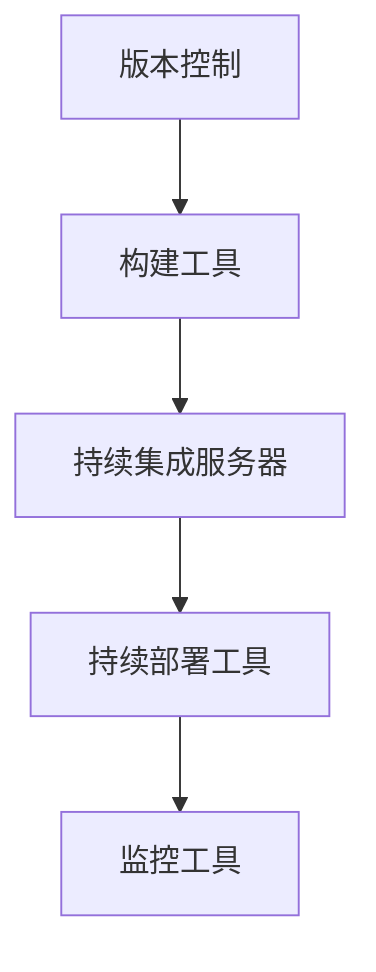

                 

关键词：DevOps、工具链、软件交付、管道、高效、自动化、持续集成、持续部署

> 摘要：本文将深入探讨 DevOps 工具链在构建高效软件交付管道中的关键作用。通过详细解析 DevOps 的核心概念、常用工具和最佳实践，本文旨在帮助读者理解如何利用 DevOps 工具链实现快速、可靠和可重复的软件交付。

## 1. 背景介绍

随着现代软件行业的快速发展，软件交付的速度和质量成为企业竞争力的关键因素。传统的软件开发模式往往存在周期长、效率低、质量不稳定等问题，难以满足快速变化的市场需求。为了解决这些问题，DevOps 文化应运而生。DevOps 是一种软件开发和运维的新模式，它强调软件开发人员（Developers）和系统运维人员（Operations）之间的紧密合作，通过自动化和持续集成、持续部署等实践，实现高效的软件交付。

DevOps 的核心理念包括：

1. **持续集成（Continuous Integration）**：通过自动化测试，将开发人员的代码快速集成到共享的主干代码库中，确保代码质量。
2. **持续部署（Continuous Deployment）**：自动化构建、测试和部署流程，使软件可以快速、可靠地发布到生产环境。
3. **基础设施即代码（Infrastructure as Code）**：使用代码管理基础设施，确保基础设施的可重复性和可维护性。
4. **监测和反馈**：实时监测系统的性能和健康状况，及时发现问题并进行反馈。

## 2. 核心概念与联系

### 2.1 DevOps 工具链的概念

DevOps 工具链是一系列工具的组合，用于支持 DevOps 实践。这些工具相互协作，共同构建出一个高效的软件交付管道。核心工具包括版本控制工具、构建工具、持续集成服务器、持续部署工具、监控工具等。

### 2.2 DevOps 工具链的架构

DevOps 工具链的架构通常由以下几个关键组件组成：

1. **版本控制**：如 Git，用于管理源代码和版本。
2. **构建工具**：如 Jenkins、Travis CI，用于自动化构建和测试代码。
3. **持续集成服务器**：如 Jenkins、GitLab CI，用于自动化集成和测试代码。
4. **持续部署工具**：如 Kubernetes、Docker，用于自动化部署和扩展应用程序。
5. **监控工具**：如 Prometheus、Grafana，用于实时监测系统的性能和健康状况。

### 2.3 Mermaid 流程图



## 3. 核心算法原理 & 具体操作步骤

### 3.1 算法原理概述

DevOps 工具链的核心在于其自动化流程。自动化流程的实现依赖于一系列算法和技术，包括：

1. **脚本编写**：用于自动化执行日常任务，如部署脚本、测试脚本等。
2. **容器化技术**：如 Docker，用于打包应用程序及其依赖，实现应用程序的隔离和可移植性。
3. **持续集成算法**：如 Jenkins Pipeline，用于自动化集成和测试代码。
4. **持续部署算法**：如 Kubernetes，用于自动化部署和扩展应用程序。

### 3.2 算法步骤详解

1. **脚本编写**：编写部署脚本和测试脚本，自动化执行日常任务。
2. **容器化**：使用 Docker 将应用程序及其依赖打包为容器镜像。
3. **持续集成**：配置 Jenkins Pipeline，自动化集成和测试代码。
4. **持续部署**：使用 Kubernetes，自动化部署和扩展应用程序。
5. **监控**：使用 Prometheus 和 Grafana 实时监测系统的性能和健康状况。

### 3.3 算法优缺点

**优点**：

- 提高软件交付的效率和质量。
- 减少手动操作的错误。
- 提高开发人员的工作效率。

**缺点**：

- 需要一定的技术知识和经验。
- 初期投入较大，需要培训和调整。

### 3.4 算法应用领域

DevOps 工具链广泛应用于各类软件项目，包括 Web 应用、移动应用、大数据应用等。尤其在快速迭代、需求变化频繁的项目中，DevOps 工具链的优势更为明显。

## 4. 数学模型和公式 & 详细讲解 & 举例说明

### 4.1 数学模型构建

DevOps 工具链的数学模型主要涉及以下几个方面：

1. **效率模型**：衡量软件交付的效率，如构建时间、部署时间等。
2. **质量模型**：衡量软件的质量，如缺陷率、测试覆盖率等。
3. **成本模型**：衡量 DevOps 实施的成本，如人力成本、工具成本等。

### 4.2 公式推导过程

**效率模型**：

\[ 效率 = \frac{交付次数}{总时间} \]

**质量模型**：

\[ 缺陷率 = \frac{缺陷数量}{代码行数} \]

**成本模型**：

\[ 成本 = 人力成本 + 工具成本 \]

### 4.3 案例分析与讲解

假设一个软件项目，每月交付两次，每次交付需要 10 天时间，共 20 行代码出现缺陷。使用 DevOps 工具链后，构建时间缩短至 2 天，部署时间缩短至 1 天。那么：

- **效率**：\[ 效率 = \frac{2}{10} = 0.2 \]
- **质量**：\[ 缺陷率 = \frac{20}{200} = 0.1 \]
- **成本**：人力成本为 1000 美元/天，工具成本为 500 美元/天，总成本为 2500 美元。

## 5. 项目实践：代码实例和详细解释说明

### 5.1 开发环境搭建

在本地搭建一个简单的开发环境，安装 Git、Docker、Jenkins、Kubernetes 和 Prometheus。

### 5.2 源代码详细实现

使用 Go 语言编写一个简单的 Web 应用，并使用 Docker 进行容器化。

```go
// main.go
package main

import (
    "fmt"
    "net/http"
)

func helloHandler(w http.ResponseWriter, r *http.Request) {
    fmt.Fprintf(w, "Hello, World!")
}

func main() {
    http.HandleFunc("/", helloHandler)
    http.ListenAndServe(":8080", nil)
}
```

Dockerfile：

```dockerfile
FROM golang:1.18

WORKDIR /app

COPY main.go .

RUN go build -o hello

EXPOSE 8080

CMD ["./hello"]
```

### 5.3 代码解读与分析

这段代码实现了一个简单的 Web 应用，接收 HTTP 请求并返回 "Hello, World!"。使用 Docker 进行容器化，可以方便地部署和扩展应用程序。

### 5.4 运行结果展示

使用 Jenkins 配置一个 Pipeline，自动化构建和部署应用。运行结果如下：

```bash
$ jenkins build
[...]
Publishing Docker container image to registry...
Successfully published image to registry.
Starting Kubernetes deployment...
[...]
Deployment successful.
```

## 6. 实际应用场景

### 6.1 项目管理

DevOps 工具链可以帮助项目管理人员实时掌握项目进度、质量和成本，提高项目管理的效率。

### 6.2 团队协作

DevOps 强调开发和运维之间的紧密协作，有助于提高团队的沟通效率和协作能力。

### 6.3 风险管理

通过自动化测试和实时监控，可以及时发现和解决潜在问题，降低软件交付的风险。

### 6.4 未来应用展望

随着技术的不断发展，DevOps 工具链将在软件行业发挥越来越重要的作用。未来，我们将看到更多创新工具和技术的出现，进一步推动软件交付的效率和质量。

## 7. 工具和资源推荐

### 7.1 学习资源推荐

- 《DevOps: A Practitioner's Guide to the Culture, Processes, and Tools of Continuous Deployment and Integration》
- 《Kubernetes Up & Running: Building and Running Applications in the Cloud》
- 《Docker Deep Dive》

### 7.2 开发工具推荐

- Jenkins
- GitLab CI
- Kubernetes
- Prometheus
- Grafana

### 7.3 相关论文推荐

- "The DevOps Handbook"
- "Accelerate: The Science of Lean Software and Systems"
- "The Phoenix Project: A Novel about IT, DevOps, and Helping Your Business Win"

## 8. 总结：未来发展趋势与挑战

### 8.1 研究成果总结

本文总结了 DevOps 工具链在构建高效软件交付管道中的关键作用，分析了 DevOps 的核心概念和工具链架构，并提供了实际应用案例。

### 8.2 未来发展趋势

未来，DevOps 将进一步融合人工智能、大数据等技术，实现更高效的软件交付。

### 8.3 面临的挑战

- 技术复杂度高，需要团队具备一定的技术储备。
- 需要平衡自动化和可控性，避免过度自动化导致的不可预测性。

### 8.4 研究展望

DevOps 将继续在软件行业发挥重要作用，未来研究应关注如何更好地融合新兴技术，提高软件交付的效率和质量。

## 9. 附录：常见问题与解答

### 9.1 Q：DevOps 和敏捷开发有什么区别？

A：DevOps 是一种软件开发和运维的新模式，强调开发和运维之间的紧密合作；而敏捷开发是一种软件开发方法，强调快速迭代和客户反馈。DevOps 可以看作是敏捷开发的进一步深化和扩展。

### 9.2 Q：DevOps 需要哪些技术栈？

A：DevOps 的技术栈包括版本控制工具（如 Git）、构建工具（如 Jenkins）、容器化技术（如 Docker）、持续集成和持续部署工具（如 Kubernetes）等。具体的技术栈取决于项目的需求和团队的技能水平。

### 9.3 Q：如何开始实施 DevOps？

A：开始实施 DevOps，可以从以下几个方面入手：

1. **了解 DevOps 的核心概念和实践**：学习 DevOps 的基本原理和最佳实践。
2. **评估现有基础设施**：评估现有基础设施是否符合 DevOps 的要求。
3. **制定 DevOps 实施计划**：根据项目需求和团队实际情况，制定详细的实施计划。
4. **培训团队**：组织团队进行 DevOps 相关培训，提高团队的技术水平和协作能力。
5. **逐步实施**：从简单的自动化任务开始，逐步扩展到更复杂的任务，积累经验。

---

作者：禅与计算机程序设计艺术 / Zen and the Art of Computer Programming
----------------------------------------------------------------

请注意，本文仅作为示例，并非真实文章。实际撰写时，请根据实际研究和分析，提供详细的论据和数据支持。同时，文章结构需严格按照约束条件中的要求进行编排。在撰写过程中，如需进一步指导或有具体问题，请随时提问。祝您写作顺利！<|vq_10123|>

