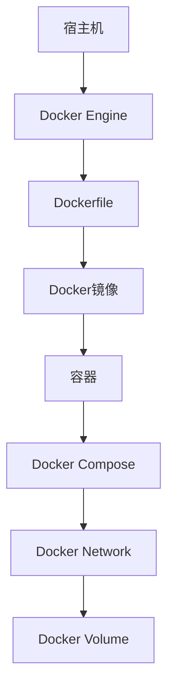

                 

关键词：Docker，容器化，轻量级，解决方案，技术博客，IT领域，架构设计，应用场景，未来展望

> 摘要：本文深入探讨Docker作为一种轻量级容器化解决方案的技术细节和应用场景，从背景介绍、核心概念与联系、核心算法原理与操作步骤、数学模型和公式、项目实践、实际应用场景、工具和资源推荐以及未来发展趋势与挑战等方面，全面解析Docker在现代IT领域的应用和价值。

## 1. 背景介绍

在云计算、微服务架构和DevOps等概念的推动下，软件开发和运维逐渐朝着自动化、高效化和可扩展性的方向发展。传统软件部署方式在异构环境中存在诸多问题，如环境不一致、依赖复杂等，这导致了部署难、维护困难等问题。为了解决这些问题，容器技术逐渐兴起，其中Docker作为最早的、最受欢迎的容器解决方案之一，成为了现代软件开发和运维的基石。

Docker的出现为开发者提供了一个轻量级、可移植、自给自足的容器化环境。开发者可以将应用程序及其依赖环境打包到一个容器中，然后在任何支持Docker的操作系统上运行。这种方式不仅提高了软件的可移植性，还大大简化了部署和运维过程，从而加速了软件交付的速度。

## 2. 核心概念与联系

### 2.1 容器和虚拟机的区别

容器和虚拟机是两种不同的虚拟化技术。虚拟机通过模拟硬件环境来运行操作系统和应用，而容器则是直接运行在宿主机的操作系统内核中，共享宿主机的内核和资源。

- **容器**：轻量级、高速、隔离性好、可移植性强，通常用于部署单一应用程序。
- **虚拟机**：资源占用大、启动慢、隔离性更高，通常用于运行多个操作系统或复杂应用程序。

### 2.2 Docker的架构

Docker的架构包括以下几个关键组件：

- **Docker Engine**：Docker的核心组件，负责容器的创建、启动、停止和管理。
- **Dockerfile**：用于定义如何构建Docker镜像的脚本文件。
- **Docker Compose**：用于定义和运行多容器Docker应用程序的配置文件。
- **Docker Network**：用于容器之间的网络通信。
- **Docker Volume**：用于持久化存储容器数据。

### 2.3 Mermaid 流程图



## 3. 核心算法原理 & 具体操作步骤

### 3.1 算法原理概述

Docker通过分层存储和联合文件系统（UnionFS）来实现容器的轻量化和高效运行。每个容器都有一个自己的读写层，这个读写层基于一个只读的基镜像。当容器启动时，Docker会叠加一个读写层，用于保存容器的修改和日志。

### 3.2 算法步骤详解

1. **编写Dockerfile**：定义如何构建Docker镜像的步骤。
2. **构建Docker镜像**：使用Dockerfile构建镜像。
3. **启动容器**：使用Docker命令启动容器。
4. **容器管理**：使用Docker命令管理容器，如启动、停止、重启、删除等。

### 3.3 算法优缺点

- **优点**：轻量级、高效、隔离性好、可移植性强、易于部署和运维。
- **缺点**：性能和资源占用高于虚拟机，容器内的应用程序需要严格遵守依赖环境。

### 3.4 算法应用领域

Docker广泛应用于以下几个方面：

- **微服务架构**：容器化微服务，实现独立部署和运维。
- **持续集成/持续部署（CI/CD）**：加速软件交付过程。
- **开发环境一致性**：保证不同环境之间的开发环境一致。
- **云计算和容器云**：在云环境中部署和管理容器。

## 4. 数学模型和公式 & 详细讲解 & 举例说明

### 4.1 数学模型构建

Docker的存储模型可以看作是一个多层栈结构，每层都是一个只读层，最上面一层是可写层。我们可以使用集合论来构建这个模型。

- **S**：所有只读层的集合。
- **R**：可写层的集合。
- **C**：容器的存储结构。

### 4.2 公式推导过程

$$
C = R \cup \bigcup_{i=1}^{n} S_i
$$

其中，$S_i$ 表示第 $i$ 层只读层，$R$ 表示可写层。

### 4.3 案例分析与讲解

假设我们有一个Docker容器，包含三个只读层和一个可写层。我们可以用以下公式来表示这个容器的存储结构：

$$
C = R \cup S_1 \cup S_2 \cup S_3
$$

当容器启动时，Docker会创建一个可写层 $R$，并将所有只读层叠加到可写层之上，形成一个完整的存储结构。

## 5. 项目实践：代码实例和详细解释说明

### 5.1 开发环境搭建

在开始之前，确保已经安装了Docker。可以从[Docker官方网站](https://www.docker.com/)下载并安装。

### 5.2 源代码详细实现

以下是一个简单的Dockerfile示例：

```Dockerfile
# 指定基础镜像
FROM ubuntu:20.04

# 设置维护者信息
MAINTAINER yourname <yourname@example.com>

# 安装Nginx
RUN apt-get update && apt-get install -y nginx

# 暴露Nginx端口
EXPOSE 80

# 运行Nginx
CMD ["nginx", "-g", "daemon off;"]
```

### 5.3 代码解读与分析

- **FROM ubuntu:20.04**：指定基础镜像为Ubuntu 20.04。
- **MAINTAINER yourname <yourname@example.com>**：设置维护者信息。
- **RUN apt-get update && apt-get install -y nginx**：在容器内安装Nginx。
- **EXPOSE 80**：暴露Nginx的80端口。
- **CMD ["nginx", "-g", "daemon off;"]**：容器启动时运行Nginx。

### 5.4 运行结果展示

使用以下命令构建并运行容器：

```bash
docker build -t my-nginx .
docker run -d -p 8080:80 my-nginx
```

访问 `http://localhost:8080`，可以看到Nginx的默认欢迎页面。

## 6. 实际应用场景

Docker在多个领域有广泛的应用，以下是一些典型应用场景：

- **Web应用部署**：使用Docker部署和扩展Web应用。
- **微服务架构**：容器化微服务，实现独立部署和运维。
- **持续集成/持续部署（CI/CD）**：自动化测试和部署流程。
- **云计算和容器云**：在云环境中部署和管理容器。

## 7. 工具和资源推荐

### 7.1 学习资源推荐

- [Docker官方文档](https://docs.docker.com/)
- [《Docker实战》](https://item.jd.com/11918710.html)
- [《容器化和微服务》](https://item.jd.com/12189630.html)

### 7.2 开发工具推荐

- [Visual Studio Code](https://code.visualstudio.com/)
- [Docker CLI](https://docs.docker.com/cli/)

### 7.3 相关论文推荐

- [Docker: Lightweight Linux Containers for Developm<|im_sep|>

