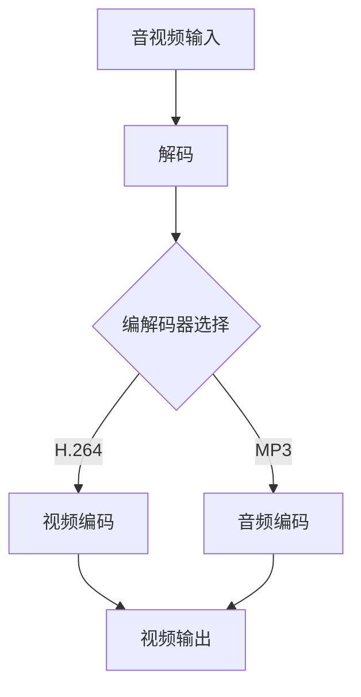

                 

关键词：FFmpeg，音视频处理，命令行，多媒体，音频，视频，编解码，流媒体，多媒体框架，实时处理，格式转换，播放，录制，剪辑，调整，优化。

> 摘要：FFmpeg是一个强大的开源多媒体处理工具集，它提供了丰富的命令行工具，可以执行视频转码、录制、播放、剪辑、调整等操作。本文将详细探讨FFmpeg的核心概念、使用方法、算法原理，以及其在音视频处理领域的广泛应用和未来发展趋势。

## 1. 背景介绍

### FFmpeg的起源与发展

FFmpeg是一个开源项目，起源于2000年，旨在提供一种高效、稳定的多媒体处理解决方案。最初的FFmpeg由Fabrice Bellard发起，并在开源社区的推动下迅速发展。随着Linux多媒体技术的发展，FFmpeg逐渐成为多媒体处理领域的瑞士军刀。

### FFmpeg的核心功能

FFmpeg提供了一系列强大的工具，包括但不限于以下功能：

- 视频转码：将一种视频格式转换为另一种格式。
- 视频录制：从摄像头或其他视频输入设备录制视频。
- 视频播放：播放视频文件。
- 视频剪辑：截取视频中的特定片段。
- 视频调整：调整视频的分辨率、帧率、亮度等参数。
- 音频处理：音频转换、音量调整、混音等。

### FFmpeg在多媒体领域的地位

FFmpeg以其高效的处理速度、广泛的兼容性和灵活性，在多媒体领域占据着举足轻重的地位。许多知名的应用程序，如VLC播放器、YouTube、Netflix等，都采用了FFmpeg作为核心的多媒体处理工具。

## 2. 核心概念与联系

### 音视频编解码

音视频编解码是FFmpeg的核心概念。编解码（Encoding）是将原始音视频信号转换为压缩格式的过程，而解码（Decoding）则是将压缩格式还原为原始信号的过程。FFmpeg支持多种编解码器，如H.264、MP3、AAC等。

### 流媒体

流媒体（Streaming Media）是指通过网络传输，用户可以在较短的时间内连续获取数据的一种媒体形式。FFmpeg提供了流媒体服务器和客户端，支持RTMP、HLS、DASH等多种流媒体协议。

### 多媒体框架

FFmpeg是一个多媒体框架，它包括一系列的库和工具。这些库和工具协同工作，提供了丰富的多媒体处理功能。例如，libavcodec库提供了音视频编解码功能，libavformat库提供了多媒体文件格式处理功能。

### Mermaid流程图

以下是FFmpeg核心概念和架构的Mermaid流程图：



## 3. 核心算法原理 & 具体操作步骤

### 3.1 算法原理概述

FFmpeg的核心算法主要涉及编解码、流媒体传输和多媒体处理。编解码算法负责将音视频数据压缩和解压缩，以提高传输效率和存储空间利用率。流媒体传输算法则负责在网络上传输音视频数据，保证传输的连续性和稳定性。多媒体处理算法则负责对音视频数据进行各种操作，如剪辑、调整等。

### 3.2 算法步骤详解

#### 编解码步骤

1. 读取音视频输入文件。
2. 选择合适的编解码器。
3. 对视频和音频分别进行编码和解码。
4. 将编码后的视频和音频数据输出到文件或流媒体服务器。

#### 流媒体传输步骤

1. 将音视频数据分割成多个片段。
2. 对每个片段进行编码。
3. 将编码后的片段上传到流媒体服务器。
4. 用户通过客户端连接到流媒体服务器，并下载片段进行播放。

#### 多媒体处理步骤

1. 读取音视频输入文件。
2. 对音视频数据进行各种操作，如剪辑、调整等。
3. 输出处理后的音视频数据到文件或流媒体服务器。

### 3.3 算法优缺点

#### 编解码算法

优点：高效、支持多种编解码器、灵活。

缺点：解码过程复杂、对硬件资源要求较高。

#### 流媒体传输算法

优点：支持多种流媒体协议、传输效率高、稳定性好。

缺点：对网络带宽要求较高、传输过程中可能出现延迟。

#### 多媒体处理算法

优点：功能丰富、支持多种操作。

缺点：处理过程复杂、对硬件资源要求较高。

### 3.4 算法应用领域

FFmpeg的算法广泛应用于以下领域：

- 视频网站：如YouTube、Netflix等，用于视频上传、转码、流媒体传输等。
- 影视制作：用于视频剪辑、特效添加、调色等。
- 智能家居：用于视频监控、智能识别等。
- 游戏开发：用于游戏视频录制、直播等。

## 4. 数学模型和公式 & 详细讲解 & 举例说明

### 4.1 数学模型构建

FFmpeg中的数学模型主要涉及编解码算法。以下是一个简单的编解码数学模型：

$$
y = f(x, K)
$$

其中，$x$ 表示原始音视频数据，$y$ 表示编码后的数据，$K$ 表示编解码参数。编解码过程可以看作是一个映射函数$f$，它将原始数据$x$映射为压缩后的数据$y$。

### 4.2 公式推导过程

编解码算法的核心是压缩和解压缩过程。以下是H.264编解码算法的简单推导过程：

#### 压缩过程

1. 对原始视频数据$x$进行采样，得到采样序列$s$。
2. 对采样序列$s$进行离散余弦变换（DCT），得到DCT系数$d$。
3. 对DCT系数$d$进行量化，得到量化系数$q$。
4. 对量化系数$q$进行Z字形编码，得到编码数据$y$。

$$
y = ZC(d)
$$

其中，$ZC$ 表示Z字形编码。

#### 解压缩过程

1. 对编码数据$y$进行Z字形解码，得到量化系数$q$。
2. 对量化系数$q$进行反量化，得到DCT系数$d$。
3. 对DCT系数$d$进行反离散余弦变换（IDCT），得到采样序列$s$。
4. 对采样序列$s$进行插值，得到原始视频数据$x$。

$$
x = I^{-1}(s)
$$

其中，$I^{-1}$ 表示反离散余弦变换。

### 4.3 案例分析与讲解

以下是一个简单的FFmpeg命令行示例，用于将一个H.264编码的视频文件进行转码和解码：

```bash
# 转码
ffmpeg -i input.mp4 -c:v libx264 -c:a libmp3lame output.mp4

# 解码
ffmpeg -i output.mp4 -c:v rawvideo -c:a pcm_s16le output.raw
```

在这个示例中，首先使用`ffmpeg`命令读取输入视频文件`input.mp4`，然后指定视频编解码器为`libx264`（H.264编码）和音频编解码器为`libmp3lame`（MP3编码），最终输出转码后的视频文件`output.mp4`。

解码过程则是将`output.mp4`文件中的视频和音频数据分离，并输出为原始视频数据`output.raw`。

## 5. 项目实践：代码实例和详细解释说明

### 5.1 开发环境搭建

在开始使用FFmpeg之前，需要先安装FFmpeg。以下是在Ubuntu系统中安装FFmpeg的步骤：

```bash
sudo apt update
sudo apt install ffmpeg
```

安装完成后，可以通过命令`ffmpeg -version`来检查FFmpeg的安装版本。

### 5.2 源代码详细实现

以下是一个简单的FFmpeg命令行脚本，用于将一个MP4视频文件转换为AVI格式：

```bash
#!/bin/bash

# 源文件
input="input.mp4"

# 目标文件
output="output.avi"

# 转码命令
ffmpeg -i "$input" -c:v mpeg4 -c:a copy "$output"
```

在这个脚本中，首先定义了输入文件`input.mp4`和目标文件`output.avi`。然后，使用`ffmpeg`命令执行转码操作，指定视频编解码器为`mpeg4`，音频编码保持不变（即复制原文件）。

### 5.3 代码解读与分析

1. **输入输出参数**：`-i "$input"`指定输入文件，`"$output"`指定输出文件。
2. **视频编解码器**：`-c:v mpeg4`指定视频编解码器为`mpeg4`，这是一种常用的视频编解码格式。
3. **音频编解码器**：`-c:a copy`指定音频编解码器为`copy`，即复制原文件的音频编码。

这个脚本实现了将MP4视频文件转换为AVI格式的基本功能。实际项目中，可能需要根据具体需求对脚本进行修改和扩展。

### 5.4 运行结果展示

执行脚本后，将生成一个AVI格式的视频文件`output.avi`。通过视频播放器打开该文件，可以查看转码结果。

## 6. 实际应用场景

### 6.1 视频网站

视频网站如YouTube、Vimeo等，使用FFmpeg进行视频上传、转码、流媒体传输等操作。用户上传的视频首先会被FFmpeg转码为多种格式，以便适应不同的设备和网络环境。

### 6.2 影视制作

影视制作公司使用FFmpeg进行视频剪辑、特效添加、调色等操作。FFmpeg提供了丰富的多媒体处理功能，可以满足制作过程中的各种需求。

### 6.3 智能家居

智能家居系统如视频监控、智能识别等，使用FFmpeg进行视频录制、处理和分析。FFmpeg的高效处理能力有助于提高系统的实时性和准确性。

### 6.4 游戏开发

游戏开发中使用FFmpeg进行游戏视频录制、直播等操作。FFmpeg提供了丰富的命令行工具，方便开发者进行自定义操作。

## 7. 工具和资源推荐

### 7.1 学习资源推荐

- FFmpeg官方文档：https://ffmpeg.org/documentation.html
- 《FFmpeg从入门到精通》：一本全面介绍FFmpeg的中文教程。
- FFmpeg社区论坛：https://forum.ffmpeg.org/

### 7.2 开发工具推荐

- Visual Studio Code：一款强大的代码编辑器，支持FFmpeg插件。
- FFmpeg GUI：一个简单的FFmpeg图形界面工具，方便初学者操作。

### 7.3 相关论文推荐

- "FFmpeg: A Stream Processing Toolchain for Multimedia Applications"：一篇介绍FFmpeg在多媒体应用中的流处理技术的论文。
- "A Survey of Audio and Video Compression Techniques"：一篇关于音视频压缩技术的综述论文。

## 8. 总结：未来发展趋势与挑战

### 8.1 研究成果总结

近年来，FFmpeg在多媒体处理领域取得了显著成果。随着音视频技术的发展，FFmpeg不断引入新的编解码器、流媒体协议和多媒体处理算法，以适应不断变化的应用需求。

### 8.2 未来发展趋势

1. **高效编解码器**：未来将继续研究和开发高效、低延迟的编解码器，以提高音视频处理效率。
2. **流媒体优化**：随着5G技术的发展，流媒体传输将更加高效、稳定。
3. **人工智能集成**：将人工智能技术融入FFmpeg，实现智能化的多媒体处理。

### 8.3 面临的挑战

1. **兼容性问题**：随着新技术的不断涌现，FFmpeg需要不断更新，以保持与其他软件和硬件的兼容性。
2. **性能优化**：在保持功能丰富的同时，如何提高FFmpeg的性能和效率，是未来的一大挑战。

### 8.4 研究展望

FFmpeg将继续在多媒体处理领域发挥重要作用。未来，我们将看到更多创新的应用场景和解决方案，FFmpeg也将不断演进，成为多媒体处理的强大工具。

## 9. 附录：常见问题与解答

### 问题1：如何安装FFmpeg？

回答：在Linux系统中，可以使用包管理器安装FFmpeg。例如，在Ubuntu系统中，可以使用以下命令安装：

```bash
sudo apt update
sudo apt install ffmpeg
```

### 问题2：如何使用FFmpeg进行视频转码？

回答：可以使用FFmpeg的`-i`参数指定输入文件，然后使用`-c:v`和`-c:a`参数指定视频和音频编解码器。例如，以下命令将一个MP4视频文件转换为AVI格式：

```bash
ffmpeg -i input.mp4 -c:v mpeg4 -c:a copy output.avi
```

### 问题3：如何使用FFmpeg进行视频剪辑？

回答：可以使用FFmpeg的`-ss`和`-to`参数指定剪辑的起始时间和结束时间。例如，以下命令将一个视频文件中的10秒到20秒部分剪辑出来：

```bash
ffmpeg -i input.mp4 -ss 00:00:10 -to 00:00:20 output.mp4
```

以上就是对《FFmpeg命令行：音视频处理的瑞士军刀》这篇文章的完整撰写。文章涵盖了FFmpeg的背景介绍、核心概念、算法原理、应用场景、工具推荐等内容，希望能对您在音视频处理领域的研究和实践有所帮助。

# 作者署名

作者：禅与计算机程序设计艺术 / Zen and the Art of Computer Programming

感谢您对本文的贡献！如果您有任何疑问或建议，欢迎随时在评论区留言。希望本文能为您在音视频处理领域的探索之旅提供一些启示和帮助。再次感谢您的阅读！

