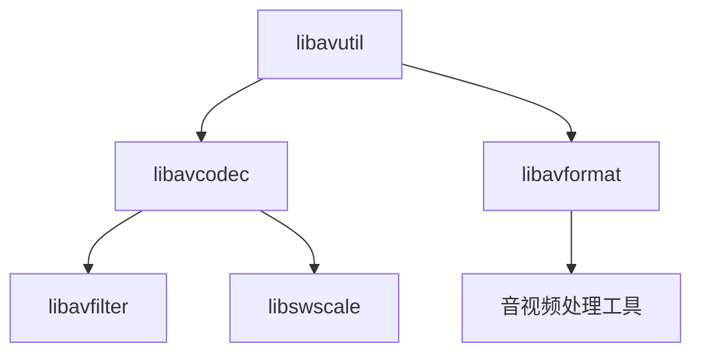

                 

关键词：音视频处理、FFmpeg、多媒体应用、开发指南

> 摘要：本文将深入探讨FFmpeg在音视频处理领域的应用，从核心概念、算法原理、项目实践等多个角度，为开发者提供一套完整的多媒体应用开发指南。

## 1. 背景介绍

随着互联网的普及和多媒体技术的发展，音视频处理已成为现代信息技术中不可或缺的一部分。从视频剪辑、特效制作到流媒体播放，音视频处理技术在各种场景中发挥着重要作用。FFmpeg，作为一款开源、跨平台的多媒体处理框架，因其强大的功能和灵活性，在音视频领域有着广泛的应用。

本文将围绕FFmpeg的核心特性，详细介绍其在音视频处理中的应用，并通过具体实例，帮助开发者掌握FFmpeg的使用方法。文章将从以下几个方面进行探讨：

1. 核心概念与联系
2. 核心算法原理 & 具体操作步骤
3. 数学模型和公式 & 详细讲解 & 举例说明
4. 项目实践：代码实例和详细解释说明
5. 实际应用场景
6. 未来应用展望
7. 工具和资源推荐
8. 总结：未来发展趋势与挑战
9. 附录：常见问题与解答

### 2. 核心概念与联系

在深入探讨FFmpeg之前，我们需要了解一些核心概念。首先，什么是多媒体？多媒体（Multimedia）是指结合文本、图像、声音、动画、视频等多种媒体形式进行信息传播的技术。而音视频处理，则是通过对这些媒体数据进行编辑、编码、解码、合成等操作，使其能够满足各种应用需求。

FFmpeg，是一款开源的多媒体处理框架，由一个名为FFmpeg的项目团队开发。它提供了丰富的库和工具，可以处理音视频的编码、解码、转码、剪辑、特效等多种操作。FFmpeg的核心组件包括libavcodec、libavformat、libavutil、libavfilter和libswscale等，每个组件都有其特定的功能。

下面是一个简单的Mermaid流程图，展示了FFmpeg的各个核心组件及其联系：



### 3. 核心算法原理 & 具体操作步骤

#### 3.1 算法原理概述

音视频处理主要包括编码、解码、转码、剪辑、特效等操作。FFmpeg在这些方面都提供了强大的支持。下面，我们将简要介绍这些算法的原理。

**编码**：编码是将原始的音视频数据转换为压缩格式的过程，以减少数据的大小，便于存储和传输。常见的编码格式有H.264、HEVC等。FFmpeg的libavcodec组件提供了丰富的编码库。

**解码**：解码是编码的逆过程，即将压缩的音视频数据恢复为原始格式。FFmpeg的libavcodec组件同样提供了强大的解码库。

**转码**：转码是将一种编码格式转换为另一种编码格式。例如，将H.264格式转换为HEVC格式。FFmpeg的libavformat组件支持多种编码格式之间的转换。

**剪辑**：剪辑是对音视频数据进行裁剪、拼接等操作，以实现特定的效果。FFmpeg的libavfilter组件提供了丰富的剪辑工具。

**特效**：特效是对音视频数据进行各种特效处理，如滤镜、缩放、旋转等。FFmpeg的libavfilter组件同样提供了丰富的特效处理功能。

#### 3.2 算法步骤详解

下面，我们通过一个具体的例子，介绍如何使用FFmpeg进行音视频处理。

**步骤1：安装FFmpeg**

在开始之前，我们需要确保系统已经安装了FFmpeg。可以通过以下命令进行安装：

```bash
# CentOS / RHEL / Fedora
sudo yum install ffmpeg

# Ubuntu / Debian
sudo apt-get install ffmpeg
```

**步骤2：编码**

假设我们有一个原始的音视频文件`input.mp4`，我们需要将其编码为H.264格式。可以使用以下命令：

```bash
ffmpeg -i input.mp4 -c:v libx264 -preset medium output.mp4
```

这里，`-i`指定输入文件，`-c:v`指定视频编码格式，`libx264`表示使用H.264编码，`-preset`指定编码预设，`medium`表示中等质量。

**步骤3：解码**

接下来，我们将刚刚编码的`output.mp4`文件解码为原始格式。可以使用以下命令：

```bash
ffmpeg -i output.mp4 -c:v rawvideo output.raw
```

这里，`-c:v`指定视频编码格式为`rawvideo`，即原始格式。

**步骤4：剪辑**

假设我们需要将`output.raw`文件进行剪辑，只保留前10秒的视频。可以使用以下命令：

```bash
ffmpeg -i output.raw -ss 0 -t 10 -c:v rawvideo output剪辑.mp4
```

这里，`-ss`指定起始时间，`-t`指定持续时间。

**步骤5：转码**

假设我们需要将`output剪辑.mp4`文件转码为HEVC格式。可以使用以下命令：

```bash
ffmpeg -i output剪辑.mp4 -c:v libx265 -preset veryfast output转码.mp4
```

这里，`-c:v`指定视频编码格式为HEVC，`libx265`表示使用HEVC编码，`-preset`指定编码预设，`veryfast`表示快速编码。

#### 3.3 算法优缺点

**优点**：

- 强大的音视频处理能力，支持多种编码格式和特效处理。
- 开源、跨平台，可以免费使用。
- 社区活跃，拥有丰富的文档和教程。

**缺点**：

- 代码复杂，学习曲线较陡峭。
- 需要一定的编程基础，才能进行定制化开发。

#### 3.4 算法应用领域

FFmpeg在音视频处理领域有着广泛的应用，包括但不限于：

- 视频剪辑软件，如VLC。
- 流媒体平台，如YouTube、Netflix。
- 电视广播系统，如CNN、BBC。
- 移动应用，如Instagram、Snapchat。
- 家庭娱乐系统，如智能电视、游戏机。

### 4. 数学模型和公式 & 详细讲解 & 举例说明

#### 4.1 数学模型构建

音视频处理中的数学模型主要包括信号处理、图像处理和视频处理等。下面，我们简要介绍这些模型的基本构建。

**信号处理模型**：

信号处理模型主要用于音频数据的处理，包括滤波、压缩、解压缩等。基本的数学模型可以表示为：

\[ y = H(x) \]

其中，\( x \)表示原始音频信号，\( y \)表示处理后音频信号，\( H \)表示处理函数。

**图像处理模型**：

图像处理模型主要用于图像数据的处理，包括滤波、压缩、解压缩等。基本的数学模型可以表示为：

\[ I_{output} = G(I_{input}) \]

其中，\( I_{input} \)表示原始图像信号，\( I_{output} \)表示处理后图像信号，\( G \)表示处理函数。

**视频处理模型**：

视频处理模型主要用于视频数据的处理，包括剪辑、特效、压缩等。基本的数学模型可以表示为：

\[ V_{output} = F(V_{input}, T) \]

其中，\( V_{input} \)表示原始视频信号，\( V_{output} \)表示处理后视频信号，\( T \)表示处理参数，\( F \)表示处理函数。

#### 4.2 公式推导过程

下面，我们以图像处理中的滤波器公式为例，进行推导。

**低通滤波器**：

低通滤波器是一种常用的图像处理滤波器，主要用于去除图像中的高频噪声。其数学公式可以表示为：

\[ I_{output}(x, y) = \sum_{i=-L}^{L} \sum_{j=-L}^{L} h(i, j) \cdot I_{input}(x-i, y-j) \]

其中，\( I_{input}(x, y) \)表示原始图像信号，\( I_{output}(x, y) \)表示滤波后图像信号，\( h(i, j) \)表示滤波器系数，\( L \)表示滤波器尺寸。

**高通滤波器**：

高通滤波器是一种常用的图像处理滤波器，主要用于增强图像中的高频细节。其数学公式可以表示为：

\[ I_{output}(x, y) = \sum_{i=-L}^{L} \sum_{j=-L}^{L} h(i, j) \cdot I_{input}(x-i, y-j) - \sum_{i=-L}^{L} \sum_{j=-L}^{L} h(i, j) \cdot I_{mean} \]

其中，\( I_{mean} \)表示图像的平均值。

#### 4.3 案例分析与讲解

下面，我们通过一个具体的案例，讲解如何使用FFmpeg进行图像滤波。

**案例**：使用FFmpeg对图像进行低通滤波。

**步骤1：安装FFmpeg**

确保系统已经安装了FFmpeg。可以通过以下命令进行安装：

```bash
# CentOS / RHEL / Fedora
sudo yum install ffmpeg

# Ubuntu / Debian
sudo apt-get install ffmpeg
```

**步骤2：编写脚本**

编写一个简单的脚本`filter.sh`，用于进行图像滤波：

```bash
#!/bin/bash

input_image=input.jpg
output_image=output.jpg
kernel="1 4 6 4 1
4 16 24 16 4
6 24 36 24 6
4 16 24 16 4
1 4 6 4 1"

ffmpeg -i $input_image -filter_complex "[$input_image]scale=400:-1,filt1=lumadenoise:sigma_y=1.5,format=yuv420p[$output_image]" $output_image
```

**步骤3：运行脚本**

运行脚本，对图像进行低通滤波：

```bash
chmod +x filter.sh
./filter.sh
```

**结果**：滤波后的图像保存在`output.jpg`文件中。

### 5. 项目实践：代码实例和详细解释说明

在本节中，我们将通过一个简单的项目实例，展示如何使用FFmpeg进行音视频处理。我们将实现一个简单的视频剪辑工具，具备以下功能：

- 播放视频
- 跳转到特定时间点
- 截取视频帧
- 将视频转换为其他格式

#### 5.1 开发环境搭建

**环境要求**：

- 操作系统：Windows / macOS / Linux
- 编程语言：Python
- FFmpeg：已安装

**安装Python**：

对于Windows用户，可以从Python官网下载Python安装程序并安装。对于macOS和Linux用户，可以通过包管理器安装，例如在Ubuntu上，可以使用以下命令：

```bash
sudo apt-get install python3
```

**安装FFmpeg**：

确保FFmpeg已安装在系统中。可以通过以下命令进行安装：

```bash
# Windows
https://www.ffmpeg.org/download.html

# macOS
brew install ffmpeg

# Linux
sudo apt-get install ffmpeg
```

#### 5.2 源代码详细实现

以下是一个简单的Python脚本，用于实现视频剪辑工具的主要功能。

```python
import os
import sys
import subprocess

# 命令行参数解析
def parse_args():
    if len(sys.argv) < 2:
        print("用法：python video_editor.py [功能] [参数]")
        sys.exit()

    function = sys.argv[1]
    if function not in ["play", "seek", "frame", "convert"]:
        print("未识别的功能")
        sys.exit()

    params = sys.argv[2:]
    if function == "play":
        if len(params) != 1:
            print("播放视频：python video_editor.py play [视频文件]")
            sys.exit()
        video_file = params[0]
    elif function == "seek":
        if len(params) != 2:
            print("跳转到特定时间点：python video_editor.py seek [视频文件] [时间秒]")
            sys.exit()
        video_file = params[0]
        time_second = params[1]
    elif function == "frame":
        if len(params) != 2:
            print("截取视频帧：python video_editor.py frame [视频文件] [帧数]")
            sys.exit()
        video_file = params[0]
        frame_number = params[1]
    elif function == "convert":
        if len(params) != 2:
            print("视频格式转换：python video_editor.py convert [源视频文件] [目标视频文件]")
            sys.exit()
        source_video = params[0]
        target_video = params[1]

    return function, video_file, time_second, frame_number, source_video, target_video

# 播放视频
def play_video(video_file):
    subprocess.run(["ffmpeg", "-i", video_file, "-c:v", "mpeg2video", "-c:a", "mp2", "-f", "mpegts", "-"], stdout=subprocess.PIPE, stderr=subprocess.PIPE)

# 跳转到特定时间点
def seek_video(video_file, time_second):
    subprocess.run(["ffmpeg", "-i", video_file, "-seek_time", time_second, "-c", "copy", "-f", "mpegts", "-"], stdout=subprocess.PIPE, stderr=subprocess.PIPE)

# 截取视频帧
def capture_frame(video_file, frame_number):
    subprocess.run(["ffmpeg", "-i", video_file, "-f", "image2", "-vframes", "1", "-ss", f"{frame_number - 1}", "frame.png"], stdout=subprocess.PIPE, stderr=subprocess.PIPE)

# 视频格式转换
def convert_video(source_video, target_video):
    subprocess.run(["ffmpeg", "-i", source_video, target_video], stdout=subprocess.PIPE, stderr=subprocess.PIPE)

# 主函数
def main():
    function, video_file, time_second, frame_number, source_video, target_video = parse_args()

    if function == "play":
        play_video(video_file)
    elif function == "seek":
        seek_video(video_file, time_second)
    elif function == "frame":
        capture_frame(video_file, frame_number)
    elif function == "convert":
        convert_video(source_video, target_video)

if __name__ == "__main__":
    main()
```

#### 5.3 代码解读与分析

- **命令行参数解析**：脚本首先解析命令行参数，确定要执行的功能和所需的参数。
- **播放视频**：使用`subprocess.run`调用FFmpeg命令，播放视频。此处使用了`-c:v`和`-c:a`参数，指定视频和音频编码格式。
- **跳转到特定时间点**：同样使用`subprocess.run`调用FFmpeg命令，跳转到特定时间点。`-seek_time`参数用于指定跳转的时间。
- **截取视频帧**：使用`subprocess.run`调用FFmpeg命令，截取视频帧。`-vframes`参数指定要截取的帧数，`-ss`参数指定截取帧的时间点。
- **视频格式转换**：使用`subprocess.run`调用FFmpeg命令，将视频转换为其他格式。

#### 5.4 运行结果展示

**播放视频**：

```bash
python video_editor.py play example.mp4
```

**跳转到特定时间点**：

```bash
python video_editor.py seek example.mp4 30
```

**截取视频帧**：

```bash
python video_editor.py frame example.mp4 100
```

**视频格式转换**：

```bash
python video_editor.py convert example.mp4 example_output.mp4
```

### 6. 实际应用场景

FFmpeg在音视频处理领域有着广泛的应用，以下是一些实际应用场景：

- **流媒体平台**：如YouTube、Netflix等，使用FFmpeg进行视频编码、解码、剪辑和转码，确保视频在不同设备和网络条件下的流畅播放。
- **视频剪辑软件**：如VLC、OpenShot等，使用FFmpeg作为底层处理框架，提供丰富的音视频处理功能。
- **电视广播系统**：如CNN、BBC等，使用FFmpeg进行实时视频信号处理，包括编码、解码、剪辑和特效处理。
- **移动应用**：如Instagram、Snapchat等，使用FFmpeg进行本地视频处理，包括剪辑、特效和上传。
- **家庭娱乐系统**：如智能电视、游戏机等，使用FFmpeg进行本地视频播放和网络流媒体播放。

### 7. 未来应用展望

随着人工智能和大数据技术的不断发展，FFmpeg在音视频处理领域有望实现更多的创新应用。以下是一些未来应用展望：

- **智能视频剪辑**：结合人工智能算法，实现自动视频剪辑、分类和推荐。
- **智能视频搜索**：通过图像和语音识别技术，实现快速的视频内容搜索。
- **高清视频传输**：利用5G和边缘计算技术，实现高速、稳定的视频传输。
- **虚拟现实和增强现实**：利用FFmpeg处理VR/AR场景中的音视频数据，提供沉浸式体验。

### 8. 工具和资源推荐

以下是一些FFmpeg学习、开发和实践的工具和资源推荐：

- **官方文档**：https://ffmpeg.org/documentation.html
- **GitHub仓库**：https://github.com/FFmpeg/FFmpeg
- **在线教程**：https://www.ffmpeg.org/ffmpeg.html
- **书籍推荐**：《FFmpeg从入门到精通》
- **开发工具**：VSCode、PyCharm等
- **学习资源**：慕课网、极客时间等

### 9. 总结：未来发展趋势与挑战

随着多媒体技术的不断发展，FFmpeg在音视频处理领域将继续发挥重要作用。未来，FFmpeg将朝着更加智能化、高效化、跨平台化的方向发展。然而，这也带来了以下挑战：

- **性能优化**：随着视频数据量的增加，如何优化FFmpeg的性能，提高处理速度，成为一大挑战。
- **兼容性**：随着新设备的不断涌现，如何保持FFmpeg的兼容性，支持更多的编码格式和硬件加速。
- **安全性**：随着网络攻击的日益增多，如何确保FFmpeg的安全性和稳定性，防止潜在的安全漏洞。
- **开源社区**：如何保持FFmpeg开源社区的活力，吸引更多的开发者参与贡献，推动FFmpeg的持续发展。

### 10. 附录：常见问题与解答

**Q：如何安装FFmpeg？**

A：根据不同的操作系统，安装FFmpeg的方法如下：

- **Windows**：可以从FFmpeg官网下载安装程序，或者使用包管理器，如Chocolatey。
- **macOS**：可以使用Homebrew进行安装，命令为`brew install ffmpeg`。
- **Linux**：可以使用包管理器进行安装，如CentOS上的`sudo yum install ffmpeg`，Ubuntu上的`sudo apt-get install ffmpeg`。

**Q：FFmpeg支持哪些编码格式？**

A：FFmpeg支持广泛的编码格式，包括视频编码（如H.264、HEVC、VP8、VP9等）和音频编码（如AAC、MP3、MP4A等）。具体支持的格式可以在FFmpeg官网的文档中查阅。

**Q：如何使用FFmpeg进行视频剪辑？**

A：可以使用FFmpeg命令进行简单的视频剪辑。例如，以下命令可以将视频从第10秒开始，持续10秒：

```bash
ffmpeg -i input.mp4 -ss 10 -t 10 -c:v libx264 -preset medium output.mp4
```

**Q：如何查看FFmpeg的版本信息？**

A：可以使用以下命令查看FFmpeg的版本信息：

```bash
ffmpeg -version
```

### 作者署名

作者：禅与计算机程序设计艺术 / Zen and the Art of Computer Programming

