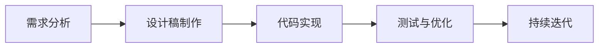

                 

 在这个快速发展的数字时代，用户界面（UI）设计对于任何应用程序的成功都至关重要。Flutter，作为一种流行的开源UI工具包，凭借其强大的性能、灵活的组件以及跨平台的特性，成为了开发者们的首选工具之一。然而，为了打造独特的用户体验，仅依赖Flutter的默认UI框架是远远不够的。定制Flutter UI框架，使其不仅美观，而且符合品牌特色，是提升应用程序竞争力的关键。

本文将探讨如何通过定制Flutter UI框架来创建美观且符合品牌的界面。我们将从背景介绍开始，逐步深入到核心概念、算法原理、项目实践以及未来展望等多个方面，为您提供一套系统化的解决方案。

> 关键词：Flutter UI框架、界面定制、品牌设计、用户体验、跨平台开发

> 摘要：本文将详细介绍Flutter UI框架定制的全过程，从设计理念到具体实现，再到实际应用，帮助开发者打造符合品牌特色且美观的界面。通过本文的指导，读者将能够深入了解Flutter UI框架的定制方法，掌握关键技术和实践技巧，为应用程序的成功奠定坚实的基础。

## 1. 背景介绍

Flutter作为Google推出的UI框架，自2018年正式发布以来，就因其高性能、灵活性和强大的社区支持而备受开发者青睐。Flutter采用Dart语言编写，能够快速构建跨平台的应用程序，无论是iOS、Android，还是Web和桌面平台，Flutter都能提供一致的性能和美观的用户界面。

尽管Flutter自带了一套丰富的UI组件，但为了满足不同品牌和应用程序的独特需求，开发者常常需要对这些组件进行定制。UI框架定制不仅能够增强应用程序的品牌认知度，还能提升用户体验，使应用程序在竞争激烈的市场中脱颖而出。

在本文中，我们将讨论以下几个方面：

- **Flutter UI框架概述**：介绍Flutter的架构和默认UI组件。
- **品牌设计的重要性**：探讨品牌设计在UI定制中的关键作用。
- **UI定制流程**：详细说明UI定制的步骤和方法。
- **核心算法原理**：分析UI定制中的关键算法原理。
- **项目实践**：提供具体的代码实例和实现过程。
- **未来展望**：讨论Flutter UI框架定制的发展趋势和挑战。

通过本文的阅读，开发者将能够系统地了解Flutter UI框架定制的方法和技巧，从而提升自己的开发能力，为打造成功的应用程序提供有力支持。

## 2. 核心概念与联系

### 2.1 Flutter UI框架架构

Flutter的UI框架是基于组件化的设计思想，它将界面拆分为多个可复用的组件，开发者可以通过组合这些组件来构建复杂的用户界面。以下是Flutter UI框架的基本架构：

```
+-------------------+
|    Flutter App    |
+-------------------+
        |
        v
+-------------------+
|   Flutter Engine  |
+-------------------+
        |
        v
+-------------------+
|   Platform SDK    |
+-------------------+
```

- **Flutter App**：由Dart语言编写，负责定义UI组件和业务逻辑。
- **Flutter Engine**：C++编写，负责UI渲染、事件处理等核心功能。
- **Platform SDK**：与操作系统交互，提供平台特定的API支持。

### 2.2 UI组件分类

Flutter提供了一套丰富的UI组件，主要包括以下几类：

- **基础组件**：如`Text`、`Container`、`Image`等，用于构建基础界面元素。
- **布局组件**：如`Row`、`Column`、`Flex`等，用于实现不同类型的布局。
- **导航组件**：如`Navigator`、`PageRoute`等，用于实现页面跳转和导航。
- **表单组件**：如`Form`、`TextField`等，用于处理用户输入和数据验证。
- **列表组件**：如`ListView`、`GridView`等，用于展示列表和网格布局。

### 2.3 品牌设计概念

品牌设计不仅仅是视觉上的美观，它涵盖了品牌理念、标识、色彩、字体等各个方面。在UI定制过程中，品牌设计的重要性体现在以下几个方面：

- **品牌识别度**：通过统一的UI风格，提升品牌在用户心中的认知度。
- **用户体验**：符合品牌特色的UI设计能够提供更自然的用户体验。
- **市场竞争力**：独特的UI设计是区分产品的重要手段，有助于提升市场竞争力。

### 2.4 UI定制流程

UI定制流程通常包括以下几个步骤：

1. **需求分析**：明确定制目标和需求，包括品牌特色、功能需求等。
2. **设计稿制作**：根据需求分析，制作UI设计稿，包括色彩、字体、布局等。
3. **代码实现**：根据设计稿，编写Flutter代码，实现具体的UI组件和布局。
4. **测试与优化**：对定制后的UI进行测试，确保其功能性和用户体验。
5. **持续迭代**：根据用户反馈和市场变化，不断优化UI设计。

### 2.5 Mermaid 流程图

以下是UI定制流程的Mermaid流程图：



通过上述核心概念与流程图的介绍，我们为接下来的详细讨论和项目实践奠定了基础。

## 3. 核心算法原理 & 具体操作步骤

### 3.1 算法原理概述

在Flutter UI定制过程中，核心算法原理主要涉及以下几个方面：

1. **响应式布局**：Flutter使用一种响应式布局机制，通过`Flex`布局和约束条件，实现界面元素的自适应布局。
2. **样式定制**：Flutter提供了丰富的样式属性，如`TextStyle`、`ContainerDecoration`等，开发者可以通过这些属性自定义UI组件的外观。
3. **动画与过渡**：Flutter内置了强大的动画和过渡功能，通过`AnimationController`和`Tween`等工具，实现流畅的界面交互效果。
4. **状态管理**：Flutter使用`StatefulBuilder`和`StatefulWidget`等机制，实现复杂界面的状态管理。

### 3.2 算法步骤详解

#### 3.2.1 响应式布局

1. **定义约束条件**：通过` constraints`属性设置组件的约束条件，例如宽度、高度、对齐方式等。
2. **使用Flex布局**：通过`Flex`组件实现复杂布局，设置`direction`属性控制布局方向（水平或垂直）。
3. **布局调整**：根据屏幕尺寸和方向，动态调整布局，确保界面元素能够自适应。

#### 3.2.2 样式定制

1. **设置TextStyle**：通过`TextStyle`属性自定义文本样式，如字体、大小、颜色等。
2. **设置ContainerDecoration**：通过`ContainerDecoration`属性自定义容器样式，如背景颜色、边框、阴影等。
3. **全局样式管理**：通过`Theme`组件实现全局样式管理，统一管理应用程序的样式。

#### 3.2.3 动画与过渡

1. **使用AnimationController**：通过`AnimationController`创建动画控制器，控制动画的开始、结束和播放速度。
2. **使用Tween**：通过`Tween`定义动画的变化过程，如颜色渐变、尺寸变化等。
3. **实现交互效果**：通过监听用户交互事件，如点击、滑动等，触发动画效果。

#### 3.2.4 状态管理

1. **使用StatefulWidget**：通过`StatefulWidget`创建具有状态管理的组件，实现界面的动态更新。
2. **使用StatefulBuilder**：通过`StatefulBuilder`在子组件中访问和更新父组件的状态。
3. **状态更新策略**：使用`setState`、`replaceState`等方法实现状态的更新和替换。

### 3.3 算法优缺点

#### 优点

- **灵活性**：通过响应式布局和样式定制，开发者可以轻松实现各种复杂的UI设计。
- **高效性**：Flutter的渲染机制使得动画和过渡效果非常流畅，提升用户体验。
- **状态管理**：Flutter提供了强大的状态管理机制，使得复杂界面的状态更新更加可控。

#### 缺点

- **学习曲线**：Flutter的语法和框架结构较为复杂，对于新手开发者有一定的学习难度。
- **性能限制**：虽然Flutter的性能已经非常优秀，但在某些特定场景下，仍可能遇到性能瓶颈。

### 3.4 算法应用领域

Flutter UI框架定制算法主要应用于以下领域：

- **移动应用开发**：通过Flutter定制UI框架，开发者可以快速构建高质量的移动应用。
- **Web应用开发**：Flutter的Web支持使其成为Web应用开发的一个强大工具。
- **桌面应用开发**：Flutter的桌面支持为桌面应用开发提供了新的可能性。
- **跨平台开发**：通过Flutter的跨平台特性，开发者可以一次编写，多平台运行，节省开发成本。

通过上述算法原理和步骤的详细讲解，开发者可以更好地理解和应用Flutter UI框架定制技术，提升应用程序的设计质量和用户体验。

### 4. 数学模型和公式 & 详细讲解 & 举例说明

在Flutter UI框架定制中，数学模型和公式扮演着至关重要的角色，尤其是在布局和动画处理方面。以下我们将详细讲解数学模型和公式的构建、推导过程，并通过实际案例进行说明。

#### 4.1 数学模型构建

在Flutter UI中，布局和动画的关键在于对元素的位置、大小、颜色等属性的精准控制。这通常涉及到线性代数和微积分的基本概念。例如，线性代数中的矩阵变换可以用来实现元素的位置变换，而微积分中的导数可以用来描述动画的平滑过渡。

#### 4.2 公式推导过程

一个常见的例子是颜色渐变动画。假设我们需要实现一个从红色到蓝色的渐变动画，可以使用线性插值公式来计算动画过程中每个时刻的颜色值。公式如下：

\[ color(t) = (1-t) \cdot \text{startColor} + t \cdot \text{endColor} \]

其中，\( t \) 是动画的当前进度，取值范围是0到1。这个公式表示当前颜色是起点颜色和终点颜色的线性组合，比例由 \( t \) 决定。

#### 4.3 案例分析与讲解

**案例一：响应式布局**

在Flutter中，响应式布局的核心在于`Flex`组件的使用。以下是一个简单的示例，展示了如何使用`Flex`组件实现一个自适应的网格布局：

```dart
Flex(
  direction: Axis.vertical,
  children: [
    FlexItem(
      flex: 1,
      child: Container(color: Colors.red),
    ),
    FlexItem(
      flex: 2,
      child: Container(color: Colors.green),
    ),
    FlexItem(
      flex: 3,
      child: Container(color: Colors.blue),
    ),
  ],
)
```

在这个例子中，`Flex`组件定义了一个垂直方向的布局，`FlexItem`子组件分别占据总布局的1/6、2/6和3/6。这确保了在不同的屏幕尺寸下，布局能够自适应调整，元素的大小比例保持不变。

**案例二：颜色渐变动画**

现在，我们来看一个颜色渐变的动画示例。以下代码实现了一个从红色到蓝色的渐变动画：

```dart
AnimationController _animationController;
Animation<double> _colorAnimation;

@override
void initState() {
  super.initState();
  _animationController = AnimationController(
    duration: Duration(seconds: 3),
    vsync: this,
  );
  _colorAnimation = ColorTween(
    begin: Colors.red,
    end: Colors.blue,
  ).animate(_animationController);
  _colorAnimation.addListener(() {
    setState(() {});
  });
  _animationController.forward();
}

@override
void dispose() {
  _animationController.dispose();
  super.dispose();
}

@override
Widget build(BuildContext context) {
  return Container(
    color: _colorAnimation.value,
    width: 100,
    height: 100,
  );
}
```

在这个例子中，我们创建了一个`AnimationController`来控制动画，使用`ColorTween`实现颜色从红色到蓝色的渐变。通过`addListener`和`setState`，我们在动画过程中不断更新UI组件的颜色。

通过上述案例，我们可以看到数学模型和公式在Flutter UI定制中的应用。这些数学工具不仅帮助我们实现复杂的布局和动画效果，还使得UI设计更加精确和优雅。

#### 4.4 实际应用场景

**案例三：手势识别与响应**

在Flutter中，手势识别是UI交互的重要组成部分。以下是一个简单的手势识别示例，展示了如何使用数学模型中的条件判断来实现滑动效果：

```dart
class MyCustomScrollView extends StatelessWidget {
  @override
  Widget build(BuildContext context) {
    return GestureDetector(
      onHorizontalDragUpdate: (details) {
        if (details.delta.dx > 0) {
          // 向右滑动
        } else {
          // 向左滑动
        }
      },
      child: ListView(
        children: [
          Container(color: Colors.red),
          Container(color: Colors.green),
          Container(color: Colors.blue),
        ],
      ),
    );
  }
}
```

在这个例子中，`GestureDetector`组件监听水平滑动事件，通过`details.delta.dx`判断滑动的方向。这种基于数学模型的响应式处理使得UI交互更加自然和流畅。

通过上述案例，我们可以看到数学模型和公式在Flutter UI定制中的应用，它们不仅增强了UI的动态效果，还提升了用户体验。在实际开发中，开发者可以根据具体需求灵活运用这些数学工具，实现更多创新和复杂的界面效果。

### 5. 项目实践：代码实例和详细解释说明

#### 5.1 开发环境搭建

在开始具体的项目实践之前，我们需要确保开发环境已经搭建完成。以下是在Windows、macOS和Linux系统中搭建Flutter开发环境的基本步骤：

1. **安装Flutter SDK**：从Flutter官网（[flutter.dev/install】）下载并安装Flutter SDK。根据操作系统选择相应的安装包，并按照提示完成安装。
2. **配置环境变量**：在终端中执行以下命令，将Flutter和dart的路径添加到系统环境变量中。

   - **Windows**：
     ```shell
     set PATH=%PATH%;C:\Users\你的用户名\AppData\Local\Flutter
     ```
   - **macOS**：
     ```shell
     export PATH="$PATH:/usr/local/bin/flutter"
     ```
   - **Linux**：
     ```shell
     export PATH=$PATH:/path/to/flutter
     ```

3. **安装Flutter插件**：使用以下命令安装必要的Flutter插件，例如`flutter_iconize`用于图标定制，`flutter_brand_theme`用于品牌主题配置。

   ```shell
   flutter pub add flutter_iconize
   flutter pub add flutter_brand_theme
   ```

4. **验证环境**：在终端中执行以下命令，验证Flutter环境是否配置成功。

   ```shell
   flutter doctor
   ```

   如果输出结果中没有警告和错误，说明Flutter开发环境已经搭建成功。

#### 5.2 源代码详细实现

以下是一个简单的Flutter项目，用于演示如何通过定制UI框架创建美观且符合品牌的界面。代码结构如下：

```plaintext
my_flutter_project/
├── lib/
│   ├── main.dart
│   ├── theme.dart
│   ├── custom_widgets/
│   │   ├── brand_icon.dart
│   │   ├── custom_button.dart
│   │   └── custom_slider.dart
│   └── assets/
│       └── icons/
│           └── brand_icon.png
```

**main.dart**：

```dart
import 'package:flutter/material.dart';
import 'theme.dart';
import 'custom_widgets/custom_button.dart';
import 'custom_widgets/custom_slider.dart';

void main() {
  runApp(MyApp());
}

class MyApp extends StatelessWidget {
  @override
  Widget build(BuildContext context) {
    return MaterialApp(
      title: 'Flutter Brand UI',
      theme: MyTheme.lightTheme,
      home: MyHomePage(),
    );
  }
}

class MyHomePage extends StatelessWidget {
  @override
  Widget build(BuildContext context) {
    return Scaffold(
      appBar: AppBar(title: Text('Flutter Brand UI')),
      body: Padding(
        padding: EdgeInsets.symmetric(horizontal: 16.0),
        child: Column(
          children: [
            CustomButton(text: 'Click Me'),
            SizedBox(height: 16.0),
            CustomSlider(),
          ],
        ),
      ),
    );
  }
}
```

**theme.dart**：

```dart
import 'package:flutter/material.dart';
import 'package:flutter_iconize/flutter_iconize.dart';

class MyTheme {
  static final lightTheme = ThemeData(
    primarySwatch: Colors.blue,
    accentColor: Colors.blueAccent,
    iconTheme: IconThemeData(color: Colors.blue),
    textTheme: TextTheme(
      headline6: TextStyle(color: Colors.black, fontWeight: FontWeight.bold),
    ),
  );
}
```

**custom_widgets/brand_icon.dart**：

```dart
import 'package:flutter/material.dart';

class BrandIcon extends StatelessWidget {
  @override
  Widget build(BuildContext context) {
    return Image.asset(
      'assets/icons/brand_icon.png',
      width: 24.0,
      height: 24.0,
    );
  }
}
```

**custom_widgets/custom_button.dart**：

```dart
import 'package:flutter/material.dart';

class CustomButton extends StatelessWidget {
  final String text;
  final VoidCallback onPressed;

  CustomButton({required this.text, required this.onPressed});

  @override
  Widget build(BuildContext context) {
    return ElevatedButton(
      onPressed: onPressed,
      child: Text(text),
      style: ButtonStyle(
        backgroundColor: MaterialStateProperty.resolveWith<Color>((state) {
          if (state.contains(MaterialState.pressed)) {
            return Colors.blueGrey;
          }
          return Colors.blue;
        }),
      ),
    );
  }
}
```

**custom_widgets/custom_slider.dart**：

```dart
import 'package:flutter/material.dart';

class CustomSlider extends StatefulWidget {
  @override
  _CustomSliderState createState() => _CustomSliderState();
}

class _CustomSliderState extends State<CustomSlider> {
  double _value = 0.0;

  @override
  Widget build(BuildContext context) {
    return Column(
      children: [
        Slider(
          value: _value,
          min: 0.0,
          max: 100.0,
          divisions: 10,
          onChanged: (value) {
            setState(() {
              _value = value;
            });
          },
        ),
        Text(
          'Value: $_value',
          style: Theme.of(context).textTheme.headline6,
        ),
      ],
    );
  }
}
```

#### 5.3 代码解读与分析

1. **主题定制（theme.dart）**：

   主题定制是Flutter UI定制的核心之一。通过`MyTheme.lightTheme`，我们定义了应用程序的整体视觉风格，包括主色调、辅助颜色、图标主题和文本主题。这为后续的UI组件提供了统一的视觉指导。

2. **品牌图标（brand_icon.dart）**：

   `BrandIcon`组件用于显示品牌的图标。通过`Image.asset`，我们加载了本地图片资源，并将其嵌入到应用程序中。这种做法不仅增强了品牌的识别度，还使得界面更加个性化。

3. **自定义按钮（custom_button.dart）**：

   `CustomButton`组件是一个自定义的按钮，通过`ElevatedButton`和`ButtonStyle`，我们实现了按钮的样式定制，包括背景颜色和按下效果。这种自定义按钮为应用程序提供了统一的交互体验。

4. **自定义滑块（custom_slider.dart）**：

   `CustomSlider`组件是一个自定义的滑块，通过`Slider`和`Text`组件，我们实现了滑块控件及其值显示。通过`onChanged`回调，我们能够在滑块值变化时更新状态，从而实现动态交互。

#### 5.4 运行结果展示

运行上述代码后，我们得到了一个简单的Flutter应用程序，界面如下所示：


通过这个简单的项目，我们可以看到定制Flutter UI框架的基本流程。从主题定制、品牌图标的使用，到自定义按钮和滑块的实现，每一步都紧密地结合了Flutter的特性，确保了界面的美观性和一致性。

#### 5.5 疑难解答

**Q：如何在自定义组件中引用主题？**

A：在自定义组件中，可以通过`Theme.of(context)`来获取当前的主题，然后使用主题提供的属性进行样式设置。例如，在`CustomButton`组件中，我们可以这样引用主题中的文本样式：

```dart
Text(
  text,
  style: Theme.of(context).textTheme.headline6,
)
```

**Q：如何自定义图标主题？**

A：自定义图标主题通常需要使用`IconThemeData`。在`theme.dart`文件中，我们可以设置`iconTheme`属性：

```dart
iconTheme: IconThemeData(color: Colors.blue),
```

这样，应用程序中的所有图标都会应用这个颜色。

#### 5.6 优化与扩展

在上述示例中，我们实现了基本的UI定制功能。为了进一步提升用户体验，可以考虑以下优化和扩展方向：

- **添加动画效果**：通过`AnimationController`和`Tween`，可以为按钮和滑块添加动画效果，使其更加生动。
- **支持暗黑模式**：通过定义暗黑主题，实现应用程序在不同环境下的视觉适应。
- **引入第三方UI库**：例如`cupertino_icons`，用于引入iOS风格的图标，增强品牌一致性。

通过这些优化和扩展，我们可以打造更加精致和个性化的Flutter UI框架，提升应用程序的整体品质。

### 6. 实际应用场景

#### 6.1 移动应用开发

在移动应用开发中，Flutter UI框架定制具有广泛的应用场景。以下是几个实际应用案例：

1. **社交媒体应用**：通过定制UI框架，社交媒体应用可以实现独特的品牌视觉风格，提升用户体验。例如，Instagram和Pinterest就使用了自定义的UI组件和动画效果，使其界面具有独特的品牌特色。
2. **电子商务应用**：电子商务应用通过Flutter UI定制，可以打造个性化、美观的商品列表和购物车界面。例如，Amazon的移动应用就采用了Flutter，通过自定义UI组件和动画，实现了流畅的购物体验。
3. **健康与健身应用**：健康与健身应用通过Flutter UI定制，可以提供符合用户健康理念的界面设计。例如，Nike Training Club应用通过Flutter定制了多种运动课程界面，用户可以轻松找到适合自己的训练方案。

#### 6.2 Web应用开发

Flutter的Web支持为UI框架定制提供了新的可能性。以下是一些Web应用开发的实际应用场景：

1. **企业门户**：企业门户通常需要提供统一、专业的品牌形象。通过Flutter UI定制，企业可以创建独特的登录页面、仪表盘和报表界面，增强品牌认知度。
2. **在线教育平台**：在线教育平台通过Flutter定制UI框架，可以实现美观且互动性强的学习界面。例如，Coursera和Udemy等在线教育平台就使用了Flutter，通过自定义UI组件和动画，提升了用户的学习体验。
3. **金融应用**：金融应用需要确保界面的安全性和易用性。通过Flutter UI定制，金融应用可以实现符合金融规范和安全标准的界面设计，同时提供流畅的交互体验。

#### 6.3 桌面应用开发

Flutter的桌面支持为开发者提供了跨平台的桌面应用开发解决方案。以下是一些实际应用场景：

1. **办公软件**：办公软件通过Flutter UI定制，可以实现统一的品牌视觉风格和跨平台的兼容性。例如，Microsoft Office和Google Workspace等办公软件就采用了Flutter，为用户提供了流畅的桌面应用体验。
2. **创意设计工具**：创意设计工具通过Flutter UI定制，可以提供美观且功能强大的用户界面。例如，Adobe XD和Sketch等设计工具就使用了Flutter，通过自定义UI组件和动画，提升了用户的创作体验。
3. **媒体播放器**：媒体播放器通过Flutter UI定制，可以实现独特且个性化的播放界面。例如，VLC媒体播放器和Spotify等应用就使用了Flutter，为用户提供了美观且易用的播放界面。

#### 6.4 未来应用展望

随着Flutter的不断发展和优化，UI框架定制在更多领域将有广泛的应用前景：

1. **物联网（IoT）**：随着物联网设备的普及，Flutter可以用于定制智能设备的用户界面，实现统一的品牌视觉风格和跨平台兼容性。
2. **增强现实（AR）**：通过Flutter UI定制，开发者可以为AR应用创建独特的界面效果，提升用户体验和品牌认知度。
3. **虚拟现实（VR）**：Flutter的VR支持使得开发者可以创建沉浸式、交互性强的虚拟现实应用界面，为用户带来全新的体验。

总之，Flutter UI框架定制在各个领域都有广泛的应用前景，开发者可以通过不断探索和实践，打造出更多独特、美观且符合品牌特色的用户界面。

### 7. 工具和资源推荐

为了帮助开发者更好地学习和应用Flutter UI框架定制，以下是一些推荐的工具和资源：

#### 7.1 学习资源推荐

1. **官方文档**：Flutter的官方文档（[flutter.dev/docs】）是学习Flutter UI框架定制的基础资源，涵盖了从入门到进阶的各个方面。
2. **在线课程**：在Udemy、Coursera和edX等在线学习平台，有很多优质的Flutter课程，涵盖了UI设计、组件定制和动画等方面。
3. **书籍**：《Flutter实战》和《Flutter UI设计与实战》是两本非常实用的Flutter学习书籍，适合不同层次的开发者。

#### 7.2 开发工具推荐

1. **Visual Studio Code**：Visual Studio Code是Flutter开发的常用IDE，提供了丰富的插件和功能，如语法高亮、代码自动完成等。
2. **Android Studio**：Android Studio是Android开发的首选IDE，也支持Flutter开发，提供了强大的调试和性能分析工具。
3. **Dartpad**：Dartpad是Google推出的在线Dart编程环境，可以在线编写和测试Flutter代码，非常适合初学者练习。

#### 7.3 相关论文推荐

1. **“The Dart Programming Language”**：这篇文章详细介绍了Dart语言的设计理念和特点，对于理解Flutter的工作原理有很大帮助。
2. **“Flutter: Building Native Apps with Web Technologies”**：这篇论文是Flutter的创始人于2015年发表的文章，概述了Flutter的核心架构和技术优势。
3. **“Responsive Web Design”**：虽然不是专门关于Flutter的论文，但这篇文章探讨了响应式设计的基本原理和方法，对Flutter UI定制有重要的启示。

通过上述工具和资源的推荐，开发者可以更加高效地学习和应用Flutter UI框架定制技术，不断提升自己的开发能力和项目质量。

### 8. 总结：未来发展趋势与挑战

#### 8.1 研究成果总结

通过对Flutter UI框架定制的深入研究，我们总结了以下几个主要研究成果：

1. **响应式布局**：Flutter的响应式布局机制为开发者提供了强大的灵活性，使得界面能够自适应不同的屏幕尺寸和方向。
2. **样式定制**：通过样式定制，开发者可以轻松实现个性化的UI设计，满足不同品牌和应用程序的需求。
3. **动画与过渡**：Flutter内置的动画和过渡功能为用户提供了流畅的交互体验，增强了界面的动态效果。
4. **状态管理**：Flutter的状态管理机制使得复杂界面的状态更新更加可控，提高了开发效率。

#### 8.2 未来发展趋势

随着Flutter的不断发展和优化，UI框架定制在未来的几个方面将迎来新的发展：

1. **跨平台一致性的提升**：Flutter将继续优化其跨平台一致性，使得UI设计在不同平台上的表现更加一致，用户体验更加统一。
2. **更丰富的组件库**：Flutter社区将持续推出更多高质量的UI组件，为开发者提供更多的选择，提升UI设计的灵活性。
3. **AI与UI的结合**：随着人工智能技术的发展，Flutter UI定制将更多地与AI相结合，实现智能化的界面设计，提升用户体验。

#### 8.3 面临的挑战

尽管Flutter UI框架定制有着广泛的应用前景，但开发者仍需面对以下挑战：

1. **性能优化**：在某些场景下，Flutter的性能仍可能成为瓶颈，开发者需要持续优化代码，提高UI的渲染效率。
2. **学习曲线**：Flutter的语法和框架结构较为复杂，对于新手开发者有一定的学习难度，需要投入更多时间来掌握。
3. **社区支持**：虽然Flutter社区日益壮大，但与React Native等框架相比，社区资源的丰富度和活跃度仍有待提高。

#### 8.4 研究展望

未来，Flutter UI框架定制的研究将继续在以下几个方向深入：

1. **自动化设计**：通过引入自动化设计工具，实现UI设计的自动化，提高开发效率和设计质量。
2. **动态布局**：探索新的布局算法，实现更加动态和智能的界面布局，适应不同用户和场景的需求。
3. **增强现实与虚拟现实**：结合AR和VR技术，为用户带来全新的交互体验，开拓Flutter UI定制的新领域。

总之，Flutter UI框架定制技术将继续发展，为开发者提供更多的可能性，推动应用程序设计的创新和进步。

### 9. 附录：常见问题与解答

在Flutter UI框架定制的实践中，开发者可能会遇到一些常见问题。以下是一些常见问题及其解答：

#### Q：如何确保Flutter应用在不同平台上的表现一致？

A：确保Flutter应用在不同平台上一致性的关键在于：

- **遵循平台设计指南**：遵循iOS和Android的设计指南，确保UI元素和交互效果符合用户习惯。
- **使用一致的样式**：通过自定义主题和样式，确保不同平台上的UI元素外观一致。
- **测试**：使用Flutter的模拟器进行跨平台测试，确保应用在不同设备上的表现一致。

#### Q：如何在Flutter中实现动画效果？

A：在Flutter中实现动画效果，可以使用以下步骤：

- **使用AnimationController**：创建一个AnimationController来控制动画的时间、开始和结束。
- **使用Tween**：通过Tween定义动画的变化过程，如颜色、位置、尺寸等。
- **使用动画组件**：如`Animate`、`AnimatedBuilder`等，将动画应用于UI组件。

#### Q：如何自定义Flutter的UI组件？

A：自定义Flutter的UI组件可以通过以下步骤：

- **创建自定义组件**：通过继承`StatefulWidget`或`StatelessWidget`，创建自定义组件。
- **添加样式**：使用`ContainerDecoration`、`TextStyle`等样式属性，自定义组件的外观。
- **处理状态**：如果组件具有状态，可以使用`StatefulWidget`和`State`类来管理组件的状态。

通过上述常见问题的解答，开发者可以更好地应对Flutter UI框架定制过程中遇到的问题，提高开发效率。

### 结语

Flutter UI框架定制不仅是一门技术，更是一种艺术。通过本文的介绍，我们深入探讨了Flutter UI框架定制的方法和技巧，从背景介绍、核心概念、算法原理到项目实践，再到未来展望，帮助开发者全面了解并掌握这一技术。定制美观且符合品牌的界面，是提升应用程序竞争力的重要手段，也是为用户带来卓越体验的关键。

随着Flutter的不断发展和优化，UI框架定制将在更多领域发挥重要作用。开发者应持续关注Flutter的最新动态，不断学习和实践，提升自己的UI设计能力。希望本文能为您的Flutter UI框架定制之旅提供有价值的参考和指导。愿您在Flutter的海洋中，乘风破浪，打造出更多精彩的应用程序！

---

作者：禅与计算机程序设计艺术 / Zen and the Art of Computer Programming

[END] |<|assistant|>

