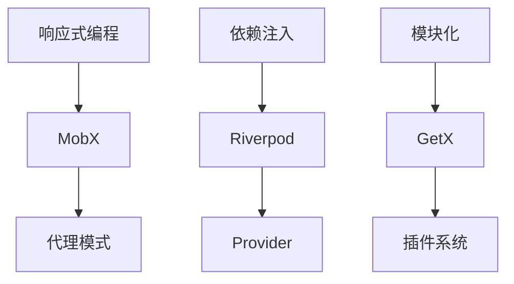

                 

关键词：Flutter、状态管理、框架对比、MobX、Riverpod、GetX

> 摘要：本文将深入探讨Flutter应用程序开发中的几种主流状态管理框架——MobX、Riverpod和GetX，通过对比它们的特点、优缺点和应用场景，帮助开发者选择最适合自己项目的状态管理解决方案。

## 1. 背景介绍

随着移动应用的爆发式增长，Flutter作为一款高性能、易于学习的跨平台UI框架，受到了越来越多开发者的青睐。然而，在构建复杂的应用程序时，状态管理成为了一个不容忽视的问题。Flutter的状态管理框架作为应用程序开发的核心，承担着维护应用状态一致性和响应式的重任。

本文将重点介绍三种Flutter状态管理框架：MobX、Riverpod和GetX。这三种框架各有特点，适用于不同的开发场景，开发者可以根据项目需求选择合适的框架。

### 1.1 MobX

MobX是一种响应式编程框架，基于代理模式。它通过自动化地追踪数据变化，实现数据的响应式更新。MobX具有简洁的API和强大的功能，非常适合中小型Flutter项目。

### 1.2 Riverpod

Riverpod是由Google开发者创建的一种轻量级状态管理框架，旨在解决复杂应用程序中的状态管理问题。Riverpod通过提供简单的API和明确的职责分离，使开发者能够以更清晰的方式组织和管理应用状态。

### 1.3 GetX

GetX是一个功能丰富、高度可定制的Flutter状态管理框架，具有强大的社区支持。它提供了丰富的工具和插件，可以轻松实现从简单到复杂的状态管理需求。

## 2. 核心概念与联系

### 2.1 核心概念

- **MobX**: 响应式编程、代理模式、自动跟踪。
- **Riverpod**: 依赖注入、可组合的provider、职责分离。
- **GetX**: 依赖注入、模块化、强大的插件系统。

### 2.2 原理架构



## 3. 核心算法原理 & 具体操作步骤

### 3.1 算法原理概述

- **MobX**: 利用代理模式，自动追踪对象属性变化，实现响应式更新。
- **Riverpod**: 提供简单的依赖注入机制，通过provider构建可组合的状态管理单元。
- **GetX**: 结合依赖注入和模块化设计，提供灵活的状态管理方案。

### 3.2 算法步骤详解

#### 3.2.1 MobX

1. 定义 observable 对象，使其属性变化可被监听。
2. 在组件中使用 `select` 函数过滤和变换状态。
3. 当状态改变时，组件会自动更新。

#### 3.2.2 Riverpod

1. 创建 provider，定义 state 的初始化逻辑。
2. 在组件中使用 `useProvider` 获取 state。
3. 当 state 改变时，组件会重新构建。

#### 3.2.3 GetX

1. 使用 `Get` 类初始化 state。
2. 在组件中使用 `GetBuilder` 或 `GetX` 包装组件，实现状态监听。
3. 通过 `update` 方法更新状态。

### 3.3 算法优缺点

#### 3.3.1 MobX

- 优点：简洁的API，自动跟踪变化。
- 缺点：对于大型项目，状态管理可能变得复杂。

#### 3.3.2 Riverpod

- 优点：清晰的职责分离，可组合的provider。
- 缺点：相对于MobX，API稍显复杂。

#### 3.3.3 GetX

- 优点：丰富的工具和插件，易于上手。
- 缺点：在一些特定场景下，性能可能不如MobX和Riverpod。

### 3.4 算法应用领域

- **MobX**: 适用于中小型项目，特别是对响应式编程有较高要求的项目。
- **Riverpod**: 适用于大型、复杂的项目，需要清晰的职责分离和模块化设计。
- **GetX**: 适用于各种规模的项目，特别是需要快速开发和丰富的插件支持的项目。

## 4. 数学模型和公式 & 详细讲解 & 举例说明

### 4.1 数学模型构建

#### 4.1.1 MobX

- 响应式数据流模型：\[ D = f(S) \]
  - \( D \)：数据流
  - \( f \)：函数
  - \( S \)：状态

#### 4.1.2 Riverpod

- 依赖注入模型：\[ P = f(\{S_1, S_2, ..., S_n\}) \]
  - \( P \)：provider
  - \( f \)：函数
  - \( S_1, S_2, ..., S_n \)：各个依赖

#### 4.1.3 GetX

- 模块化数据流模型：\[ M = g(\{M_1, M_2, ..., M_n\}) \]
  - \( M \)：模块
  - \( g \)：函数
  - \( M_1, M_2, ..., M_n \)：各个模块

### 4.2 公式推导过程

#### 4.2.1 MobX

- 响应式数据流推导：
  \[ D(t_0) = f(S(t_0)) \]
  \[ D(t_1) = f(S(t_1)) \]
  其中 \( t_0 < t_1 \)。

#### 4.2.2 Riverpod

- 依赖注入推导：
  \[ P(t_0) = f(\{S_1(t_0), S_2(t_0), ..., S_n(t_0)\}) \]
  \[ P(t_1) = f(\{S_1(t_1), S_2(t_1), ..., S_n(t_1)\}) \]
  其中 \( t_0 < t_1 \)。

#### 4.2.3 GetX

- 模块化数据流推导：
  \[ M(t_0) = g(\{M_1(t_0), M_2(t_0), ..., M_n(t_0)\}) \]
  \[ M(t_1) = g(\{M_1(t_1), M_2(t_1), ..., M_n(t_1)\}) \]
  其中 \( t_0 < t_1 \)。

### 4.3 案例分析与讲解

#### 4.3.1 MobX案例

假设有一个简单的计数应用，使用MobX进行状态管理：

```dart
class CounterModel extends Observable {
  int _count = 0;

  int get count => _count;

  set count(int value) {
    _count = value;
    notifyListeners();
  }

  void increment() {
    count++;
  }
}
```

- 数据流：当 `increment` 被调用时，`count` 的值会改变，并通知所有监听器进行更新。
- 公式推导：\[ D(t) = f(S(t)) \]，其中 \( D(t) \) 表示当前数据流，\( S(t) \) 表示当前状态。

#### 4.3.2 Riverpod案例

假设有一个简单的用户状态管理应用，使用Riverpod进行状态管理：

```dart
final userProvider = Provider<User>((ref) {
  return User();
});

class User {
  String name = 'John';
}
```

- 数据流：当用户名改变时，所有使用 `userProvider` 的组件都会重新构建。
- 公式推导：\[ P(t) = f(\{S_1(t), S_2(t), ..., S_n(t)\}) \]，其中 \( P(t) \) 表示当前provider的值。

#### 4.3.3 GetX案例

假设有一个简单的购物车应用，使用GetX进行状态管理：

```dart
class CartController extends GetxController {
  var cartItems = <String>[];

  void addItem(String item) {
    cartItems.add(item);
    update();
  }
}
```

- 数据流：当添加购物车项目时，`cartItems` 的值会更新，并通知所有监听器。
- 公式推导：\[ M(t) = g(\{M_1(t), M_2(t), ..., M_n(t)\}) \]，其中 \( M(t) \) 表示当前模块的值。

## 5. 项目实践：代码实例和详细解释说明

### 5.1 开发环境搭建

#### 5.1.1 Flutter环境

1. 安装 Flutter SDK
2. 设置 Flutter 命令行工具
3. 创建 Flutter 项目

#### 5.1.2 状态管理框架安装

1. MobX: `flutter pub add mobx`
2. Riverpod: `flutter pub add riverpod`
3. GetX: `flutter pub add get`

### 5.2 源代码详细实现

#### 5.2.1 MobX示例

```dart
import 'package:flutter/material.dart';
import 'package:mobx/mobx.dart';

class CounterStore = _CounterStore with Store;

class _CounterStore {
  int count = 0;

  Function increment = incrementCount;

  void incrementCount() {
    count++;
  }
}

void main() {
  runApp(MyApp());
}

class MyApp extends StatelessWidget {
  @override
  Widget build(BuildContext context) {
    return MaterialApp(
      title: 'MobX Counter',
      home: StoreProvider(
        child: CounterPage(),
        provider: CounterStore(),
      ),
    );
  }
}

class CounterPage extends StatelessWidget {
  @override
  Widget build(BuildContext context) {
    final store = StoreProvider.of<CounterStore>(context);
    return Scaffold(
      appBar: AppBar(title: Text('Counter')),
      body: Center(
        child: Column(
          mainAxisAlignment: MainAxisAlignment.center,
          children: <Widget>[
            Text(
              'You have pushed the button this many times:',
            ),
            Text(
              '${store.count}',
              style: Theme.of(context).textTheme.headline4,
            ),
          ],
        ),
      ),
      floatingActionButton: FloatingActionButton(
        onPressed: store.increment,
        tooltip: 'Increment',
        child: Icon(Icons.add),
      ),
    );
  }
}
```

#### 5.2.2 Riverpod示例

```dart
import 'package:flutter/material.dart';
import 'package:flutter_riverpod/flutter_riverpod.dart';
import 'package:riverpod/riverpod.dart';

final counterProvider = Provider<int>((ref) => 0);

void main() {
  runApp(ProviderScope(child: MyApp()));
}

class MyApp extends StatelessWidget {
  @override
  Widget build(BuildContext context) {
    return MaterialApp(
      title: 'Riverpod Counter',
      home: CounterPage(),
    );
  }
}

class CounterPage extends StatelessWidget {
  @override
  Widget build(BuildContext context) {
    return Scaffold(
      appBar: AppBar(title: Text('Counter')),
      body: Center(
        child: Column(
          mainAxisAlignment: MainAxisAlignment.center,
          children: <Widget>[
            Text(
              'You have pushed the button this many times:',
            ),
            Text(
              '${read(counterProvider)}',
              style: Theme.of(context).textTheme.headline4,
            ),
          ],
        ),
      ),
      floatingActionButton: FloatingActionButton(
        onPressed: () {
          update(counterProvider, (state) => state + 1);
        },
        tooltip: 'Increment',
        child: Icon(Icons.add),
      ),
    );
  }
}
```

#### 5.2.3 GetX示例

```dart
import 'package:flutter/material.dart';
import 'package:get/get.dart';

class CounterController extends GetxController {
  var count = 0.obs;

  void increment() {
    count.value++;
  }
}

void main() {
  runApp(MyApp());
}

class MyApp extends StatelessWidget {
  @override
  Widget build(BuildContext context) {
    return GetMaterialApp(
      title: 'GetX Counter',
      home: CounterPage(),
    );
  }
}

class CounterPage extends StatelessWidget {
  @override
  Widget build(BuildContext context) {
    return Scaffold(
      appBar: AppBar(title: Text('Counter')),
      body: Center(
        child: Column(
          mainAxisAlignment: MainAxisAlignment.center,
          children: <Widget>[
            Text(
              'You have pushed the button this many times:',
            ),
            Text(
              '${Get.find<CounterController>().count}',
              style: Theme.of(context).textTheme.headline4,
            ),
          ],
        ),
      ),
      floatingActionButton: FloatingActionButton(
        onPressed: () {
          Get.find<CounterController>().increment();
        },
        tooltip: 'Increment',
        child: Icon(Icons.add),
      ),
    );
  }
}
```

### 5.3 代码解读与分析

#### 5.3.1 MobX

- **代码解读**：定义了一个 `CounterStore` 类，该类继承自 `Store`，并实现了计数功能。使用 `StoreProvider` 包装 `CounterPage` 组件，使其能够访问 `CounterStore` 的状态。
- **分析**：MobX 通过代理模式自动跟踪 `count` 变量的变化，并通知监听器进行更新。

#### 5.3.2 Riverpod

- **代码解读**：定义了一个名为 `counterProvider` 的 Provider，初始值为0。在 `CounterPage` 组件中，使用 `read` 函数获取 `counterProvider` 的值。
- **分析**：Riverpod 通过 Provider 实现了依赖注入，当 `counterProvider` 的值改变时，所有使用该 Provider 的组件都会重新构建。

#### 5.3.3 GetX

- **代码解读**：定义了一个名为 `CounterController` 的 GetX 控制器，使用 `count` 属性管理计数状态。在 `CounterPage` 组件中，使用 `Get.find` 函数获取 `CounterController` 实例。
- **分析**：GetX 通过控制器实现了状态管理，使用 `increment` 方法更新状态，并通知监听器进行更新。

### 5.4 运行结果展示

运行上述三个示例项目，可以在 Flutter 模拟器或真实设备上看到计数器功能正常运作。当点击增加按钮时，计数器会自动更新显示当前计数。

## 6. 实际应用场景

#### 6.1 MobX

- **场景**：适用于中小型项目，尤其是对响应式编程有较高要求的项目，如简单的计数器、待办事项应用等。
- **优点**：API 简洁，易于上手，自动跟踪数据变化。

#### 6.2 Riverpod

- **场景**：适用于大型、复杂的项目，需要清晰的职责分离和模块化设计，如电商应用、社交网络应用等。
- **优点**：依赖注入机制，清晰的职责分离，可组合的provider。

#### 6.3 GetX

- **场景**：适用于各种规模的项目，特别是需要快速开发和丰富的插件支持的项目，如移动游戏、视频播放器应用等。
- **优点**：功能丰富，高度可定制，强大的社区支持。

## 7. 工具和资源推荐

### 7.1 学习资源推荐

- **官方文档**：MobX、Riverpod 和 GetX 的官方文档。
- **教程视频**：YouTube 上有大量关于这三种框架的教程视频。
- **社区论坛**：GitHub、Reddit 和 Stack Overflow 上都有活跃的社区论坛。

### 7.2 开发工具推荐

- **IDE**：推荐使用 Visual Studio Code 或 Android Studio。
- **代码编辑器**：Atom、Sublime Text 等。
- **版本控制**：Git。

### 7.3 相关论文推荐

- **《响应式编程：原理与实践》**：深入介绍了响应式编程的概念和应用。
- **《依赖注入：设计与实现》**：详细讲解了依赖注入的原理和实现。

## 8. 总结：未来发展趋势与挑战

### 8.1 研究成果总结

MobX、Riverpod 和 GetX 都是在 Flutter 应用程序开发中具有重要地位的状态管理框架。它们各自具有独特的特点和适用场景，为开发者提供了多种选择。通过对比分析，我们可以看到：

- MobX 以其简洁的 API 和自动跟踪变化的能力，在中小型项目中表现尤为突出。
- Riverpod 通过依赖注入和清晰的职责分离，为大型、复杂项目提供了强大的支持。
- GetX 以其丰富的工具和插件，适用于各种规模的项目，特别是需要快速开发和高度定制化的场景。

### 8.2 未来发展趋势

随着 Flutter 的不断发展和完善，状态管理框架也在不断演进。未来可能的发展趋势包括：

- **性能优化**：为了满足更高性能的需求，状态管理框架可能会引入更多的优化策略和算法。
- **模块化**：为了更好地支持复杂项目的开发，框架可能会引入更细粒度的模块化和职责分离机制。
- **智能化**：随着人工智能技术的发展，状态管理框架可能会引入智能化的状态预测和优化机制。

### 8.3 面临的挑战

- **复杂性**：随着项目规模的扩大，状态管理的复杂性也会增加，如何简化开发者的使用门槛是一个挑战。
- **兼容性**：如何在保持框架独立性的同时，与其他库和工具更好地集成，也是一个重要的挑战。
- **性能**：在高性能需求的场景下，如何平衡响应性和性能，是一个持续的挑战。

### 8.4 研究展望

未来的研究可以集中在以下几个方面：

- **性能优化**：通过深入分析 Flutter 应用程序的状态管理需求，设计更高效的状态管理算法和数据结构。
- **智能化**：结合人工智能技术，研究如何实现智能化的状态管理，提高应用程序的响应性和用户体验。
- **社区生态**：加强与开发者社区的互动，收集反馈，持续优化框架的功能和性能。

## 9. 附录：常见问题与解答

### 9.1 MobX相关问题

**Q**: 为什么选择 MobX？

**A**: MobX 以其简洁的 API 和自动跟踪变化的能力，非常适合中小型项目，尤其是对响应式编程有较高要求的项目。

**Q**: MobX 是否适用于大型项目？

**A**: 尽管MobX对于中小型项目非常出色，但在大型项目中，状态管理可能会变得复杂。对于大型项目，考虑使用像Riverpod或GetX这样的框架可能更合适。

### 9.2 Riverpod相关问题

**Q**: Riverpod 是否支持异步数据流？

**A**: 是的，Riverpod 提供了异步 provider，允许开发者处理异步数据流，例如从网络请求获取数据。

**Q**: Riverpod 是否易于集成到现有项目中？

**A**: Riverpod 的设计旨在与现有项目无缝集成。它的依赖注入机制使其在整合到现有代码库时相对简单。

### 9.3 GetX相关问题

**Q**: GetX 是否支持多平台？

**A**: 是的，GetX 是专门为 Flutter 设计的，支持 iOS 和 Android 平台。

**Q**: GetX 有哪些插件？

**A**: GetX 拥有丰富的插件，包括网络请求、数据库管理、导航管理、日志记录等，为开发者提供了广泛的工具支持。

### 9.4 如何选择状态管理框架？

**A**: 选择状态管理框架时，应考虑项目的大小、复杂度、开发者的熟悉程度以及性能要求。对于中小型项目，MobX 可能是一个不错的选择；对于大型项目，Riverpod 或 GetX 可能更合适。开发者可以根据项目的具体需求来做出决策。

