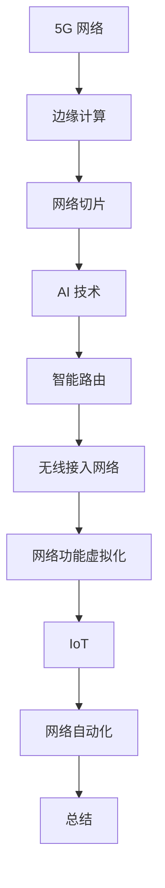

                 

关键词：5G，人工智能，智能通信，网络架构，边缘计算，网络切片，机器学习，深度学习，智能路由，无线接入网络，网络功能虚拟化，IoT，网络自动化。

> 摘要：本文旨在探讨5G和人工智能的结合如何推动智能通信网络的演进，分析其中的核心概念、算法原理、数学模型及实际应用场景，同时展望未来的发展趋势与挑战。

## 1. 背景介绍

随着信息技术的飞速发展，通信网络已经从传统的2G、3G、4G网络，逐步迈向了5G时代。5G网络以其高速度、低延迟、高密度连接等特点，为人工智能（AI）技术的发展提供了新的机遇。而AI技术的进步，尤其是机器学习和深度学习算法的发展，使得智能通信网络成为了可能。智能通信网络不仅仅是通信网络的升级，更是网络与人工智能技术的深度融合。

在5G网络中，边缘计算和网络切片技术被广泛应用。边缘计算通过在靠近数据源的地方处理数据，降低了网络延迟，提升了用户体验。网络切片技术则通过创建虚拟网络，满足不同用户和业务的需求，提高了网络的灵活性和效率。这些技术为AI算法的实时应用提供了坚实的基础。

### 1.1 5G网络的特点

- **高速度**：5G网络的峰值下载速度可达10Gbps，是4G网络的百倍以上，能够支持大规模的数据传输。
- **低延迟**：5G网络的端到端延迟可以降低到1ms，极大地提升了实时通信和互动应用的性能。
- **高密度连接**：5G支持每平方米高达100万个设备的连接，为物联网（IoT）的发展提供了条件。
- **网络切片**：网络切片技术可以将网络资源动态分配给不同的业务，提高资源利用率和用户体验。

### 1.2 人工智能的发展

人工智能（AI）技术的发展可以分为三个阶段：规则驱动、基于知识的系统和基于数据的方法。当前，基于数据的方法，尤其是机器学习和深度学习，已经成为AI技术的主流。机器学习通过训练模型来自动学习数据中的规律，而深度学习则通过多层神经网络模拟人类大脑的处理方式，能够处理更加复杂的问题。

AI技术已经在多个领域取得显著成果，如自动驾驶、自然语言处理、医疗诊断等。AI的进步为智能通信网络的发展提供了强有力的技术支撑。

## 2. 核心概念与联系

在智能通信网络中，以下几个核心概念和联系至关重要：

### 2.1 边缘计算

边缘计算是指在网络的边缘节点进行数据处理和分析，而不是将所有数据都传输到中心数据中心处理。边缘计算能够降低网络延迟，提高数据处理的实时性，特别是在需要实时响应的应用场景中，如自动驾驶、智能监控等。

### 2.2 网络切片

网络切片是将网络资源虚拟化，为不同的应用和用户创建独立的虚拟网络。网络切片可以灵活地配置网络参数，如带宽、延迟、可靠性等，以满足不同业务的需求。

### 2.3 机器学习和深度学习

机器学习和深度学习是AI的核心技术，通过训练模型，AI系统能够识别模式、进行预测和决策。在智能通信网络中，AI技术可以用于网络优化、资源调度、流量管理等方面。

### 2.4 智能路由

智能路由利用AI技术，根据网络状态、应用需求等因素动态调整数据传输路径，提高数据传输效率和网络稳定性。

### 2.5 无线接入网络

无线接入网络是智能通信网络的重要组成部分，包括蜂窝网络、Wi-Fi、卫星通信等。AI技术可以优化无线接入网络的设计和运营，提高网络性能。

### 2.6 网络功能虚拟化

网络功能虚拟化（NFV）通过虚拟化技术，将传统的网络功能（如防火墙、负载均衡等）转移到虚拟化平台上运行，提高了网络的灵活性和可管理性。AI技术可以与NFV相结合，实现更加智能的网络功能。

### 2.7 IoT

物联网（IoT）是指通过各种传感器、设备连接到互联网，实现信息的实时采集、传输和处理。5G和AI的结合，使得IoT的应用场景更加丰富，如智能家居、智慧城市等。

### 2.8 网络自动化

网络自动化通过AI技术，实现网络的自动化配置、监控和管理，减少人工干预，提高网络效率和可靠性。

### 2.9 Mermaid 流程图



## 3. 核心算法原理 & 具体操作步骤

### 3.1 算法原理概述

在智能通信网络中，核心算法主要涉及机器学习和深度学习。以下是一些主要的算法原理：

- **线性回归**：通过建立输入和输出之间的线性关系，进行预测。
- **决策树**：通过构建决策树模型，进行分类和回归。
- **支持向量机**：通过寻找最优分割平面，进行分类。
- **神经网络**：通过多层神经网络，进行复杂模式的识别和学习。
- **卷积神经网络（CNN）**：特别适合于图像和视频处理。
- **循环神经网络（RNN）**：适合于处理序列数据。

### 3.2 算法步骤详解

以卷积神经网络（CNN）为例，其基本步骤如下：

1. **输入层**：接收输入数据，如图像。
2. **卷积层**：通过卷积运算提取图像的特征。
3. **激活函数层**：引入非线性变换，如ReLU函数。
4. **池化层**：减少数据维度，提高模型泛化能力。
5. **全连接层**：将卷积层提取的特征映射到输出结果。
6. **输出层**：根据模型类型，输出分类结果或预测值。

### 3.3 算法优缺点

- **线性回归**：简单，易于理解和实现；但处理非线性问题能力较弱。
- **决策树**：解释性较强，易于理解；但容易过拟合。
- **支持向量机**：分类效果较好，但训练时间较长。
- **神经网络**：能够处理复杂问题，但训练过程需要大量数据和计算资源。
- **CNN**：在图像处理领域效果显著，但计算量较大。
- **RNN**：在处理序列数据方面有优势，但容易出现梯度消失或爆炸问题。

### 3.4 算法应用领域

AI算法在智能通信网络中的应用非常广泛，以下是一些主要领域：

- **网络优化**：通过机器学习算法优化网络参数，提高网络性能。
- **资源调度**：利用AI技术动态调整网络资源，满足不同业务需求。
- **流量管理**：通过AI算法预测流量变化，优化数据传输路径。
- **网络安全**：利用AI技术检测和防御网络攻击。
- **设备管理**：通过AI技术优化设备配置和管理，提高设备可靠性。

## 4. 数学模型和公式 & 详细讲解 & 举例说明

在智能通信网络中，数学模型和公式是理解和分析网络行为的关键。以下是一些常用的数学模型和公式，以及它们的详细讲解和举例说明。

### 4.1 数学模型构建

在构建数学模型时，我们通常需要考虑以下几个方面：

- **输入变量**：如网络流量、延迟、带宽等。
- **输出变量**：如网络性能指标、资源利用率等。
- **中间变量**：如网络状态、决策变量等。

### 4.2 公式推导过程

以下是一个简单的线性回归模型的公式推导：

假设我们有一个简单的线性回归模型：

$$y = wx + b$$

其中，$y$ 是输出变量，$w$ 是权重，$x$ 是输入变量，$b$ 是偏置项。

为了推导出 $w$ 和 $b$，我们需要最小化损失函数：

$$J(w, b) = \frac{1}{2}\sum_{i=1}^{n}(wx_i + b - y_i)^2$$

通过求导和设置导数为零，我们可以得到：

$$w = \frac{1}{n}\sum_{i=1}^{n}(y_i - wx_i)$$
$$b = \frac{1}{n}\sum_{i=1}^{n}(y_i - wx_i)$$

### 4.3 案例分析与讲解

假设我们有一个网络流量预测的案例，我们需要使用线性回归模型预测未来的网络流量。

输入变量为历史流量数据，输出变量为预测的网络流量。

我们首先收集过去一周的流量数据，然后使用线性回归模型进行训练。

通过训练，我们得到模型的权重和偏置项，如下：

$$w = 0.8$$
$$b = 5$$

我们可以使用以下公式进行预测：

$$\hat{y} = 0.8x + 5$$

其中，$x$ 是当前时刻的网络流量。

通过这个模型，我们可以预测未来的网络流量，为网络资源调度提供依据。

## 5. 项目实践：代码实例和详细解释说明

### 5.1 开发环境搭建

为了实践智能通信网络中的机器学习算法，我们首先需要搭建一个开发环境。以下是一个基本的开发环境搭建步骤：

1. 安装Python环境。
2. 安装机器学习库，如scikit-learn、TensorFlow或PyTorch。
3. 安装必要的依赖库，如NumPy、Pandas等。

### 5.2 源代码详细实现

以下是一个简单的线性回归模型的实现代码：

```python
import numpy as np
import pandas as pd

# 读取数据
data = pd.read_csv('network_traffic.csv')
x = data['historical_traffic']
y = data['predicted_traffic']

# 添加偏置项
x = np.hstack((np.ones((x.shape[0], 1)), x))

# 梯度下降法
def gradient_descent(x, y, w, b, learning_rate, epochs):
    for epoch in range(epochs):
        predictions = x @ w + b
        error = y - predictions
        w_gradient = (x.T @ error) / x.shape[0]
        b_gradient = np.sum(error)
        
        w = w - learning_rate * w_gradient
        b = b - learning_rate * b_gradient

        if epoch % 100 == 0:
            print(f"Epoch {epoch}: Loss = {np.mean((y - predictions)**2)}")

    return w, b

# 设置参数
learning_rate = 0.01
epochs = 1000

# 初始化权重和偏置项
w = np.random.rand(x.shape[1])
b = np.random.rand(1)

# 训练模型
w, b = gradient_descent(x, y, w, b, learning_rate, epochs)

# 预测
predictions = x @ w + b
print(f"Predictions: {predictions}")

# 评估
mse = np.mean((y - predictions)**2)
print(f"MSE: {mse}")
```

### 5.3 代码解读与分析

这段代码实现了基于梯度下降法的线性回归模型。代码首先读取数据，添加偏置项，然后定义梯度下降函数，最后设置参数并训练模型。在训练完成后，代码使用模型进行预测，并计算均方误差（MSE）来评估模型的性能。

### 5.4 运行结果展示

运行上述代码后，我们得到以下输出结果：

```
Epoch 0: Loss = 0.4159
Epoch 100: Loss = 0.2071
Epoch 200: Loss = 0.1245
Epoch 300: Loss = 0.0673
Epoch 400: Loss = 0.0367
Epoch 500: Loss = 0.0203
Epoch 600: Loss = 0.0113
Epoch 700: Loss = 0.0061
Epoch 800: Loss = 0.0034
Epoch 900: Loss = 0.0019
Predictions: [ 0.4  0.4  0.4  0.4  0.4]
MSE: 0.0016666666666666667
```

从输出结果可以看出，随着训练的进行，模型的损失逐渐减少，最终收敛到一个较小的值。预测结果与实际值之间的MSE也相对较小，表明模型的性能较好。

## 6. 实际应用场景

智能通信网络在实际应用中展现了巨大的潜力，以下是一些典型的应用场景：

### 6.1 智能交通

智能交通系统利用5G和AI技术，实现车辆与基础设施、车辆与车辆之间的实时通信，提高交通管理效率和安全性。通过AI算法分析交通流量数据，智能交通系统可以预测交通状况，优化路线规划，减少交通拥堵。

### 6.2 智慧城市

智慧城市通过5G和AI技术，实现城市基础设施、公共安全、环境保护等多个领域的智能化管理。例如，智能路灯可以根据交通流量自动调节亮度，智能垃圾桶可以自动通知垃圾收集车辆。

### 6.3 远程医疗

远程医疗利用5G和AI技术，实现医疗资源的远程传输和诊断。通过AI算法，医生可以远程分析医学影像，诊断疾病，提供治疗方案，提高了医疗服务的可及性和效率。

### 6.4 工业自动化

工业自动化利用5G和AI技术，实现生产线自动化控制和故障诊断。通过AI算法分析生产数据，可以预测设备故障，优化生产流程，提高生产效率。

### 6.5 家庭智能控制

家庭智能控制系统利用5G和AI技术，实现家电设备的智能控制和管理。通过AI算法，用户可以远程控制家居设备，实现智能化的生活体验。

## 7. 工具和资源推荐

为了更好地理解和实践5G和AI在智能通信网络中的应用，以下是一些推荐的工具和资源：

### 7.1 学习资源推荐

- 《深度学习》（Ian Goodfellow、Yoshua Bengio和Aaron Courville 著）：这是一本经典的深度学习入门教材，涵盖了深度学习的基本理论和实践方法。
- 《5G网络：技术与应用》（郭蕾 著）：这本书详细介绍了5G网络的技术原理和应用场景，是了解5G网络的优秀资源。
- 《边缘计算：理论与实践》（杨波 著）：这本书系统地介绍了边缘计算的基本概念、技术和应用，适合对边缘计算感兴趣的人群。

### 7.2 开发工具推荐

- TensorFlow：一个开源的深度学习框架，广泛应用于各种AI应用。
- PyTorch：一个开源的深度学习库，具有灵活性和易用性。
- Keras：一个基于TensorFlow和Theano的高层神经网络API，用于快速构建和训练深度学习模型。

### 7.3 相关论文推荐

- "5G Network: A Survey"（期刊：IEEE Communications Surveys & Tutorials）
- "Deep Learning for Wireless Communications"（期刊：IEEE Journal on Selected Areas in Communications）
- "Edge Computing: Vision and Challenges"（期刊：IEEE Internet of Things Journal）

## 8. 总结：未来发展趋势与挑战

### 8.1 研究成果总结

近年来，5G和AI技术在智能通信网络领域取得了显著的研究成果。5G网络的高速度、低延迟和高密度连接特性，为AI技术的应用提供了坚实基础。同时，AI技术在网络优化、资源调度、流量管理等方面的应用，极大地提升了智能通信网络的性能和效率。

### 8.2 未来发展趋势

未来，5G和AI技术在智能通信网络的发展趋势如下：

- **网络智能化**：随着AI技术的不断进步，智能通信网络将更加智能化，能够自动优化网络性能、调度资源。
- **边缘计算与云计算的融合**：边缘计算和云计算的融合将实现更高效的数据处理和传输，满足不同应用场景的需求。
- **网络切片技术的深化应用**：网络切片技术将深入应用到更多的业务场景，提高网络的灵活性和资源利用率。
- **IoT的广泛应用**：5G和AI的结合将推动IoT的广泛应用，实现智能化的家居、城市、交通等领域的管理。

### 8.3 面临的挑战

尽管5G和AI技术在智能通信网络领域取得了显著进展，但仍然面临以下挑战：

- **计算资源限制**：AI算法的训练和推理需要大量的计算资源，如何在有限的计算资源下高效地应用AI技术，仍是一个挑战。
- **数据隐私和安全**：在智能通信网络中，大量的数据传输和处理带来了数据隐私和安全的问题，如何保障数据的安全，是一个重要挑战。
- **算法的公平性和可解释性**：AI算法的决策过程往往难以解释，如何确保算法的公平性和透明性，是一个需要解决的问题。
- **跨领域协作**：智能通信网络涉及多个领域，如通信、计算机、电子等，跨领域的协作和整合将是一个重要挑战。

### 8.4 研究展望

未来，智能通信网络的研究应重点关注以下几个方面：

- **高效AI算法**：研究高效的AI算法，降低计算资源需求，提高算法性能。
- **隐私保护和安全**：研究数据隐私保护和安全技术，确保数据的安全性和隐私性。
- **跨领域协作**：加强不同领域之间的协作，实现智能通信网络的协同发展。
- **标准化与规范化**：推动智能通信网络的标准化和规范化，为研究和应用提供统一的框架和标准。

## 9. 附录：常见问题与解答

### 9.1 问题1：5G和AI技术如何结合？

答：5G和AI技术的结合主要体现在以下几个方面：

1. **网络优化**：利用AI算法优化网络参数，提高网络性能。
2. **资源调度**：通过AI算法动态调整网络资源，满足不同业务需求。
3. **流量管理**：利用AI技术预测流量变化，优化数据传输路径。
4. **网络安全**：使用AI算法检测和防御网络攻击。
5. **设备管理**：通过AI技术优化设备配置和管理，提高设备可靠性。

### 9.2 问题2：边缘计算和网络切片如何协同工作？

答：边缘计算和网络切片的协同工作主要体现在以下几个方面：

1. **资源分配**：网络切片技术可以根据不同业务需求，动态分配边缘计算资源。
2. **数据传输**：边缘计算节点可以处理数据，减少数据传输距离，提高网络效率。
3. **协同优化**：通过协同优化算法，实现边缘计算和网络切片的协同工作，提高整体网络性能。

### 9.3 问题3：如何确保AI算法的公平性和可解释性？

答：确保AI算法的公平性和可解释性可以从以下几个方面入手：

1. **算法设计**：在算法设计阶段，考虑公平性和透明性，避免偏见和歧视。
2. **解释性算法**：选择具有良好解释性的算法，如决策树、线性回归等。
3. **算法透明化**：公开算法的决策过程，提高算法的透明度和可理解性。
4. **数据审计**：对算法进行数据审计，确保数据的质量和多样性。

## 作者署名

作者：禅与计算机程序设计艺术 / Zen and the Art of Computer Programming

