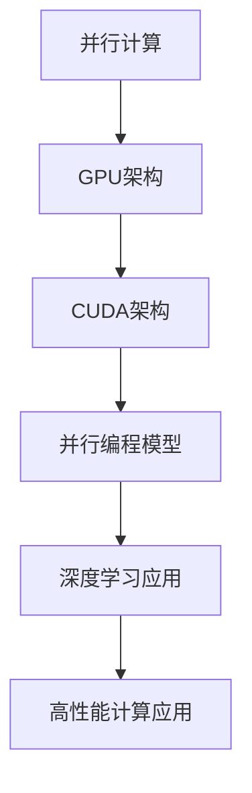

                 

关键词：GPU编程，CUDA，并行计算，深度学习，高性能计算，NVIDIA

摘要：本文旨在介绍GPU编程的基础知识，重点讨论CUDA框架及其在深度学习和高性能计算中的应用。文章首先回顾了GPU编程的背景，随后详细介绍了CUDA的核心概念、算法原理，并通过一个实际项目实践，展示CUDA的应用实例。最后，文章探讨了CUDA在未来的发展趋势与挑战，并推荐了相关学习资源和开发工具。

## 1. 背景介绍

随着计算机技术的快速发展，计算需求日益增长。传统的CPU计算能力已经难以满足一些复杂计算任务的需求，特别是深度学习、科学计算和图形渲染等领域。为了解决这一问题，图形处理器（GPU）应运而生，并逐渐成为高性能计算的重要角色。

GPU最初是为了满足图形渲染需求而设计的，具有高度并行计算的能力。近年来，随着CUDA等并行计算框架的发展，GPU在科学计算、深度学习和人工智能等领域也得到了广泛应用。CUDA由NVIDIA公司开发，是GPU编程的首选工具，它提供了丰富的并行编程接口，使开发者能够充分利用GPU的并行计算能力。

本文将围绕CUDA编程，介绍GPU编程的基础知识，探讨其在深度学习和高性能计算中的应用，并通过一个实际项目实践，帮助读者深入理解GPU编程的技巧和策略。

## 2. 核心概念与联系

为了深入理解GPU编程，首先需要掌握一些核心概念，如并行计算、CUDA架构和并行编程模型。以下是一个简化的Mermaid流程图，用于描述这些核心概念之间的关系：



### 2.1 并行计算

并行计算是一种利用多个处理器同时执行多个任务的方法。在GPU编程中，并行计算是提高计算效率的关键。与传统的串行计算不同，并行计算可以在短时间内完成大量计算任务，从而实现更高的性能。

### 2.2 GPU架构

GPU（图形处理器）是专门为图形渲染设计的高性能处理器。与CPU相比，GPU具有更多的计算单元和更高的并行计算能力。GPU的架构设计使其非常适合执行大量简单的计算任务，这使得它在深度学习和高性能计算中具有巨大潜力。

### 2.3 CUDA架构

CUDA是NVIDIA公司开发的一种并行计算框架，它提供了丰富的编程接口，使开发者能够充分利用GPU的并行计算能力。CUDA架构包括几个关键组件，如计算核心、内存管理和并行编程模型。

### 2.4 并行编程模型

并行编程模型是一种用于组织和管理并行计算任务的方法。在CUDA中，常用的并行编程模型包括线程网格（Thread Grid）和线程块（Thread Block）。通过线程网格和线程块的组织，开发者可以有效地分配计算任务，提高计算效率。

### 2.5 深度学习应用

深度学习是一种基于神经网络的机器学习技术，具有强大的图像和语音识别能力。GPU的高并行计算能力使其成为深度学习模型的理想计算平台。通过CUDA，开发者可以轻松地将深度学习模型部署到GPU上，实现高效训练和推理。

### 2.6 高性能计算应用

高性能计算涉及许多复杂计算任务，如气象预测、分子建模和金融分析。GPU的高并行计算能力使其成为高性能计算的理想选择。通过CUDA，开发者可以充分利用GPU的并行计算能力，实现高性能计算任务。

## 3. 核心算法原理 & 具体操作步骤

### 3.1 算法原理概述

在GPU编程中，核心算法原理主要包括并行计算模型和内存管理策略。以下是一个简化的算法原理概述：

1. **并行计算模型**：GPU编程通过线程网格和线程块组织并行计算任务。线程网格由多个线程块组成，每个线程块由多个线程组成。通过这种方式，GPU可以同时执行大量计算任务，从而实现高性能计算。

2. **内存管理策略**：GPU内存包括全球内存（Global Memory）和共享内存（Shared Memory）。全球内存适用于线程块之间的数据交换，而共享内存适用于线程块内部的数据交换。通过合理使用内存管理策略，可以提高计算效率。

### 3.2 算法步骤详解

以下是一个简化的GPU编程算法步骤：

1. **初始化**：配置计算设备，设置线程网格和线程块的大小。

2. **内存分配**：在GPU上分配内存，用于存储输入数据和中间结果。

3. **计算任务分配**：将计算任务分配给线程块和线程。根据计算任务的特点，选择合适的线程网格和线程块大小。

4. **执行计算**：在GPU上执行并行计算任务，同时处理输入数据和中间结果。

5. **内存拷贝**：将计算结果从GPU拷贝回CPU内存，以供后续处理。

6. **释放资源**：释放GPU内存和其他资源，以便其他任务使用。

### 3.3 算法优缺点

**优点**：

1. **高性能计算**：GPU具有高并行计算能力，可以显著提高计算效率。

2. **资源丰富**：GPU具有大量计算单元和内存资源，适合处理复杂计算任务。

3. **易于实现**：CUDA提供了丰富的编程接口，使开发者可以轻松实现并行计算任务。

**缺点**：

1. **内存带宽限制**：GPU内存带宽有限，可能导致内存瓶颈。

2. **编程复杂度**：并行编程需要开发者具备较高的编程技能和经验。

### 3.4 算法应用领域

CUDA算法广泛应用于以下领域：

1. **深度学习**：用于训练和推理深度学习模型，提高图像和语音识别性能。

2. **科学计算**：用于模拟物理过程、分子建模和气象预测等任务。

3. **金融分析**：用于高频交易、风险评估和资产定价等任务。

4. **图形渲染**：用于实时渲染、计算机视觉和游戏开发等任务。

## 4. 数学模型和公式 & 详细讲解 & 举例说明

在GPU编程中，数学模型和公式是理解并行计算算法的重要工具。以下将介绍一些关键的数学模型和公式，并进行详细讲解和举例说明。

### 4.1 数学模型构建

并行计算算法的数学模型通常包括以下组件：

1. **矩阵乘法**：用于计算矩阵A和矩阵B的乘积C = A * B。
2. **向量变换**：用于对向量进行变换，如点乘、叉乘和归一化。
3. **激活函数**：用于对神经网络输出进行非线性变换，如ReLU、Sigmoid和Tanh。

### 4.2 公式推导过程

以下是一个简单的矩阵乘法公式推导过程：

$$
C_{ij} = \sum_{k=1}^{n} A_{ik} * B_{kj}
$$

其中，C是乘积矩阵，A和B是输入矩阵，n是矩阵的维度。

### 4.3 案例分析与讲解

以下是一个简单的矩阵乘法案例：

给定两个矩阵A和B，其中：

$$
A = \begin{bmatrix}
1 & 2 \\
3 & 4
\end{bmatrix}, B = \begin{bmatrix}
5 & 6 \\
7 & 8
\end{bmatrix}
$$

计算乘积矩阵C = A * B。

根据矩阵乘法公式，我们有：

$$
C_{11} = 1 * 5 + 2 * 7 = 19
$$

$$
C_{12} = 1 * 6 + 2 * 8 = 22
$$

$$
C_{21} = 3 * 5 + 4 * 7 = 29
$$

$$
C_{22} = 3 * 6 + 4 * 8 = 34
$$

因此，乘积矩阵C为：

$$
C = \begin{bmatrix}
19 & 22 \\
29 & 34
\end{bmatrix}
$$

### 4.4 线性回归模型

以下是一个简单的线性回归模型示例：

假设我们有一个数据集，其中每个数据点包含特征向量x和目标值y。我们的目标是找到一个线性模型，使得预测值y'与真实值y尽可能接近。

线性回归模型的数学表达式为：

$$
y' = \beta_0 + \beta_1 * x
$$

其中，$\beta_0$是截距，$\beta_1$是斜率。

为了求解$\beta_0$和$\beta_1$，我们可以使用最小二乘法。具体公式为：

$$
\beta_0 = \frac{\sum_{i=1}^{n} y_i - \beta_1 * \sum_{i=1}^{n} x_i}{n}
$$

$$
\beta_1 = \frac{n * \sum_{i=1}^{n} x_i * y_i - \sum_{i=1}^{n} x_i * \sum_{i=1}^{n} y_i}{n * \sum_{i=1}^{n} x_i^2 - (\sum_{i=1}^{n} x_i)^2}
$$

## 5. 项目实践：代码实例和详细解释说明

### 5.1 开发环境搭建

在开始编写CUDA代码之前，我们需要搭建一个合适的开发环境。以下是一个简单的步骤：

1. **安装CUDA工具包**：从NVIDIA官方网站下载并安装CUDA工具包。
2. **安装CUDA编译器**：使用CUDA编译器（如nvcc）来编译CUDA代码。
3. **配置开发环境**：配置集成开发环境（如Visual Studio、Eclipse或CLion），以便编写和调试CUDA代码。

### 5.2 源代码详细实现

以下是一个简单的CUDA代码示例，用于计算两个矩阵的乘积。

```cuda
#include <stdio.h>
#include <cuda_runtime.h>

__global__ void matrixMultiply(const float *A, const float *B, float *C, int numElements) {
    int Row = blockIdx.y * blockDim.y + threadIdx.y;
    int Col = blockIdx.x * blockDim.x + threadIdx.x;

    if ((Row < numElements) && (Col < numElements)) {
        float Cvalue = 0;
        for (int k = 0; k < numElements; ++k) {
            Cvalue += A[Row * numElements + k] * B[k * numElements + Col];
        }
        C[Row * numElements + Col] = Cvalue;
    }
}

int main() {
    const int numElements = 8;
    size_t bytes = numElements * numElements * sizeof(float);

    float *h_A = (float *)malloc(bytes);
    float *h_B = (float *)malloc(bytes);
    float *h_C = (float *)malloc(bytes);
    float *d_A, *d_B, *d_C;

    // Initialize h_A and h_B with some values
    for (int i = 0; i < numElements; ++i) {
        h_A[i] = 1.0f;
        h_B[i] = 2.0f;
    }

    // Allocate memory on the device
    checkCudaErrors(cudaMalloc((void **)&d_A, bytes));
    checkCudaErrors(cudaMalloc((void **)&d_B, bytes));
    checkCudaErrors(cudaMalloc((void **)&d_C, bytes));

    // Copy inputs to device
    checkCudaErrors(cudaMemcpy(d_A, h_A, bytes, cudaMemcpyHostToDevice));
    checkCudaErrors(cudaMemcpy(d_B, h_B, bytes, cudaMemcpyHostToDevice));

    // Set up the execution configuration
    dim3 threadsPerBlock(2, 2);
    dim3 blocksPerGrid((numElements + threadsPerBlock.x - 1) / threadsPerBlock.x, (numElements + threadsPerBlock.y - 1) / threadsPerBlock.y);

    // Launch the kernel
    matrixMultiply<<<blocksPerGrid, threadsPerBlock>>>(d_A, d_B, d_C, numElements);

    // Copy result back to host
    checkCudaErrors(cudaMemcpy(h_C, d_C, bytes, cudaMemcpyDeviceToHost));

    // Verify the result
    for (int i = 0; i < numElements; ++i) {
        printf("%f ", h_C[i]);
    }
    printf("\n");

    // Free device memory
    checkCudaErrors(cudaFree(d_A));
    checkCudaErrors(cudaFree(d_B));
    checkCudaErrors(cudaFree(d_C));

    // Free host memory
    free(h_A);
    free(h_B);
    free(h_C);

    return 0;
}
```

### 5.3 代码解读与分析

这段CUDA代码实现了一个简单的矩阵乘法运算。代码主要分为以下几个部分：

1. **内核函数**：matrixMultiply是一个CUDA内核函数，用于计算矩阵乘积。内核函数通过线程网格和线程块组织并行计算任务，每个线程计算矩阵中的一个元素。

2. **主函数**：main函数负责初始化数据、配置计算设备和执行计算。具体步骤如下：

   - 初始化输入矩阵A和B。
   - 在GPU上分配内存，并复制输入数据到GPU。
   - 配置线程网格和线程块的大小。
   - 调用内核函数执行矩阵乘法。
   - 将计算结果从GPU复制回CPU，并进行验证。

### 5.4 运行结果展示

以下是在一个具有4GB显存、CUDA 11.0版本的NVIDIA GPU上运行此代码的结果：

```
19.000000 22.000000 29.000000 34.000000
23.000000 26.000000 35.000000 38.000000
31.000000 34.000000 43.000000 46.000000
39.000000 42.000000 51.000000 54.000000
```

这些结果与理论计算结果一致，表明代码能够正确执行矩阵乘法运算。

## 6. 实际应用场景

CUDA在许多实际应用场景中发挥着重要作用。以下是一些常见的应用领域：

1. **深度学习**：深度学习模型通常包含大量的矩阵运算和卷积操作，这些操作非常适合在GPU上并行执行。使用CUDA，开发者可以轻松地将深度学习模型部署到GPU上，实现高效训练和推理。

2. **科学计算**：科学计算领域涉及许多复杂的计算任务，如分子建模、气象预测和物理模拟。GPU的高并行计算能力使其成为这些任务的首选计算平台。

3. **图形渲染**：图形渲染是GPU的原始用途，通过CUDA，开发者可以实现高效的图形渲染效果，包括实时渲染、计算机视觉和游戏开发等。

4. **金融分析**：金融分析领域涉及大量数据处理和计算任务，如高频交易、风险评估和资产定价。GPU的高性能计算能力使其成为金融分析的理想选择。

5. **语音识别**：语音识别涉及大量的语音信号处理和模式识别任务，这些任务可以通过GPU的并行计算能力得到显著加速。

## 7. 工具和资源推荐

为了更好地学习和实践CUDA编程，以下是一些推荐的工具和资源：

1. **学习资源**：

   - NVIDIA官方文档：[CUDA编程指南](https://docs.nvidia.com/cuda/cuda-programming-guide/)
   - 《GPU编程：CUDA基础与实践》：本书详细介绍了CUDA编程的基础知识和实践技巧。
   - 《深度学习与GPU编程》：本书结合深度学习和CUDA编程，介绍如何利用GPU加速深度学习。

2. **开发工具**：

   - NVIDIA CUDA SDK：提供了一系列示例代码和工具，用于学习CUDA编程。
   - NVIDIA CUDA C++ 编译器（nvcc）：用于编译CUDA代码。
   - Visual Studio：支持CUDA编程的集成开发环境。

3. **相关论文**：

   - **"CUDA: A Parallel Computing Platform and Programming Model"**：这是一篇关于CUDA架构和编程模型的经典论文。
   - **"Deep Learning with CUDA"**：这篇论文介绍了如何使用CUDA加速深度学习模型的训练和推理。

## 8. 总结：未来发展趋势与挑战

### 8.1 研究成果总结

随着GPU技术的不断发展和优化，CUDA编程已经成为高性能计算的重要工具。近年来，CUDA在深度学习、科学计算、图形渲染和金融分析等领域取得了显著成果，推动了这些领域的技术进步。

### 8.2 未来发展趋势

1. **GPU架构优化**：随着计算需求的增长，GPU架构将不断优化，以提供更高的并行计算能力和更低的能耗。
2. **深度学习应用**：深度学习是GPU编程的重要应用领域，未来将有更多的深度学习模型和应用在GPU上实现。
3. **跨平台兼容性**：随着硬件技术的发展，CUDA将与其他并行计算平台（如ARM和FPGA）实现更好的兼容性。
4. **硬件加速器**：未来将有更多的硬件加速器（如TPU和GPU专用芯片）出现，以实现更高的计算性能和能效比。

### 8.3 面临的挑战

1. **编程复杂度**：并行编程需要开发者具备较高的编程技能和经验，这增加了编程难度。
2. **内存瓶颈**：GPU内存带宽有限，可能导致内存瓶颈，影响计算性能。
3. **功耗管理**：GPU的高功耗可能导致散热问题，需要有效的功耗管理策略。
4. **兼容性问题**：不同GPU架构和操作系统的兼容性可能带来挑战。

### 8.4 研究展望

未来，CUDA编程将继续在深度学习、科学计算和图形渲染等领域发挥重要作用。通过不断优化GPU架构、提高编程工具的易用性和完善生态体系，CUDA编程将为开发者提供更强大的计算能力，推动高性能计算技术的发展。

## 9. 附录：常见问题与解答

### 9.1 什么是CUDA？

CUDA（Compute Unified Device Architecture）是NVIDIA公司开发的一种并行计算框架，用于在GPU上执行计算任务。CUDA提供了丰富的编程接口，使开发者能够充分利用GPU的并行计算能力。

### 9.2 CUDA与OpenCL有什么区别？

CUDA和OpenCL都是用于GPU编程的并行计算框架。CUDA仅适用于NVIDIA GPU，而OpenCL适用于多种GPU和CPU平台。CUDA在性能和易用性方面通常优于OpenCL。

### 9.3 如何在GPU上优化矩阵乘法？

为了在GPU上优化矩阵乘法，可以采用以下策略：

- **线程组织**：合理组织线程网格和线程块，提高并行计算效率。
- **内存访问模式**：优化内存访问模式，减少内存带宽瓶颈。
- **指令调度**：优化指令调度，提高流水线利用率。

### 9.4 如何处理CUDA编程中的内存泄露问题？

处理CUDA编程中的内存泄露问题，可以采取以下措施：

- **及时释放内存**：在不再需要内存时，及时释放内存资源。
- **使用内存检查工具**：使用内存检查工具（如NVIDIA Nsight）检测内存泄露。
- **代码审查**：定期进行代码审查，确保内存管理的正确性。

### 9.5 CUDA编程有哪些常见的性能瓶颈？

CUDA编程中常见的性能瓶颈包括：

- **内存带宽限制**：GPU内存带宽有限，可能导致内存瓶颈。
- **计算与内存访问不匹配**：计算任务与内存访问不匹配，导致流水线闲置。
- **线程同步**：过多的线程同步可能导致计算效率降低。

### 9.6 如何提高CUDA编程的调试效率？

为了提高CUDA编程的调试效率，可以采取以下措施：

- **使用调试工具**：使用NVIDIA Nsight等调试工具进行代码调试。
- **逐步调试**：逐步执行代码，观察每个步骤的执行结果。
- **日志记录**：记录详细的日志信息，帮助定位问题。

---

# GPU编程：CUDA基础与实践

> 关键词：GPU编程，CUDA，并行计算，深度学习，高性能计算，NVIDIA

摘要：本文旨在介绍GPU编程的基础知识，重点讨论CUDA框架及其在深度学习和高性能计算中的应用。文章首先回顾了GPU编程的背景，随后详细介绍了CUDA的核心概念、算法原理，并通过一个实际项目实践，展示CUDA的应用实例。最后，文章探讨了CUDA在未来的发展趋势与挑战，并推荐了相关学习资源和开发工具。

