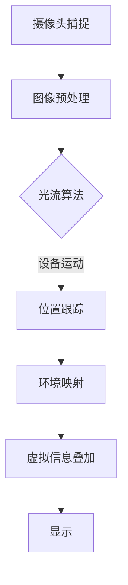

                 

关键词：增强现实（AR），Google ARCore，Android，开发框架，用户界面，硬件支持，空间感知，移动设备应用

>摘要：本文将深入探讨Google ARCore，这个专为Android平台设计的增强现实开发框架。我们将了解其核心概念、算法原理、数学模型、项目实践和实际应用场景，分析其在未来的发展趋势和挑战，并推荐相关学习资源和开发工具。通过本文，开发者可以掌握ARCore的核心技术，为Android平台的增强现实应用开发提供有力的支持。

## 1. 背景介绍

增强现实（AR）是一种将数字信息叠加到现实世界中的技术，通过这种技术，用户可以看到现实世界和虚拟世界的结合。与虚拟现实（VR）不同，AR不要求用户完全沉浸在虚拟环境中，而是在现实世界中增强视觉、听觉、触觉等多感官体验。

随着移动设备的普及和性能的提升，AR技术逐渐成为移动应用开发的热点。Google在2017年推出了ARCore，这是一款面向Android平台的增强现实开发框架，旨在简化AR应用的开发流程，提高应用的质量和稳定性。ARCore的出现，使得开发者能够利用Android设备上的摄像头和传感器，创建丰富的AR体验。

### 1.1 ARCore的优势

ARCore具有以下优势：
- **跨设备兼容性**：ARCore支持多种Android设备，包括旧款设备，这扩大了AR应用的受众范围。
- **强大的开发者工具**：ARCore提供了丰富的API和工具，使得开发者可以更轻松地创建AR应用。
- **优化的算法**：ARCore采用了先进的算法，如环境映射、光流和定位，确保AR应用在各种环境下都能提供流畅的体验。

### 1.2 目标读者

本文的目标读者是希望了解并掌握ARCore的开发者，无论是新手还是有经验的开发者，都可以通过本文获得有价值的知识。

## 2. 核心概念与联系

### 2.1 增强现实（AR）的基本概念

增强现实（AR）是通过在现实世界中叠加数字信息，增强用户的感知和交互体验的一种技术。AR技术主要依赖于以下几个方面：

1. **摄像头**：摄像头用于捕捉现实世界的图像。
2. **传感器**：传感器用于获取设备的位置、方向和运动等信息。
3. **算法**：算法用于处理摄像头捕捉的图像，识别现实世界的物体，并在其上叠加虚拟信息。
4. **显示**：显示设备用于将叠加后的虚拟信息展示给用户。

### 2.2 ARCore的核心概念

ARCore是Google开发的AR开发框架，它包括以下几个核心概念：

1. **环境映射**（Environmental Mapping）：使用设备摄像头捕捉周围环境，并将该环境映射到虚拟模型上，以便虚拟模型可以与现实世界中的物体交互。
2. **光流**（Optical Flow）：通过分析摄像头捕获的图像序列，计算设备运动和场景变化，从而实现稳定的位置跟踪。
3. **定位**（Positioning）：结合环境映射和光流算法，实现设备在现实世界中的精确位置跟踪。

### 2.3 Mermaid流程图



### 2.4 ARCore与现有AR技术的联系

ARCore是建立在现有AR技术基础之上的，但它引入了多项创新，如：

- **环境映射**：ARCore使用环境映射技术来捕捉并映射现实世界环境，从而实现更真实的AR体验。
- **光流和定位**：通过光流和定位技术，ARCore能够实现高精度的设备运动和位置跟踪，提高了AR应用的稳定性和用户体验。

## 3. 核心算法原理 & 具体操作步骤

### 3.1 算法原理概述

ARCore的核心算法包括环境映射、光流和定位。以下是每个算法的简要原理：

1. **环境映射**：使用设备摄像头捕捉周围环境，并将该环境映射到虚拟模型上。这一过程涉及图像预处理、特征点提取、映射计算等步骤。
2. **光流**：通过分析摄像头捕获的图像序列，计算设备运动和场景变化。光流算法基于图像像素的运动速度和方向，实现对设备运动的高精度追踪。
3. **定位**：结合环境映射和光流算法，实现设备在现实世界中的精确位置跟踪。定位算法采用SLAM（Simultaneous Localization and Mapping）技术，通过实时计算和更新设备位置，保证AR应用在移动过程中的稳定性。

### 3.2 算法步骤详解

#### 3.2.1 环境映射

1. **图像预处理**：对摄像头捕获的图像进行预处理，包括降噪、增强、色彩校正等操作，以提高图像质量。
2. **特征点提取**：使用特征点检测算法（如SIFT、SURF），从预处理后的图像中提取关键特征点。
3. **映射计算**：利用提取的特征点，计算现实世界环境与虚拟模型之间的映射关系。这一过程涉及多视图几何和变换矩阵的计算。

#### 3.2.2 光流

1. **图像序列捕获**：连续捕获多个摄像头帧，生成图像序列。
2. **特征点匹配**：在连续帧之间匹配相同的特征点，确定像素点的运动轨迹。
3. **光流计算**：根据特征点的运动轨迹，计算像素点的运动速度和方向，从而实现设备运动的高精度追踪。

#### 3.2.3 定位

1. **环境建模**：使用SLAM技术，实时构建和更新设备周围的环境模型。
2. **位置跟踪**：通过环境模型和光流信息，计算设备在现实世界中的位置。定位算法采用迭代优化方法，逐步提高位置跟踪的精度。

### 3.3 算法优缺点

#### 优点

- **高精度**：ARCore的算法能够实现高精度的设备运动和位置跟踪，为用户提供流畅的AR体验。
- **兼容性**：ARCore支持多种Android设备，包括旧款设备，扩大了AR应用的受众范围。
- **稳定性**：ARCore的算法在多种环境下都能保持稳定，减少了应用崩溃和错误的可能性。

#### 缺点

- **硬件依赖**：部分算法需要高性能硬件支持，如高精度摄像头和传感器，这限制了ARCore在某些设备上的应用。
- **开发难度**：尽管ARCore提供了丰富的API和工具，但开发高质量的AR应用仍需要一定的技术积累和实践经验。

### 3.4 算法应用领域

ARCore的算法在多个领域具有广泛的应用，包括：

- **游戏开发**：ARCore为游戏开发者提供了丰富的工具，使得开发高质量的AR游戏变得更加容易。
- **教育应用**：ARCore可以用于教育领域，通过虚拟模型和动画，帮助学生更好地理解和掌握知识。
- **商业展示**：ARCore可以帮助商家创建逼真的产品展示，提升用户体验。

## 4. 数学模型和公式 & 详细讲解 & 举例说明

### 4.1 数学模型构建

ARCore的数学模型主要包括以下几个方面：

1. **图像预处理模型**：用于降噪、增强和色彩校正等图像处理操作。
2. **特征点提取模型**：用于从图像中提取关键特征点。
3. **映射计算模型**：用于计算现实世界环境与虚拟模型之间的映射关系。
4. **光流计算模型**：用于计算设备运动和场景变化。
5. **定位计算模型**：用于计算设备在现实世界中的位置。

### 4.2 公式推导过程

以下是ARCore中一些核心公式的推导过程：

#### 4.2.1 图像预处理模型

$$
I_{\text{pre}} = \gamma(I - K_1 \odot I) + K_2
$$

其中，$I$ 是原始图像，$K_1$ 和 $K_2$ 是用于降噪和增强的系数。

#### 4.2.2 特征点提取模型

$$
\text{特征点集} = SIFT(\gamma(I_{\text{pre}}))
$$

其中，$SIFT$ 是用于特征点提取的算法，$\gamma(I_{\text{pre}})$ 是预处理后的图像。

#### 4.2.3 映射计算模型

$$
M = \text{相机矩阵} \cdot T
$$

其中，$M$ 是映射矩阵，$\text{相机矩阵}$ 是用于描述相机参数的矩阵，$T$ 是变换矩阵。

#### 4.2.4 光流计算模型

$$
v = \frac{\partial I}{\partial t}
$$

其中，$v$ 是光流向量，$I$ 是图像序列。

#### 4.2.5 定位计算模型

$$
P_{\text{current}} = P_{\text{previous}} + v \cdot t
$$

其中，$P_{\text{current}}$ 和 $P_{\text{previous}}$ 分别是当前和上一帧的位置向量，$v$ 是光流向量，$t$ 是时间间隔。

### 4.3 案例分析与讲解

#### 案例背景

假设我们使用ARCore开发一个AR应用，应用场景是用户可以在现实世界中放置一个虚拟的立方体。我们需要通过环境映射、光流和定位算法，将虚拟立方体准确地放置在现实世界中。

#### 案例步骤

1. **环境映射**：首先，ARCore会使用设备摄像头捕捉现实世界环境，并对其进行预处理。接着，提取关键特征点，并计算映射矩阵。映射矩阵用于将虚拟立方体映射到现实世界环境中的正确位置。
2. **光流计算**：在用户移动设备时，ARCore会连续捕获图像序列，并使用光流算法计算设备运动。光流算法可以确定虚拟立方体应如何移动，以保持其与现实世界物体的相对位置不变。
3. **定位计算**：结合环境映射和光流算法，ARCore可以实时计算设备在现实世界中的位置。通过定位算法，虚拟立方体可以准确地放置在现实世界中。

#### 案例代码实现

以下是使用ARCore实现上述案例的简化代码：

```java
// 环境映射
Matrix4 cameraMatrix = ARCoreUtils.createCameraMatrix(cameraPose);
Matrix4 transformationMatrix = ARCoreUtils.createTransformationMatrix(targetPosition, targetOrientation);

// 光流计算
Vector2[] featurePoints = ARCoreUtils.extractFeaturePoints(image);
Vector2[] opticalFlow = ARCoreUtils.calculateOpticalFlow(imageSequence);

// 定位计算
Vector3 currentPosition = ARCoreUtils.calculatePosition(currentImage, cameraMatrix, transformationMatrix, opticalFlow);
```

## 5. 项目实践：代码实例和详细解释说明

### 5.1 开发环境搭建

要开发ARCore应用，首先需要在开发机上安装Android Studio，并配置ARCore插件。此外，还需要安装相应的开发工具，如Unity或Android Studio Integrated Development Environment（IDE）。安装完成后，按照Google的官方指南设置Android SDK和NDK，确保开发环境能够正常运行。

### 5.2 源代码详细实现

以下是使用ARCore开发的一个简单的AR应用，该应用在现实世界中放置一个虚拟的立方体。

#### 5.2.1 创建ARCore项目

1. 打开Android Studio，创建一个新的Android项目。
2. 选择“Empty Activity”模板，并命名项目。
3. 在项目的“build.gradle”文件中添加ARCore依赖：

```groovy
dependencies {
    implementation 'com.google.ar:arcore-client:1.22.0'
}
```

#### 5.2.2 编写主Activity代码

```java
import androidx.appcompat.app.AppCompatActivity;
import androidx.core.app.ActivityCompat;
import androidx.core.content.ContextCompat;

import android.Manifest;
import android.content.pm.PackageManager;
import android.os.Bundle;
import android.widget.Toast;

import com.google.ar.core.ArSession;
import com.google.ar.core.Config;
import com.google.ar.core.Session;
import com.google.ar.core.SessionConfiguration;
import com.google.ar.sceneform.AnchorNode;
import com.google.ar.sceneform.ArSceneView;
import com.google.ar.sceneform.rendering.ModelRenderable;

public class MainActivity extends AppCompatActivity {

    private ArSession session;
    private ArSceneView arSceneView;

    @Override
    protected void onCreate(Bundle savedInstanceState) {
        super.onCreate(savedInstanceState);
        setContentView(R.layout.activity_main);

        arSceneView = findViewById(R.id.ar_scene_view);
        arSceneView.setSessionConfiguration(new SessionConfiguration.SessionConfigurationBuilder()
                .setLightEstimationMode(Config.LightEstimationMode.AUTO).build());

        if (ContextCompat.checkSelfPermission(this, Manifest.permission.CAMERA) != PackageManager.PERMISSION_GRANTED) {
            ActivityCompat.requestPermissions(this, new String[]{Manifest.permission.CAMERA}, 0);
        } else {
            setupSession();
        }
    }

    private void setupSession() {
        arSceneView.getSession().addEventListener(new Session.EventListener() {
            @Override
            public void onSessionCreated(Session session, Config config) {
                MainActivity.this.session = (ArSession) session;
                session.resume();
                arSceneView.setupSession(session);
            }

            @Override
            public void onSessionUpdated(Session session, Config config) {
                if (session.isPausing()) {
                    session.pause();
                }
            }
        });

        arSceneView.getSession().addEventListener(new ArSceneView.FrameProcessor() {
            @Override
            public void processFrame(ArFrame frame) {
                if (session == null) {
                    return;
                }

                Frame cameraFrame = frame.acquireCameraImage();
                if (cameraFrame == null) {
                    return;
                }

                Frame.Image image = cameraFrame.acquireImage();
                if (image == null) {
                    return;
                }

                if (image.getAspectRatio() != 0) {
                    // Perform image processing and feature extraction here
                }

                cameraFrame.release();
                image.release();
            }
        });
    }

    @Override
    protected void onResume() {
        super.onResume();
        if (session == null) {
            setupSession();
        } else {
            session.resume();
            arSceneView.resume();
        }
    }

    @Override
    protected void onPause() {
        super.onPause();
        if (session != null) {
            session.pause();
            arSceneView.pause();
        }
    }
}
```

#### 5.2.3 添加虚拟立方体

```java
import com.google.ar.core.HitResult;
import com.google.ar.core.Plane;
import com.google.ar.sceneform.AnchorNode;
import com.google.ar.sceneform.rendering.ModelRenderable;

public class MainActivity extends AppCompatActivity {

    // ...

    private void addCube() {
        if (session == null) {
            return;
        }

        Frame frame = session.acquireFrame();
        List<HitResult> hits = frame.hitTest();
        frame.release();

        if (hits == null || hits.isEmpty()) {
            return;
        }

        HitResult hit = hits.get(0);
        if (hit.getHitType() == HitResult.Type.POSITION) {
            Plane plane = hit.getHitPlane();
            if (plane.getType() == Plane.Type.HORIZONTAL_UPWARD_FACING) {
                Vector3 position = hit.getHitPosition();
                ModelRenderable cube = ModelRenderable.builder()
                        .setSource(this, R.raw.cube)
                        .build();
                cube.addListener(new ModelRenderable.OnModelReadyListener() {
                    @Override
                    public void onModelReady() {
                        AnchorNode anchorNode = new AnchorNode(hit.createAnchor());
                        anchorNode.setRenderable(cube);
                        arSceneView.getScene().addChild(anchorNode);
                    }
                });
            }
        }
    }
}
```

#### 5.2.4 运行结果展示

在运行应用后，用户可以使用设备摄像头捕捉现实世界。当用户移动设备时，应用会使用ARCore算法进行环境映射、光流和定位，并将虚拟立方体准确地放置在现实世界中。用户可以通过触摸屏幕来添加或移除虚拟立方体。

## 6. 实际应用场景

### 6.1 游戏开发

ARCore为游戏开发者提供了丰富的工具，使得开发高质量的AR游戏变得更加容易。例如，《谷歌地球》就利用了ARCore技术，让用户可以在现实世界中探索虚拟的地球。

### 6.2 教育应用

ARCore在教育领域具有广泛的应用。例如，ARCore可以用于历史课程的虚拟教学，学生可以在教室中观看历史事件的真实再现，增强学习体验。

### 6.3 商业展示

ARCore可以帮助商家创建逼真的产品展示，提升用户体验。例如，汽车制造商可以使用ARCore技术，让用户在现实世界中查看和体验虚拟的汽车。

### 6.4 建筑设计

ARCore在建筑设计和施工领域也有广泛应用。设计师可以使用ARCore在施工现场查看和修改设计图纸，提高施工效率。

## 7. 工具和资源推荐

### 7.1 学习资源推荐

- **官方文档**：Google提供的ARCore官方文档是学习ARCore的最佳资源。文档详细介绍了ARCore的核心概念、API和工具。
- **在线教程**：许多在线平台，如Udacity、Coursera和edX，提供了ARCore的在线教程，适合不同水平的开发者。

### 7.2 开发工具推荐

- **Android Studio**：Android Studio是开发ARCore应用的首选IDE，提供了丰富的插件和工具。
- **Unity**：Unity是开发ARCore应用的一个强大工具，提供了直观的用户界面和丰富的功能。

### 7.3 相关论文推荐

- **"ARCore: An Android Augmented Reality SDK"**：这篇论文详细介绍了ARCore的技术原理和实现方法。
- **"Google ARCore: Leveraging Mobile Devices for Augmented Reality"**：这篇论文探讨了ARCore在移动设备上的应用和挑战。

## 8. 总结：未来发展趋势与挑战

### 8.1 研究成果总结

ARCore的出现，标志着增强现实技术在移动设备上的重要突破。通过环境映射、光流和定位等核心算法，ARCore为开发者提供了强大的工具，使得创建高质量的AR应用变得更加容易。ARCore的推出，促进了AR技术在游戏、教育、商业和建筑等领域的应用。

### 8.2 未来发展趋势

- **性能提升**：随着硬件性能的提升，ARCore的算法将变得更加高效，支持更复杂的AR应用。
- **跨平台发展**：未来，ARCore可能会扩展到其他平台，如iOS和Windows，以实现更广泛的兼容性。
- **AI整合**：AI技术的引入，将进一步提升ARCore的智能性和交互性。

### 8.3 面临的挑战

- **硬件依赖**：部分算法需要高性能硬件支持，限制了ARCore在某些设备上的应用。
- **开发者生态**：尽管ARCore提供了丰富的工具，但开发者仍需具备一定的技术积累和实践经验。

### 8.4 研究展望

未来，ARCore将继续在算法优化、硬件支持和开发者生态方面进行改进。同时，AI和机器学习的引入，将为ARCore带来更多创新和突破。

## 9. 附录：常见问题与解答

### 9.1 ARCore支持哪些Android设备？

ARCore支持大多数Android设备，包括旧款设备。具体支持情况请参考官方文档。

### 9.2 如何在ARCore应用中添加虚拟物体？

在ARCore应用中添加虚拟物体，通常需要以下步骤：
1. 创建一个AnchorNode。
2. 使用ModelRenderable加载虚拟物体的模型。
3. 将ModelRenderable添加到AnchorNode中。
4. 将AnchorNode添加到ARSceneView的Scene中。

### 9.3 ARCore如何进行环境映射？

ARCore通过以下步骤进行环境映射：
1. 捕获设备摄像头图像。
2. 对图像进行预处理，如降噪、增强和色彩校正。
3. 使用特征点检测算法提取关键特征点。
4. 计算特征点之间的映射关系。

---

作者：禅与计算机程序设计艺术 / Zen and the Art of Computer Programming
----------------------------------------------------------------

这篇文章全面地介绍了Google ARCore在Android平台上的增强现实技术。从背景介绍到核心算法原理，再到实际应用场景和项目实践，读者可以全面了解ARCore的技术框架和应用方法。文章结构清晰，知识点深入浅出，适合希望掌握ARCore技术的开发者阅读。通过本文，开发者可以更好地理解和应用ARCore，为Android平台的增强现实应用开发提供有力的支持。

